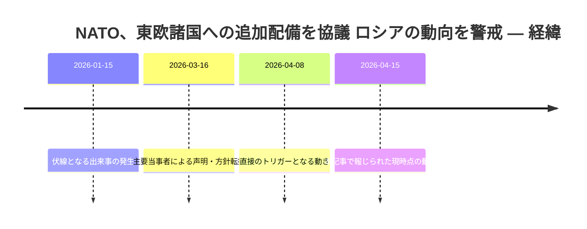
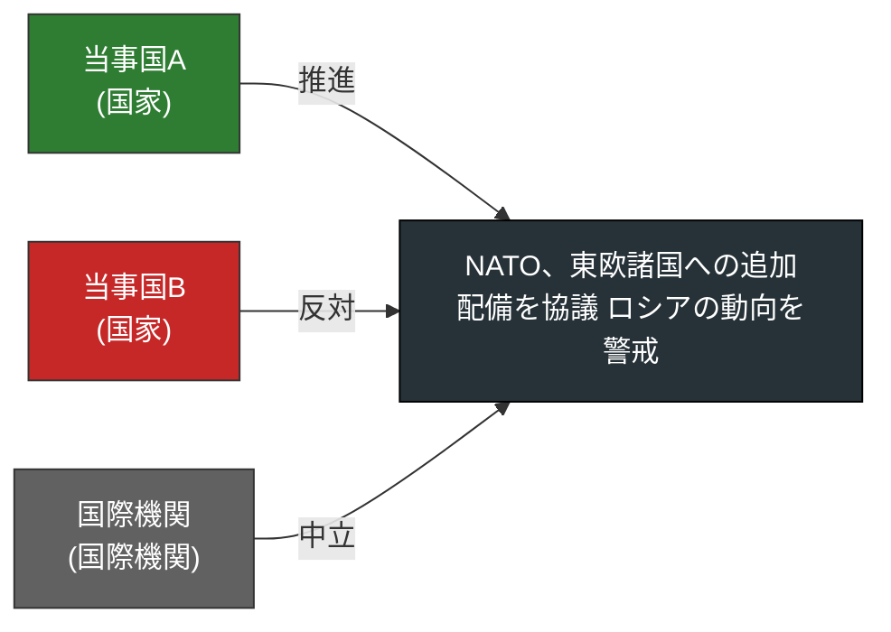
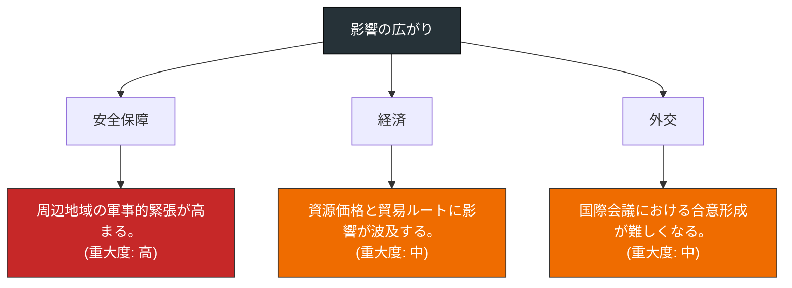
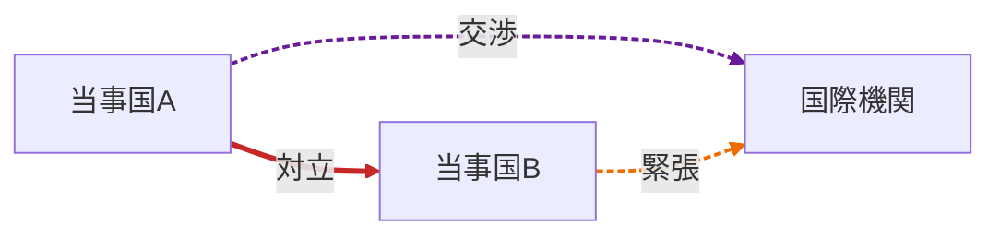
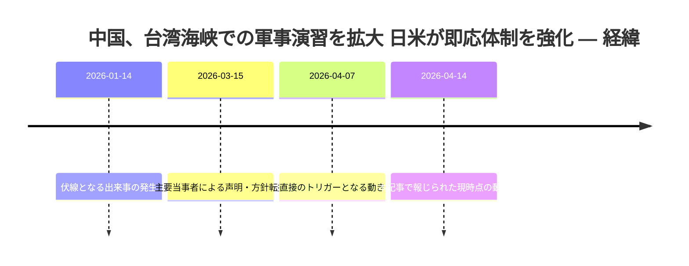
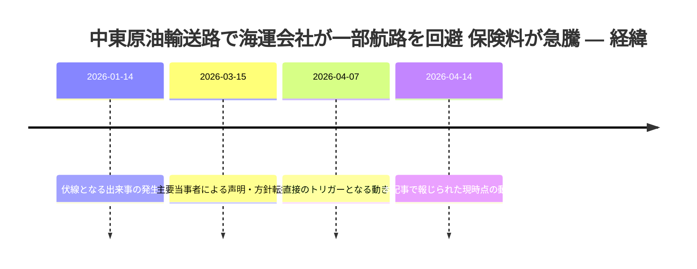
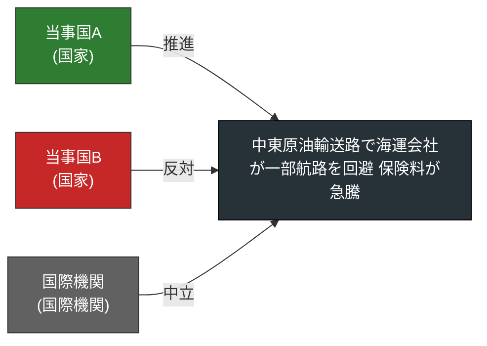
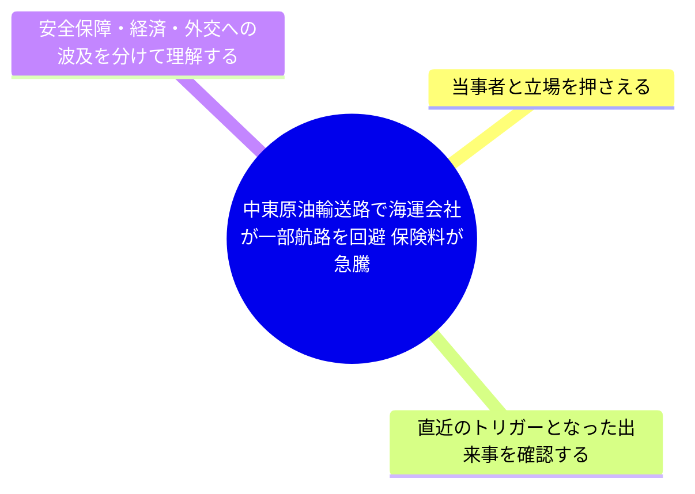

# 地政学ニュース図解レポート 2026-04-17 号

生成日時: 2026-04-17 03:14 / 記事数: 3

## NATO、東欧諸国への追加配備を協議 ロシアの動向を警戒

- **出典:** Mock News Wire ([原文](https://example.com/news/nato-east-europe)) / **公開:** 2026-04-15 09:30

**要約**
NATO加盟国の国防相会議が開催され、東欧諸国への部隊の追加配備が議題にのぼった。ロシア国境に近い加盟国は装備と兵站の強化を求めており、米欧間で費用分担を巡る議論が続いている。

**背景**
近年の地域情勢と過去の合意を踏まえた文脈で捉える必要がある。

**要点**
- 当事者と立場を押さえる
- 直近のトリガーとなった出来事を確認する
- 安全保障・経済・外交への波及を分けて理解する

### 経緯タイムライン

### 当事者マップ

### 影響の広がり

### 当事者の関係ネットワーク

### 押さえるべき論点

### 参考リンク

- [原記事: NATO、東欧諸国への追加配備を協議 ロシアの動向を警戒](https://example.com/news/nato-east-europe) — Mock News Wire
- [関係国の公式声明(例)](https://example.gov/statement) — 当事国政府が発表した関連声明(モック)
- [国際機関の関連レポート(例)](https://example.int/report) — 国際機関が公表した背景資料(モック)

---
## 中国、台湾海峡での軍事演習を拡大 日米が即応体制を強化

- **出典:** Mock News Wire ([原文](https://example.com/news/taiwan-strait-drills)) / **公開:** 2026-04-14 18:05

**要約**
中国軍は台湾周辺での軍事演習を拡大したと発表。日本と米国は共同で即応体制を強化し、海上自衛隊はイージス艦を追加展開した。ASEAN諸国も懸念を表明している。

**背景**
近年の地域情勢と過去の合意を踏まえた文脈で捉える必要がある。

**要点**
- 当事者と立場を押さえる
- 直近のトリガーとなった出来事を確認する
- 安全保障・経済・外交への波及を分けて理解する

### 経緯タイムライン

### 当事者マップ

### 影響の広がり

### 当事者の関係ネットワーク

### 押さえるべき論点

### 参考リンク

- [原記事: 中国、台湾海峡での軍事演習を拡大 日米が即応体制を強化](https://example.com/news/taiwan-strait-drills) — Mock News Wire
- [関係国の公式声明(例)](https://example.gov/statement) — 当事国政府が発表した関連声明(モック)
- [国際機関の関連レポート(例)](https://example.int/report) — 国際機関が公表した背景資料(モック)

---
## 中東原油輸送路で海運会社が一部航路を回避 保険料が急騰

- **出典:** Mock News Wire ([原文](https://example.com/news/strait-of-hormuz-shipping)) / **公開:** 2026-04-14 07:40

**要約**
中東の主要海運会社はホルムズ海峡付近の一部航路を回避する方針を発表。戦争リスク保険料が前月比で倍増し、原油先物価格にも影響を及ぼしている。代替ルートの検討が各社で進む。

**背景**
近年の地域情勢と過去の合意を踏まえた文脈で捉える必要がある。

**要点**
- 当事者と立場を押さえる
- 直近のトリガーとなった出来事を確認する
- 安全保障・経済・外交への波及を分けて理解する

### 経緯タイムライン

### 当事者マップ

### 影響の広がり

### 当事者の関係ネットワーク

### 押さえるべき論点

### 参考リンク

- [原記事: 中東原油輸送路で海運会社が一部航路を回避 保険料が急騰](https://example.com/news/strait-of-hormuz-shipping) — Mock News Wire
- [関係国の公式声明(例)](https://example.gov/statement) — 当事国政府が発表した関連声明(モック)
- [国際機関の関連レポート(例)](https://example.int/report) — 国際機関が公表した背景資料(モック)

---
