# 地政学ニュース図解レポート 2026-04-22 号

生成日時: 2026-04-22 14:42 / 記事数: 5

## トランプ氏、対イラン停戦の延長を表明

- **出典:** NHK 国際 ([原文](http://www3.nhk.or.jp/news/html/20260422/k10015105081000.html)) / **公開:** 2026-04-22 10:27

**要約**
アメリカのトランプ大統領は4月21日、SNSへの投稿でイランとの停戦を延長すると表明しました。パキスタンからイラン攻撃を控えるよう要請されたことを理由に挙げ、協議が結論に至るまで停戦を継続する姿勢を示しました。一方、イラン革命防衛隊系のタスニム通信は、イラン側は停戦延長を要請していないと報じており、両者の認識に食い違いが見られます。停戦の行方は中東情勢の安定を左右する重要局面にあります。

**背景**
米国とイランは軍事的緊張が続くなか停戦協議を進めており、期限切れが迫るタイミングで仲介国パキスタンが関与する形となっていました。両国は核問題や地域の影響力をめぐって長年対立しており、今回の停戦はその緩和策として注目されていました。

**要点**
- トランプ大統領が米・イラン停戦の延長をSNSで表明した
- 延長の背景には仲介国パキスタンからの要請があるとされる
- イラン側は延長を要請していないと報じられ、双方の認識に相違がある

### 経緯タイムライン

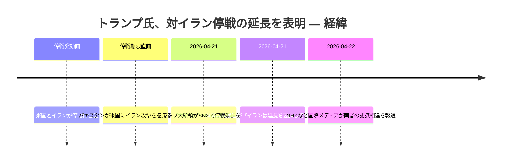
```mermaid
timeline
  title トランプ氏、対イラン停戦の延長を表明 — 経緯
  停戦発効前 : 米国とイランが停戦に合意
  停戦期限直前 : パキスタンが米国にイラン攻撃を控えるよう要請
  2026-04-21 : トランプ大統領がSNSで停戦延長を表明
  2026-04-21 : タスニム通信が『イランは延長を要請していない』と報道
  2026-04-22 : NHKなど国際メディアが両者の認識相違を報道
```

### 当事者マップ

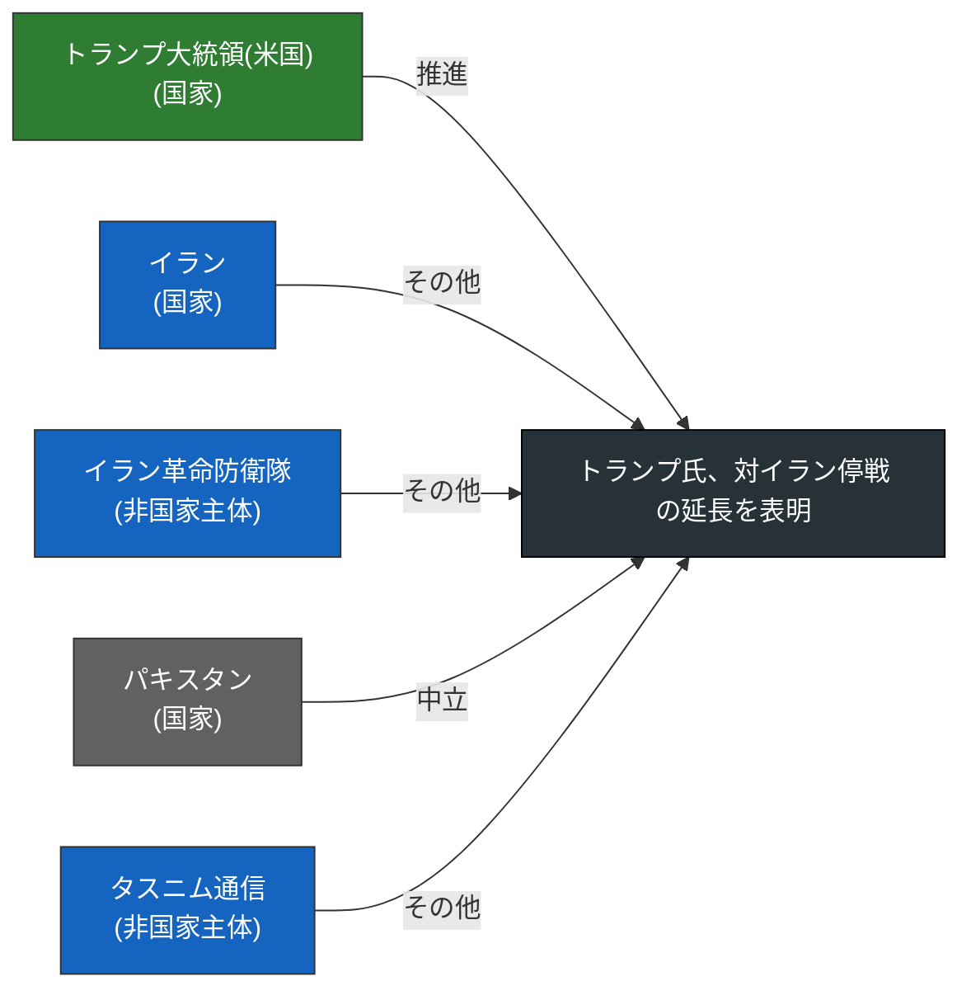
```mermaid
flowchart LR
  T["トランプ氏、対イラン停戦の延長を表明"]
  A0["トランプ大統領(米国)\n(国家)"]
  A0 -- 推進 --> T
  style A0 fill:#2e7d32,color:#fff,stroke:#333
  A1["イラン\n(国家)"]
  A1 -- その他 --> T
  style A1 fill:#1565c0,color:#fff,stroke:#333
  A2["イラン革命防衛隊\n(非国家主体)"]
  A2 -- その他 --> T
  style A2 fill:#1565c0,color:#fff,stroke:#333
  A3["パキスタン\n(国家)"]
  A3 -- 中立 --> T
  style A3 fill:#616161,color:#fff,stroke:#333
  A4["タスニム通信\n(非国家主体)"]
  A4 -- その他 --> T
  style A4 fill:#1565c0,color:#fff,stroke:#333
  style T fill:#263238,color:#fff,stroke:#000
```

### 影響の広がり

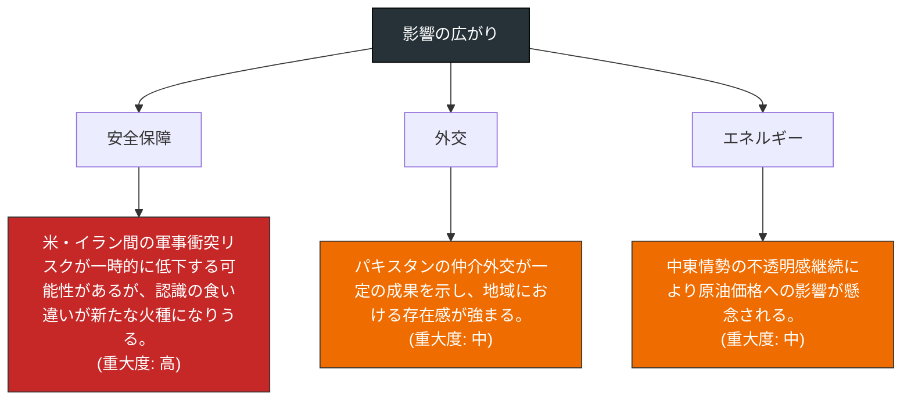
```mermaid
flowchart TB
  R["影響の広がり"]
  D0["安全保障"]
  I0["米・イラン間の軍事衝突リスクが一時的に低下する可能性があるが、認識の食い違いが新たな火種になりうる。\n(重大度: 高)"]
  R --> D0 --> I0
  style I0 fill:#c62828,color:#fff,stroke:#333
  D1["外交"]
  I1["パキスタンの仲介外交が一定の成果を示し、地域における存在感が強まる。\n(重大度: 中)"]
  R --> D1 --> I1
  style I1 fill:#ef6c00,color:#fff,stroke:#333
  D2["エネルギー"]
  I2["中東情勢の不透明感継続により原油価格への影響が懸念される。\n(重大度: 中)"]
  R --> D2 --> I2
  style I2 fill:#ef6c00,color:#fff,stroke:#333
  style R fill:#263238,color:#fff,stroke:#000
```

### 当事者の関係ネットワーク

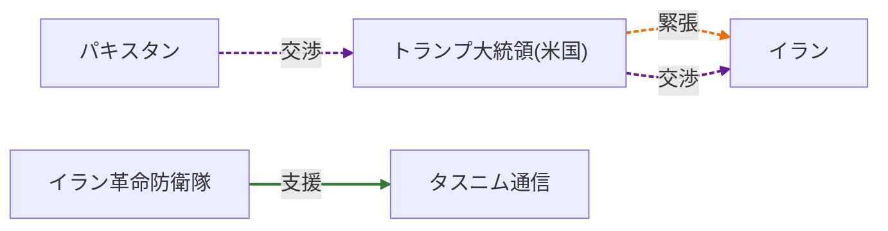
```mermaid
graph LR
  N0["トランプ大統領(米国)"]
  N1["イラン"]
  N2["イラン革命防衛隊"]
  N3["パキスタン"]
  N4["タスニム通信"]
  N0 -->|緊張| N1
  N0 -->|交渉| N1
  N3 -->|交渉| N0
  N2 -->|支援| N4
  linkStyle 0 stroke:#ef6c00,stroke-width:2px,stroke-dasharray:4 2;
  linkStyle 1 stroke:#6a1b9a,stroke-width:2px,stroke-dasharray:4 2;
  linkStyle 2 stroke:#6a1b9a,stroke-width:2px,stroke-dasharray:4 2;
  linkStyle 3 stroke:#2e7d32,stroke-width:2px;
```

### 押さえるべき論点

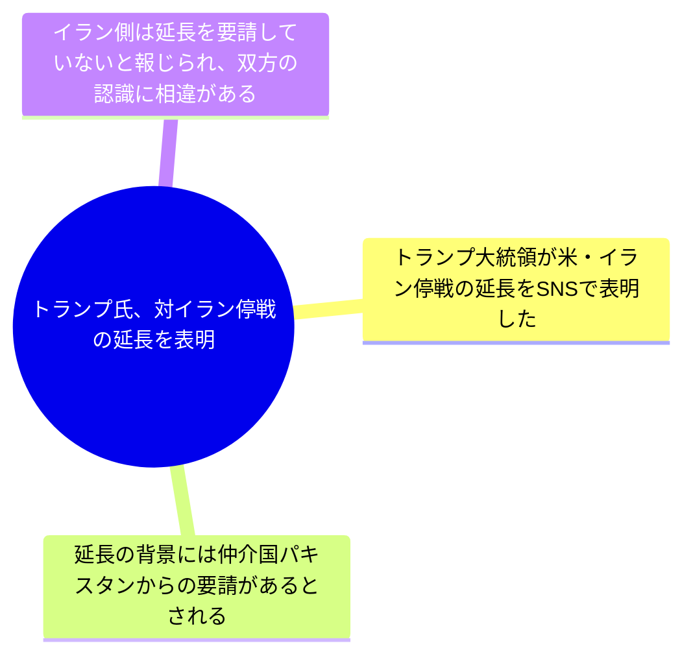
```mermaid
mindmap
  root((トランプ氏、対イラン停戦の延長を表明))
    トランプ大統領が米・イラン停戦の延長をSNSで表明した
    延長の背景には仲介国パキスタンからの要請があるとされる
    イラン側は延長を要請していないと報じられ、双方の認識に相違がある
```

---
## プーチン侵攻継続表明、ゼレンスキーも対抗継続

- **出典:** NHK 国際 ([原文](http://www3.nhk.or.jp/news/html/20260422/k10015105071000.html)) / **公開:** 2026-04-22 08:15

**要約**
ロシアのプーチン大統領は『われわれの結束があってこそ、特別軍事作戦の目標を達成できる』と述べ、ウクライナ侵攻を継続する意向を改めて示した。これに対し、ウクライナのゼレンスキー大統領はロシアに対抗する作戦を継続する方針を重ねて強調した。両首脳の発言により、戦争長期化の見通しが一段と強まっている。停戦に向けた外交的突破口は依然として見えない状況が続いている。

**背景**
2022年2月に始まったロシアのウクライナ侵攻は長期化し、双方とも譲歩の姿勢を見せていない。プーチン政権は『特別軍事作戦』の名目で軍事行動を正当化し続け、ウクライナ側は領土防衛と主権回復を掲げ抗戦を継続している。

**要点**
- プーチン大統領が侵攻継続の意向を改めて表明し、長期戦の構え
- ゼレンスキー大統領も対抗作戦の継続を強調し、妥協の姿勢なし
- 両首脳の強硬姿勢により停戦への道筋は依然不透明

### 経緯タイムライン

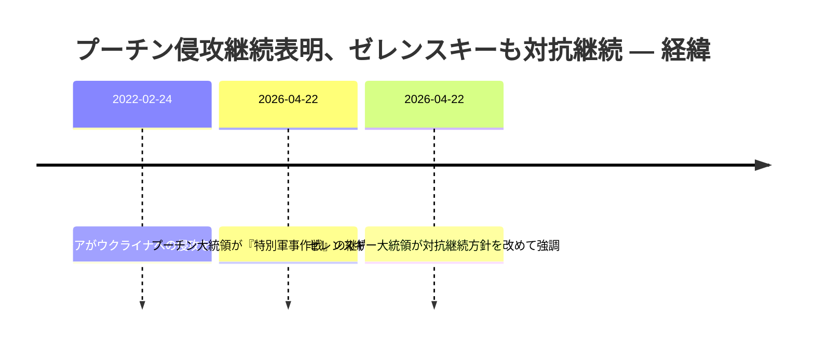
```mermaid
timeline
  title プーチン侵攻継続表明、ゼレンスキーも対抗継続 — 経緯
  2022-02-24 : ロシアがウクライナへの侵攻を開始
  2026-04-22 : プーチン大統領が『特別軍事作戦』の継続意向を表明
  2026-04-22 : ゼレンスキー大統領が対抗継続方針を改めて強調
```

### 当事者マップ

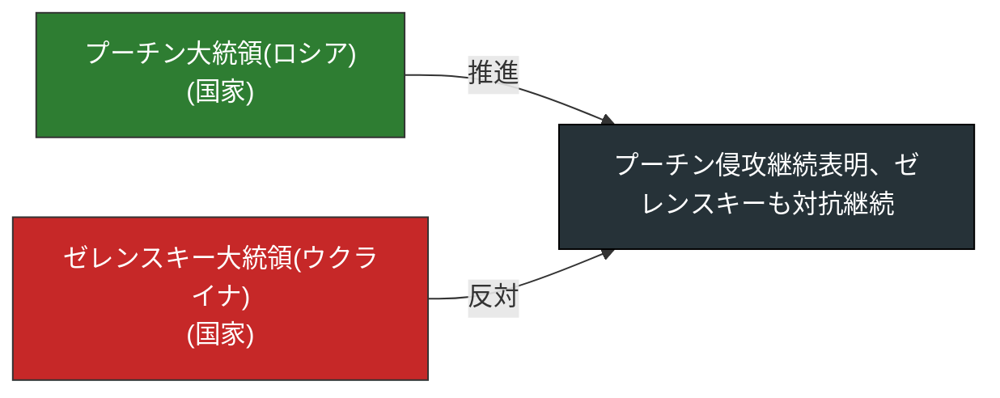
```mermaid
flowchart LR
  T["プーチン侵攻継続表明、ゼレンスキーも対抗継続"]
  A0["プーチン大統領(ロシア)\n(国家)"]
  A0 -- 推進 --> T
  style A0 fill:#2e7d32,color:#fff,stroke:#333
  A1["ゼレンスキー大統領(ウクライナ)\n(国家)"]
  A1 -- 反対 --> T
  style A1 fill:#c62828,color:#fff,stroke:#333
  style T fill:#263238,color:#fff,stroke:#000
```

### 影響の広がり

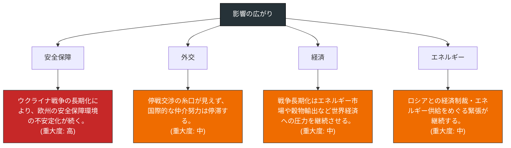
```mermaid
flowchart TB
  R["影響の広がり"]
  D0["安全保障"]
  I0["ウクライナ戦争の長期化により、欧州の安全保障環境の不安定化が続く。\n(重大度: 高)"]
  R --> D0 --> I0
  style I0 fill:#c62828,color:#fff,stroke:#333
  D1["外交"]
  I1["停戦交渉の糸口が見えず、国際的な仲介努力は停滞する。\n(重大度: 中)"]
  R --> D1 --> I1
  style I1 fill:#ef6c00,color:#fff,stroke:#333
  D2["経済"]
  I2["戦争長期化はエネルギー市場や穀物輸出など世界経済への圧力を継続させる。\n(重大度: 中)"]
  R --> D2 --> I2
  style I2 fill:#ef6c00,color:#fff,stroke:#333
  D3["エネルギー"]
  I3["ロシアとの経済制裁・エネルギー供給をめぐる緊張が継続する。\n(重大度: 中)"]
  R --> D3 --> I3
  style I3 fill:#ef6c00,color:#fff,stroke:#333
  style R fill:#263238,color:#fff,stroke:#000
```

### 当事者の関係ネットワーク

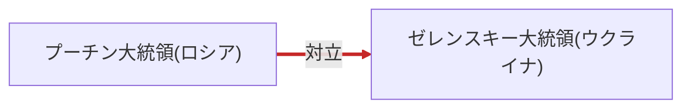
```mermaid
graph LR
  N0["プーチン大統領(ロシア)"]
  N1["ゼレンスキー大統領(ウクライナ)"]
  N0 -->|対立| N1
  linkStyle 0 stroke:#c62828,stroke-width:3px;
```

### 押さえるべき論点

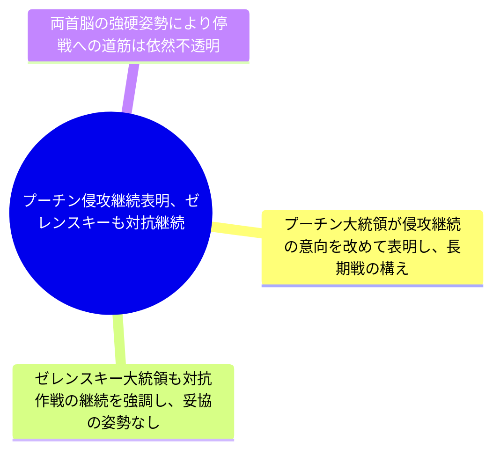
```mermaid
mindmap
  root((プーチン侵攻継続表明、ゼレンスキーも対抗継続))
    プーチン大統領が侵攻継続の意向を改めて表明し、長期戦の構え
    ゼレンスキー大統領も対抗作戦の継続を強調し、妥協の姿勢なし
    両首脳の強硬姿勢により停戦への道筋は依然不透明
```

---
## 頼総統アフリカ訪問中止、中国圧力を非難

- **出典:** NHK 国際 ([原文](http://www3.nhk.or.jp/news/html/20260421/k10015104981000.html)) / **公開:** 2026-04-21 23:23

**要約**
台湾の総統府は4月21日、頼清徳総統が22日から予定していたアフリカ訪問を見合わせると発表した。総統府は、専用機が通過予定だった一部の国が中国の圧力を受けて飛行許可を取り消したことが原因だと説明している。台湾側は中国の外交的圧力を公然と非難しており、台湾の国際的プレゼンス確保を巡る米中・両岸関係の緊張を改めて浮き彫りにした。

**背景**
台湾はアフリカにおいて外交関係を持つ国が極めて限られ、中国は「一つの中国」原則のもと台湾指導者の外遊や通過寄港(トランジット)を阻止する外交攻勢を続けている。頼清徳氏は2024年に総統に就任して以降、中国からの軍事・外交圧力が強まっており、今回の訪問も成立可否が注目されていた。

**要点**
- 頼清徳総統のアフリカ訪問が専用機の飛行許可取り消しで中止に追い込まれた
- 台湾側は背後に中国の外交圧力があると明確に非難している
- 台湾指導者の外遊・トランジットを阻もうとする中国の攻勢が続き、両岸関係の緊張が続いている

### 経緯タイムライン

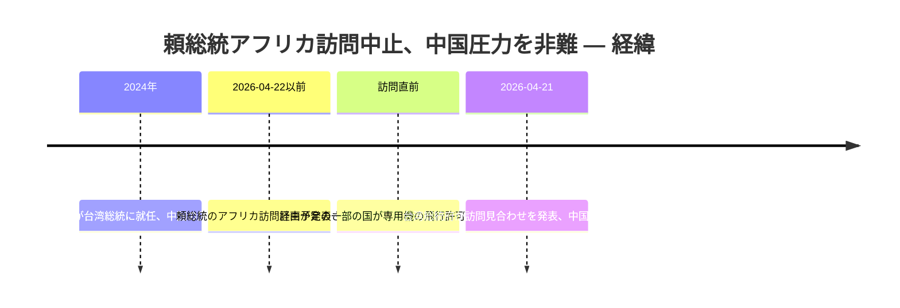
```mermaid
timeline
  title 頼総統アフリカ訪問中止、中国圧力を非難 — 経緯
  2024年 : 頼清徳氏が台湾総統に就任、中国の圧力が継続
  2026-04-22以前 : 頼総統のアフリカ訪問計画が発表される
  訪問直前 : 経由予定の一部の国が専用機の飛行許可を取り消し
  2026-04-21 : 台湾総統府が訪問見合わせを発表、中国の圧力を非難
```

### 当事者マップ

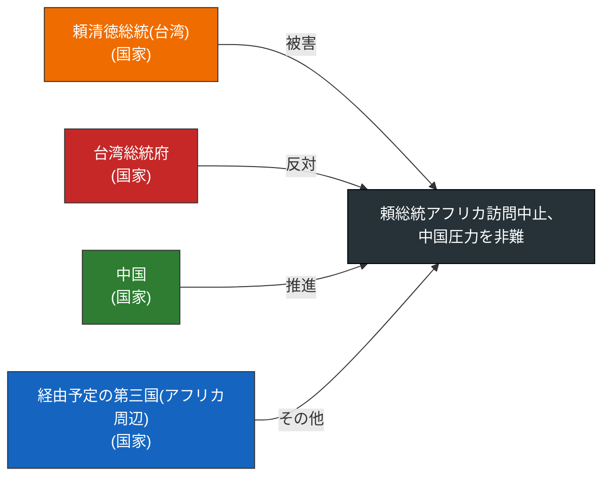
```mermaid
flowchart LR
  T["頼総統アフリカ訪問中止、中国圧力を非難"]
  A0["頼清徳総統(台湾)\n(国家)"]
  A0 -- 被害 --> T
  style A0 fill:#ef6c00,color:#fff,stroke:#333
  A1["台湾総統府\n(国家)"]
  A1 -- 反対 --> T
  style A1 fill:#c62828,color:#fff,stroke:#333
  A2["中国\n(国家)"]
  A2 -- 推進 --> T
  style A2 fill:#2e7d32,color:#fff,stroke:#333
  A3["経由予定の第三国(アフリカ周辺)\n(国家)"]
  A3 -- その他 --> T
  style A3 fill:#1565c0,color:#fff,stroke:#333
  style T fill:#263238,color:#fff,stroke:#000
```

### 影響の広がり

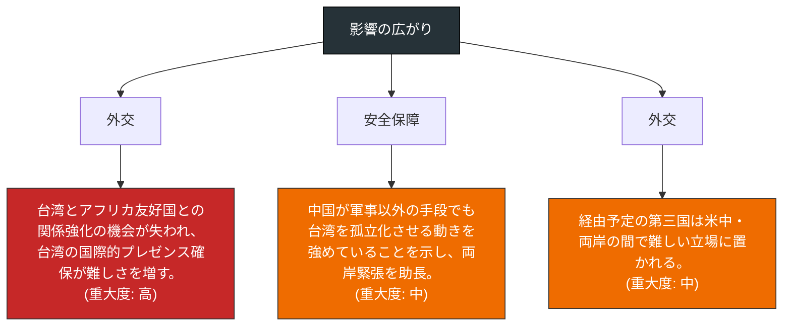
```mermaid
flowchart TB
  R["影響の広がり"]
  D0["外交"]
  I0["台湾とアフリカ友好国との関係強化の機会が失われ、台湾の国際的プレゼンス確保が難しさを増す。\n(重大度: 高)"]
  R --> D0 --> I0
  style I0 fill:#c62828,color:#fff,stroke:#333
  D1["安全保障"]
  I1["中国が軍事以外の手段でも台湾を孤立化させる動きを強めていることを示し、両岸緊張を助長。\n(重大度: 中)"]
  R --> D1 --> I1
  style I1 fill:#ef6c00,color:#fff,stroke:#333
  D2["外交"]
  I2["経由予定の第三国は米中・両岸の間で難しい立場に置かれる。\n(重大度: 中)"]
  R --> D2 --> I2
  style I2 fill:#ef6c00,color:#fff,stroke:#333
  style R fill:#263238,color:#fff,stroke:#000
```

### 当事者の関係ネットワーク

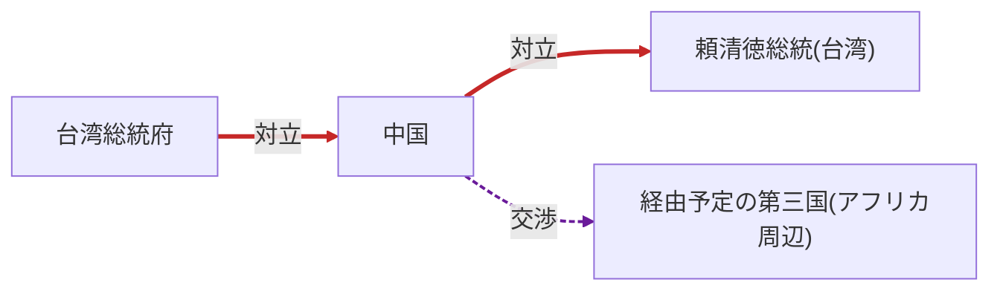
```mermaid
graph LR
  N0["頼清徳総統(台湾)"]
  N1["台湾総統府"]
  N2["中国"]
  N3["経由予定の第三国(アフリカ周辺)"]
  N2 -->|対立| N0
  N2 -->|交渉| N3
  N1 -->|対立| N2
  linkStyle 0 stroke:#c62828,stroke-width:3px;
  linkStyle 1 stroke:#6a1b9a,stroke-width:2px,stroke-dasharray:4 2;
  linkStyle 2 stroke:#c62828,stroke-width:3px;
```

### 押さえるべき論点

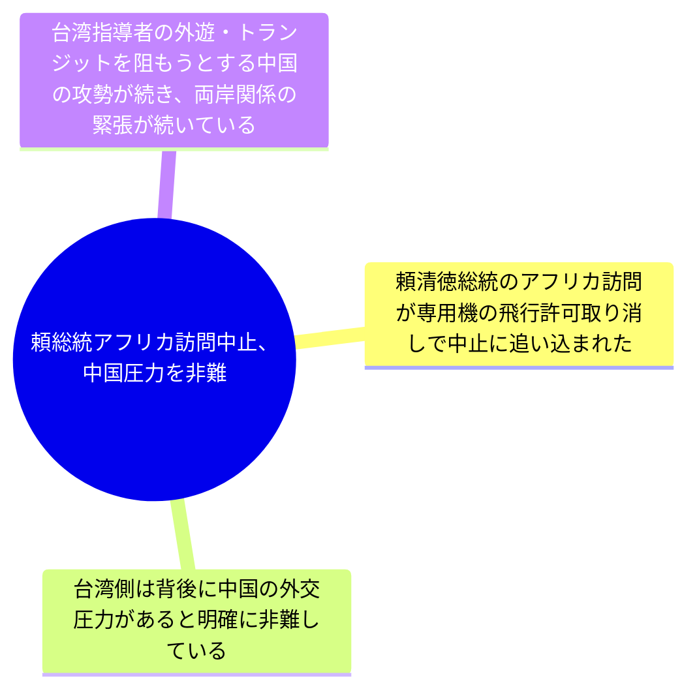
```mermaid
mindmap
  root((頼総統アフリカ訪問中止、中国圧力を非難))
    頼清徳総統のアフリカ訪問が専用機の飛行許可取り消しで中止に追い込まれた
    台湾側は背後に中国の外交圧力があると明確に非難している
    台湾指導者の外遊・トランジットを阻もうとする中国の攻勢が続き、両岸関係の緊張が続いている
```

---
## ウクライナ侵攻4月21日の動き

- **出典:** NHK 国際 ([原文](http://www3.nhk.or.jp/news/html/20260421/k10015082681000.html)) / **公開:** 2026-04-21 20:37

**要約**
ロシアによるウクライナへの軍事侵攻が継続しており、ウクライナ各地でロシア軍とウクライナ軍の戦闘が続いている。戦闘の激化に伴い、大勢の市民が国外へ避難を余儀なくされている。NHKは4月21日（日本時間）のウクライナ情勢をめぐる戦闘状況や関係各国の外交動向を随時更新で伝えている。

**背景**
2022年2月に始まったロシアによるウクライナへの軍事侵攻は長期化しており、国際社会による制裁や支援が続いている。戦闘による民間人被害と大規模な避難民の発生が深刻な人道問題となっている。

**要点**
- ロシアによるウクライナへの軍事侵攻は4月21日時点でも継続している
- ウクライナ各地で両軍の戦闘が続き、大勢の市民が国外へ避難している
- 関係各国による外交的な動きも並行して進んでいる

### 経緯タイムライン

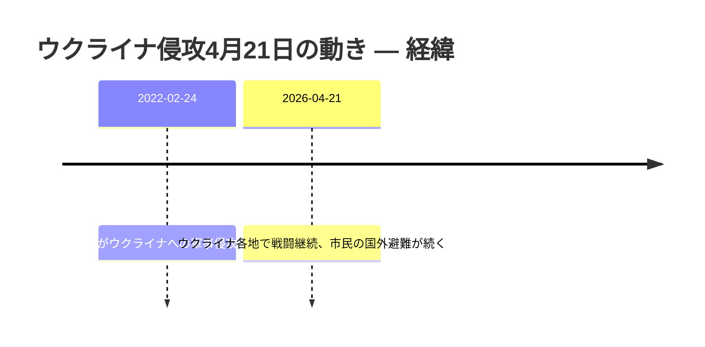
```mermaid
timeline
  title ウクライナ侵攻4月21日の動き — 経緯
  2022-02-24 : ロシアがウクライナへの軍事侵攻を開始
  2026-04-21 : ウクライナ各地で戦闘継続、市民の国外避難が続く
```

### 当事者マップ

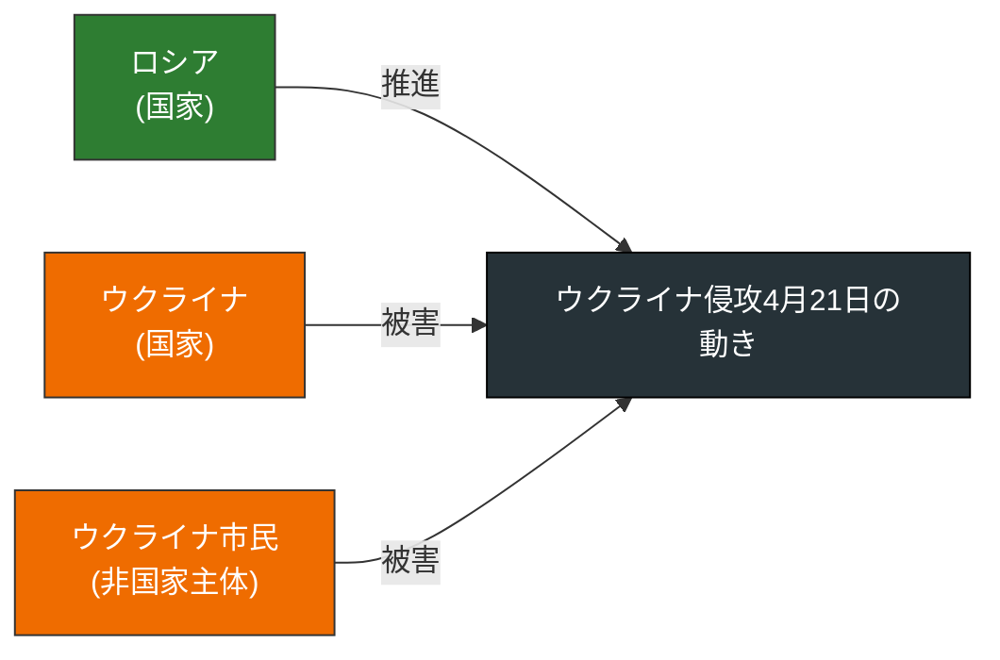
```mermaid
flowchart LR
  T["ウクライナ侵攻4月21日の動き"]
  A0["ロシア\n(国家)"]
  A0 -- 推進 --> T
  style A0 fill:#2e7d32,color:#fff,stroke:#333
  A1["ウクライナ\n(国家)"]
  A1 -- 被害 --> T
  style A1 fill:#ef6c00,color:#fff,stroke:#333
  A2["ウクライナ市民\n(非国家主体)"]
  A2 -- 被害 --> T
  style A2 fill:#ef6c00,color:#fff,stroke:#333
  style T fill:#263238,color:#fff,stroke:#000
```

### 影響の広がり

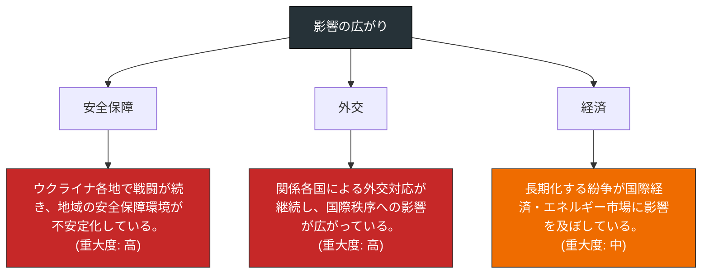
```mermaid
flowchart TB
  R["影響の広がり"]
  D0["安全保障"]
  I0["ウクライナ各地で戦闘が続き、地域の安全保障環境が不安定化している。\n(重大度: 高)"]
  R --> D0 --> I0
  style I0 fill:#c62828,color:#fff,stroke:#333
  D1["外交"]
  I1["関係各国による外交対応が継続し、国際秩序への影響が広がっている。\n(重大度: 高)"]
  R --> D1 --> I1
  style I1 fill:#c62828,color:#fff,stroke:#333
  D2["経済"]
  I2["長期化する紛争が国際経済・エネルギー市場に影響を及ぼしている。\n(重大度: 中)"]
  R --> D2 --> I2
  style I2 fill:#ef6c00,color:#fff,stroke:#333
  style R fill:#263238,color:#fff,stroke:#000
```

### 当事者の関係ネットワーク

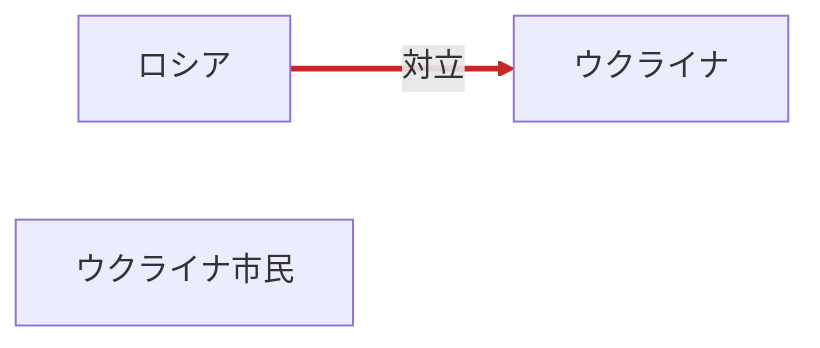
```mermaid
graph LR
  N0["ロシア"]
  N1["ウクライナ"]
  N2["ウクライナ市民"]
  N0 -->|対立| N1
  linkStyle 0 stroke:#c62828,stroke-width:3px;
```

### 押さえるべき論点

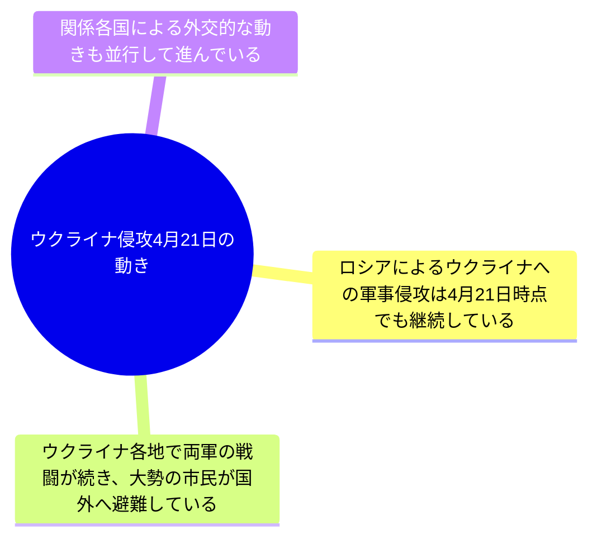
```mermaid
mindmap
  root((ウクライナ侵攻4月21日の動き))
    ロシアによるウクライナへの軍事侵攻は4月21日時点でも継続している
    ウクライナ各地で両軍の戦闘が続き、大勢の市民が国外へ避難している
    関係各国による外交的な動きも並行して進んでいる
```

---
## 高市首相と墨大統領 エネ協力で一致

- **出典:** NHK 国際 ([原文](http://www3.nhk.or.jp/news/html/20260421/k10015104501000.html)) / **公開:** 2026-04-21 14:03

**要約**
高市総理大臣はメキシコのシェインバウム大統領と電話会談を行いました。会談では、緊迫する中東情勢を踏まえた意見交換が行われました。メキシコが産油国であることを念頭に、エネルギー供給を含めた両国の協力を進めることで一致しました。中東産原油への依存度が高い日本にとって、供給源多角化の一環と位置づけられます。

**背景**
中東情勢の緊張が高まる中、原油価格の変動や供給途絶リスクへの懸念が世界的に広がっています。原油の中東依存度が高い日本は、供給源の多角化を急務としており、産油国であるメキシコとの連携強化が求められていました。

**要点**
- 高市首相がメキシコ大統領と電話会談し、中東情勢を議論した
- 産油国メキシコとのエネルギー供給協力で一致した
- 中東依存リスクを踏まえた日本の供給源多角化の動きといえる

### 経緯タイムライン

```mermaid
timeline
  title 高市首相と墨大統領 エネ協力で一致 — 経緯
  直近 : 中東情勢が緊迫化、原油供給への懸念が高まる
  2026-04-21 : 高市首相とシェインバウム大統領が電話会談
  2026-04-21 : エネルギー供給を含む協力推進で一致
```

### 当事者マップ

```mermaid
flowchart LR
  T["高市首相と墨大統領 エネ協力で一致"]
  A0["高市首相(日本)\n(国家)"]
  A0 -- 推進 --> T
  style A0 fill:#2e7d32,color:#fff,stroke:#333
  A1["シェインバウム大統領(メキシコ)\n(国家)"]
  A1 -- 推進 --> T
  style A1 fill:#2e7d32,color:#fff,stroke:#333
  style T fill:#263238,color:#fff,stroke:#000
```

### 影響の広がり

```mermaid
flowchart TB
  R["影響の広がり"]
  D0["エネルギー"]
  I0["メキシコからの原油調達拡大の可能性が広がり、日本のエネルギー安全保障に寄与しうる。\n(重大度: 中)"]
  R --> D0 --> I0
  style I0 fill:#ef6c00,color:#fff,stroke:#333
  D1["外交"]
  I1["中南米主要国との関係強化につながり、日本の外交的選択肢が広がる。\n(重大度: 中)"]
  R --> D1 --> I1
  style I1 fill:#ef6c00,color:#fff,stroke:#333
  D2["安全保障"]
  I2["中東依存低減により、地政学リスクに対する耐性が高まる。\n(重大度: 中)"]
  R --> D2 --> I2
  style I2 fill:#ef6c00,color:#fff,stroke:#333
  style R fill:#263238,color:#fff,stroke:#000
```

### 当事者の関係ネットワーク

```mermaid
graph LR
  N0["高市首相(日本)"]
  N1["シェインバウム大統領(メキシコ)"]
  N0 -->|交渉| N1
  linkStyle 0 stroke:#6a1b9a,stroke-width:2px,stroke-dasharray:4 2;
```

### 押さえるべき論点

```mermaid
mindmap
  root((高市首相と墨大統領 エネ協力で一致))
    高市首相がメキシコ大統領と電話会談し、中東情勢を議論した
    産油国メキシコとのエネルギー供給協力で一致した
    中東依存リスクを踏まえた日本の供給源多角化の動きといえる
```

---
