# 地政学ニュース図解レポート 2026-04-23 号

生成日時: 2026-04-23 07:45 / 記事数: 5

## 📌 本日の要点

- **イラン、ホルムズで船舶2隻拿捕 停戦協議難航** — イラン革命防衛隊は、ホルムズ海峡で船舶2隻を拿捕したと発表した。

## イラン、ホルムズで船舶2隻拿捕 停戦協議難航 `重要度: 高` `middle_east / global`
- **出典:** NHK 国際 ([原文](http://www3.nhk.or.jp/news/html/20260423/k10015105831000.html)) / **公開:** 2026-04-23 07:40

**要約**
イラン革命防衛隊は、ホルムズ海峡で船舶2隻を拿捕したと発表した。米国とイスラエルによる対イラン軍事作戦開始後、イランが船舶を拿捕したのは初めてとみられる。トランプ大統領はイランとの停戦延長を表明したが、現場では緊張が逆に高まっている。今後、戦闘終結に向けた本格協議が実現するかが焦点となる。

**背景**
米イスラエルによる対イラン軍事作戦の最中、トランプ政権は停戦延長方針を示している。しかし過去1週間でイランは4月20日に英タンカーを一時拿捕、16日にはIAEAがウラン濃縮度84%検出を報告するなど、イラン側の強硬姿勢が続いており、今回の2隻拿捕はその延長線上にある。海運業界では既に中東航路回避と保険料急騰が進行し、ホルムズ海峡の緊張が世界のエネルギー供給に直結する局面となっている。

**要点**
- 米イスラエルの対イラン軍事作戦開始後、イランによる船舶拿捕は初めてで緊張がさらに高まった

- トランプ大統領の停戦延長表明と現場の拿捕行動が乖離し、戦闘終結協議の実現は見通せない

- ホルムズ海峡の不安定化は日本のエネルギー安全保障に直結し、航路回避・保険料高騰が既に進行中

### 経緯タイムライン

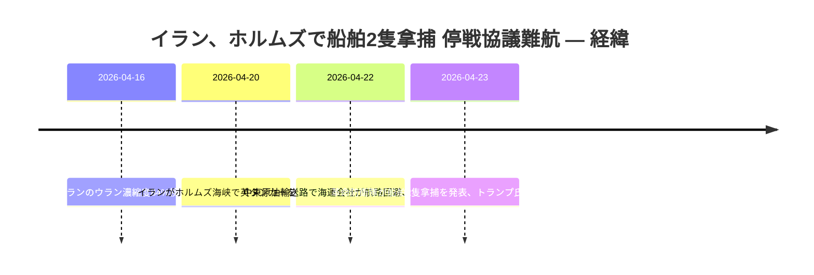

### 当事者マップ

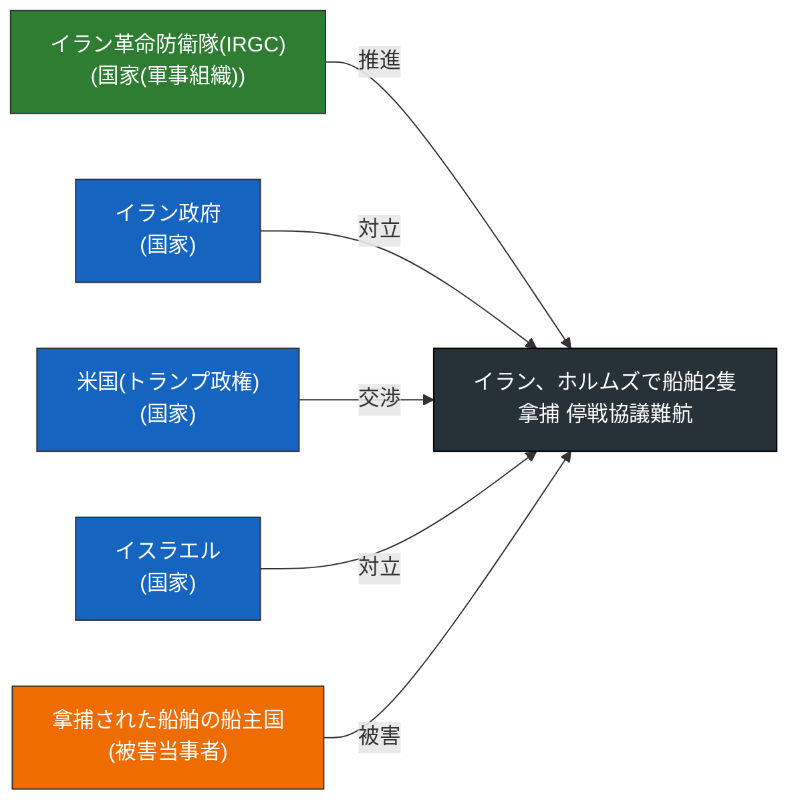

### 影響の広がり

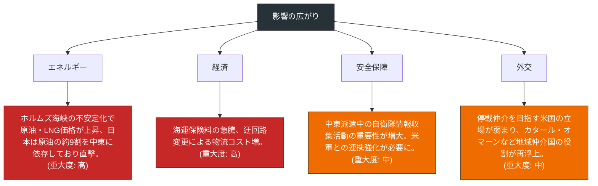

### 当事者の関係ネットワーク

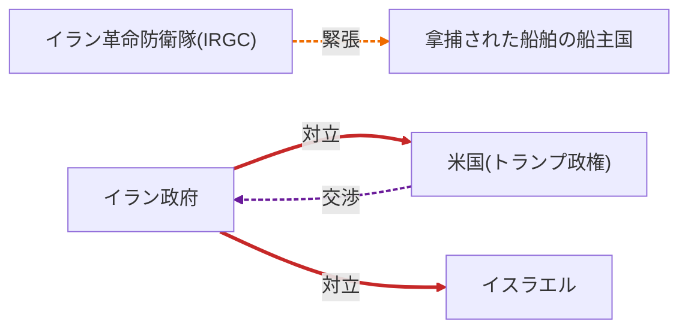

### 押さえるべき論点

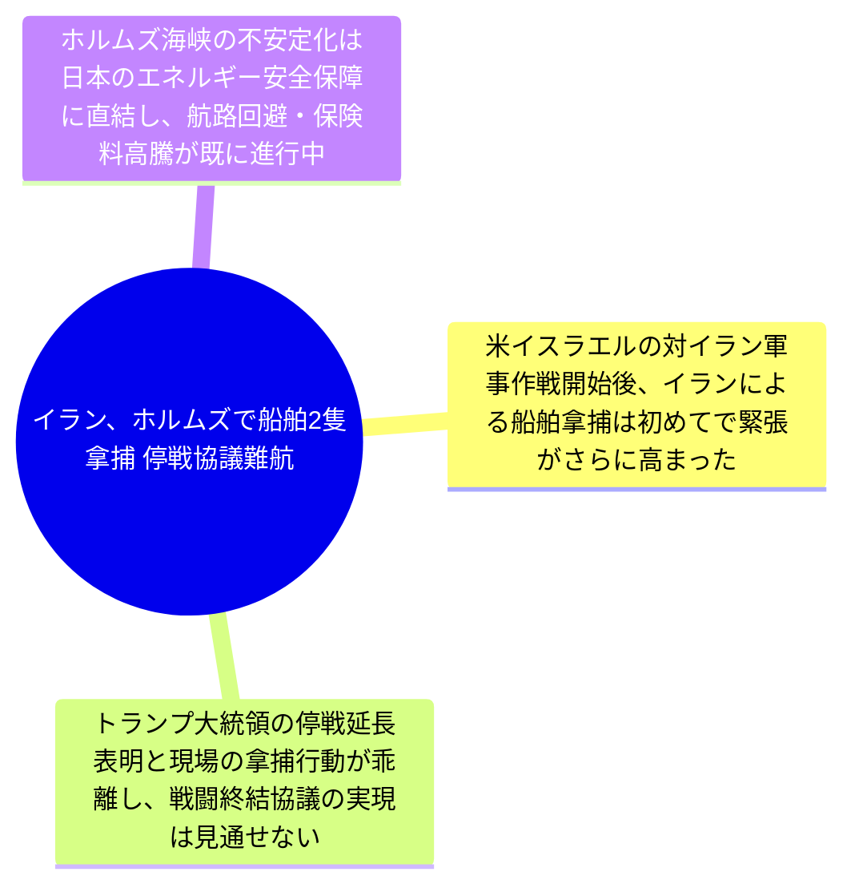

---

## ロシアのウクライナ侵攻、4月23日の動向 `重要度: 中` `europe / global`
- **出典:** NHK 国際 ([原文](http://www3.nhk.or.jp/news/html/20260423/k10015082701000.html)) / **公開:** 2026-04-23 05:38

**要約**
ロシアによるウクライナへの軍事侵攻が継続しており、ウクライナ各地で両軍の戦闘が続いている。多くの市民が国外へ避難を余儀なくされている状況である。NHKは4月23日の戦闘状況や各国の外交動向について随時更新で伝えている。長期化する戦争は欧州の安全保障秩序に深刻な影響を及ぼし続けている。

**背景**
ウクライナ侵攻は長期化し、過去1週間ではドローンによる相互攻撃が過去最多を記録、NATOがF-16追加供与を調整するなど戦闘は激化している。一方でロシアはシベリア極東で北朝鮮との合同軍事演習を発表するなど、欧州とアジアを跨ぐ連携を強めており、NATOも東欧諸国への追加配備を協議している。戦線の固定化と国際的な陣営化が同時進行している局面にある。

**要点**
- 4月23日もウクライナ各地で戦闘が継続し、市民の国外避難が続いている

- ドローン攻撃の過去最多更新やF-16追加供与など戦闘は激化傾向

- ロ朝軍事演習やNATOの東欧増派など、欧州・アジアをまたぐ陣営化が進行

### 経緯タイムライン

### 当事者マップ

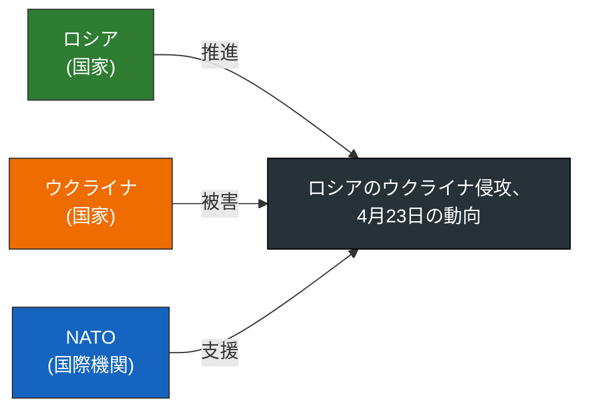

### 影響の広がり

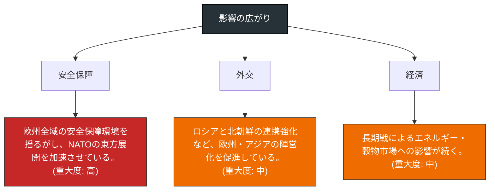

### 当事者の関係ネットワーク

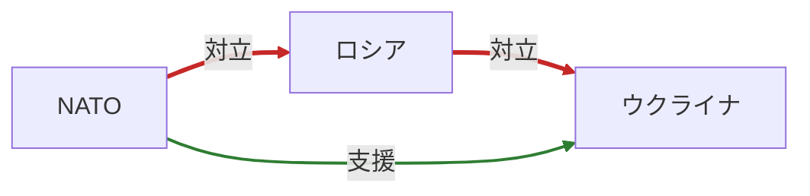

### 押さえるべき論点

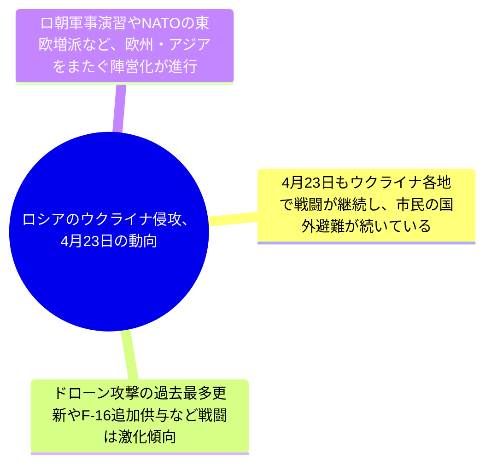

---

## EU、ウクライナへ巨額融資の承認手続き開始 `重要度: 中` `europe`
- **出典:** NHK 国際 ([原文](http://www3.nhk.or.jp/news/html/20260422/k10015105981000.html)) / **公開:** 2026-04-22 23:02

**要約**
EUは4月22日、加盟国ハンガリーの反対で停滞していたウクライナ向けの巨額融資について、承認手続きを開始することを決めた。ハンガリーが反対理由としてきたウクライナ経由のロシア産原油輸送の再開にめどが立ったことが背景にある。融資は23日に正式承認される見通しで、ウクライナの財政・戦費を下支えする重要な決定となる。

**背景**
ウクライナ戦争は長期化し、過去1週間でもロ朝合同軍事演習の発表やロ・ウクライナ間のドローン相互攻撃が過去最多に達するなど戦況は激化。NATOはF-16追加供与や東欧への追加配備を協議しており、EUの財政支援は西側の対ウクライナ支援枠組みの要となる。ハンガリーは親ロシア色が強く、原油輸送問題を盾に資金拠出を阻んできた経緯がある。

**要点**
- EUがハンガリーの反対で停滞していたウクライナ向け巨額融資の承認手続きを開始

- ロシア産原油のウクライナ経由輸送再開のめどが立ち、ハンガリーが態度を軟化

- 23日に融資が正式承認される見通しで、EUの対ウクライナ支援が前進

### 経緯タイムライン

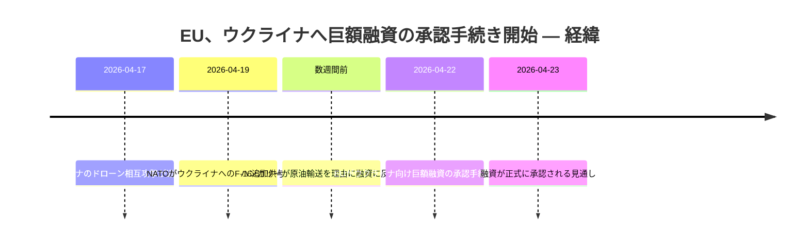

### 当事者マップ

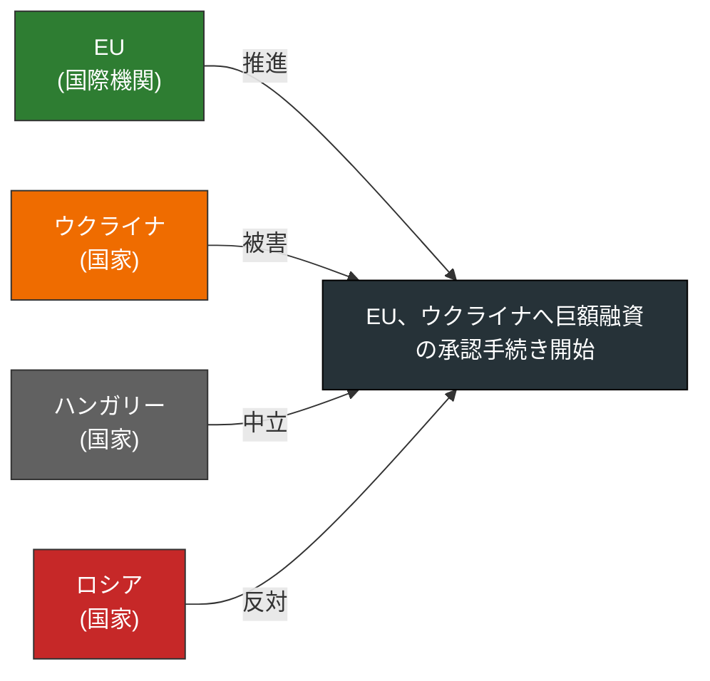

### 影響の広がり

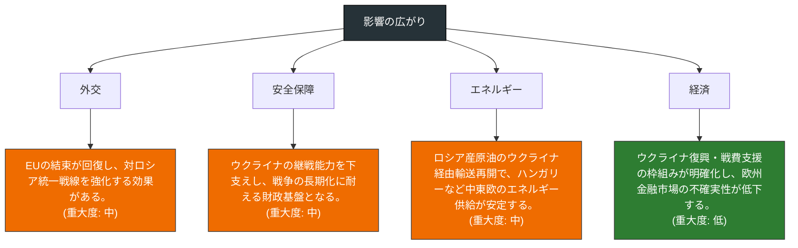

### 当事者の関係ネットワーク

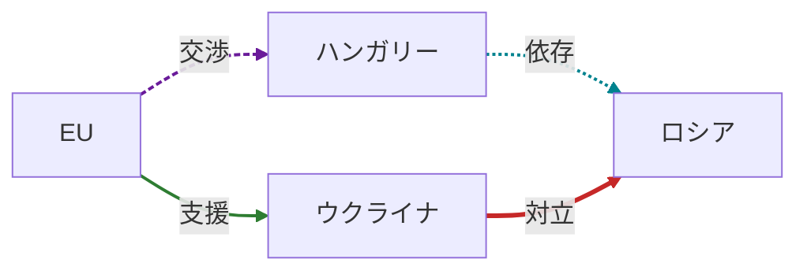

### 押さえるべき論点

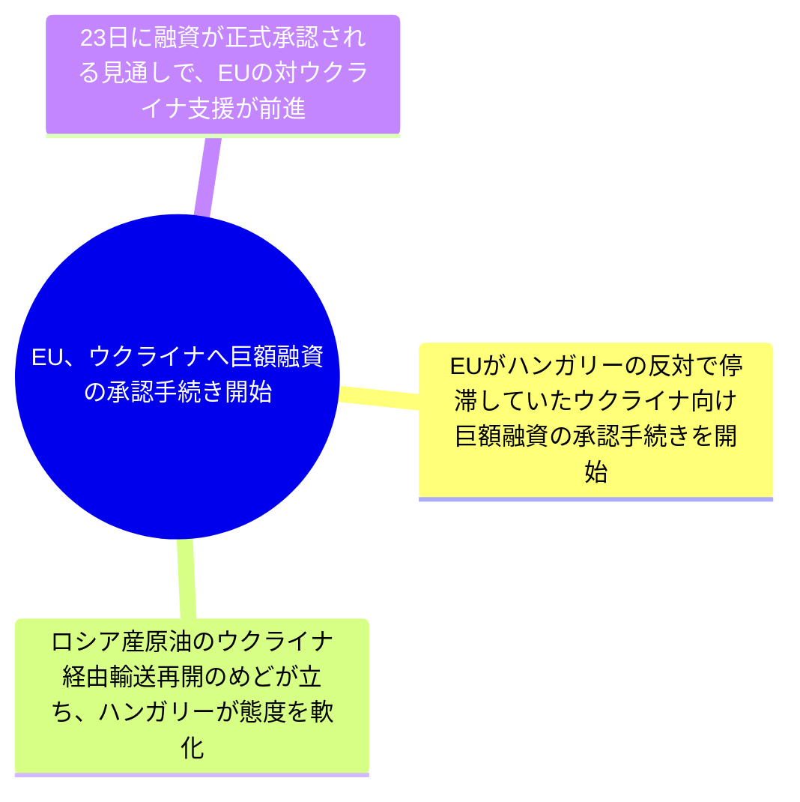

---

## 中国、頼総統アフリカ訪問中止を歓迎 `重要度: 中` `east_asia / africa`
- **出典:** NHK 国際 ([原文](http://www3.nhk.or.jp/news/html/20260422/k10015105701000.html)) / **公開:** 2026-04-22 20:37

**要約**
台湾の頼清徳総統が予定していたアフリカ訪問を見合わせた問題で、中国政府が関係国の対応を評価する姿勢を示した。台湾側は、専用機が通過予定だった一部の国が中国の圧力を受けて飛行許可を取り消したと主張している。中国はこれを受け入れつつ、台湾側を「独立策動」として批判。台湾の外交空間を巡る中台の綱引きが国際社会に波及している。

**背景**
中国は台湾の国際的孤立化を進めており、アフリカ諸国の多くが中国との国交を優先している。過去1週間には中国が台湾海峡で軍事演習を拡大し、日米が即応体制を強化するなど軍事面での緊張が高まる中、今回の事案は非軍事領域での中台対立の象徴となる。頼清徳政権発足以降、中国は外交・軍事両面で締め付けを強化している。

**要点**
- 中国は軍事演習に加え、第三国への外交圧力で台湾を封じ込めている

- 台湾総統の外遊ルート確保は中台の外交戦の焦点となった

- アフリカ諸国の多くが中国寄りであり、台湾の国際活動空間は一層狭まっている

### 経緯タイムライン

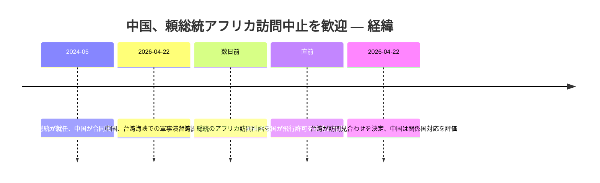

### 当事者マップ

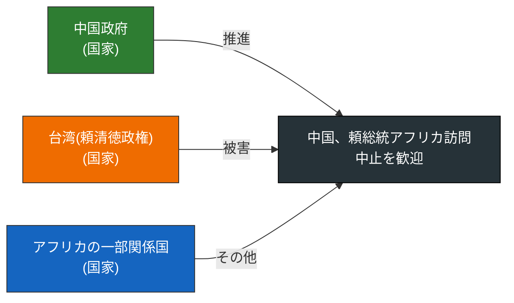

### 影響の広がり

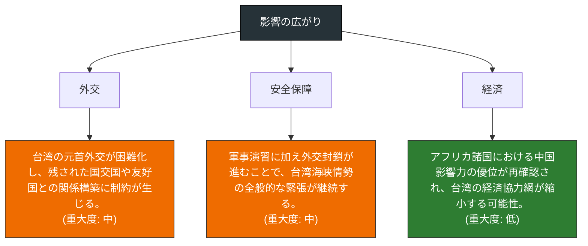

### 当事者の関係ネットワーク

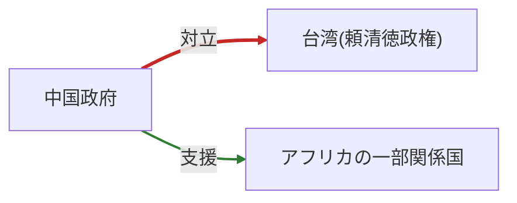

### 押さえるべき論点

---

重要度「低」の記事(1本) — 見出しのみ

- **高市首相、モンテネグロ大統領と会談** ([原文](http://www3.nhk.or.jp/news/html/20260422/k10015105761000.html)) — NHK 国際

