# 地政学ニュース図解レポート 2026-04-23 号

生成日時: 2026-04-23 01:35 / 記事数: 5

## 📌 本日の要点

- **ウクライナ戦況続く 4月22日の動き** — ロシアによるウクライナ侵攻は4月22日も続き、各地で戦闘が続いている。

## ウクライナ戦況続く 4月22日の動き `重要度: 高` `europe / global`
- **出典:** NHK 国際 ([原文](http://www3.nhk.or.jp/news/html/20260422/k10015082691000.html)) / **公開:** 2026-04-22 16:44

**要約**
ロシアによるウクライナ侵攻は4月22日も続き、各地で戦闘が続いている。市民の国外避難も継続しており、人道状況は依然として深刻である。NHKは同日の戦況および関係各国の外交動向を随時更新で伝えている。停戦の見通しは立っておらず、長期化の様相を強めている。

**背景**
侵攻開始から長期化するなか、直近ではロシア・ウクライナ双方によるドローン相互攻撃が過去最多を記録し(4月17日)、NATOはウクライナへのF-16追加供与で調整を進めている(4月19日)。同時にNATOは東欧諸国への追加配備も協議中で(4月22日)、ロシアはシベリア極東でロ朝合同軍事演習を発表するなど(4月21日)、欧州と東アジアの安全保障環境が連動する構図が鮮明になっている。

**要点**
- ウクライナ侵攻は決着の糸口が見えず長期化が続いている

- NATOはF-16供与や東欧への追加配備で対ロ抑止を強化中

- ロ朝合同演習など欧州と東アジアの安全保障が連動しつつある

### 経緯タイムライン

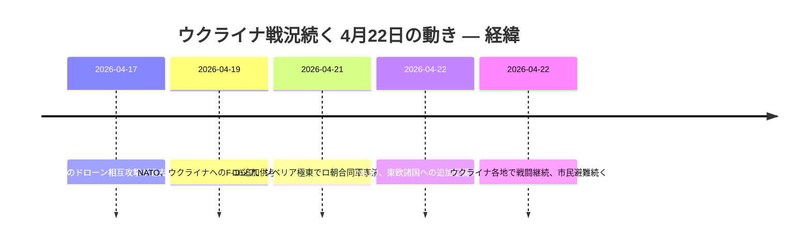
```mermaid
timeline
  title ウクライナ戦況続く 4月22日の動き — 経緯
  2026-04-17 : ロ・ウ双方のドローン相互攻撃が過去最多を記録
  2026-04-19 : NATO、ウクライナへのF-16追加供与で調整
  2026-04-21 : ロシア、シベリア極東でロ朝合同軍事演習を発表
  2026-04-22 : NATO、東欧諸国への追加配備を協議
  2026-04-22 : ウクライナ各地で戦闘継続、市民避難続く
```

### 当事者マップ

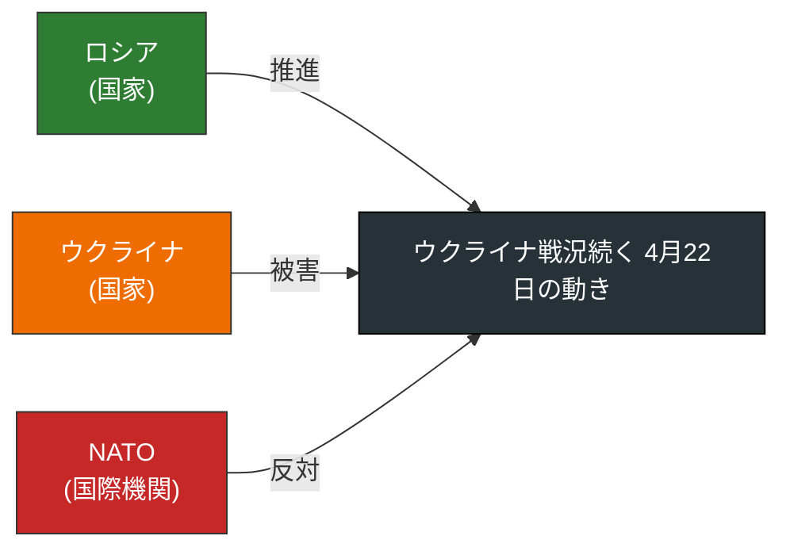
```mermaid
flowchart LR
  T["ウクライナ戦況続く 4月22日の動き"]
  A0["ロシア\n(国家)"]
  A0 -- 推進 --> T
  style A0 fill:#2e7d32,color:#fff,stroke:#333
  A1["ウクライナ\n(国家)"]
  A1 -- 被害 --> T
  style A1 fill:#ef6c00,color:#fff,stroke:#333
  A2["NATO\n(国際機関)"]
  A2 -- 反対 --> T
  style A2 fill:#c62828,color:#fff,stroke:#333
  style T fill:#263238,color:#fff,stroke:#000
```

### 影響の広がり

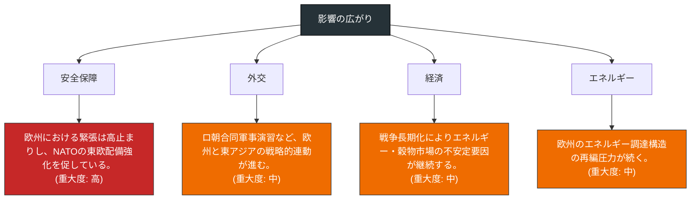
```mermaid
flowchart TB
  R["影響の広がり"]
  D0["安全保障"]
  I0["欧州における緊張は高止まりし、NATOの東欧配備強化を促している。\n(重大度: 高)"]
  R --> D0 --> I0
  style I0 fill:#c62828,color:#fff,stroke:#333
  D1["外交"]
  I1["ロ朝合同軍事演習など、欧州と東アジアの戦略的連動が進む。\n(重大度: 中)"]
  R --> D1 --> I1
  style I1 fill:#ef6c00,color:#fff,stroke:#333
  D2["経済"]
  I2["戦争長期化によりエネルギー・穀物市場の不安定要因が継続する。\n(重大度: 中)"]
  R --> D2 --> I2
  style I2 fill:#ef6c00,color:#fff,stroke:#333
  D3["エネルギー"]
  I3["欧州のエネルギー調達構造の再編圧力が続く。\n(重大度: 中)"]
  R --> D3 --> I3
  style I3 fill:#ef6c00,color:#fff,stroke:#333
  style R fill:#263238,color:#fff,stroke:#000
```

### 当事者の関係ネットワーク

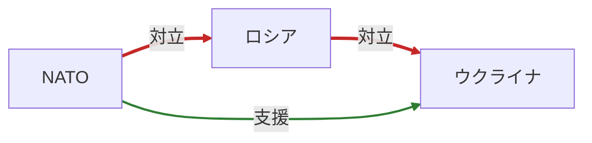
```mermaid
graph LR
  N0["ロシア"]
  N1["ウクライナ"]
  N2["NATO"]
  N0 -->|対立| N1
  N2 -->|支援| N1
  N2 -->|対立| N0
  linkStyle 0 stroke:#c62828,stroke-width:3px;
  linkStyle 1 stroke:#2e7d32,stroke-width:2px;
  linkStyle 2 stroke:#c62828,stroke-width:3px;
```

### 押さえるべき論点

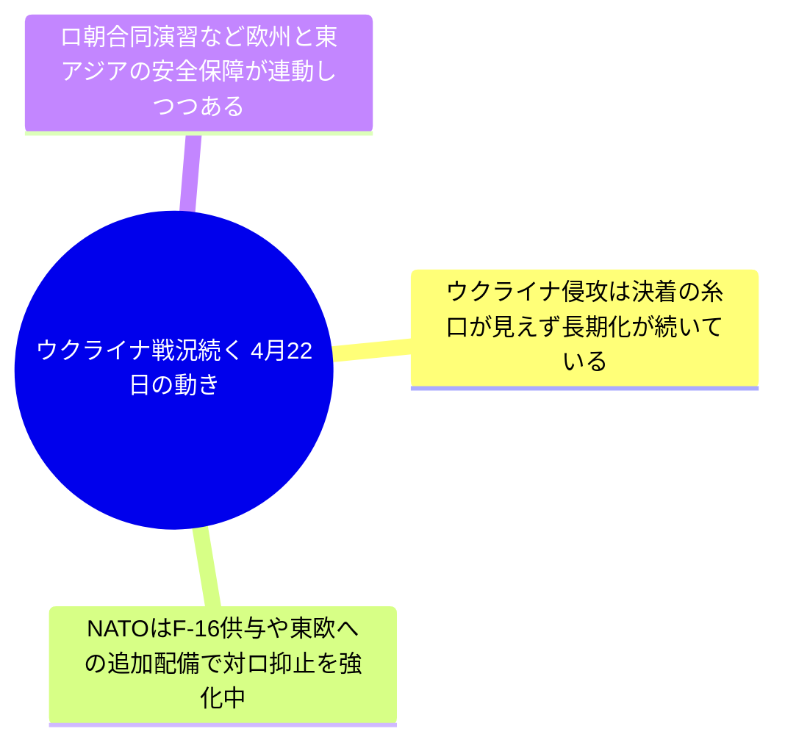
```mermaid
mindmap
  root((ウクライナ戦況続く 4月22日の動き))
    ウクライナ侵攻は決着の糸口が見えず長期化が続いている
    NATOはF-16供与や東欧への追加配備で対ロ抑止を強化中
    ロ朝合同演習など欧州と東アジアの安全保障が連動しつつある
```

---

## EU、ウクライナ巨額融資の承認手続きを開始 `重要度: 中` `europe`
- **出典:** NHK 国際 ([原文](http://www3.nhk.or.jp/news/html/20260422/k10015105981000.html)) / **公開:** 2026-04-22 23:02

**要約**
EUは4月22日、ハンガリーの反対で停滞していたウクライナ向け巨額融資について、承認に向けた手続きを開始することを決定した。ハンガリーが反対理由としていたウクライナ経由のロシア産原油輸送の再開にめどが立ったことが背景にある。融資は23日に承認される見通しで、ウクライナの戦時下の財政を下支えする重要な措置となる。

**背景**
ウクライナ支援を巡りEU内ではハンガリーが長く反対姿勢を取り、融資承認が停滞してきた。過去1週間ではNATOがF-16追加供与の調整や東欧への追加配備協議を進め、ロシア・ウクライナ間のドローン相互攻撃が過去最多となるなど戦況も激化しており、EUとしての対ウクライナ財政支援の加速が急務となっていた。

**要点**
- EUがハンガリーの反対で停滞していたウクライナ向け巨額融資の承認手続きを開始

- ウクライナ経由のロシア産原油輸送の再開見通しがハンガリー軟化の鍵

- 融資は4月23日に承認される見通しで、EUの対ウクライナ支援が加速

### 経緯タイムライン

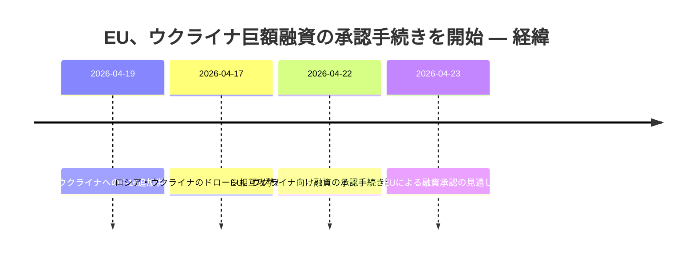
```mermaid
timeline
  title EU、ウクライナ巨額融資の承認手続きを開始 — 経緯
  2026-04-19 : NATO、ウクライナへのF-16追加供与で調整
  2026-04-17 : ロシア・ウクライナのドローン相互攻撃が過去最多に
  2026-04-22 : EU、ウクライナ向け融資の承認手続き開始を決定
  2026-04-23 : EUによる融資承認の見通し
```

### 当事者マップ

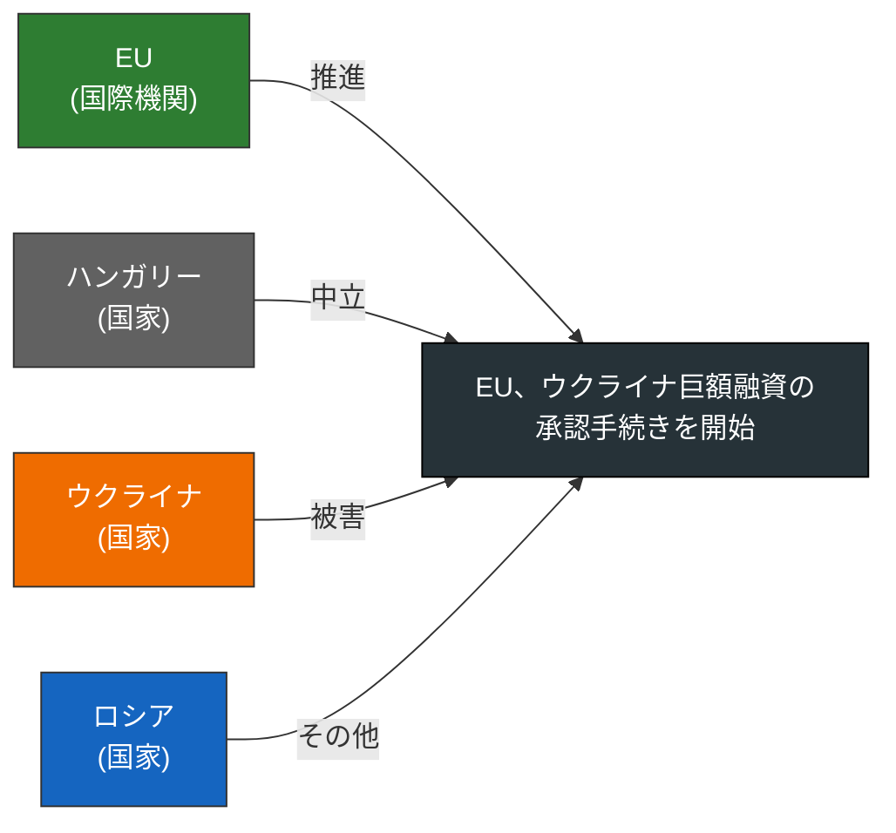
```mermaid
flowchart LR
  T["EU、ウクライナ巨額融資の承認手続きを開始"]
  A0["EU\n(国際機関)"]
  A0 -- 推進 --> T
  style A0 fill:#2e7d32,color:#fff,stroke:#333
  A1["ハンガリー\n(国家)"]
  A1 -- 中立 --> T
  style A1 fill:#616161,color:#fff,stroke:#333
  A2["ウクライナ\n(国家)"]
  A2 -- 被害 --> T
  style A2 fill:#ef6c00,color:#fff,stroke:#333
  A3["ロシア\n(国家)"]
  A3 -- その他 --> T
  style A3 fill:#1565c0,color:#fff,stroke:#333
  style T fill:#263238,color:#fff,stroke:#000
```

### 影響の広がり

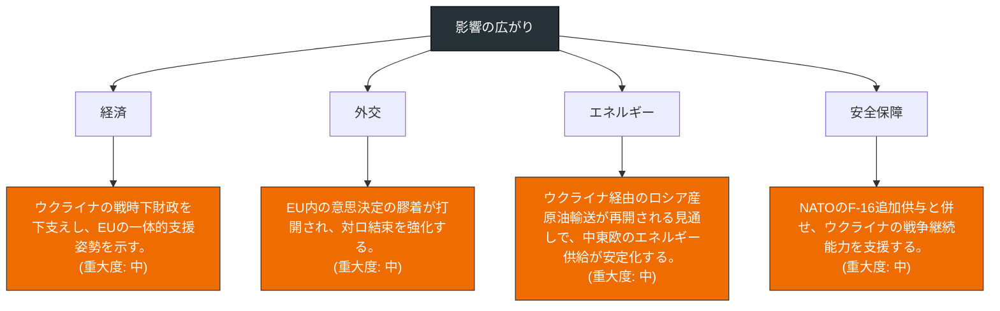
```mermaid
flowchart TB
  R["影響の広がり"]
  D0["経済"]
  I0["ウクライナの戦時下財政を下支えし、EUの一体的支援姿勢を示す。\n(重大度: 中)"]
  R --> D0 --> I0
  style I0 fill:#ef6c00,color:#fff,stroke:#333
  D1["外交"]
  I1["EU内の意思決定の膠着が打開され、対ロ結束を強化する。\n(重大度: 中)"]
  R --> D1 --> I1
  style I1 fill:#ef6c00,color:#fff,stroke:#333
  D2["エネルギー"]
  I2["ウクライナ経由のロシア産原油輸送が再開される見通しで、中東欧のエネルギー供給が安定化する。\n(重大度: 中)"]
  R --> D2 --> I2
  style I2 fill:#ef6c00,color:#fff,stroke:#333
  D3["安全保障"]
  I3["NATOのF-16追加供与と併せ、ウクライナの戦争継続能力を支援する。\n(重大度: 中)"]
  R --> D3 --> I3
  style I3 fill:#ef6c00,color:#fff,stroke:#333
  style R fill:#263238,color:#fff,stroke:#000
```

### 当事者の関係ネットワーク

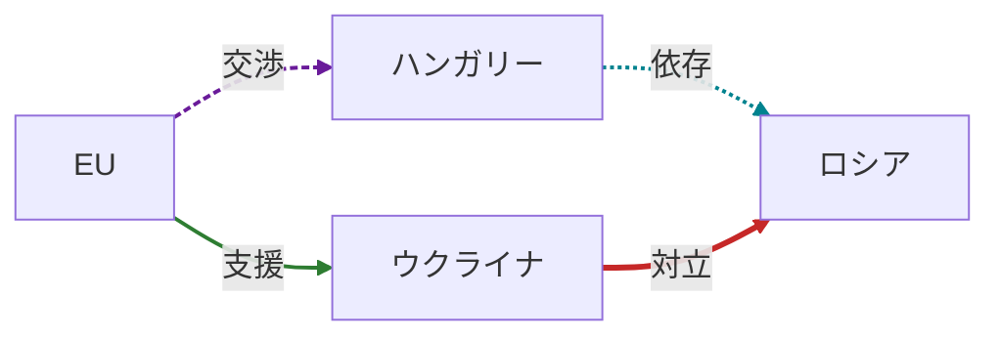
```mermaid
graph LR
  N0["EU"]
  N1["ハンガリー"]
  N2["ウクライナ"]
  N3["ロシア"]
  N0 -->|支援| N2
  N0 -->|交渉| N1
  N1 -->|依存| N3
  N2 -->|対立| N3
  linkStyle 0 stroke:#2e7d32,stroke-width:2px;
  linkStyle 1 stroke:#6a1b9a,stroke-width:2px,stroke-dasharray:4 2;
  linkStyle 2 stroke:#00838f,stroke-width:2px,stroke-dasharray:2 2;
  linkStyle 3 stroke:#c62828,stroke-width:3px;
```

### 押さえるべき論点

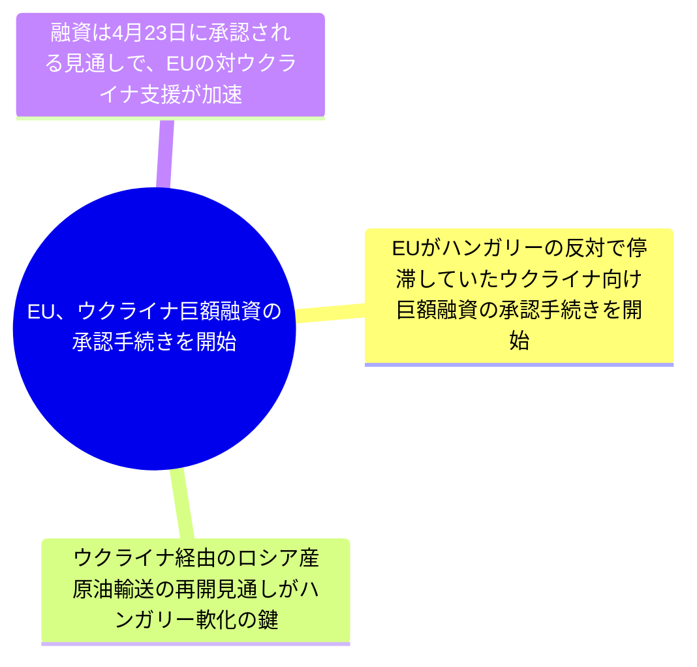
```mermaid
mindmap
  root((EU、ウクライナ巨額融資の承認手続きを開始))
    EUがハンガリーの反対で停滞していたウクライナ向け巨額融資の承認手続きを開始
    ウクライナ経由のロシア産原油輸送の再開見通しがハンガリー軟化の鍵
    融資は4月23日に承認される見通しで、EUの対ウクライナ支援が加速
```

---

## 中国、台湾総統のアフリカ訪問中止で関係国を評価 `重要度: 中` `east_asia / africa / global`
- **出典:** NHK 国際 ([原文](http://www3.nhk.or.jp/news/html/20260422/k10015105701000.html)) / **公開:** 2026-04-22 20:37

**要約**
台湾の頼清徳総統が予定していたアフリカ訪問を見合わせた問題について、中国政府は通過国の飛行許可取り消しなど関係国の対応を「評価する」と表明した。同時に中国は台湾側を「独立を画策している」として改めて批判した。台湾側は中国の外交圧力によって飛行許可が撤回されたと主張している。台湾の外交空間を締め付ける中国の国際的圧力の一端が表面化した形となった。

**背景**
中国は頼清徳総統就任以降、外交・軍事両面で台湾への圧力を強めており、直近では台湾海峡周辺での軍事演習拡大(4月22日)や日米2+2での統合軍司令部運用開始(4月18日)など、台湾海峡情勢は緊迫度を増している。アフリカ諸国の多くは中国と国交を持ち台湾と断交しており、中国は一帯一路や経済援助を通じてアフリカでの影響力を拡大、台湾の外交活動を封じ込める手段として活用している。今回の訪問見合わせは軍事圧力と並行する「外交封じ込め」の典型例と位置づけられる。

**要点**
- 中国は軍事演習だけでなく第三国経由の外交圧力で台湾を封じ込めている

- アフリカは中国の経済的影響力が強く、台湾外交の脆弱な戦線となっている

- 台湾海峡での演習拡大や日米統合軍司令部の始動と同時期に起きており、複合的圧力の一環と読み解ける

### 経緯タイムライン

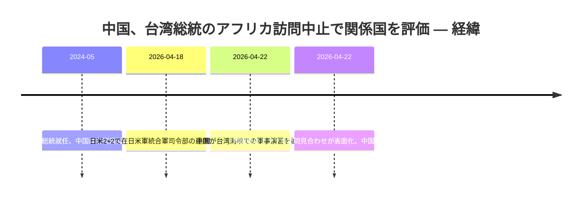
```mermaid
timeline
  title 中国、台湾総統のアフリカ訪問中止で関係国を評価 — 経緯
  2024-05 : 頼清徳総統就任、中国は合同演習で牽制
  2026-04-18 : 日米2+2で在日米軍統合軍司令部の運用開始を発表
  2026-04-22 : 中国が台湾海峡での軍事演習を拡大
  2026-04-22 : 頼総統のアフリカ訪問見合わせが表面化、中国が関係国を「評価」
```

### 当事者マップ

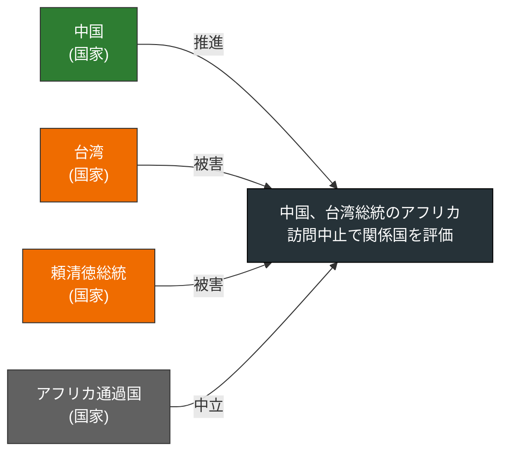
```mermaid
flowchart LR
  T["中国、台湾総統のアフリカ訪問中止で関係国を評価"]
  A0["中国\n(国家)"]
  A0 -- 推進 --> T
  style A0 fill:#2e7d32,color:#fff,stroke:#333
  A1["台湾\n(国家)"]
  A1 -- 被害 --> T
  style A1 fill:#ef6c00,color:#fff,stroke:#333
  A2["頼清徳総統\n(国家)"]
  A2 -- 被害 --> T
  style A2 fill:#ef6c00,color:#fff,stroke:#333
  A3["アフリカ通過国\n(国家)"]
  A3 -- 中立 --> T
  style A3 fill:#616161,color:#fff,stroke:#333
  style T fill:#263238,color:#fff,stroke:#000
```

### 影響の広がり

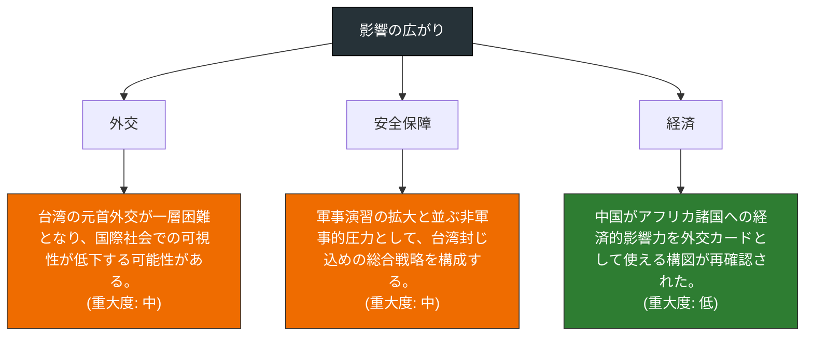
```mermaid
flowchart TB
  R["影響の広がり"]
  D0["外交"]
  I0["台湾の元首外交が一層困難となり、国際社会での可視性が低下する可能性がある。\n(重大度: 中)"]
  R --> D0 --> I0
  style I0 fill:#ef6c00,color:#fff,stroke:#333
  D1["安全保障"]
  I1["軍事演習の拡大と並ぶ非軍事的圧力として、台湾封じ込めの総合戦略を構成する。\n(重大度: 中)"]
  R --> D1 --> I1
  style I1 fill:#ef6c00,color:#fff,stroke:#333
  D2["経済"]
  I2["中国がアフリカ諸国への経済的影響力を外交カードとして使える構図が再確認された。\n(重大度: 低)"]
  R --> D2 --> I2
  style I2 fill:#2e7d32,color:#fff,stroke:#333
  style R fill:#263238,color:#fff,stroke:#000
```

### 当事者の関係ネットワーク

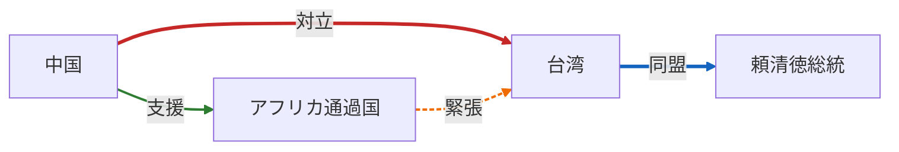
```mermaid
graph LR
  N0["中国"]
  N1["台湾"]
  N2["頼清徳総統"]
  N3["アフリカ通過国"]
  N0 -->|対立| N1
  N0 -->|支援| N3
  N3 -->|緊張| N1
  N1 -->|同盟| N2
  linkStyle 0 stroke:#c62828,stroke-width:3px;
  linkStyle 1 stroke:#2e7d32,stroke-width:2px;
  linkStyle 2 stroke:#ef6c00,stroke-width:2px,stroke-dasharray:4 2;
  linkStyle 3 stroke:#1565c0,stroke-width:3px;
```

### 押さえるべき論点

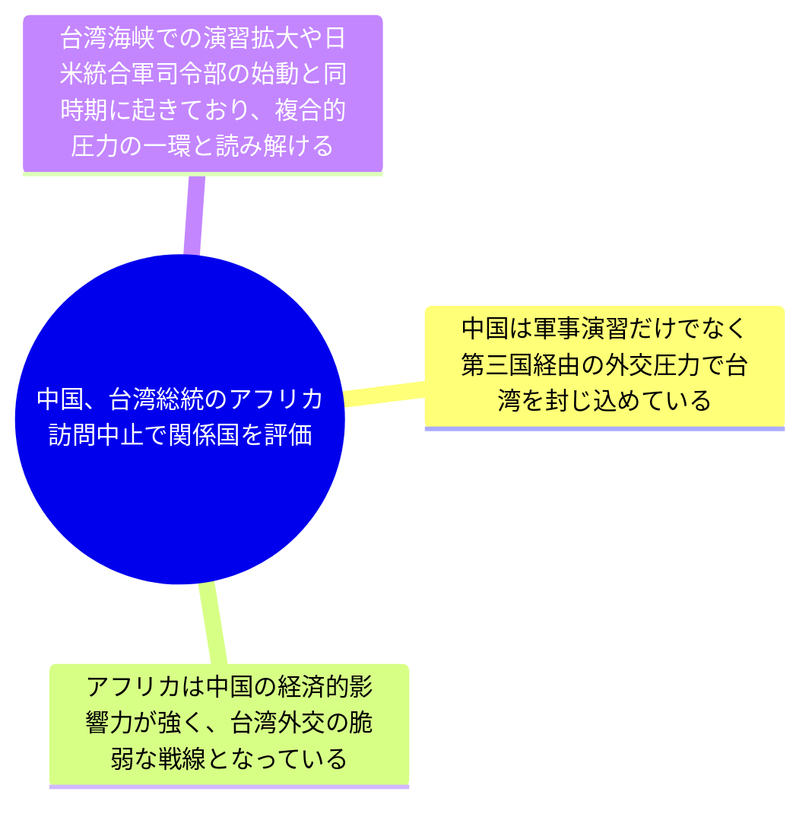
```mermaid
mindmap
  root((中国、台湾総統のアフリカ訪問中止で関係国を評価))
    中国は軍事演習だけでなく第三国経由の外交圧力で台湾を封じ込めている
    アフリカは中国の経済的影響力が強く、台湾外交の脆弱な戦線となっている
    台湾海峡での演習拡大や日米統合軍司令部の始動と同時期に起きており、複合的圧力の一環と読み解ける
```

---

## ウクライナ経由の原油輸送再開へ、EU融資に期待 `重要度: 中` `europe`
- **出典:** NHK 国際 ([原文](http://www3.nhk.or.jp/news/html/20260422/k10015105691000.html)) / **公開:** 2026-04-22 19:37

**要約**
ウクライナのゼレンスキー大統領は、自国を経由したロシア産原油のハンガリーなどへの輸送が再開される見通しを示した。ハンガリーはウクライナが意図的に輸送を停止しているとして、EUからウクライナへの巨額融資に反対してきた。輸送再開によってハンガリーの反対姿勢が軟化し、融資が早期に実現するとの期待が高まっている。EU内の結束を揺るがしてきた懸案の一つが解消に向かう可能性がある。

**背景**
過去1週間、ロシア・ウクライナ間のドローン相互攻撃は過去最多を記録し、NATOは東欧への追加配備協議やウクライナへのF-16追加供与で調整を進めるなど、戦況は依然として緊迫している。こうした中でウクライナは西側からの財政・軍事支援の継続が不可欠であり、EU融資を阻んできたハンガリーとの原油輸送問題の解決は、支援体制維持の観点で重要な動きとなる。

**要点**
- ウクライナ経由のロシア産原油輸送が再開される見通し

- ハンガリーが反対してきたEUのウクライナ融資が前進する可能性

- 戦況が激化する中、西側による対ウクライナ財政支援の継続性が焦点

### 経緯タイムライン

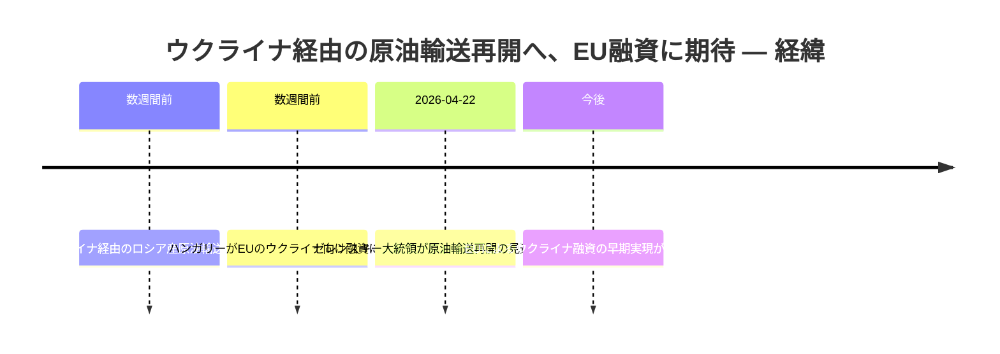
```mermaid
timeline
  title ウクライナ経由の原油輸送再開へ、EU融資に期待 — 経緯
  数週間前 : ウクライナ経由のロシア産原油輸送が停止
  数週間前 : ハンガリーがEUのウクライナ向け融資に反対表明
  2026-04-22 : ゼレンスキー大統領が原油輸送再開の見通しを表明
  今後 : EUによるウクライナ融資の早期実現が期待される
```

### 当事者マップ

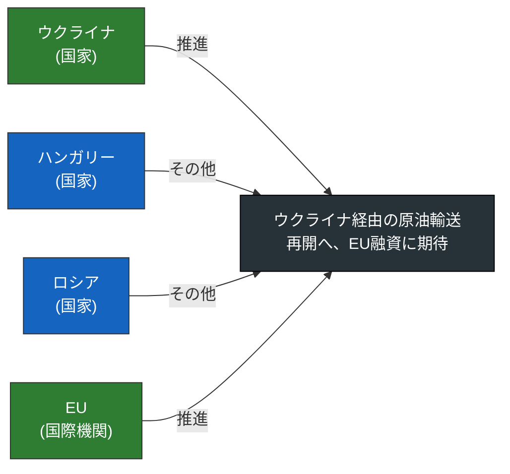
```mermaid
flowchart LR
  T["ウクライナ経由の原油輸送再開へ、EU融資に期待"]
  A0["ウクライナ\n(国家)"]
  A0 -- 推進 --> T
  style A0 fill:#2e7d32,color:#fff,stroke:#333
  A1["ハンガリー\n(国家)"]
  A1 -- その他 --> T
  style A1 fill:#1565c0,color:#fff,stroke:#333
  A2["ロシア\n(国家)"]
  A2 -- その他 --> T
  style A2 fill:#1565c0,color:#fff,stroke:#333
  A3["EU\n(国際機関)"]
  A3 -- 推進 --> T
  style A3 fill:#2e7d32,color:#fff,stroke:#333
  style T fill:#263238,color:#fff,stroke:#000
```

### 影響の広がり

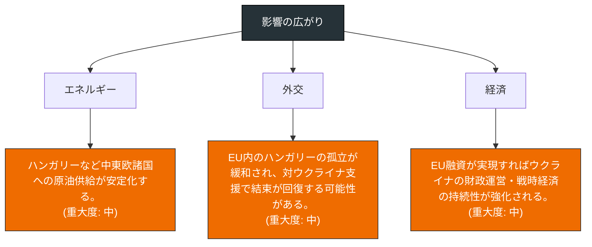
```mermaid
flowchart TB
  R["影響の広がり"]
  D0["エネルギー"]
  I0["ハンガリーなど中東欧諸国への原油供給が安定化する。\n(重大度: 中)"]
  R --> D0 --> I0
  style I0 fill:#ef6c00,color:#fff,stroke:#333
  D1["外交"]
  I1["EU内のハンガリーの孤立が緩和され、対ウクライナ支援で結束が回復する可能性がある。\n(重大度: 中)"]
  R --> D1 --> I1
  style I1 fill:#ef6c00,color:#fff,stroke:#333
  D2["経済"]
  I2["EU融資が実現すればウクライナの財政運営・戦時経済の持続性が強化される。\n(重大度: 中)"]
  R --> D2 --> I2
  style I2 fill:#ef6c00,color:#fff,stroke:#333
  style R fill:#263238,color:#fff,stroke:#000
```

### 当事者の関係ネットワーク

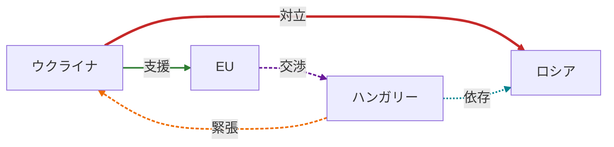
```mermaid
graph LR
  N0["ウクライナ"]
  N1["ハンガリー"]
  N2["ロシア"]
  N3["EU"]
  N0 -->|対立| N2
  N0 -->|支援| N3
  N1 -->|緊張| N0
  N1 -->|依存| N2
  N3 -->|交渉| N1
  linkStyle 0 stroke:#c62828,stroke-width:3px;
  linkStyle 1 stroke:#2e7d32,stroke-width:2px;
  linkStyle 2 stroke:#ef6c00,stroke-width:2px,stroke-dasharray:4 2;
  linkStyle 3 stroke:#00838f,stroke-width:2px,stroke-dasharray:2 2;
  linkStyle 4 stroke:#6a1b9a,stroke-width:2px,stroke-dasharray:4 2;
```

### 押さえるべき論点

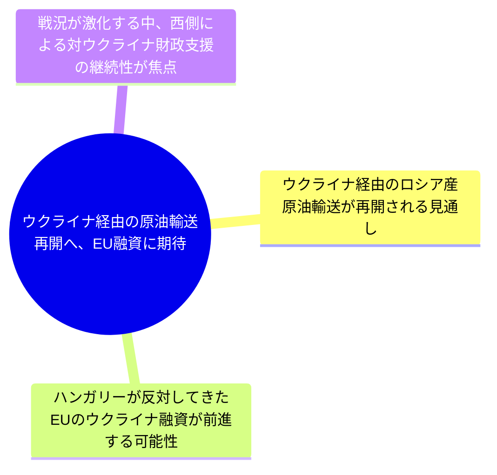
```mermaid
mindmap
  root((ウクライナ経由の原油輸送再開へ、EU融資に期待))
    ウクライナ経由のロシア産原油輸送が再開される見通し
    ハンガリーが反対してきたEUのウクライナ融資が前進する可能性
    戦況が激化する中、西側による対ウクライナ財政支援の継続性が焦点
```

---

重要度「低」の記事(1本) — 見出しのみ

- **日・モンテネグロ首脳会談 ウクライナ等で連携** ([原文](http://www3.nhk.or.jp/news/html/20260422/k10015105761000.html)) — NHK 国際

