# 地政学ニュース図解レポート 2026-04-23 号

生成日時: 2026-04-23 01:39 / 記事数: 5

## EU、対ウクライナ巨額融資の承認手続き開始 `重要度: 中` `europe`
- **出典:** NHK 国際 ([原文](http://www3.nhk.or.jp/news/html/20260422/k10015105981000.html)) / **公開:** 2026-04-22 23:02

**要約**
EUは22日、これまでハンガリーの反対で停滞していたウクライナ向け巨額融資について、承認手続きを開始することを決定した。ハンガリーが反対の根拠としてきたウクライナ経由のロシア産原油輸送について、再開のめどが立ったことが決定の背景にある。融資は23日に正式承認される見通しで、長引く戦時下のウクライナ財政を下支えする重要な枠組みとなる。

**背景**
ウクライナ戦争が長期化する中、EU内ではロシアに融和的なハンガリーの反対により対ウクライナ支援が度々停滞してきた。過去1週間ではNATOがウクライナへのF-16追加供与で調整を進め、ロシア・ウクライナ間のドローン攻撃も過去最多を記録するなど戦況は激化しており、EUとしての財政支援の枠組み再構築が急務となっていた。

**要点**
- EUがハンガリーの反対を乗り越え、対ウクライナ巨額融資の承認手続きを開始

- 打開の決め手はウクライナ経由のロシア産原油輸送再開の見通し

- 23日に融資が正式承認される予定で、戦時下のウクライナ財政を下支え

### 経緯タイムライン

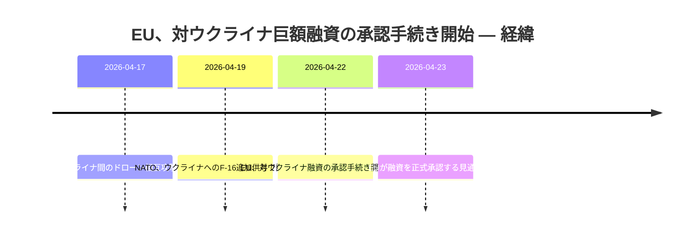
```mermaid
timeline
  title EU、対ウクライナ巨額融資の承認手続き開始 — 経緯
  2026-04-17 : ロシア・ウクライナ間のドローン相互攻撃が過去最多に
  2026-04-19 : NATO、ウクライナへのF-16追加供与で調整を継続
  2026-04-22 : EU、対ウクライナ融資の承認手続き開始を決定
  2026-04-23 : EUが融資を正式承認する見通し
```

### 当事者マップ

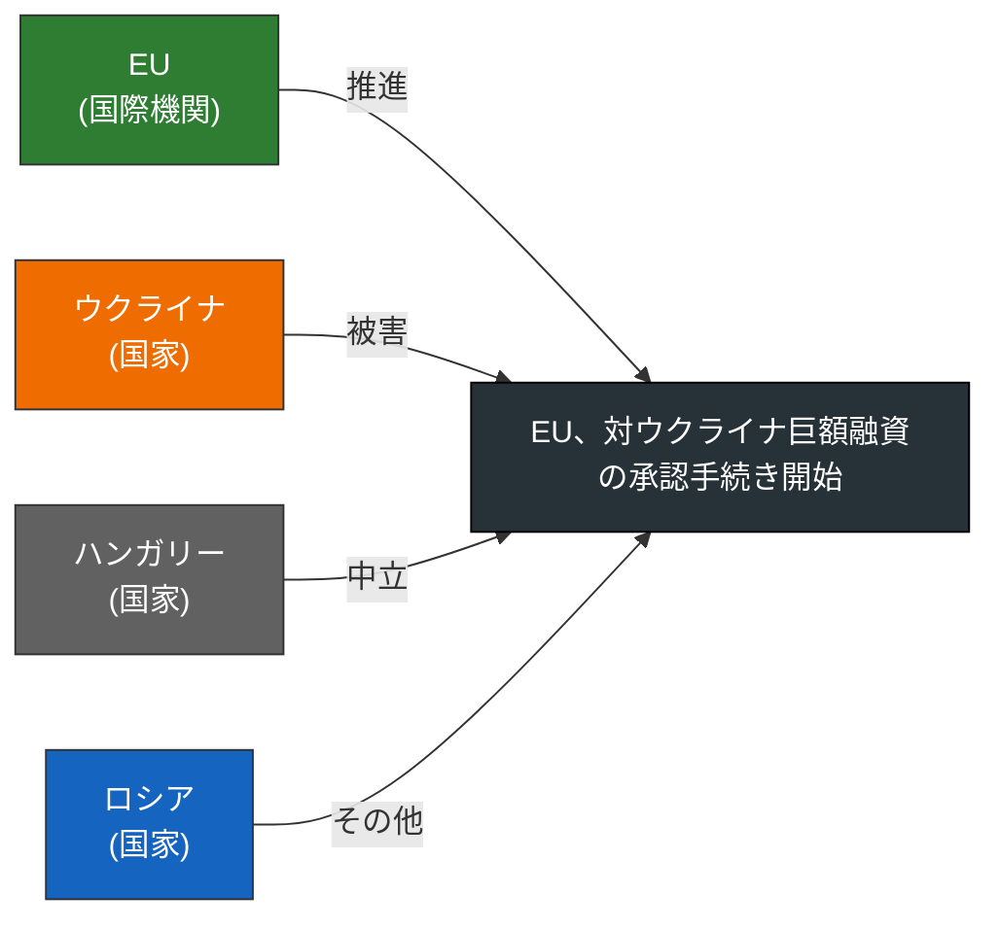
```mermaid
flowchart LR
  T["EU、対ウクライナ巨額融資の承認手続き開始"]
  A0["EU\n(国際機関)"]
  A0 -- 推進 --> T
  style A0 fill:#2e7d32,color:#fff,stroke:#333
  A1["ウクライナ\n(国家)"]
  A1 -- 被害 --> T
  style A1 fill:#ef6c00,color:#fff,stroke:#333
  A2["ハンガリー\n(国家)"]
  A2 -- 中立 --> T
  style A2 fill:#616161,color:#fff,stroke:#333
  A3["ロシア\n(国家)"]
  A3 -- その他 --> T
  style A3 fill:#1565c0,color:#fff,stroke:#333
  style T fill:#263238,color:#fff,stroke:#000
```

### 影響の広がり

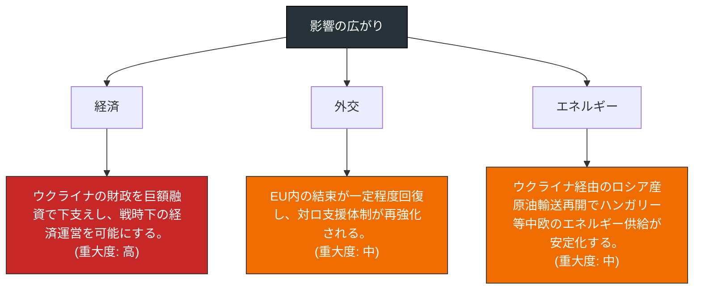
```mermaid
flowchart TB
  R["影響の広がり"]
  D0["経済"]
  I0["ウクライナの財政を巨額融資で下支えし、戦時下の経済運営を可能にする。\n(重大度: 高)"]
  R --> D0 --> I0
  style I0 fill:#c62828,color:#fff,stroke:#333
  D1["外交"]
  I1["EU内の結束が一定程度回復し、対ロ支援体制が再強化される。\n(重大度: 中)"]
  R --> D1 --> I1
  style I1 fill:#ef6c00,color:#fff,stroke:#333
  D2["エネルギー"]
  I2["ウクライナ経由のロシア産原油輸送再開でハンガリー等中欧のエネルギー供給が安定化する。\n(重大度: 中)"]
  R --> D2 --> I2
  style I2 fill:#ef6c00,color:#fff,stroke:#333
  style R fill:#263238,color:#fff,stroke:#000
```

### 当事者の関係ネットワーク

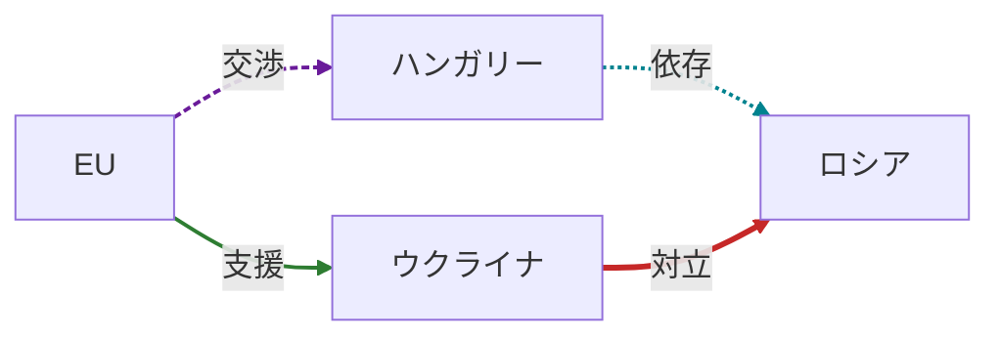
```mermaid
graph LR
  N0["EU"]
  N1["ウクライナ"]
  N2["ハンガリー"]
  N3["ロシア"]
  N0 -->|支援| N1
  N0 -->|交渉| N2
  N2 -->|依存| N3
  N1 -->|対立| N3
  linkStyle 0 stroke:#2e7d32,stroke-width:2px;
  linkStyle 1 stroke:#6a1b9a,stroke-width:2px,stroke-dasharray:4 2;
  linkStyle 2 stroke:#00838f,stroke-width:2px,stroke-dasharray:2 2;
  linkStyle 3 stroke:#c62828,stroke-width:3px;
```

### 押さえるべき論点

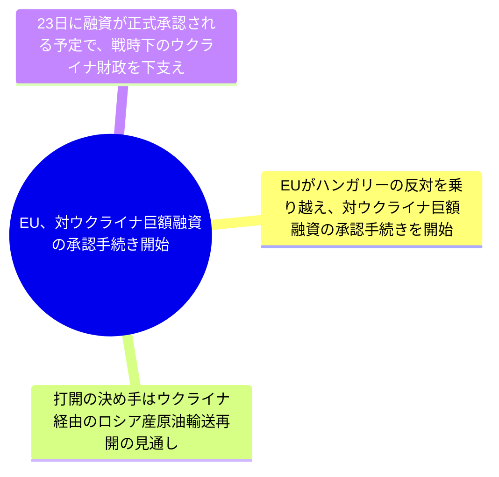
```mermaid
mindmap
  root((EU、対ウクライナ巨額融資の承認手続き開始))
    EUがハンガリーの反対を乗り越え、対ウクライナ巨額融資の承認手続きを開始
    打開の決め手はウクライナ経由のロシア産原油輸送再開の見通し
    23日に融資が正式承認される予定で、戦時下のウクライナ財政を下支え
```

---

## 中国、台湾総統アフリカ訪問断念で関係国を評価 `重要度: 中` `east_asia / africa`
- **出典:** NHK 国際 ([原文](http://www3.nhk.or.jp/news/html/20260422/k10015105701000.html)) / **公開:** 2026-04-22 20:37

**要約**
台湾の頼清徳総統が予定していたアフリカ訪問を見合わせた。台湾側は専用機が通過する一部の国が中国の圧力を受けて飛行許可を取り消したためだと主張している。これに対し中国政府は「関係国の対応を評価する」と述べ、国際社会に「一つの中国」原則の順守を求める姿勢を改めて示すとともに、台湾当局を強く批判した。台湾の外交空間を狭める中国の圧力が、軍事だけでなく外交・航空面にも及んでいる構図が浮き彫りになった。

**背景**
台湾の外交的孤立化を狙う中国の圧力は近年強まっており、中米・アフリカで台湾と断交する国が相次いでいる。過去1週間でも中国は台湾海峡で軍事演習を拡大し、日米が即応体制を強化するなど緊張が高まっていた。今回のアフリカ訪問断念は、軍事圧力と並行して外交面でも台湾封じ込めが進んでいることを示す事例といえる。

**要点**
- 台湾総統のアフリカ訪問が、経由国の飛行許可取消により中止に追い込まれた

- 中国は「関係国の対応を評価」と述べ、第三国への圧力の成果を事実上認める姿勢

- 軍事演習拡大と並行した外交圧力で、台湾の国際空間が一段と狭まりつつある

### 経緯タイムライン

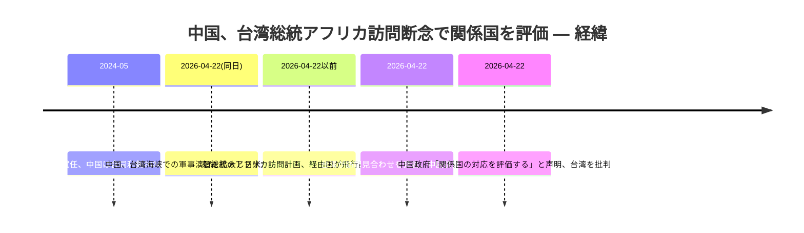
```mermaid
timeline
  title 中国、台湾総統アフリカ訪問断念で関係国を評価 — 経緯
  2024-05 : 頼清徳総統就任、中国は合同利剣2024A演習で圧力
  2026-04-22(同日) : 中国、台湾海峡での軍事演習を拡大し日米が即応体制強化
  2026-04-22以前 : 頼総統のアフリカ訪問計画、経由国が飛行許可を取り消し
  2026-04-22 : 台湾が訪問見合わせを発表、中国側圧力を主張
  2026-04-22 : 中国政府「関係国の対応を評価する」と声明、台湾を批判
```

### 当事者マップ

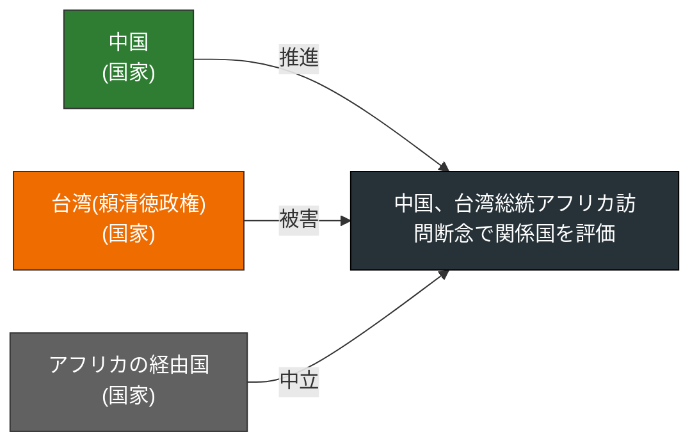
```mermaid
flowchart LR
  T["中国、台湾総統アフリカ訪問断念で関係国を評価"]
  A0["中国\n(国家)"]
  A0 -- 推進 --> T
  style A0 fill:#2e7d32,color:#fff,stroke:#333
  A1["台湾(頼清徳政権)\n(国家)"]
  A1 -- 被害 --> T
  style A1 fill:#ef6c00,color:#fff,stroke:#333
  A2["アフリカの経由国\n(国家)"]
  A2 -- 中立 --> T
  style A2 fill:#616161,color:#fff,stroke:#333
  style T fill:#263238,color:#fff,stroke:#000
```

### 影響の広がり

```mermaid
flowchart TB
  R["影響の広がり"]
  D0["外交"]
  I0["台湾総統の外遊が物理的に困難となり、残存する友好国との関係維持にも支障が出る可能性。\n(重大度: 中)"]
  R --> D0 --> I0
  style I0 fill:#ef6c00,color:#fff,stroke:#333
  D1["安全保障"]
  I1["軍事演習拡大と外交圧力が同時並行で進み、台湾海峡の緊張をさらに高める要因となる。\n(重大度: 中)"]
  R --> D1 --> I1
  style I1 fill:#ef6c00,color:#fff,stroke:#333
  D2["経済"]
  I2["経由国の航空当局が中国への配慮を優先する判断を重ねれば、台湾の国際的ビジネス往来にも波及しうる。\n(重大度: 低)"]
  R --> D2 --> I2
  style I2 fill:#2e7d32,color:#fff,stroke:#333
  style R fill:#263238,color:#fff,stroke:#000
```

### 当事者の関係ネットワーク

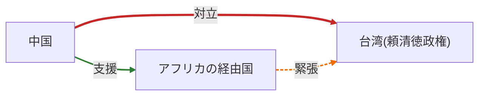
```mermaid
graph LR
  N0["中国"]
  N1["台湾(頼清徳政権)"]
  N2["アフリカの経由国"]
  N0 -->|対立| N1
  N0 -->|支援| N2
  N2 -->|緊張| N1
  linkStyle 0 stroke:#c62828,stroke-width:3px;
  linkStyle 1 stroke:#2e7d32,stroke-width:2px;
  linkStyle 2 stroke:#ef6c00,stroke-width:2px,stroke-dasharray:4 2;
```

### 押さえるべき論点

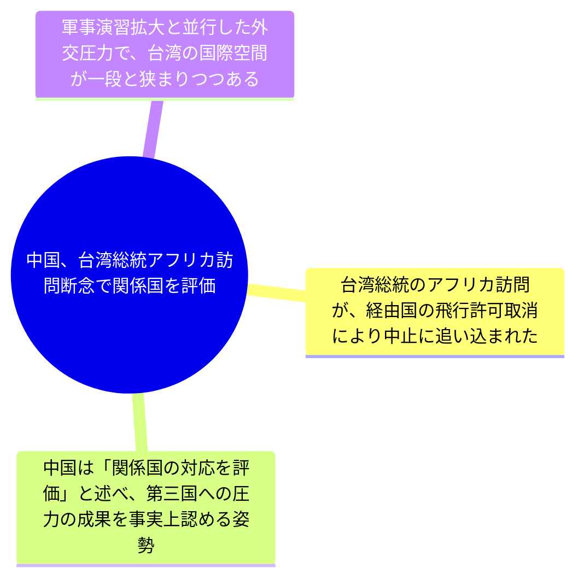
```mermaid
mindmap
  root((中国、台湾総統アフリカ訪問断念で関係国を評価))
    台湾総統のアフリカ訪問が、経由国の飛行許可取消により中止に追い込まれた
    中国は「関係国の対応を評価」と述べ、第三国への圧力の成果を事実上認める姿勢
    軍事演習拡大と並行した外交圧力で、台湾の国際空間が一段と狭まりつつある
```

---

## 原油輸送再開見通し、EU対ウクライナ融資に道 `重要度: 中` `europe`
- **出典:** NHK 国際 ([原文](http://www3.nhk.or.jp/news/html/20260422/k10015105691000.html)) / **公開:** 2026-04-22 19:37

**要約**
ウクライナのゼレンスキー大統領は、自国領を経由したロシア産原油のハンガリーなどへの輸送が再開される見通しを示した。ハンガリーはウクライナが意図的に輸送を止めているとして、EUからウクライナへの巨額融資に反対してきた。輸送再開により、ハンガリーの反対論が弱まり、融資が早期に実現することへの期待感が高まっている。ウクライナにとっては戦時下の財政を支える重要な資金源となる。

**背景**
ロシア産原油はウクライナを通るドルジバ・パイプラインを経由して中東欧内陸国へ供給されており、EUの制裁対象外となっている。過去1週間でもNATOはF-16追加供与や東欧配備強化を議論するなど対ウクライナ支援の足並みをそろえる一方、ハンガリーは融資に難色を示し続けてきた。ドローン相互攻撃が過去最多に達する戦況の中、EU融資の実現可否はウクライナの継戦能力を左右する局面にある。

**要点**
- ウクライナ経由のロシア産原油輸送が再開される見通し

- ハンガリーの反対論が後退し、EUの対ウクライナ融資実現に弾み

- 戦時下のウクライナ財政と欧州のエネルギー供給双方に影響する節目の動き

### 経緯タイムライン

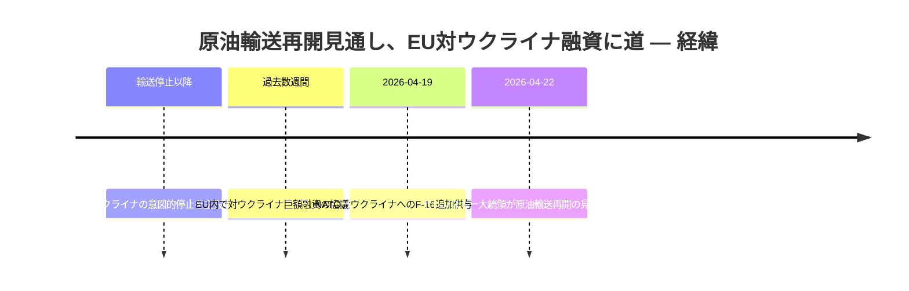
```mermaid
timeline
  title 原油輸送再開見通し、EU対ウクライナ融資に道 — 経緯
  輸送停止以降 : ハンガリーがウクライナの意図的停止を主張、EU融資に反対
  過去数週間 : EU内で対ウクライナ巨額融資の協議が難航
  2026-04-19 : NATO、ウクライナへのF-16追加供与を調整
  2026-04-22 : ゼレンスキー大統領が原油輸送再開の見通しを表明
```

### 当事者マップ

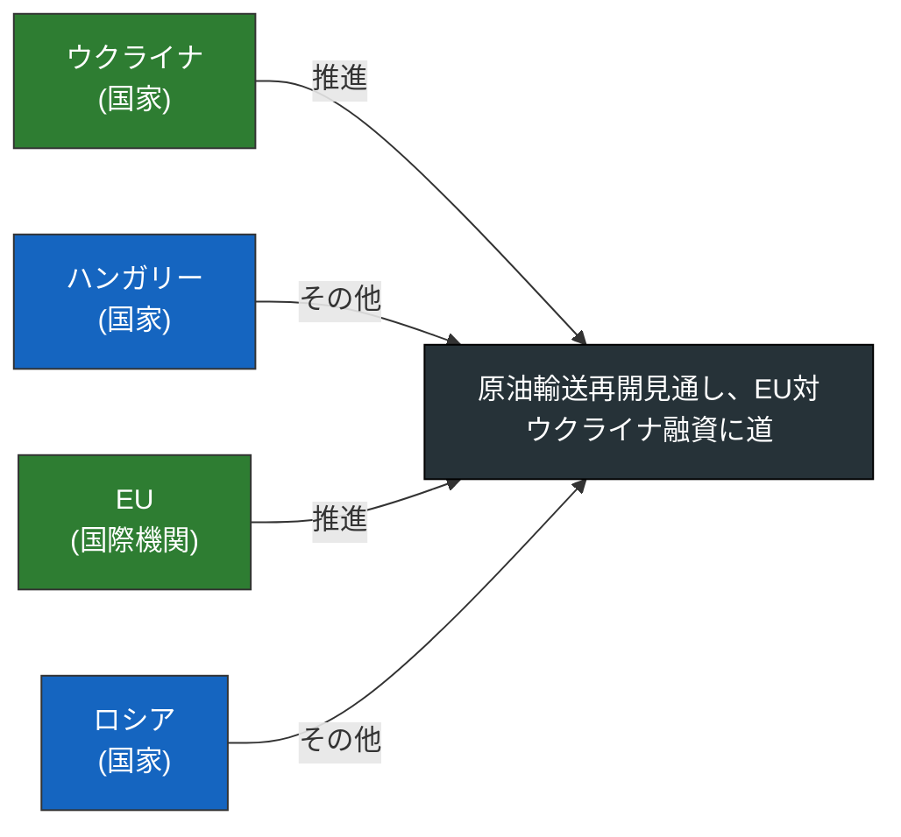
```mermaid
flowchart LR
  T["原油輸送再開見通し、EU対ウクライナ融資に道"]
  A0["ウクライナ\n(国家)"]
  A0 -- 推進 --> T
  style A0 fill:#2e7d32,color:#fff,stroke:#333
  A1["ハンガリー\n(国家)"]
  A1 -- その他 --> T
  style A1 fill:#1565c0,color:#fff,stroke:#333
  A2["EU\n(国際機関)"]
  A2 -- 推進 --> T
  style A2 fill:#2e7d32,color:#fff,stroke:#333
  A3["ロシア\n(国家)"]
  A3 -- その他 --> T
  style A3 fill:#1565c0,color:#fff,stroke:#333
  style T fill:#263238,color:#fff,stroke:#000
```

### 影響の広がり

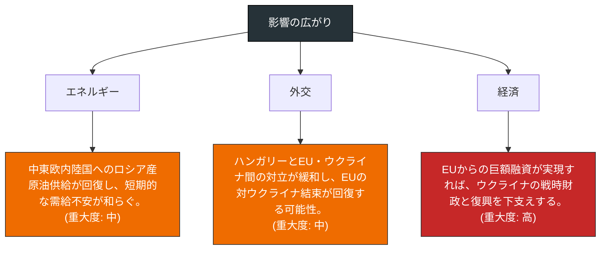
```mermaid
flowchart TB
  R["影響の広がり"]
  D0["エネルギー"]
  I0["中東欧内陸国へのロシア産原油供給が回復し、短期的な需給不安が和らぐ。\n(重大度: 中)"]
  R --> D0 --> I0
  style I0 fill:#ef6c00,color:#fff,stroke:#333
  D1["外交"]
  I1["ハンガリーとEU・ウクライナ間の対立が緩和し、EUの対ウクライナ結束が回復する可能性。\n(重大度: 中)"]
  R --> D1 --> I1
  style I1 fill:#ef6c00,color:#fff,stroke:#333
  D2["経済"]
  I2["EUからの巨額融資が実現すれば、ウクライナの戦時財政と復興を下支えする。\n(重大度: 高)"]
  R --> D2 --> I2
  style I2 fill:#c62828,color:#fff,stroke:#333
  style R fill:#263238,color:#fff,stroke:#000
```

### 当事者の関係ネットワーク

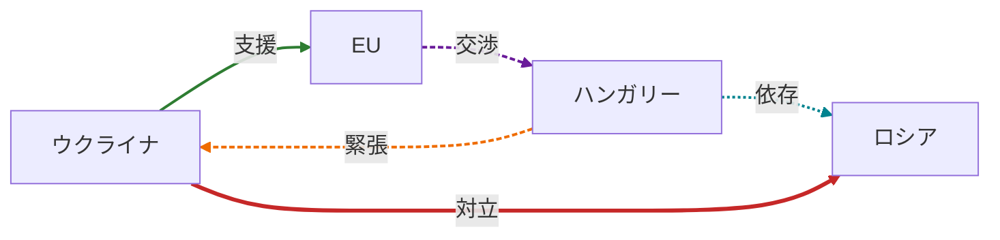
```mermaid
graph LR
  N0["ウクライナ"]
  N1["ハンガリー"]
  N2["EU"]
  N3["ロシア"]
  N0 -->|支援| N2
  N2 -->|交渉| N1
  N1 -->|緊張| N0
  N1 -->|依存| N3
  N0 -->|対立| N3
  linkStyle 0 stroke:#2e7d32,stroke-width:2px;
  linkStyle 1 stroke:#6a1b9a,stroke-width:2px,stroke-dasharray:4 2;
  linkStyle 2 stroke:#ef6c00,stroke-width:2px,stroke-dasharray:4 2;
  linkStyle 3 stroke:#00838f,stroke-width:2px,stroke-dasharray:2 2;
  linkStyle 4 stroke:#c62828,stroke-width:3px;
```

### 押さえるべき論点

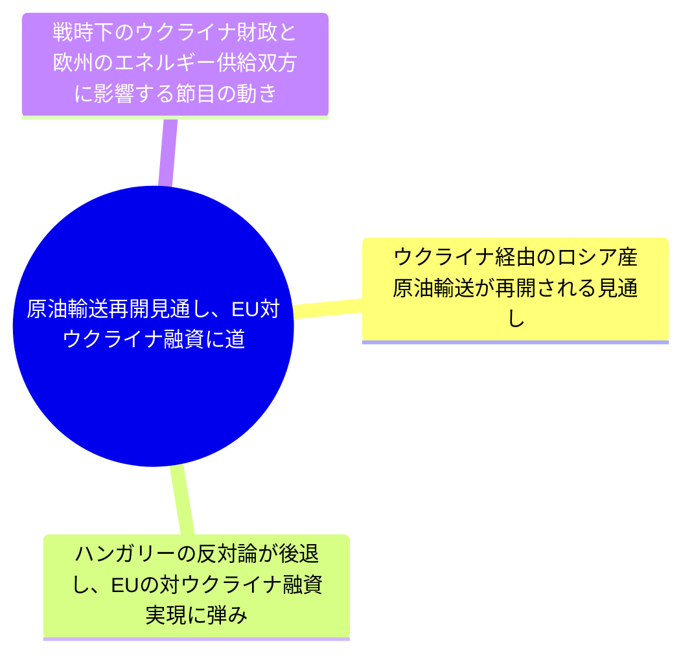
```mermaid
mindmap
  root((原油輸送再開見通し、EU対ウクライナ融資に道))
    ウクライナ経由のロシア産原油輸送が再開される見通し
    ハンガリーの反対論が後退し、EUの対ウクライナ融資実現に弾み
    戦時下のウクライナ財政と欧州のエネルギー供給双方に影響する節目の動き
```

---

## ロシアのウクライナ侵攻、22日の動き `重要度: 中` `europe / global`
- **出典:** NHK 国際 ([原文](http://www3.nhk.or.jp/news/html/20260422/k10015082691000.html)) / **公開:** 2026-04-22 16:44

**要約**
ロシアによるウクライナ侵攻が続き、各地で戦闘が継続している。ウクライナ軍とロシア軍の衝突により大勢の市民が国外避難を余儀なくされている。戦況と関連する各国外交の動きが随時報じられている。NHKは日本時間22日の状況を随時更新で伝えている。

**背景**
侵攻は長期化し、直近ではロ朝合同軍事演習の発表（21日）、NATOによるF-16追加供与調整（19日）、ドローン相互攻撃の過去最多記録（17日）など、戦線の膠着と国際関与の深化が並行している。また22日にはNATOが東欧への追加配備を協議するなど、欧州全体での警戒態勢が強まっている。

**要点**
- ロシアによる侵攻は長期化し、22日も各地で戦闘が継続

- 市民の国外避難が続き、人道危機が拡大している

- NATOの東欧追加配備協議やF-16供与調整など、欧米の関与が強まっている

### 経緯タイムライン

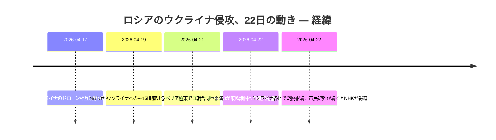
```mermaid
timeline
  title ロシアのウクライナ侵攻、22日の動き — 経緯
  2026-04-17 : ロシア・ウクライナのドローン相互攻撃が過去最多を記録
  2026-04-19 : NATOがウクライナへのF-16追加供与で調整
  2026-04-21 : ロシア、シベリア極東でロ朝合同軍事演習を発表
  2026-04-22 : NATOが東欧諸国への追加配備を協議
  2026-04-22 : ウクライナ各地で戦闘継続、市民避難が続くとNHKが報道
```

### 当事者マップ

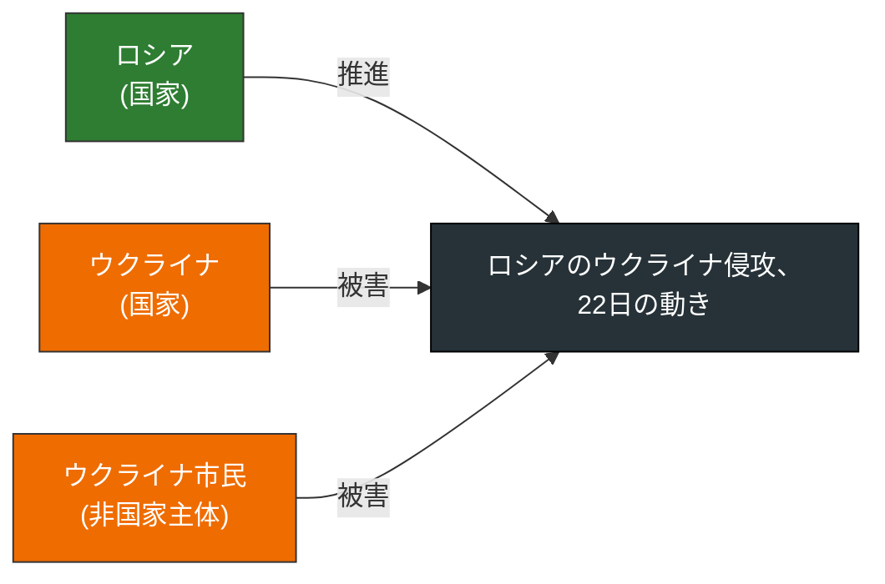
```mermaid
flowchart LR
  T["ロシアのウクライナ侵攻、22日の動き"]
  A0["ロシア\n(国家)"]
  A0 -- 推進 --> T
  style A0 fill:#2e7d32,color:#fff,stroke:#333
  A1["ウクライナ\n(国家)"]
  A1 -- 被害 --> T
  style A1 fill:#ef6c00,color:#fff,stroke:#333
  A2["ウクライナ市民\n(非国家主体)"]
  A2 -- 被害 --> T
  style A2 fill:#ef6c00,color:#fff,stroke:#333
  style T fill:#263238,color:#fff,stroke:#000
```

### 影響の広がり

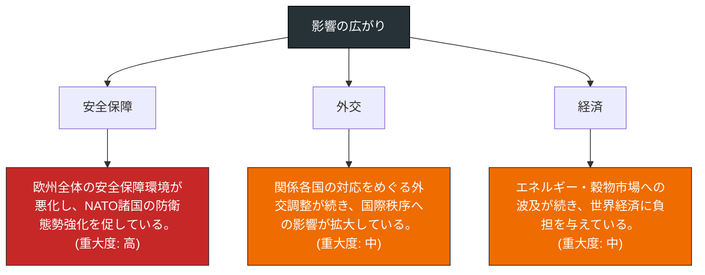
```mermaid
flowchart TB
  R["影響の広がり"]
  D0["安全保障"]
  I0["欧州全体の安全保障環境が悪化し、NATO諸国の防衛態勢強化を促している。\n(重大度: 高)"]
  R --> D0 --> I0
  style I0 fill:#c62828,color:#fff,stroke:#333
  D1["外交"]
  I1["関係各国の対応をめぐる外交調整が続き、国際秩序への影響が拡大している。\n(重大度: 中)"]
  R --> D1 --> I1
  style I1 fill:#ef6c00,color:#fff,stroke:#333
  D2["経済"]
  I2["エネルギー・穀物市場への波及が続き、世界経済に負担を与えている。\n(重大度: 中)"]
  R --> D2 --> I2
  style I2 fill:#ef6c00,color:#fff,stroke:#333
  style R fill:#263238,color:#fff,stroke:#000
```

### 当事者の関係ネットワーク

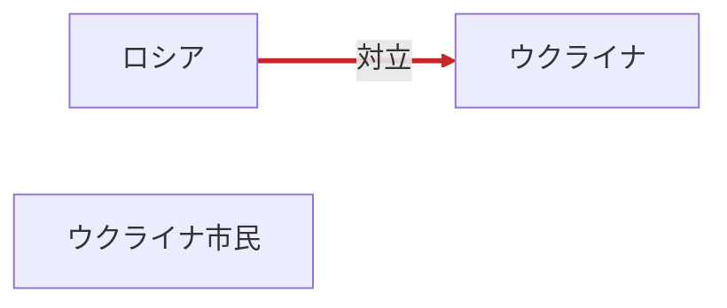
```mermaid
graph LR
  N0["ロシア"]
  N1["ウクライナ"]
  N2["ウクライナ市民"]
  N0 -->|対立| N1
  linkStyle 0 stroke:#c62828,stroke-width:3px;
```

### 押さえるべき論点

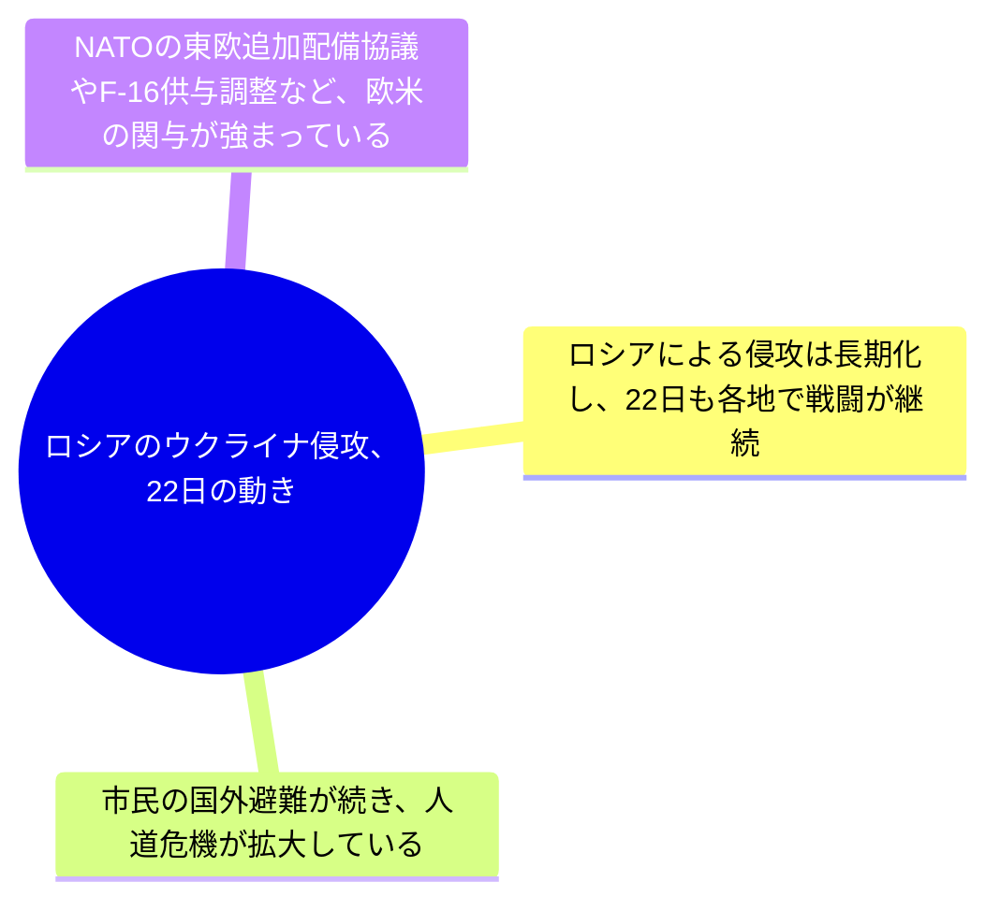
```mermaid
mindmap
  root((ロシアのウクライナ侵攻、22日の動き))
    ロシアによる侵攻は長期化し、22日も各地で戦闘が継続
    市民の国外避難が続き、人道危機が拡大している
    NATOの東欧追加配備協議やF-16供与調整など、欧米の関与が強まっている
```

---

重要度「低」の記事(1本) — 見出しのみ

- **日・モンテネグロ首脳会談、ウクライナ等で連携** ([原文](http://www3.nhk.or.jp/news/html/20260422/k10015105761000.html)) — NHK 国際

