# 地政学ニュース図解レポート 2026-04-24 号

生成日時: 2026-04-24 07:42 / 記事数: 5

## 📌 本日の要点

- **米高官、在日米軍態勢強化を最優先と表明** — アメリカ国防総省の高官は、インド太平洋地域に展開する米軍について、日本における態勢強化を最優先事項の一つとして位置づけていると明らかにしました。

## 米高官、在日米軍態勢強化を最優先と表明 `重要度: 高` `east_asia / southeast_asia`
- **出典:** NHK 国際 ([原文](http://www3.nhk.or.jp/news/html/20260423/k10015106081000.html)) / **公開:** 2026-04-23 10:18

**要約**
アメリカ国防総省の高官は、インド太平洋地域に展開する米軍について、日本における態勢強化を最優先事項の一つとして位置づけていると明らかにしました。同時に、日本政府が進めている防衛力強化策にも期待を示しました。インド太平洋の戦略環境が急速に変化する中、日米同盟の抑止力と対処力の向上を一体的に進める姿勢が改めて確認された形です。

**背景**
4月18日の日米2+2では在日米軍統合軍司令部の運用開始が正式発表され、指揮統制の一体化が進展しました。また22日には中国の台湾海峡での軍事演習拡大を受けて日米が即応体制を強化、フィリピンも米軍艦寄港拠点を追加するなど、地域全体で対中抑止の布陣が進んでいます。今回の発言はこうした一連の動きの中で、日本を米軍の前方展開の要と位置付ける姿勢を改めて示したものです。

**要点**
- 米国防総省高官が在日米軍の態勢強化を最優先と明言し、日本が対中抑止の中核拠点であることを再確認

- 直前の日米2+2での統合軍司令部運用開始と連動し、日米の指揮統制一体化が進展

- 米国は日本の防衛力強化策にも期待を示し、役割・任務分担の一層の深化が今後の焦点

### 経緯タイムライン

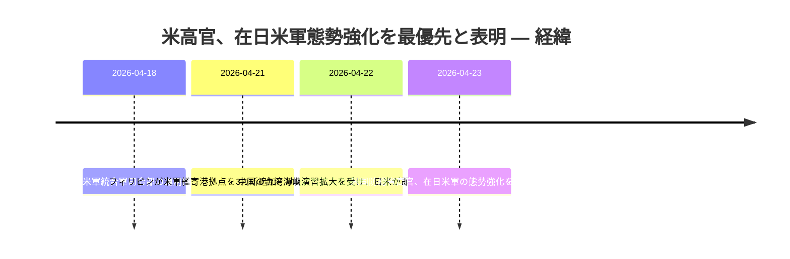
```mermaid
timeline
  title 米高官、在日米軍態勢強化を最優先と表明 — 経緯
  2026-04-18 : 日米2+2で在日米軍統合軍司令部の運用開始を正式発表
  2026-04-21 : フィリピンが米軍艦寄港拠点を3カ所追加、地域の米軍展開が拡大
  2026-04-22 : 中国の台湾海峡演習拡大を受け、日米が即応体制を強化
  2026-04-23 : 米国防総省高官、在日米軍の態勢強化を最優先と表明
```

### 当事者マップ

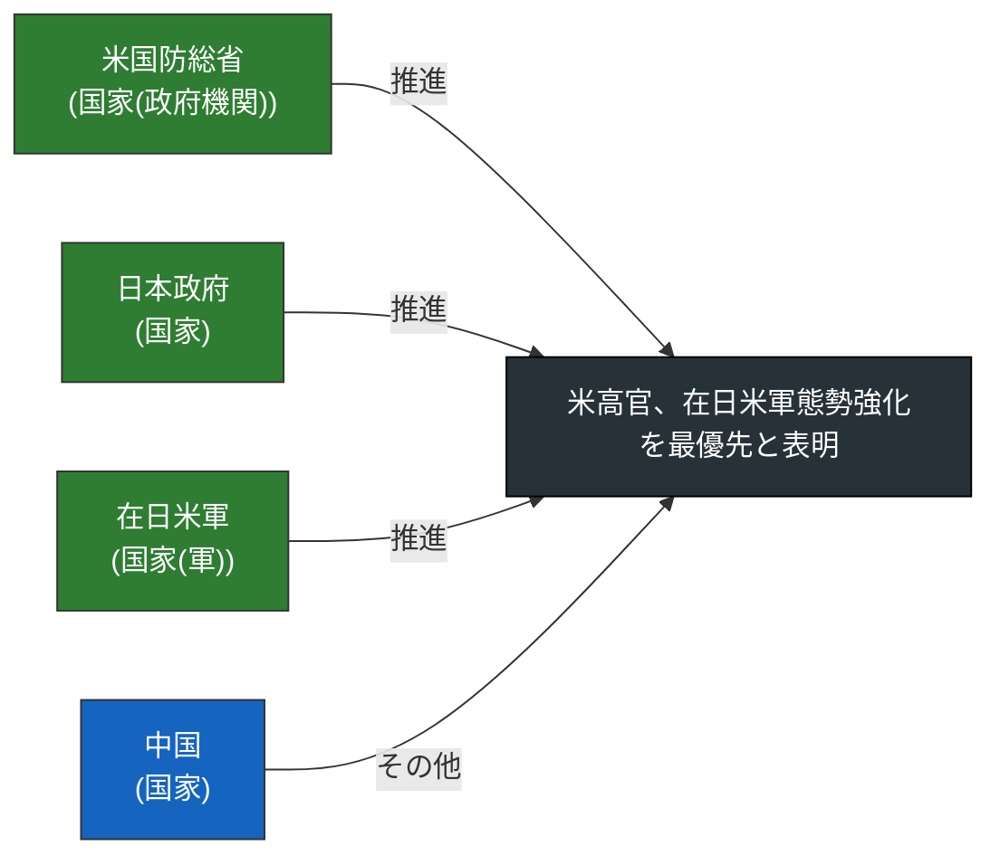
```mermaid
flowchart LR
  T["米高官、在日米軍態勢強化を最優先と表明"]
  A0["米国防総省\n(国家(政府機関))"]
  A0 -- 推進 --> T
  style A0 fill:#2e7d32,color:#fff,stroke:#333
  A1["日本政府\n(国家)"]
  A1 -- 推進 --> T
  style A1 fill:#2e7d32,color:#fff,stroke:#333
  A2["在日米軍\n(国家(軍))"]
  A2 -- 推進 --> T
  style A2 fill:#2e7d32,color:#fff,stroke:#333
  A3["中国\n(国家)"]
  A3 -- その他 --> T
  style A3 fill:#1565c0,color:#fff,stroke:#333
  style T fill:#263238,color:#fff,stroke:#000
```

### 影響の広がり

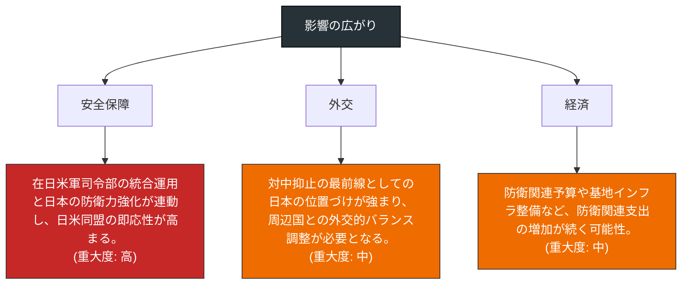
```mermaid
flowchart TB
  R["影響の広がり"]
  D0["安全保障"]
  I0["在日米軍司令部の統合運用と日本の防衛力強化が連動し、日米同盟の即応性が高まる。\n(重大度: 高)"]
  R --> D0 --> I0
  style I0 fill:#c62828,color:#fff,stroke:#333
  D1["外交"]
  I1["対中抑止の最前線としての日本の位置づけが強まり、周辺国との外交的バランス調整が必要となる。\n(重大度: 中)"]
  R --> D1 --> I1
  style I1 fill:#ef6c00,color:#fff,stroke:#333
  D2["経済"]
  I2["防衛関連予算や基地インフラ整備など、防衛関連支出の増加が続く可能性。\n(重大度: 中)"]
  R --> D2 --> I2
  style I2 fill:#ef6c00,color:#fff,stroke:#333
  style R fill:#263238,color:#fff,stroke:#000
```

### 当事者の関係ネットワーク

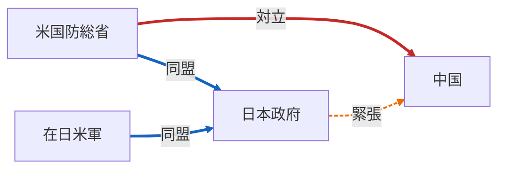
```mermaid
graph LR
  N0["米国防総省"]
  N1["日本政府"]
  N2["在日米軍"]
  N3["中国"]
  N0 -->|同盟| N1
  N2 -->|同盟| N1
  N0 -->|対立| N3
  N1 -->|緊張| N3
  linkStyle 0 stroke:#1565c0,stroke-width:3px;
  linkStyle 1 stroke:#1565c0,stroke-width:3px;
  linkStyle 2 stroke:#c62828,stroke-width:3px;
  linkStyle 3 stroke:#ef6c00,stroke-width:2px,stroke-dasharray:4 2;
```

### 押さえるべき論点

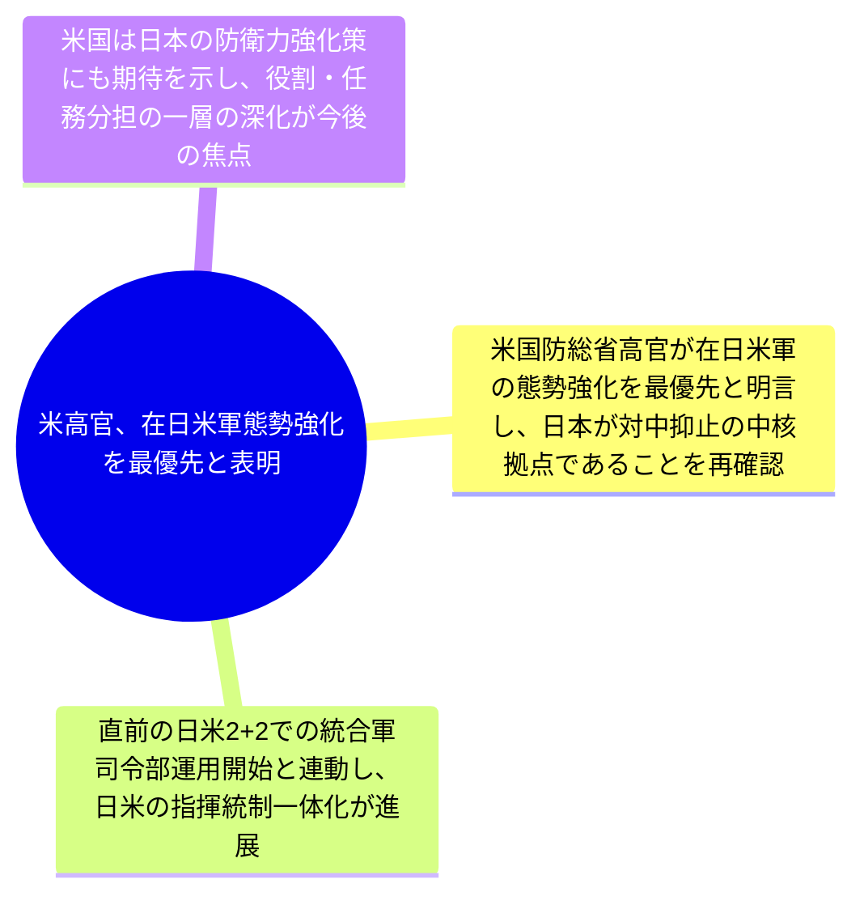
```mermaid
mindmap
  root((米高官、在日米軍態勢強化を最優先と表明))
    米国防総省高官が在日米軍の態勢強化を最優先と明言し、日本が対中抑止の中核拠点であることを再確認
    直前の日米2+2での統合軍司令部運用開始と連動し、日米の指揮統制一体化が進展
    米国は日本の防衛力強化策にも期待を示し、役割・任務分担の一層の深化が今後の焦点
```

---

## EU、ウクライナへ16兆円融資を全加盟国承認 `重要度: 中` `europe / global`
- **出典:** NHK 国際 ([原文](http://www3.nhk.or.jp/news/html/20260423/k10015106811000.html)) / **公開:** 2026-04-23 23:36

**要約**
EUは4月23日、ウクライナに対する16兆円規模の大型融資について、全27加盟国の承認を得たと発表した。ロシアによる軍事侵攻の長期化で財政・軍事両面の支援需要が急増しており、EUは迅速な資金供与を迫られていた。この決定はウクライナの財政基盤と戦争遂行能力を下支えするものとなる。過去1週間ではNATOによるF-16追加供与調整や東欧への追加配備協議も進んでおり、欧州の対ウクライナ支援が加速している。

**背景**
ロシアの侵攻は長期化し、ウクライナ・ロシア双方のドローン攻撃は過去最多を記録するなど戦闘が激化している。4月19日にはNATOがF-16追加供与で調整に入り、22日にはNATOが東欧への追加配備を協議するなど、欧州側の支援・抑止策が連続して進展してきた。今回のEU融資はその一連の流れの中で、ウクライナの財政崩壊を防ぐ決定的な経済支援として位置づけられる。

**要点**
- EU全27加盟国がウクライナへの16兆円規模融資を承認

- 戦争長期化に伴う財政需要拡大に対応した大型支援策

- NATOの追加軍事支援と並ぶ、欧州による包括的なウクライナ支援強化の一環

### 経緯タイムライン

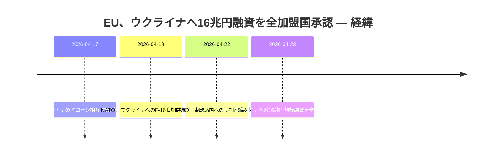
```mermaid
timeline
  title EU、ウクライナへ16兆円融資を全加盟国承認 — 経緯
  2026-04-17 : ロシア・ウクライナのドローン相互攻撃が過去最多を記録
  2026-04-19 : NATO、ウクライナへのF-16追加供与で調整
  2026-04-22 : NATO、東欧諸国への追加配備を協議
  2026-04-23 : EU、ウクライナへの16兆円規模融資を全加盟国が承認
```

### 当事者マップ

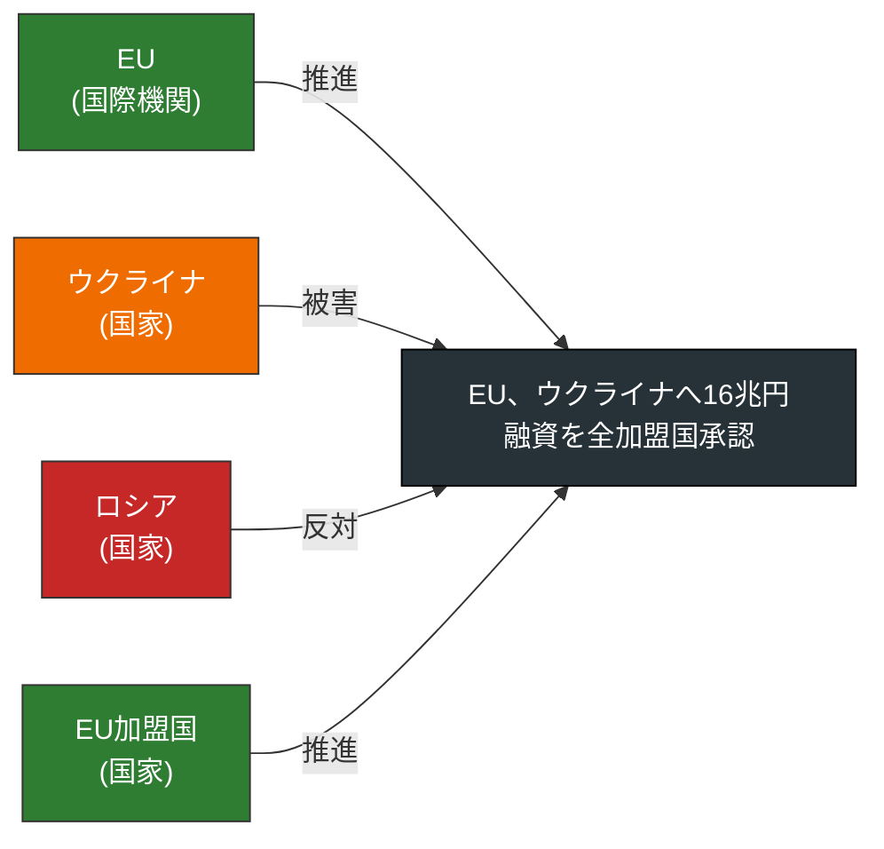
```mermaid
flowchart LR
  T["EU、ウクライナへ16兆円融資を全加盟国承認"]
  A0["EU\n(国際機関)"]
  A0 -- 推進 --> T
  style A0 fill:#2e7d32,color:#fff,stroke:#333
  A1["ウクライナ\n(国家)"]
  A1 -- 被害 --> T
  style A1 fill:#ef6c00,color:#fff,stroke:#333
  A2["ロシア\n(国家)"]
  A2 -- 反対 --> T
  style A2 fill:#c62828,color:#fff,stroke:#333
  A3["EU加盟国\n(国家)"]
  A3 -- 推進 --> T
  style A3 fill:#2e7d32,color:#fff,stroke:#333
  style T fill:#263238,color:#fff,stroke:#000
```

### 影響の広がり

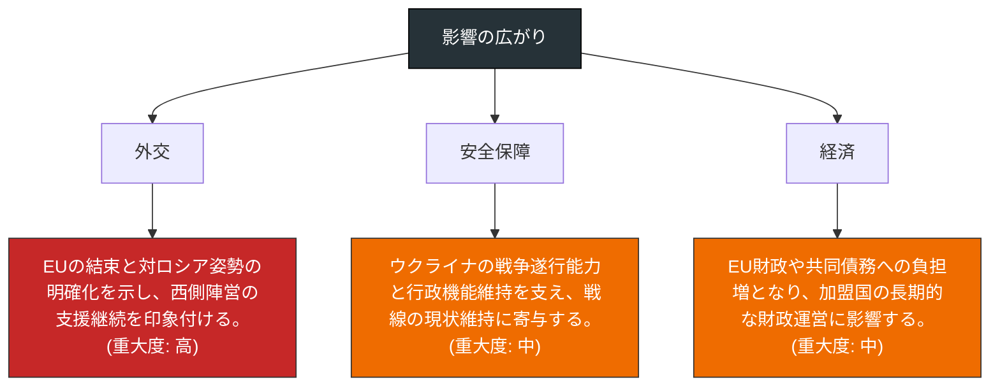
```mermaid
flowchart TB
  R["影響の広がり"]
  D0["外交"]
  I0["EUの結束と対ロシア姿勢の明確化を示し、西側陣営の支援継続を印象付ける。\n(重大度: 高)"]
  R --> D0 --> I0
  style I0 fill:#c62828,color:#fff,stroke:#333
  D1["安全保障"]
  I1["ウクライナの戦争遂行能力と行政機能維持を支え、戦線の現状維持に寄与する。\n(重大度: 中)"]
  R --> D1 --> I1
  style I1 fill:#ef6c00,color:#fff,stroke:#333
  D2["経済"]
  I2["EU財政や共同債務への負担増となり、加盟国の長期的な財政運営に影響する。\n(重大度: 中)"]
  R --> D2 --> I2
  style I2 fill:#ef6c00,color:#fff,stroke:#333
  style R fill:#263238,color:#fff,stroke:#000
```

### 当事者の関係ネットワーク

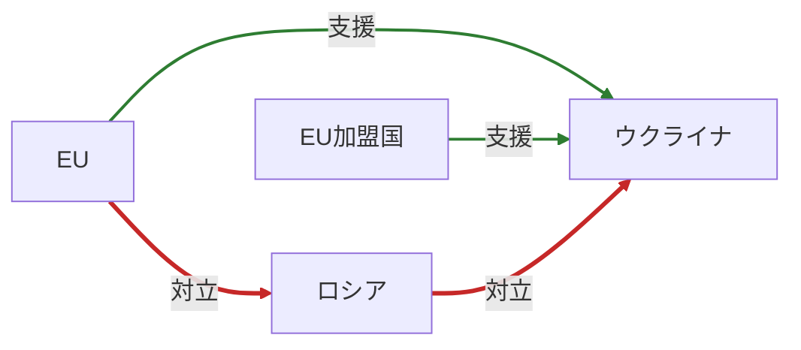
```mermaid
graph LR
  N0["EU"]
  N1["ウクライナ"]
  N2["ロシア"]
  N3["EU加盟国"]
  N0 -->|支援| N1
  N3 -->|支援| N1
  N0 -->|対立| N2
  N2 -->|対立| N1
  linkStyle 0 stroke:#2e7d32,stroke-width:2px;
  linkStyle 1 stroke:#2e7d32,stroke-width:2px;
  linkStyle 2 stroke:#c62828,stroke-width:3px;
  linkStyle 3 stroke:#c62828,stroke-width:3px;
```

### 押さえるべき論点

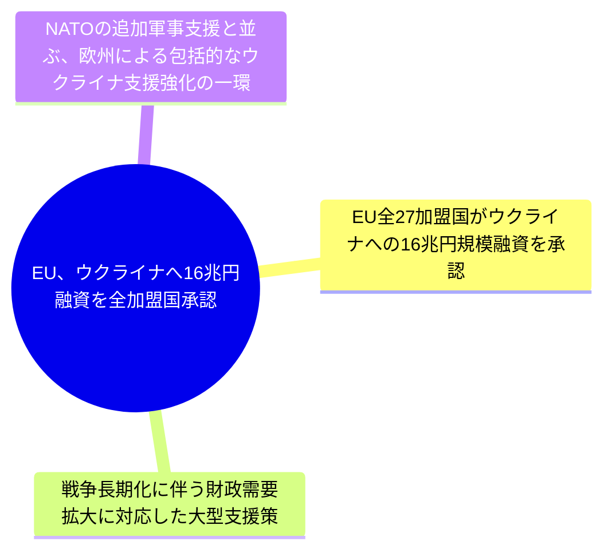
```mermaid
mindmap
  root((EU、ウクライナへ16兆円融資を全加盟国承認))
    EU全27加盟国がウクライナへの16兆円規模融資を承認
    戦争長期化に伴う財政需要拡大に対応した大型支援策
    NATOの追加軍事支援と並ぶ、欧州による包括的なウクライナ支援強化の一環
```

---

## 米、中国の台湾威嚇を非難 頼総統外遊中止 `重要度: 中` `east_asia / africa`
- **出典:** NHK 国際 ([原文](http://www3.nhk.or.jp/news/html/20260423/k10015106331000.html)) / **公開:** 2026-04-23 19:26

**要約**
台湾の頼清徳総統が専用機の飛行許可をアフリカの一部島国で取り消されたことを受け、予定していた外国訪問を見合わせた。米国務省はこれを「中国による台湾への威嚇キャンペーン」と非難した。中国が外交的圧力を通じて台湾の国際空間を狭めようとする動きが改めて浮き彫りとなり、米台と中国の対立構図が一段と鮮明になっている。

**背景**
中国は頼清徳政権発足以降、軍事演習とともに外交的孤立化を強めており、4月22日には台湾海峡での軍事演習拡大が伝えられ日米が即応体制を強化したばかり。今回の飛行許可取消しは中国がアフリカの国交国に圧力をかけた可能性が高く、軍事・外交・経済を組み合わせた複合的な「威嚇キャンペーン」の一環と位置づけられる。

**要点**
- 頼清徳総統の外遊が、アフリカの一部島国による飛行許可取消しで中止に追い込まれた

- 米国務省は中国が第三国に圧力をかけた「威嚇キャンペーン」と明確に非難

- 軍事演習拡大と並行した外交圧力により、台湾海峡情勢は軍事・外交両面で緊張度が高まっている

### 経緯タイムライン

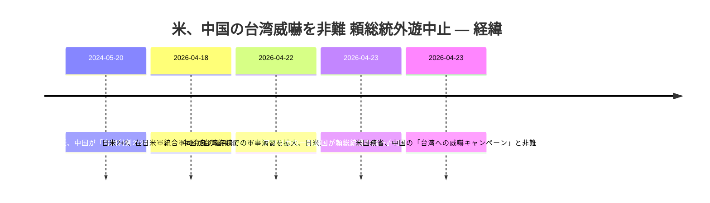
```mermaid
timeline
  title 米、中国の台湾威嚇を非難 頼総統外遊中止 — 経緯
  2024-05-20 : 頼清徳総統就任、中国が「合同利剣2024A」演習を実施
  2026-04-18 : 日米2+2、在日米軍統合軍司令部の運用開始を正式発表
  2026-04-22 : 中国が台湾海峡での軍事演習を拡大、日米が即応体制強化
  2026-04-23 : アフリカの一部島国が頼総統機の飛行許可取消し、外遊中止
  2026-04-23 : 米国務省、中国の「台湾への威嚇キャンペーン」と非難
```

### 当事者マップ

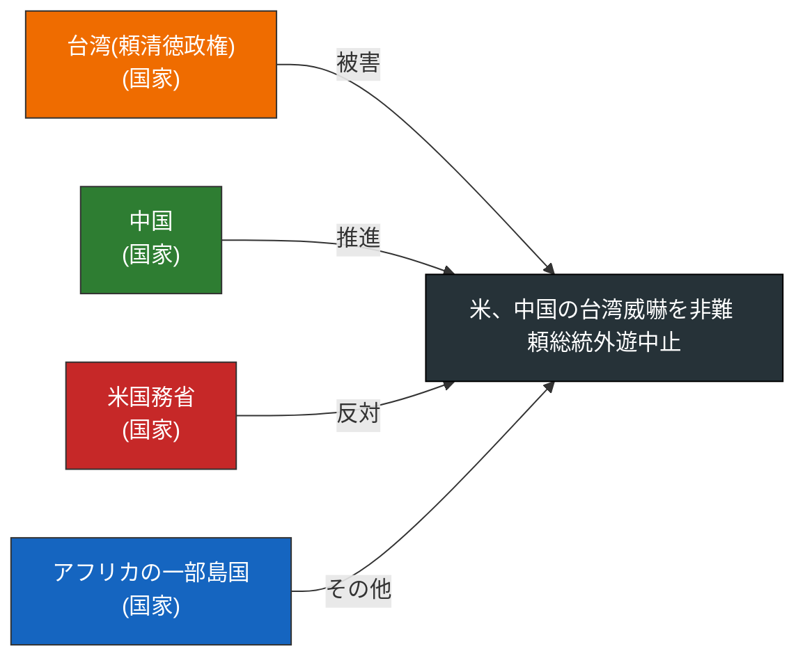
```mermaid
flowchart LR
  T["米、中国の台湾威嚇を非難 頼総統外遊中止"]
  A0["台湾(頼清徳政権)\n(国家)"]
  A0 -- 被害 --> T
  style A0 fill:#ef6c00,color:#fff,stroke:#333
  A1["中国\n(国家)"]
  A1 -- 推進 --> T
  style A1 fill:#2e7d32,color:#fff,stroke:#333
  A2["米国務省\n(国家)"]
  A2 -- 反対 --> T
  style A2 fill:#c62828,color:#fff,stroke:#333
  A3["アフリカの一部島国\n(国家)"]
  A3 -- その他 --> T
  style A3 fill:#1565c0,color:#fff,stroke:#333
  style T fill:#263238,color:#fff,stroke:#000
```

### 影響の広がり

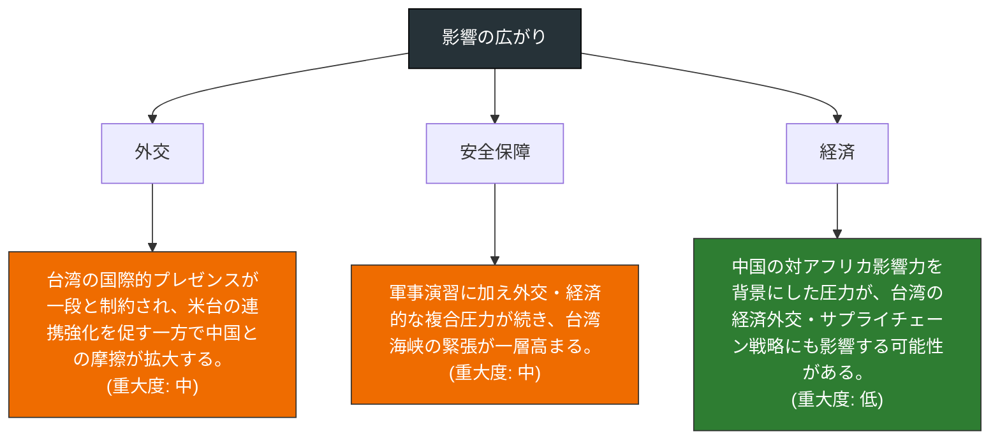
```mermaid
flowchart TB
  R["影響の広がり"]
  D0["外交"]
  I0["台湾の国際的プレゼンスが一段と制約され、米台の連携強化を促す一方で中国との摩擦が拡大する。\n(重大度: 中)"]
  R --> D0 --> I0
  style I0 fill:#ef6c00,color:#fff,stroke:#333
  D1["安全保障"]
  I1["軍事演習に加え外交・経済的な複合圧力が続き、台湾海峡の緊張が一層高まる。\n(重大度: 中)"]
  R --> D1 --> I1
  style I1 fill:#ef6c00,color:#fff,stroke:#333
  D2["経済"]
  I2["中国の対アフリカ影響力を背景にした圧力が、台湾の経済外交・サプライチェーン戦略にも影響する可能性がある。\n(重大度: 低)"]
  R --> D2 --> I2
  style I2 fill:#2e7d32,color:#fff,stroke:#333
  style R fill:#263238,color:#fff,stroke:#000
```

### 当事者の関係ネットワーク

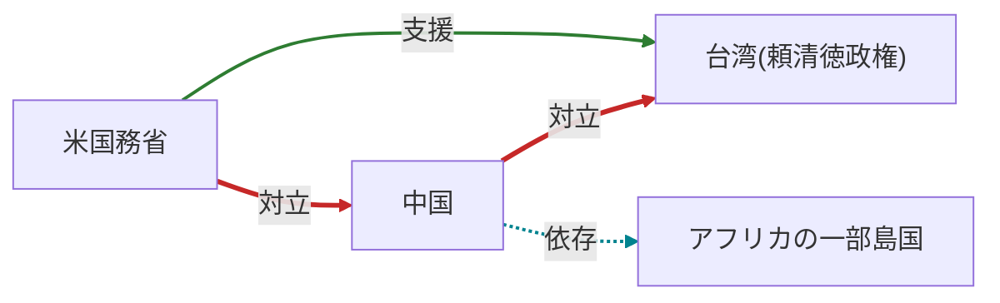
```mermaid
graph LR
  N0["台湾(頼清徳政権)"]
  N1["中国"]
  N2["米国務省"]
  N3["アフリカの一部島国"]
  N1 -->|対立| N0
  N2 -->|支援| N0
  N2 -->|対立| N1
  N1 -->|依存| N3
  linkStyle 0 stroke:#c62828,stroke-width:3px;
  linkStyle 1 stroke:#2e7d32,stroke-width:2px;
  linkStyle 2 stroke:#c62828,stroke-width:3px;
  linkStyle 3 stroke:#00838f,stroke-width:2px,stroke-dasharray:2 2;
```

### 押さえるべき論点

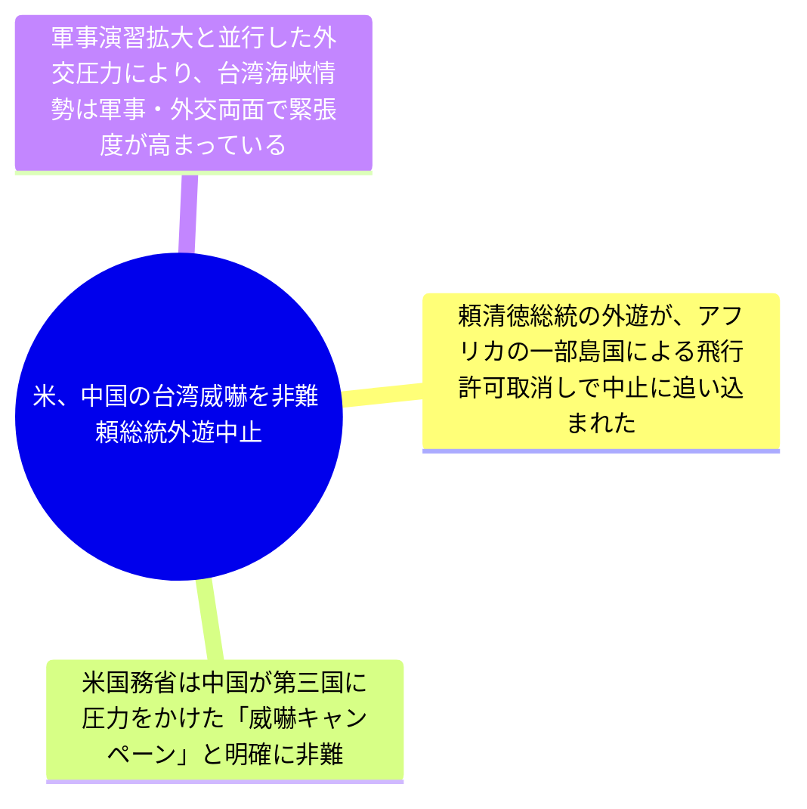
```mermaid
mindmap
  root((米、中国の台湾威嚇を非難 頼総統外遊中止))
    頼清徳総統の外遊が、アフリカの一部島国による飛行許可取消しで中止に追い込まれた
    米国務省は中国が第三国に圧力をかけた「威嚇キャンペーン」と明確に非難
    軍事演習拡大と並行した外交圧力により、台湾海峡情勢は軍事・外交両面で緊張度が高まっている
```

---

## ロシアのウクライナ侵攻、4月23日の動向 `重要度: 中` `europe / global`
- **出典:** NHK 国際 ([原文](http://www3.nhk.or.jp/news/html/20260423/k10015082701000.html)) / **公開:** 2026-04-23 19:09

**要約**
ロシアによるウクライナへの軍事侵攻が4月23日も継続し、各地で両軍の戦闘が続いている。戦闘の激化により、大勢の市民が国外へ避難を余儀なくされている。NHKは戦況や関係国の外交動向を随時更新で伝えている。戦線の膠着と消耗戦の長期化が改めて浮き彫りとなっている。

**背景**
ロシアのウクライナ侵攻は長期化し、直近ではドローンの相互攻撃が過去最多を記録するなど消耗戦が激化している。NATOはF-16追加供与や東欧諸国への追加配備を協議し、ロシアはシベリア極東でロ朝合同軍事演習を発表するなど、戦線は欧州を越えて広がる構図を見せている。中東・東アジアでも軍事的緊張が高まる中、ウクライナ戦況は国際秩序全体を揺るがす重要な焦点であり続けている。

**要点**
- ウクライナ各地で戦闘が続き、人道被害が拡大している

- NATOは追加兵器供与と東欧への配備強化で対ロ圧力を継続

- ロ朝合同演習など、戦争は欧州を越えた地政学的連鎖を生んでいる

### 経緯タイムライン

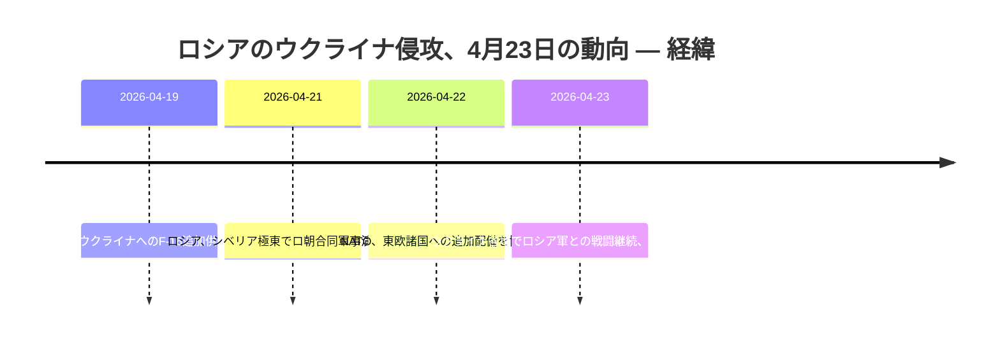
```mermaid
timeline
  title ロシアのウクライナ侵攻、4月23日の動向 — 経緯
  2026-04-19 : NATO、ウクライナへのF-16追加供与で調整
  2026-04-21 : ロシア、シベリア極東でロ朝合同軍事演習を発表
  2026-04-22 : NATO、東欧諸国への追加配備を協議
  2026-04-23 : ウクライナ各地でロシア軍との戦闘継続、市民の避難続く
```

### 当事者マップ

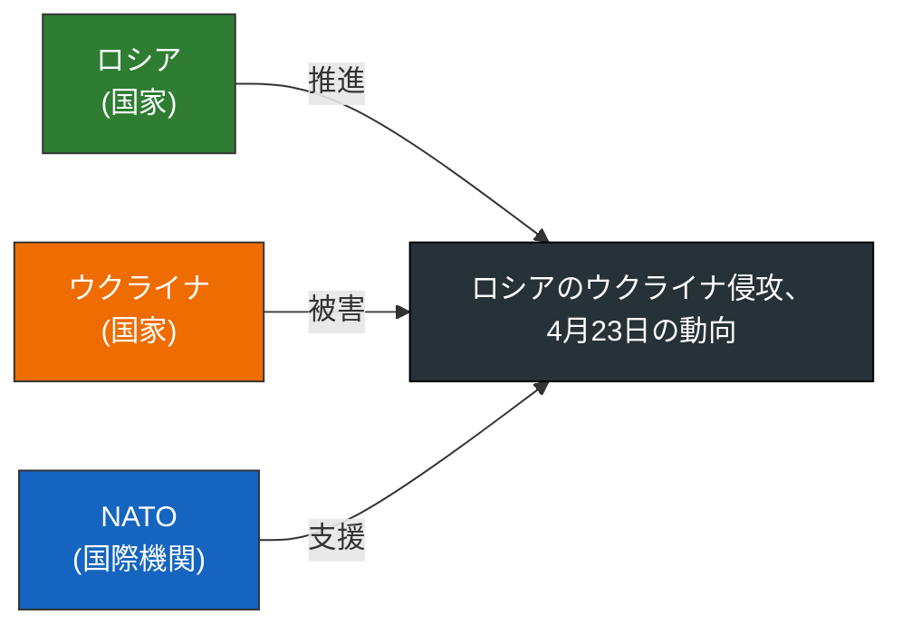
```mermaid
flowchart LR
  T["ロシアのウクライナ侵攻、4月23日の動向"]
  A0["ロシア\n(国家)"]
  A0 -- 推進 --> T
  style A0 fill:#2e7d32,color:#fff,stroke:#333
  A1["ウクライナ\n(国家)"]
  A1 -- 被害 --> T
  style A1 fill:#ef6c00,color:#fff,stroke:#333
  A2["NATO\n(国際機関)"]
  A2 -- 支援 --> T
  style A2 fill:#1565c0,color:#fff,stroke:#333
  style T fill:#263238,color:#fff,stroke:#000
```

### 影響の広がり

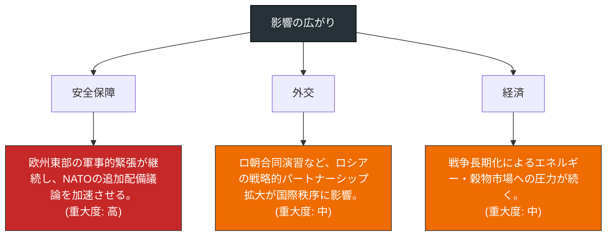
```mermaid
flowchart TB
  R["影響の広がり"]
  D0["安全保障"]
  I0["欧州東部の軍事的緊張が継続し、NATOの追加配備議論を加速させる。\n(重大度: 高)"]
  R --> D0 --> I0
  style I0 fill:#c62828,color:#fff,stroke:#333
  D1["外交"]
  I1["ロ朝合同演習など、ロシアの戦略的パートナーシップ拡大が国際秩序に影響。\n(重大度: 中)"]
  R --> D1 --> I1
  style I1 fill:#ef6c00,color:#fff,stroke:#333
  D2["経済"]
  I2["戦争長期化によるエネルギー・穀物市場への圧力が続く。\n(重大度: 中)"]
  R --> D2 --> I2
  style I2 fill:#ef6c00,color:#fff,stroke:#333
  style R fill:#263238,color:#fff,stroke:#000
```

### 当事者の関係ネットワーク

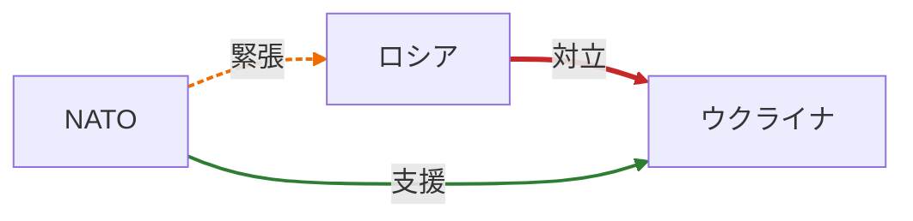
```mermaid
graph LR
  N0["ロシア"]
  N1["ウクライナ"]
  N2["NATO"]
  N0 -->|対立| N1
  N2 -->|支援| N1
  N2 -->|緊張| N0
  linkStyle 0 stroke:#c62828,stroke-width:3px;
  linkStyle 1 stroke:#2e7d32,stroke-width:2px;
  linkStyle 2 stroke:#ef6c00,stroke-width:2px,stroke-dasharray:4 2;
```

### 押さえるべき論点

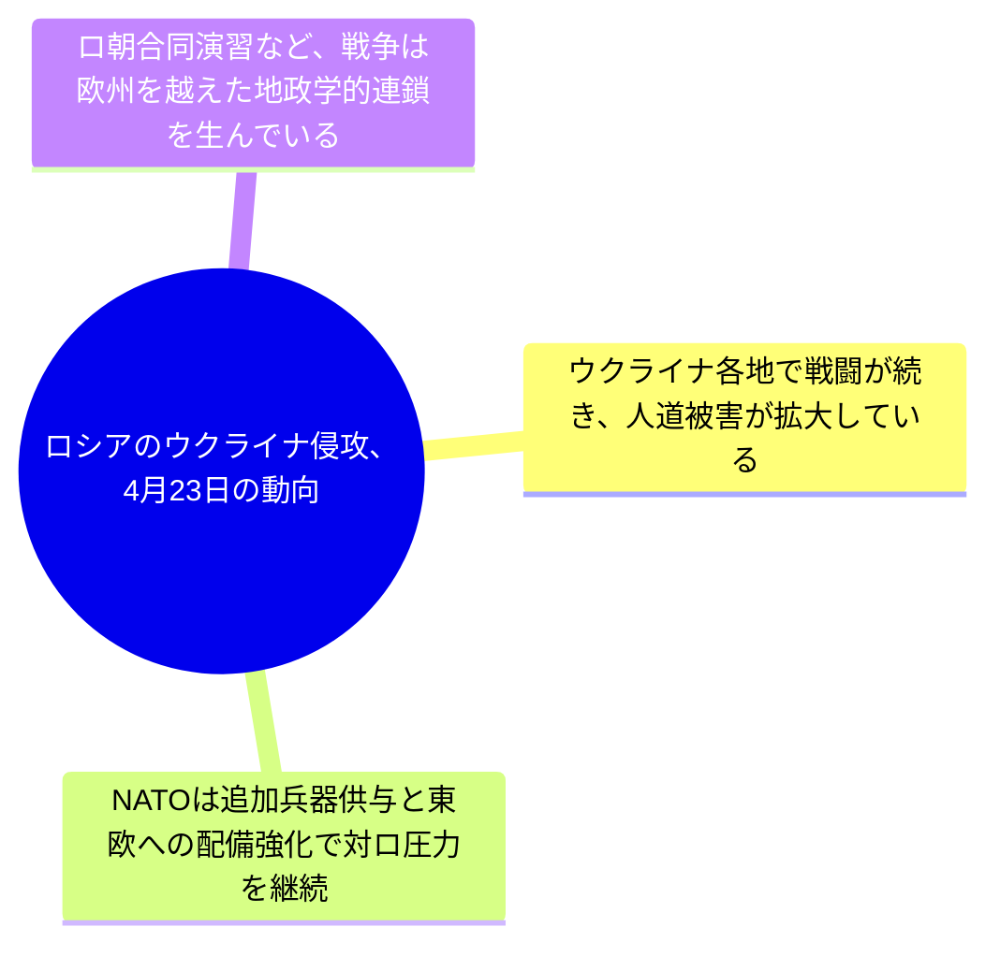
```mermaid
mindmap
  root((ロシアのウクライナ侵攻、4月23日の動向))
    ウクライナ各地で戦闘が続き、人道被害が拡大している
    NATOは追加兵器供与と東欧への配備強化で対ロ圧力を継続
    ロ朝合同演習など、戦争は欧州を越えた地政学的連鎖を生んでいる
```

---

## EU、ウクライナ巨額融資の承認手続き開始 `重要度: 中` `europe / global`
- **出典:** NHK 国際 ([原文](http://www3.nhk.or.jp/news/html/20260422/k10015105981000.html)) / **公開:** 2026-04-22 23:02

**要約**
EUは4月22日、加盟国ハンガリーの反対で停滞してきたウクライナ向けの巨額融資について、承認手続きを開始することを決めた。ハンガリーが反対理由としてきたウクライナ経由のロシア産原油輸送の再開にめどが立ったことが背景にある。融資は23日に承認される見通しで、ウクライナの戦費と財政を下支えする重要な資金となる。

**背景**
ロシアによる侵攻が長期化する中、EUはウクライナへの継続的な資金支援を模索してきたが、ロシアと近いハンガリーの反対で大型融資案件が滞っていた。過去1週間でも NATO による F-16 追加供与調整やロシア・ウクライナ間のドローン攻撃過去最多などが報じられ、対ウクライナ支援の強化が急務となっていた。今回はロシア産原油のウクライナ経由輸送再開見通しがハンガリーの懸念を和らげ、EU結束回復の契機となる。

**要点**
- EUは長らく停滞していたウクライナ向け巨額融資の承認手続きを開始し、23日に承認される見通し

- ハンガリーが反対を取り下げた背景には、ウクライナ経由のロシア産原油輸送再開のめどが立ったことがある

- NATOのF-16追加供与調整と合わせ、欧州の対ウクライナ支援強化の流れが明確化している

### 経緯タイムライン

```mermaid
timeline
  title EU、ウクライナ巨額融資の承認手続き開始 — 経緯
  2026-04-17 : ロシア・ウクライナ間のドローン相互攻撃が過去最多に
  2026-04-19 : NATO、ウクライナへのF-16追加供与で調整
  2026-04-22 : EU、ウクライナへの巨額融資承認手続き開始を決定
  2026-04-23 : EUで融資が正式承認される見通し
```

### 当事者マップ

```mermaid
flowchart LR
  T["EU、ウクライナ巨額融資の承認手続き開始"]
  A0["EU\n(国際機関)"]
  A0 -- 推進 --> T
  style A0 fill:#2e7d32,color:#fff,stroke:#333
  A1["ウクライナ\n(国家)"]
  A1 -- 被害 --> T
  style A1 fill:#ef6c00,color:#fff,stroke:#333
  A2["ハンガリー\n(国家)"]
  A2 -- 中立 --> T
  style A2 fill:#616161,color:#fff,stroke:#333
  A3["ロシア\n(国家)"]
  A3 -- その他 --> T
  style A3 fill:#1565c0,color:#fff,stroke:#333
  style T fill:#263238,color:#fff,stroke:#000
```

### 影響の広がり

```mermaid
flowchart TB
  R["影響の広がり"]
  D0["外交"]
  I0["EUの対ウクライナ支援における結束回復と、ハンガリーの拒否権行使問題の一時的解消。\n(重大度: 中)"]
  R --> D0 --> I0
  style I0 fill:#ef6c00,color:#fff,stroke:#333
  D1["安全保障"]
  I1["ウクライナの戦費・財政基盤を下支えし、対ロシア抗戦能力の維持に寄与。\n(重大度: 中)"]
  R --> D1 --> I1
  style I1 fill:#ef6c00,color:#fff,stroke:#333
  D2["エネルギー"]
  I2["ウクライナ経由のロシア産原油供給再開により、中欧のエネルギー安定に影響。\n(重大度: 中)"]
  R --> D2 --> I2
  style I2 fill:#ef6c00,color:#fff,stroke:#333
  D3["経済"]
  I3["ウクライナ経済の下支えにより復興・防衛支出の継続が可能に。\n(重大度: 中)"]
  R --> D3 --> I3
  style I3 fill:#ef6c00,color:#fff,stroke:#333
  style R fill:#263238,color:#fff,stroke:#000
```

### 当事者の関係ネットワーク

```mermaid
graph LR
  N0["EU"]
  N1["ウクライナ"]
  N2["ハンガリー"]
  N3["ロシア"]
  N0 -->|支援| N1
  N2 -->|交渉| N0
  N2 -->|依存| N3
  N1 -->|対立| N3
  linkStyle 0 stroke:#2e7d32,stroke-width:2px;
  linkStyle 1 stroke:#6a1b9a,stroke-width:2px,stroke-dasharray:4 2;
  linkStyle 2 stroke:#00838f,stroke-width:2px,stroke-dasharray:2 2;
  linkStyle 3 stroke:#c62828,stroke-width:3px;
```

### 押さえるべき論点

```mermaid
mindmap
  root((EU、ウクライナ巨額融資の承認手続き開始))
    EUは長らく停滞していたウクライナ向け巨額融資の承認手続きを開始し、23日に承認される見通し
    ハンガリーが反対を取り下げた背景には、ウクライナ経由のロシア産原油輸送再開のめどが立ったことがある
    NATOのF-16追加供与調整と合わせ、欧州の対ウクライナ支援強化の流れが明確化している
```

---
