# 地政学ニュース図解レポート 2026-04-25 号

生成日時: 2026-04-25 07:38 / 記事数: 5

## 📌 本日の要点

- **米、イラン戦争支持巡りスペイン処分検討か** — BBCの報道によれば、米国防総省内部メールで、イラン戦争への支援不足を理由に同盟国を処罰する選択肢が検討されていることが明らかになった。

- **高市首相、代替原油6割確保 さらに上積み指示** — 高市総理大臣は関係閣僚会議で、ホルムズ海峡を経由しない原油の代替調達について、来月(5月)分はおよそ6割の確保にめどがついたと表明した。

## 米、イラン戦争支持巡りスペイン処分検討か `重要度: 高` `europe / middle_east / global`
- **出典:** BBC World ([原文](https://www.bbc.com/news/articles/cz78x703lrvo?at_medium=RSS&at_campaign=rss)) / **公開:** 2026-04-24 16:04

**要約**
BBCの報道によれば、米国防総省内部メールで、イラン戦争への支援不足を理由に同盟国を処罰する選択肢が検討されていることが明らかになった。中でもスペインのNATO資格停止が選択肢として浮上したとされる。これに対しNATOは「加盟国を除名する規定は存在しない」と表明し、米国の動きを牽制した。同盟内の足並みの乱れが顕在化し、集団防衛体制の信頼性が問われる事態となっている。

**背景**
対イラン軍事行動を巡り、欧州諸国の一部が米国の強硬路線への参加に消極的な姿勢を示してきた。直近では4月20日にイランが英タンカーをホルムズ海峡で一時拿捕し緊張が再燃、中東情勢が悪化する中で米国が同盟国の足並みを問題視している。NATO東欧追加配備協議など欧州側の安全保障課題も並行する中、米欧間の亀裂が表面化した。

**要点**
- 米国防総省が対イラン戦争支援に消極的な同盟国への懲罰策を内部検討、スペインのNATO資格停止が選択肢に浮上

- NATOは「加盟国除名の規定は存在しない」と明確に否定、米国の構想は法的根拠を欠く

- 対イラン政策を巡る米欧の亀裂が表面化し、集団防衛同盟の結束と信頼性に重大な影響

### 経緯タイムライン

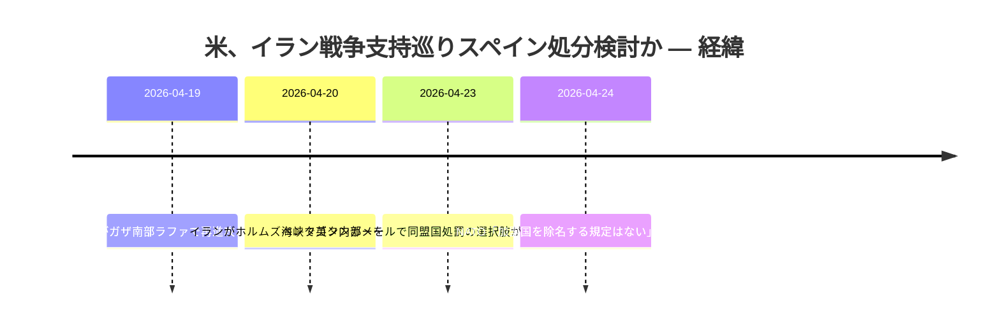
```mermaid
timeline
  title 米、イラン戦争支持巡りスペイン処分検討か — 経緯
  2026-04-19 : イスラエル軍がガザ南部ラファで再進攻、中東緊張再燃
  2026-04-20 : イランがホルムズ海峡で英タンカーを一時拿捕
  2026-04-23 : ペンタゴン内部メールで同盟国処罰の選択肢が検討されたと報道
  2026-04-24 : NATO「加盟国を除名する規定はない」と公式表明
```

### 当事者マップ

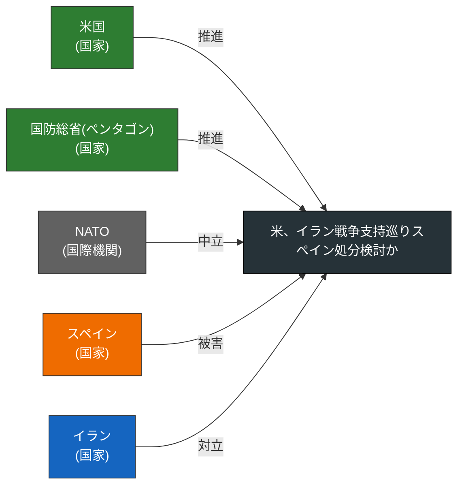
```mermaid
flowchart LR
  T["米、イラン戦争支持巡りスペイン処分検討か"]
  A0["米国\n(国家)"]
  A0 -- 推進 --> T
  style A0 fill:#2e7d32,color:#fff,stroke:#333
  A1["国防総省(ペンタゴン)\n(国家)"]
  A1 -- 推進 --> T
  style A1 fill:#2e7d32,color:#fff,stroke:#333
  A2["NATO\n(国際機関)"]
  A2 -- 中立 --> T
  style A2 fill:#616161,color:#fff,stroke:#333
  A3["スペイン\n(国家)"]
  A3 -- 被害 --> T
  style A3 fill:#ef6c00,color:#fff,stroke:#333
  A4["イラン\n(国家)"]
  A4 -- 対立 --> T
  style A4 fill:#1565c0,color:#fff,stroke:#333
  style T fill:#263238,color:#fff,stroke:#000
```

### 影響の広がり

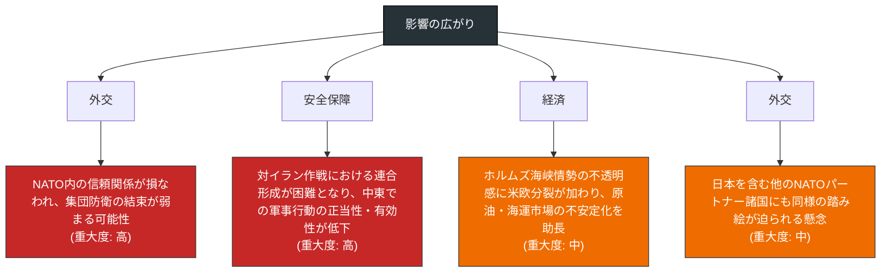
```mermaid
flowchart TB
  R["影響の広がり"]
  D0["外交"]
  I0["NATO内の信頼関係が損なわれ、集団防衛の結束が弱まる可能性\n(重大度: 高)"]
  R --> D0 --> I0
  style I0 fill:#c62828,color:#fff,stroke:#333
  D1["安全保障"]
  I1["対イラン作戦における連合形成が困難となり、中東での軍事行動の正当性・有効性が低下\n(重大度: 高)"]
  R --> D1 --> I1
  style I1 fill:#c62828,color:#fff,stroke:#333
  D2["経済"]
  I2["ホルムズ海峡情勢の不透明感に米欧分裂が加わり、原油・海運市場の不安定化を助長\n(重大度: 中)"]
  R --> D2 --> I2
  style I2 fill:#ef6c00,color:#fff,stroke:#333
  D3["外交"]
  I3["日本を含む他のNATOパートナー諸国にも同様の踏み絵が迫られる懸念\n(重大度: 中)"]
  R --> D3 --> I3
  style I3 fill:#ef6c00,color:#fff,stroke:#333
  style R fill:#263238,color:#fff,stroke:#000
```

### 当事者の関係ネットワーク

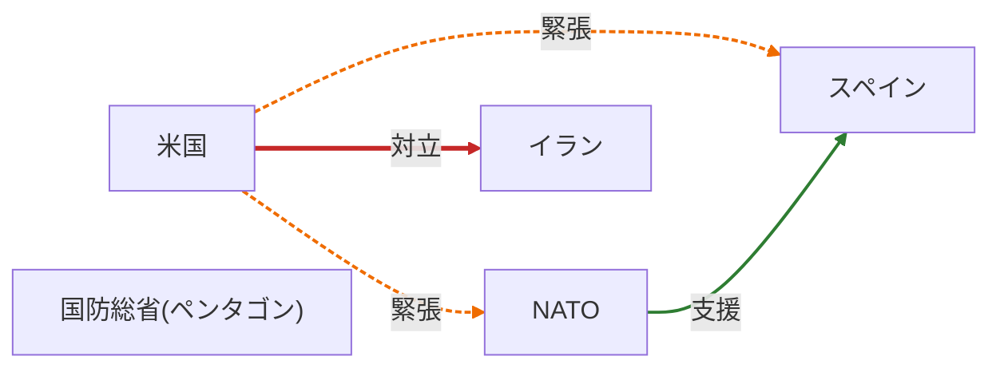
```mermaid
graph LR
  N0["米国"]
  N1["国防総省(ペンタゴン)"]
  N2["NATO"]
  N3["スペイン"]
  N4["イラン"]
  N0 -->|緊張| N3
  N0 -->|緊張| N2
  N0 -->|対立| N4
  N2 -->|支援| N3
  linkStyle 0 stroke:#ef6c00,stroke-width:2px,stroke-dasharray:4 2;
  linkStyle 1 stroke:#ef6c00,stroke-width:2px,stroke-dasharray:4 2;
  linkStyle 2 stroke:#c62828,stroke-width:3px;
  linkStyle 3 stroke:#2e7d32,stroke-width:2px;
```

### 押さえるべき論点

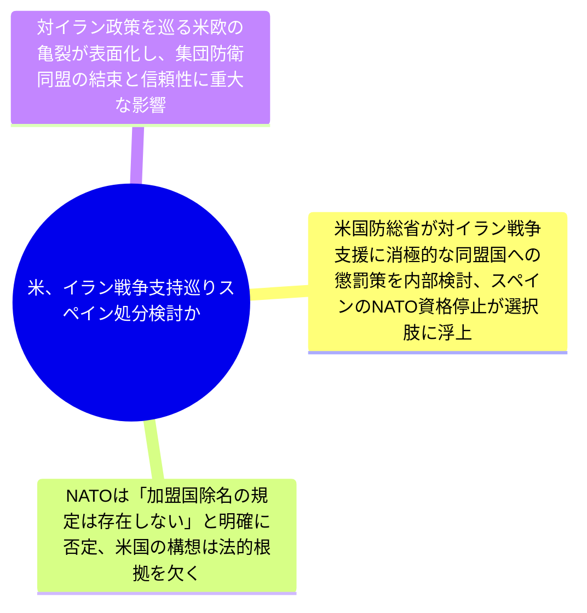
```mermaid
mindmap
  root((米、イラン戦争支持巡りスペイン処分検討か))
    米国防総省が対イラン戦争支援に消極的な同盟国への懲罰策を内部検討、スペインのNATO資格停止が選択肢に浮上
    NATOは「加盟国除名の規定は存在しない」と明確に否定、米国の構想は法的根拠を欠く
    対イラン政策を巡る米欧の亀裂が表面化し、集団防衛同盟の結束と信頼性に重大な影響
```

---

## 高市首相、代替原油6割確保 さらに上積み指示 `重要度: 高` `middle_east / east_asia`
- **出典:** NHK 国際 ([原文](http://www3.nhk.or.jp/news/html/20260424/k10015107721000.html)) / **公開:** 2026-04-24 19:10

**要約**
高市総理大臣は関係閣僚会議で、ホルムズ海峡を経由しない原油の代替調達について、来月(5月)分はおよそ6割の確保にめどがついたと表明した。その上で、6月分の代替調達の水準をさらに高めるよう関係閣僚に指示した。中東情勢の緊迫化を背景に、日本政府はエネルギー供給の多元化を急いでいる。

**背景**
4月20日にイランがホルミズ海峡で英タンカーを一時拿捕し、海運会社は一部航路を回避、保険料も急騰している。日本は原油の約9割を中東に依存し、ホルムズ海峡は世界の石油輸送量の約2割が通過する要衝であるため、同海峡のリスク顕在化は日本のエネルギー安全保障に直撃する。このため政府は非ホルムズ経由の代替ソース確保を急いでいる。

**要点**
- 5月の非ホルムズ経由の原油代替調達はおよそ6割のめどが立った

- 高市首相は6月分の代替調達水準をさらに引き上げるよう指示

- イランによる英タンカー拿捕など中東リスクが急速に高まり、日本のエネルギー安全保障が試されている

### 経緯タイムライン

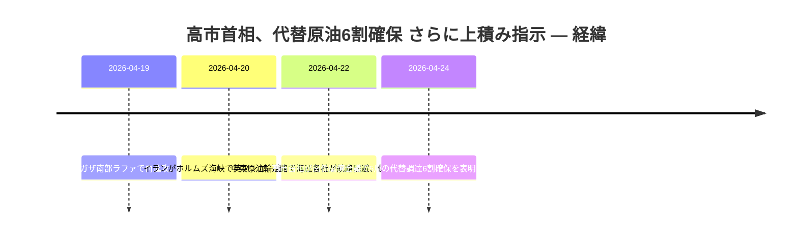
```mermaid
timeline
  title 高市首相、代替原油6割確保 さらに上積み指示 — 経緯
  2026-04-19 : イスラエル軍がガザ南部ラファで再進攻、中東緊張が再燃
  2026-04-20 : イランがホルムズ海峡で英タンカーを一時拿捕
  2026-04-22 : 中東原油輸送路で海運各社が航路回避、保険料が急騰
  2026-04-24 : 高市首相が関係閣僚会議で5月の代替調達6割確保を表明、6月のさらなる上積みを指示
```

### 当事者マップ

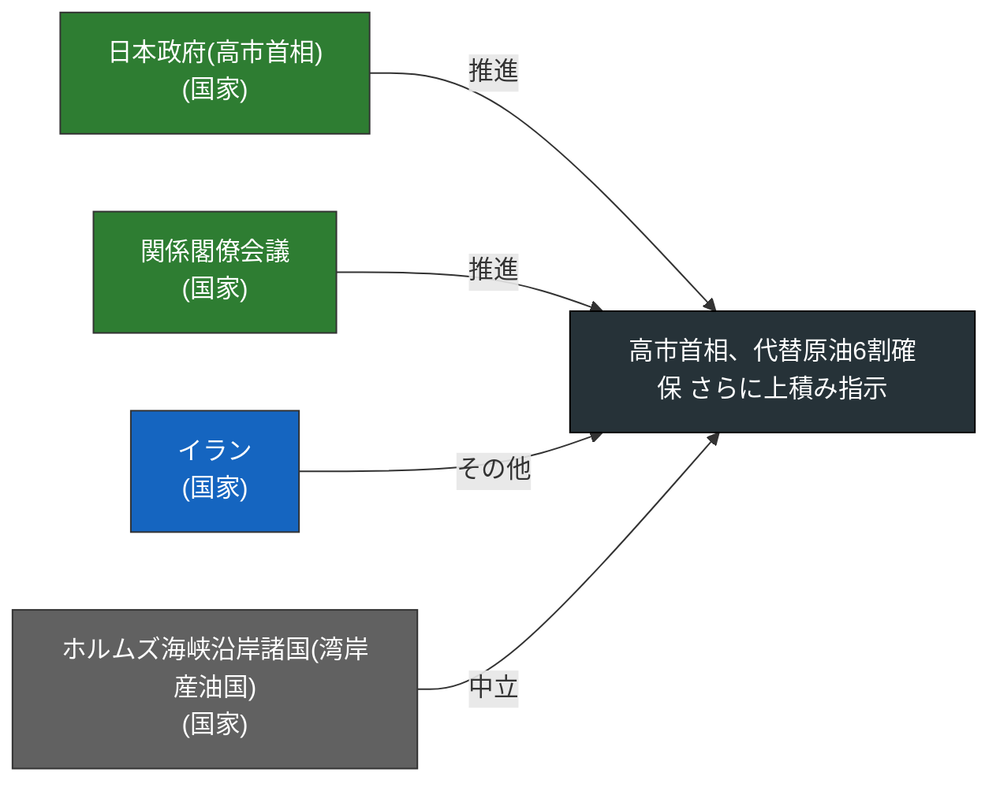
```mermaid
flowchart LR
  T["高市首相、代替原油6割確保 さらに上積み指示"]
  A0["日本政府(高市首相)\n(国家)"]
  A0 -- 推進 --> T
  style A0 fill:#2e7d32,color:#fff,stroke:#333
  A1["関係閣僚会議\n(国家)"]
  A1 -- 推進 --> T
  style A1 fill:#2e7d32,color:#fff,stroke:#333
  A2["イラン\n(国家)"]
  A2 -- その他 --> T
  style A2 fill:#1565c0,color:#fff,stroke:#333
  A3["ホルムズ海峡沿岸諸国(湾岸産油国)\n(国家)"]
  A3 -- 中立 --> T
  style A3 fill:#616161,color:#fff,stroke:#333
  style T fill:#263238,color:#fff,stroke:#000
```

### 影響の広がり

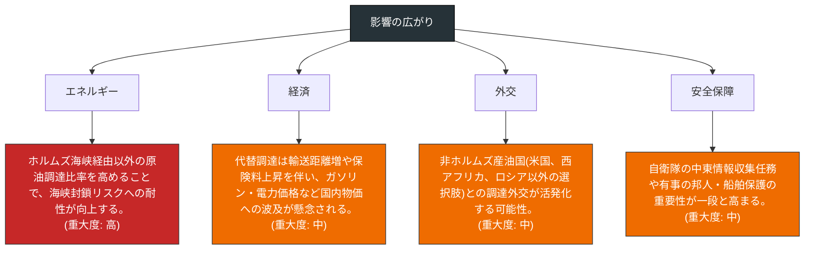
```mermaid
flowchart TB
  R["影響の広がり"]
  D0["エネルギー"]
  I0["ホルムズ海峡経由以外の原油調達比率を高めることで、海峡封鎖リスクへの耐性が向上する。\n(重大度: 高)"]
  R --> D0 --> I0
  style I0 fill:#c62828,color:#fff,stroke:#333
  D1["経済"]
  I1["代替調達は輸送距離増や保険料上昇を伴い、ガソリン・電力価格など国内物価への波及が懸念される。\n(重大度: 中)"]
  R --> D1 --> I1
  style I1 fill:#ef6c00,color:#fff,stroke:#333
  D2["外交"]
  I2["非ホルムズ産油国(米国、西アフリカ、ロシア以外の選択肢)との調達外交が活発化する可能性。\n(重大度: 中)"]
  R --> D2 --> I2
  style I2 fill:#ef6c00,color:#fff,stroke:#333
  D3["安全保障"]
  I3["自衛隊の中東情報収集任務や有事の邦人・船舶保護の重要性が一段と高まる。\n(重大度: 中)"]
  R --> D3 --> I3
  style I3 fill:#ef6c00,color:#fff,stroke:#333
  style R fill:#263238,color:#fff,stroke:#000
```

### 当事者の関係ネットワーク

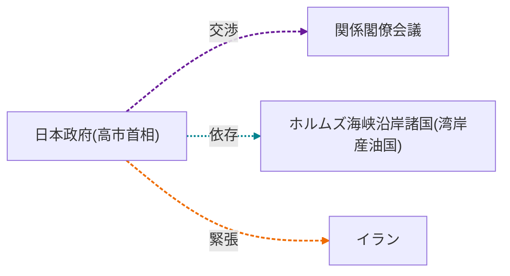
```mermaid
graph LR
  N0["日本政府(高市首相)"]
  N1["関係閣僚会議"]
  N2["イラン"]
  N3["ホルムズ海峡沿岸諸国(湾岸産油国)"]
  N0 -->|交渉| N1
  N0 -->|依存| N3
  N0 -->|緊張| N2
  linkStyle 0 stroke:#6a1b9a,stroke-width:2px,stroke-dasharray:4 2;
  linkStyle 1 stroke:#00838f,stroke-width:2px,stroke-dasharray:2 2;
  linkStyle 2 stroke:#ef6c00,stroke-width:2px,stroke-dasharray:4 2;
```

### 押さえるべき論点

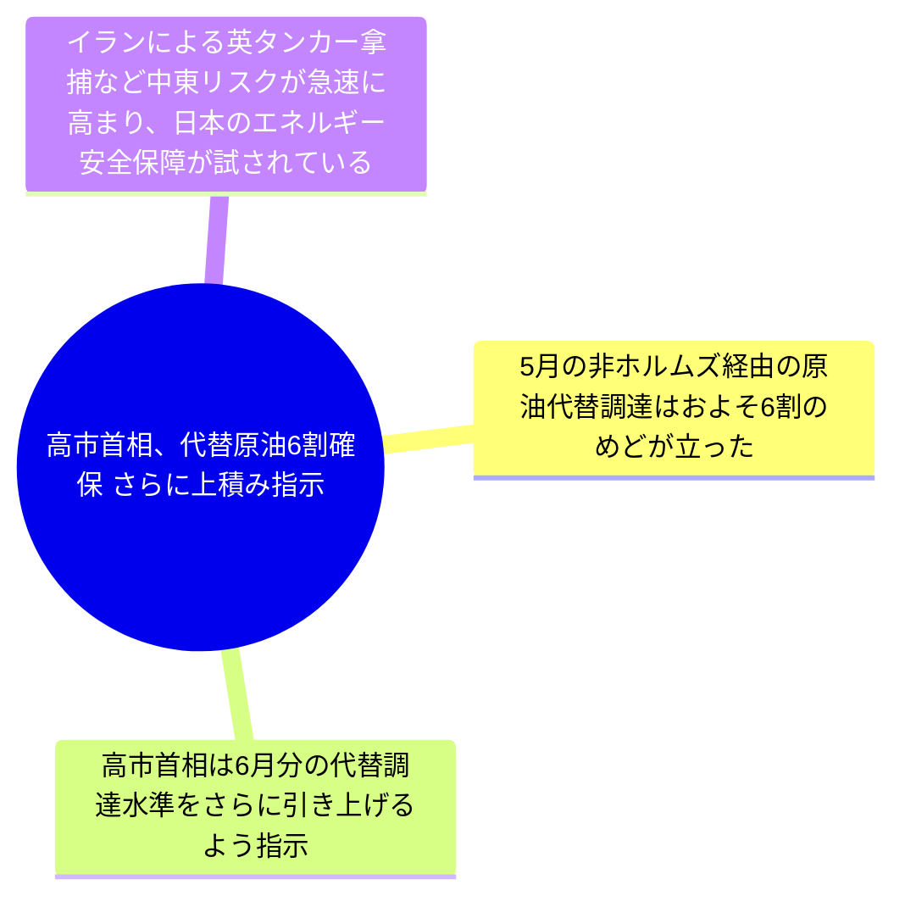
```mermaid
mindmap
  root((高市首相、代替原油6割確保 さらに上積み指示))
    5月の非ホルムズ経由の原油代替調達はおよそ6割のめどが立った
    高市首相は6月分の代替調達水準をさらに引き上げるよう指示
    イランによる英タンカー拿捕など中東リスクが急速に高まり、日本のエネルギー安全保障が試されている
```

---

## 三菱電機、ホンハイと車部品で提携検討 `重要度: 中` `east_asia`
- **出典:** NHK 国際 ([原文](http://www3.nhk.or.jp/news/html/20260424/k10015107921000.html)) / **公開:** 2026-04-24 23:28

**要約**
三菱電機は、見直し対象としている自動車部品事業について、台湾の鴻海(ホンハイ)精密工業との提携を検討すると発表した。ホンハイからの出資受け入れも視野に入れている。ホンハイが持つ取引先ネットワークやEV製造ノウハウを活用し、競争力強化を図る狙い。日本の大手電機メーカーが台湾企業から出資を受け入れる可能性は、日台間の経済連携を象徴する動きとなる。

**背景**
ホンハイはiPhone受託生産で知られる世界最大級のEMSで、近年はEV事業への本格参入を進めている。台湾海峡では4月22日に中国軍演習の拡大が報じられ日米が即応体制を強化するなど地政学リスクが高まる中、日台の産業連携は経済安全保障とサプライチェーン再編の文脈でも注目される。日本の自動車部品産業はEVシフトで競争力低下が課題となっており、外部資本との提携が選択肢に上がっている。

**要点**
- 三菱電機が見直し対象の自動車部品事業でホンハイとの提携・出資受け入れを検討

- ホンハイのEV製造ノウハウと取引先ネットワークの活用が狙い

- 台湾海峡の緊張が高まる中、日台の産業連携は経済安全保障の観点でも注目される

### 経緯タイムライン

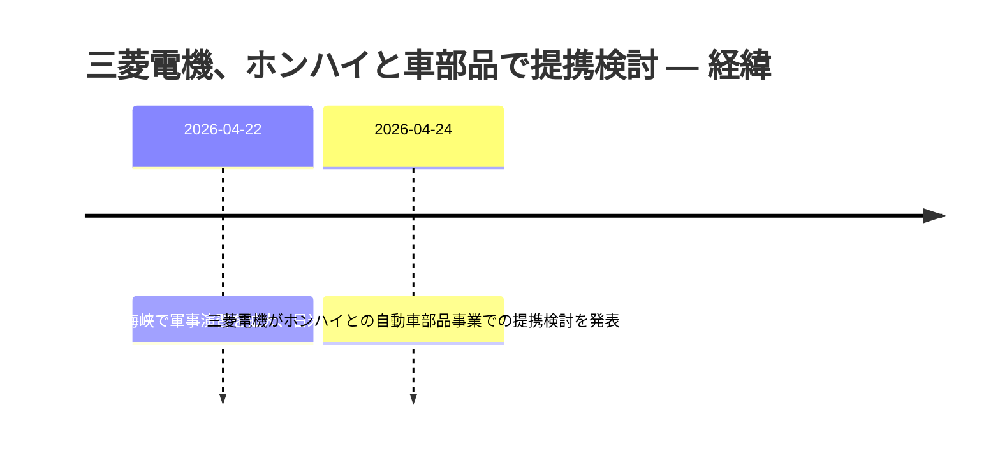
```mermaid
timeline
  title 三菱電機、ホンハイと車部品で提携検討 — 経緯
  2026-04-22 : 中国が台湾海峡で軍事演習を拡大、日米が即応強化
  2026-04-24 : 三菱電機がホンハイとの自動車部品事業での提携検討を発表
```

### 当事者マップ

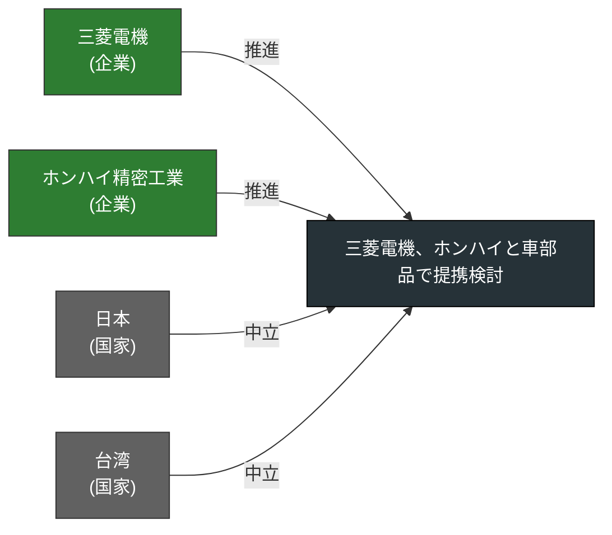
```mermaid
flowchart LR
  T["三菱電機、ホンハイと車部品で提携検討"]
  A0["三菱電機\n(企業)"]
  A0 -- 推進 --> T
  style A0 fill:#2e7d32,color:#fff,stroke:#333
  A1["ホンハイ精密工業\n(企業)"]
  A1 -- 推進 --> T
  style A1 fill:#2e7d32,color:#fff,stroke:#333
  A2["日本\n(国家)"]
  A2 -- 中立 --> T
  style A2 fill:#616161,color:#fff,stroke:#333
  A3["台湾\n(国家)"]
  A3 -- 中立 --> T
  style A3 fill:#616161,color:#fff,stroke:#333
  style T fill:#263238,color:#fff,stroke:#000
```

### 影響の広がり

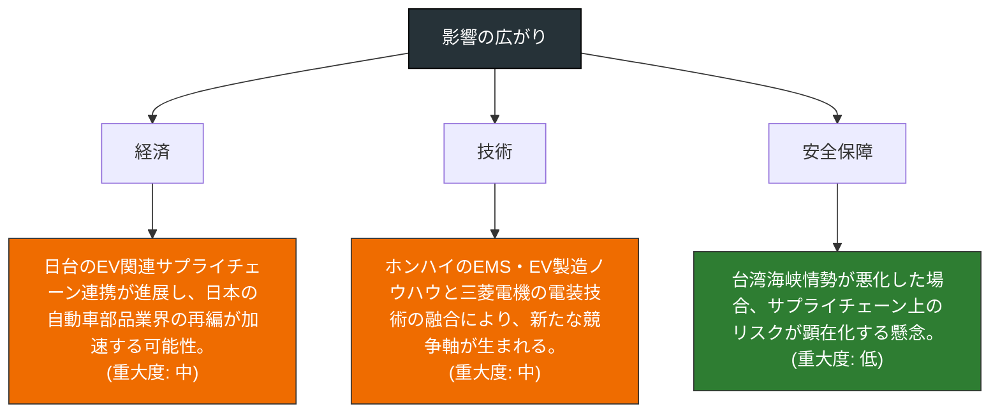
```mermaid
flowchart TB
  R["影響の広がり"]
  D0["経済"]
  I0["日台のEV関連サプライチェーン連携が進展し、日本の自動車部品業界の再編が加速する可能性。\n(重大度: 中)"]
  R --> D0 --> I0
  style I0 fill:#ef6c00,color:#fff,stroke:#333
  D1["技術"]
  I1["ホンハイのEMS・EV製造ノウハウと三菱電機の電装技術の融合により、新たな競争軸が生まれる。\n(重大度: 中)"]
  R --> D1 --> I1
  style I1 fill:#ef6c00,color:#fff,stroke:#333
  D2["安全保障"]
  I2["台湾海峡情勢が悪化した場合、サプライチェーン上のリスクが顕在化する懸念。\n(重大度: 低)"]
  R --> D2 --> I2
  style I2 fill:#2e7d32,color:#fff,stroke:#333
  style R fill:#263238,color:#fff,stroke:#000
```

### 当事者の関係ネットワーク

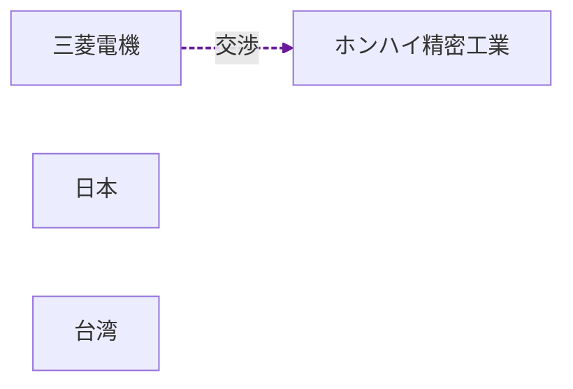
```mermaid
graph LR
  N0["三菱電機"]
  N1["ホンハイ精密工業"]
  N2["日本"]
  N3["台湾"]
  N0 -->|交渉| N1
  linkStyle 0 stroke:#6a1b9a,stroke-width:2px,stroke-dasharray:4 2;
```

### 押さえるべき論点

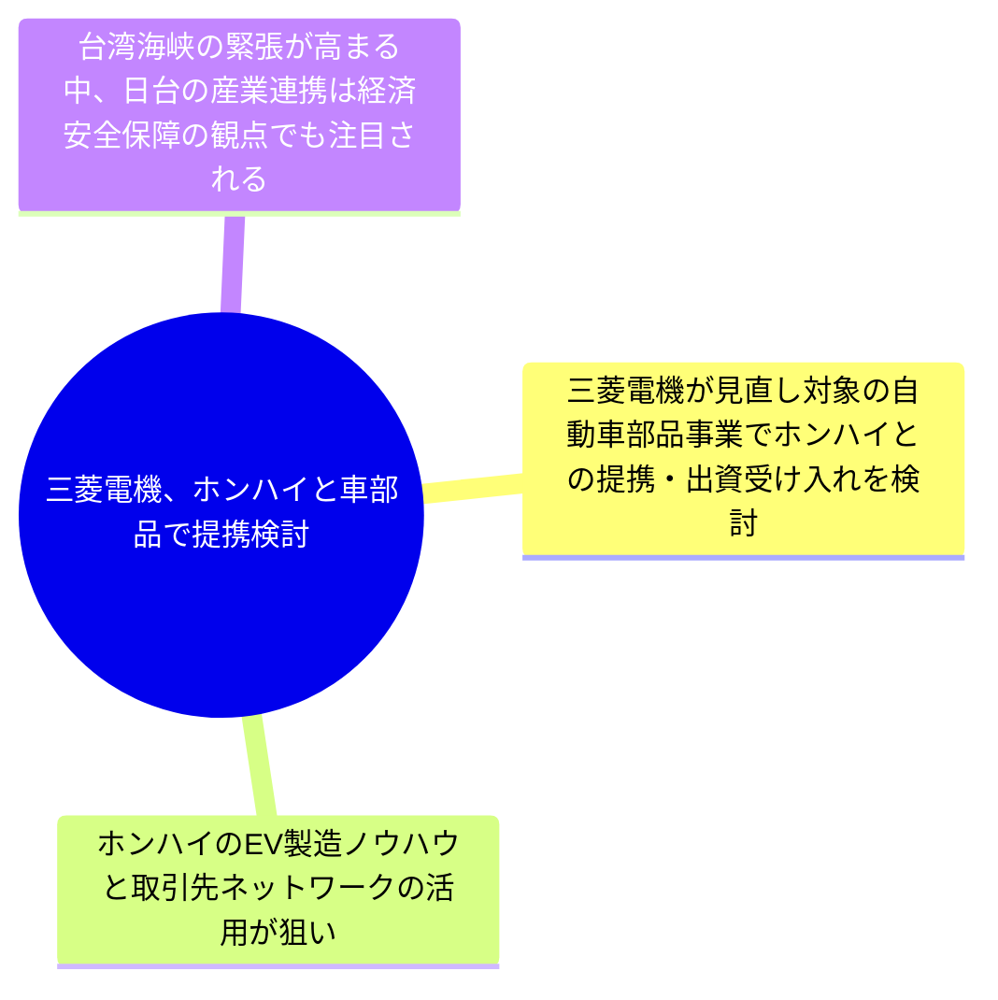
```mermaid
mindmap
  root((三菱電機、ホンハイと車部品で提携検討))
    三菱電機が見直し対象の自動車部品事業でホンハイとの提携・出資受け入れを検討
    ホンハイのEV製造ノウハウと取引先ネットワークの活用が狙い
    台湾海峡の緊張が高まる中、日台の産業連携は経済安全保障の観点でも注目される
```

---

## 中国、欧州7社を輸出規制 台湾武器売却関与で `重要度: 中` `east_asia / europe / global`
- **出典:** NHK 国際 ([原文](http://www3.nhk.or.jp/news/html/20260424/k10015107901000.html)) / **公開:** 2026-04-24 21:51

**要約**
中国政府は4月24日、台湾への武器売却に関与したなどとして、欧州の7つの企業などを輸出規制リストに追加したと発表した。これらの企業に対しては、軍民両用(デュアルユース)品目の中国からの輸出が禁止される。台湾への武器供給網を直接標的にした経済的圧力であり、中国は「一つの中国」原則を改めて強調する形となった。欧州諸国の対中政策にも影響を及ぼす可能性がある。

**背景**
中国は4月22日に台湾海峡での軍事演習を拡大し、日米が即応体制を強化するなど、台湾を巡る緊張が連日高まっている。また4月18日には米半導体輸出管理への対抗策としてレアアース追加規制を発動するなど、経済安全保障分野での対抗措置を相次いで打ち出している。今回の欧州企業を狙った輸出規制は、軍事的圧力と経済的圧力を組み合わせた台湾威圧戦略の一環と位置づけられる。

**要点**
- 中国は台湾への武器売却関与を理由に欧州7社を輸出規制リストに追加し、軍民両用品目の輸出を禁止

- 軍事演習拡大やレアアース規制と並ぶ、台湾威圧の経済的圧力ツールの一つ

- 欧州企業を直接標的にしたことで、EUの対中・対台湾政策に揺さぶりがかかる

### 経緯タイムライン

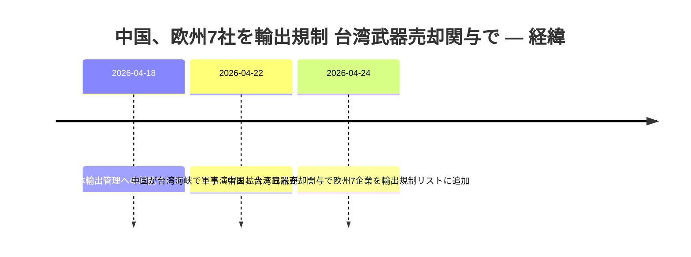
```mermaid
timeline
  title 中国、欧州7社を輸出規制 台湾武器売却関与で — 経緯
  2026-04-18 : 中国、米半導体輸出管理への対抗でレアアース追加規制
  2026-04-22 : 中国が台湾海峡で軍事演習を拡大、日米が即応体制強化
  2026-04-24 : 中国、台湾武器売却関与で欧州7企業を輸出規制リストに追加
```

### 当事者マップ

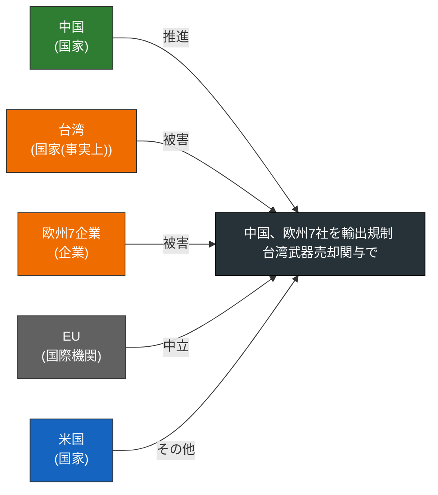
```mermaid
flowchart LR
  T["中国、欧州7社を輸出規制 台湾武器売却関与で"]
  A0["中国\n(国家)"]
  A0 -- 推進 --> T
  style A0 fill:#2e7d32,color:#fff,stroke:#333
  A1["台湾\n(国家(事実上))"]
  A1 -- 被害 --> T
  style A1 fill:#ef6c00,color:#fff,stroke:#333
  A2["欧州7企業\n(企業)"]
  A2 -- 被害 --> T
  style A2 fill:#ef6c00,color:#fff,stroke:#333
  A3["EU\n(国際機関)"]
  A3 -- 中立 --> T
  style A3 fill:#616161,color:#fff,stroke:#333
  A4["米国\n(国家)"]
  A4 -- その他 --> T
  style A4 fill:#1565c0,color:#fff,stroke:#333
  style T fill:#263238,color:#fff,stroke:#000
```

### 影響の広がり

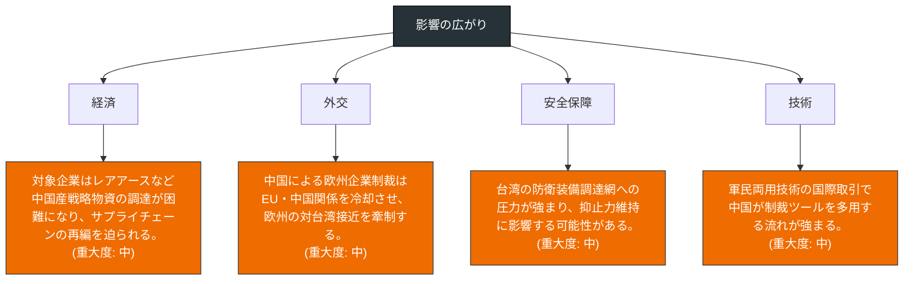
```mermaid
flowchart TB
  R["影響の広がり"]
  D0["経済"]
  I0["対象企業はレアアースなど中国産戦略物資の調達が困難になり、サプライチェーンの再編を迫られる。\n(重大度: 中)"]
  R --> D0 --> I0
  style I0 fill:#ef6c00,color:#fff,stroke:#333
  D1["外交"]
  I1["中国による欧州企業制裁はEU・中国関係を冷却させ、欧州の対台湾接近を牽制する。\n(重大度: 中)"]
  R --> D1 --> I1
  style I1 fill:#ef6c00,color:#fff,stroke:#333
  D2["安全保障"]
  I2["台湾の防衛装備調達網への圧力が強まり、抑止力維持に影響する可能性がある。\n(重大度: 中)"]
  R --> D2 --> I2
  style I2 fill:#ef6c00,color:#fff,stroke:#333
  D3["技術"]
  I3["軍民両用技術の国際取引で中国が制裁ツールを多用する流れが強まる。\n(重大度: 中)"]
  R --> D3 --> I3
  style I3 fill:#ef6c00,color:#fff,stroke:#333
  style R fill:#263238,color:#fff,stroke:#000
```

### 当事者の関係ネットワーク

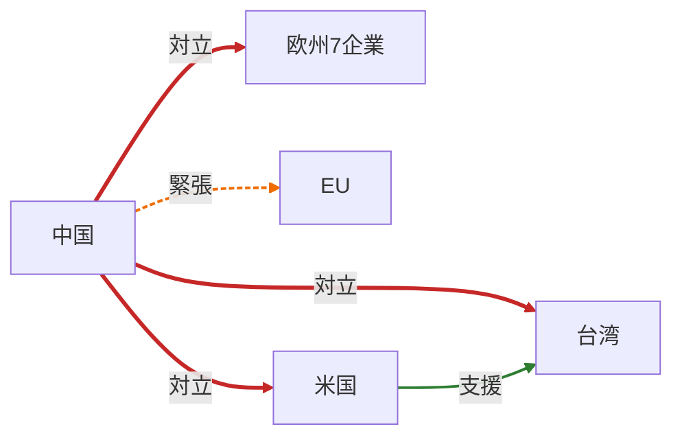
```mermaid
graph LR
  N0["中国"]
  N1["台湾"]
  N2["欧州7企業"]
  N3["EU"]
  N4["米国"]
  N0 -->|対立| N1
  N0 -->|対立| N2
  N0 -->|緊張| N3
  N4 -->|支援| N1
  N0 -->|対立| N4
  linkStyle 0 stroke:#c62828,stroke-width:3px;
  linkStyle 1 stroke:#c62828,stroke-width:3px;
  linkStyle 2 stroke:#ef6c00,stroke-width:2px,stroke-dasharray:4 2;
  linkStyle 3 stroke:#2e7d32,stroke-width:2px;
  linkStyle 4 stroke:#c62828,stroke-width:3px;
```

### 押さえるべき論点

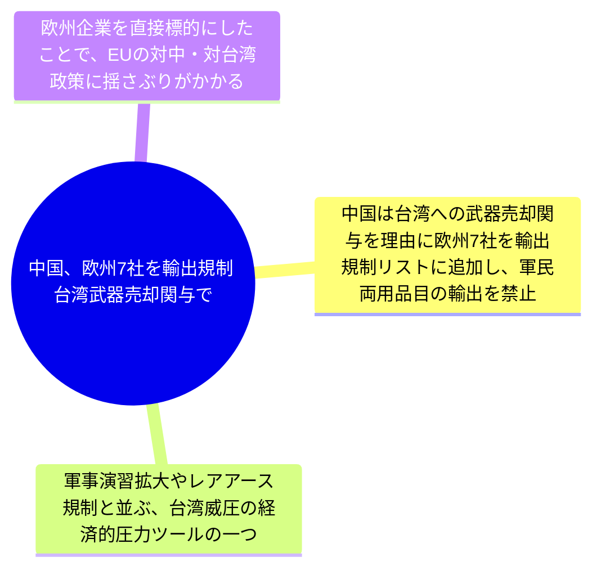
```mermaid
mindmap
  root((中国、欧州7社を輸出規制 台湾武器売却関与で))
    中国は台湾への武器売却関与を理由に欧州7社を輸出規制リストに追加し、軍民両用品目の輸出を禁止
    軍事演習拡大やレアアース規制と並ぶ、台湾威圧の経済的圧力ツールの一つ
    欧州企業を直接標的にしたことで、EUの対中・対台湾政策に揺さぶりがかかる
```

---

## パナマ運河の通航権落札額が約3倍に急騰 `重要度: 中` `middle_east / americas / global`
- **出典:** NHK 国際 ([原文](http://www3.nhk.or.jp/news/html/20260424/k10015107851000.html)) / **公開:** 2026-04-24 21:29

**要約**
ホルムズ海峡の事実上の封鎖が続く中、中米の海上輸送の要衝であるパナマ運河の優先通航権の平均落札価格が、米国・イスラエルによるイラン攻撃前と比べて約3倍に跳ね上がりました。アジアの石油精製業者が中東産原油の代替として米国産原油の輸入を拡大しており、パナマ運河を通航する船舶が急増していることが背景にあります。エネルギー供給網の重心が中東から米州へシフトしつつある動きを象徴する事象です。

**背景**
4月20日にはイランが英タンカーをホルムズ海峡で一時拿捕、海運会社は中東原油輸送路の一部を回避し保険料も急騰していました。米・イスラエルによるイラン攻撃を契機にホルムズ海峡が事実上封鎖され、アジアの精製業者は原油調達先を米国に切り替え、その輸送ルートとしてパナマ運河の需要が急騰しています。

**要点**
- ホルムズ海峡封鎖の影響がパナマ運河の通航権価格を約3倍に押し上げた

- アジアの精製業者は中東産原油から米国産原油へシフトしている

- 日本のエネルギー安全保障にも波及する世界的な供給網再編の兆し

### 経緯タイムライン

```mermaid
timeline
  title パナマ運河の通航権落札額が約3倍に急騰 — 経緯
  攻撃開始前 : パナマ運河の優先通航権の平均落札価格は通常水準
  直近 : 米・イスラエルによるイラン攻撃でホルムズ海峡が事実上封鎖
  2026-04-20 : イランがホルムズ海峡で英タンカーを一時拿捕
  2026-04-22 : 海運会社が中東原油輸送路の一部を回避、保険料が急騰
  2026-04-24 : パナマ運河の優先通航権の平均落札価格が攻撃前の約3倍に
```

### 当事者マップ

```mermaid
flowchart LR
  T["パナマ運河の通航権落札額が約3倍に急騰"]
  A0["パナマ運河庁\n(国家機関)"]
  A0 -- 中立 --> T
  style A0 fill:#616161,color:#fff,stroke:#333
  A1["イラン\n(国家)"]
  A1 -- その他 --> T
  style A1 fill:#1565c0,color:#fff,stroke:#333
  A2["米国\n(国家)"]
  A2 -- 推進 --> T
  style A2 fill:#2e7d32,color:#fff,stroke:#333
  A3["イスラエル\n(国家)"]
  A3 -- 推進 --> T
  style A3 fill:#2e7d32,color:#fff,stroke:#333
  A4["アジアの石油精製業者\n(企業)"]
  A4 -- 被害 --> T
  style A4 fill:#ef6c00,color:#fff,stroke:#333
  style T fill:#263238,color:#fff,stroke:#000
```

### 影響の広がり

```mermaid
flowchart TB
  R["影響の広がり"]
  D0["エネルギー"]
  I0["原油の調達ルートが中東から米州へシフトし、供給構造の再編が進行。\n(重大度: 高)"]
  R --> D0 --> I0
  style I0 fill:#c62828,color:#fff,stroke:#333
  D1["経済"]
  I1["通航権価格の高騰と輸送距離の延長により、輸送コスト・原油価格が押し上げられる。\n(重大度: 中)"]
  R --> D1 --> I1
  style I1 fill:#ef6c00,color:#fff,stroke:#333
  D2["安全保障"]
  I2["日本を含むアジア諸国のエネルギー安全保障に直接的影響。中東依存度の見直しが迫られる。\n(重大度: 高)"]
  R --> D2 --> I2
  style I2 fill:#c62828,color:#fff,stroke:#333
  D3["外交"]
  I3["パナマ運河の戦略的重要性が再認識され、運河を巡る大国間の関心が高まる。\n(重大度: 中)"]
  R --> D3 --> I3
  style I3 fill:#ef6c00,color:#fff,stroke:#333
  style R fill:#263238,color:#fff,stroke:#000
```

### 当事者の関係ネットワーク

```mermaid
graph LR
  N0["パナマ運河庁"]
  N1["イラン"]
  N2["米国"]
  N3["イスラエル"]
  N4["アジアの石油精製業者"]
  N2 -->|対立| N1
  N3 -->|対立| N1
  N2 -->|同盟| N3
  N4 -->|依存| N2
  linkStyle 0 stroke:#c62828,stroke-width:3px;
  linkStyle 1 stroke:#c62828,stroke-width:3px;
  linkStyle 2 stroke:#1565c0,stroke-width:3px;
  linkStyle 3 stroke:#00838f,stroke-width:2px,stroke-dasharray:2 2;
```

### 押さえるべき論点

```mermaid
mindmap
  root((パナマ運河の通航権落札額が約3倍に急騰))
    ホルムズ海峡封鎖の影響がパナマ運河の通航権価格を約3倍に押し上げた
    アジアの精製業者は中東産原油から米国産原油へシフトしている
    日本のエネルギー安全保障にも波及する世界的な供給網再編の兆し
```

---
