# 地政学ニュース図解レポート 2026-04-26 号

生成日時: 2026-04-26 07:34 / 記事数: 5

## 📌 本日の要点

- **ロシアのウクライナ侵攻 4月25日の動向** — ロシアによるウクライナへの軍事侵攻が継続しており、4月25日もウクライナ各地で両軍の戦闘が続いている。

- **米弾薬備蓄低下で台湾防衛計画見直し議論** — 米有力紙の報道によると、米軍によるイランへの軍事作戦でミサイルなどの弾薬が大量に消費され、備蓄を以前の水準に戻すには最大6年かかる可能性がある。

## ロシアのウクライナ侵攻 4月25日の動向 `重要度: 高` `europe / global`
- **出典:** NHK 国際 ([原文](http://www3.nhk.or.jp/news/html/20260425/k10015082721000.html)) / **公開:** 2026-04-25 19:30

**要約**
ロシアによるウクライナへの軍事侵攻が継続しており、4月25日もウクライナ各地で両軍の戦闘が続いている。多くの市民が国外への避難を余儀なくされており、人道状況の悪化が懸念されている。NHKは戦闘状況や関係各国の外交動向を随時更新で伝えている。

**背景**
ロシアによる侵攻は長期化しており、戦闘と避難民問題が常態化している。直近ではNATOがウクライナへのF-16追加供与で調整を進める一方、東欧諸国への追加配備も協議されている。さらに21日にはロシアがシベリア極東で北朝鮮との合同軍事演習を発表しており、欧州とアジアにまたがる連動した安全保障緊張の中で本日の動きが位置づけられる。

**要点**
- 4月25日もウクライナ各地で戦闘が継続している

- 大勢の市民が国外への避難を続けており人道状況は深刻

- NATOによるF-16供与調整や東欧追加配備など、欧州側の支援・抑止強化が並行して進んでいる

### 経緯タイムライン

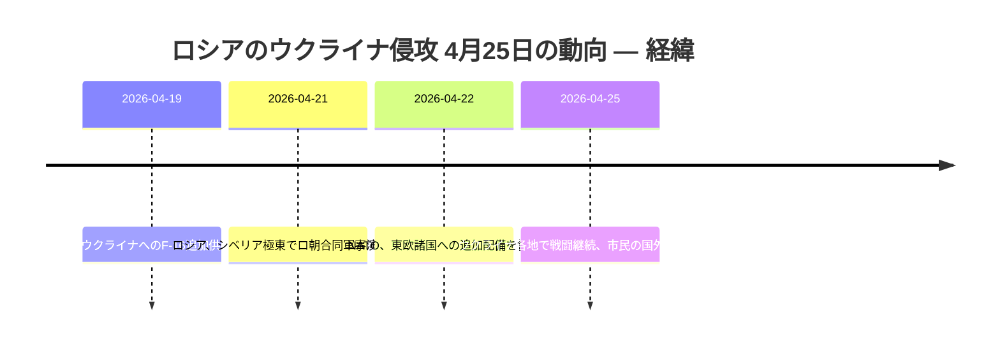
```mermaid
timeline
  title ロシアのウクライナ侵攻 4月25日の動向 — 経緯
  2026-04-19 : NATO、ウクライナへのF-16追加供与で調整
  2026-04-21 : ロシア、シベリア極東でロ朝合同軍事演習を発表
  2026-04-22 : NATO、東欧諸国への追加配備を協議
  2026-04-25 : ウクライナ各地で戦闘継続、市民の国外避難が続く
```

### 当事者マップ

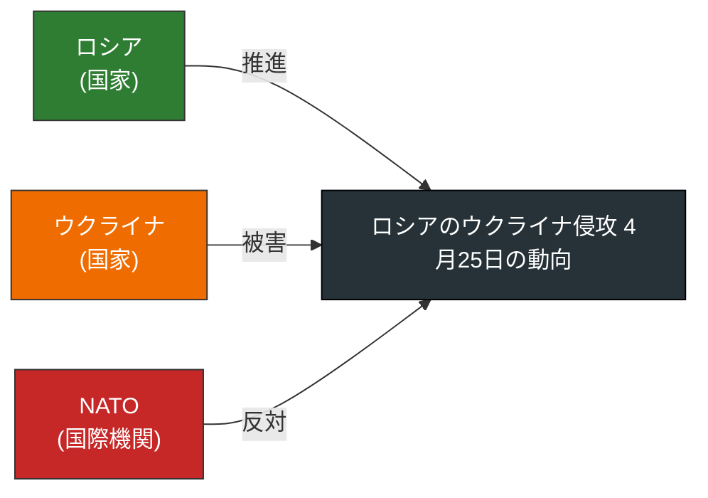
```mermaid
flowchart LR
  T["ロシアのウクライナ侵攻 4月25日の動向"]
  A0["ロシア\n(国家)"]
  A0 -- 推進 --> T
  style A0 fill:#2e7d32,color:#fff,stroke:#333
  A1["ウクライナ\n(国家)"]
  A1 -- 被害 --> T
  style A1 fill:#ef6c00,color:#fff,stroke:#333
  A2["NATO\n(国際機関)"]
  A2 -- 反対 --> T
  style A2 fill:#c62828,color:#fff,stroke:#333
  style T fill:#263238,color:#fff,stroke:#000
```

### 影響の広がり

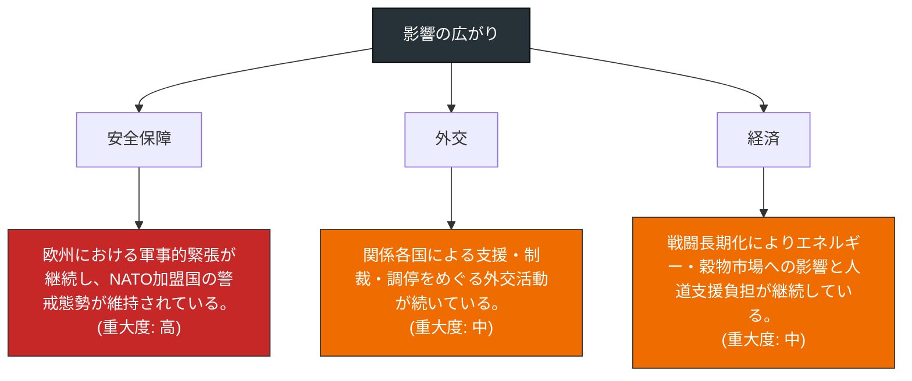
```mermaid
flowchart TB
  R["影響の広がり"]
  D0["安全保障"]
  I0["欧州における軍事的緊張が継続し、NATO加盟国の警戒態勢が維持されている。\n(重大度: 高)"]
  R --> D0 --> I0
  style I0 fill:#c62828,color:#fff,stroke:#333
  D1["外交"]
  I1["関係各国による支援・制裁・調停をめぐる外交活動が続いている。\n(重大度: 中)"]
  R --> D1 --> I1
  style I1 fill:#ef6c00,color:#fff,stroke:#333
  D2["経済"]
  I2["戦闘長期化によりエネルギー・穀物市場への影響と人道支援負担が継続している。\n(重大度: 中)"]
  R --> D2 --> I2
  style I2 fill:#ef6c00,color:#fff,stroke:#333
  style R fill:#263238,color:#fff,stroke:#000
```

### 当事者の関係ネットワーク

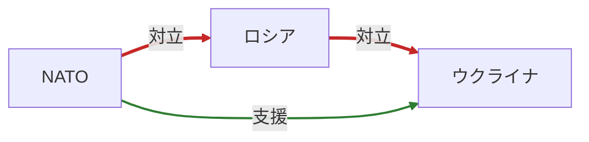
```mermaid
graph LR
  N0["ロシア"]
  N1["ウクライナ"]
  N2["NATO"]
  N0 -->|対立| N1
  N2 -->|支援| N1
  N2 -->|対立| N0
  linkStyle 0 stroke:#c62828,stroke-width:3px;
  linkStyle 1 stroke:#2e7d32,stroke-width:2px;
  linkStyle 2 stroke:#c62828,stroke-width:3px;
```

### 押さえるべき論点

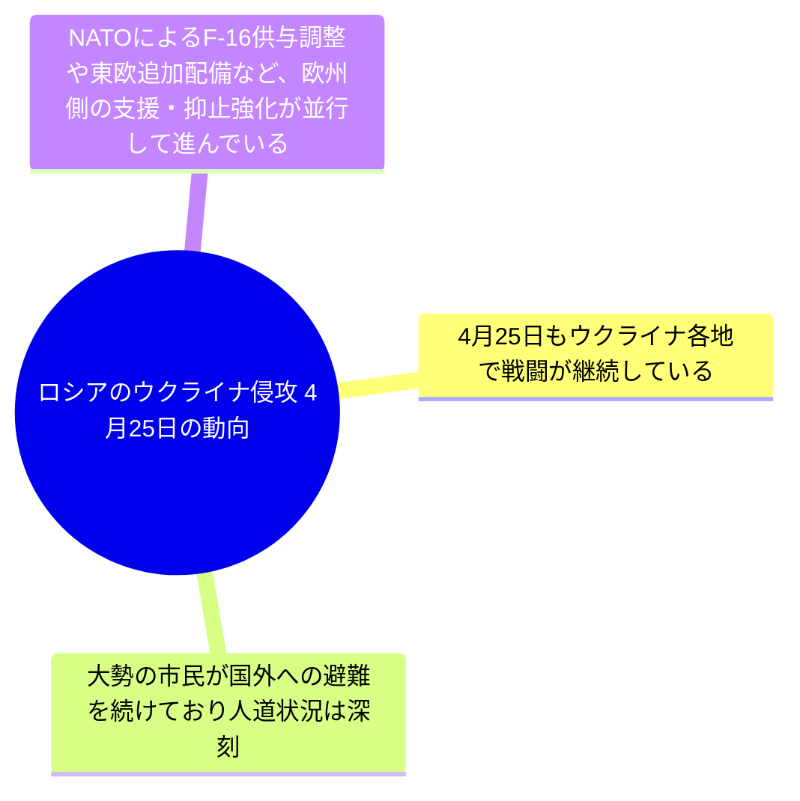
```mermaid
mindmap
  root((ロシアのウクライナ侵攻 4月25日の動向))
    4月25日もウクライナ各地で戦闘が継続している
    大勢の市民が国外への避難を続けており人道状況は深刻
    NATOによるF-16供与調整や東欧追加配備など、欧州側の支援・抑止強化が並行して進んでいる
```

---

## 米弾薬備蓄低下で台湾防衛計画見直し議論 `重要度: 高` `east_asia / middle_east / global`
- **出典:** NHK 国際 ([原文](http://www3.nhk.or.jp/news/html/20260425/k10015108101000.html)) / **公開:** 2026-04-25 12:40

**要約**
米有力紙の報道によると、米軍によるイランへの軍事作戦でミサイルなどの弾薬が大量に消費され、備蓄を以前の水準に戻すには最大6年かかる可能性がある。これを受け、トランプ政権内部では中国による台湾侵攻に備えた防衛計画を修正すべきかどうかの議論が始まっているという。インド太平洋への戦力集中というこれまでの方針との整合性が問われる事態となっている。中東での軍事行動が東アジア有事への対応能力を直接的に圧迫する構図が鮮明になった。

**背景**
第2次トランプ政権はイラン核施設への攻撃を含む対イラン軍事作戦を展開し、精密誘導兵器を大量消費した。一方、4月22日には中国が台湾海峡で軍事演習を拡大し、日米が即応体制を強化するなど東アジアの緊張も高まっている。中東と東アジアという二正面で米軍の即応能力が試される中、限られた弾薬備蓄をどう配分するかが戦略的課題として浮上した。

**要点**
- 対イラン軍事作戦で米軍のミサイル等弾薬備蓄が大幅に減少、回復に最大6年

- トランプ政権内で台湾有事に備えた防衛計画の修正論議が始動

- 中東と東アジアの二正面で米軍即応能力が試される構図、日本の自主防衛強化圧力も増大

### 経緯タイムライン

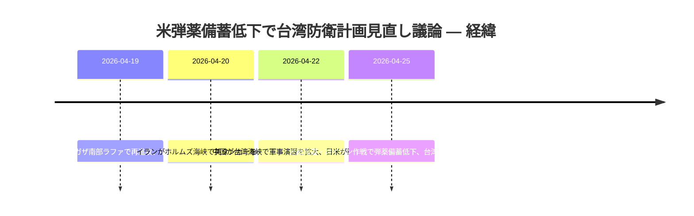
```mermaid
timeline
  title 米弾薬備蓄低下で台湾防衛計画見直し議論 — 経緯
  2026-04-19 : イスラエル軍がガザ南部ラファで再進攻、中東情勢が再緊迫
  2026-04-20 : イランがホルムズ海峡で英タンカーを一時拿捕
  2026-04-22 : 中国が台湾海峡で軍事演習を拡大、日米が即応体制強化
  2026-04-25 : 米紙報道・対イラン作戦で弾薬備蓄低下、台湾防衛計画修正論議
```

### 当事者マップ

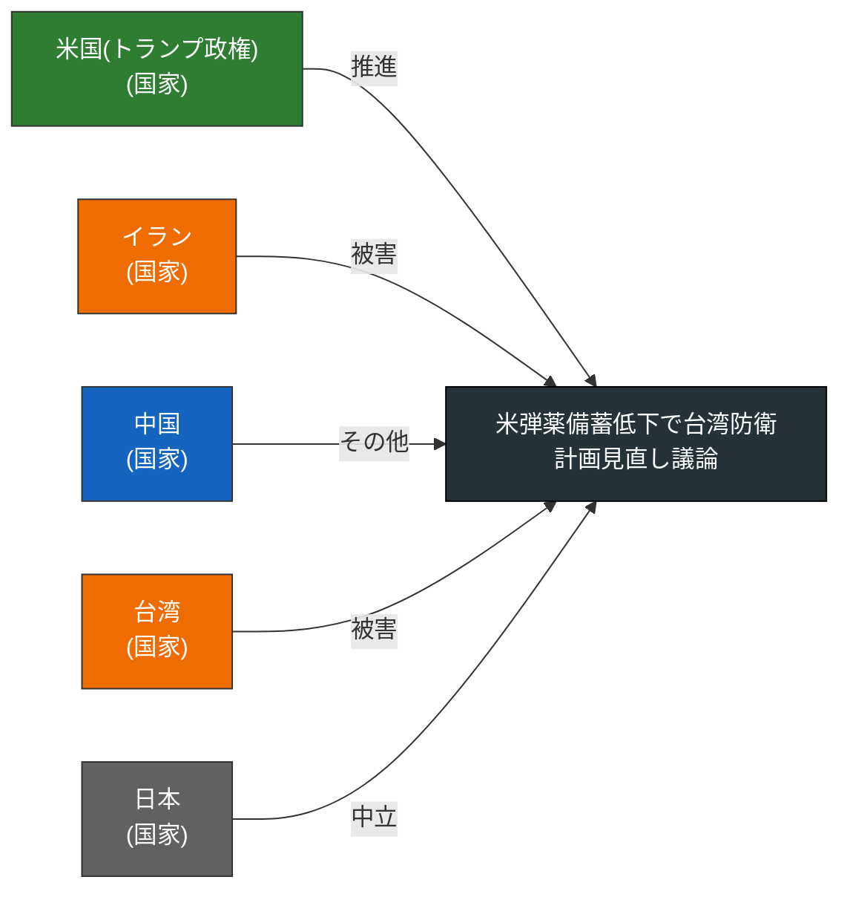
```mermaid
flowchart LR
  T["米弾薬備蓄低下で台湾防衛計画見直し議論"]
  A0["米国(トランプ政権)\n(国家)"]
  A0 -- 推進 --> T
  style A0 fill:#2e7d32,color:#fff,stroke:#333
  A1["イラン\n(国家)"]
  A1 -- 被害 --> T
  style A1 fill:#ef6c00,color:#fff,stroke:#333
  A2["中国\n(国家)"]
  A2 -- その他 --> T
  style A2 fill:#1565c0,color:#fff,stroke:#333
  A3["台湾\n(国家)"]
  A3 -- 被害 --> T
  style A3 fill:#ef6c00,color:#fff,stroke:#333
  A4["日本\n(国家)"]
  A4 -- 中立 --> T
  style A4 fill:#616161,color:#fff,stroke:#333
  style T fill:#263238,color:#fff,stroke:#000
```

### 影響の広がり

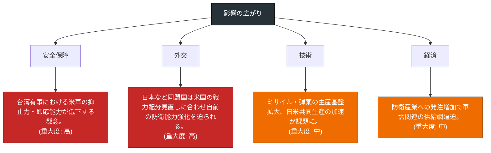
```mermaid
flowchart TB
  R["影響の広がり"]
  D0["安全保障"]
  I0["台湾有事における米軍の抑止力・即応能力が低下する懸念。\n(重大度: 高)"]
  R --> D0 --> I0
  style I0 fill:#c62828,color:#fff,stroke:#333
  D1["外交"]
  I1["日本など同盟国は米国の戦力配分見直しに合わせ自前の防衛能力強化を迫られる。\n(重大度: 高)"]
  R --> D1 --> I1
  style I1 fill:#c62828,color:#fff,stroke:#333
  D2["技術"]
  I2["ミサイル・弾薬の生産基盤拡大、日米共同生産の加速が課題に。\n(重大度: 中)"]
  R --> D2 --> I2
  style I2 fill:#ef6c00,color:#fff,stroke:#333
  D3["経済"]
  I3["防衛産業への発注増加で軍需関連の供給網逼迫。\n(重大度: 中)"]
  R --> D3 --> I3
  style I3 fill:#ef6c00,color:#fff,stroke:#333
  style R fill:#263238,color:#fff,stroke:#000
```

### 当事者の関係ネットワーク

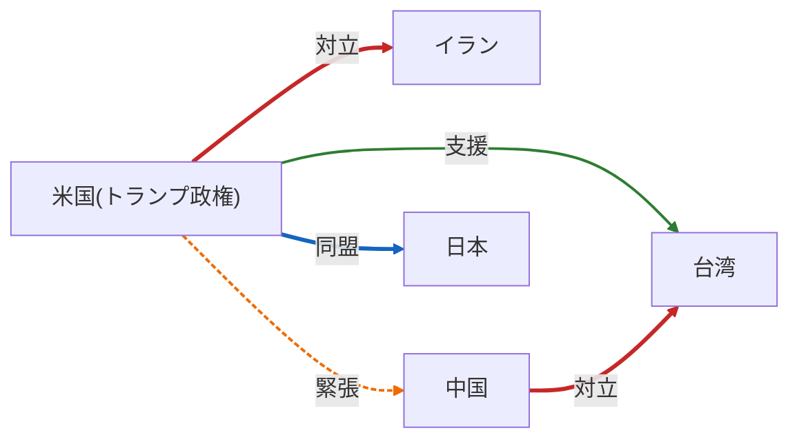
```mermaid
graph LR
  N0["米国(トランプ政権)"]
  N1["イラン"]
  N2["中国"]
  N3["台湾"]
  N4["日本"]
  N0 -->|対立| N1
  N0 -->|緊張| N2
  N0 -->|支援| N3
  N0 -->|同盟| N4
  N2 -->|対立| N3
  linkStyle 0 stroke:#c62828,stroke-width:3px;
  linkStyle 1 stroke:#ef6c00,stroke-width:2px,stroke-dasharray:4 2;
  linkStyle 2 stroke:#2e7d32,stroke-width:2px;
  linkStyle 3 stroke:#1565c0,stroke-width:3px;
  linkStyle 4 stroke:#c62828,stroke-width:3px;
```

### 押さえるべき論点

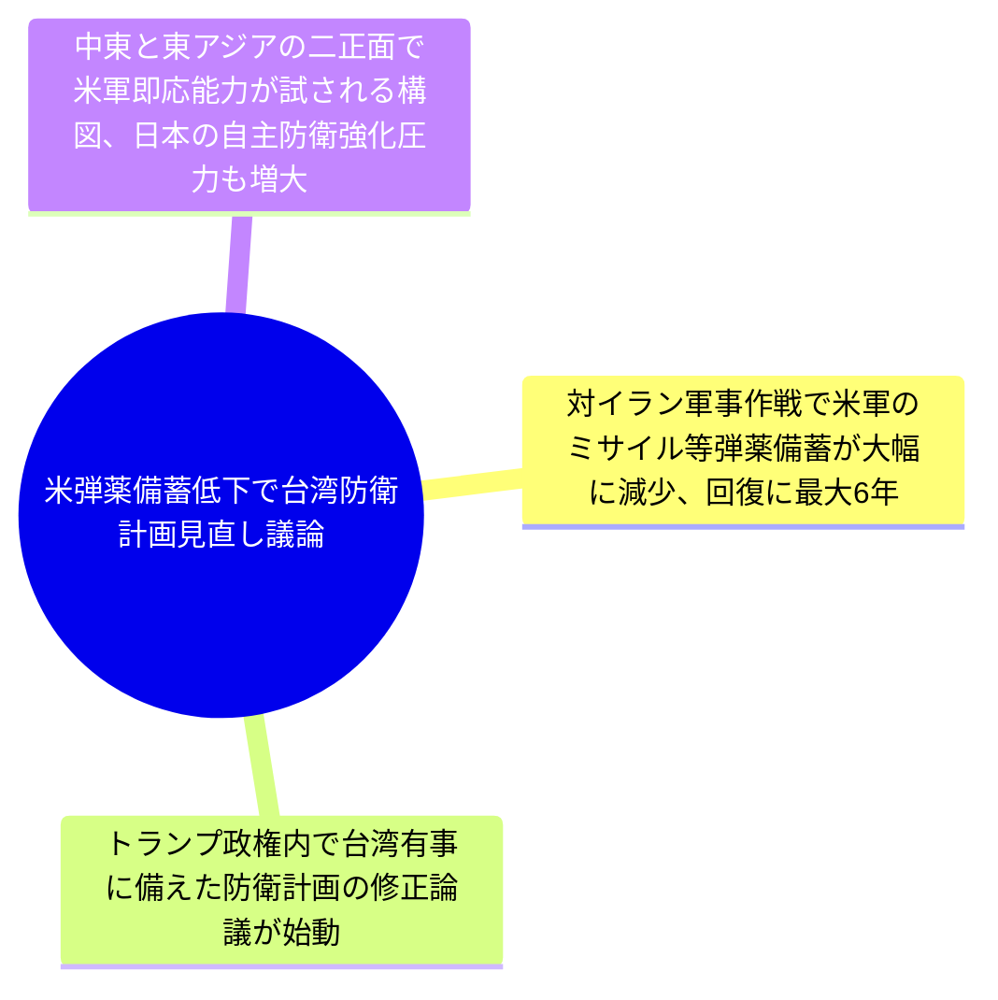
```mermaid
mindmap
  root((米弾薬備蓄低下で台湾防衛計画見直し議論))
    対イラン軍事作戦で米軍のミサイル等弾薬備蓄が大幅に減少、回復に最大6年
    トランプ政権内で台湾有事に備えた防衛計画の修正論議が始動
    中東と東アジアの二正面で米軍即応能力が試される構図、日本の自主防衛強化圧力も増大
```

---

## ゼレンスキー氏、サウジと防衛協力協議 `重要度: 中` `middle_east / europe`
- **出典:** NHK 国際 ([原文](http://www3.nhk.or.jp/news/html/20260425/k10015108291000.html)) / **公開:** 2026-04-25 19:31

**要約**
ウクライナのゼレンスキー大統領は4月24日、サウジアラビアを訪問しムハンマド皇太子と会談した。会談では無人機対策を中心とした防衛協力を進めることで一致した。ウクライナは中東の有力産油国との関係強化を通じ、和平交渉や対ロ抑止での後ろ盾確保を狙うとみられる。サウジ側も地域安全保障や無人機脅威への対応で利害が一致している。

**背景**
ウクライナ戦争が長期化する中、NATOはF-16追加供与や東欧への部隊増強を協議するなど、対ロ支援継続の姿勢を示している。一方で中東ではイランによるホルムズ海峡での英タンカー拿捕やイスラエル軍のラファ再進攻など緊張が高まっており、サウジは地域での無人機・ミサイル防衛強化を急ぐ立場。今回の会談は、ウクライナの戦時外交と湾岸諸国の安全保障ニーズが交差する動きと位置づけられる。

**要点**
- ウクライナとサウジが無人機対策を軸に防衛協力で一致

- ウクライナは戦時外交を湾岸地域へ拡大

- 中東緊張下でサウジも対ドローン能力強化を急ぐ

### 経緯タイムライン

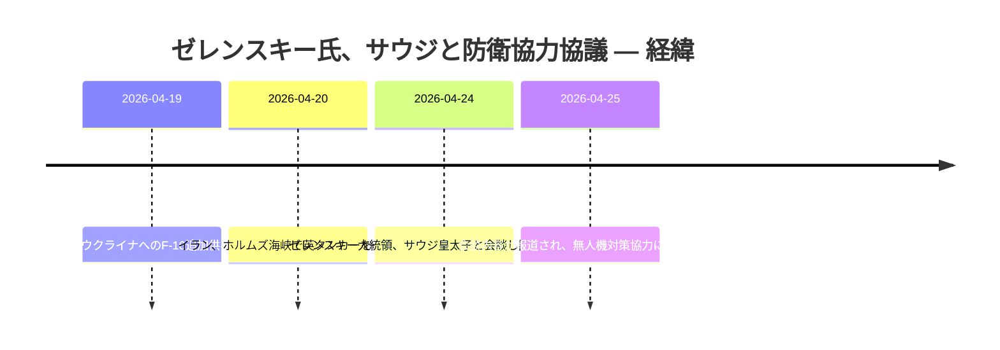
```mermaid
timeline
  title ゼレンスキー氏、サウジと防衛協力協議 — 経緯
  2026-04-19 : NATO、ウクライナへのF-16追加供与で調整
  2026-04-20 : イラン、ホルムズ海峡で英タンカーを一時拿捕
  2026-04-24 : ゼレンスキー大統領、サウジ皇太子と会談し防衛協力で一致
  2026-04-25 : 会談内容が報道され、無人機対策協力に注目集まる
```

### 当事者マップ

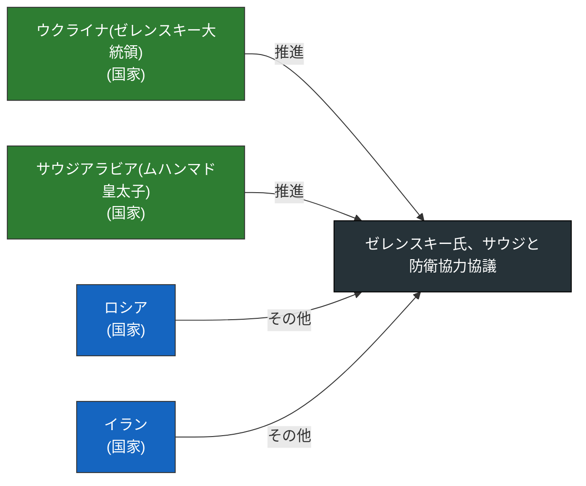
```mermaid
flowchart LR
  T["ゼレンスキー氏、サウジと防衛協力協議"]
  A0["ウクライナ(ゼレンスキー大統領)\n(国家)"]
  A0 -- 推進 --> T
  style A0 fill:#2e7d32,color:#fff,stroke:#333
  A1["サウジアラビア(ムハンマド皇太子)\n(国家)"]
  A1 -- 推進 --> T
  style A1 fill:#2e7d32,color:#fff,stroke:#333
  A2["ロシア\n(国家)"]
  A2 -- その他 --> T
  style A2 fill:#1565c0,color:#fff,stroke:#333
  A3["イラン\n(国家)"]
  A3 -- その他 --> T
  style A3 fill:#1565c0,color:#fff,stroke:#333
  style T fill:#263238,color:#fff,stroke:#000
```

### 影響の広がり

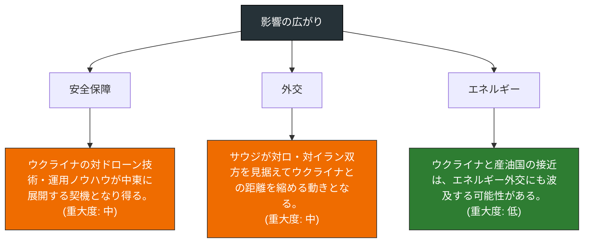
```mermaid
flowchart TB
  R["影響の広がり"]
  D0["安全保障"]
  I0["ウクライナの対ドローン技術・運用ノウハウが中東に展開する契機となり得る。\n(重大度: 中)"]
  R --> D0 --> I0
  style I0 fill:#ef6c00,color:#fff,stroke:#333
  D1["外交"]
  I1["サウジが対ロ・対イラン双方を見据えてウクライナとの距離を縮める動きとなる。\n(重大度: 中)"]
  R --> D1 --> I1
  style I1 fill:#ef6c00,color:#fff,stroke:#333
  D2["エネルギー"]
  I2["ウクライナと産油国の接近は、エネルギー外交にも波及する可能性がある。\n(重大度: 低)"]
  R --> D2 --> I2
  style I2 fill:#2e7d32,color:#fff,stroke:#333
  style R fill:#263238,color:#fff,stroke:#000
```

### 当事者の関係ネットワーク

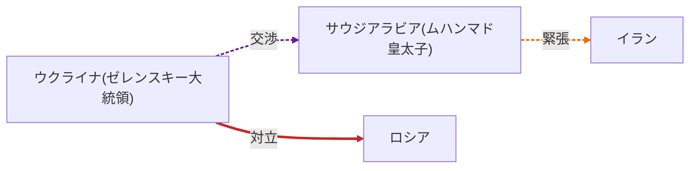
```mermaid
graph LR
  N0["ウクライナ(ゼレンスキー大統領)"]
  N1["サウジアラビア(ムハンマド皇太子)"]
  N2["ロシア"]
  N3["イラン"]
  N0 -->|交渉| N1
  N0 -->|対立| N2
  N1 -->|緊張| N3
  linkStyle 0 stroke:#6a1b9a,stroke-width:2px,stroke-dasharray:4 2;
  linkStyle 1 stroke:#c62828,stroke-width:3px;
  linkStyle 2 stroke:#ef6c00,stroke-width:2px,stroke-dasharray:4 2;
```

### 押さえるべき論点

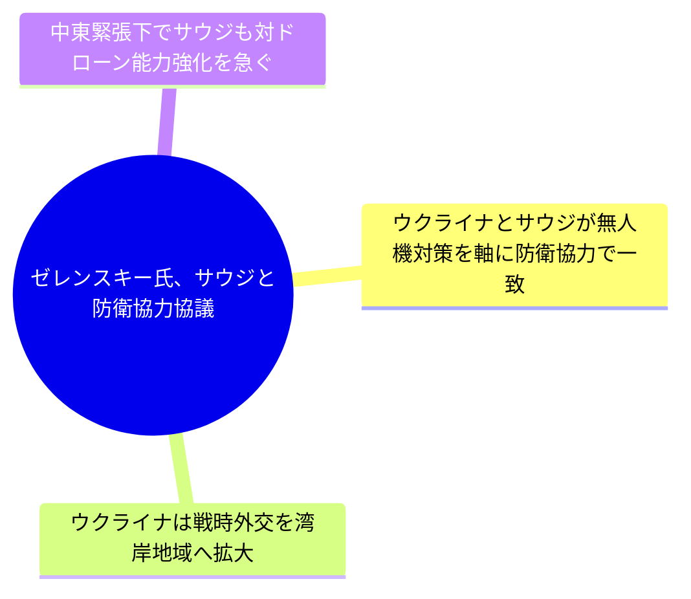
```mermaid
mindmap
  root((ゼレンスキー氏、サウジと防衛協力協議))
    ウクライナとサウジが無人機対策を軸に防衛協力で一致
    ウクライナは戦時外交を湾岸地域へ拡大
    中東緊張下でサウジも対ドローン能力強化を急ぐ
```

---

## ロシア、EU追加制裁に反発も影響限定的と主張 `重要度: 中` `europe / global`
- **出典:** NHK 国際 ([原文](http://www3.nhk.or.jp/news/html/20260425/k10015106841000.html)) / **公開:** 2026-04-25 09:23

**要約**
EUはウクライナへの約16兆円規模の融資決定と同時に、ロシアへの追加制裁を発表した。これに対しロシアは『厳しい対抗措置を講じる』と強く反発した。一方で、ロシア側は制裁による自国経済への影響は最小限にとどまると強調し、強気の姿勢を崩していない。EUと欧州側の対ロシア圧力強化と、ロシアの抵抗姿勢が改めて鮮明になった形である。

**背景**
ロシアによるウクライナ侵攻が長期化するなか、EUは継続的に対ロシア制裁を強化しウクライナへの資金支援も拡大してきた。過去1週間にもNATOは東欧への追加配備を協議し、ウクライナへのF-16追加供与も調整するなど、欧米は軍事・経済両面で対ロシア圧力を高めている。さらにロシアはシベリア極東でロ朝合同軍事演習を発表するなど、東方での連携誇示で対抗姿勢を強めており、今回の追加制裁はこの応酬の延長線上に位置づけられる。

**要点**
- EUは16兆円規模のウクライナ融資と対ロ追加制裁をセットで打ち出した

- ロシアは対抗措置を予告しつつ、制裁の影響は最小限と強気姿勢を維持

- 欧州ではNATO配備強化やF-16供与調整が並行し、対ロ圧力が多層化している

### 経緯タイムライン

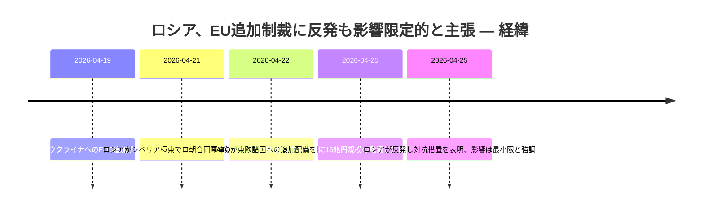
```mermaid
timeline
  title ロシア、EU追加制裁に反発も影響限定的と主張 — 経緯
  2026-04-19 : NATOがウクライナへのF-16追加供与で調整
  2026-04-21 : ロシアがシベリア極東でロ朝合同軍事演習を発表
  2026-04-22 : NATOが東欧諸国への追加配備を協議
  2026-04-25 : EUがウクライナに16兆円規模の融資と対ロ追加制裁を発表
  2026-04-25 : ロシアが反発し対抗措置を表明、影響は最小限と強調
```

### 当事者マップ

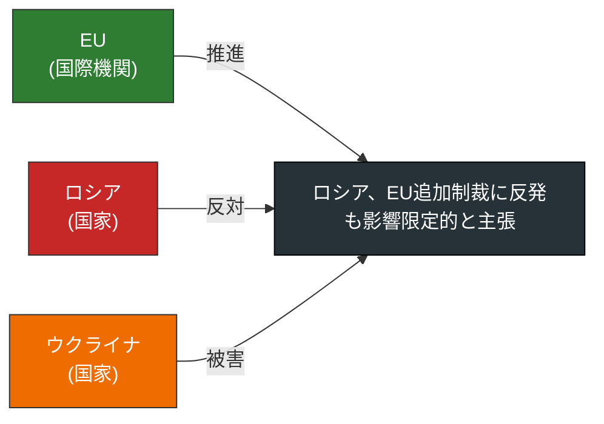
```mermaid
flowchart LR
  T["ロシア、EU追加制裁に反発も影響限定的と主張"]
  A0["EU\n(国際機関)"]
  A0 -- 推進 --> T
  style A0 fill:#2e7d32,color:#fff,stroke:#333
  A1["ロシア\n(国家)"]
  A1 -- 反対 --> T
  style A1 fill:#c62828,color:#fff,stroke:#333
  A2["ウクライナ\n(国家)"]
  A2 -- 被害 --> T
  style A2 fill:#ef6c00,color:#fff,stroke:#333
  style T fill:#263238,color:#fff,stroke:#000
```

### 影響の広がり

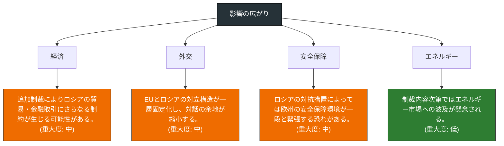
```mermaid
flowchart TB
  R["影響の広がり"]
  D0["経済"]
  I0["追加制裁によりロシアの貿易・金融取引にさらなる制約が生じる可能性がある。\n(重大度: 中)"]
  R --> D0 --> I0
  style I0 fill:#ef6c00,color:#fff,stroke:#333
  D1["外交"]
  I1["EUとロシアの対立構造が一層固定化し、対話の余地が縮小する。\n(重大度: 中)"]
  R --> D1 --> I1
  style I1 fill:#ef6c00,color:#fff,stroke:#333
  D2["安全保障"]
  I2["ロシアの対抗措置によっては欧州の安全保障環境が一段と緊張する恐れがある。\n(重大度: 中)"]
  R --> D2 --> I2
  style I2 fill:#ef6c00,color:#fff,stroke:#333
  D3["エネルギー"]
  I3["制裁内容次第ではエネルギー市場への波及が懸念される。\n(重大度: 低)"]
  R --> D3 --> I3
  style I3 fill:#2e7d32,color:#fff,stroke:#333
  style R fill:#263238,color:#fff,stroke:#000
```

### 当事者の関係ネットワーク

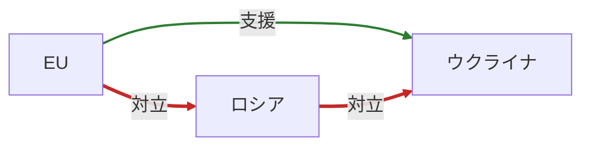
```mermaid
graph LR
  N0["EU"]
  N1["ロシア"]
  N2["ウクライナ"]
  N0 -->|対立| N1
  N0 -->|支援| N2
  N1 -->|対立| N2
  linkStyle 0 stroke:#c62828,stroke-width:3px;
  linkStyle 1 stroke:#2e7d32,stroke-width:2px;
  linkStyle 2 stroke:#c62828,stroke-width:3px;
```

### 押さえるべき論点

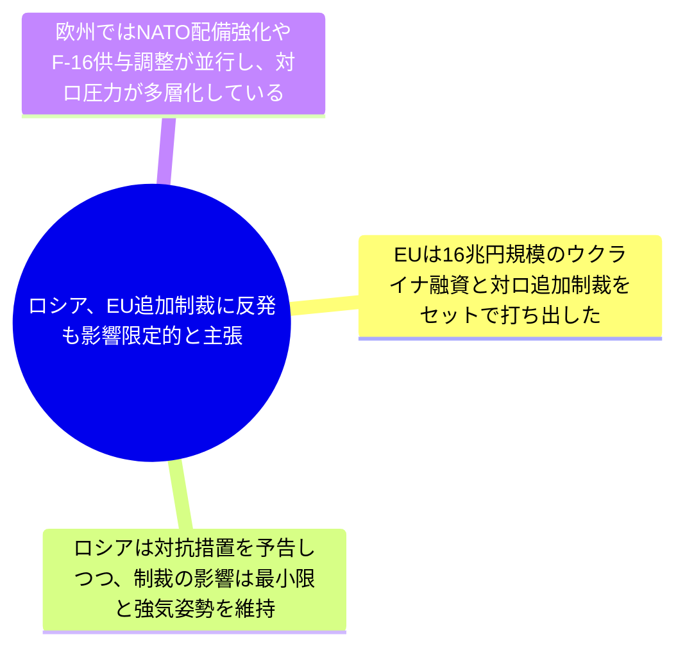
```mermaid
mindmap
  root((ロシア、EU追加制裁に反発も影響限定的と主張))
    EUは16兆円規模のウクライナ融資と対ロ追加制裁をセットで打ち出した
    ロシアは対抗措置を予告しつつ、制裁の影響は最小限と強気姿勢を維持
    欧州ではNATO配備強化やF-16供与調整が並行し、対ロ圧力が多層化している
```

---

## 米のスペイン威嚇報道に欧州NATO諸国が反発 `重要度: 中` `europe / global`
- **出典:** BBC World ([原文](https://www.bbc.com/news/articles/cj40r2gw24wo?at_medium=RSS&at_campaign=rss)) / **公開:** 2026-04-25 00:10

**要約**
BBC欧州編集長カティア・アドラー氏は、欧州と米国の関係悪化が再び表面化していると指摘した。報道によれば、米国は国防費目標を満たさないスペインに対し圧力をかけたとされ、これに欧州のNATO加盟国が反発している。欧州側は同盟内の威嚇的姿勢に懸念を示し、結束を維持する構えを見せている。米欧の信頼関係が揺らぐ中、NATOの結束力そのものが問われる事態となっている。

**背景**
過去1週間、NATOは東欧への追加配備協議やウクライナへのF-16追加供与で調整を続けており、ロシアの脅威に対する結束強化が課題となっている。一方で、米トランプ政権は欧州同盟国に国防費負担増を強く要求してきた経緯があり、今回のスペインへの威嚇報道は、米欧間の構造的な不協和音を再び浮き彫りにした。

**要点**
- 米国がNATO加盟国スペインに威嚇的姿勢をとったと報道された

- 欧州NATO諸国はこれに反発し結束した対応を見せている

- 米欧関係の悪化はNATOの抑止力と信頼性に影響する可能性がある

### 経緯タイムライン

```mermaid
timeline
  title 米のスペイン威嚇報道に欧州NATO諸国が反発 — 経緯
  2026-04-19 : NATO、ウクライナへのF-16追加供与で調整
  2026-04-22 : NATO、東欧諸国への追加配備を協議
  2026-04-25 : 米国がスペインに威嚇との報道、欧州NATO諸国が反発
```

### 当事者マップ

```mermaid
flowchart LR
  T["米のスペイン威嚇報道に欧州NATO諸国が反発"]
  A0["米国\n(国家)"]
  A0 -- 推進 --> T
  style A0 fill:#2e7d32,color:#fff,stroke:#333
  A1["スペイン\n(国家)"]
  A1 -- 被害 --> T
  style A1 fill:#ef6c00,color:#fff,stroke:#333
  A2["欧州NATO加盟国\n(国際機関)"]
  A2 -- 反対 --> T
  style A2 fill:#c62828,color:#fff,stroke:#333
  A3["NATO\n(国際機関)"]
  A3 -- 中立 --> T
  style A3 fill:#616161,color:#fff,stroke:#333
  style T fill:#263238,color:#fff,stroke:#000
```

### 影響の広がり

```mermaid
flowchart TB
  R["影響の広がり"]
  D0["外交"]
  I0["米欧関係の悪化が同盟の信頼基盤を揺るがす\n(重大度: 中)"]
  R --> D0 --> I0
  style I0 fill:#ef6c00,color:#fff,stroke:#333
  D1["安全保障"]
  I1["NATO結束の動揺はロシアへの抑止力低下につながり得る\n(重大度: 中)"]
  R --> D1 --> I1
  style I1 fill:#ef6c00,color:#fff,stroke:#333
  D2["経済"]
  I2["欧州各国の国防費増額圧力が財政運営に影響\n(重大度: 低)"]
  R --> D2 --> I2
  style I2 fill:#2e7d32,color:#fff,stroke:#333
  style R fill:#263238,color:#fff,stroke:#000
```

### 当事者の関係ネットワーク

```mermaid
graph LR
  N0["米国"]
  N1["スペイン"]
  N2["欧州NATO加盟国"]
  N3["NATO"]
  N0 -->|緊張| N1
  N0 -->|対立| N2
  N2 -->|支援| N1
  N2 -->|同盟| N3
  linkStyle 0 stroke:#ef6c00,stroke-width:2px,stroke-dasharray:4 2;
  linkStyle 1 stroke:#c62828,stroke-width:3px;
  linkStyle 2 stroke:#2e7d32,stroke-width:2px;
  linkStyle 3 stroke:#1565c0,stroke-width:3px;
```

### 押さえるべき論点

```mermaid
mindmap
  root((米のスペイン威嚇報道に欧州NATO諸国が反発))
    米国がNATO加盟国スペインに威嚇的姿勢をとったと報道された
    欧州NATO諸国はこれに反発し結束した対応を見せている
    米欧関係の悪化はNATOの抑止力と信頼性に影響する可能性がある
```

---
