# 地政学ニュース図解レポート 2026-04-27 号

生成日時: 2026-04-27 07:36 / 記事数: 5

## 📌 本日の要点

- **NPT再検討会議開幕 最終文書採択が焦点** — 核拡散防止条約(NPT)の再検討会議が日本時間27日夜からニューヨークの国連本部で始まる。

- **ロシアのウクライナ侵攻、25日の動向** — ロシアによるウクライナへの軍事侵攻が継続しており、ウクライナ各地でロシア軍とウクライナ軍の戦闘が続いている。

## NPT再検討会議開幕 最終文書採択が焦点 `重要度: 高` `global / middle_east / europe / east_asia`
- **出典:** NHK 国際 ([原文](http://www3.nhk.or.jp/news/html/20260427/k10015108791000.html)) / **公開:** 2026-04-27 05:38

**要約**
核拡散防止条約(NPT)の再検討会議が日本時間27日夜からニューヨークの国連本部で始まる。世界の核軍縮の方向性を議論する5年に一度の会議で、約190カ国が参加する。イラン情勢やウクライナ情勢で各国の対立が深まり、核軍縮に逆行する動きも相次ぐなかで開かれる。国際社会が一致して「最終文書」を採択できるかが最大の焦点となる。

**背景**
NPT再検討会議は5年ごとに開催されるが、2022年の前回会議はロシアの反対で最終文書を採択できず決裂した。直近1週間でもイランがホルムズ海峡で英タンカーを一時拿捕するなど中東情勢が緊迫し、ロ朝合同軍事演習の発表など核保有国を巡る対立も深まっている。こうした分断のなかで核軍縮の国際合意を形成できるかが問われる。

**要点**
- NPT再検討会議は5年ごとの核軍縮の方向性を決める重要会議で、前回2022年は決裂した

- ウクライナ・イラン情勢で核保有国間の対立が深く、コンセンサス採択のハードルは極めて高い

- 唯一の戦争被爆国である日本にとって、最終文書の文言を巡る外交交渉の正念場となる

### 経緯タイムライン

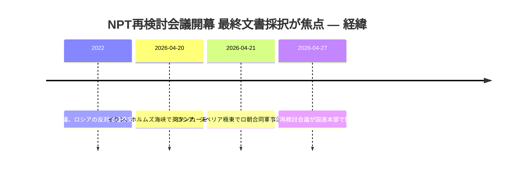
```mermaid
timeline
  title NPT再検討会議開幕 最終文書採択が焦点 — 経緯
  2022 : 前回NPT再検討会議、ロシアの反対で最終文書採択できず決裂
  2026-04-20 : イラン、ホルムズ海峡で英タンカーを一時拿捕
  2026-04-21 : ロシア、シベリア極東でロ朝合同軍事演習を発表
  2026-04-27 : NPT再検討会議が国連本部で開幕
```

### 当事者マップ

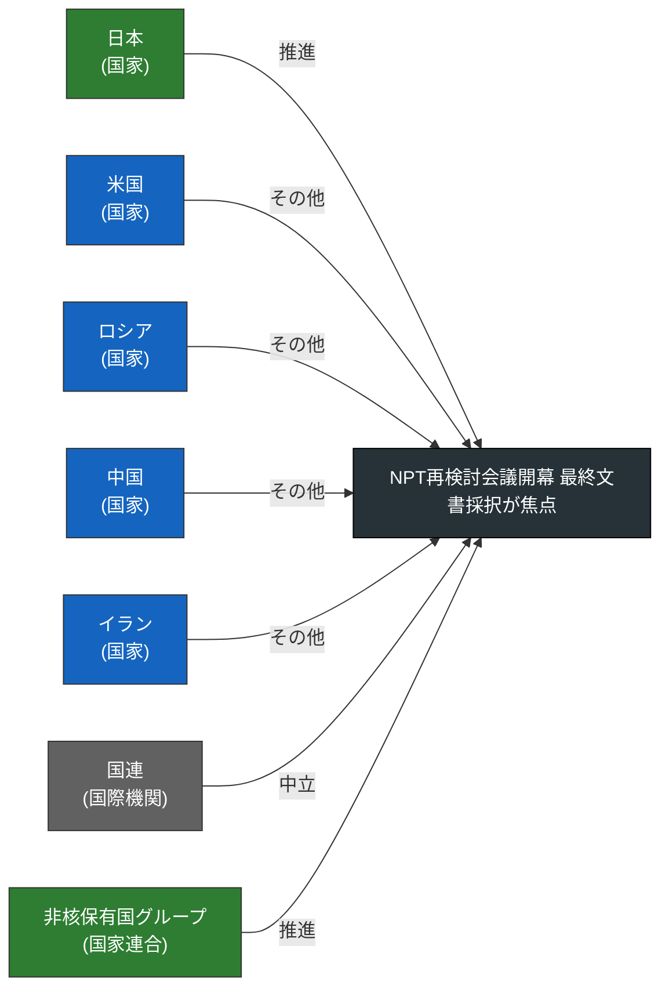
```mermaid
flowchart LR
  T["NPT再検討会議開幕 最終文書採択が焦点"]
  A0["日本\n(国家)"]
  A0 -- 推進 --> T
  style A0 fill:#2e7d32,color:#fff,stroke:#333
  A1["米国\n(国家)"]
  A1 -- その他 --> T
  style A1 fill:#1565c0,color:#fff,stroke:#333
  A2["ロシア\n(国家)"]
  A2 -- その他 --> T
  style A2 fill:#1565c0,color:#fff,stroke:#333
  A3["中国\n(国家)"]
  A3 -- その他 --> T
  style A3 fill:#1565c0,color:#fff,stroke:#333
  A4["イラン\n(国家)"]
  A4 -- その他 --> T
  style A4 fill:#1565c0,color:#fff,stroke:#333
  A5["国連\n(国際機関)"]
  A5 -- 中立 --> T
  style A5 fill:#616161,color:#fff,stroke:#333
  A6["非核保有国グループ\n(国家連合)"]
  A6 -- 推進 --> T
  style A6 fill:#2e7d32,color:#fff,stroke:#333
  style T fill:#263238,color:#fff,stroke:#000
```

### 影響の広がり

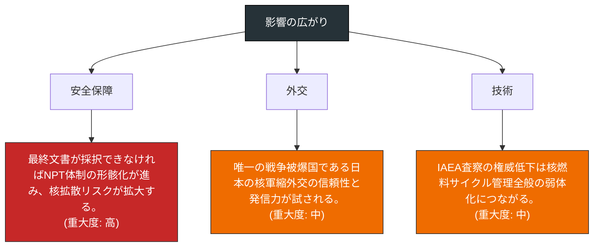
```mermaid
flowchart TB
  R["影響の広がり"]
  D0["安全保障"]
  I0["最終文書が採択できなければNPT体制の形骸化が進み、核拡散リスクが拡大する。\n(重大度: 高)"]
  R --> D0 --> I0
  style I0 fill:#c62828,color:#fff,stroke:#333
  D1["外交"]
  I1["唯一の戦争被爆国である日本の核軍縮外交の信頼性と発信力が試される。\n(重大度: 中)"]
  R --> D1 --> I1
  style I1 fill:#ef6c00,color:#fff,stroke:#333
  D2["技術"]
  I2["IAEA査察の権威低下は核燃料サイクル管理全般の弱体化につながる。\n(重大度: 中)"]
  R --> D2 --> I2
  style I2 fill:#ef6c00,color:#fff,stroke:#333
  style R fill:#263238,color:#fff,stroke:#000
```

### 当事者の関係ネットワーク

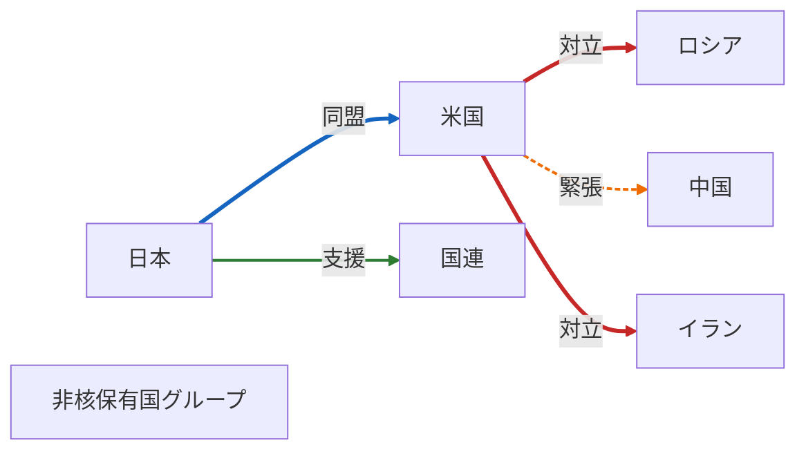
```mermaid
graph LR
  N0["日本"]
  N1["米国"]
  N2["ロシア"]
  N3["中国"]
  N4["イラン"]
  N5["国連"]
  N6["非核保有国グループ"]
  N1 -->|対立| N2
  N1 -->|緊張| N3
  N1 -->|対立| N4
  N0 -->|同盟| N1
  N0 -->|支援| N5
  linkStyle 0 stroke:#c62828,stroke-width:3px;
  linkStyle 1 stroke:#ef6c00,stroke-width:2px,stroke-dasharray:4 2;
  linkStyle 2 stroke:#c62828,stroke-width:3px;
  linkStyle 3 stroke:#1565c0,stroke-width:3px;
  linkStyle 4 stroke:#2e7d32,stroke-width:2px;
```

### 押さえるべき論点

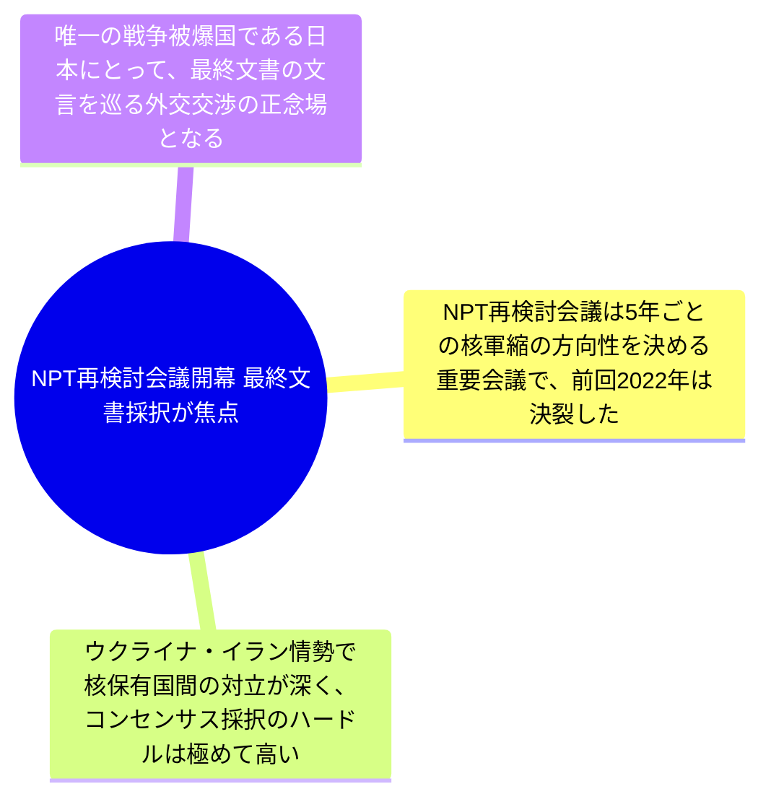
```mermaid
mindmap
  root((NPT再検討会議開幕 最終文書採択が焦点))
    NPT再検討会議は5年ごとの核軍縮の方向性を決める重要会議で、前回2022年は決裂した
    ウクライナ・イラン情勢で核保有国間の対立が深く、コンセンサス採択のハードルは極めて高い
    唯一の戦争被爆国である日本にとって、最終文書の文言を巡る外交交渉の正念場となる
```

---

## ロシアのウクライナ侵攻、25日の動向 `重要度: 高` `europe / global`
- **出典:** NHK 国際 ([原文](http://www3.nhk.or.jp/news/html/20260425/k10015082721000.html)) / **公開:** 2026-04-25 19:30

**要約**
ロシアによるウクライナへの軍事侵攻が継続しており、ウクライナ各地でロシア軍とウクライナ軍の戦闘が続いている。多くの市民が国外への避難を余儀なくされている。NHKは25日（日本時間）の戦闘状況や関係各国の外交動向を随時更新で伝えている。長期化する戦争は欧州の安全保障環境を恒常的に変容させつつある。

**背景**
ロシアの侵攻開始以降、戦闘は長期化しており欧州の安全保障環境を根本から揺さぶっている。直近では4月22日にNATOが東欧諸国への追加配備を協議し、21日にはロシアが北朝鮮との合同軍事演習をシベリア極東で発表するなど、ロシアと西側・アジアを横断した連動が進行している。本日の動きはこうした構図の中で、戦況と外交の双方が緊迫していることを示すものとなっている。

**要点**
- ウクライナ各地で戦闘が続き、人道危機が深刻化

- NATOは東欧への追加配備協議で対露抑止を強化

- ロシアと北朝鮮の軍事連携など欧亜の安保連動が進む

### 経緯タイムライン

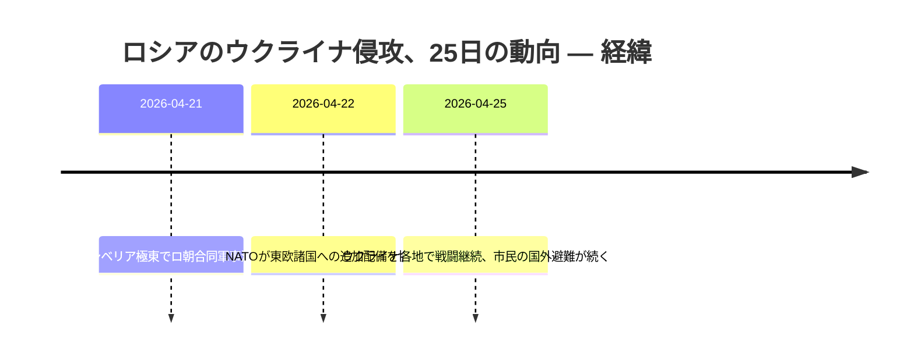
```mermaid
timeline
  title ロシアのウクライナ侵攻、25日の動向 — 経緯
  2026-04-21 : ロシア、シベリア極東でロ朝合同軍事演習を発表
  2026-04-22 : NATOが東欧諸国への追加配備を協議
  2026-04-25 : ウクライナ各地で戦闘継続、市民の国外避難が続く
```

### 当事者マップ

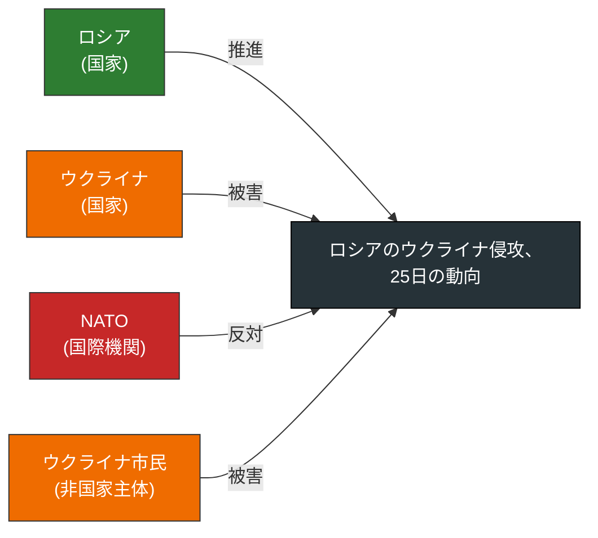
```mermaid
flowchart LR
  T["ロシアのウクライナ侵攻、25日の動向"]
  A0["ロシア\n(国家)"]
  A0 -- 推進 --> T
  style A0 fill:#2e7d32,color:#fff,stroke:#333
  A1["ウクライナ\n(国家)"]
  A1 -- 被害 --> T
  style A1 fill:#ef6c00,color:#fff,stroke:#333
  A2["NATO\n(国際機関)"]
  A2 -- 反対 --> T
  style A2 fill:#c62828,color:#fff,stroke:#333
  A3["ウクライナ市民\n(非国家主体)"]
  A3 -- 被害 --> T
  style A3 fill:#ef6c00,color:#fff,stroke:#333
  style T fill:#263238,color:#fff,stroke:#000
```

### 影響の広がり

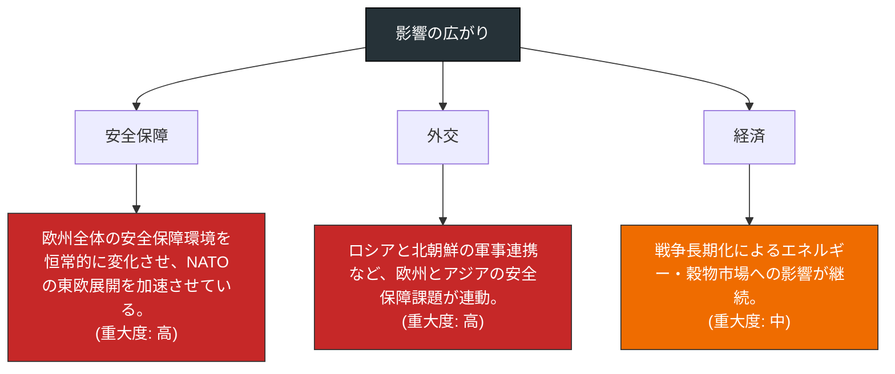
```mermaid
flowchart TB
  R["影響の広がり"]
  D0["安全保障"]
  I0["欧州全体の安全保障環境を恒常的に変化させ、NATOの東欧展開を加速させている。\n(重大度: 高)"]
  R --> D0 --> I0
  style I0 fill:#c62828,color:#fff,stroke:#333
  D1["外交"]
  I1["ロシアと北朝鮮の軍事連携など、欧州とアジアの安全保障課題が連動。\n(重大度: 高)"]
  R --> D1 --> I1
  style I1 fill:#c62828,color:#fff,stroke:#333
  D2["経済"]
  I2["戦争長期化によるエネルギー・穀物市場への影響が継続。\n(重大度: 中)"]
  R --> D2 --> I2
  style I2 fill:#ef6c00,color:#fff,stroke:#333
  style R fill:#263238,color:#fff,stroke:#000
```

### 当事者の関係ネットワーク

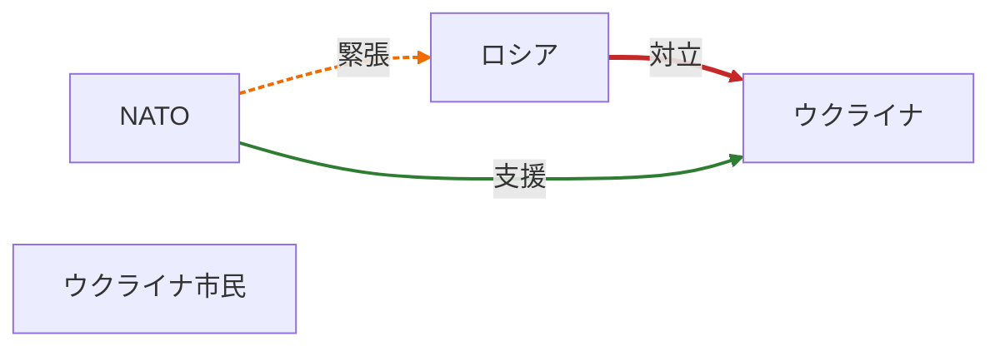
```mermaid
graph LR
  N0["ロシア"]
  N1["ウクライナ"]
  N2["NATO"]
  N3["ウクライナ市民"]
  N0 -->|対立| N1
  N2 -->|緊張| N0
  N2 -->|支援| N1
  linkStyle 0 stroke:#c62828,stroke-width:3px;
  linkStyle 1 stroke:#ef6c00,stroke-width:2px,stroke-dasharray:4 2;
  linkStyle 2 stroke:#2e7d32,stroke-width:2px;
```

### 押さえるべき論点

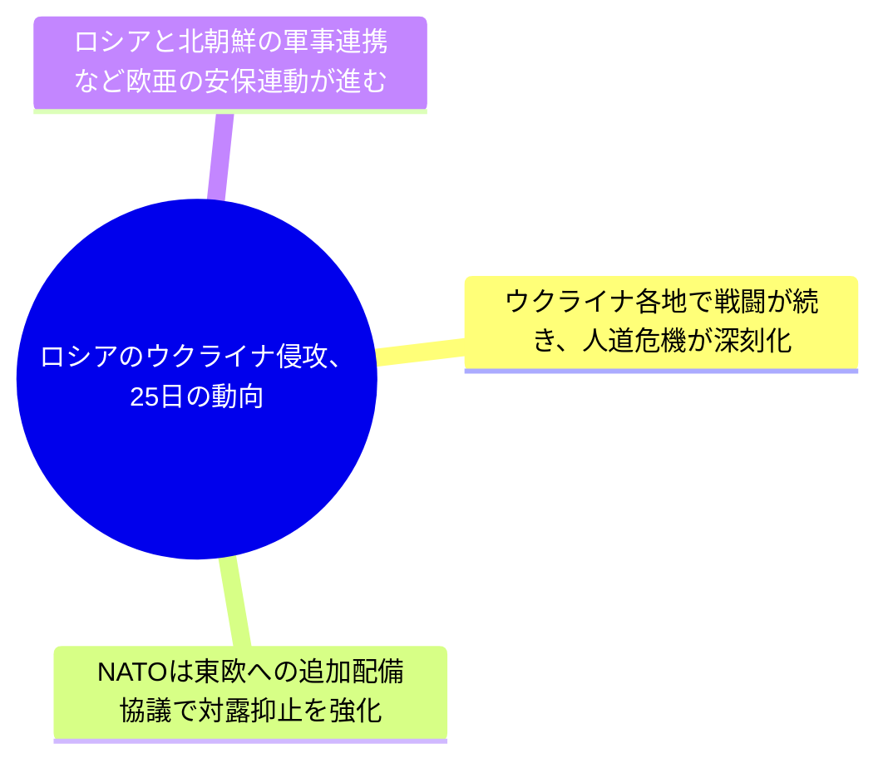
```mermaid
mindmap
  root((ロシアのウクライナ侵攻、25日の動向))
    ウクライナ各地で戦闘が続き、人道危機が深刻化
    NATOは東欧への追加配備協議で対露抑止を強化
    ロシアと北朝鮮の軍事連携など欧亜の安保連動が進む
```

---

## ロシアのウクライナ侵攻、4月26日の動き `重要度: 中` `europe / global`
- **出典:** NHK 国際 ([原文](http://www3.nhk.or.jp/news/html/20260426/k10015082731000.html)) / **公開:** 2026-04-26 19:59

**要約**
ロシアによるウクライナへの軍事侵攻が継続している。ウクライナ各地で両軍の戦闘が続き、多数の市民が国外へ避難する状況が続いている。NHKは26日（日本時間）の戦況や関係各国の外交動向を随時更新で伝えている。停戦の見通しは依然として立たず、長期化する戦争は欧州安全保障の最大の焦点となっている。

**背景**
ロシアのウクライナ侵攻は長期化し、欧州の安全保障を揺るがし続けている。直近ではNATOが東欧諸国への追加配備を協議し、ロシアの動向への警戒を強めているほか、ロシア自身もシベリア極東での朝鮮半島との合同軍事演習を発表するなど、欧州とアジアの安保情勢が連動する局面が続いている。本日の動きはこうした緊張の継続を示すものと位置づけられる。

**要点**
- ロシアのウクライナ侵攻は終結の見通しが立たず継続中

- 戦闘によって市民の国外避難が続き人道状況が深刻

- NATOの東欧追加配備協議など、欧州全体の安全保障に波及

### 経緯タイムライン

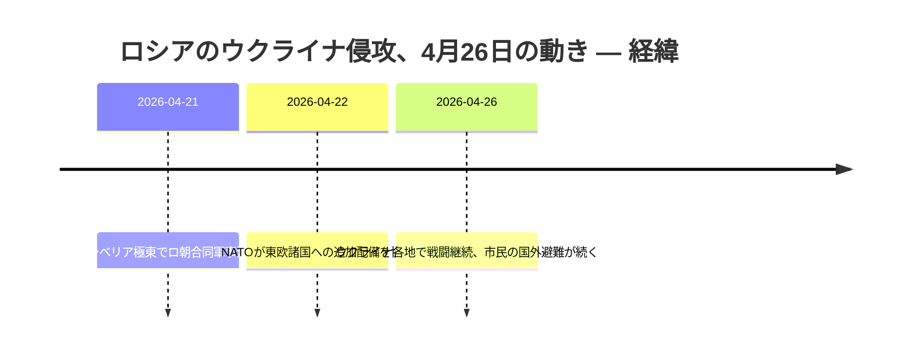
```mermaid
timeline
  title ロシアのウクライナ侵攻、4月26日の動き — 経緯
  2026-04-21 : ロシア、シベリア極東でロ朝合同軍事演習を発表
  2026-04-22 : NATOが東欧諸国への追加配備を協議
  2026-04-26 : ウクライナ各地で戦闘継続、市民の国外避難が続く
```

### 当事者マップ

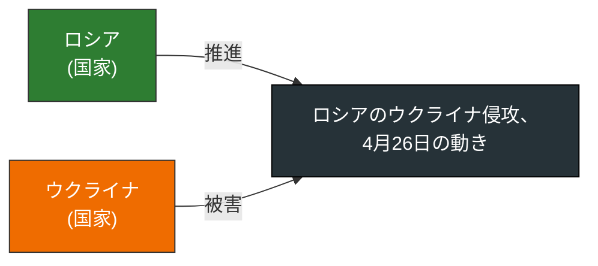
```mermaid
flowchart LR
  T["ロシアのウクライナ侵攻、4月26日の動き"]
  A0["ロシア\n(国家)"]
  A0 -- 推進 --> T
  style A0 fill:#2e7d32,color:#fff,stroke:#333
  A1["ウクライナ\n(国家)"]
  A1 -- 被害 --> T
  style A1 fill:#ef6c00,color:#fff,stroke:#333
  style T fill:#263238,color:#fff,stroke:#000
```

### 影響の広がり

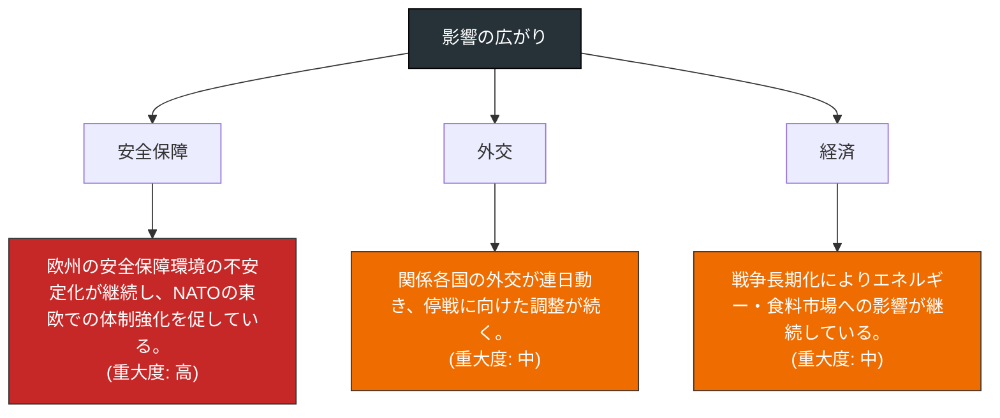
```mermaid
flowchart TB
  R["影響の広がり"]
  D0["安全保障"]
  I0["欧州の安全保障環境の不安定化が継続し、NATOの東欧での体制強化を促している。\n(重大度: 高)"]
  R --> D0 --> I0
  style I0 fill:#c62828,color:#fff,stroke:#333
  D1["外交"]
  I1["関係各国の外交が連日動き、停戦に向けた調整が続く。\n(重大度: 中)"]
  R --> D1 --> I1
  style I1 fill:#ef6c00,color:#fff,stroke:#333
  D2["経済"]
  I2["戦争長期化によりエネルギー・食料市場への影響が継続している。\n(重大度: 中)"]
  R --> D2 --> I2
  style I2 fill:#ef6c00,color:#fff,stroke:#333
  style R fill:#263238,color:#fff,stroke:#000
```

### 当事者の関係ネットワーク

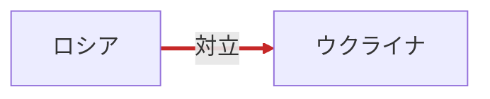
```mermaid
graph LR
  N0["ロシア"]
  N1["ウクライナ"]
  N0 -->|対立| N1
  linkStyle 0 stroke:#c62828,stroke-width:3px;
```

### 押さえるべき論点

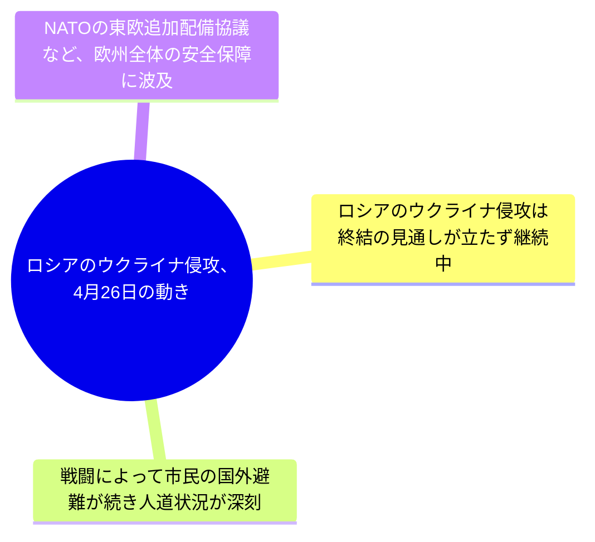
```mermaid
mindmap
  root((ロシアのウクライナ侵攻、4月26日の動き))
    ロシアのウクライナ侵攻は終結の見通しが立たず継続中
    戦闘によって市民の国外避難が続き人道状況が深刻
    NATOの東欧追加配備協議など、欧州全体の安全保障に波及
```

---

## ウクライナとアゼルバイジャン 防衛協力で一致 `重要度: 中` `europe`
- **出典:** NHK 国際 ([原文](http://www3.nhk.or.jp/news/html/20260426/k10015108481000.html)) / **公開:** 2026-04-26 09:36

**要約**
ウクライナのゼレンスキー大統領は25日、アゼルバイジャンの首都を訪問し、アリエフ大統領と会談した。両首脳は防衛分野を含む幅広い分野での協力強化で一致した。ロシアと対峙するウクライナにとって、旧ソ連圏の南カフカス地域での外交基盤強化は重要な意味を持つ。アゼルバイジャンはロシア・トルコ・イランに囲まれた地政学的要衝であり、ウクライナとの接近はロシアへの牽制ともなり得る。

**背景**
NATOが東欧への追加配備を協議するなどロシアへの警戒が続く中、ウクライナはエネルギー資源を持つアゼルバイジャンとの関係強化を図っている。アゼルバイジャンは伝統的にロシアと一定の関係を保ちつつもトルコと緊密で、近年はウクライナ復興支援にも関与している。

**要点**
- ウクライナとアゼルバイジャンが防衛協力推進で一致

- 旧ソ連圏でウクライナが外交的足場を拡大、ロシアへの間接的牽制

- 南カフカスのエネルギー大国との連携は欧州のエネルギー安全保障にも関連

### 経緯タイムライン

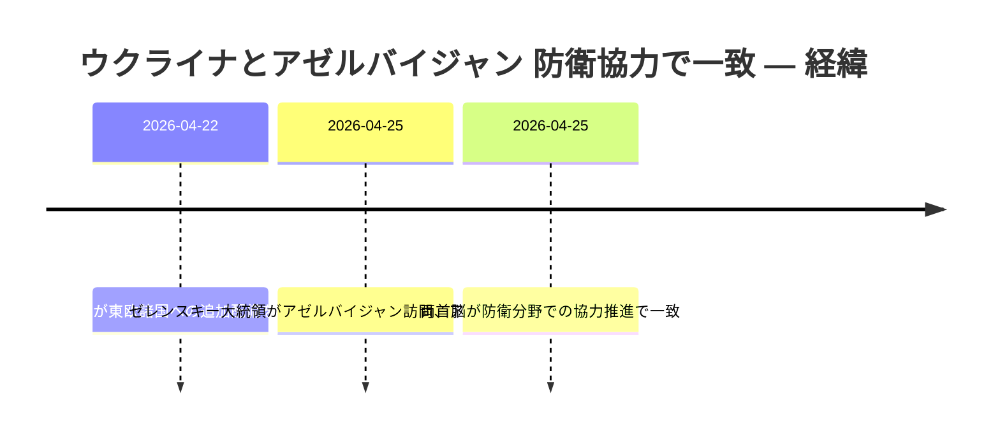
```mermaid
timeline
  title ウクライナとアゼルバイジャン 防衛協力で一致 — 経緯
  2026-04-22 : NATOが東欧諸国への追加配備を協議
  2026-04-25 : ゼレンスキー大統領がアゼルバイジャン訪問、アリエフ大統領と会談
  2026-04-25 : 両首脳が防衛分野での協力推進で一致
```

### 当事者マップ

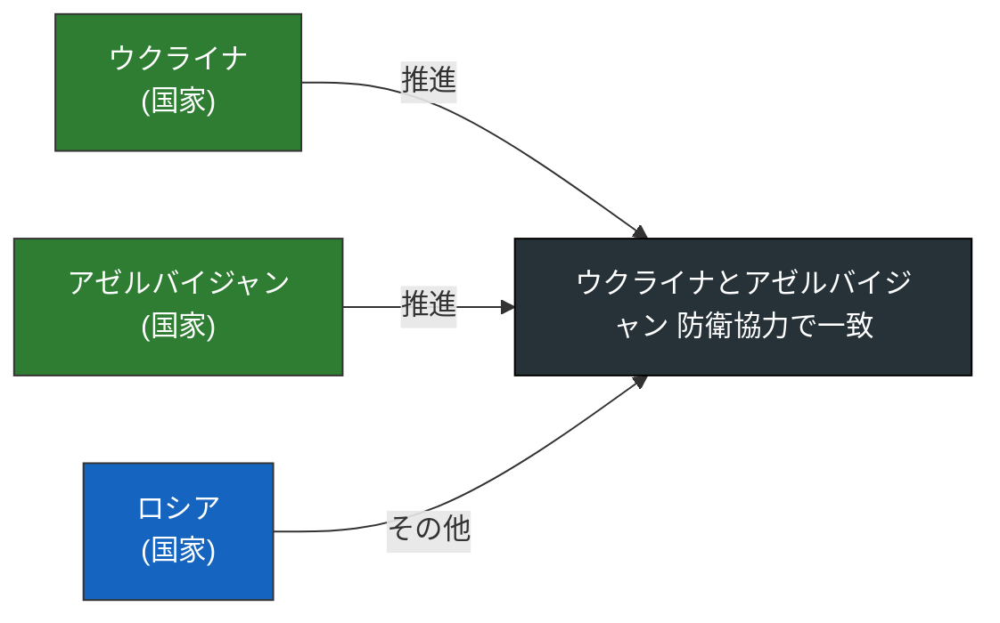
```mermaid
flowchart LR
  T["ウクライナとアゼルバイジャン 防衛協力で一致"]
  A0["ウクライナ\n(国家)"]
  A0 -- 推進 --> T
  style A0 fill:#2e7d32,color:#fff,stroke:#333
  A1["アゼルバイジャン\n(国家)"]
  A1 -- 推進 --> T
  style A1 fill:#2e7d32,color:#fff,stroke:#333
  A2["ロシア\n(国家)"]
  A2 -- その他 --> T
  style A2 fill:#1565c0,color:#fff,stroke:#333
  style T fill:#263238,color:#fff,stroke:#000
```

### 影響の広がり

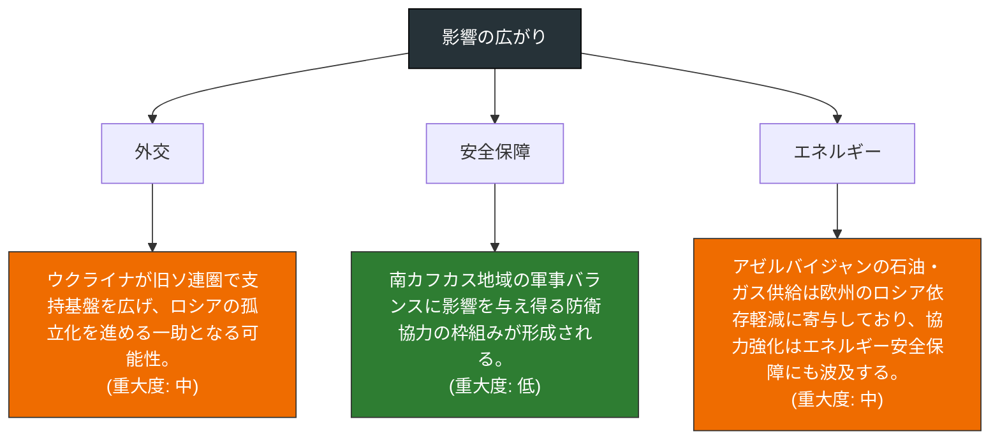
```mermaid
flowchart TB
  R["影響の広がり"]
  D0["外交"]
  I0["ウクライナが旧ソ連圏で支持基盤を広げ、ロシアの孤立化を進める一助となる可能性。\n(重大度: 中)"]
  R --> D0 --> I0
  style I0 fill:#ef6c00,color:#fff,stroke:#333
  D1["安全保障"]
  I1["南カフカス地域の軍事バランスに影響を与え得る防衛協力の枠組みが形成される。\n(重大度: 低)"]
  R --> D1 --> I1
  style I1 fill:#2e7d32,color:#fff,stroke:#333
  D2["エネルギー"]
  I2["アゼルバイジャンの石油・ガス供給は欧州のロシア依存軽減に寄与しており、協力強化はエネルギー安全保障にも波及する。\n(重大度: 中)"]
  R --> D2 --> I2
  style I2 fill:#ef6c00,color:#fff,stroke:#333
  style R fill:#263238,color:#fff,stroke:#000
```

### 当事者の関係ネットワーク

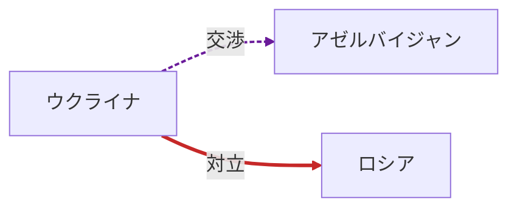
```mermaid
graph LR
  N0["ウクライナ"]
  N1["アゼルバイジャン"]
  N2["ロシア"]
  N0 -->|交渉| N1
  N0 -->|対立| N2
  linkStyle 0 stroke:#6a1b9a,stroke-width:2px,stroke-dasharray:4 2;
  linkStyle 1 stroke:#c62828,stroke-width:3px;
```

### 押さえるべき論点

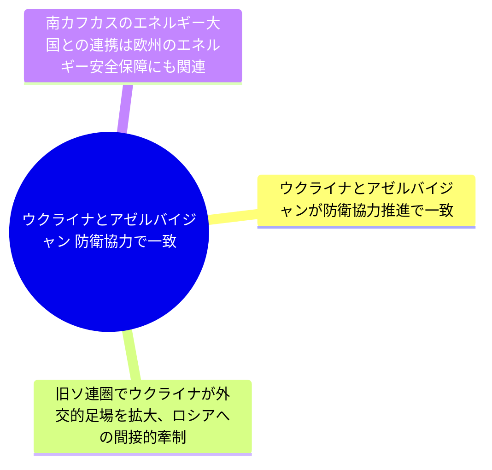
```mermaid
mindmap
  root((ウクライナとアゼルバイジャン 防衛協力で一致))
    ウクライナとアゼルバイジャンが防衛協力推進で一致
    旧ソ連圏でウクライナが外交的足場を拡大、ロシアへの間接的牽制
    南カフカスのエネルギー大国との連携は欧州のエネルギー安全保障にも関連
```

---

## ウクライナ、サウジと防衛協力協議 `重要度: 中` `middle_east / europe`
- **出典:** NHK 国際 ([原文](http://www3.nhk.or.jp/news/html/20260425/k10015108291000.html)) / **公開:** 2026-04-25 19:31

**要約**
ウクライナのゼレンスキー大統領は24日、サウジアラビアを訪問しムハンマド皇太子と会談した。会談では無人機対策を含む防衛協力の推進に意欲を示した。中東の有力国であるサウジとの関係深化を通じ、ロシアとの戦争が長期化する中での支援基盤拡大と、和平仲介役としてのサウジの役割確保を狙う動きとみられる。

**背景**
ウクライナはロシアの侵攻が長期化する中、欧米以外の支援先確保を急いでいる。サウジは過去にも捕虜交換や和平協議の仲介役を担ってきた経緯がある。直近では中東でイランによる英タンカー拿捕や紅海周辺の海運リスク上昇など緊張が高まっており、無人機対策のノウハウを持つウクライナと湾岸産油国の利害が一致しやすい局面にある。

**要点**
- ゼレンスキー大統領がサウジで皇太子と会談し、防衛協力に意欲を示した

- 焦点は実戦経験豊富なウクライナの無人機対策技術の共有

- 中東の海上緊張が高まる中、ウクライナと湾岸国の安全保障上の利害が接近している

### 経緯タイムライン

```mermaid
timeline
  title ウクライナ、サウジと防衛協力協議 — 経緯
  2026-04-20 : イランがホルムズ海峡で英タンカー一時拿捕、中東の海上緊張が高まる
  2026-04-22 : 中東原油輸送路で海運会社が航路回避、保険料急騰
  2026-04-24 : ゼレンスキー大統領がサウジ訪問、ムハンマド皇太子と会談
  2026-04-25 : 無人機対策を含む防衛協力推進の意欲を表明
```

### 当事者マップ

```mermaid
flowchart LR
  T["ウクライナ、サウジと防衛協力協議"]
  A0["ウクライナ(ゼレンスキー大統領)\n(国家)"]
  A0 -- 推進 --> T
  style A0 fill:#2e7d32,color:#fff,stroke:#333
  A1["サウジアラビア(ムハンマド皇太子)\n(国家)"]
  A1 -- 中立 --> T
  style A1 fill:#616161,color:#fff,stroke:#333
  A2["ロシア\n(国家)"]
  A2 -- その他 --> T
  style A2 fill:#1565c0,color:#fff,stroke:#333
  style T fill:#263238,color:#fff,stroke:#000
```

### 影響の広がり

```mermaid
flowchart TB
  R["影響の広がり"]
  D0["安全保障"]
  I0["中東地域における対ドローン能力の底上げにつながり、紅海・ホルムズ海峡情勢にも影響しうる。\n(重大度: 中)"]
  R --> D0 --> I0
  style I0 fill:#ef6c00,color:#fff,stroke:#333
  D1["外交"]
  I1["ウクライナが非欧米諸国との関係多角化を進め、ロシアの外交的孤立化を補強する可能性。\n(重大度: 中)"]
  R --> D1 --> I1
  style I1 fill:#ef6c00,color:#fff,stroke:#333
  D2["技術"]
  I2["実戦経験を踏まえた無人機・対無人機技術の輸出・共同開発の可能性。\n(重大度: 中)"]
  R --> D2 --> I2
  style I2 fill:#ef6c00,color:#fff,stroke:#333
  style R fill:#263238,color:#fff,stroke:#000
```

### 当事者の関係ネットワーク

```mermaid
graph LR
  N0["ウクライナ(ゼレンスキー大統領)"]
  N1["サウジアラビア(ムハンマド皇太子)"]
  N2["ロシア"]
  N0 -->|交渉| N1
  N0 -->|対立| N2
  linkStyle 0 stroke:#6a1b9a,stroke-width:2px,stroke-dasharray:4 2;
  linkStyle 1 stroke:#c62828,stroke-width:3px;
```

### 押さえるべき論点

```mermaid
mindmap
  root((ウクライナ、サウジと防衛協力協議))
    ゼレンスキー大統領がサウジで皇太子と会談し、防衛協力に意欲を示した
    焦点は実戦経験豊富なウクライナの無人機対策技術の共有
    中東の海上緊張が高まる中、ウクライナと湾岸国の安全保障上の利害が接近している
```

---
