# 地政学ニュース図解レポート 2026-04-28 号

生成日時: 2026-04-28 07:50 / 記事数: 5

## 📌 本日の要点

- **ウクライナ侵攻続く 27日の動向** — ロシアによるウクライナへの軍事侵攻が27日も続いている。

- **NPT再検討会議開幕 最終文書採択が焦点** — 核拡散防止条約(NPT)の再検討会議が日本時間27日深夜、ニューヨークの国連本部で開幕する。

- **ロシアのウクライナ侵攻、4月26日の動き** — ロシアによるウクライナへの軍事侵攻が継続している。

## ウクライナ侵攻続く 27日の動向 `重要度: 高` `europe / global`
- **出典:** NHK 国際 ([原文](http://www3.nhk.or.jp/news/html/20260427/k10015082741000.html)) / **公開:** 2026-04-27 17:27

**要約**
ロシアによるウクライナへの軍事侵攻が27日も続いている。ウクライナ各地でロシア軍とウクライナ軍の戦闘が続き、多数の市民が国外への避難を余儀なくされている。NHKは戦闘状況や関係各国の外交動向を随時更新で伝えている。戦況の長期化に伴い、人道危機と国際秩序への影響が深刻化している。

**背景**
ロシアのウクライナ侵攻は長期化し、欧州の安全保障環境を大きく変容させている。直近ではNATOが東欧諸国への追加配備を協議し、ロシアはシベリア極東で北朝鮮との合同軍事演習を発表するなど、緊張は欧州だけでなくアジアにも波及している。今回の更新はこうした多面的な情勢の中での最新動向を伝えるものである。

**要点**
- ウクライナ各地で戦闘が続き、市民の避難が継続している

- NATOは東欧での配備強化を進め、対露抑止を強める動き

- ロ朝接近など戦争の影響は欧州を越えて拡大しつつある

### 経緯タイムライン

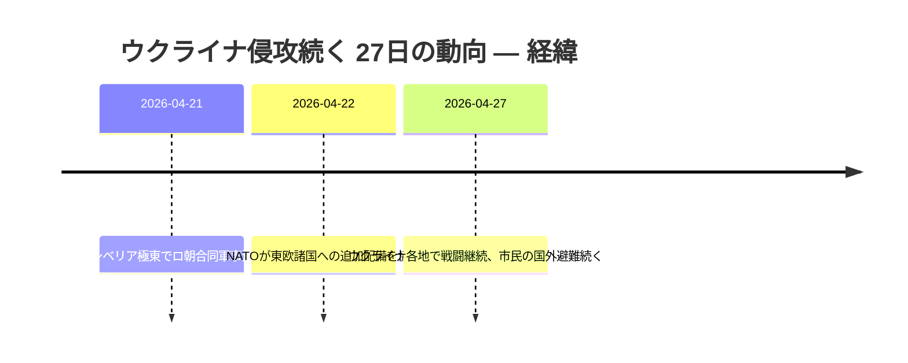
```mermaid
timeline
  title ウクライナ侵攻続く 27日の動向 — 経緯
  2026-04-21 : ロシアがシベリア極東でロ朝合同軍事演習を発表
  2026-04-22 : NATOが東欧諸国への追加配備を協議
  2026-04-27 : ウクライナ各地で戦闘継続、市民の国外避難続く
```

### 当事者マップ

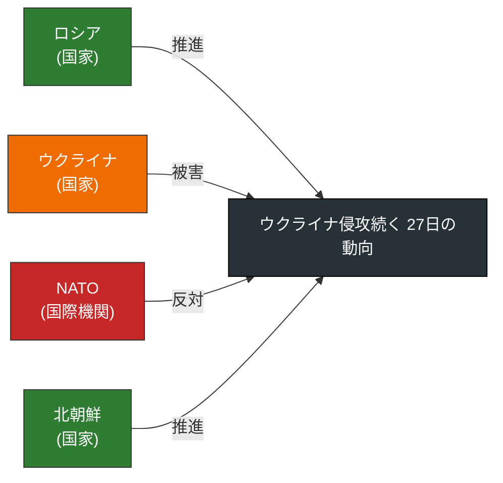
```mermaid
flowchart LR
  T["ウクライナ侵攻続く 27日の動向"]
  A0["ロシア\n(国家)"]
  A0 -- 推進 --> T
  style A0 fill:#2e7d32,color:#fff,stroke:#333
  A1["ウクライナ\n(国家)"]
  A1 -- 被害 --> T
  style A1 fill:#ef6c00,color:#fff,stroke:#333
  A2["NATO\n(国際機関)"]
  A2 -- 反対 --> T
  style A2 fill:#c62828,color:#fff,stroke:#333
  A3["北朝鮮\n(国家)"]
  A3 -- 推進 --> T
  style A3 fill:#2e7d32,color:#fff,stroke:#333
  style T fill:#263238,color:#fff,stroke:#000
```

### 影響の広がり

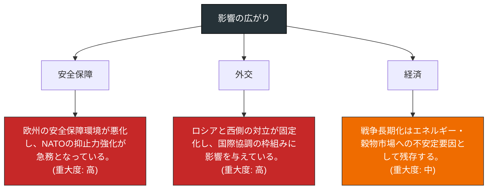
```mermaid
flowchart TB
  R["影響の広がり"]
  D0["安全保障"]
  I0["欧州の安全保障環境が悪化し、NATOの抑止力強化が急務となっている。\n(重大度: 高)"]
  R --> D0 --> I0
  style I0 fill:#c62828,color:#fff,stroke:#333
  D1["外交"]
  I1["ロシアと西側の対立が固定化し、国際協調の枠組みに影響を与えている。\n(重大度: 高)"]
  R --> D1 --> I1
  style I1 fill:#c62828,color:#fff,stroke:#333
  D2["経済"]
  I2["戦争長期化はエネルギー・穀物市場への不安定要因として残存する。\n(重大度: 中)"]
  R --> D2 --> I2
  style I2 fill:#ef6c00,color:#fff,stroke:#333
  style R fill:#263238,color:#fff,stroke:#000
```

### 当事者の関係ネットワーク

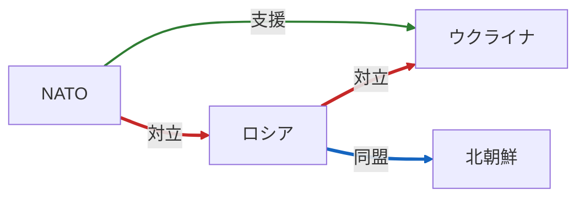
```mermaid
graph LR
  N0["ロシア"]
  N1["ウクライナ"]
  N2["NATO"]
  N3["北朝鮮"]
  N0 -->|対立| N1
  N2 -->|対立| N0
  N2 -->|支援| N1
  N0 -->|同盟| N3
  linkStyle 0 stroke:#c62828,stroke-width:3px;
  linkStyle 1 stroke:#c62828,stroke-width:3px;
  linkStyle 2 stroke:#2e7d32,stroke-width:2px;
  linkStyle 3 stroke:#1565c0,stroke-width:3px;
```

### 押さえるべき論点

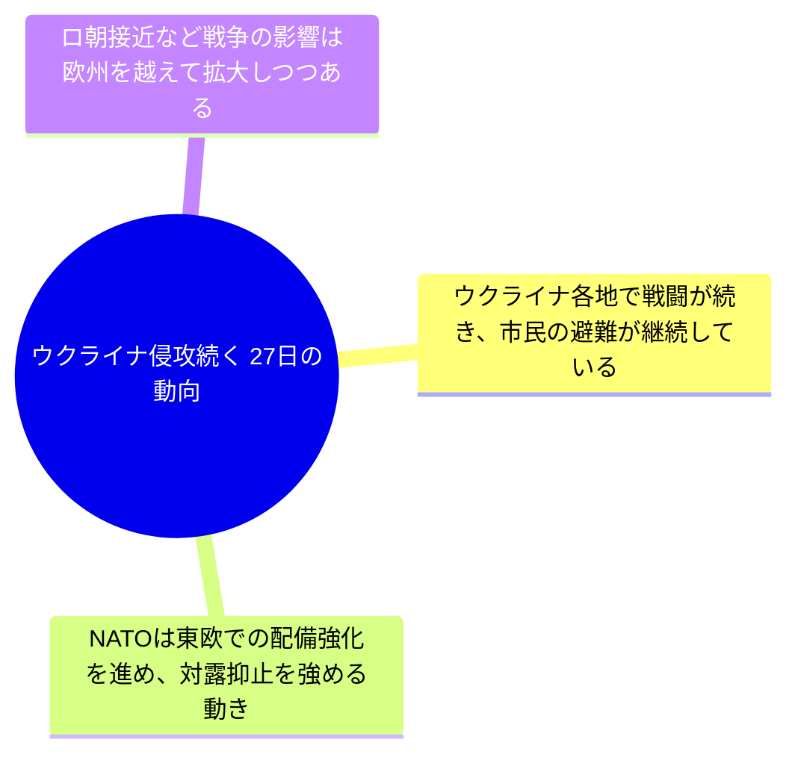
```mermaid
mindmap
  root((ウクライナ侵攻続く 27日の動向))
    ウクライナ各地で戦闘が続き、市民の避難が継続している
    NATOは東欧での配備強化を進め、対露抑止を強める動き
    ロ朝接近など戦争の影響は欧州を越えて拡大しつつある
```

---

## NPT再検討会議開幕 最終文書採択が焦点 `重要度: 高` `global / middle_east / europe / east_asia`
- **出典:** NHK 国際 ([原文](http://www3.nhk.or.jp/news/html/20260427/k10015108791000.html)) / **公開:** 2026-04-27 16:06

**要約**
核拡散防止条約(NPT)の再検討会議が日本時間27日深夜、ニューヨークの国連本部で開幕する。世界の核軍縮の方向性を議論する場だが、イラン核問題やウクライナ戦争を背景に各国の対立が深まっている。核軍縮に逆行する動きが相次ぐなか、国際社会が一致して「最終文書」を採択できるかが最大の焦点となる。前回2022年の再検討会議はロシアの反対で最終文書採択に失敗しており、2回連続の決裂が懸念されている。

**背景**
NPTは5年ごとに再検討会議が開かれ、核保有国と非保有国の対話の場となってきた。直近ではロシアによるウクライナ侵攻と核威嚇、イランのウラン濃縮度引き上げ(60%)、北朝鮮の核・ミサイル開発加速、米中対立など核秩序を揺るがす要因が累積。過去1週間でも台湾海峡での中国軍演習拡大、NATO東欧追加配備、ロ朝合同軍事演習発表など、大国間の軍事的緊張が高まる中での開幕となる。

**要点**
- NPT再検討会議は5年に1度の核軍縮の節目で、最終文書採択は全会一致が原則

- 前回2022年はロシアの反対で決裂しており、2回連続の失敗となればNPT体制の信頼性が深刻に損なわれる

- イラン核問題、ロシアの核威嚇、北朝鮮の核開発が同時進行し、合意形成の難度は過去最高水準

- 唯一の戦争被爆国である日本の橋渡し外交が試される場面

### 経緯タイムライン

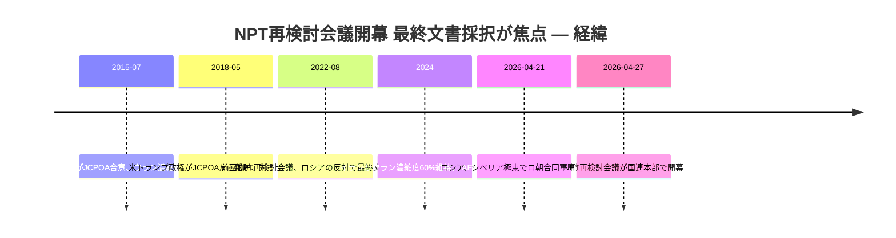
```mermaid
timeline
  title NPT再検討会議開幕 最終文書採択が焦点 — 経緯
  2015-07 : イランとP5+1がJCPOA合意、ウラン濃縮を3.67%に制限
  2018-05 : 米トランプ政権がJCPOAから離脱、対イラン制裁復活
  2022-08 : 前回NPT再検討会議、ロシアの反対で最終文書採択に失敗
  2024 : イランがウラン濃縮度60%維持、IAEA協力後退
  2026-04-21 : ロシア、シベリア極東でロ朝合同軍事演習発表
  2026-04-27 : NPT再検討会議が国連本部で開幕
```

### 当事者マップ

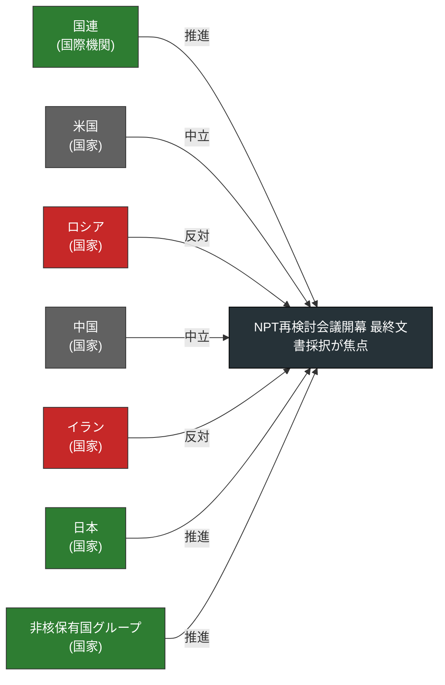
```mermaid
flowchart LR
  T["NPT再検討会議開幕 最終文書採択が焦点"]
  A0["国連\n(国際機関)"]
  A0 -- 推進 --> T
  style A0 fill:#2e7d32,color:#fff,stroke:#333
  A1["米国\n(国家)"]
  A1 -- 中立 --> T
  style A1 fill:#616161,color:#fff,stroke:#333
  A2["ロシア\n(国家)"]
  A2 -- 反対 --> T
  style A2 fill:#c62828,color:#fff,stroke:#333
  A3["中国\n(国家)"]
  A3 -- 中立 --> T
  style A3 fill:#616161,color:#fff,stroke:#333
  A4["イラン\n(国家)"]
  A4 -- 反対 --> T
  style A4 fill:#c62828,color:#fff,stroke:#333
  A5["日本\n(国家)"]
  A5 -- 推進 --> T
  style A5 fill:#2e7d32,color:#fff,stroke:#333
  A6["非核保有国グループ\n(国家)"]
  A6 -- 推進 --> T
  style A6 fill:#2e7d32,color:#fff,stroke:#333
  style T fill:#263238,color:#fff,stroke:#000
```

### 影響の広がり

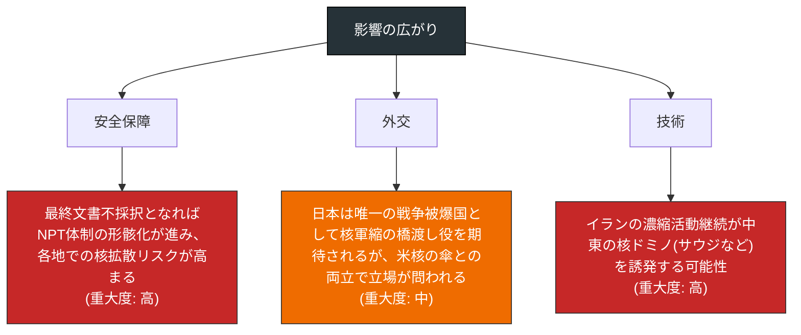
```mermaid
flowchart TB
  R["影響の広がり"]
  D0["安全保障"]
  I0["最終文書不採択となればNPT体制の形骸化が進み、各地での核拡散リスクが高まる\n(重大度: 高)"]
  R --> D0 --> I0
  style I0 fill:#c62828,color:#fff,stroke:#333
  D1["外交"]
  I1["日本は唯一の戦争被爆国として核軍縮の橋渡し役を期待されるが、米核の傘との両立で立場が問われる\n(重大度: 中)"]
  R --> D1 --> I1
  style I1 fill:#ef6c00,color:#fff,stroke:#333
  D2["技術"]
  I2["イランの濃縮活動継続が中東の核ドミノ(サウジなど)を誘発する可能性\n(重大度: 高)"]
  R --> D2 --> I2
  style I2 fill:#c62828,color:#fff,stroke:#333
  style R fill:#263238,color:#fff,stroke:#000
```

### 当事者の関係ネットワーク

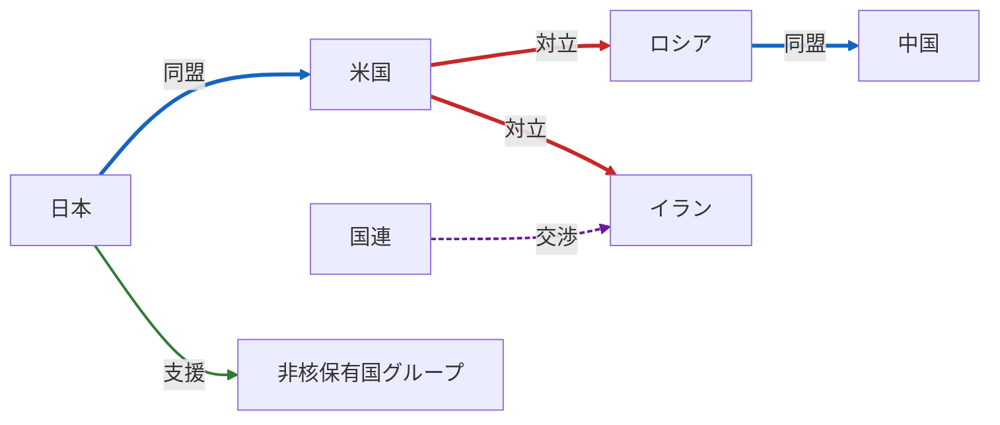
```mermaid
graph LR
  N0["国連"]
  N1["米国"]
  N2["ロシア"]
  N3["中国"]
  N4["イラン"]
  N5["日本"]
  N6["非核保有国グループ"]
  N1 -->|対立| N2
  N1 -->|対立| N4
  N2 -->|同盟| N3
  N5 -->|同盟| N1
  N5 -->|支援| N6
  N0 -->|交渉| N4
  linkStyle 0 stroke:#c62828,stroke-width:3px;
  linkStyle 1 stroke:#c62828,stroke-width:3px;
  linkStyle 2 stroke:#1565c0,stroke-width:3px;
  linkStyle 3 stroke:#1565c0,stroke-width:3px;
  linkStyle 4 stroke:#2e7d32,stroke-width:2px;
  linkStyle 5 stroke:#6a1b9a,stroke-width:2px,stroke-dasharray:4 2;
```

### 押さえるべき論点

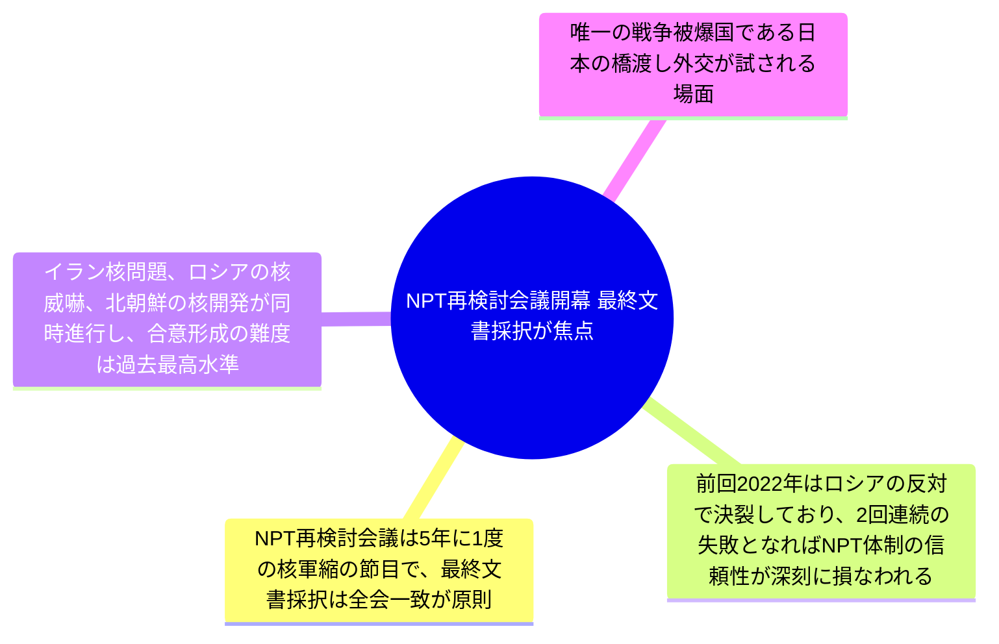
```mermaid
mindmap
  root((NPT再検討会議開幕 最終文書採択が焦点))
    NPT再検討会議は5年に1度の核軍縮の節目で、最終文書採択は全会一致が原則
    前回2022年はロシアの反対で決裂しており、2回連続の失敗となればNPT体制の信頼性が深刻に損なわれる
    イラン核問題、ロシアの核威嚇、北朝鮮の核開発が同時進行し、合意形成の難度は過去最高水準
    唯一の戦争被爆国である日本の橋渡し外交が試される場面
```

---

## ロシアのウクライナ侵攻、4月26日の動き `重要度: 高` `europe / global`
- **出典:** NHK 国際 ([原文](http://www3.nhk.or.jp/news/html/20260426/k10015082731000.html)) / **公開:** 2026-04-26 19:59

**要約**
ロシアによるウクライナへの軍事侵攻が継続している。ウクライナ各地でロシア軍とウクライナ軍の戦闘が続き、多数の市民が国外への避難を余儀なくされている。NHKは戦況や関係各国の外交動向など、26日のウクライナ情勢を随時更新で伝えている。日本とウクライナ、およびロシア・モスクワとは6時間の時差がある。

**背景**
ロシアのウクライナ侵攻は長期化しており、欧州の安全保障環境を根底から揺さぶり続けている。直近ではNATOが東欧諸国への追加配備を協議し、ロシアはシベリア極東で北朝鮮との合同軍事演習を発表するなど、欧州とアジアにまたがる連動が顕著になっている。本記事はそうした流れの中での26日時点の戦況・外交アップデートに当たる。

**要点**
- ウクライナ各地で戦闘が継続し、停戦の兆しは見えない

- 市民の国外避難が続き、人道危機が深刻化している

- NATOの東欧追加配備やロ朝合同演習など、ロシアを巡る外交・軍事動向が欧州とアジアで連動している

### 経緯タイムライン

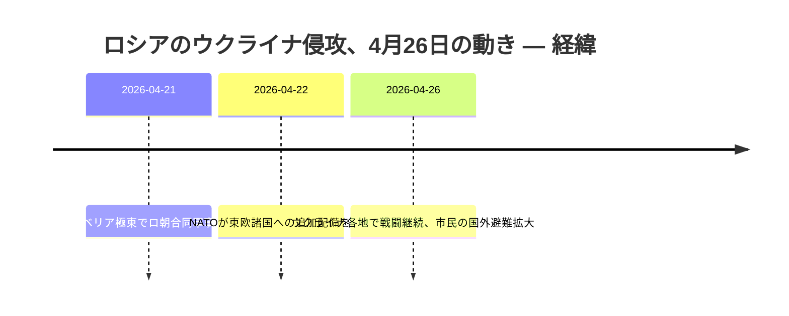
```mermaid
timeline
  title ロシアのウクライナ侵攻、4月26日の動き — 経緯
  2026-04-21 : ロシア、シベリア極東でロ朝合同軍事演習を発表
  2026-04-22 : NATOが東欧諸国への追加配備を協議
  2026-04-26 : ウクライナ各地で戦闘継続、市民の国外避難拡大
```

### 当事者マップ

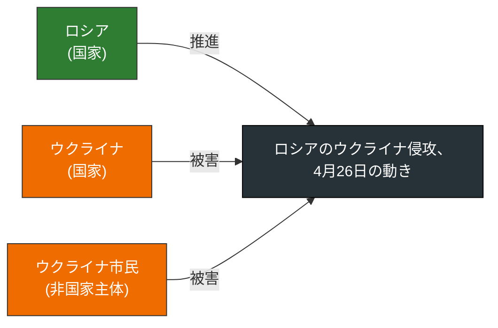
```mermaid
flowchart LR
  T["ロシアのウクライナ侵攻、4月26日の動き"]
  A0["ロシア\n(国家)"]
  A0 -- 推進 --> T
  style A0 fill:#2e7d32,color:#fff,stroke:#333
  A1["ウクライナ\n(国家)"]
  A1 -- 被害 --> T
  style A1 fill:#ef6c00,color:#fff,stroke:#333
  A2["ウクライナ市民\n(非国家主体)"]
  A2 -- 被害 --> T
  style A2 fill:#ef6c00,color:#fff,stroke:#333
  style T fill:#263238,color:#fff,stroke:#000
```

### 影響の広がり

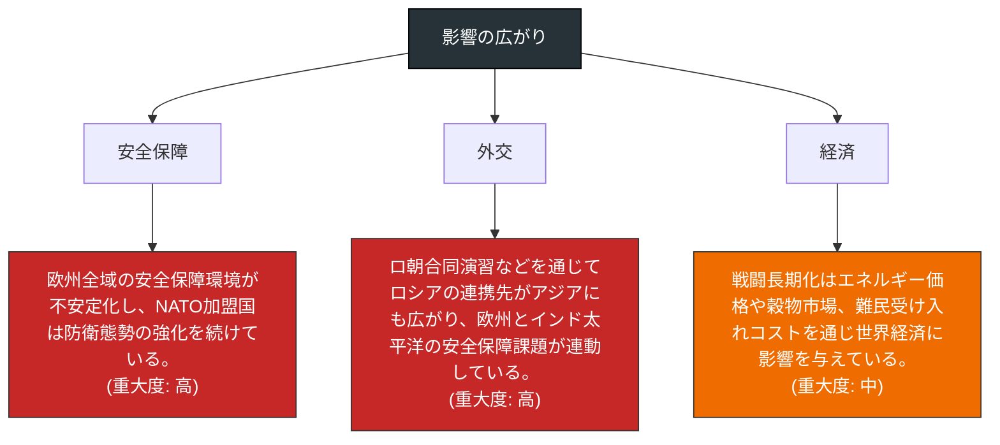
```mermaid
flowchart TB
  R["影響の広がり"]
  D0["安全保障"]
  I0["欧州全域の安全保障環境が不安定化し、NATO加盟国は防衛態勢の強化を続けている。\n(重大度: 高)"]
  R --> D0 --> I0
  style I0 fill:#c62828,color:#fff,stroke:#333
  D1["外交"]
  I1["ロ朝合同演習などを通じてロシアの連携先がアジアにも広がり、欧州とインド太平洋の安全保障課題が連動している。\n(重大度: 高)"]
  R --> D1 --> I1
  style I1 fill:#c62828,color:#fff,stroke:#333
  D2["経済"]
  I2["戦闘長期化はエネルギー価格や穀物市場、難民受け入れコストを通じ世界経済に影響を与えている。\n(重大度: 中)"]
  R --> D2 --> I2
  style I2 fill:#ef6c00,color:#fff,stroke:#333
  style R fill:#263238,color:#fff,stroke:#000
```

### 当事者の関係ネットワーク

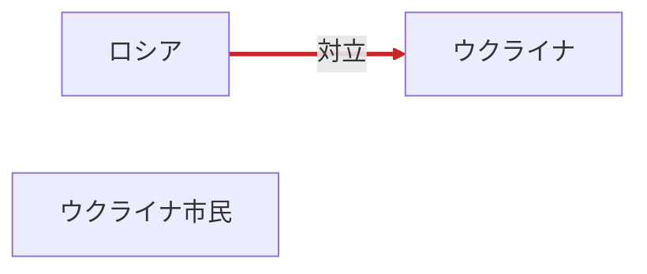
```mermaid
graph LR
  N0["ロシア"]
  N1["ウクライナ"]
  N2["ウクライナ市民"]
  N0 -->|対立| N1
  linkStyle 0 stroke:#c62828,stroke-width:3px;
```

### 押さえるべき論点

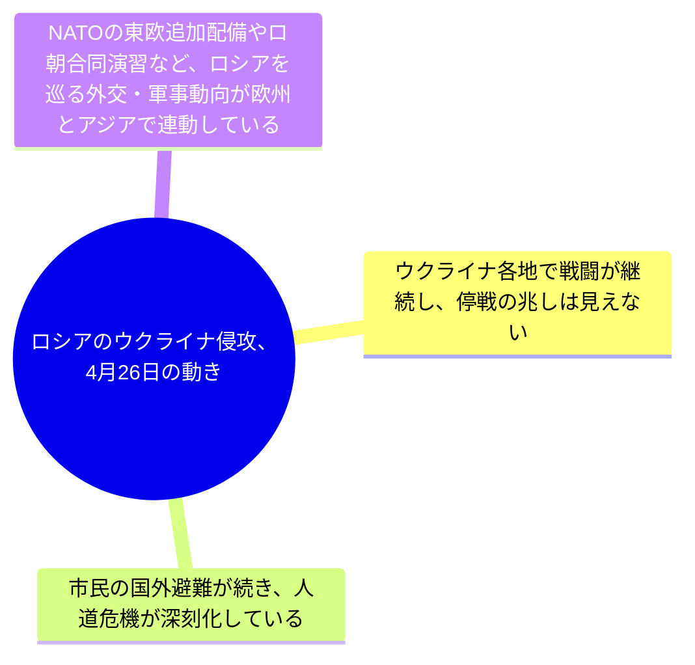
```mermaid
mindmap
  root((ロシアのウクライナ侵攻、4月26日の動き))
    ウクライナ各地で戦闘が継続し、停戦の兆しは見えない
    市民の国外避難が続き、人道危機が深刻化している
    NATOの東欧追加配備やロ朝合同演習など、ロシアを巡る外交・軍事動向が欧州とアジアで連動している
```

---

## ユニセフ、中東の子ども犠牲増に警鐘 `重要度: 中` `middle_east / global`
- **出典:** NHK 国際 ([原文](http://www3.nhk.or.jp/news/html/20260427/k10015109411000.html)) / **公開:** 2026-04-27 21:04

**要約**
ユニセフは、米国とイスラエルによるイランへの軍事作戦開始から2か月で、戦闘に巻き込まれて死亡した子どもがイランで220人以上、レバノンで170人以上にのぼると発表しました。各国からの報告に基づく集計で、子どもの犠牲が急増している実態が浮き彫りになりました。ユニセフ事務局長は「戦争で甚大な影響を受けるのはいつも子どもたち」と述べ、恒久的停戦の即時実現を訴えています。人道危機の深刻化は国際社会の調停圧力を高める可能性があります。

**背景**
2026年初頭以降、米国とイスラエルがイランの核関連施設等に対する軍事作戦を本格化させ、イラン本土およびイランが支援するレバノンのヒズボラ拠点周辺への攻撃が続いてきました。2024年のヒズボラ幹部殺害以降の流れを引き継ぎ、戦線はイラン本土とレバノンの双方に拡大。過去1週間でも中東原油輸送路の海運会社が航路回避に動き保険料が急騰するなど、紛争の余波がエネルギー・物流面に波及しており、人道面の悪化が改めて国際的な注目を集めています。

**要点**
- 米イスラエルのイラン作戦開始から2か月で子どもの犠牲はイラン220人超、レバノン170人超

- ユニセフが恒久停戦を強く要請、国際人道法遵守への圧力が高まる

- 戦闘長期化は中東のエネルギー輸送路を不安定化させ、日本のエネルギー安全保障にも波及

### 経緯タイムライン

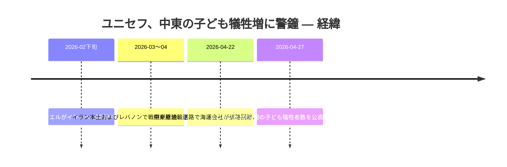
```mermaid
timeline
  title ユニセフ、中東の子ども犠牲増に警鐘 — 経緯
  2026-02下旬 : 米国とイスラエルがイランへの軍事作戦を本格開始
  2026-03〜04 : イラン本土およびレバノンで戦闘が継続、子どもの犠牲増加
  2026-04-22 : 中東原油輸送路で海運会社が航路回避、保険料急騰
  2026-04-27 : ユニセフが2か月間の子ども犠牲者数を公表、恒久停戦を訴え
```

### 当事者マップ

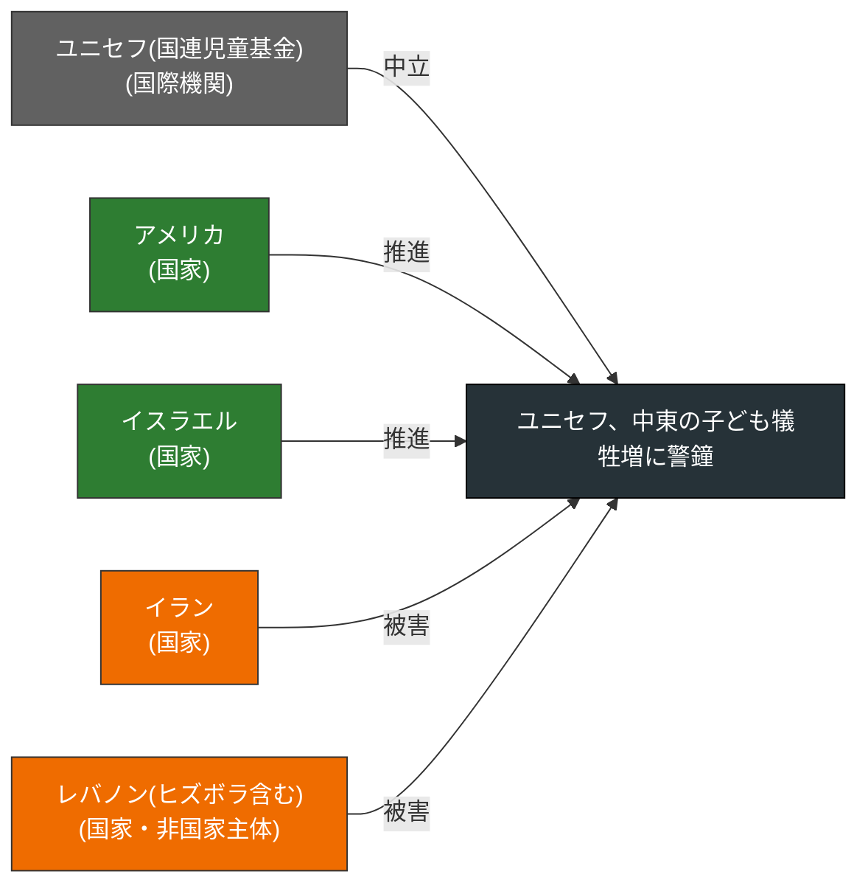
```mermaid
flowchart LR
  T["ユニセフ、中東の子ども犠牲増に警鐘"]
  A0["ユニセフ(国連児童基金)\n(国際機関)"]
  A0 -- 中立 --> T
  style A0 fill:#616161,color:#fff,stroke:#333
  A1["アメリカ\n(国家)"]
  A1 -- 推進 --> T
  style A1 fill:#2e7d32,color:#fff,stroke:#333
  A2["イスラエル\n(国家)"]
  A2 -- 推進 --> T
  style A2 fill:#2e7d32,color:#fff,stroke:#333
  A3["イラン\n(国家)"]
  A3 -- 被害 --> T
  style A3 fill:#ef6c00,color:#fff,stroke:#333
  A4["レバノン(ヒズボラ含む)\n(国家・非国家主体)"]
  A4 -- 被害 --> T
  style A4 fill:#ef6c00,color:#fff,stroke:#333
  style T fill:#263238,color:#fff,stroke:#000
```

### 影響の広がり

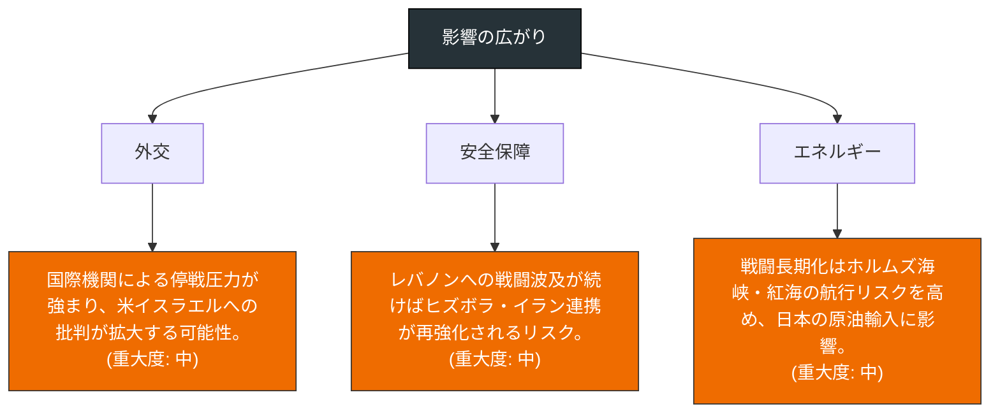
```mermaid
flowchart TB
  R["影響の広がり"]
  D0["外交"]
  I0["国際機関による停戦圧力が強まり、米イスラエルへの批判が拡大する可能性。\n(重大度: 中)"]
  R --> D0 --> I0
  style I0 fill:#ef6c00,color:#fff,stroke:#333
  D1["安全保障"]
  I1["レバノンへの戦闘波及が続けばヒズボラ・イラン連携が再強化されるリスク。\n(重大度: 中)"]
  R --> D1 --> I1
  style I1 fill:#ef6c00,color:#fff,stroke:#333
  D2["エネルギー"]
  I2["戦闘長期化はホルムズ海峡・紅海の航行リスクを高め、日本の原油輸入に影響。\n(重大度: 中)"]
  R --> D2 --> I2
  style I2 fill:#ef6c00,color:#fff,stroke:#333
  style R fill:#263238,color:#fff,stroke:#000
```

### 当事者の関係ネットワーク

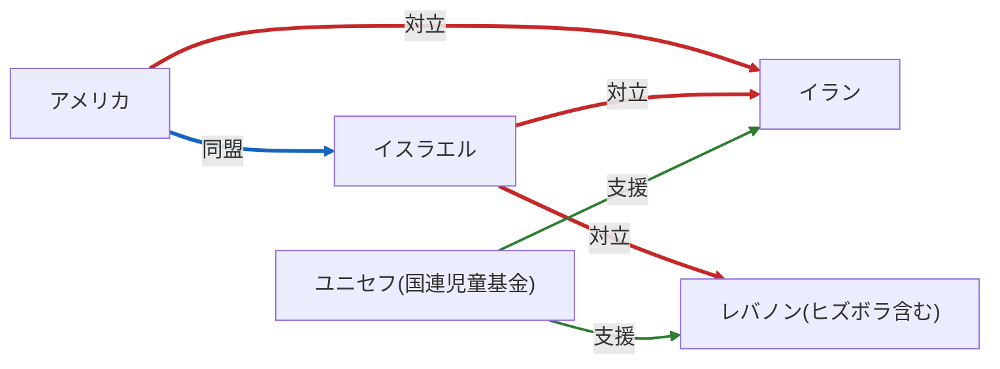
```mermaid
graph LR
  N0["ユニセフ(国連児童基金)"]
  N1["アメリカ"]
  N2["イスラエル"]
  N3["イラン"]
  N4["レバノン(ヒズボラ含む)"]
  N1 -->|同盟| N2
  N1 -->|対立| N3
  N2 -->|対立| N3
  N2 -->|対立| N4
  N0 -->|支援| N3
  N0 -->|支援| N4
  linkStyle 0 stroke:#1565c0,stroke-width:3px;
  linkStyle 1 stroke:#c62828,stroke-width:3px;
  linkStyle 2 stroke:#c62828,stroke-width:3px;
  linkStyle 3 stroke:#c62828,stroke-width:3px;
  linkStyle 4 stroke:#2e7d32,stroke-width:2px;
  linkStyle 5 stroke:#2e7d32,stroke-width:2px;
```

### 押さえるべき論点

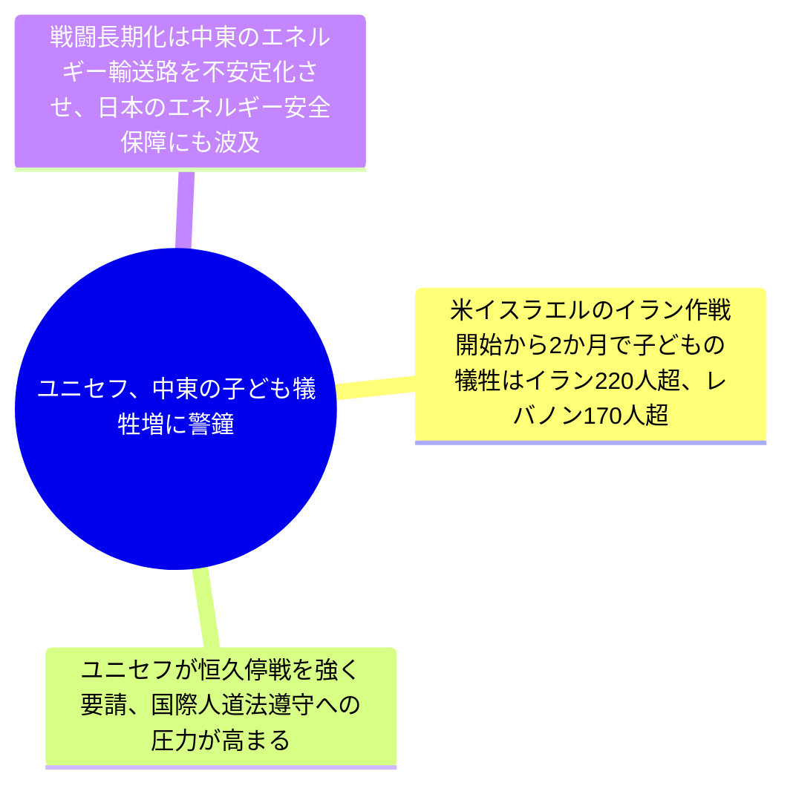
```mermaid
mindmap
  root((ユニセフ、中東の子ども犠牲増に警鐘))
    米イスラエルのイラン作戦開始から2か月で子どもの犠牲はイラン220人超、レバノン170人超
    ユニセフが恒久停戦を強く要請、国際人道法遵守への圧力が高まる
    戦闘長期化は中東のエネルギー輸送路を不安定化させ、日本のエネルギー安全保障にも波及
```

---

## チョルノービリ事故40年 ゼレンスキー氏ロシア非難 `重要度: 中` `europe / global`
- **出典:** NHK 国際 ([原文](http://www3.nhk.or.jp/news/html/20260427/k10015108781000.html)) / **公開:** 2026-04-27 08:13

**要約**
ウクライナのチョルノービリ原発事故から40年となった4月26日、追悼式典が開かれゼレンスキー大統領が出席した。大統領は昨年、原発がロシアからの攻撃を受けたとして強く非難し、「ロシアは国際社会の一員になりえない」と訴えた。事故の記憶と現在進行形の戦争を結び付け、原子力施設への攻撃という新たな脅威を国際社会に印象付ける場となった。

**背景**
1986年のチョルノービリ原発事故から40年の節目に当たる追悼式典。直近1週間ではNATOが東欧への追加配備を協議し、ロシアはシベリア極東で北朝鮮との合同軍事演習を発表するなど、欧州・東アジア双方でロシアの軍事行動への警戒が高まっている。こうした中で行われた式典は、原発攻撃という核安全保障上の問題を改めて国際社会に喚起する機会となった。

**要点**
- チョルノービリ事故から40年の節目に追悼式典が開催された

- 昨年の原発攻撃を理由にゼレンスキー大統領がロシアを強く非難

- 原子力施設への軍事攻撃という新たな核安全保障上の脅威が浮き彫りに

### 経緯タイムライン

```mermaid
timeline
  title チョルノービリ事故40年 ゼレンスキー氏ロシア非難 — 経緯
  1986-04-26 : チョルノービリ原発事故発生
  2025年 : チョルノービリ原発がロシアによる攻撃を受ける
  2026-04-21 : ロシア、シベリア極東で北朝鮮との合同軍事演習を発表
  2026-04-22 : NATOが東欧への追加配備を協議
  2026-04-26 : 事故から40年の追悼式典でゼレンスキー大統領がロシアを非難
```

### 当事者マップ

```mermaid
flowchart LR
  T["チョルノービリ事故40年 ゼレンスキー氏ロシア非難"]
  A0["ウクライナ\n(国家)"]
  A0 -- 被害 --> T
  style A0 fill:#ef6c00,color:#fff,stroke:#333
  A1["ゼレンスキー大統領\n(国家)"]
  A1 -- 反対 --> T
  style A1 fill:#c62828,color:#fff,stroke:#333
  A2["ロシア\n(国家)"]
  A2 -- その他 --> T
  style A2 fill:#1565c0,color:#fff,stroke:#333
  A3["国際社会\n(国際機関)"]
  A3 -- 中立 --> T
  style A3 fill:#616161,color:#fff,stroke:#333
  style T fill:#263238,color:#fff,stroke:#000
```

### 影響の広がり

```mermaid
flowchart TB
  R["影響の広がり"]
  D0["安全保障"]
  I0["原発攻撃の常態化により、欧州における核施設防衛の重要性が一層高まる。\n(重大度: 高)"]
  R --> D0 --> I0
  style I0 fill:#c62828,color:#fff,stroke:#333
  D1["外交"]
  I1["ロシアの国際的孤立を強める材料として活用され、対露包囲網形成に寄与する可能性。\n(重大度: 中)"]
  R --> D1 --> I1
  style I1 fill:#ef6c00,color:#fff,stroke:#333
  D2["エネルギー"]
  I2["戦時下の原子力施設管理に対する国際的な関与強化への議論が促される。\n(重大度: 中)"]
  R --> D2 --> I2
  style I2 fill:#ef6c00,color:#fff,stroke:#333
  style R fill:#263238,color:#fff,stroke:#000
```

### 当事者の関係ネットワーク

```mermaid
graph LR
  N0["ウクライナ"]
  N1["ゼレンスキー大統領"]
  N2["ロシア"]
  N3["国際社会"]
  N0 -->|対立| N2
  N1 -->|対立| N2
  N1 -->|支援| N3
  linkStyle 0 stroke:#c62828,stroke-width:3px;
  linkStyle 1 stroke:#c62828,stroke-width:3px;
  linkStyle 2 stroke:#2e7d32,stroke-width:2px;
```

### 押さえるべき論点

```mermaid
mindmap
  root((チョルノービリ事故40年 ゼレンスキー氏ロシア非難))
    チョルノービリ事故から40年の節目に追悼式典が開催された
    昨年の原発攻撃を理由にゼレンスキー大統領がロシアを強く非難
    原子力施設への軍事攻撃という新たな核安全保障上の脅威が浮き彫りに
```

---
