# 地政学ニュース図解レポート 2026-04-29 号

生成日時: 2026-04-29 07:55 / 記事数: 5

## 📌 本日の要点

- **世銀、エネルギー価格24%上昇予測** — 世界銀行は、2026年のエネルギー価格が前年比でおよそ24%上昇するとの見通しを示した。

## 世銀、エネルギー価格24%上昇予測 `重要度: 高` `middle_east / global`
- **出典:** NHK 国際 ([原文](http://www3.nhk.or.jp/news/html/20260429/k10015110721000.html)) / **公開:** 2026-04-29 06:37

**要約**
世界銀行は、2026年のエネルギー価格が前年比でおよそ24%上昇するとの見通しを示した。これはロシアによるウクライナ侵攻以降で最も高い水準となる。価格高騰の主因はイラン情勢の緊迫化であり、中東産原油・ガスへの依存度が高い世界経済に大きな影響を与える可能性がある。

**背景**
イラン核問題を巡る米欧との対立に加え、イランが支援する「抵抗の枢軸」とイスラエルの衝突が続き、中東のエネルギー供給網への懸念が高まっている。過去1週間にも中東原油輸送路で海運会社が一部航路を回避し保険料が急騰しており、今回の世銀見通しは市場の不安を裏付ける形となった。ホルムズ海峡や紅海の航行安全が揺らげば、世界のエネルギー価格はさらに上振れするリスクがある。

**要点**
- 世銀は2026年のエネルギー価格が前年比約24%上昇、ウクライナ侵攻後で最高水準に達すると予測

- 主因はイラン情勢の緊迫化と、ホルムズ海峡・紅海など輸送路リスクの増大

- 中東依存度が高い日本は燃料・電気料金などインフレ圧力に直撃される恐れ

### 経緯タイムライン

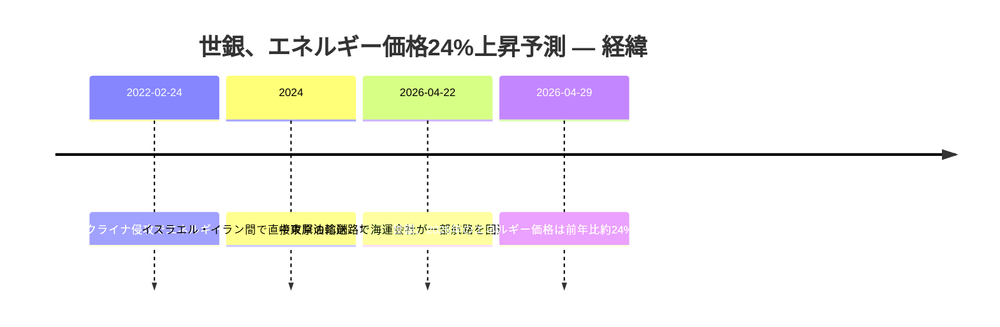
```mermaid
timeline
  title 世銀、エネルギー価格24%上昇予測 — 経緯
  2022-02-24 : ロシアのウクライナ侵攻でエネルギー価格が高騰
  2024 : イスラエル・イラン間で直接攻撃の応酬、地域緊張が拡大
  2026-04-22 : 中東原油輸送路で海運会社が一部航路を回避、保険料急騰
  2026-04-29 : 世銀、2026年のエネルギー価格は前年比約24%上昇との見通し公表
```

### 当事者マップ

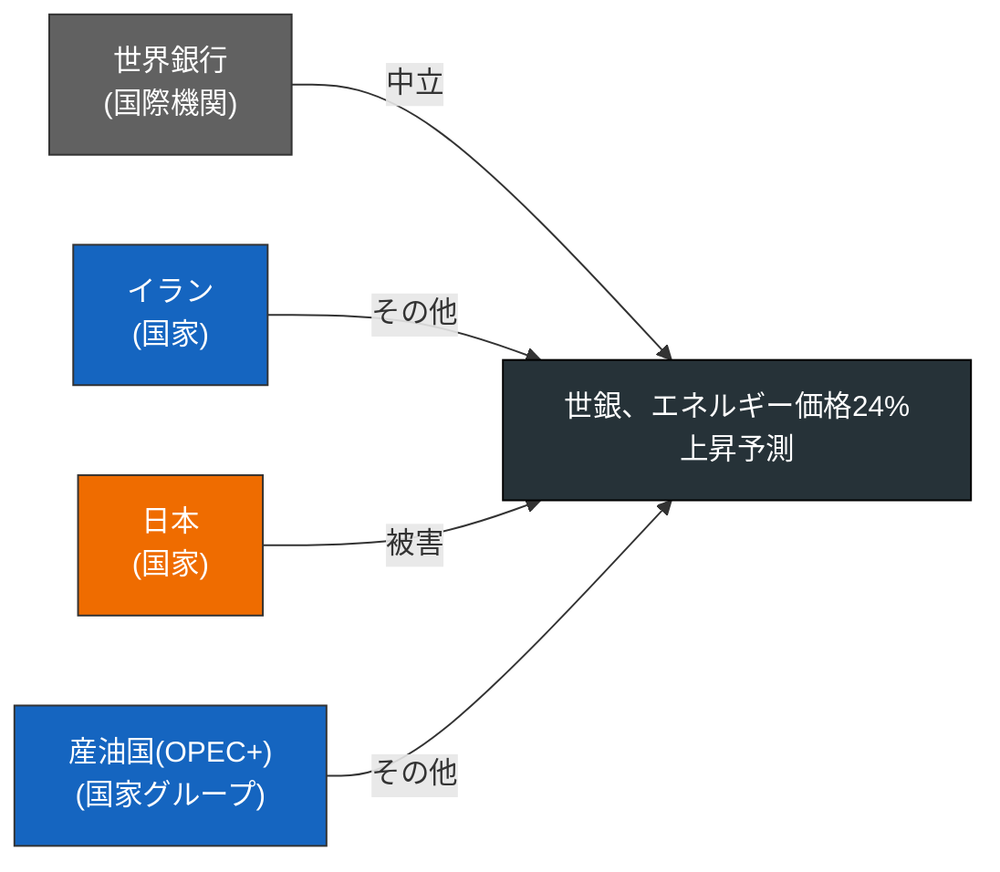
```mermaid
flowchart LR
  T["世銀、エネルギー価格24%上昇予測"]
  A0["世界銀行\n(国際機関)"]
  A0 -- 中立 --> T
  style A0 fill:#616161,color:#fff,stroke:#333
  A1["イラン\n(国家)"]
  A1 -- その他 --> T
  style A1 fill:#1565c0,color:#fff,stroke:#333
  A2["日本\n(国家)"]
  A2 -- 被害 --> T
  style A2 fill:#ef6c00,color:#fff,stroke:#333
  A3["産油国(OPEC+)\n(国家グループ)"]
  A3 -- その他 --> T
  style A3 fill:#1565c0,color:#fff,stroke:#333
  style T fill:#263238,color:#fff,stroke:#000
```

### 影響の広がり

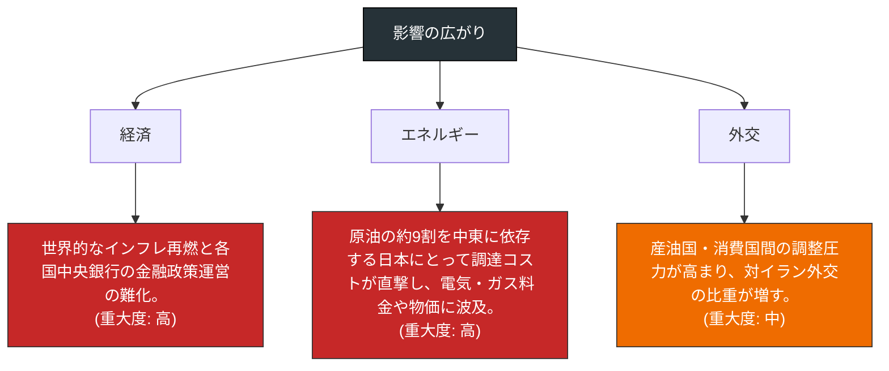
```mermaid
flowchart TB
  R["影響の広がり"]
  D0["経済"]
  I0["世界的なインフレ再燃と各国中央銀行の金融政策運営の難化。\n(重大度: 高)"]
  R --> D0 --> I0
  style I0 fill:#c62828,color:#fff,stroke:#333
  D1["エネルギー"]
  I1["原油の約9割を中東に依存する日本にとって調達コストが直撃し、電気・ガス料金や物価に波及。\n(重大度: 高)"]
  R --> D1 --> I1
  style I1 fill:#c62828,color:#fff,stroke:#333
  D2["外交"]
  I2["産油国・消費国間の調整圧力が高まり、対イラン外交の比重が増す。\n(重大度: 中)"]
  R --> D2 --> I2
  style I2 fill:#ef6c00,color:#fff,stroke:#333
  style R fill:#263238,color:#fff,stroke:#000
```

### 当事者の関係ネットワーク

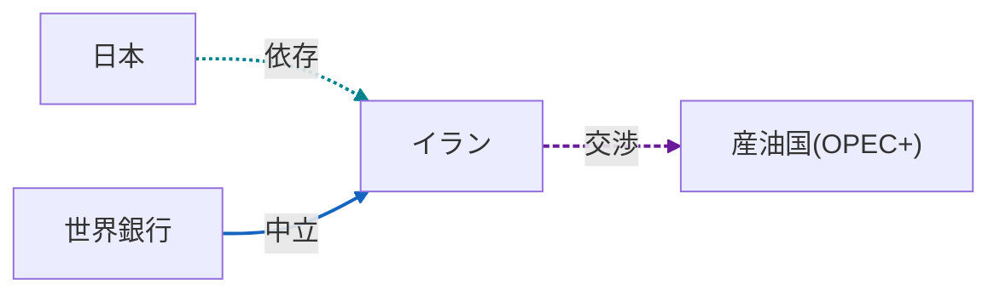
```mermaid
graph LR
  N0["世界銀行"]
  N1["イラン"]
  N2["日本"]
  N3["産油国(OPEC+)"]
  N1 -->|交渉| N3
  N2 -->|依存| N1
  N0 -->|中立| N1
  linkStyle 0 stroke:#6a1b9a,stroke-width:2px,stroke-dasharray:4 2;
  linkStyle 1 stroke:#00838f,stroke-width:2px,stroke-dasharray:2 2;
  linkStyle 2 stroke:#1565c0,stroke-width:2px;
```

### 押さえるべき論点

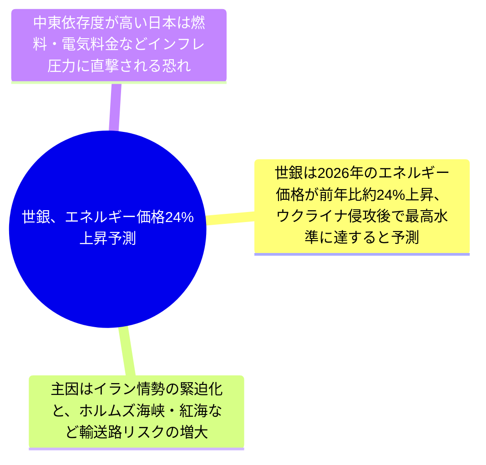
```mermaid
mindmap
  root((世銀、エネルギー価格24%上昇予測))
    世銀は2026年のエネルギー価格が前年比約24%上昇、ウクライナ侵攻後で最高水準に達すると予測
    主因はイラン情勢の緊迫化と、ホルムズ海峡・紅海など輸送路リスクの増大
    中東依存度が高い日本は燃料・電気料金などインフレ圧力に直撃される恐れ
```

---

## ゼレンスキー氏、占領地穀物巡りイスラエル批判 `重要度: 中` `europe / middle_east`
- **出典:** NHK 国際 ([原文](http://www3.nhk.or.jp/news/html/20260429/k10015110711000.html)) / **公開:** 2026-04-29 06:36

**要約**
ウクライナのゼレンスキー大統領は28日、ロシアの占領下にあるウクライナ領で収穫された穀物を積んだ船がイスラエルの港に到着したと指摘した。同氏はイスラエル政府がこの取引を容認する姿勢を示しているとして強く批判した。これに対しイスラエル政府は事実関係を調査するとしている。占領地からの収奪資源の流通は、ロシアの戦時資金源となる懸念があり、国際的な制裁網の実効性が問われる事態となっている。

**背景**
ロシアによるウクライナ侵攻以降、占領地で収穫された穀物が第三国に輸出されることへの批判が続いている。過去1週間にはNATOが東欧諸国への追加配備を協議するなど対露警戒が高まっており、本件は欧州正面の緊張に加え、中東を巻き込む形で支援国・中立国の足並みの乱れを浮き彫りにする。

**要点**
- 占領地で収穫された穀物の第三国流通が再び国際問題化

- ウクライナがイスラエルを名指しで批判し、両国関係に緊張

- イスラエルは調査を表明、対応次第で対露制裁網の実効性に影響

### 経緯タイムライン

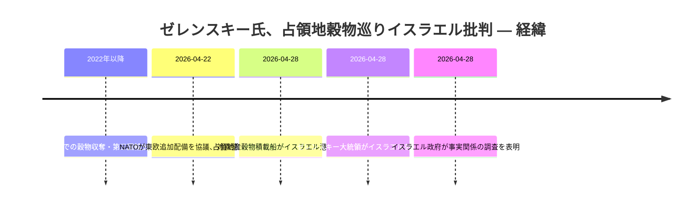
```mermaid
timeline
  title ゼレンスキー氏、占領地穀物巡りイスラエル批判 — 経緯
  2022年以降 : ロシア占領地での穀物収奪・第三国輸出が国際問題化
  2026-04-22 : NATOが東欧追加配備を協議、対露警戒強まる
  2026-04-28 : 占領地産穀物積載船がイスラエル港に到着
  2026-04-28 : ゼレンスキー大統領がイスラエルを公に批判
  2026-04-28 : イスラエル政府が事実関係の調査を表明
```

### 当事者マップ

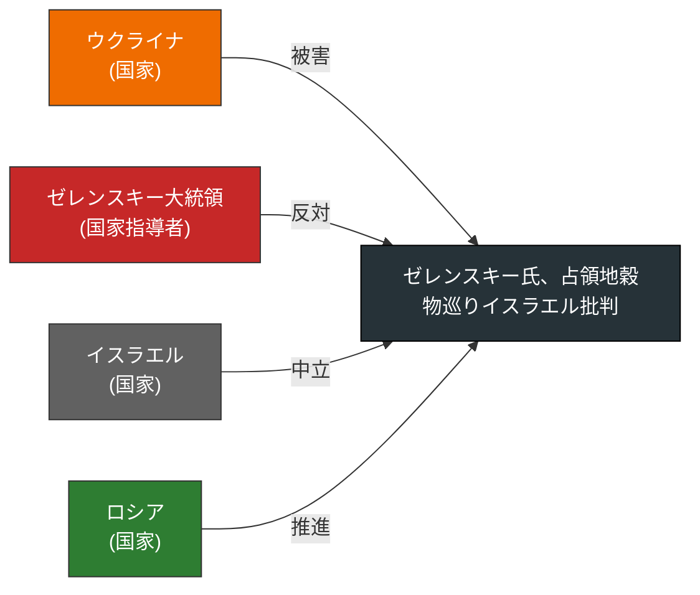
```mermaid
flowchart LR
  T["ゼレンスキー氏、占領地穀物巡りイスラエル批判"]
  A0["ウクライナ\n(国家)"]
  A0 -- 被害 --> T
  style A0 fill:#ef6c00,color:#fff,stroke:#333
  A1["ゼレンスキー大統領\n(国家指導者)"]
  A1 -- 反対 --> T
  style A1 fill:#c62828,color:#fff,stroke:#333
  A2["イスラエル\n(国家)"]
  A2 -- 中立 --> T
  style A2 fill:#616161,color:#fff,stroke:#333
  A3["ロシア\n(国家)"]
  A3 -- 推進 --> T
  style A3 fill:#2e7d32,color:#fff,stroke:#333
  style T fill:#263238,color:#fff,stroke:#000
```

### 影響の広がり

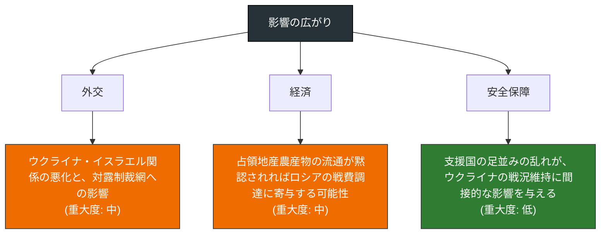
```mermaid
flowchart TB
  R["影響の広がり"]
  D0["外交"]
  I0["ウクライナ・イスラエル関係の悪化と、対露制裁網への影響\n(重大度: 中)"]
  R --> D0 --> I0
  style I0 fill:#ef6c00,color:#fff,stroke:#333
  D1["経済"]
  I1["占領地産農産物の流通が黙認されればロシアの戦費調達に寄与する可能性\n(重大度: 中)"]
  R --> D1 --> I1
  style I1 fill:#ef6c00,color:#fff,stroke:#333
  D2["安全保障"]
  I2["支援国の足並みの乱れが、ウクライナの戦況維持に間接的な影響を与える\n(重大度: 低)"]
  R --> D2 --> I2
  style I2 fill:#2e7d32,color:#fff,stroke:#333
  style R fill:#263238,color:#fff,stroke:#000
```

### 当事者の関係ネットワーク

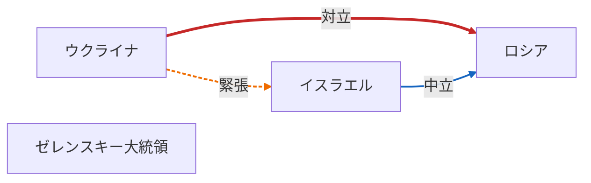
```mermaid
graph LR
  N0["ウクライナ"]
  N1["ゼレンスキー大統領"]
  N2["イスラエル"]
  N3["ロシア"]
  N0 -->|対立| N3
  N0 -->|緊張| N2
  N2 -->|中立| N3
  linkStyle 0 stroke:#c62828,stroke-width:3px;
  linkStyle 1 stroke:#ef6c00,stroke-width:2px,stroke-dasharray:4 2;
  linkStyle 2 stroke:#1565c0,stroke-width:2px;
```

### 押さえるべき論点

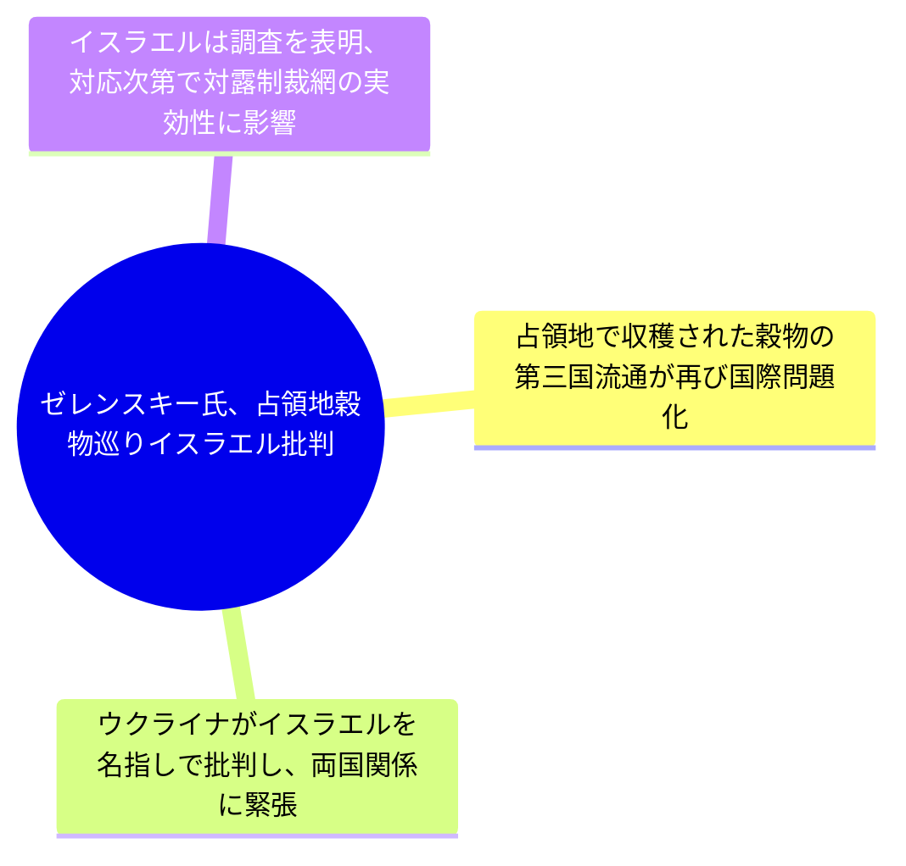
```mermaid
mindmap
  root((ゼレンスキー氏、占領地穀物巡りイスラエル批判))
    占領地で収穫された穀物の第三国流通が再び国際問題化
    ウクライナがイスラエルを名指しで批判し、両国関係に緊張
    イスラエルは調査を表明、対応次第で対露制裁網の実効性に影響
```

---

## 米軍、イラン向け疑い商船を臨検後解放 `重要度: 中` `middle_east / global`
- **出典:** NHK 国際 ([原文](http://www3.nhk.or.jp/news/html/20260429/k10015110751000.html)) / **公開:** 2026-04-29 06:31

**要約**
アメリカ中央軍は4月28日、アラビア海でイランの港に向かう疑いのある商船に海兵隊員が乗り込み臨検を実施したと発表しました。捜索の結果、イランの港への寄港予定がないことが確認されたため、船は解放されました。中央軍はSNS上で経緯を公表し、対イラン制裁措置の執行強化を誇示する姿勢を示しています。

**背景**
第2次トランプ政権はイランへの「最大限の圧力」路線を再強化し、海上での制裁執行を活発化させています。中東では紅海・ホルムズ海峡の安全が懸念され、過去1週間でも海運会社が一部航路を回避し保険料が急騰するなど、海上輸送の不安定化が進む中での今回の臨検です。

**要点**
- 米中央軍がアラビア海でイラン向け疑いの商船を臨検、寄港予定なしと判明し解放

- 対イラン「最大限の圧力」路線下で、海上制裁執行が積極化していることを示す事例

- ホルムズ海峡・アラビア海の緊張は日本のエネルギー安全保障に直結するため注視が必要

### 経緯タイムライン

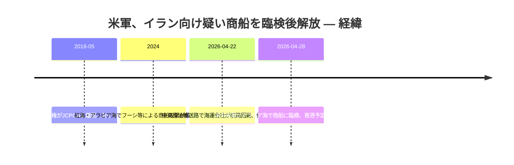
```mermaid
timeline
  title 米軍、イラン向け疑い商船を臨検後解放 — 経緯
  2018-05 : 米トランプ政権がJCPOAを離脱、対イラン制裁を復活
  2024 : 紅海・アラビア海でフーシ等による商船攻撃が頻発、海上安全悪化
  2026-04-22 : 中東原油輸送路で海運会社が航路回避、保険料急騰
  2026-04-28 : 米中央軍がアラビア海で商船に臨検、寄港予定なしと確認し解放
```

### 当事者マップ

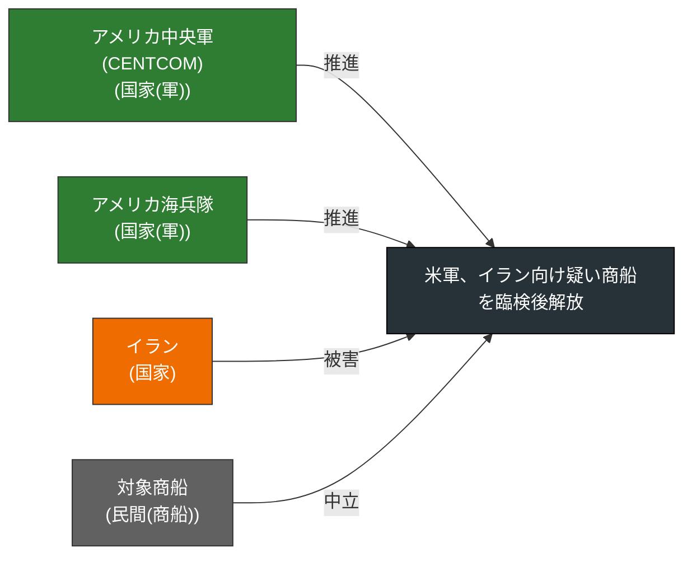
```mermaid
flowchart LR
  T["米軍、イラン向け疑い商船を臨検後解放"]
  A0["アメリカ中央軍(CENTCOM)\n(国家(軍))"]
  A0 -- 推進 --> T
  style A0 fill:#2e7d32,color:#fff,stroke:#333
  A1["アメリカ海兵隊\n(国家(軍))"]
  A1 -- 推進 --> T
  style A1 fill:#2e7d32,color:#fff,stroke:#333
  A2["イラン\n(国家)"]
  A2 -- 被害 --> T
  style A2 fill:#ef6c00,color:#fff,stroke:#333
  A3["対象商船\n(民間(商船))"]
  A3 -- 中立 --> T
  style A3 fill:#616161,color:#fff,stroke:#333
  style T fill:#263238,color:#fff,stroke:#000
```

### 影響の広がり

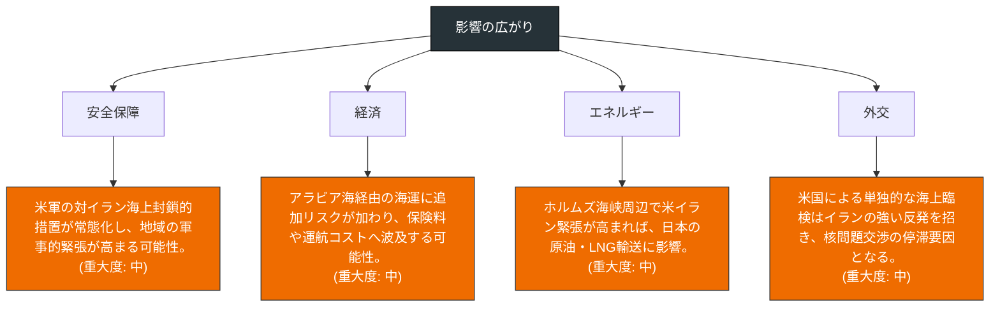
```mermaid
flowchart TB
  R["影響の広がり"]
  D0["安全保障"]
  I0["米軍の対イラン海上封鎖的措置が常態化し、地域の軍事的緊張が高まる可能性。\n(重大度: 中)"]
  R --> D0 --> I0
  style I0 fill:#ef6c00,color:#fff,stroke:#333
  D1["経済"]
  I1["アラビア海経由の海運に追加リスクが加わり、保険料や運航コストへ波及する可能性。\n(重大度: 中)"]
  R --> D1 --> I1
  style I1 fill:#ef6c00,color:#fff,stroke:#333
  D2["エネルギー"]
  I2["ホルムズ海峡周辺で米イラン緊張が高まれば、日本の原油・LNG輸送に影響。\n(重大度: 中)"]
  R --> D2 --> I2
  style I2 fill:#ef6c00,color:#fff,stroke:#333
  D3["外交"]
  I3["米国による単独的な海上臨検はイランの強い反発を招き、核問題交渉の停滞要因となる。\n(重大度: 中)"]
  R --> D3 --> I3
  style I3 fill:#ef6c00,color:#fff,stroke:#333
  style R fill:#263238,color:#fff,stroke:#000
```

### 当事者の関係ネットワーク

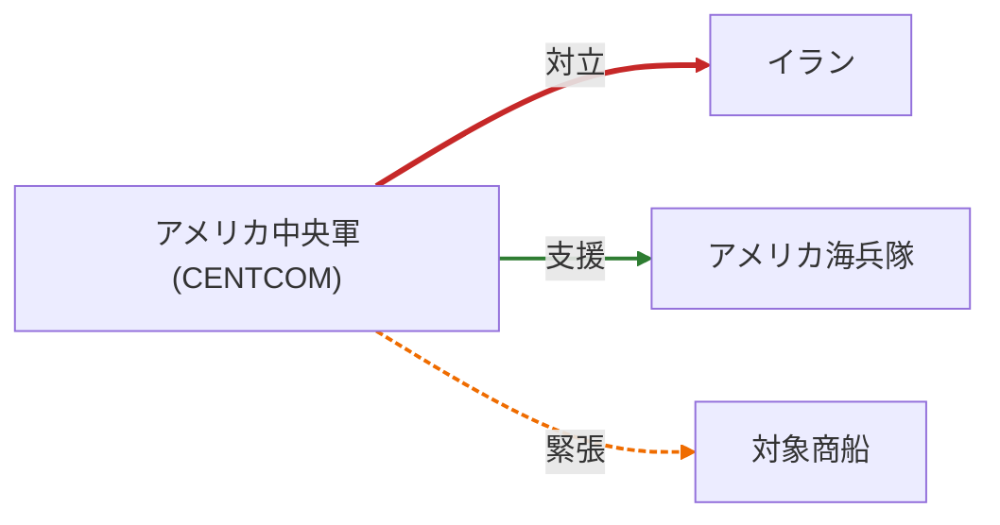
```mermaid
graph LR
  N0["アメリカ中央軍(CENTCOM)"]
  N1["アメリカ海兵隊"]
  N2["イラン"]
  N3["対象商船"]
  N0 -->|対立| N2
  N0 -->|支援| N1
  N0 -->|緊張| N3
  linkStyle 0 stroke:#c62828,stroke-width:3px;
  linkStyle 1 stroke:#2e7d32,stroke-width:2px;
  linkStyle 2 stroke:#ef6c00,stroke-width:2px,stroke-dasharray:4 2;
```

### 押さえるべき論点

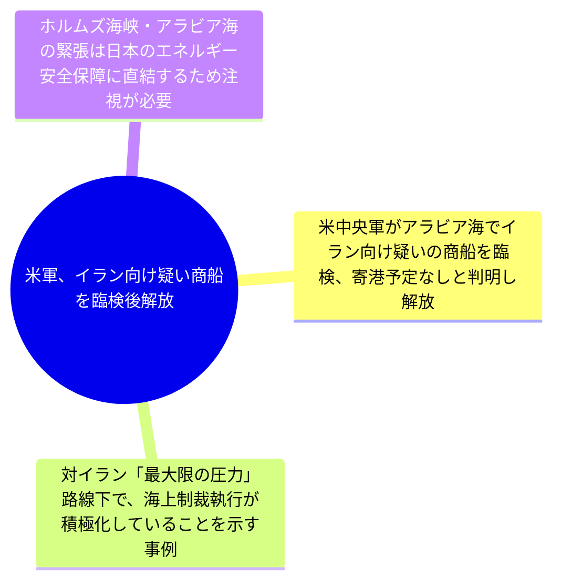
```mermaid
mindmap
  root((米軍、イラン向け疑い商船を臨検後解放))
    米中央軍がアラビア海でイラン向け疑いの商船を臨検、寄港予定なしと判明し解放
    対イラン「最大限の圧力」路線下で、海上制裁執行が積極化していることを示す事例
    ホルムズ海峡・アラビア海の緊張は日本のエネルギー安全保障に直結するため注視が必要
```

---

## 高市首相、エジプト大統領と中東沈静化で連携 `重要度: 中` `middle_east`
- **出典:** NHK 国際 ([原文](http://www3.nhk.or.jp/news/html/20260428/k10015110611000.html)) / **公開:** 2026-04-28 21:30

**要約**
高市総理大臣はエジプトのシシ大統領と電話会談を行い、中東情勢の早期沈静化に向けた外交努力を続ける考えを伝えた。両首脳はホルムズ海峡の航行安全確保を含め、連携を強化することで一致した。日本のエネルギー安全保障に直結するホルムズ海峡の安定が焦点となっている。地域の調停役を担うエジプトとの協調を通じ、日本は外交面での関与を強める姿勢を示した。

**背景**
過去1週間で中東原油輸送路の不安定化を受け海運会社が航路回避や保険料急騰に見舞われており、ホルムズ海峡を含む中東の航行安全への懸念が高まっている。日本は原油の約9割、LNGの約4割を中東に依存しており、ホルムズ海峡の安定は死活的な利益。エジプトはガザ停戦交渉の主要仲介国であり、日本は調停力を持つ同国との連携で外交的影響力を確保しようとしている。

**要点**
- 高市首相がシシ大統領と電話会談し、中東情勢の早期沈静化で連携強化

- ホルムズ海峡の航行安全確保が日本のエネルギー安保上の最重要課題

- ガザ停戦の主要仲介国エジプトとの協調で日本の外交関与を強める

### 経緯タイムライン

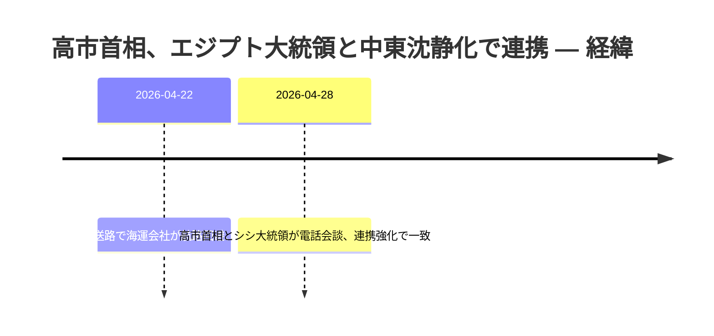
```mermaid
timeline
  title 高市首相、エジプト大統領と中東沈静化で連携 — 経緯
  2026-04-22 : 中東原油輸送路で海運会社が航路回避、保険料急騰
  2026-04-28 : 高市首相とシシ大統領が電話会談、連携強化で一致
```

### 当事者マップ

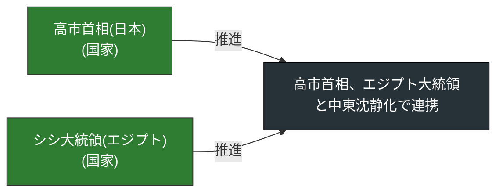
```mermaid
flowchart LR
  T["高市首相、エジプト大統領と中東沈静化で連携"]
  A0["高市首相(日本)\n(国家)"]
  A0 -- 推進 --> T
  style A0 fill:#2e7d32,color:#fff,stroke:#333
  A1["シシ大統領(エジプト)\n(国家)"]
  A1 -- 推進 --> T
  style A1 fill:#2e7d32,color:#fff,stroke:#333
  style T fill:#263238,color:#fff,stroke:#000
```

### 影響の広がり

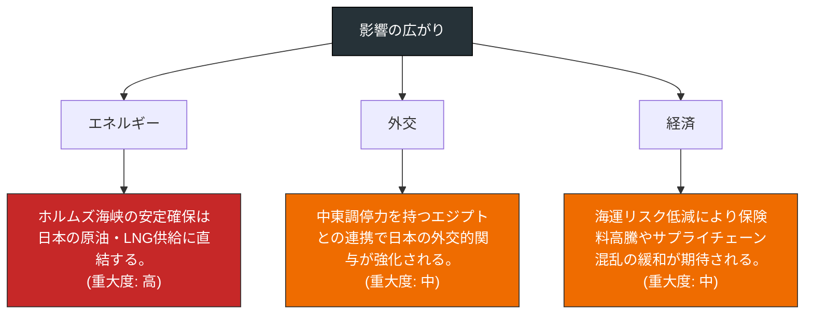
```mermaid
flowchart TB
  R["影響の広がり"]
  D0["エネルギー"]
  I0["ホルムズ海峡の安定確保は日本の原油・LNG供給に直結する。\n(重大度: 高)"]
  R --> D0 --> I0
  style I0 fill:#c62828,color:#fff,stroke:#333
  D1["外交"]
  I1["中東調停力を持つエジプトとの連携で日本の外交的関与が強化される。\n(重大度: 中)"]
  R --> D1 --> I1
  style I1 fill:#ef6c00,color:#fff,stroke:#333
  D2["経済"]
  I2["海運リスク低減により保険料高騰やサプライチェーン混乱の緩和が期待される。\n(重大度: 中)"]
  R --> D2 --> I2
  style I2 fill:#ef6c00,color:#fff,stroke:#333
  style R fill:#263238,color:#fff,stroke:#000
```

### 当事者の関係ネットワーク

```mermaid
graph LR
  N0["高市首相(日本)"]
  N1["シシ大統領(エジプト)"]
  N0 -->|交渉| N1
  linkStyle 0 stroke:#6a1b9a,stroke-width:2px,stroke-dasharray:4 2;
```

### 押さえるべき論点

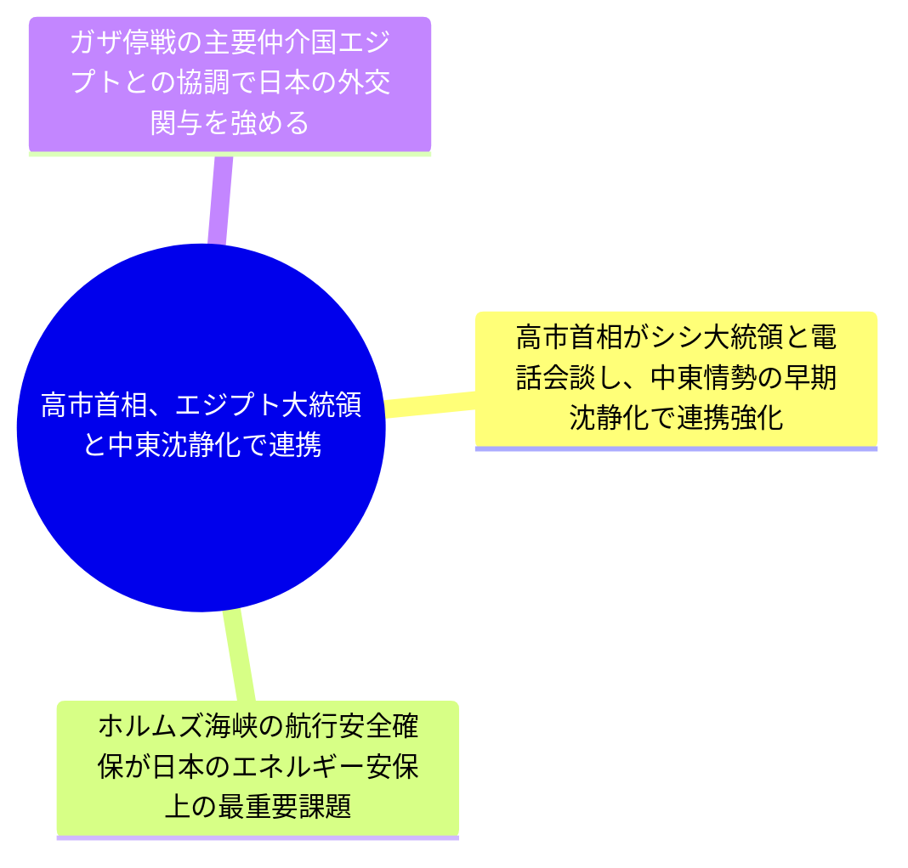
```mermaid
mindmap
  root((高市首相、エジプト大統領と中東沈静化で連携))
    高市首相がシシ大統領と電話会談し、中東情勢の早期沈静化で連携強化
    ホルムズ海峡の航行安全確保が日本のエネルギー安保上の最重要課題
    ガザ停戦の主要仲介国エジプトとの協調で日本の外交関与を強める
```

---

重要度「低」の記事(1本) — 見出しのみ

- **キーウで「サクラ列車」運行開始** ([原文](http://www3.nhk.or.jp/news/html/20260429/k10015110741000.html)) — NHK 国際

