# 地政学ニュース図解レポート 2026-04-30 号

生成日時: 2026-04-30 07:55 / 記事数: 5

## 📌 本日の要点

- **米ロ首脳電話会談 イラン・ウクライナ協議** — アメリカのトランプ大統領とロシアのプーチン大統領が4月29日に電話会談を行い、イラン情勢とウクライナ情勢について意見を交わした。

## 米ロ首脳電話会談 イラン・ウクライナ協議 `重要度: 高` `middle_east / europe / global`
- **出典:** NHK 国際 ([原文](http://www3.nhk.or.jp/news/html/20260430/k10015111241000.html)) / **公開:** 2026-04-30 03:48

**要約**
アメリカのトランプ大統領とロシアのプーチン大統領が4月29日に電話会談を行い、イラン情勢とウクライナ情勢について意見を交わした。プーチン氏はトランプ氏によるイランとの停戦延長を「正しい判断」と評価し、交渉機会の提供と情勢安定化に資すると述べた。ウクライナ情勢については、プーチン氏が5月の対独戦勝記念日にあわせて停戦の用意があると伝えた。両首脳の協議は、米ロが世界の主要紛争で再び協調姿勢を見せる動きとして注目される。

**背景**
第2次トランプ政権はイランに対し最大圧力路線を継続しつつも、緊張緩和に向けた停戦合意・交渉枠組みを模索している。ロシアはイランと近く、ウクライナ侵攻継続中だが、トランプ政権発足後は米ロ間で停戦を含む協議が進められている。

**要点**
- 米ロ首脳が電話会談でイラン停戦延長とウクライナ停戦の双方を協議

- プーチン氏は5月の戦勝記念日に合わせウクライナでの停戦用意を表明

- 米ロ主導で主要紛争の方向性が決まる構図は欧州・中東の同盟国への影響大

### 経緯タイムライン

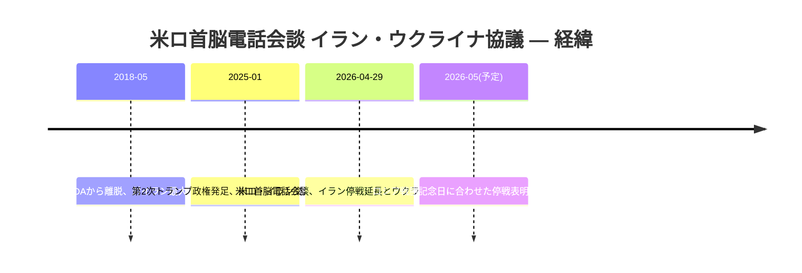
```mermaid
timeline
  title 米ロ首脳電話会談 イラン・ウクライナ協議 — 経緯
  2018-05 : 米国がJCPOAから離脱、対イラン最大圧力政策へ
  2025-01 : 第2次トランプ政権発足、米ロ・イラン交渉が動き出す
  2026-04-29 : 米ロ首脳電話会談、イラン停戦延長とウクライナ停戦を協議
  2026-05(予定) : ロシア戦勝記念日に合わせた停戦表明の実施焦点
```

### 当事者マップ

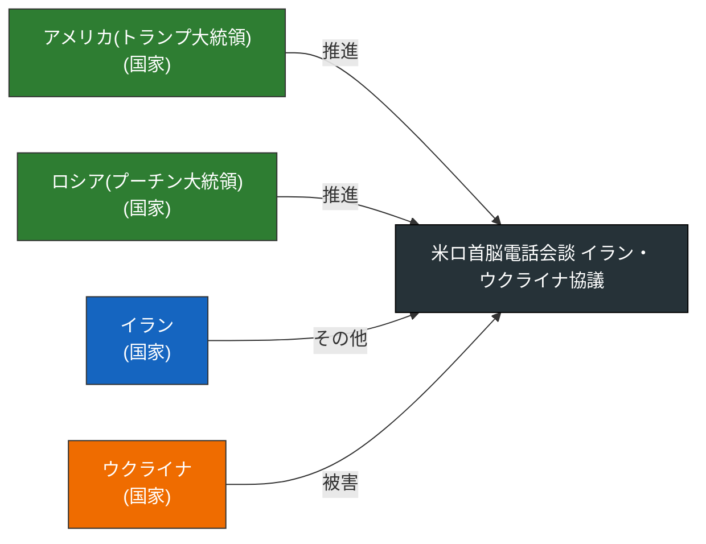
```mermaid
flowchart LR
  T["米ロ首脳電話会談 イラン・ウクライナ協議"]
  A0["アメリカ(トランプ大統領)\n(国家)"]
  A0 -- 推進 --> T
  style A0 fill:#2e7d32,color:#fff,stroke:#333
  A1["ロシア(プーチン大統領)\n(国家)"]
  A1 -- 推進 --> T
  style A1 fill:#2e7d32,color:#fff,stroke:#333
  A2["イラン\n(国家)"]
  A2 -- その他 --> T
  style A2 fill:#1565c0,color:#fff,stroke:#333
  A3["ウクライナ\n(国家)"]
  A3 -- 被害 --> T
  style A3 fill:#ef6c00,color:#fff,stroke:#333
  style T fill:#263238,color:#fff,stroke:#000
```

### 影響の広がり

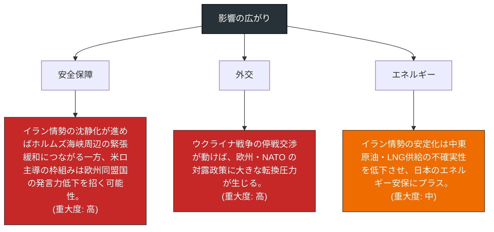
```mermaid
flowchart TB
  R["影響の広がり"]
  D0["安全保障"]
  I0["イラン情勢の沈静化が進めばホルムズ海峡周辺の緊張緩和につながる一方、米ロ主導の枠組みは欧州同盟国の発言力低下を招く可能性。\n(重大度: 高)"]
  R --> D0 --> I0
  style I0 fill:#c62828,color:#fff,stroke:#333
  D1["外交"]
  I1["ウクライナ戦争の停戦交渉が動けば、欧州・NATO の対露政策に大きな転換圧力が生じる。\n(重大度: 高)"]
  R --> D1 --> I1
  style I1 fill:#c62828,color:#fff,stroke:#333
  D2["エネルギー"]
  I2["イラン情勢の安定化は中東原油・LNG供給の不確実性を低下させ、日本のエネルギー安保にプラス。\n(重大度: 中)"]
  R --> D2 --> I2
  style I2 fill:#ef6c00,color:#fff,stroke:#333
  style R fill:#263238,color:#fff,stroke:#000
```

### 当事者の関係ネットワーク

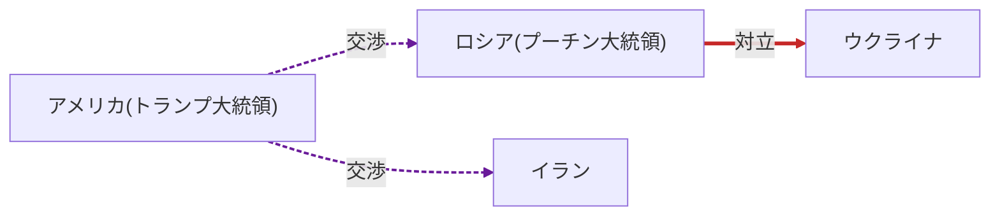
```mermaid
graph LR
  N0["アメリカ(トランプ大統領)"]
  N1["ロシア(プーチン大統領)"]
  N2["イラン"]
  N3["ウクライナ"]
  N0 -->|交渉| N1
  N1 -->|対立| N3
  N0 -->|交渉| N2
  linkStyle 0 stroke:#6a1b9a,stroke-width:2px,stroke-dasharray:4 2;
  linkStyle 1 stroke:#c62828,stroke-width:3px;
  linkStyle 2 stroke:#6a1b9a,stroke-width:2px,stroke-dasharray:4 2;
```

### 押さえるべき論点

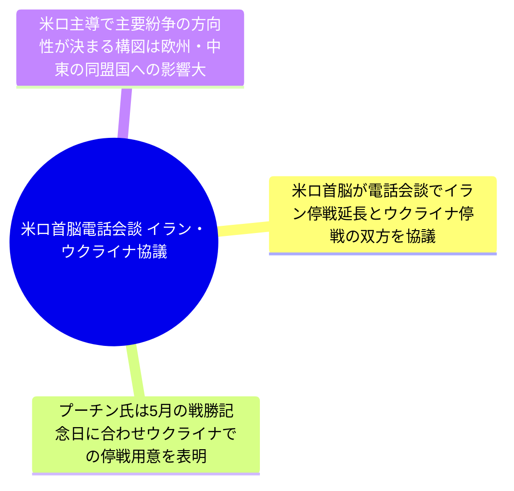
```mermaid
mindmap
  root((米ロ首脳電話会談 イラン・ウクライナ協議))
    米ロ首脳が電話会談でイラン停戦延長とウクライナ停戦の双方を協議
    プーチン氏は5月の戦勝記念日に合わせウクライナでの停戦用意を表明
    米ロ主導で主要紛争の方向性が決まる構図は欧州・中東の同盟国への影響大
```

---

## 国連安保理で日中応酬、台湾巡り対立 `重要度: 中` `east_asia / global`
- **出典:** NHK 国際 ([原文](http://www3.nhk.or.jp/news/html/20260430/k10015111301000.html)) / **公開:** 2026-04-30 07:46

**要約**
国連安全保障理事会の会合で、日本と中国がインド太平洋の海洋秩序をめぐり再び激しく応酬しました。日本側は台湾海峡の平和と安定の重要性を強調したのに対し、中国側は「台湾問題で火遊びをするな」と日本を強くけん制しました。海洋進出を続ける中国と、これに警戒を強める日本の対立が、国際社会の場で改めて鮮明になった形です。台湾を含むインド太平洋の安全保障環境をめぐる日中の溝が深まっていることを示しています。

**背景**
中国は南シナ海・東シナ海での活動を活発化させ、台湾周辺でも軍事的圧力を強めています。日本は2021年の日米2+2以降「台湾海峡の平和と安定」を繰り返し表明し、南西諸島への自衛隊配備強化など対中抑止を進めており、国際会議の場でも日中が応酬する場面が常態化しています。

**要点**
- 国連安保理という多国間の場で日中が海洋秩序と台湾を巡り正面衝突した

- 日本は「台湾海峡の平和と安定」を国際社会に訴える姿勢を維持

- 中国の「火遊び」発言は日本への強い警告であり、対立の長期化を示唆

### 経緯タイムライン

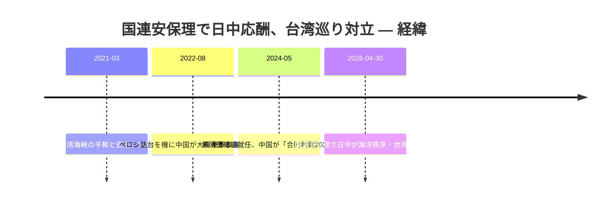
```mermaid
timeline
  title 国連安保理で日中応酬、台湾巡り対立 — 経緯
  2021-03 : 日米2+2で「台湾海峡の平和と安定」を共同声明に明記
  2022-08 : ペロシ訪台を機に中国が大規模軍事演習を実施
  2024-05 : 頼清徳総統就任、中国が「合同利剣2024A」演習
  2026-04-30 : 国連安保理で日中が海洋秩序・台湾巡り応酬
```

### 当事者マップ

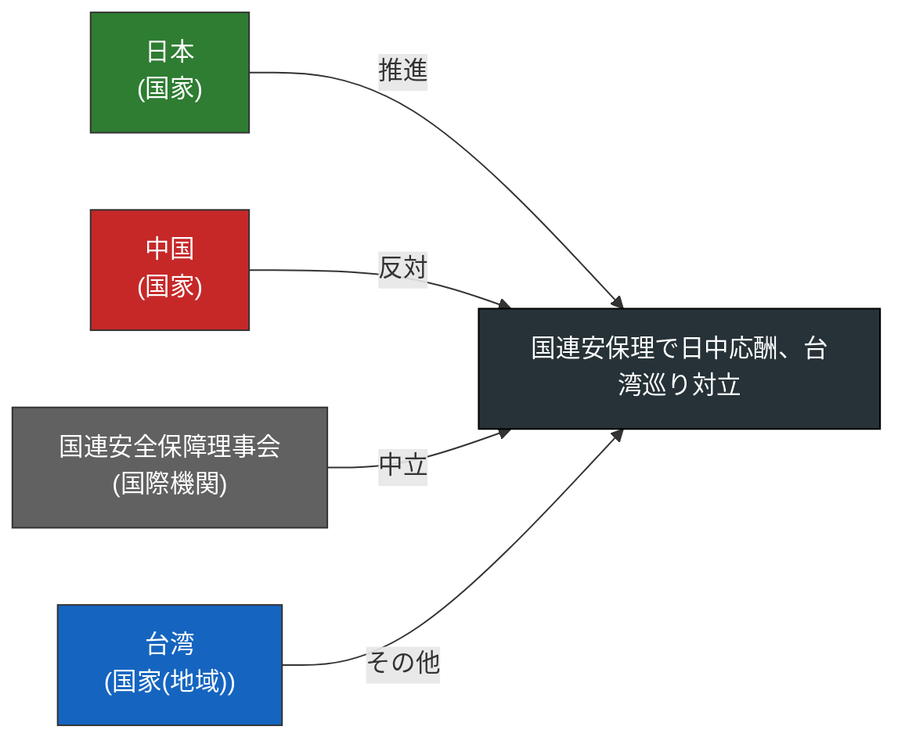
```mermaid
flowchart LR
  T["国連安保理で日中応酬、台湾巡り対立"]
  A0["日本\n(国家)"]
  A0 -- 推進 --> T
  style A0 fill:#2e7d32,color:#fff,stroke:#333
  A1["中国\n(国家)"]
  A1 -- 反対 --> T
  style A1 fill:#c62828,color:#fff,stroke:#333
  A2["国連安全保障理事会\n(国際機関)"]
  A2 -- 中立 --> T
  style A2 fill:#616161,color:#fff,stroke:#333
  A3["台湾\n(国家(地域))"]
  A3 -- その他 --> T
  style A3 fill:#1565c0,color:#fff,stroke:#333
  style T fill:#263238,color:#fff,stroke:#000
```

### 影響の広がり

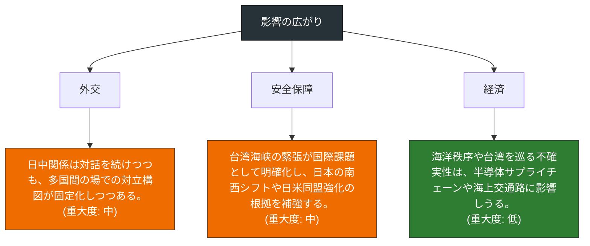
```mermaid
flowchart TB
  R["影響の広がり"]
  D0["外交"]
  I0["日中関係は対話を続けつつも、多国間の場での対立構図が固定化しつつある。\n(重大度: 中)"]
  R --> D0 --> I0
  style I0 fill:#ef6c00,color:#fff,stroke:#333
  D1["安全保障"]
  I1["台湾海峡の緊張が国際課題として明確化し、日本の南西シフトや日米同盟強化の根拠を補強する。\n(重大度: 中)"]
  R --> D1 --> I1
  style I1 fill:#ef6c00,color:#fff,stroke:#333
  D2["経済"]
  I2["海洋秩序や台湾を巡る不確実性は、半導体サプライチェーンや海上交通路に影響しうる。\n(重大度: 低)"]
  R --> D2 --> I2
  style I2 fill:#2e7d32,color:#fff,stroke:#333
  style R fill:#263238,color:#fff,stroke:#000
```

### 当事者の関係ネットワーク

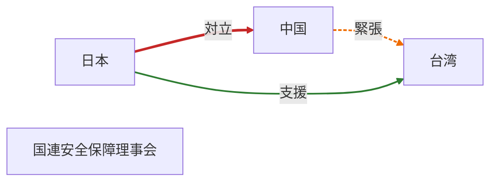
```mermaid
graph LR
  N0["日本"]
  N1["中国"]
  N2["国連安全保障理事会"]
  N3["台湾"]
  N0 -->|対立| N1
  N1 -->|緊張| N3
  N0 -->|支援| N3
  linkStyle 0 stroke:#c62828,stroke-width:3px;
  linkStyle 1 stroke:#ef6c00,stroke-width:2px,stroke-dasharray:4 2;
  linkStyle 2 stroke:#2e7d32,stroke-width:2px;
```

### 押さえるべき論点

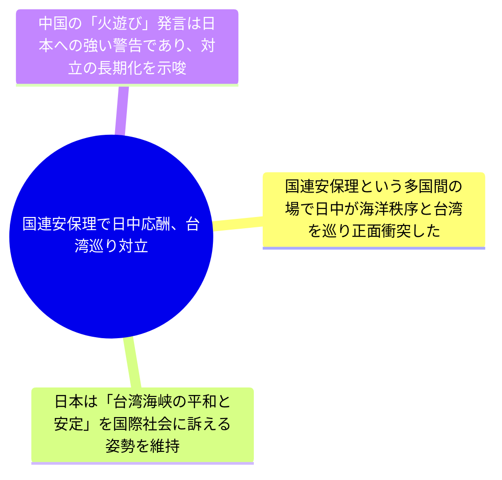
```mermaid
mindmap
  root((国連安保理で日中応酬、台湾巡り対立))
    国連安保理という多国間の場で日中が海洋秩序と台湾を巡り正面衝突した
    日本は「台湾海峡の平和と安定」を国際社会に訴える姿勢を維持
    中国の「火遊び」発言は日本への強い警告であり、対立の長期化を示唆
```

---

## 日豪首脳会談で経済安保共同宣言へ `重要度: 中` `east_asia / southeast_asia / global`
- **出典:** NHK 国際 ([原文](http://www3.nhk.or.jp/news/html/20260430/k10015111131000.html)) / **公開:** 2026-04-30 05:49

**要約**
高市総理大臣は5月1日からベトナムとオーストラリアを歴訪する。オーストラリアではアルバニージー首相との首脳会談で、重要鉱物やエネルギーの安定供給に関する協力を盛り込んだ経済安全保障分野の共同宣言を出す方向で調整している。中国による重要鉱物の輸出規制が強まる中、サプライチェーン強靭化を図る狙いがある。日豪は「特別な戦略的パートナー」として安全保障協力も深めており、経済と安保の両面で連携を一段と強化する。

**背景**
中国がレアアースなど重要鉱物の輸出管理を強化する中、日本はサプライチェーンの脱中国依存を急いでいる。豪州は重要鉱物の有力産出国であり、日米豪印(クアッド)の枠組みでも経済安保協力が進められてきた。

**要点**
- 高市首相が5月1日からベトナム・オーストラリアを歴訪

- 豪首脳会談で重要鉱物・エネルギー協力を盛り込む経済安保共同宣言を調整

- 中国の輸出規制を背景にサプライチェーンの脱中国依存を加速

### 経緯タイムライン

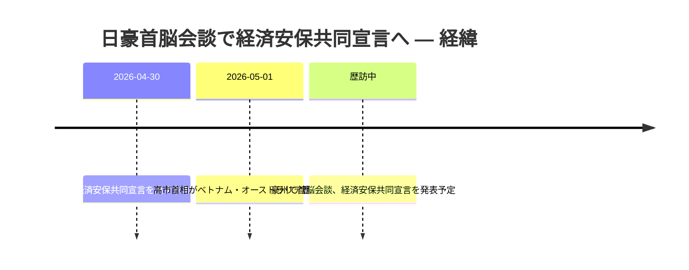
```mermaid
timeline
  title 日豪首脳会談で経済安保共同宣言へ — 経緯
  2026-04-30 : 首脳会談で経済安保共同宣言を出す方向で調整と報道
  2026-05-01 : 高市首相がベトナム・オーストラリア歴訪を開始
  歴訪中 : 豪州で首脳会談、経済安保共同宣言を発表予定
```

### 当事者マップ

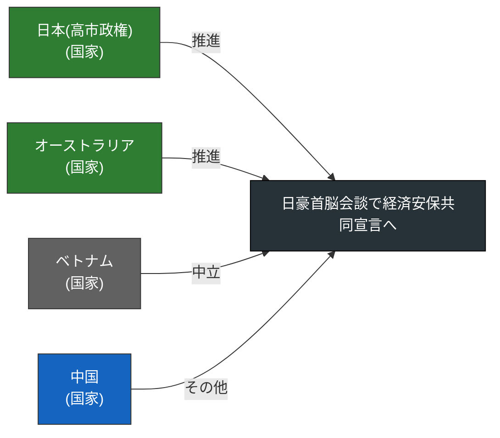
```mermaid
flowchart LR
  T["日豪首脳会談で経済安保共同宣言へ"]
  A0["日本(高市政権)\n(国家)"]
  A0 -- 推進 --> T
  style A0 fill:#2e7d32,color:#fff,stroke:#333
  A1["オーストラリア\n(国家)"]
  A1 -- 推進 --> T
  style A1 fill:#2e7d32,color:#fff,stroke:#333
  A2["ベトナム\n(国家)"]
  A2 -- 中立 --> T
  style A2 fill:#616161,color:#fff,stroke:#333
  A3["中国\n(国家)"]
  A3 -- その他 --> T
  style A3 fill:#1565c0,color:#fff,stroke:#333
  style T fill:#263238,color:#fff,stroke:#000
```

### 影響の広がり

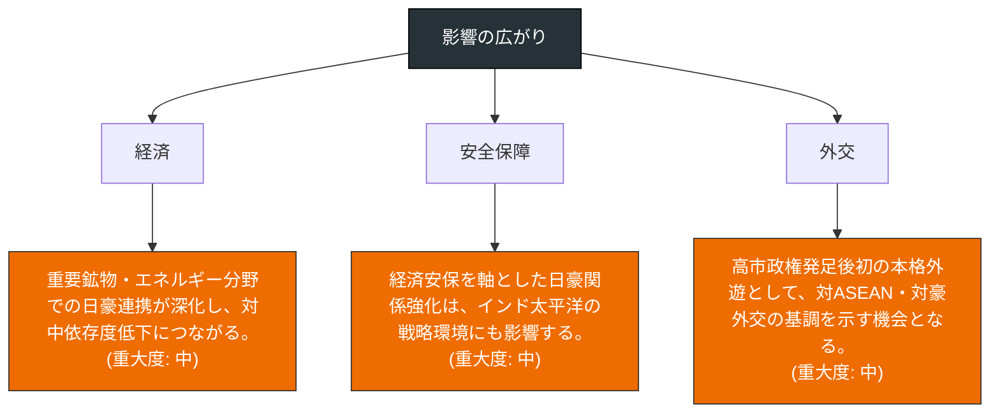
```mermaid
flowchart TB
  R["影響の広がり"]
  D0["経済"]
  I0["重要鉱物・エネルギー分野での日豪連携が深化し、対中依存度低下につながる。\n(重大度: 中)"]
  R --> D0 --> I0
  style I0 fill:#ef6c00,color:#fff,stroke:#333
  D1["安全保障"]
  I1["経済安保を軸とした日豪関係強化は、インド太平洋の戦略環境にも影響する。\n(重大度: 中)"]
  R --> D1 --> I1
  style I1 fill:#ef6c00,color:#fff,stroke:#333
  D2["外交"]
  I2["高市政権発足後初の本格外遊として、対ASEAN・対豪外交の基調を示す機会となる。\n(重大度: 中)"]
  R --> D2 --> I2
  style I2 fill:#ef6c00,color:#fff,stroke:#333
  style R fill:#263238,color:#fff,stroke:#000
```

### 当事者の関係ネットワーク

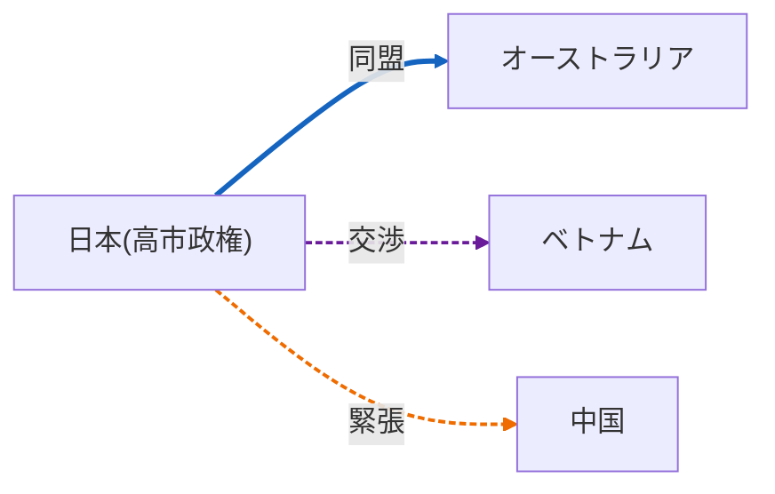
```mermaid
graph LR
  N0["日本(高市政権)"]
  N1["オーストラリア"]
  N2["ベトナム"]
  N3["中国"]
  N0 -->|同盟| N1
  N0 -->|交渉| N2
  N0 -->|緊張| N3
  linkStyle 0 stroke:#1565c0,stroke-width:3px;
  linkStyle 1 stroke:#6a1b9a,stroke-width:2px,stroke-dasharray:4 2;
  linkStyle 2 stroke:#ef6c00,stroke-width:2px,stroke-dasharray:4 2;
```

### 押さえるべき論点

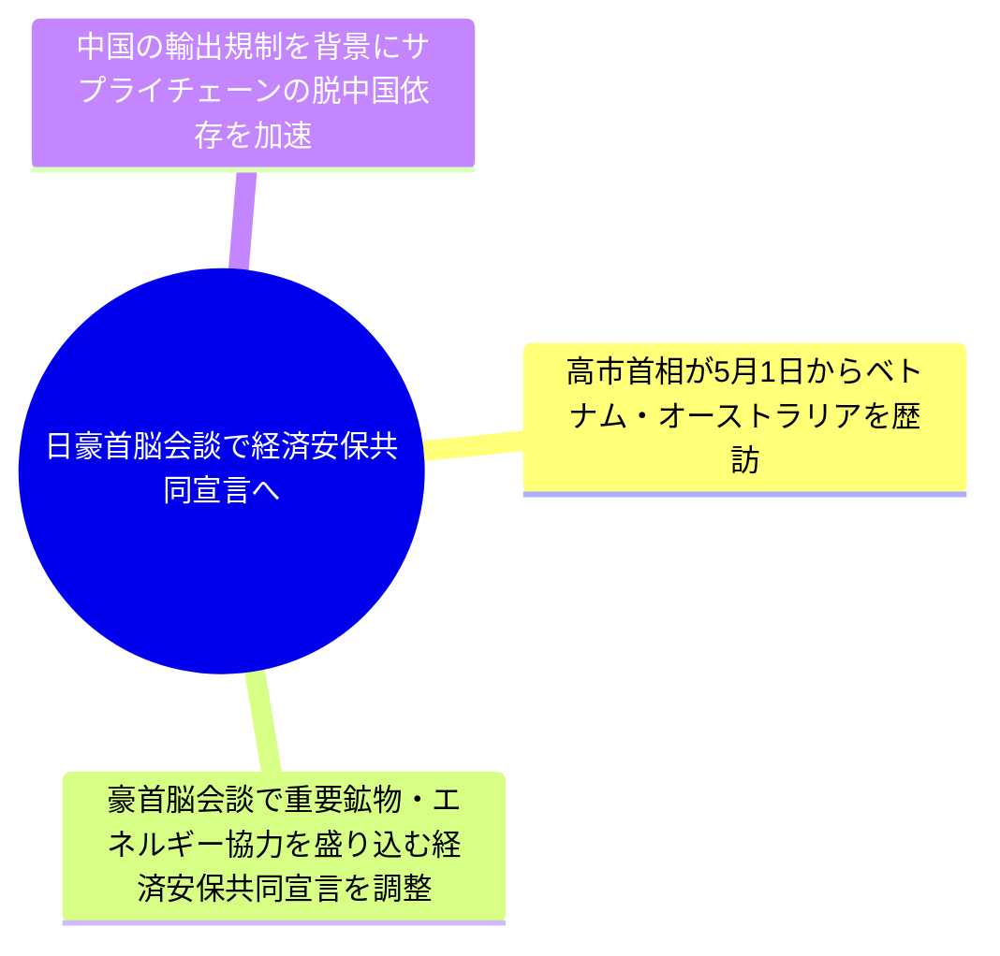
```mermaid
mindmap
  root((日豪首脳会談で経済安保共同宣言へ))
    高市首相が5月1日からベトナム・オーストラリアを歴訪
    豪首脳会談で重要鉱物・エネルギー協力を盛り込む経済安保共同宣言を調整
    中国の輸出規制を背景にサプライチェーンの脱中国依存を加速
```

---

## ゼレンスキー氏、対ロ長距離攻撃を拡大方針 `重要度: 中` `europe / global`
- **出典:** NHK 国際 ([原文](http://www3.nhk.or.jp/news/html/20260430/k10015111251000.html)) / **公開:** 2026-04-30 05:29

**要約**
ウクライナのゼレンスキー大統領は、ロシア国内のエネルギー関連施設に対する長距離攻撃を今後さらに拡大していく方針を表明した。これらの攻撃を「ロシアのテロに対する正当な反撃」と位置づけている。ウクライナは近年、無人機などを用いてロシア領内の製油所や石油関連インフラへの攻撃を増やしており、戦況への影響が注目されている。

**背景**
ロシアによるウクライナの電力・エネルギーインフラへのミサイル・無人機攻撃が続く中、ウクライナは反撃としてロシア国内深部のエネルギー施設への長距離打撃を強化してきた。これにより戦争はより相互にエネルギー基盤を狙う消耗戦の様相を強めている。

**要点**
- ゼレンスキー大統領がロシア領内への長距離攻撃を拡大する方針を表明

- 標的は主にエネルギー関連施設で、ロシアのインフラ攻撃への反撃と位置づけ

- 戦争の地理的拡大とエネルギー市場への波及リスクが高まる

### 経緯タイムライン

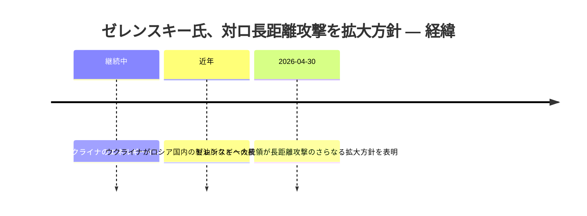
```mermaid
timeline
  title ゼレンスキー氏、対ロ長距離攻撃を拡大方針 — 経緯
  継続中 : ロシアによるウクライナのエネルギーインフラ攻撃が続く
  近年 : ウクライナがロシア国内の製油所などへの長距離攻撃を増加
  2026-04-30 : ゼレンスキー大統領が長距離攻撃のさらなる拡大方針を表明
```

### 当事者マップ

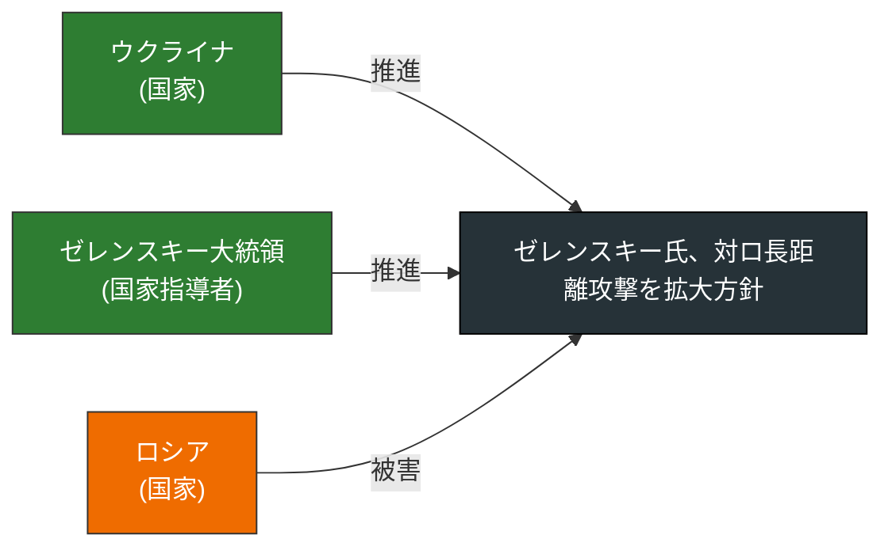
```mermaid
flowchart LR
  T["ゼレンスキー氏、対ロ長距離攻撃を拡大方針"]
  A0["ウクライナ\n(国家)"]
  A0 -- 推進 --> T
  style A0 fill:#2e7d32,color:#fff,stroke:#333
  A1["ゼレンスキー大統領\n(国家指導者)"]
  A1 -- 推進 --> T
  style A1 fill:#2e7d32,color:#fff,stroke:#333
  A2["ロシア\n(国家)"]
  A2 -- 被害 --> T
  style A2 fill:#ef6c00,color:#fff,stroke:#333
  style T fill:#263238,color:#fff,stroke:#000
```

### 影響の広がり

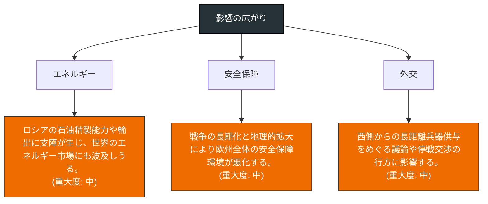
```mermaid
flowchart TB
  R["影響の広がり"]
  D0["エネルギー"]
  I0["ロシアの石油精製能力や輸出に支障が生じ、世界のエネルギー市場にも波及しうる。\n(重大度: 中)"]
  R --> D0 --> I0
  style I0 fill:#ef6c00,color:#fff,stroke:#333
  D1["安全保障"]
  I1["戦争の長期化と地理的拡大により欧州全体の安全保障環境が悪化する。\n(重大度: 中)"]
  R --> D1 --> I1
  style I1 fill:#ef6c00,color:#fff,stroke:#333
  D2["外交"]
  I2["西側からの長距離兵器供与をめぐる議論や停戦交渉の行方に影響する。\n(重大度: 中)"]
  R --> D2 --> I2
  style I2 fill:#ef6c00,color:#fff,stroke:#333
  style R fill:#263238,color:#fff,stroke:#000
```

### 当事者の関係ネットワーク

```mermaid
graph LR
  N0["ウクライナ"]
  N1["ゼレンスキー大統領"]
  N2["ロシア"]
  N0 -->|対立| N2
  N1 -->|支援| N0
  linkStyle 0 stroke:#c62828,stroke-width:3px;
  linkStyle 1 stroke:#2e7d32,stroke-width:2px;
```

### 押さえるべき論点

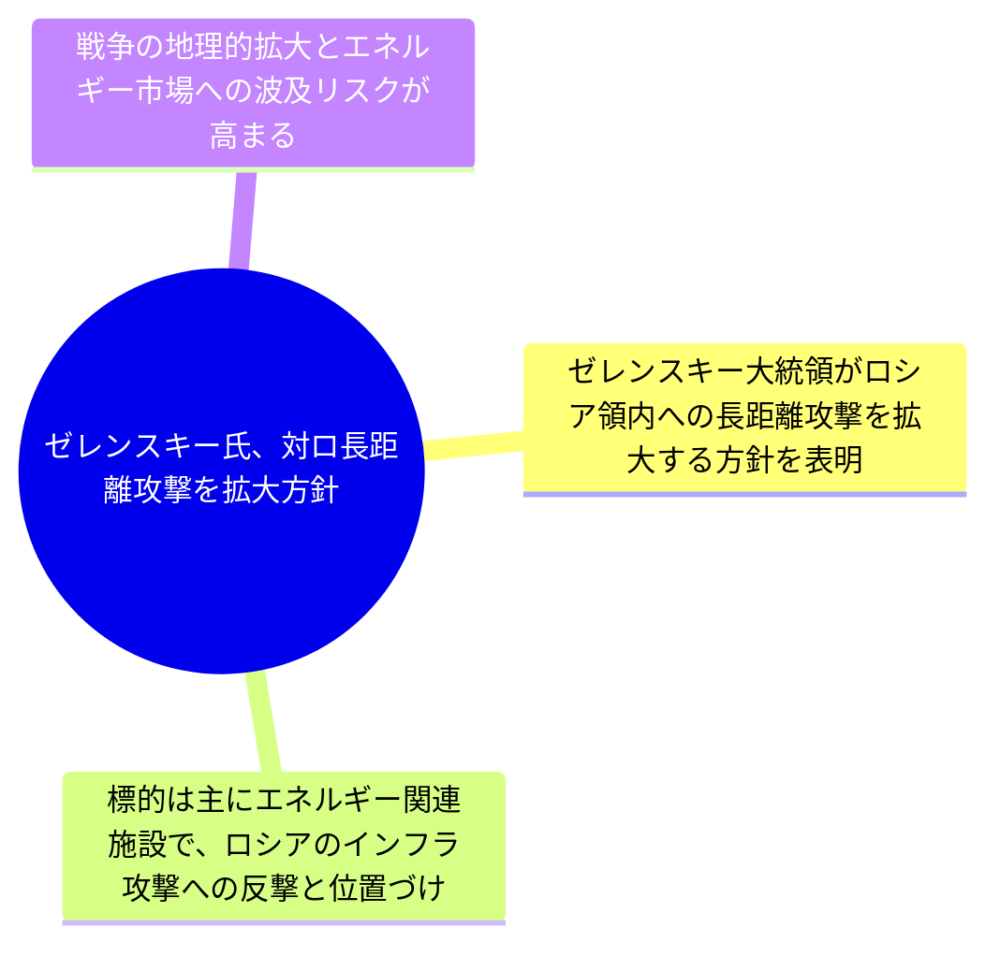
```mermaid
mindmap
  root((ゼレンスキー氏、対ロ長距離攻撃を拡大方針))
    ゼレンスキー大統領がロシア領内への長距離攻撃を拡大する方針を表明
    標的は主にエネルギー関連施設で、ロシアのインフラ攻撃への反撃と位置づけ
    戦争の地理的拡大とエネルギー市場への波及リスクが高まる
```

---

## ウクライナ侵攻継続 4月29日の動き `重要度: 中` `europe / global`
- **出典:** NHK 国際 ([原文](http://www3.nhk.or.jp/news/html/20260429/k10015082761000.html)) / **公開:** 2026-04-29 20:54

**要約**
ロシアによるウクライナへの軍事侵攻が続いており、ウクライナ各地で戦闘が継続している。多数の市民が国外へ避難する人道危機が継続中。NHKは戦況や関係各国の外交動向を随時更新で伝えている。日本時間4月29日の動きとして報じられた。

**背景**
ロシアは2022年2月にウクライナへの全面侵攻を開始し、戦闘は長期化している。欧米諸国はウクライナへの軍事・経済支援を継続する一方、ロシアに対しては制裁を強化してきた。

**要点**
- ロシアによるウクライナ侵攻は4月29日時点でも継続中

- ウクライナ各地で戦闘が続き、多数の市民が国外避難を強いられている

- 関係各国の外交動向を含めた情勢の推移が随時更新で報じられている

### 経緯タイムライン

```mermaid
timeline
  title ウクライナ侵攻継続 4月29日の動き — 経緯
  2022-02-24 : ロシアがウクライナへの全面侵攻を開始
  2026-04-29 : ウクライナ各地で戦闘継続、市民の国外避難が続く
```

### 当事者マップ

```mermaid
flowchart LR
  T["ウクライナ侵攻継続 4月29日の動き"]
  A0["ロシア\n(国家)"]
  A0 -- 推進 --> T
  style A0 fill:#2e7d32,color:#fff,stroke:#333
  A1["ウクライナ\n(国家)"]
  A1 -- 被害 --> T
  style A1 fill:#ef6c00,color:#fff,stroke:#333
  style T fill:#263238,color:#fff,stroke:#000
```

### 影響の広がり

```mermaid
flowchart TB
  R["影響の広がり"]
  D0["安全保障"]
  I0["欧州の安全保障秩序への継続的な脅威となっている。\n(重大度: 高)"]
  R --> D0 --> I0
  style I0 fill:#c62828,color:#fff,stroke:#333
  D1["外交"]
  I1["関係各国の外交対応が続いており国際秩序に影響を与えている。\n(重大度: 中)"]
  R --> D1 --> I1
  style I1 fill:#ef6c00,color:#fff,stroke:#333
  D2["経済"]
  I2["戦闘長期化によるエネルギー・食料供給などへの世界的影響が続く。\n(重大度: 中)"]
  R --> D2 --> I2
  style I2 fill:#ef6c00,color:#fff,stroke:#333
  style R fill:#263238,color:#fff,stroke:#000
```

### 当事者の関係ネットワーク

```mermaid
graph LR
  N0["ロシア"]
  N1["ウクライナ"]
  N0 -->|対立| N1
  linkStyle 0 stroke:#c62828,stroke-width:3px;
```

### 押さえるべき論点

```mermaid
mindmap
  root((ウクライナ侵攻継続 4月29日の動き))
    ロシアによるウクライナ侵攻は4月29日時点でも継続中
    ウクライナ各地で戦闘が続き、多数の市民が国外避難を強いられている
    関係各国の外交動向を含めた情勢の推移が随時更新で報じられている
```

---
