# 地政学ニュース図解レポート 2026-05-01 号

生成日時: 2026-05-01 07:52 / 記事数: 5

## 📌 本日の要点

- **ウクライナ侵攻 4月30日の動き** — ロシアによるウクライナへの軍事侵攻が継続しており、ウクライナ各地で両軍の戦闘が続いている。

- **米ロ電話会談、ロシアが5月停戦に応じる用意** — ロシア大統領府は2026年4月30日、プーチン大統領がトランプ米大統領との電話会談で、5月の対独戦勝記念日に合わせてウクライナとの停戦に応じる用意があると伝えたと明らかにした。

## ウクライナ侵攻 4月30日の動き `重要度: 高` `europe / global`
- **出典:** NHK 国際 ([原文](http://www3.nhk.or.jp/news/html/20260430/k10015082771000.html)) / **公開:** 2026-04-30 15:35

**要約**
ロシアによるウクライナへの軍事侵攻が継続しており、ウクライナ各地で両軍の戦闘が続いている。多数の市民が国外への避難を余儀なくされており、人道状況は深刻なままである。NHKは4月30日(日本時間)の戦闘状況や関係各国の外交動向を随時更新で伝えている。

**背景**
ロシアは2022年2月にウクライナへの全面侵攻を開始し、戦闘は長期化している。各国は対ロ制裁やウクライナへの軍事支援を続ける一方、停戦に向けた外交努力も模索されている。

**要点**
- ロシアによるウクライナ侵攻が継続し、各地で戦闘が続いている

- 大勢の市民が国外避難を強いられ、人道状況が深刻

- 関係各国の外交動向も含めて情勢が注視されている

### 経緯タイムライン

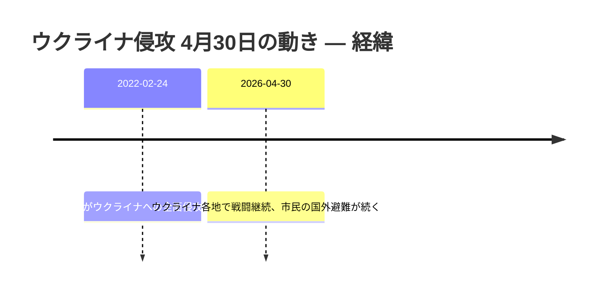
```mermaid
timeline
  title ウクライナ侵攻 4月30日の動き — 経緯
  2022-02-24 : ロシアがウクライナへの全面侵攻を開始
  2026-04-30 : ウクライナ各地で戦闘継続、市民の国外避難が続く
```

### 当事者マップ

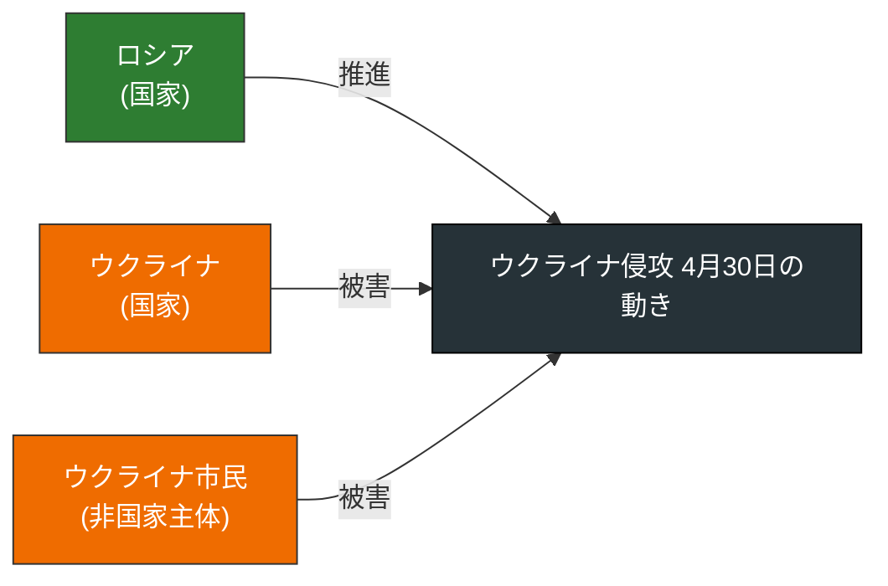
```mermaid
flowchart LR
  T["ウクライナ侵攻 4月30日の動き"]
  A0["ロシア\n(国家)"]
  A0 -- 推進 --> T
  style A0 fill:#2e7d32,color:#fff,stroke:#333
  A1["ウクライナ\n(国家)"]
  A1 -- 被害 --> T
  style A1 fill:#ef6c00,color:#fff,stroke:#333
  A2["ウクライナ市民\n(非国家主体)"]
  A2 -- 被害 --> T
  style A2 fill:#ef6c00,color:#fff,stroke:#333
  style T fill:#263238,color:#fff,stroke:#000
```

### 影響の広がり

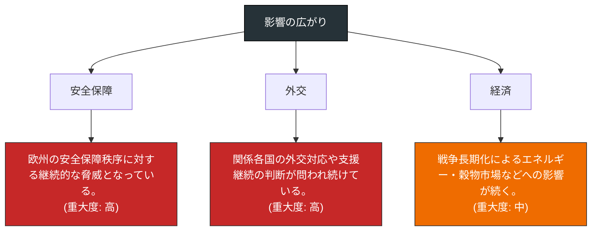
```mermaid
flowchart TB
  R["影響の広がり"]
  D0["安全保障"]
  I0["欧州の安全保障秩序に対する継続的な脅威となっている。\n(重大度: 高)"]
  R --> D0 --> I0
  style I0 fill:#c62828,color:#fff,stroke:#333
  D1["外交"]
  I1["関係各国の外交対応や支援継続の判断が問われ続けている。\n(重大度: 高)"]
  R --> D1 --> I1
  style I1 fill:#c62828,color:#fff,stroke:#333
  D2["経済"]
  I2["戦争長期化によるエネルギー・穀物市場などへの影響が続く。\n(重大度: 中)"]
  R --> D2 --> I2
  style I2 fill:#ef6c00,color:#fff,stroke:#333
  style R fill:#263238,color:#fff,stroke:#000
```

### 当事者の関係ネットワーク

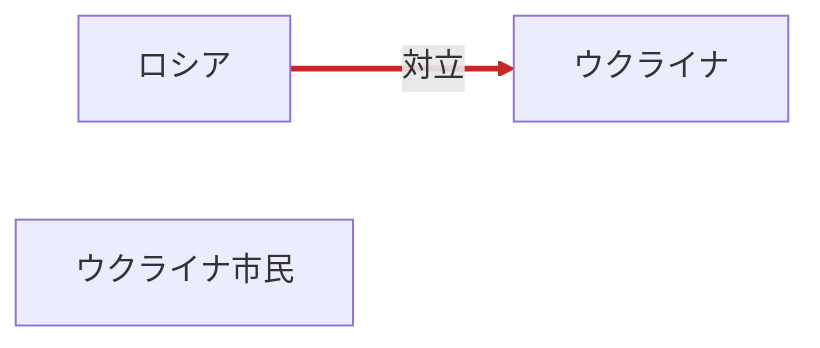
```mermaid
graph LR
  N0["ロシア"]
  N1["ウクライナ"]
  N2["ウクライナ市民"]
  N0 -->|対立| N1
  linkStyle 0 stroke:#c62828,stroke-width:3px;
```

### 押さえるべき論点

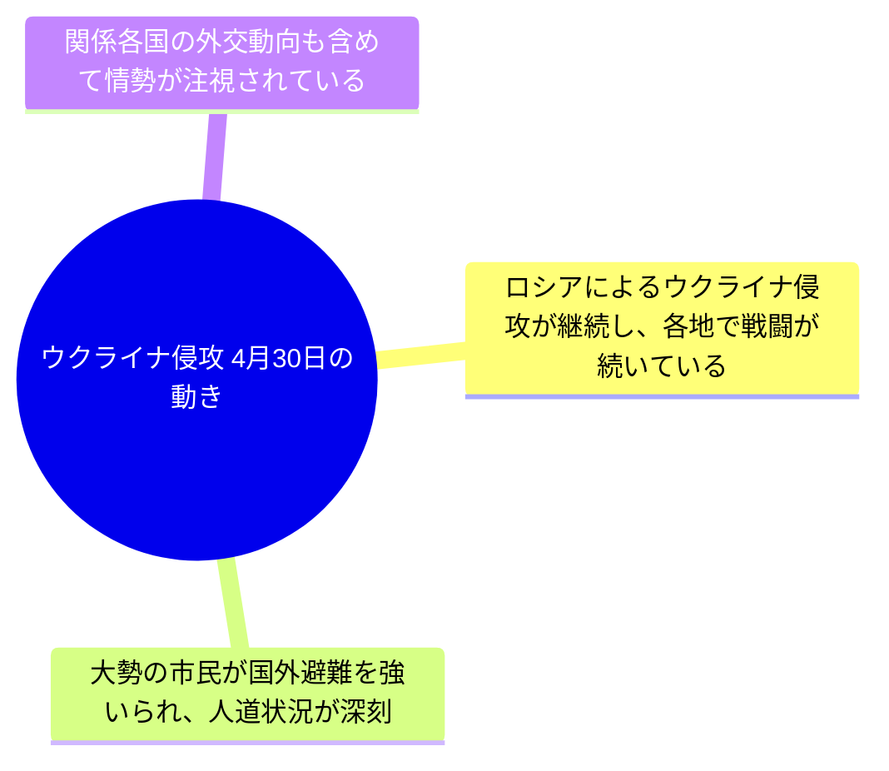
```mermaid
mindmap
  root((ウクライナ侵攻 4月30日の動き))
    ロシアによるウクライナ侵攻が継続し、各地で戦闘が続いている
    大勢の市民が国外避難を強いられ、人道状況が深刻
    関係各国の外交動向も含めて情勢が注視されている
```

---

## 米ロ電話会談、ロシアが5月停戦に応じる用意 `重要度: 高` `europe / global`
- **出典:** NHK 国際 ([原文](http://www3.nhk.or.jp/news/html/20260430/k10015111241000.html)) / **公開:** 2026-04-30 08:17

**要約**
ロシア大統領府は2026年4月30日、プーチン大統領がトランプ米大統領との電話会談で、5月の対独戦勝記念日に合わせてウクライナとの停戦に応じる用意があると伝えたと明らかにした。停戦の具体的な条件や期間、ウクライナ側の同意状況については現時点で詳細は示されていない。トランプ政権が進める停戦仲介の流れの中で、ロシア側が象徴的な日付に合わせて譲歩姿勢を示した形となる。実現すれば2022年の侵攻開始以来、初の本格的停戦となる可能性がある。

**背景**
2022年2月のロシアによるウクライナ侵攻以降、戦闘は4年以上続いてきた。トランプ米大統領は就任後、停戦実現を最優先課題の一つに掲げ、米ロ・米ウクライナ間で断続的な協議を進めてきた。

**要点**
- プーチン氏がトランプ氏との電話会談で5月の戦勝記念日に合わせた停戦の用意を表明

- ウクライナ側の同意や停戦の具体条件は明らかでなく、実現性には不透明さが残る

- 実現すれば2022年の侵攻開始以来初の本格的停戦となり、欧州安全保障に大きな転換点をもたらす

### 経緯タイムライン

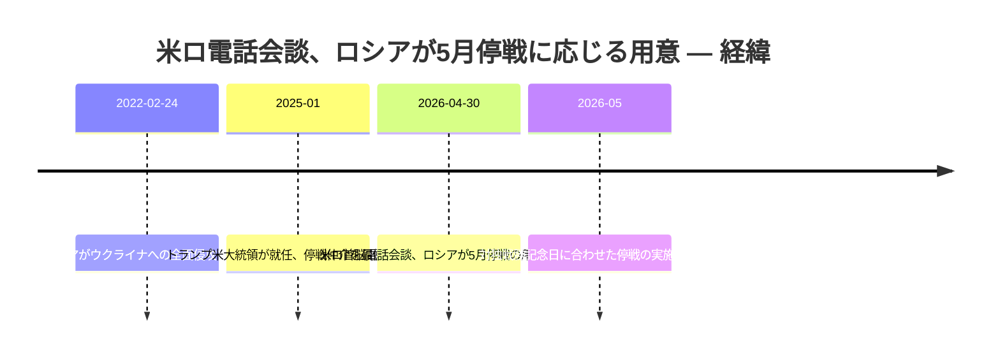
```mermaid
timeline
  title 米ロ電話会談、ロシアが5月停戦に応じる用意 — 経緯
  2022-02-24 : ロシアがウクライナへの全面侵攻を開始
  2025-01 : トランプ米大統領が就任、停戦仲介を最優先課題に
  2026-04-30 : 米ロ首脳電話会談、ロシアが5月停戦の用意を表明
  2026-05 : 対独戦勝記念日に合わせた停戦の実施が焦点に
```

### 当事者マップ

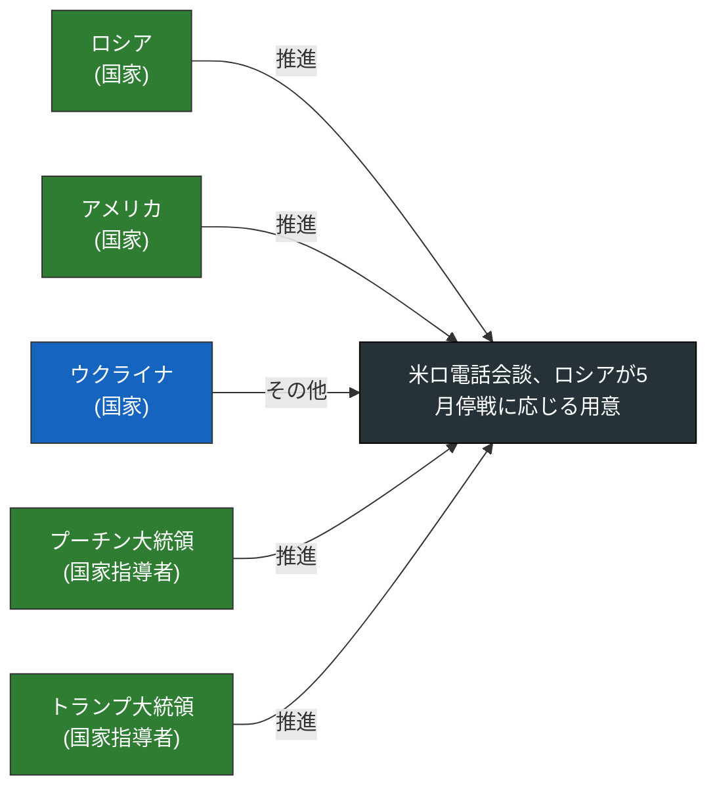
```mermaid
flowchart LR
  T["米ロ電話会談、ロシアが5月停戦に応じる用意"]
  A0["ロシア\n(国家)"]
  A0 -- 推進 --> T
  style A0 fill:#2e7d32,color:#fff,stroke:#333
  A1["アメリカ\n(国家)"]
  A1 -- 推進 --> T
  style A1 fill:#2e7d32,color:#fff,stroke:#333
  A2["ウクライナ\n(国家)"]
  A2 -- その他 --> T
  style A2 fill:#1565c0,color:#fff,stroke:#333
  A3["プーチン大統領\n(国家指導者)"]
  A3 -- 推進 --> T
  style A3 fill:#2e7d32,color:#fff,stroke:#333
  A4["トランプ大統領\n(国家指導者)"]
  A4 -- 推進 --> T
  style A4 fill:#2e7d32,color:#fff,stroke:#333
  style T fill:#263238,color:#fff,stroke:#000
```

### 影響の広がり

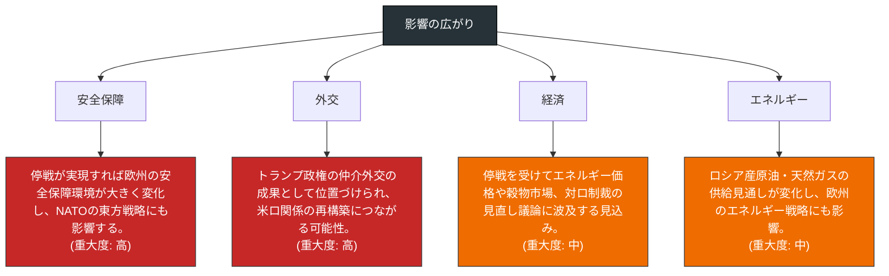
```mermaid
flowchart TB
  R["影響の広がり"]
  D0["安全保障"]
  I0["停戦が実現すれば欧州の安全保障環境が大きく変化し、NATOの東方戦略にも影響する。\n(重大度: 高)"]
  R --> D0 --> I0
  style I0 fill:#c62828,color:#fff,stroke:#333
  D1["外交"]
  I1["トランプ政権の仲介外交の成果として位置づけられ、米ロ関係の再構築につながる可能性。\n(重大度: 高)"]
  R --> D1 --> I1
  style I1 fill:#c62828,color:#fff,stroke:#333
  D2["経済"]
  I2["停戦を受けてエネルギー価格や穀物市場、対ロ制裁の見直し議論に波及する見込み。\n(重大度: 中)"]
  R --> D2 --> I2
  style I2 fill:#ef6c00,color:#fff,stroke:#333
  D3["エネルギー"]
  I3["ロシア産原油・天然ガスの供給見通しが変化し、欧州のエネルギー戦略にも影響。\n(重大度: 中)"]
  R --> D3 --> I3
  style I3 fill:#ef6c00,color:#fff,stroke:#333
  style R fill:#263238,color:#fff,stroke:#000
```

### 当事者の関係ネットワーク

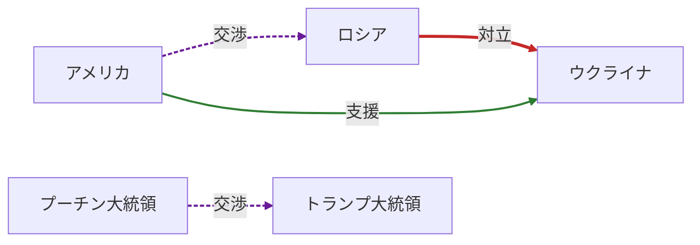
```mermaid
graph LR
  N0["ロシア"]
  N1["アメリカ"]
  N2["ウクライナ"]
  N3["プーチン大統領"]
  N4["トランプ大統領"]
  N0 -->|対立| N2
  N1 -->|交渉| N0
  N1 -->|支援| N2
  N3 -->|交渉| N4
  linkStyle 0 stroke:#c62828,stroke-width:3px;
  linkStyle 1 stroke:#6a1b9a,stroke-width:2px,stroke-dasharray:4 2;
  linkStyle 2 stroke:#2e7d32,stroke-width:2px;
  linkStyle 3 stroke:#6a1b9a,stroke-width:2px,stroke-dasharray:4 2;
```

### 押さえるべき論点

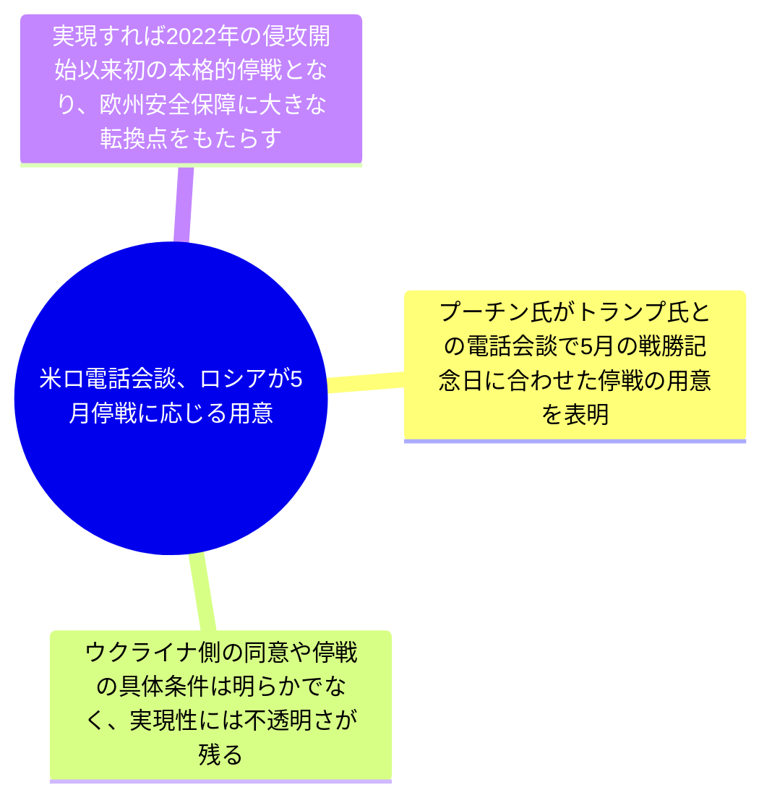
```mermaid
mindmap
  root((米ロ電話会談、ロシアが5月停戦に応じる用意))
    プーチン氏がトランプ氏との電話会談で5月の戦勝記念日に合わせた停戦の用意を表明
    ウクライナ側の同意や停戦の具体条件は明らかでなく、実現性には不透明さが残る
    実現すれば2022年の侵攻開始以来初の本格的停戦となり、欧州安全保障に大きな転換点をもたらす
```

---

## ロシア占領地穀物船、イスラエル領海外へ `重要度: 中` `europe / middle_east`
- **出典:** NHK 国際 ([原文](http://www3.nhk.or.jp/news/html/20260501/k10015112311000.html)) / **公開:** 2026-05-01 05:32

**要約**
ウクライナのゼレンスキー大統領が、ロシア占領下のウクライナ地域から積み出された穀物を載せた船の入港をイスラエル政府が容認する姿勢を示しているとして批判していた問題で、イスラエル側はこの船が領海から退去することを決めたと通知を受けたと明らかにした。ウクライナ側は占領地からの穀物輸出を「窃取された農産物の取引」として国際的な非難を呼びかけており、イスラエルへの圧力が一定の効果を上げた形となる。一方、戦時下における第三国の対応や海運ルートをめぐる論争は今後も続く見通し。

**背景**
ロシアによるウクライナ侵攻以降、ロシア占領地で生産・収穫された穀物が黒海経由で第三国に輸出される事例が報告され、ウクライナは「略奪穀物」として各国に取引拒否を求めてきた。今回はイスラエルが受け入れる構えを見せたとされ、ゼレンスキー大統領が直接批判したことで外交問題化していた。

**要点**
- ロシア占領地産とされる穀物船がイスラエル領海から退去することが決まった

- ゼレンスキー大統領の批判を受けたイスラエルの対応転換が背景にある

- 占領地産穀物の国際取引をめぐる規範形成が改めて問われている

### 経緯タイムライン

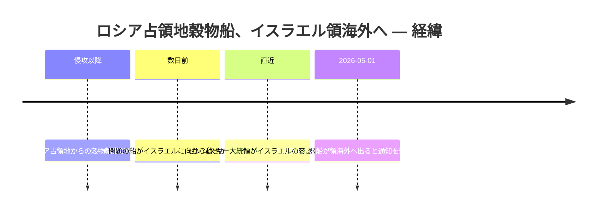
```mermaid
timeline
  title ロシア占領地穀物船、イスラエル領海外へ — 経緯
  侵攻以降 : ロシア占領地からの穀物輸出が問題化
  数日前 : 問題の船がイスラエルに向かう動きが表面化
  直近 : ゼレンスキー大統領がイスラエルの容認姿勢を批判
  2026-05-01 : イスラエル、船が領海外へ出ると通知を受けたと発表
```

### 当事者マップ

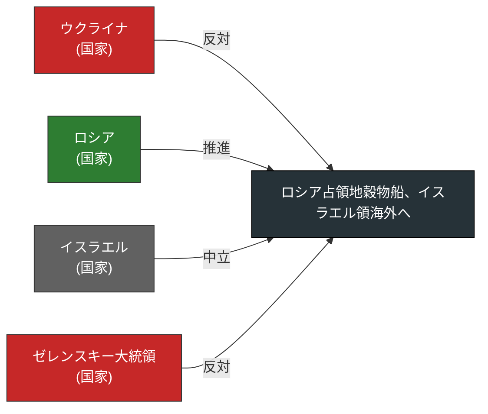
```mermaid
flowchart LR
  T["ロシア占領地穀物船、イスラエル領海外へ"]
  A0["ウクライナ\n(国家)"]
  A0 -- 反対 --> T
  style A0 fill:#c62828,color:#fff,stroke:#333
  A1["ロシア\n(国家)"]
  A1 -- 推進 --> T
  style A1 fill:#2e7d32,color:#fff,stroke:#333
  A2["イスラエル\n(国家)"]
  A2 -- 中立 --> T
  style A2 fill:#616161,color:#fff,stroke:#333
  A3["ゼレンスキー大統領\n(国家)"]
  A3 -- 反対 --> T
  style A3 fill:#c62828,color:#fff,stroke:#333
  style T fill:#263238,color:#fff,stroke:#000
```

### 影響の広がり

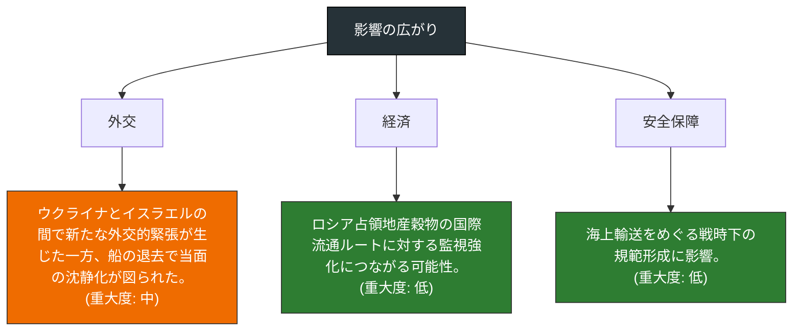
```mermaid
flowchart TB
  R["影響の広がり"]
  D0["外交"]
  I0["ウクライナとイスラエルの間で新たな外交的緊張が生じた一方、船の退去で当面の沈静化が図られた。\n(重大度: 中)"]
  R --> D0 --> I0
  style I0 fill:#ef6c00,color:#fff,stroke:#333
  D1["経済"]
  I1["ロシア占領地産穀物の国際流通ルートに対する監視強化につながる可能性。\n(重大度: 低)"]
  R --> D1 --> I1
  style I1 fill:#2e7d32,color:#fff,stroke:#333
  D2["安全保障"]
  I2["海上輸送をめぐる戦時下の規範形成に影響。\n(重大度: 低)"]
  R --> D2 --> I2
  style I2 fill:#2e7d32,color:#fff,stroke:#333
  style R fill:#263238,color:#fff,stroke:#000
```

### 当事者の関係ネットワーク

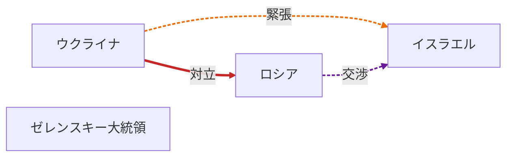
```mermaid
graph LR
  N0["ウクライナ"]
  N1["ロシア"]
  N2["イスラエル"]
  N3["ゼレンスキー大統領"]
  N0 -->|対立| N1
  N0 -->|緊張| N2
  N1 -->|交渉| N2
  linkStyle 0 stroke:#c62828,stroke-width:3px;
  linkStyle 1 stroke:#ef6c00,stroke-width:2px,stroke-dasharray:4 2;
  linkStyle 2 stroke:#6a1b9a,stroke-width:2px,stroke-dasharray:4 2;
```

### 押さえるべき論点

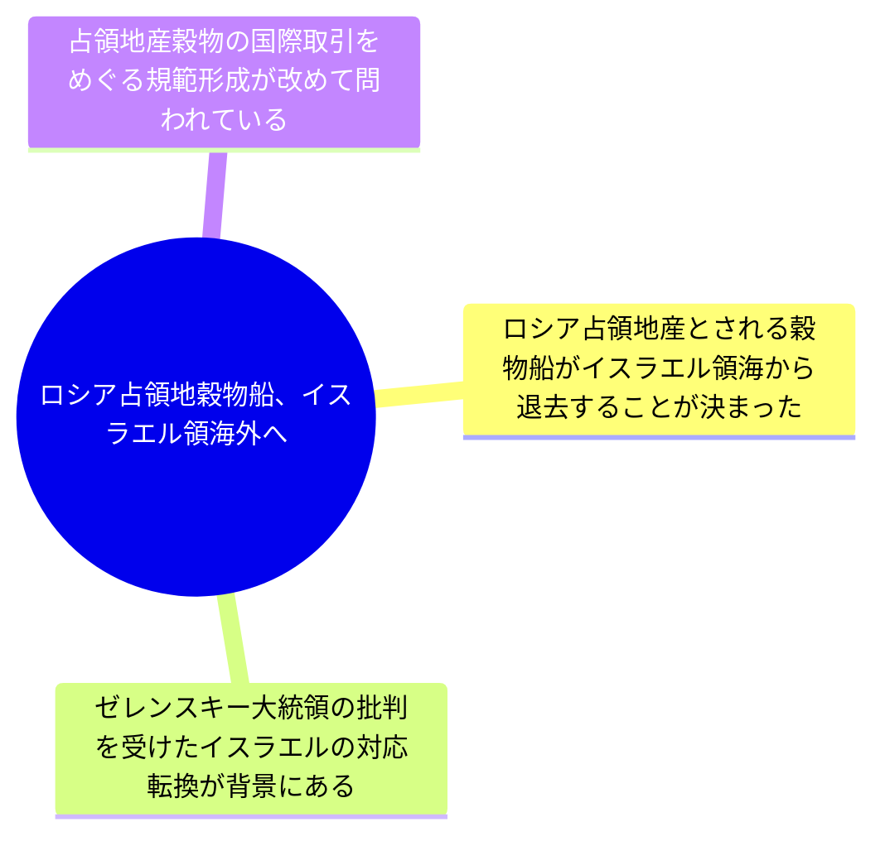
```mermaid
mindmap
  root((ロシア占領地穀物船、イスラエル領海外へ))
    ロシア占領地産とされる穀物船がイスラエル領海から退去することが決まった
    ゼレンスキー大統領の批判を受けたイスラエルの対応転換が背景にある
    占領地産穀物の国際取引をめぐる規範形成が改めて問われている
```

---

## 岸田氏、比大統領とエネルギー協力で一致 `重要度: 中` `southeast_asia / east_asia / middle_east`
- **出典:** NHK 国際 ([原文](http://www3.nhk.or.jp/news/html/20260430/k10015111951000.html)) / **公開:** 2026-04-30 19:49

**要約**
自民党の岸田文雄元総理大臣はフィリピンを訪問し、マルコス大統領と会談した。中東情勢の不安定化を踏まえ、アジアにおけるエネルギー供給の確保がいっそう重要になっているとの認識を共有した。両者はエネルギー分野での日比協力を強化していくことで一致した。中東依存度の高い日本とフィリピンにとって、供給多角化と安定確保が共通課題となっている。

**背景**
日本は原油の約9割、LNGの約4割を中東に依存し、ガザ紛争や紅海でのフーシ攻撃、イラン核問題を巡る緊張で中東のエネルギー供給リスクが高まっている。フィリピンも中東石油への依存度が高く、南シナ海情勢で中国との緊張も抱える中、日本との連携強化を模索している。

**要点**
- 岸田元首相が訪比しマルコス大統領とエネルギー協力強化で一致

- 背景には中東情勢の不安定化によるアジアの供給リスクの高まり

- 中東依存が高い日本にとって、東南アジアとの域内連携は供給多角化の一手

### 経緯タイムライン

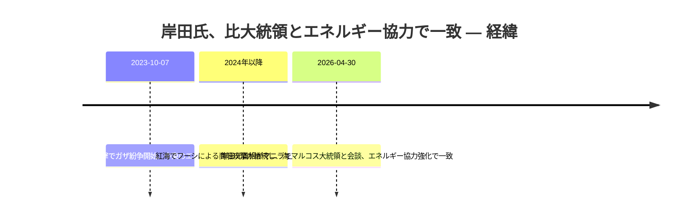
```mermaid
timeline
  title 岸田氏、比大統領とエネルギー協力で一致 — 経緯
  2023-10-07 : ハマスのイスラエル攻撃でガザ紛争開始、中東のエネルギー供給リスク拡大
  2024年以降 : 紅海でフーシによる商船攻撃が継続し、海上輸送に混乱
  2026-04-30 : 岸田元首相がマニラでマルコス大統領と会談、エネルギー協力強化で一致
```

### 当事者マップ

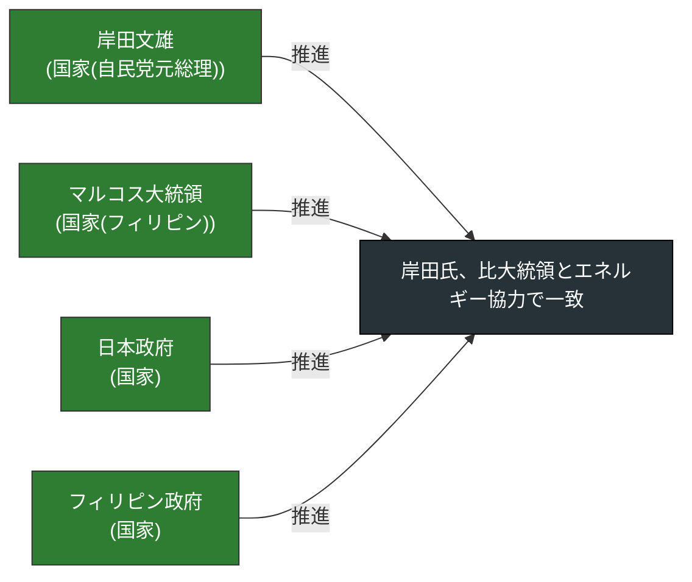
```mermaid
flowchart LR
  T["岸田氏、比大統領とエネルギー協力で一致"]
  A0["岸田文雄\n(国家(自民党元総理))"]
  A0 -- 推進 --> T
  style A0 fill:#2e7d32,color:#fff,stroke:#333
  A1["マルコス大統領\n(国家(フィリピン))"]
  A1 -- 推進 --> T
  style A1 fill:#2e7d32,color:#fff,stroke:#333
  A2["日本政府\n(国家)"]
  A2 -- 推進 --> T
  style A2 fill:#2e7d32,color:#fff,stroke:#333
  A3["フィリピン政府\n(国家)"]
  A3 -- 推進 --> T
  style A3 fill:#2e7d32,color:#fff,stroke:#333
  style T fill:#263238,color:#fff,stroke:#000
```

### 影響の広がり

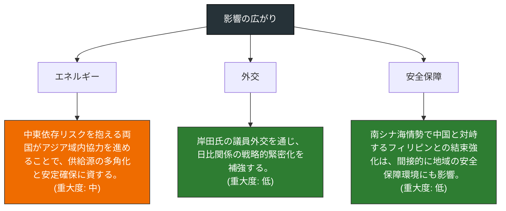
```mermaid
flowchart TB
  R["影響の広がり"]
  D0["エネルギー"]
  I0["中東依存リスクを抱える両国がアジア域内協力を進めることで、供給源の多角化と安定確保に資する。\n(重大度: 中)"]
  R --> D0 --> I0
  style I0 fill:#ef6c00,color:#fff,stroke:#333
  D1["外交"]
  I1["岸田氏の議員外交を通じ、日比関係の戦略的緊密化を補強する。\n(重大度: 低)"]
  R --> D1 --> I1
  style I1 fill:#2e7d32,color:#fff,stroke:#333
  D2["安全保障"]
  I2["南シナ海情勢で中国と対峙するフィリピンとの結束強化は、間接的に地域の安全保障環境にも影響。\n(重大度: 低)"]
  R --> D2 --> I2
  style I2 fill:#2e7d32,color:#fff,stroke:#333
  style R fill:#263238,color:#fff,stroke:#000
```

### 当事者の関係ネットワーク

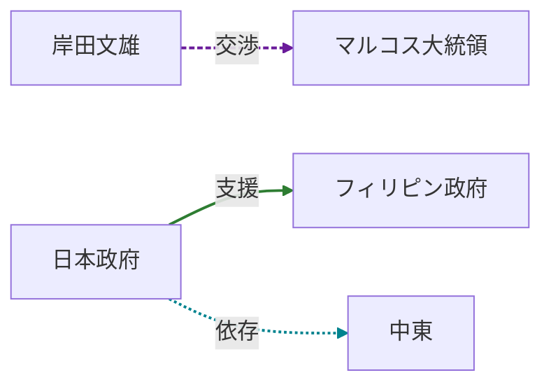
```mermaid
graph LR
  N0["岸田文雄"]
  N1["マルコス大統領"]
  N2["日本政府"]
  N3["フィリピン政府"]
  N2 -->|支援| N3
  N0 -->|交渉| N1
  N4["中東"]
  N2 -->|依存| N4
  linkStyle 0 stroke:#2e7d32,stroke-width:2px;
  linkStyle 1 stroke:#6a1b9a,stroke-width:2px,stroke-dasharray:4 2;
  linkStyle 2 stroke:#00838f,stroke-width:2px,stroke-dasharray:2 2;
```

### 押さえるべき論点

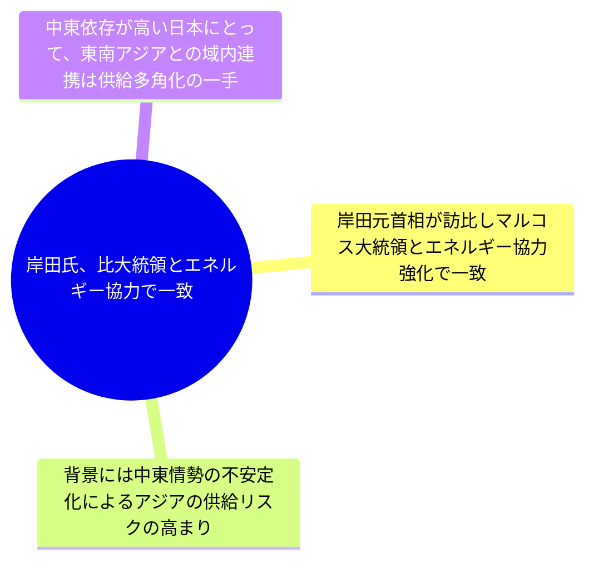
```mermaid
mindmap
  root((岸田氏、比大統領とエネルギー協力で一致))
    岸田元首相が訪比しマルコス大統領とエネルギー協力強化で一致
    背景には中東情勢の不安定化によるアジアの供給リスクの高まり
    中東依存が高い日本にとって、東南アジアとの域内連携は供給多角化の一手
```

---

重要度「低」の記事(1本) — 見出しのみ

- **台湾で再生医療細胞量産工場開所、日本受注拡大に期待** ([原文](http://www3.nhk.or.jp/news/html/20260430/k10015111911000.html)) — NHK 国際

