# 地政学ニュース図解レポート 2026-05-02 号

生成日時: 2026-05-02 07:46 / 記事数: 5

## 📌 本日の要点

- **ウクライナ侵攻継続、5月1日の動き** — ロシアによるウクライナへの軍事侵攻が続いており、各地で両軍の戦闘が継続している。

- **北朝鮮、安保理で核保有正当化** — 国連安全保障理事会で北朝鮮を巡る会合が開催され、北朝鮮代表は「世界は弱肉強食の時代に戻りつつある」と主張し、自国の核保有を正当化する論陣を張った。

## ウクライナ侵攻継続、5月1日の動き `重要度: 高` `europe / global`
- **出典:** NHK 国際 ([原文](http://www3.nhk.or.jp/news/html/20260501/k10015101741000.html)) / **公開:** 2026-05-01 20:50

**要約**
ロシアによるウクライナへの軍事侵攻が続いており、各地で両軍の戦闘が継続している。多数の市民が国外へ避難する状況が続く。NHKは戦闘状況や関係各国の外交動向について、5月1日の動きを随時更新で伝えている。

**背景**
2022年2月に始まったロシアによるウクライナ侵攻は長期化し、欧米諸国による対ロ制裁とウクライナ支援が続く一方、戦闘は東部・南部を中心に膠着している。日本もG7の一員として制裁とウクライナ支援に参加している。

**要点**
- ウクライナ各地でロシア軍とウクライナ軍の戦闘が継続している

- 大勢の市民が国外避難を余儀なくされ人道危機が続く

- 戦況だけでなく関係各国の外交動向も注目される局面

### 経緯タイムライン

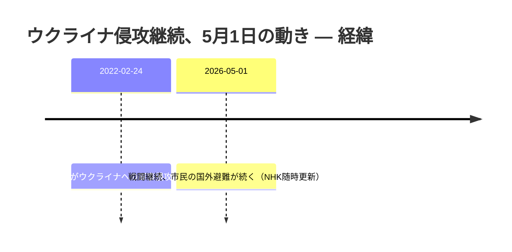
```mermaid
timeline
  title ウクライナ侵攻継続、5月1日の動き — 経緯
  2022-02-24 : ロシアがウクライナへの軍事侵攻を開始
  2026-05-01 : 戦闘継続、市民の国外避難が続く（NHK随時更新）
```

### 当事者マップ

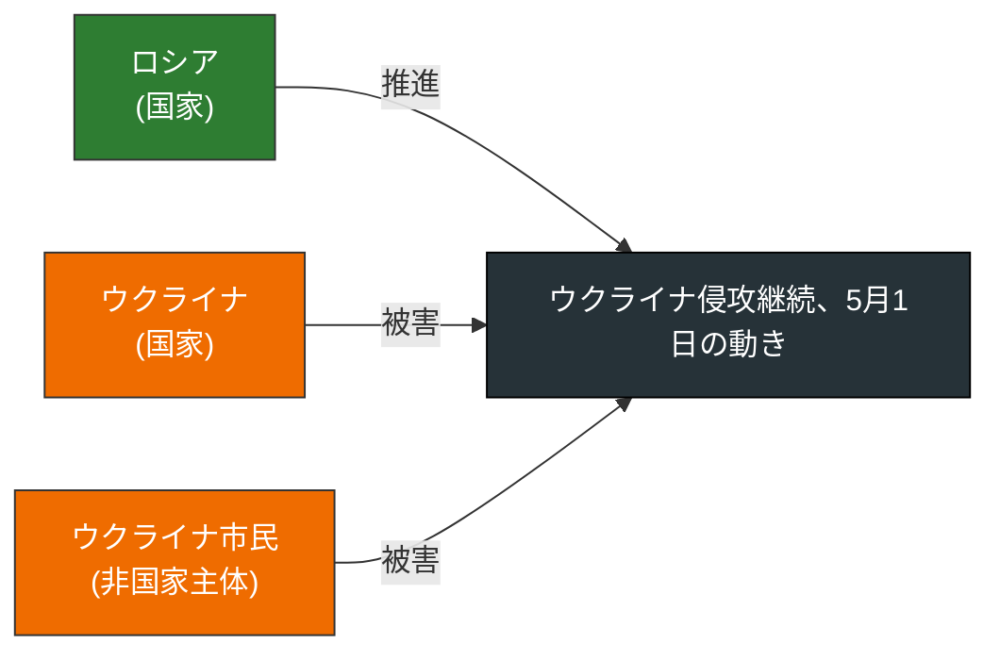
```mermaid
flowchart LR
  T["ウクライナ侵攻継続、5月1日の動き"]
  A0["ロシア\n(国家)"]
  A0 -- 推進 --> T
  style A0 fill:#2e7d32,color:#fff,stroke:#333
  A1["ウクライナ\n(国家)"]
  A1 -- 被害 --> T
  style A1 fill:#ef6c00,color:#fff,stroke:#333
  A2["ウクライナ市民\n(非国家主体)"]
  A2 -- 被害 --> T
  style A2 fill:#ef6c00,color:#fff,stroke:#333
  style T fill:#263238,color:#fff,stroke:#000
```

### 影響の広がり

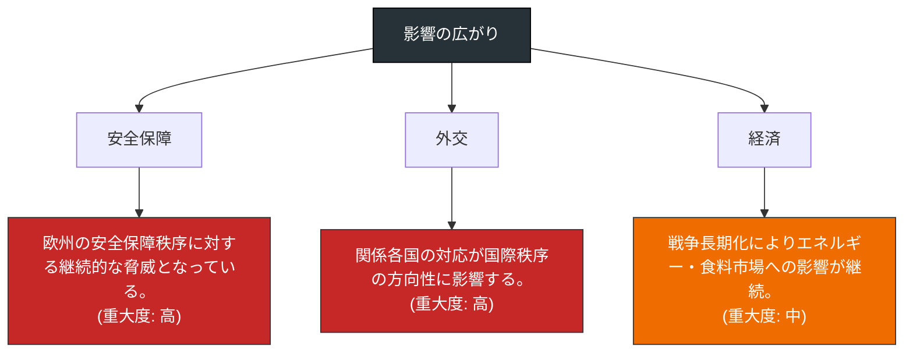
```mermaid
flowchart TB
  R["影響の広がり"]
  D0["安全保障"]
  I0["欧州の安全保障秩序に対する継続的な脅威となっている。\n(重大度: 高)"]
  R --> D0 --> I0
  style I0 fill:#c62828,color:#fff,stroke:#333
  D1["外交"]
  I1["関係各国の対応が国際秩序の方向性に影響する。\n(重大度: 高)"]
  R --> D1 --> I1
  style I1 fill:#c62828,color:#fff,stroke:#333
  D2["経済"]
  I2["戦争長期化によりエネルギー・食料市場への影響が継続。\n(重大度: 中)"]
  R --> D2 --> I2
  style I2 fill:#ef6c00,color:#fff,stroke:#333
  style R fill:#263238,color:#fff,stroke:#000
```

### 当事者の関係ネットワーク

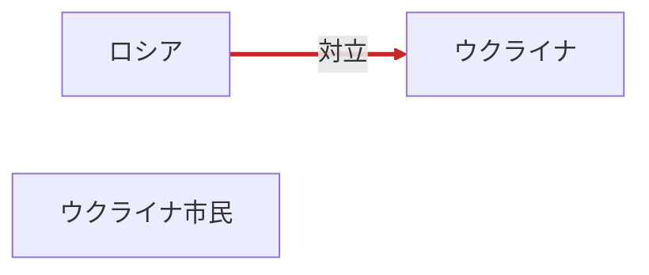
```mermaid
graph LR
  N0["ロシア"]
  N1["ウクライナ"]
  N2["ウクライナ市民"]
  N0 -->|対立| N1
  linkStyle 0 stroke:#c62828,stroke-width:3px;
```

### 押さえるべき論点

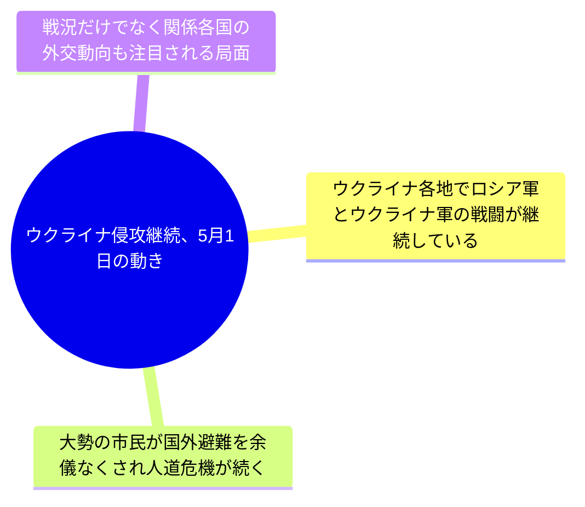
```mermaid
mindmap
  root((ウクライナ侵攻継続、5月1日の動き))
    ウクライナ各地でロシア軍とウクライナ軍の戦闘が継続している
    大勢の市民が国外避難を余儀なくされ人道危機が続く
    戦況だけでなく関係各国の外交動向も注目される局面
```

---

## 北朝鮮、安保理で核保有正当化 `重要度: 高` `east_asia / global`
- **出典:** NHK 国際 ([原文](http://www3.nhk.or.jp/news/html/20260501/k10015112391000.html)) / **公開:** 2026-05-01 09:05

**要約**
国連安全保障理事会で北朝鮮を巡る会合が開催され、北朝鮮代表は「世界は弱肉強食の時代に戻りつつある」と主張し、自国の核保有を正当化する論陣を張った。NPT再検討会議が続く中での発言であり、北朝鮮はかつてNPTからの脱退を一方的に宣言した経緯がある。国際社会が核軍縮を議論する場で、逆に核武装の必要性を訴える姿勢が鮮明となった。

**背景**
北朝鮮は2003年にNPT脱退を一方的に宣言し、その後核実験を繰り返し事実上の核保有国となった。現在NPT再検討会議が開催中で、核軍縮・不拡散の枠組みが揺らぐ中、安保理は北朝鮮の核・ミサイル問題を継続協議している。

**要点**
- 北朝鮮が安保理の場で「弱肉強食の時代」と主張し核保有を正当化

- NPT再検討会議開催中のタイミングで、不拡散体制への挑戦が鮮明化

- 日本など周辺国の安全保障環境への影響は深刻、抑止力強化の議論を加速させる可能性

### 経緯タイムライン

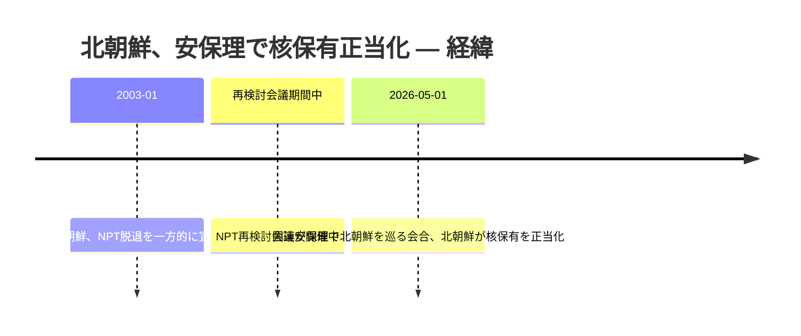
```mermaid
timeline
  title 北朝鮮、安保理で核保有正当化 — 経緯
  2003-01 : 北朝鮮、NPT脱退を一方的に宣言
  再検討会議期間中 : NPT再検討会議が開催中
  2026-05-01 : 国連安保理で北朝鮮を巡る会合、北朝鮮が核保有を正当化
```

### 当事者マップ

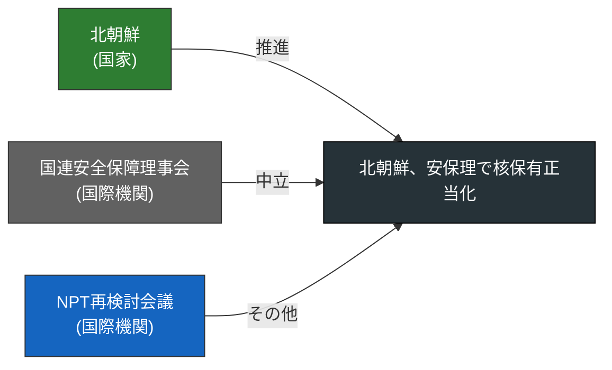
```mermaid
flowchart LR
  T["北朝鮮、安保理で核保有正当化"]
  A0["北朝鮮\n(国家)"]
  A0 -- 推進 --> T
  style A0 fill:#2e7d32,color:#fff,stroke:#333
  A1["国連安全保障理事会\n(国際機関)"]
  A1 -- 中立 --> T
  style A1 fill:#616161,color:#fff,stroke:#333
  A2["NPT再検討会議\n(国際機関)"]
  A2 -- その他 --> T
  style A2 fill:#1565c0,color:#fff,stroke:#333
  style T fill:#263238,color:#fff,stroke:#000
```

### 影響の広がり

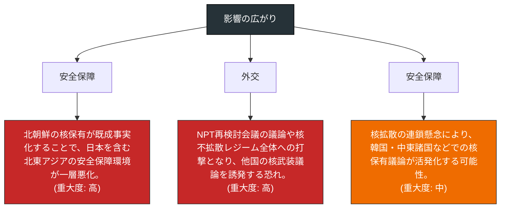
```mermaid
flowchart TB
  R["影響の広がり"]
  D0["安全保障"]
  I0["北朝鮮の核保有が既成事実化することで、日本を含む北東アジアの安全保障環境が一層悪化。\n(重大度: 高)"]
  R --> D0 --> I0
  style I0 fill:#c62828,color:#fff,stroke:#333
  D1["外交"]
  I1["NPT再検討会議の議論や核不拡散レジーム全体への打撃となり、他国の核武装議論を誘発する恐れ。\n(重大度: 高)"]
  R --> D1 --> I1
  style I1 fill:#c62828,color:#fff,stroke:#333
  D2["安全保障"]
  I2["核拡散の連鎖懸念により、韓国・中東諸国などでの核保有議論が活発化する可能性。\n(重大度: 中)"]
  R --> D2 --> I2
  style I2 fill:#ef6c00,color:#fff,stroke:#333
  style R fill:#263238,color:#fff,stroke:#000
```

### 当事者の関係ネットワーク

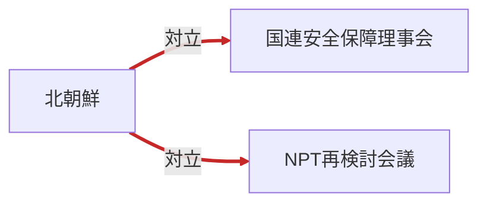
```mermaid
graph LR
  N0["北朝鮮"]
  N1["国連安全保障理事会"]
  N2["NPT再検討会議"]
  N0 -->|対立| N1
  N0 -->|対立| N2
  linkStyle 0 stroke:#c62828,stroke-width:3px;
  linkStyle 1 stroke:#c62828,stroke-width:3px;
```

### 押さえるべき論点

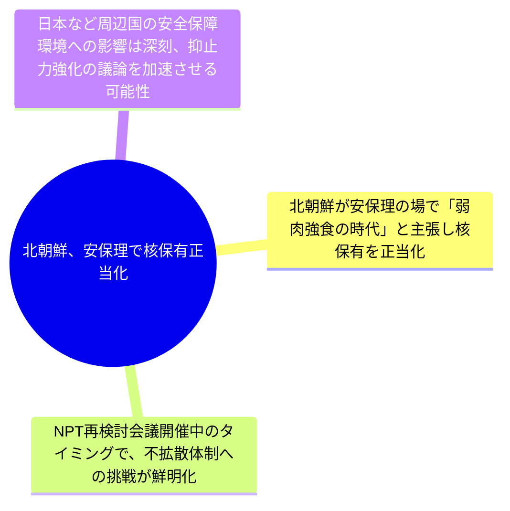
```mermaid
mindmap
  root((北朝鮮、安保理で核保有正当化))
    北朝鮮が安保理の場で「弱肉強食の時代」と主張し核保有を正当化
    NPT再検討会議開催中のタイミングで、不拡散体制への挑戦が鮮明化
    日本など周辺国の安全保障環境への影響は深刻、抑止力強化の議論を加速させる可能性
```

---

## ウクライナ、ロシア石油施設攻撃で70億ドル損失主張 `重要度: 中` `europe / global`
- **出典:** NHK 国際 ([原文](http://www3.nhk.or.jp/news/html/20260502/k10015113161000.html)) / **公開:** 2026-05-02 05:33

**要約**
ウクライナのゼレンスキー大統領は、2026年に入ってからロシアのエネルギー関連施設への攻撃を継続した結果、ロシア側に少なくとも70億ドルの損失を与えたと主張した。ウクライナはロシアの戦争遂行能力と外貨収入源であるエネルギー部門を狙う長距離攻撃を強化している。これによりロシアの製油所や石油輸出インフラに打撃を与え、戦費調達能力を削ぐ狙いがある。

**背景**
ウクライナは2024年以降、国産の長距離ドローンやミサイルを用いてロシア領内の製油所・石油ターミナル・パイプラインへの攻撃を本格化させてきた。エネルギー収入はロシアの戦争経済を支える主要な柱であり、ウクライナはこれを戦略的標的としている。

**要点**
- ゼレンスキー大統領が2026年に入ってからロシアのエネルギー施設に70億ドル相当の損失を与えたと主張

- ウクライナはロシアの戦争経済の柱であるエネルギー部門を戦略的標的に据えている

- 長距離攻撃の継続は国際エネルギー市場や戦争の長期化見通しにも影響しうる

### 経緯タイムライン

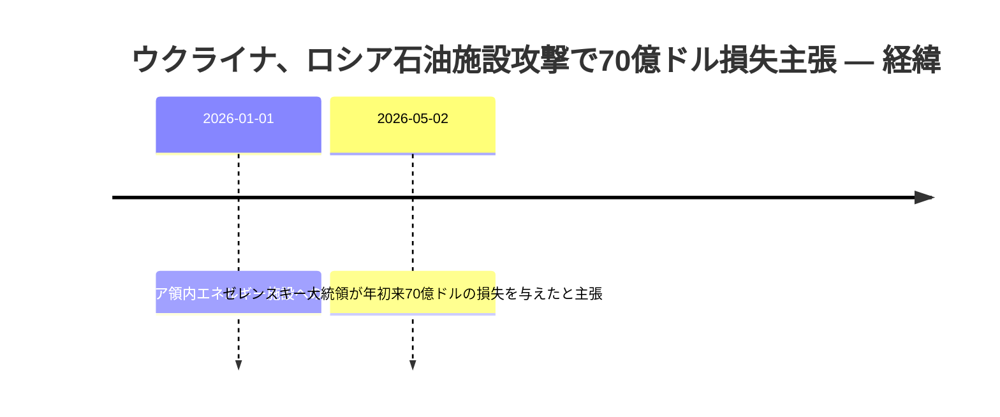
```mermaid
timeline
  title ウクライナ、ロシア石油施設攻撃で70億ドル損失主張 — 経緯
  2026-01-01 : ウクライナがロシア領内エネルギー施設への攻撃を継続・強化
  2026-05-02 : ゼレンスキー大統領が年初来70億ドルの損失を与えたと主張
```

### 当事者マップ

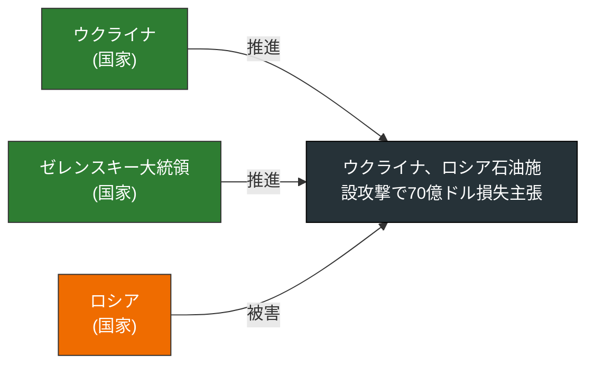
```mermaid
flowchart LR
  T["ウクライナ、ロシア石油施設攻撃で70億ドル損失主張"]
  A0["ウクライナ\n(国家)"]
  A0 -- 推進 --> T
  style A0 fill:#2e7d32,color:#fff,stroke:#333
  A1["ゼレンスキー大統領\n(国家)"]
  A1 -- 推進 --> T
  style A1 fill:#2e7d32,color:#fff,stroke:#333
  A2["ロシア\n(国家)"]
  A2 -- 被害 --> T
  style A2 fill:#ef6c00,color:#fff,stroke:#333
  style T fill:#263238,color:#fff,stroke:#000
```

### 影響の広がり

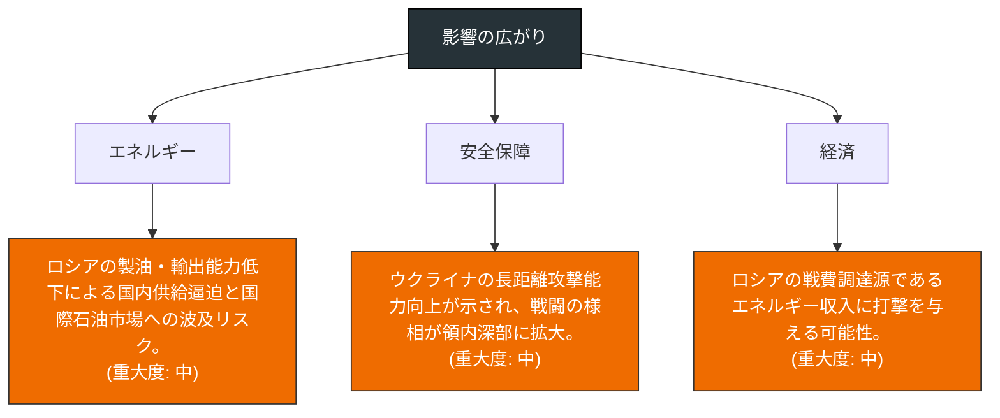
```mermaid
flowchart TB
  R["影響の広がり"]
  D0["エネルギー"]
  I0["ロシアの製油・輸出能力低下による国内供給逼迫と国際石油市場への波及リスク。\n(重大度: 中)"]
  R --> D0 --> I0
  style I0 fill:#ef6c00,color:#fff,stroke:#333
  D1["安全保障"]
  I1["ウクライナの長距離攻撃能力向上が示され、戦闘の様相が領内深部に拡大。\n(重大度: 中)"]
  R --> D1 --> I1
  style I1 fill:#ef6c00,color:#fff,stroke:#333
  D2["経済"]
  I2["ロシアの戦費調達源であるエネルギー収入に打撃を与える可能性。\n(重大度: 中)"]
  R --> D2 --> I2
  style I2 fill:#ef6c00,color:#fff,stroke:#333
  style R fill:#263238,color:#fff,stroke:#000
```

### 当事者の関係ネットワーク

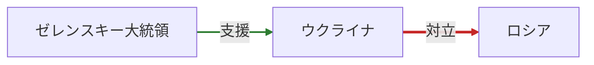
```mermaid
graph LR
  N0["ウクライナ"]
  N1["ゼレンスキー大統領"]
  N2["ロシア"]
  N0 -->|対立| N2
  N1 -->|支援| N0
  linkStyle 0 stroke:#c62828,stroke-width:3px;
  linkStyle 1 stroke:#2e7d32,stroke-width:2px;
```

### 押さえるべき論点

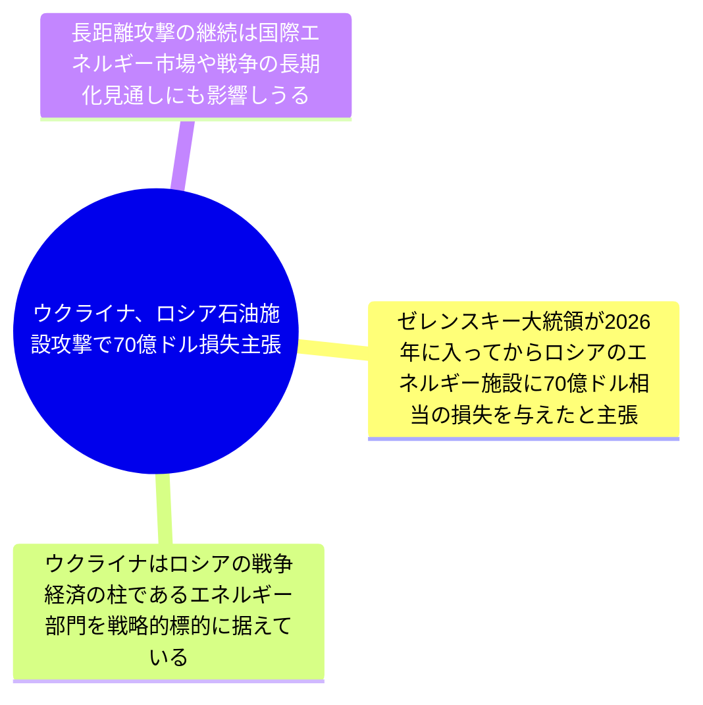
```mermaid
mindmap
  root((ウクライナ、ロシア石油施設攻撃で70億ドル損失主張))
    ゼレンスキー大統領が2026年に入ってからロシアのエネルギー施設に70億ドル相当の損失を与えたと主張
    ウクライナはロシアの戦争経済の柱であるエネルギー部門を戦略的標的に据えている
    長距離攻撃の継続は国際エネルギー市場や戦争の長期化見通しにも影響しうる
```

---

## 報道の自由度 世界平均が過去最低、日本62位 `重要度: 中` `global`
- **出典:** NHK 国際 ([原文](http://www3.nhk.or.jp/news/html/20260501/k10015112371000.html)) / **公開:** 2026-05-01 08:23

**要約**
国際的なジャーナリスト団体が2026年版の報道の自由度に関する報告書を発表しました。安全保障政策と結びついた制約的な法制度の拡大などを背景に、世界全体の平均スコアは過去最低を記録しました。日本は前年よりスコアを下げたものの、他国の悪化が相対的に大きかったため順位は4つ上昇し62位となりました。報道環境の世界的な悪化傾向が浮き彫りになっています。

**背景**
近年、各国で安全保障やテロ対策、偽情報対策を名目とした法整備が進み、ジャーナリストの取材・報道活動への制約が拡大しているとされます。報道の自由度ランキングは毎年発表され、各国の言論環境を測る国際指標として注目されています。

**要点**
- 世界の報道の自由度の平均スコアが過去最低を記録、安全保障名目の法制度拡大が背景

- 日本は順位を4つ上げて62位になったが、スコア自体は前年より低下し実態は改善していない

- 報道の自由と安全保障政策のバランスが世界共通の課題として浮上している

### 経緯タイムライン

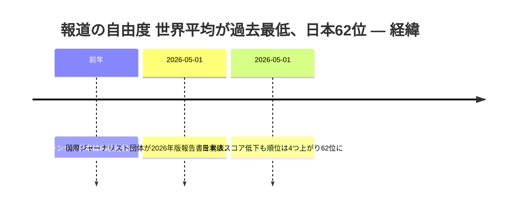
```mermaid
timeline
  title 報道の自由度 世界平均が過去最低、日本62位 — 経緯
  前年 : 前回ランキングで日本は66位前後にランクイン
  2026-05-01 : 国際ジャーナリスト団体が2026年版報告書を発表、世界平均が過去最低に
  2026-05-01 : 日本はスコア低下も順位は4つ上がり62位に
```

### 当事者マップ

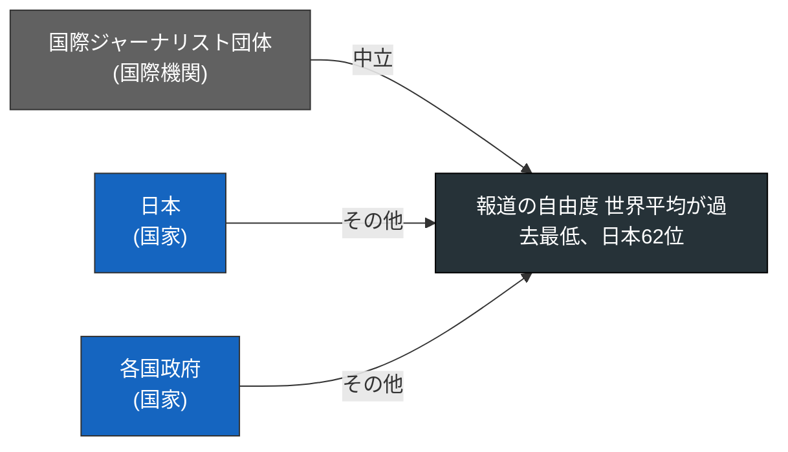
```mermaid
flowchart LR
  T["報道の自由度 世界平均が過去最低、日本62位"]
  A0["国際ジャーナリスト団体\n(国際機関)"]
  A0 -- 中立 --> T
  style A0 fill:#616161,color:#fff,stroke:#333
  A1["日本\n(国家)"]
  A1 -- その他 --> T
  style A1 fill:#1565c0,color:#fff,stroke:#333
  A2["各国政府\n(国家)"]
  A2 -- その他 --> T
  style A2 fill:#1565c0,color:#fff,stroke:#333
  style T fill:#263238,color:#fff,stroke:#000
```

### 影響の広がり

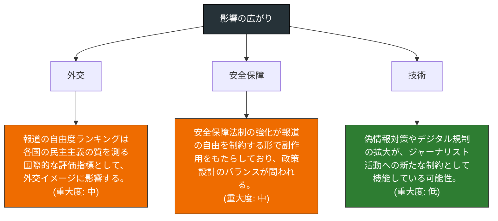
```mermaid
flowchart TB
  R["影響の広がり"]
  D0["外交"]
  I0["報道の自由度ランキングは各国の民主主義の質を測る国際的な評価指標として、外交イメージに影響する。\n(重大度: 中)"]
  R --> D0 --> I0
  style I0 fill:#ef6c00,color:#fff,stroke:#333
  D1["安全保障"]
  I1["安全保障法制の強化が報道の自由を制約する形で副作用をもたらしており、政策設計のバランスが問われる。\n(重大度: 中)"]
  R --> D1 --> I1
  style I1 fill:#ef6c00,color:#fff,stroke:#333
  D2["技術"]
  I2["偽情報対策やデジタル規制の拡大が、ジャーナリスト活動への新たな制約として機能している可能性。\n(重大度: 低)"]
  R --> D2 --> I2
  style I2 fill:#2e7d32,color:#fff,stroke:#333
  style R fill:#263238,color:#fff,stroke:#000
```

### 当事者の関係ネットワーク

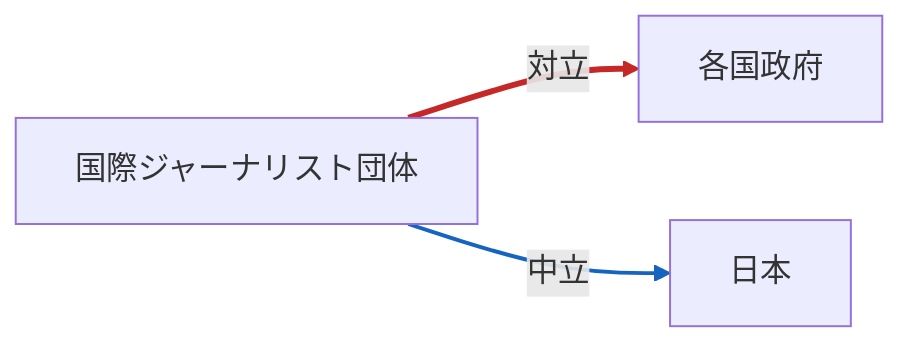
```mermaid
graph LR
  N0["国際ジャーナリスト団体"]
  N1["日本"]
  N2["各国政府"]
  N0 -->|対立| N2
  N0 -->|中立| N1
  linkStyle 0 stroke:#c62828,stroke-width:3px;
  linkStyle 1 stroke:#1565c0,stroke-width:2px;
```

### 押さえるべき論点

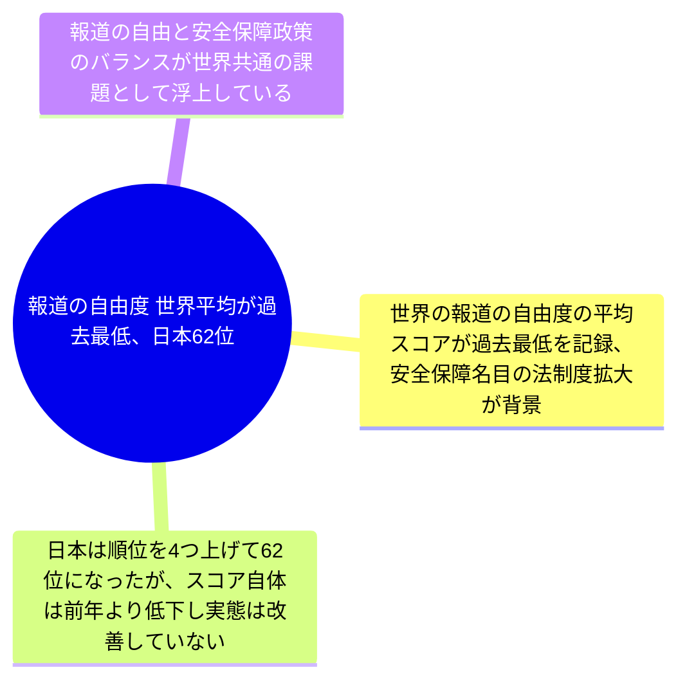
```mermaid
mindmap
  root((報道の自由度 世界平均が過去最低、日本62位))
    世界の報道の自由度の平均スコアが過去最低を記録、安全保障名目の法制度拡大が背景
    日本は順位を4つ上げて62位になったが、スコア自体は前年より低下し実態は改善していない
    報道の自由と安全保障政策のバランスが世界共通の課題として浮上している
```

---

## ロシア占領地穀物船、イスラエル領海外へ退去 `重要度: 中` `middle_east / europe / global`
- **出典:** NHK 国際 ([原文](http://www3.nhk.or.jp/news/html/20260501/k10015112311000.html)) / **公開:** 2026-05-01 05:32

**要約**
ウクライナのゼレンスキー大統領が、ロシア占領地で収穫された穀物を積んだ船のイスラエル入港をイスラエル政府が容認しようとしていると批判していた問題で、イスラエル側は当該船舶が領海から出ることを決めたとの通知を受けたと明らかにしました。これにより当面の外交的摩擦は回避される見通しです。ただし、占領地産穀物の国際流通をめぐる問題は依然として残されています。

**背景**
ロシアはウクライナ南部の占領地で穀物を収奪し、第三国を経由して輸出しているとされ、ウクライナ政府はこれを国際法違反として各国に入港拒否を求めてきました。今回、対象船がイスラエル領海に接近したことで両国間の外交問題に発展していました。

**要点**
- ロシア占領地産穀物を積んだ船がイスラエル領海から退去することになった

- ゼレンスキー大統領による公開批判が事態を動かす一因となった可能性がある

- 占領地産穀物の国際流通という構造的問題は未解決のまま残る

### 経緯タイムライン

```mermaid
timeline
  title ロシア占領地穀物船、イスラエル領海外へ退去 — 経緯
  2022年以降 : ロシアがウクライナ占領地の穀物を収奪・輸出していると指摘される
  数日前 : ロシア占領地産穀物を積んだ船がイスラエルへ向かう
  直近 : ゼレンスキー大統領がイスラエル政府の容認姿勢を批判
  2026-05-01 : イスラエル側が当該船舶の領海退去決定を通知されたと公表
```

### 当事者マップ

```mermaid
flowchart LR
  T["ロシア占領地穀物船、イスラエル領海外へ退去"]
  A0["ウクライナ(ゼレンスキー大統領)\n(国家)"]
  A0 -- 反対 --> T
  style A0 fill:#c62828,color:#fff,stroke:#333
  A1["イスラエル政府\n(国家)"]
  A1 -- 中立 --> T
  style A1 fill:#616161,color:#fff,stroke:#333
  A2["ロシア\n(国家)"]
  A2 -- 推進 --> T
  style A2 fill:#2e7d32,color:#fff,stroke:#333
  A3["問題の貨物船\n(非国家主体)"]
  A3 -- その他 --> T
  style A3 fill:#1565c0,color:#fff,stroke:#333
  style T fill:#263238,color:#fff,stroke:#000
```

### 影響の広がり

```mermaid
flowchart TB
  R["影響の広がり"]
  D0["外交"]
  I0["ウクライナとイスラエル間の直接的な対立は当面回避される見通し。\n(重大度: 中)"]
  R --> D0 --> I0
  style I0 fill:#ef6c00,color:#fff,stroke:#333
  D1["経済"]
  I1["ロシアによる占領地穀物の販路に圧力がかかり、迂回輸出ルートの見直しを迫られる可能性。\n(重大度: 低)"]
  R --> D1 --> I1
  style I1 fill:#2e7d32,color:#fff,stroke:#333
  D2["安全保障"]
  I2["占領地経済からの収益遮断は、ウクライナ戦争の経済戦線で意味を持つ。\n(重大度: 中)"]
  R --> D2 --> I2
  style I2 fill:#ef6c00,color:#fff,stroke:#333
  style R fill:#263238,color:#fff,stroke:#000
```

### 当事者の関係ネットワーク

```mermaid
graph LR
  N0["ウクライナ(ゼレンスキー大統領)"]
  N1["イスラエル政府"]
  N2["ロシア"]
  N3["問題の貨物船"]
  N0 -->|対立| N2
  N0 -->|緊張| N1
  N2 -->|支援| N3
  linkStyle 0 stroke:#c62828,stroke-width:3px;
  linkStyle 1 stroke:#ef6c00,stroke-width:2px,stroke-dasharray:4 2;
  linkStyle 2 stroke:#2e7d32,stroke-width:2px;
```

### 押さえるべき論点

```mermaid
mindmap
  root((ロシア占領地穀物船、イスラエル領海外へ退去))
    ロシア占領地産穀物を積んだ船がイスラエル領海から退去することになった
    ゼレンスキー大統領による公開批判が事態を動かす一因となった可能性がある
    占領地産穀物の国際流通という構造的問題は未解決のまま残る
```

---
