# 地政学ニュース図解レポート 2026-05-03 号

生成日時: 2026-05-03 07:38 / 記事数: 5

## 📌 本日の要点

- **ロシアのウクライナ侵攻 5月2日の動向** — ロシアによるウクライナへの軍事侵攻が続いており、各地でロシア軍とウクライナ軍の戦闘が継続している。

- **中東米軍施設の半数超、イラン攻撃で損傷か** — 米CNNは、イランとその同盟勢力による攻撃で中東8か国の少なくとも16か所の米軍施設が被害を受けたと報じた。

## ロシアのウクライナ侵攻 5月2日の動向 `重要度: 高` `europe / global`
- **出典:** NHK 国際 ([原文](http://www3.nhk.or.jp/news/html/20260502/k10015101751000.html)) / **公開:** 2026-05-02 19:44

**要約**
ロシアによるウクライナへの軍事侵攻が続いており、各地でロシア軍とウクライナ軍の戦闘が継続している。多数の市民が国外への避難を余儀なくされている。NHKは5月2日(日本時間)の戦況や関係各国の外交動向を随時更新で伝えている。日本とウクライナ、モスクワとは6時間の時差がある。

**背景**
2022年2月に始まったロシアによるウクライナへの全面侵攻は長期化しており、欧米諸国はウクライナへの軍事・経済支援を継続している。一方でロシアは占領地域の維持と攻勢を続けており、ウクライナ国内では人道危機が深刻化している。

**要点**
- ロシアによるウクライナ侵攻は依然として継続している

- ウクライナ各地で戦闘が続き、多くの市民が国外避難を強いられている

- 戦闘状況と関係各国の外交動向が引き続き注視されている

### 経緯タイムライン

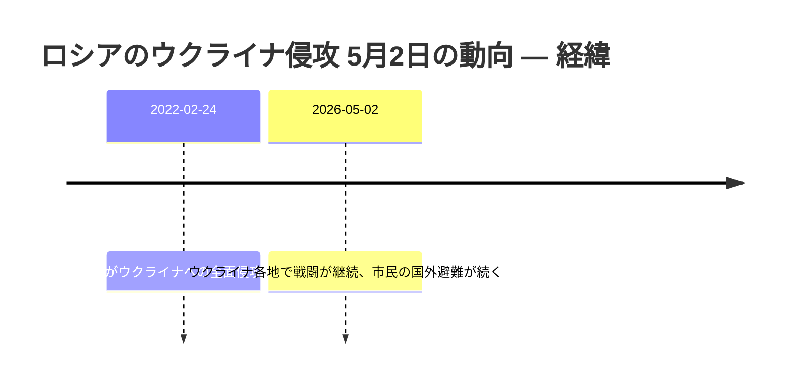
```mermaid
timeline
  title ロシアのウクライナ侵攻 5月2日の動向 — 経緯
  2022-02-24 : ロシアがウクライナへの全面侵攻を開始
  2026-05-02 : ウクライナ各地で戦闘が継続、市民の国外避難が続く
```

### 当事者マップ

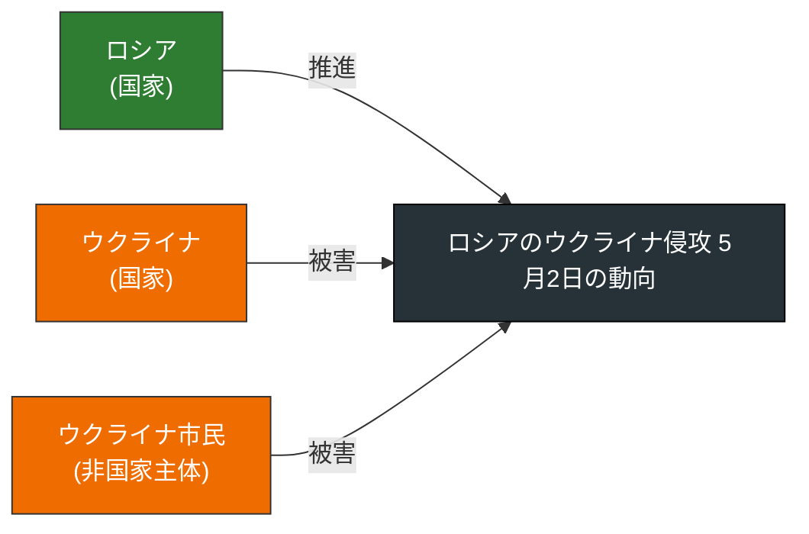
```mermaid
flowchart LR
  T["ロシアのウクライナ侵攻 5月2日の動向"]
  A0["ロシア\n(国家)"]
  A0 -- 推進 --> T
  style A0 fill:#2e7d32,color:#fff,stroke:#333
  A1["ウクライナ\n(国家)"]
  A1 -- 被害 --> T
  style A1 fill:#ef6c00,color:#fff,stroke:#333
  A2["ウクライナ市民\n(非国家主体)"]
  A2 -- 被害 --> T
  style A2 fill:#ef6c00,color:#fff,stroke:#333
  style T fill:#263238,color:#fff,stroke:#000
```

### 影響の広がり

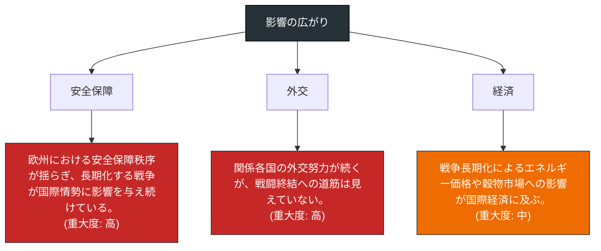
```mermaid
flowchart TB
  R["影響の広がり"]
  D0["安全保障"]
  I0["欧州における安全保障秩序が揺らぎ、長期化する戦争が国際情勢に影響を与え続けている。\n(重大度: 高)"]
  R --> D0 --> I0
  style I0 fill:#c62828,color:#fff,stroke:#333
  D1["外交"]
  I1["関係各国の外交努力が続くが、戦闘終結への道筋は見えていない。\n(重大度: 高)"]
  R --> D1 --> I1
  style I1 fill:#c62828,color:#fff,stroke:#333
  D2["経済"]
  I2["戦争長期化によるエネルギー価格や穀物市場への影響が国際経済に及ぶ。\n(重大度: 中)"]
  R --> D2 --> I2
  style I2 fill:#ef6c00,color:#fff,stroke:#333
  style R fill:#263238,color:#fff,stroke:#000
```

### 当事者の関係ネットワーク

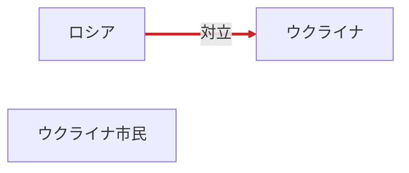
```mermaid
graph LR
  N0["ロシア"]
  N1["ウクライナ"]
  N2["ウクライナ市民"]
  N0 -->|対立| N1
  linkStyle 0 stroke:#c62828,stroke-width:3px;
```

### 押さえるべき論点

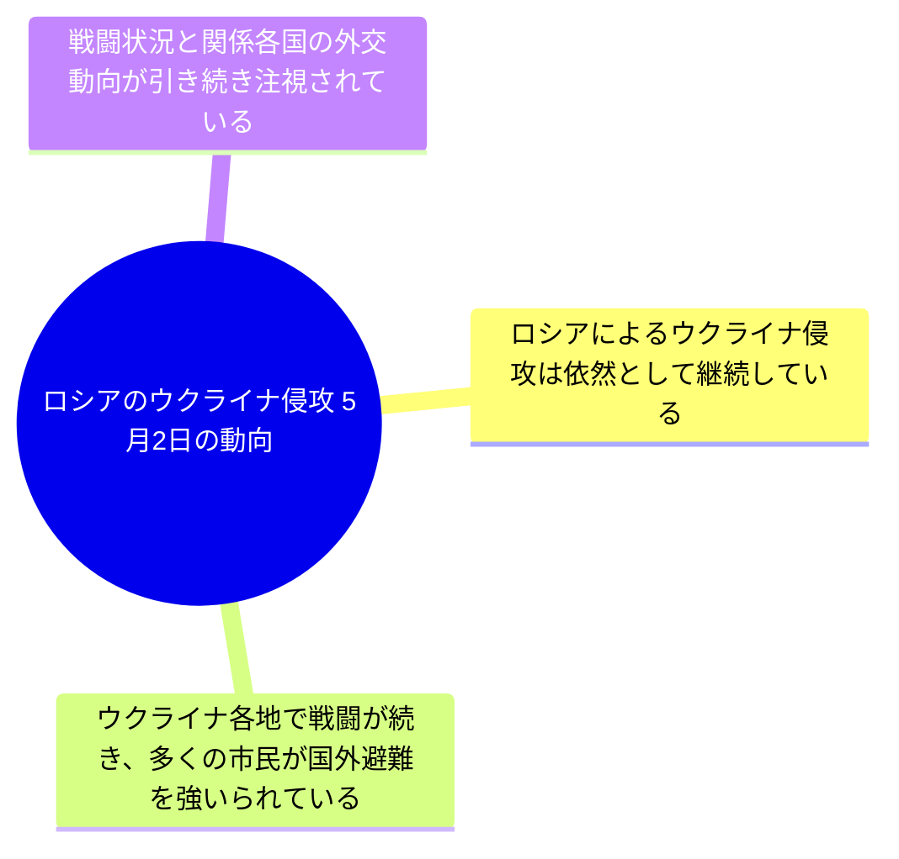
```mermaid
mindmap
  root((ロシアのウクライナ侵攻 5月2日の動向))
    ロシアによるウクライナ侵攻は依然として継続している
    ウクライナ各地で戦闘が続き、多くの市民が国外避難を強いられている
    戦闘状況と関係各国の外交動向が引き続き注視されている
```

---

## 中東米軍施設の半数超、イラン攻撃で損傷か `重要度: 高` `middle_east / global`
- **出典:** NHK 国際 ([原文](http://www3.nhk.or.jp/news/html/20260502/k10015113511000.html)) / **公開:** 2026-05-02 18:08

**要約**
米CNNは、イランとその同盟勢力による攻撃で中東8か国の少なくとも16か所の米軍施設が被害を受けたと報じた。これは中東にある米軍拠点の半数以上に相当し、一部の施設は事実上使用できない状態に陥っているという。衛星画像の分析と米国・湾岸諸国の情報筋への取材に基づく情報。米軍のプレゼンスや抑止力に深刻な影響を及ぼす可能性がある。

**背景**
2023年10月のガザ紛争勃発以降、イランが支援する「抵抗の枢軸」(イラク民兵、フーシ、ヒズボラ等)が中東各地の米軍施設を断続的に攻撃。2024年にはイラン本土とイスラエルの直接応酬も発生し、中東全域で米軍が標的となる事態が続いてきた。

**要点**
- 中東の米軍拠点の半数以上、16か所以上が損傷したとCNNが報道

- 一部施設は事実上使用不能で、米軍の抑止力低下が懸念される

- ホルムズ海峡周辺の不安定化は日本のエネルギー安全保障に直結する重大事態

### 経緯タイムライン

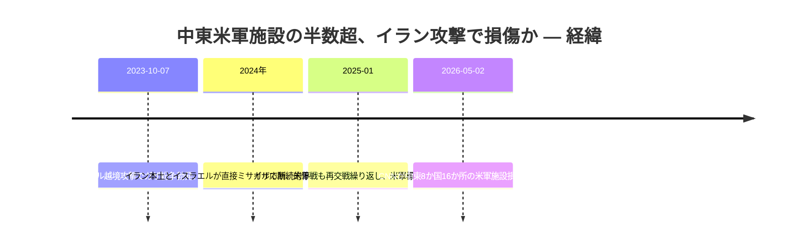
```mermaid
timeline
  title 中東米軍施設の半数超、イラン攻撃で損傷か — 経緯
  2023-10-07 : ハマスのイスラエル越境攻撃でガザ紛争勃発、地域全体に飛び火
  2024年 : イラン本土とイスラエルが直接ミサイル応酬、米軍基地への攻撃も激化
  2025-01 : ガザで断続的停戦も再交戦繰り返し、米軍標的攻撃は継続
  2026-05-02 : CNNが中東8か国16か所の米軍施設損傷を報道
```

### 当事者マップ

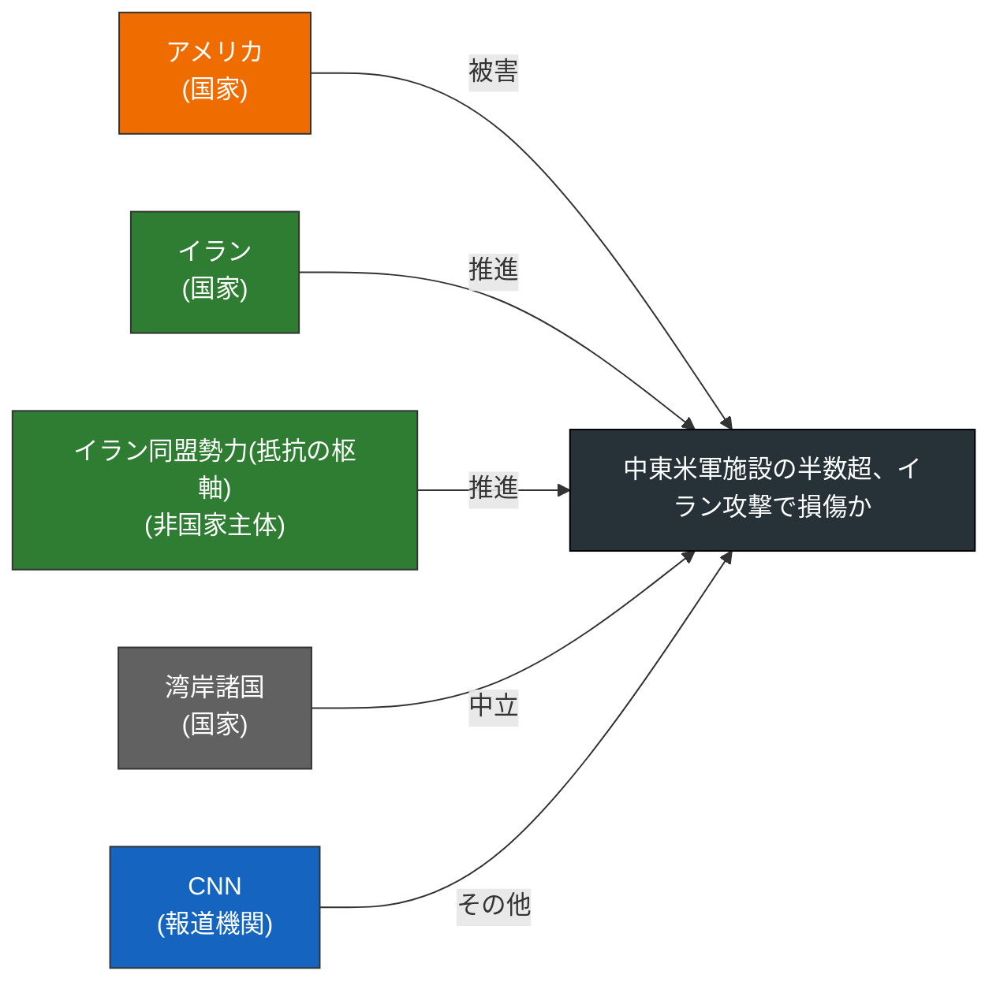
```mermaid
flowchart LR
  T["中東米軍施設の半数超、イラン攻撃で損傷か"]
  A0["アメリカ\n(国家)"]
  A0 -- 被害 --> T
  style A0 fill:#ef6c00,color:#fff,stroke:#333
  A1["イラン\n(国家)"]
  A1 -- 推進 --> T
  style A1 fill:#2e7d32,color:#fff,stroke:#333
  A2["イラン同盟勢力(抵抗の枢軸)\n(非国家主体)"]
  A2 -- 推進 --> T
  style A2 fill:#2e7d32,color:#fff,stroke:#333
  A3["湾岸諸国\n(国家)"]
  A3 -- 中立 --> T
  style A3 fill:#616161,color:#fff,stroke:#333
  A4["CNN\n(報道機関)"]
  A4 -- その他 --> T
  style A4 fill:#1565c0,color:#fff,stroke:#333
  style T fill:#263238,color:#fff,stroke:#000
```

### 影響の広がり

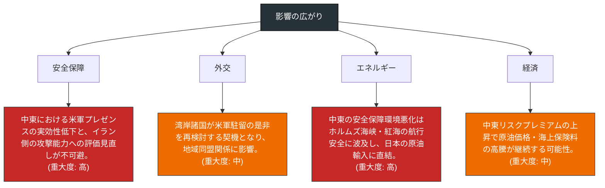
```mermaid
flowchart TB
  R["影響の広がり"]
  D0["安全保障"]
  I0["中東における米軍プレゼンスの実効性低下と、イラン側の攻撃能力への評価見直しが不可避。\n(重大度: 高)"]
  R --> D0 --> I0
  style I0 fill:#c62828,color:#fff,stroke:#333
  D1["外交"]
  I1["湾岸諸国が米軍駐留の是非を再検討する契機となり、地域同盟関係に影響。\n(重大度: 中)"]
  R --> D1 --> I1
  style I1 fill:#ef6c00,color:#fff,stroke:#333
  D2["エネルギー"]
  I2["中東の安全保障環境悪化はホルムズ海峡・紅海の航行安全に波及し、日本の原油輸入に直結。\n(重大度: 高)"]
  R --> D2 --> I2
  style I2 fill:#c62828,color:#fff,stroke:#333
  D3["経済"]
  I3["中東リスクプレミアムの上昇で原油価格・海上保険料の高騰が継続する可能性。\n(重大度: 中)"]
  R --> D3 --> I3
  style I3 fill:#ef6c00,color:#fff,stroke:#333
  style R fill:#263238,color:#fff,stroke:#000
```

### 当事者の関係ネットワーク

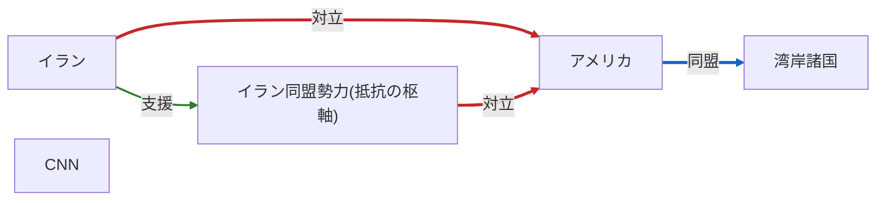
```mermaid
graph LR
  N0["アメリカ"]
  N1["イラン"]
  N2["イラン同盟勢力(抵抗の枢軸)"]
  N3["湾岸諸国"]
  N4["CNN"]
  N1 -->|対立| N0
  N1 -->|支援| N2
  N2 -->|対立| N0
  N0 -->|同盟| N3
  linkStyle 0 stroke:#c62828,stroke-width:3px;
  linkStyle 1 stroke:#2e7d32,stroke-width:2px;
  linkStyle 2 stroke:#c62828,stroke-width:3px;
  linkStyle 3 stroke:#1565c0,stroke-width:3px;
```

### 押さえるべき論点

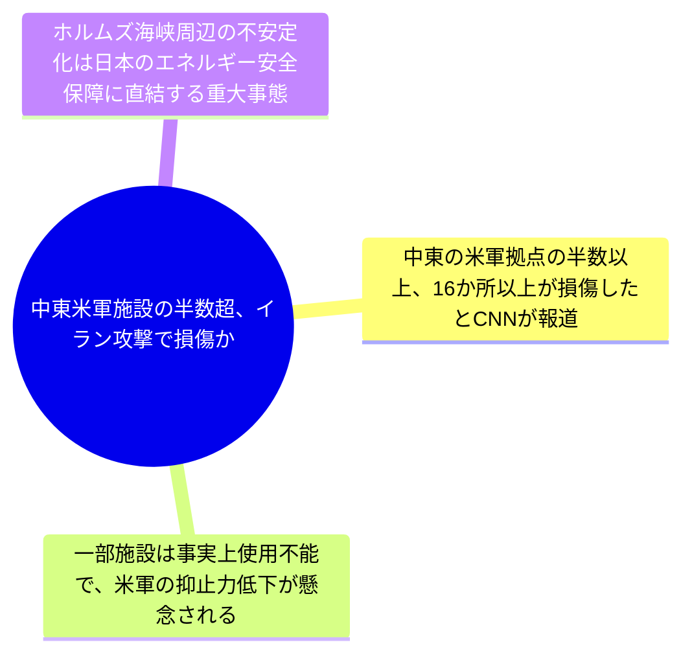
```mermaid
mindmap
  root((中東米軍施設の半数超、イラン攻撃で損傷か))
    中東の米軍拠点の半数以上、16か所以上が損傷したとCNNが報道
    一部施設は事実上使用不能で、米軍の抑止力低下が懸念される
    ホルムズ海峡周辺の不安定化は日本のエネルギー安全保障に直結する重大事態
```

---

## 頼総統エスワティニ訪問 中国圧力越え `重要度: 中` `east_asia / africa / global`
- **出典:** NHK 国際 ([原文](http://www3.nhk.or.jp/news/html/20260503/k10015113711000.html)) / **公開:** 2026-05-03 06:50

**要約**
台湾の頼清徳総統が5月2日、アフリカで唯一台湾と外交関係を持つエスワティニに到着した。先月の訪問計画は、専用機が経由する島国が中国の圧力を受けたとして見合わせられていた。今回の訪問実現に対し中国政府は強く非難しており、台湾の国際的地位を巡る米中・両岸の対立が改めて顕在化した形となる。

**背景**
台湾と外交関係を持つ国は中国の働きかけにより減少を続け、現在は十数カ国にとどまる。エスワティニはアフリカで唯一台湾と国交を維持する国で、頼総統就任後の外交関係維持が重要課題となっていた。

**要点**
- 頼清徳総統がアフリカで唯一の友好国エスワティニ訪問を実現

- 経由島国への中国の圧力で一旦は訪問見合わせという異例の経緯

- 中国は強く非難、両岸の外交戦が島嶼国・アフリカへ拡大している

### 経緯タイムライン

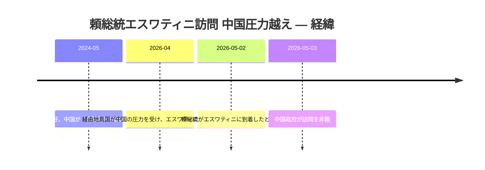
```mermaid
timeline
  title 頼総統エスワティニ訪問 中国圧力越え — 経緯
  2024-05 : 頼清徳総統就任、中国が「合同利剣2024A」演習で反発
  2026-04 : 経由地島国が中国の圧力を受け、エスワティニ訪問を見合わせ
  2026-05-02 : 頼総統がエスワティニに到着したと発表
  2026-05-03 : 中国政府が訪問を非難
```

### 当事者マップ

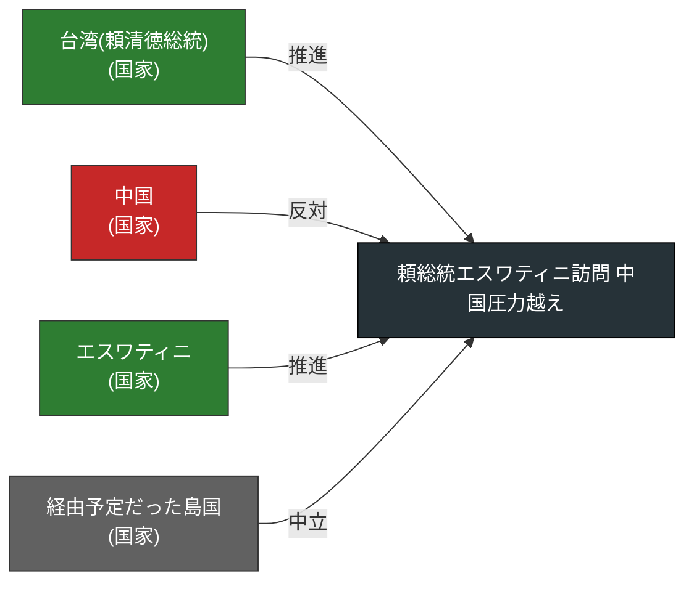
```mermaid
flowchart LR
  T["頼総統エスワティニ訪問 中国圧力越え"]
  A0["台湾(頼清徳総統)\n(国家)"]
  A0 -- 推進 --> T
  style A0 fill:#2e7d32,color:#fff,stroke:#333
  A1["中国\n(国家)"]
  A1 -- 反対 --> T
  style A1 fill:#c62828,color:#fff,stroke:#333
  A2["エスワティニ\n(国家)"]
  A2 -- 推進 --> T
  style A2 fill:#2e7d32,color:#fff,stroke:#333
  A3["経由予定だった島国\n(国家)"]
  A3 -- 中立 --> T
  style A3 fill:#616161,color:#fff,stroke:#333
  style T fill:#263238,color:#fff,stroke:#000
```

### 影響の広がり

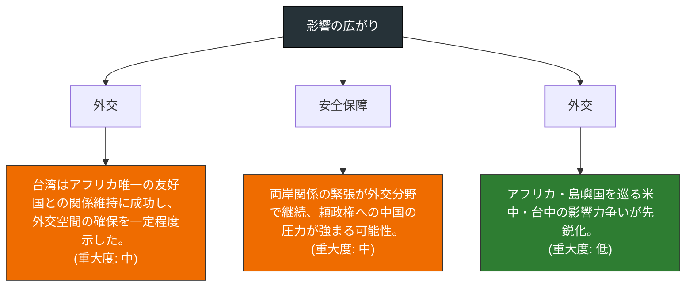
```mermaid
flowchart TB
  R["影響の広がり"]
  D0["外交"]
  I0["台湾はアフリカ唯一の友好国との関係維持に成功し、外交空間の確保を一定程度示した。\n(重大度: 中)"]
  R --> D0 --> I0
  style I0 fill:#ef6c00,color:#fff,stroke:#333
  D1["安全保障"]
  I1["両岸関係の緊張が外交分野で継続、頼政権への中国の圧力が強まる可能性。\n(重大度: 中)"]
  R --> D1 --> I1
  style I1 fill:#ef6c00,color:#fff,stroke:#333
  D2["外交"]
  I2["アフリカ・島嶼国を巡る米中・台中の影響力争いが先鋭化。\n(重大度: 低)"]
  R --> D2 --> I2
  style I2 fill:#2e7d32,color:#fff,stroke:#333
  style R fill:#263238,color:#fff,stroke:#000
```

### 当事者の関係ネットワーク

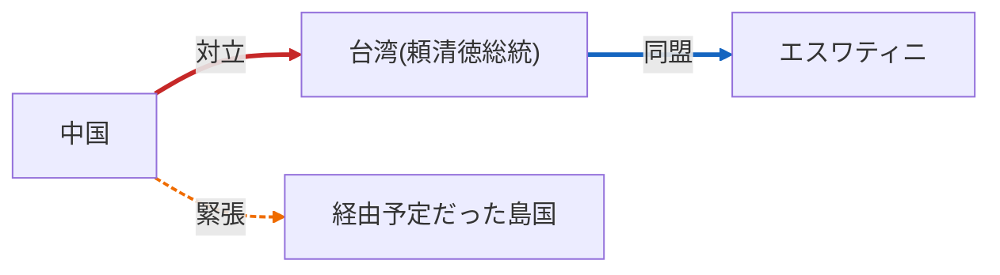
```mermaid
graph LR
  N0["台湾(頼清徳総統)"]
  N1["中国"]
  N2["エスワティニ"]
  N3["経由予定だった島国"]
  N1 -->|対立| N0
  N0 -->|同盟| N2
  N1 -->|緊張| N3
  linkStyle 0 stroke:#c62828,stroke-width:3px;
  linkStyle 1 stroke:#1565c0,stroke-width:3px;
  linkStyle 2 stroke:#ef6c00,stroke-width:2px,stroke-dasharray:4 2;
```

### 押さえるべき論点

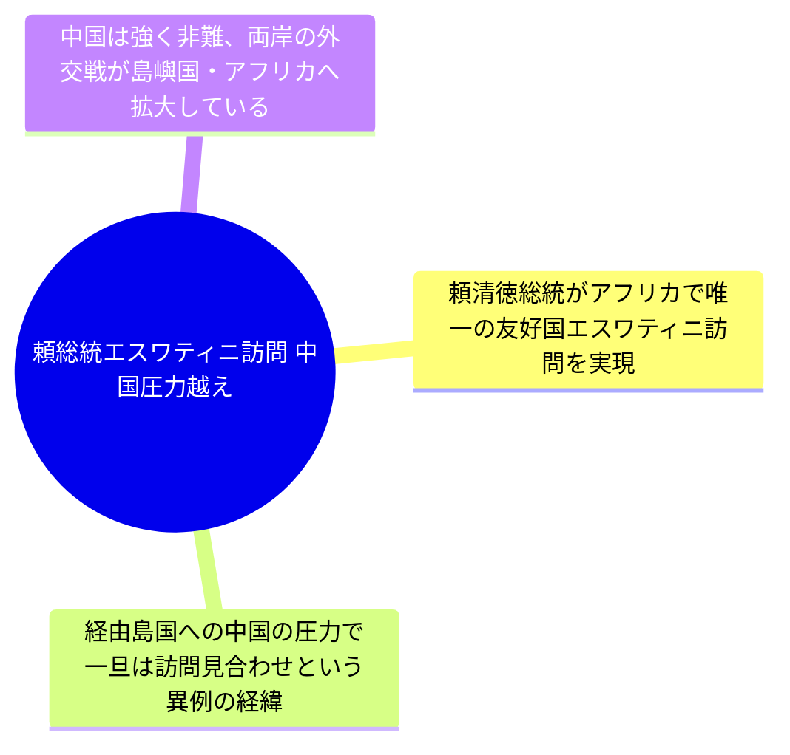
```mermaid
mindmap
  root((頼総統エスワティニ訪問 中国圧力越え))
    頼清徳総統がアフリカで唯一の友好国エスワティニ訪問を実現
    経由島国への中国の圧力で一旦は訪問見合わせという異例の経緯
    中国は強く非難、両岸の外交戦が島嶼国・アフリカへ拡大している
```

---

## 米軍の欧州撤退、独が想定済みと表明 `重要度: 中` `europe / global`
- **出典:** BBC World ([原文](https://www.bbc.com/news/articles/cd9pn541jjlo?at_medium=RSS&at_campaign=rss)) / **公開:** 2026-05-02 16:35

**要約**
ドイツ政府は、トランプ米大統領が決定した在欧米軍5,000人の撤退について「予見可能だった」との見解を示した。NATOは詳細についての説明を米側に求めている。米国内でも共和党の有力議員2人が今回の決定に懸念を表明している。欧州の安全保障体制に新たな不確実性が生じつつある。

**背景**
トランプ政権は第2期において、欧州への軍事的関与を縮小し負担を欧州側にシフトさせる姿勢を強めている。2025年以降、在欧米軍の規模見直しが繰り返し議論されてきた。

**要点**
- トランプ政権が在欧米軍5,000人の撤退を決定し、ドイツは『予見可能』と冷静に対応

- NATOは撤退の詳細について米側に説明を求めており、同盟内の連携不足が顕在化

- 米共和党内からも反対の声が上がり、欧州の安全保障とインド太平洋同盟運営にも波及しうる

### 経緯タイムライン

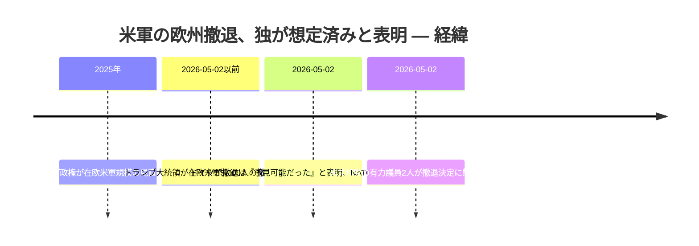
```mermaid
timeline
  title 米軍の欧州撤退、独が想定済みと表明 — 経緯
  2025年 : トランプ政権が在欧米軍規模の見直しを示唆
  2026-05-02以前 : トランプ大統領が在欧米軍5,000人の撤退を決定
  2026-05-02 : ドイツが撤退は『予見可能だった』と表明、NATOは米に説明を要請
  2026-05-02 : 米共和党の有力議員2人が撤退決定に懸念を表明
```

### 当事者マップ

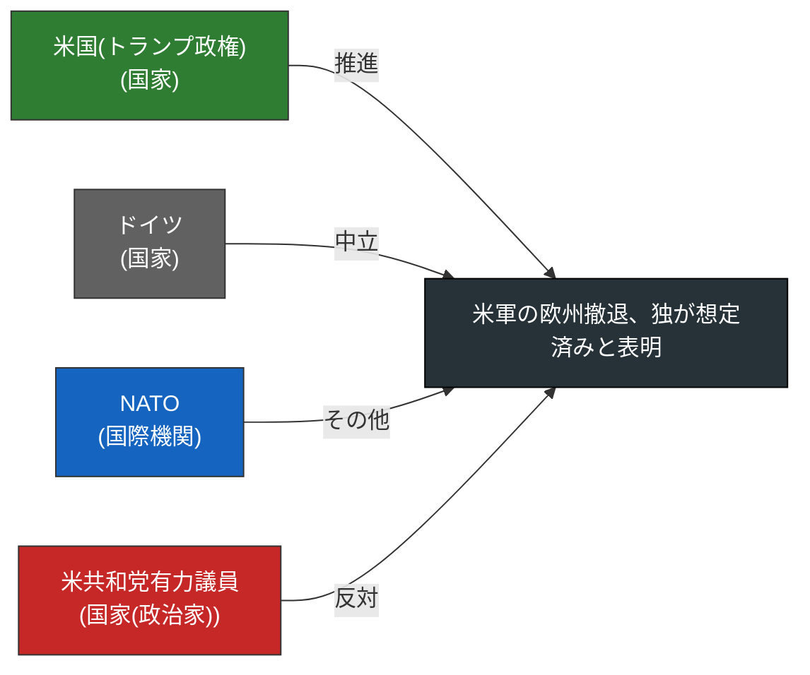
```mermaid
flowchart LR
  T["米軍の欧州撤退、独が想定済みと表明"]
  A0["米国(トランプ政権)\n(国家)"]
  A0 -- 推進 --> T
  style A0 fill:#2e7d32,color:#fff,stroke:#333
  A1["ドイツ\n(国家)"]
  A1 -- 中立 --> T
  style A1 fill:#616161,color:#fff,stroke:#333
  A2["NATO\n(国際機関)"]
  A2 -- その他 --> T
  style A2 fill:#1565c0,color:#fff,stroke:#333
  A3["米共和党有力議員\n(国家(政治家))"]
  A3 -- 反対 --> T
  style A3 fill:#c62828,color:#fff,stroke:#333
  style T fill:#263238,color:#fff,stroke:#000
```

### 影響の広がり

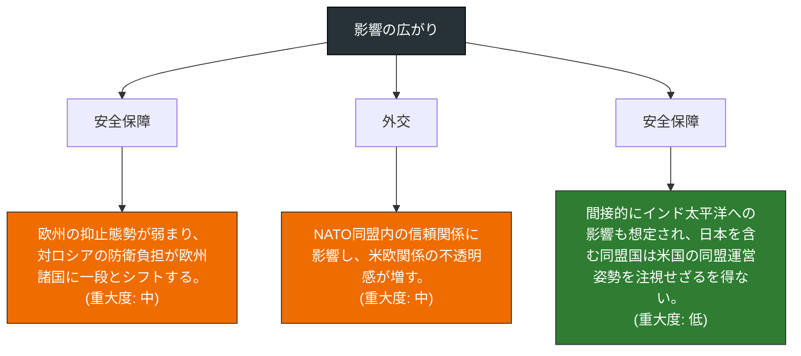
```mermaid
flowchart TB
  R["影響の広がり"]
  D0["安全保障"]
  I0["欧州の抑止態勢が弱まり、対ロシアの防衛負担が欧州諸国に一段とシフトする。\n(重大度: 中)"]
  R --> D0 --> I0
  style I0 fill:#ef6c00,color:#fff,stroke:#333
  D1["外交"]
  I1["NATO同盟内の信頼関係に影響し、米欧関係の不透明感が増す。\n(重大度: 中)"]
  R --> D1 --> I1
  style I1 fill:#ef6c00,color:#fff,stroke:#333
  D2["安全保障"]
  I2["間接的にインド太平洋への影響も想定され、日本を含む同盟国は米国の同盟運営姿勢を注視せざるを得ない。\n(重大度: 低)"]
  R --> D2 --> I2
  style I2 fill:#2e7d32,color:#fff,stroke:#333
  style R fill:#263238,color:#fff,stroke:#000
```

### 当事者の関係ネットワーク

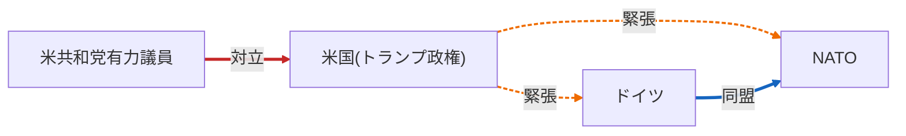
```mermaid
graph LR
  N0["米国(トランプ政権)"]
  N1["ドイツ"]
  N2["NATO"]
  N3["米共和党有力議員"]
  N0 -->|緊張| N1
  N0 -->|緊張| N2
  N1 -->|同盟| N2
  N3 -->|対立| N0
  linkStyle 0 stroke:#ef6c00,stroke-width:2px,stroke-dasharray:4 2;
  linkStyle 1 stroke:#ef6c00,stroke-width:2px,stroke-dasharray:4 2;
  linkStyle 2 stroke:#1565c0,stroke-width:3px;
  linkStyle 3 stroke:#c62828,stroke-width:3px;
```

### 押さえるべき論点

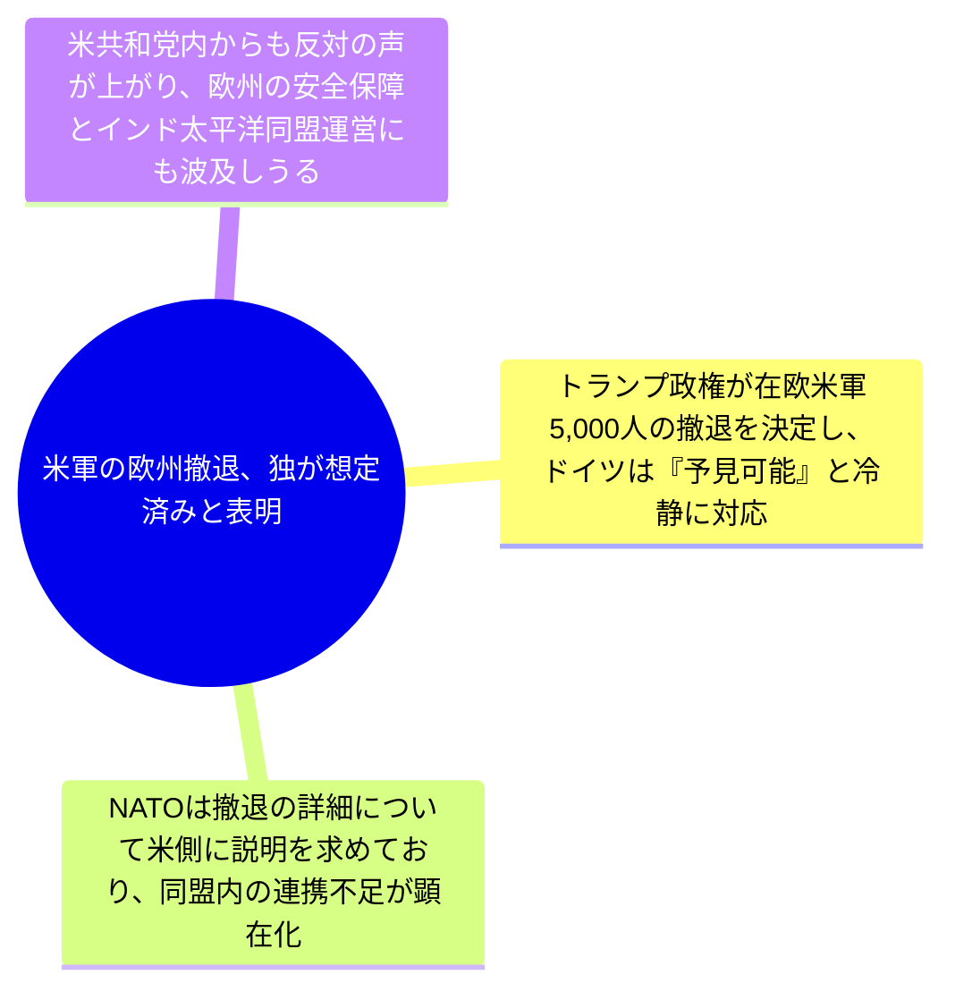
```mermaid
mindmap
  root((米軍の欧州撤退、独が想定済みと表明))
    トランプ政権が在欧米軍5,000人の撤退を決定し、ドイツは『予見可能』と冷静に対応
    NATOは撤退の詳細について米側に説明を求めており、同盟内の連携不足が顕在化
    米共和党内からも反対の声が上がり、欧州の安全保障とインド太平洋同盟運営にも波及しうる
```

---

## ロシアが1600機の無人機攻撃、ウクライナが防空支援訴え `重要度: 中` `europe / global`
- **出典:** NHK 国際 ([原文](http://www3.nhk.or.jp/news/html/20260502/k10015113591000.html)) / **公開:** 2026-05-02 19:58

**要約**
ウクライナのゼレンスキー大統領は2日、過去1週間でロシア軍が約1600機の無人機を用いてウクライナ各地を攻撃したと明らかにした。これを受け、各国に対し防空ミサイルの追加供与や対ロシア圧力の強化を求めた。ロシアによる長距離無人機を主軸とした飽和攻撃は冬季以降さらに激化しており、ウクライナの防空体制が逼迫していることを示している。

**背景**
ロシアは2022年の侵攻以降、イラン製シャヘド型を含む自爆型無人機の運用と国産化を進め、ウクライナのインフラや都市部への大量投入を恒常化させてきた。欧米の防空ミサイル供与は需要に追いつかず、ウクライナ側は迎撃手段の不足を繰り返し訴えている。

**要点**
- 1週間で約1600機という前例的規模の無人機攻撃が行われた

- ウクライナは防空ミサイルの追加支援を強く要請

- ロシアへの圧力強化も同時に訴え、欧米の継戦支援が焦点

### 経緯タイムライン

```mermaid
timeline
  title ロシアが1600機の無人機攻撃、ウクライナが防空支援訴え — 経緯
  2022-02-24 : ロシアによるウクライナ全面侵攻開始
  2022年秋以降 : ロシアがイラン製シャヘド型無人機の大量投入を開始
  1週間前 : ロシアが約1600機の無人機でウクライナ各地を攻撃
  2026-05-02 : ゼレンスキー大統領が攻撃実態を公表し国際支援を訴え
```

### 当事者マップ

```mermaid
flowchart LR
  T["ロシアが1600機の無人機攻撃、ウクライナが防空支援訴え"]
  A0["ウクライナ\n(国家)"]
  A0 -- 被害 --> T
  style A0 fill:#ef6c00,color:#fff,stroke:#333
  A1["ゼレンスキー大統領\n(国家指導者)"]
  A1 -- 推進 --> T
  style A1 fill:#2e7d32,color:#fff,stroke:#333
  A2["ロシア\n(国家)"]
  A2 -- その他 --> T
  style A2 fill:#1565c0,color:#fff,stroke:#333
  A3["欧米諸国\n(国家)"]
  A3 -- 支援 --> T
  style A3 fill:#1565c0,color:#fff,stroke:#333
  style T fill:#263238,color:#fff,stroke:#000
```

### 影響の広がり

```mermaid
flowchart TB
  R["影響の広がり"]
  D0["安全保障"]
  I0["無人機の大量運用が現代戦のスタンダードとなり、各国の防空ドクトリンに見直しを迫る。\n(重大度: 高)"]
  R --> D0 --> I0
  style I0 fill:#c62828,color:#fff,stroke:#333
  D1["エネルギー"]
  I1["ウクライナの電力・暖房インフラへの被害拡大が懸念される。\n(重大度: 中)"]
  R --> D1 --> I1
  style I1 fill:#ef6c00,color:#fff,stroke:#333
  D2["外交"]
  I2["欧米の継続的支援姿勢と支援疲れが改めて問われる局面となる。\n(重大度: 中)"]
  R --> D2 --> I2
  style I2 fill:#ef6c00,color:#fff,stroke:#333
  style R fill:#263238,color:#fff,stroke:#000
```

### 当事者の関係ネットワーク

```mermaid
graph LR
  N0["ウクライナ"]
  N1["ゼレンスキー大統領"]
  N2["ロシア"]
  N3["欧米諸国"]
  N2 -->|対立| N0
  N3 -->|支援| N0
  N1 -->|交渉| N3
  linkStyle 0 stroke:#c62828,stroke-width:3px;
  linkStyle 1 stroke:#2e7d32,stroke-width:2px;
  linkStyle 2 stroke:#6a1b9a,stroke-width:2px,stroke-dasharray:4 2;
```

### 押さえるべき論点

```mermaid
mindmap
  root((ロシアが1600機の無人機攻撃、ウクライナが防空支援訴え))
    1週間で約1600機という前例的規模の無人機攻撃が行われた
    ウクライナは防空ミサイルの追加支援を強く要請
    ロシアへの圧力強化も同時に訴え、欧米の継戦支援が焦点
```

---
