# 地政学ニュース図解レポート 2026-05-04 号

生成日時: 2026-05-04 07:38 / 記事数: 5


## 📌 本日の要点

- **ロシアのウクライナ侵攻 5月3日の動き** — ロシアによるウクライナ侵攻が継続しており、各地で戦闘が続いている。


## ロシアのウクライナ侵攻 5月3日の動き `重要度: 高` `europe / global`
- **出典:** NHK 国際 ([原文](http://www3.nhk.or.jp/news/html/20260504/k10015101761000.html)) / **公開:** 2026-05-04 05:44

**要約**
ロシアによるウクライナ侵攻が継続しており、各地で戦闘が続いている。多数の市民が国外避難を余儀なくされている。NHKは5月3日(日本時間)のウクライナ情勢に関する戦闘状況や各国の外交動向を随時更新で伝えている。

**背景**
2022年2月に開始されたロシアによるウクライナへの軍事侵攻は長期化しており、欧米諸国はウクライナへの軍事・経済支援を続けている。日本もG7の枠組みで対露制裁と対ウクライナ支援に参加している。

**要点**
- ウクライナ各地でロシア軍との戦闘が継続

- 大勢の市民が国外避難を余儀なくされている

- 関係各国の外交動向も含めた情勢が進行中


### 経緯タイムライン

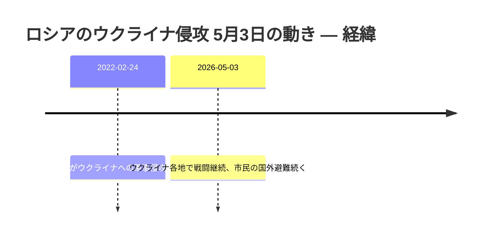

### 当事者マップ

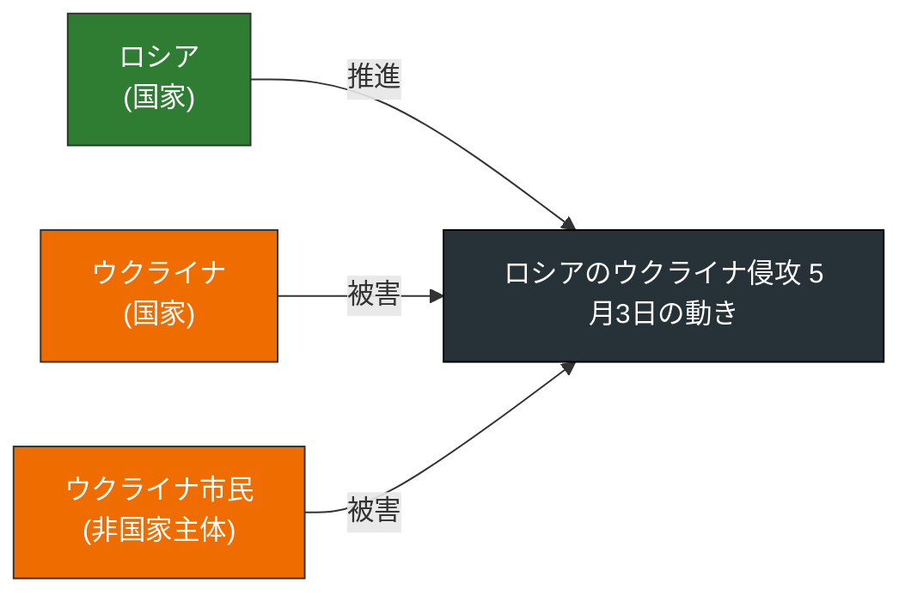

### 影響の広がり

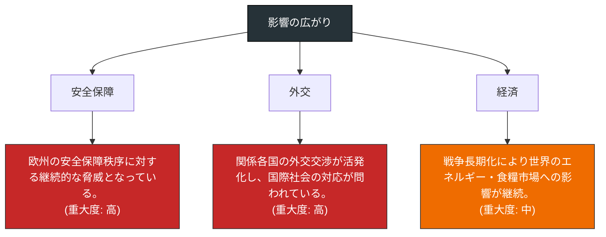

### 当事者の関係ネットワーク

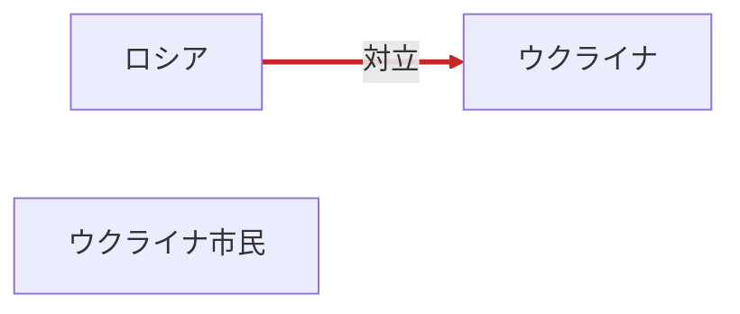

### 押さえるべき論点

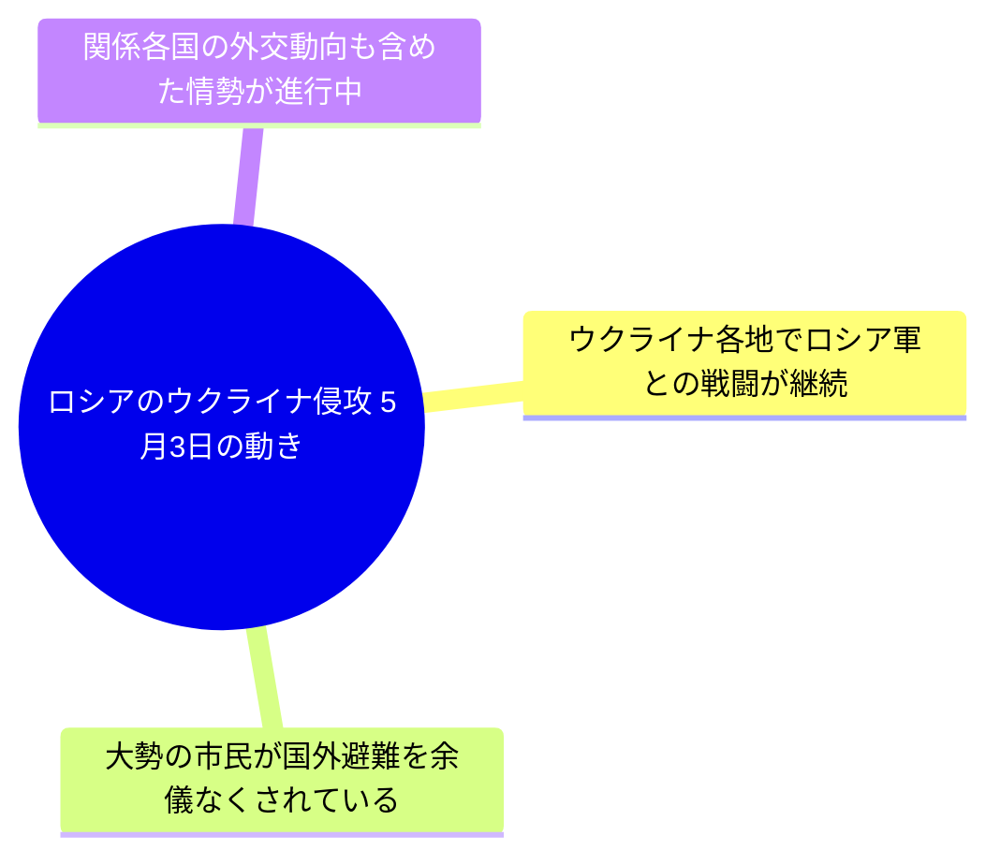


---

## 日豪首脳会談 経済安保で共同宣言へ `重要度: 中` `east_asia / global`
- **出典:** NHK 国際 ([原文](http://www3.nhk.or.jp/news/html/20260504/k10015114111000.html)) / **公開:** 2026-05-04 06:01

**要約**
オーストラリアを訪問中の高市総理大臣は5月4日、アルバニージー首相と首脳会談を行う。会談ではエネルギーや食料などのサプライチェーン強化に向けた連携を柱に、経済安全保障協力の指針となる共同宣言をまとめる見通し。日豪両国はインド太平洋地域の安定に向けて関係を深めており、経済安保分野での協力深化を打ち出すことで、対中依存リスクの低減や戦略的自律性の確保を目指す。

**背景**
日本とオーストラリアは2022年に新たな安保共同宣言を締結し、準同盟関係と称される協力を進めてきた。資源・エネルギーで豪州に依存する日本にとって、サプライチェーンの安定確保は経済安全保障の中核課題となっている。

**要点**
- 高市総理がアルバニージー豪首相と首脳会談を実施

- エネルギー・食料など経済安保分野の共同宣言が焦点

- サプライチェーン強化を通じた対中依存リスク低減の動き


### 経緯タイムライン

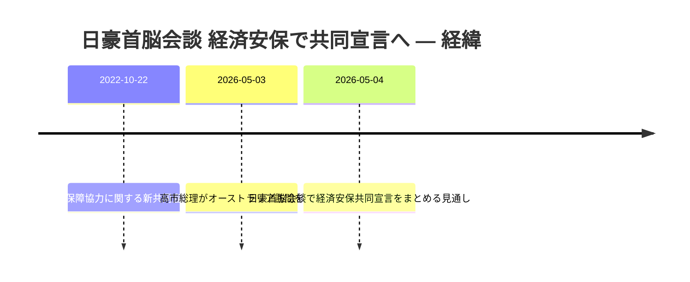

### 当事者マップ

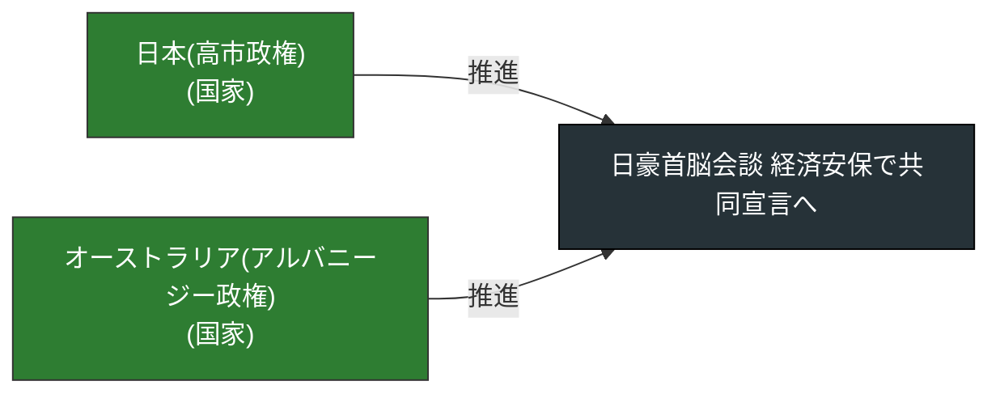

### 影響の広がり

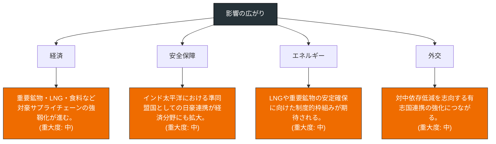

### 当事者の関係ネットワーク

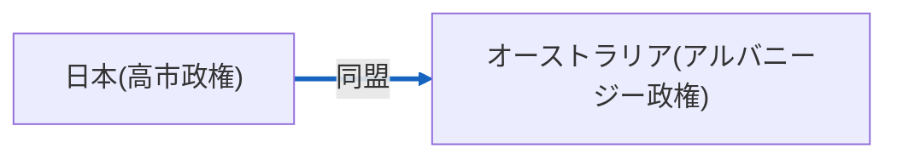

### 押さえるべき論点

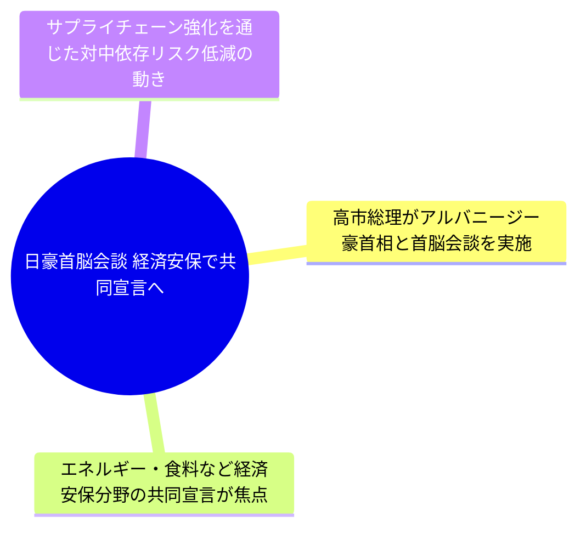


---

## 自民・小林氏、印与党と経済安保協力で一致 `重要度: 中` `east_asia / global`
- **出典:** NHK 国際 ([原文](http://www3.nhk.or.jp/news/html/20260504/k10015114131000.html)) / **公開:** 2026-05-04 05:01

**要約**
自民党の小林政務調査会長は訪問先のインドで、与党インド人民党(BJP)のナビン総裁と会談しました。両党は政党間交流を一層深めることで一致しました。さらに、エネルギーや半導体といった経済安全保障分野での日印協力を、双方の与党として後押ししていく方針を確認しました。

**背景**
日本とインドは「特別戦略的グローバル・パートナーシップ」のもと、中国の影響力拡大やサプライチェーン再編を背景に経済安全保障協力を強化してきた。半導体・重要鉱物・エネルギー分野での連携は、QUADの枠組みとも連動して進められている。

**要点**
- 自民党とインド与党BJPが党レベルで経済安保協力を後押しする方針を確認

- 協力分野はエネルギーと半導体など戦略物資が中心

- 政府間に加え与党間チャンネルを通じた日印関係強化の動き


### 経緯タイムライン

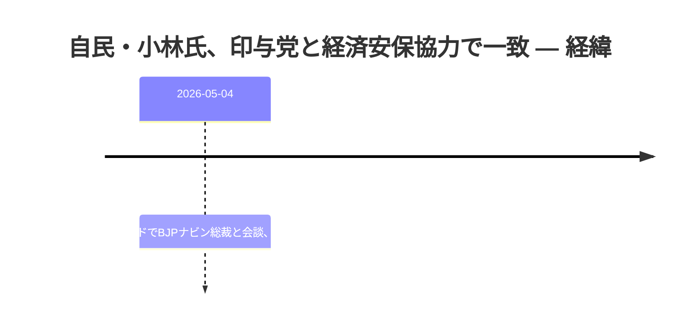

### 当事者マップ

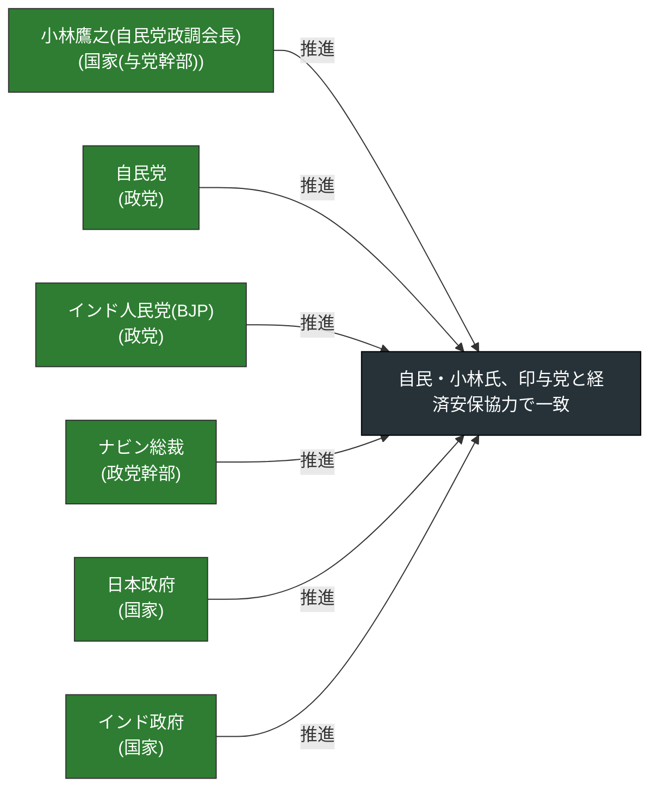

### 影響の広がり

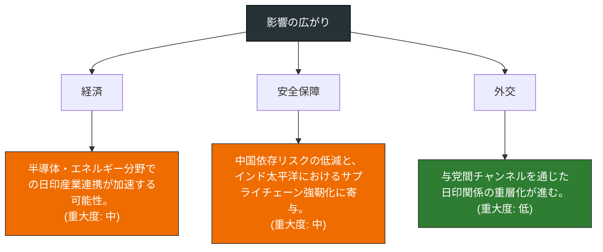

### 当事者の関係ネットワーク

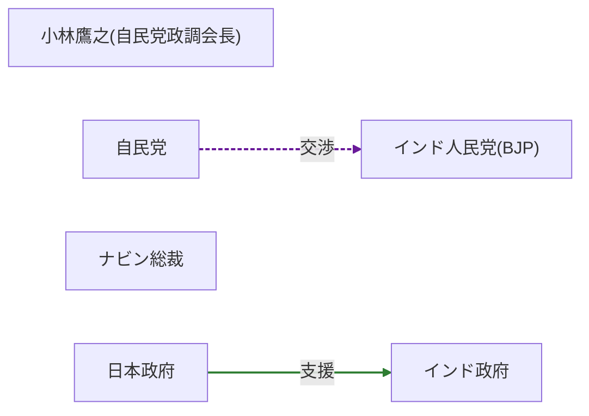

### 押さえるべき論点

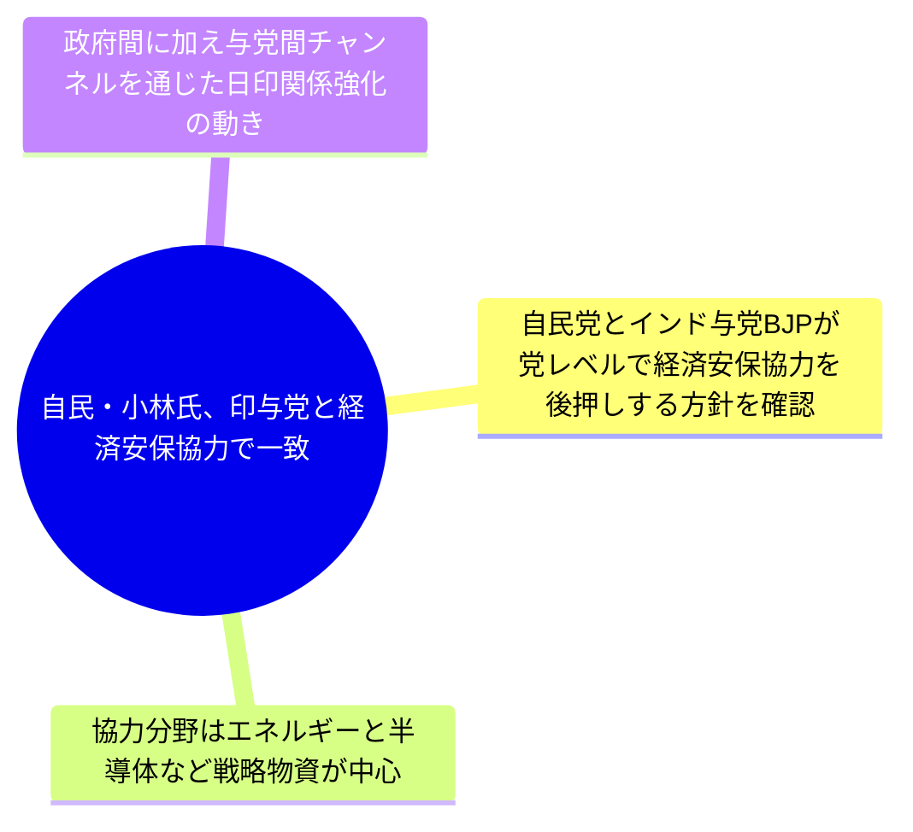


---

## ウクライナ、ロシアの影の船団を攻撃 `重要度: 中` `europe / global`
- **出典:** NHK 国際 ([原文](http://www3.nhk.or.jp/news/html/20260504/k10015114241000.html)) / **公開:** 2026-05-04 04:59

**要約**
ウクライナのゼレンスキー大統領は、ロシア産石油を運ぶいわゆる「影の船団」とみられるタンカーをロシア南部の港付近で攻撃したと発表した。ウクライナは製油所などエネルギー関連施設への攻撃も増加させている。これらは、ロシアの戦闘継続能力を削ぐための経済・エネルギー打撃作戦の一環と位置付けられる。攻撃の拡大はロシアの石油輸出収入と国際海運に影響を及ぼす可能性がある。

**背景**
ロシアは欧米の制裁と価格上限を回避するため、所有・保険関係が不透明な「影の船団」を活用して原油輸出を継続してきた。ウクライナはここ数か月、ドローンや無人艇を用いてロシア領内の製油所や港湾施設への攻撃を強化している。

**要点**
- ウクライナがロシアの「影の船団」タンカーを直接攻撃したと公表

- 製油所などエネルギー施設への攻撃も同時に強化

- ロシアの戦争継続能力を経済・エネルギー面から削ぐ戦略

- 国際原油市場や海上保険、海洋環境への波及リスク


### 経緯タイムライン

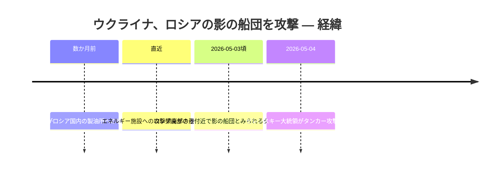

### 当事者マップ

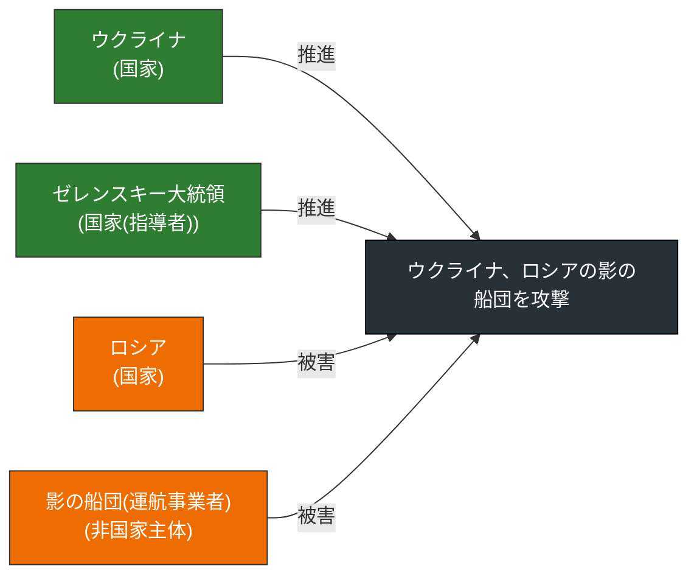

### 影響の広がり

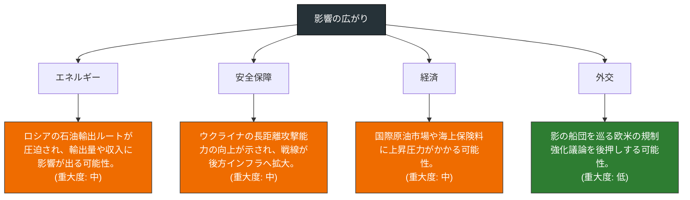

### 当事者の関係ネットワーク

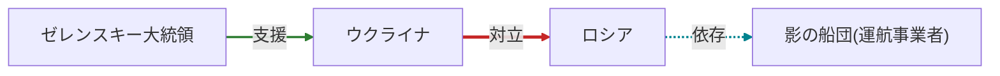

### 押さえるべき論点

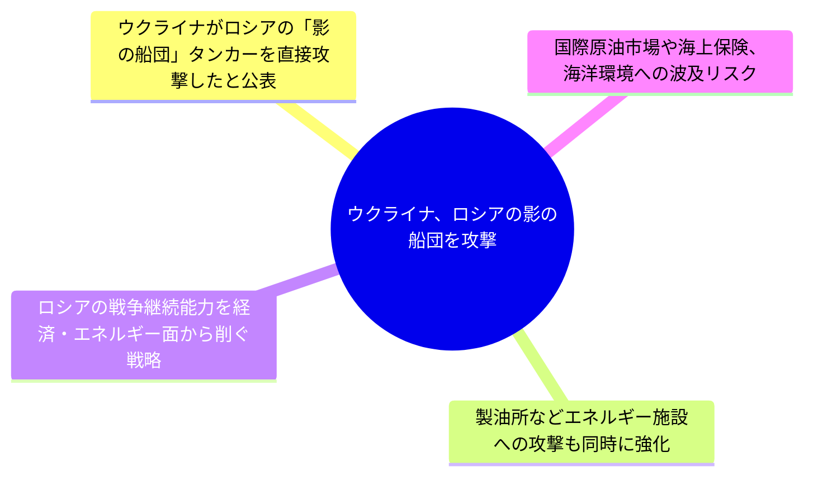


---

## 日本・ケニア外相会談 OSA活用で安保協力強化 `重要度: 中` `africa / defense_export`
- **出典:** NHK 国際 ([原文](http://www3.nhk.or.jp/news/html/20260503/k10015114121000.html)) / **公開:** 2026-05-03 22:31

**要約**
茂木外務大臣は訪問先のケニアでムダバディ外相と会談し、安全保障協力の強化で一致しました。日本が同志国に防衛装備品を提供する政府安全保障能力強化支援(OSA)の枠組み活用も含め、両国の連携を深める方針が確認されました。両外相は法の支配に基づく国際秩序の維持・強化に共に取り組むことでも一致しました。アフリカ東岸の要衝に位置するケニアとの関係強化は、インド太平洋戦略の文脈でも重要な意味を持ちます。

**背景**
日本は2023年に同志国の安全保障能力向上を支援するOSA(政府安全保障能力強化支援)を創設し、ODAとは別枠で防衛装備品を供与する仕組みを整備しました。ケニアは東アフリカの地域大国であり、紅海・インド洋の海洋安全保障上も重要なパートナーと位置づけられています。

**要点**
- 茂木外相とケニアのムダバディ外相が会談し、安全保障協力の強化で一致

- 日本のOSA(政府安全保障能力強化支援)による防衛装備品提供枠組みの活用が焦点

- 東アフリカの要衝ケニアとの連携は、インド太平洋戦略とアフリカ外交の双方で重要


### 経緯タイムライン

```mermaid
timeline
  title 日本・ケニア外相会談 OSA活用で安保協力強化 — 経緯
  2023 : 日本がOSA(政府安全保障能力強化支援)制度を創設
  2024-03 : 防衛装備移転三原則の運用指針改定でGCAP完成機の第三国輸出を容認
  2026-05-03 : 茂木外相がケニア訪問、ムダバディ外相と会談しOSA活用で一致
```

### 当事者マップ

```mermaid
flowchart LR
  T["日本・ケニア外相会談 OSA活用で安保協力強化"]
  A0["日本(茂木外務大臣)\n(国家)"]
  A0 -- 推進 --> T
  style A0 fill:#2e7d32,color:#fff,stroke:#333
  A1["ケニア(ムダバディ外相)\n(国家)"]
  A1 -- 推進 --> T
  style A1 fill:#2e7d32,color:#fff,stroke:#333
  style T fill:#263238,color:#fff,stroke:#000
```

### 影響の広がり

```mermaid
flowchart TB
  R["影響の広がり"]
  D0["安全保障"]
  I0["東アフリカ・インド洋地域における日本のプレゼンス強化と海洋安全保障協力の進展につながります。\n(重大度: 中)"]
  R --> D0 --> I0
  style I0 fill:#ef6c00,color:#fff,stroke:#333
  D1["外交"]
  I1["日本のアフリカ外交、特にグローバルサウスへの関与強化を象徴する動きとなります。\n(重大度: 中)"]
  R --> D1 --> I1
  style I1 fill:#ef6c00,color:#fff,stroke:#333
  D2["技術"]
  I2["防衛装備移転三原則の運用拡大の一例として、OSAを通じた装備供与が新たな枠組みとして定着しつつあります。\n(重大度: 低)"]
  R --> D2 --> I2
  style I2 fill:#2e7d32,color:#fff,stroke:#333
  style R fill:#263238,color:#fff,stroke:#000
```

### 当事者の関係ネットワーク

```mermaid
graph LR
  N0["日本(茂木外務大臣)"]
  N1["ケニア(ムダバディ外相)"]
  N0 -->|支援| N1
  linkStyle 0 stroke:#2e7d32,stroke-width:2px;
```

### 押さえるべき論点

```mermaid
mindmap
  root((日本・ケニア外相会談 OSA活用で安保協力強化))
    茂木外相とケニアのムダバディ外相が会談し、安全保障協力の強化で一致
    日本のOSA(政府安全保障能力強化支援)による防衛装備品提供枠組みの活用が焦点
    東アフリカの要衝ケニアとの連携は、インド太平洋戦略とアフリカ外交の双方で重要
```


---
