# 地政学ニュース図解レポート 2026-05-05 号

生成日時: 2026-05-05 07:56 / 記事数: 5


## 📌 本日の要点

- **日豪首脳会談、経済安保で共同宣言** — 高市総理大臣はオーストラリアのアルバニージー首相と首脳会談を行い、経済安全保障協力の指針となる共同宣言を発表しました。


## 日豪首脳会談、経済安保で共同宣言 `重要度: 高` `east_asia / global`
- **出典:** NHK 国際 ([原文](http://www3.nhk.or.jp/news/html/20260504/k10015114361000.html)) / **公開:** 2026-05-04 18:31

**要約**
高市総理大臣はオーストラリアのアルバニージー首相と首脳会談を行い、経済安全保障協力の指針となる共同宣言を発表しました。共同宣言ではエネルギーや食料などのサプライチェーン強化に向けた連携が柱とされています。両首脳はまた、安全保障協力をいっそう強化していくことでも一致しました。日豪が「準同盟」とも呼ばれる関係をさらに深化させる動きとして注目されます。

**背景**
日本とオーストラリアは2022年の安全保障協力共同宣言や円滑化協定(RAA)を通じて防衛・安保協力を急速に深めてきた。中国の経済的威圧やインド太平洋地域の不安定化を背景に、重要鉱物・エネルギー・食料などのサプライチェーン強靭化が両国の共通課題となっている。

**要点**
- 日豪首脳が経済安全保障の指針となる共同宣言を発表

- エネルギー・食料などのサプライチェーン強化が柱

- 安全保障協力をさらに強化することで両首脳が一致


### 経緯タイムライン

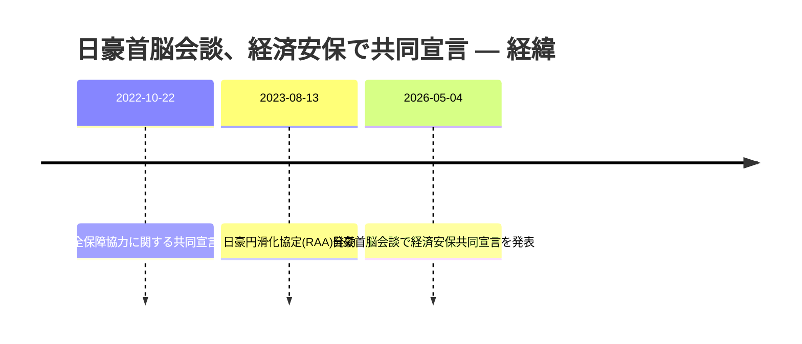

### 当事者マップ

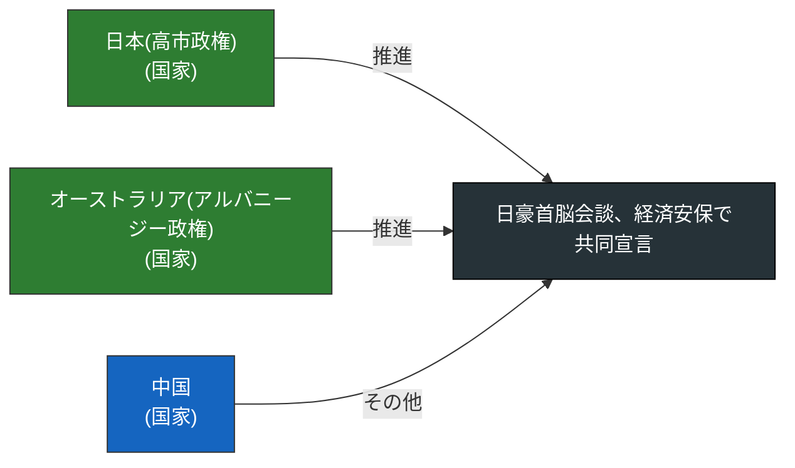

### 影響の広がり

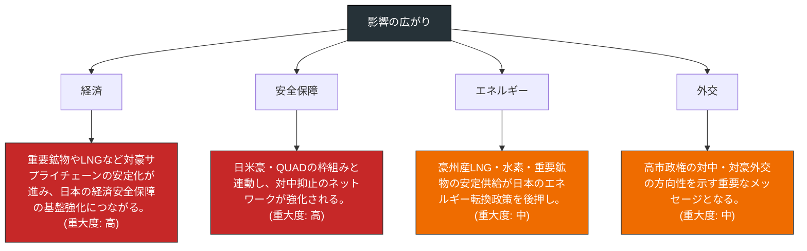

### 当事者の関係ネットワーク

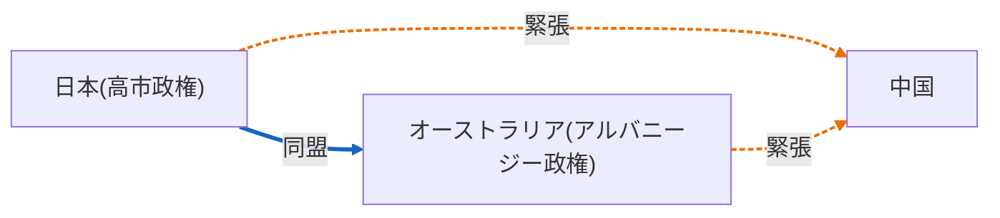

### 押さえるべき論点

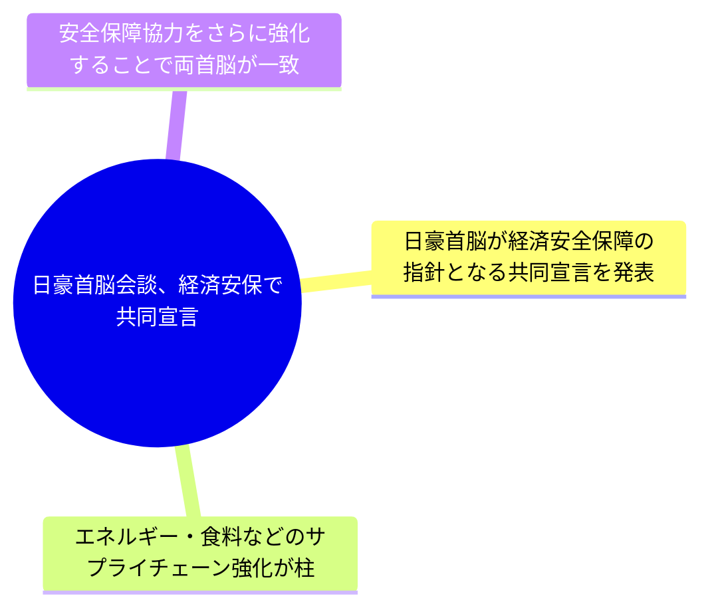


---

## 露ウ双方が異なる期間の停戦発表 `重要度: 中` `europe / global`
- **出典:** NHK 国際 ([原文](http://www3.nhk.or.jp/news/html/20260505/k10015114751000.html)) / **公開:** 2026-05-05 07:16

**要約**
ロシア国防省は5月4日、第2次世界大戦の戦勝記念日にあわせ、5月8日から2日間ウクライナ側と一時的に停戦すると一方的に発表した。一方、ウクライナ側は5月6日午前0時から停戦に入ると主張しており、双方の主張する停戦期間や開始時期が食い違っている。両者の調整が取れていないため、実際に停戦が成立するかどうかは不透明な情勢となっている。戦勝記念日を政治的に利用したいロシア側と、それに先んじる形で主導権を握りたいウクライナ側の思惑が交錯している。

**背景**
ロシアによるウクライナ侵攻は長期化しており、これまでも宗教行事や記念日にあわせて一方的な停戦が宣言されたことがあるが、いずれも本格的な停戦には至っていない。5月9日の戦勝記念日はロシアにとって最重要の国家行事であり、軍事パレードを成功させたい思惑がある。

**要点**
- ロシアとウクライナがそれぞれ異なる停戦期間を一方的に発表し、調整は取れていない

- ロシア側の停戦発表は戦勝記念日(5月9日)にあわせた政治的色彩が強い

- 実際に停戦が成立するかは不透明で、過去の一方的停戦も実効性は乏しかった


### 経緯タイムライン

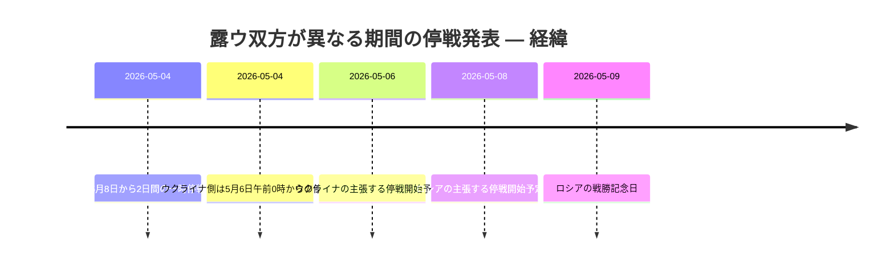

### 当事者マップ

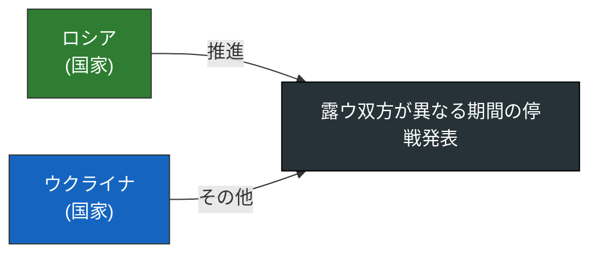

### 影響の広がり

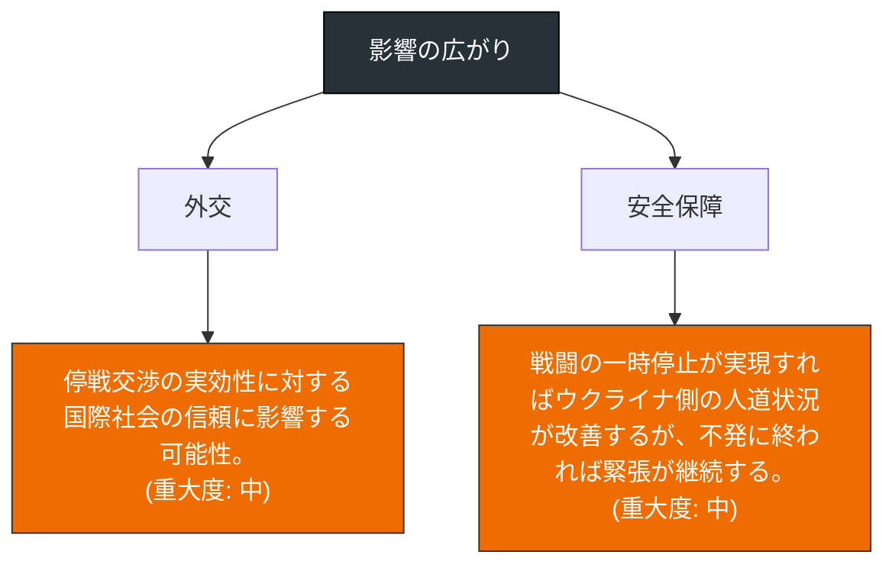

### 当事者の関係ネットワーク

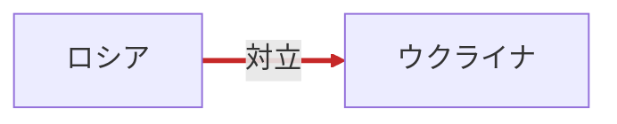

### 押さえるべき論点

```mermaid
mindmap
  root((露ウ双方が異なる期間の停戦発表))
    ロシアとウクライナがそれぞれ異なる停戦期間を一方的に発表し、調整は取れていない
    ロシア側の停戦発表は戦勝記念日(5月9日)にあわせた政治的色彩が強い
    実際に停戦が成立するかは不透明で、過去の一方的停戦も実効性は乏しかった
```


---

## ゼレンスキー氏「ロシア弱体化」と圧力強化要求 `重要度: 中` `europe / global`
- **出典:** NHK 国際 ([原文](http://www3.nhk.or.jp/news/html/20260505/k10015114611000.html)) / **公開:** 2026-05-05 06:14

**要約**
ウクライナのゼレンスキー大統領は、ロシアが毎年恒例の軍事パレードの規模を縮小することについて言及し、これは『ロシアが強くないことのあらわれだ』と指摘した。その上で、ヨーロッパの首脳らに対してロシアへのさらなる圧力強化を呼びかけた。戦争長期化のなか、ウクライナは欧州の支援継続と対露制裁の深化を引き出す狙いがある。

**背景**
ロシアによるウクライナ侵攻は長期化しており、戦況は膠着状態にある。ロシアは経済制裁や軍事的消耗の影響を受けており、毎年5月9日の対独戦勝記念日の軍事パレードは国威発揚の象徴とされてきた。

**要点**
- ゼレンスキー大統領はロシアの軍事パレード縮小を弱体化の表れと評価した

- 欧州首脳に対するさらなる対露圧力強化を要請した

- ウクライナは戦争長期化の中で欧州の支援継続を確保することを重視している


### 経緯タイムライン

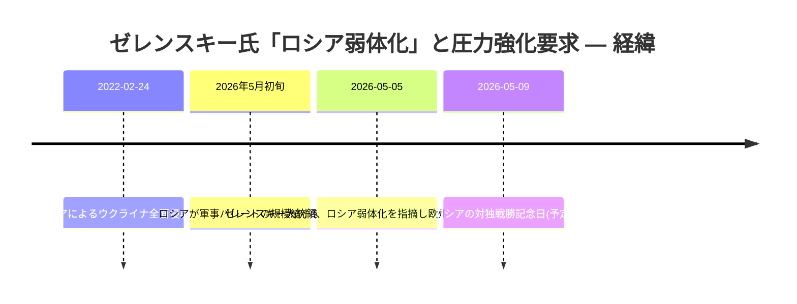

### 当事者マップ

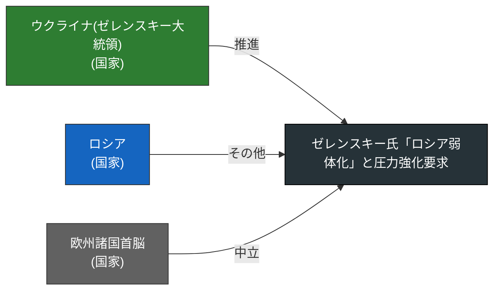

### 影響の広がり

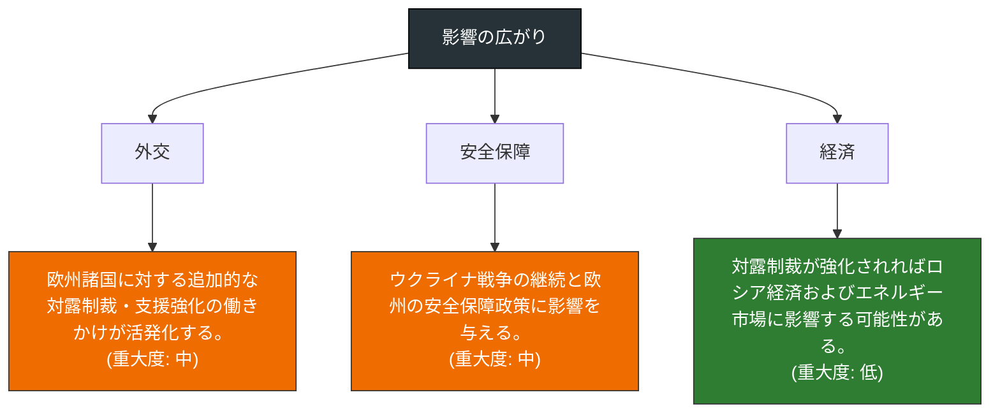

### 当事者の関係ネットワーク

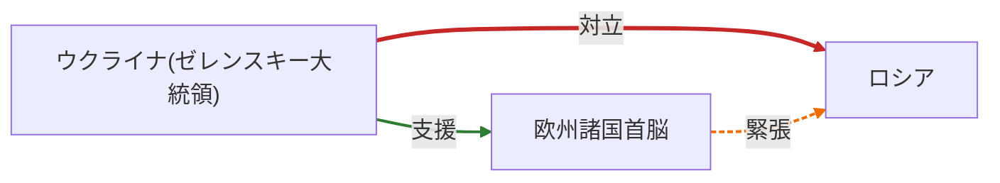

### 押さえるべき論点

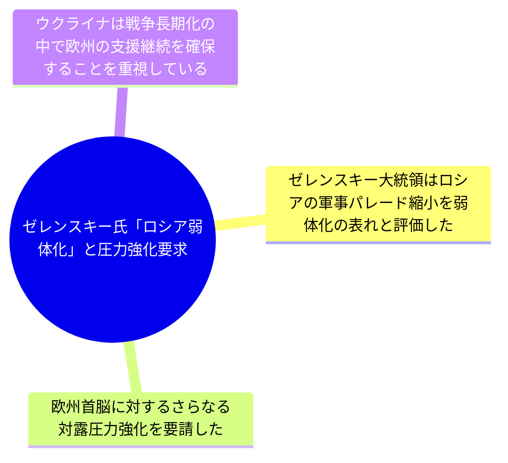


---

## モスクワに無人機攻撃、戦勝記念式典前に警戒 `重要度: 中` `europe / global`
- **出典:** NHK 国際 ([原文](http://www3.nhk.or.jp/news/html/20260504/k10015114631000.html)) / **公開:** 2026-05-04 22:01

**要約**
ロシアの首都モスクワで4日にかけてウクライナによるとみられる無人機攻撃があり、高層アパートに被害が出た。モスクワでは第2次世界大戦の対独戦勝を祝う5月9日の式典準備が進められている最中であり、プーチン政権は警戒を強めているとみられる。首都圏への攻撃は政権の威信に直結するため、防空体制の強化が急務となっている。

**背景**
ウクライナはロシアによる侵攻が長期化する中、ロシア領内の軍事・象徴的拠点への無人機攻撃を強めている。5月9日の対独戦勝記念日はロシアにとって最重要の国家行事であり、過去にも式典前後にモスクワが標的とされてきた。

**要点**
- ウクライナの無人機がモスクワの高層アパートに到達し被害が発生

- 5月9日の対独戦勝記念式典を前に首都の警備が課題に

- ロシア首都圏の防空網の限界とウクライナの長距離攻撃能力の向上を示唆


### 経緯タイムライン

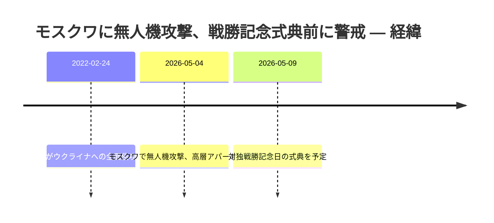

### 当事者マップ

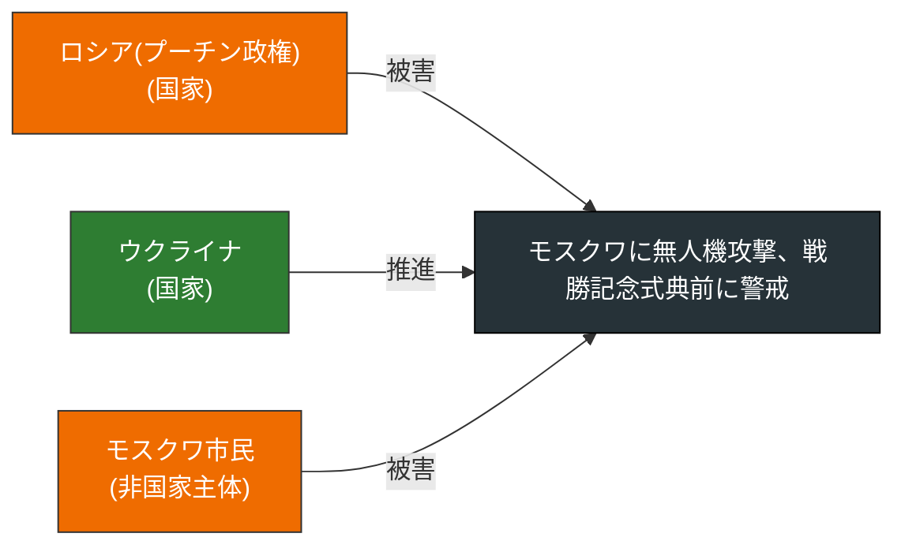

### 影響の広がり

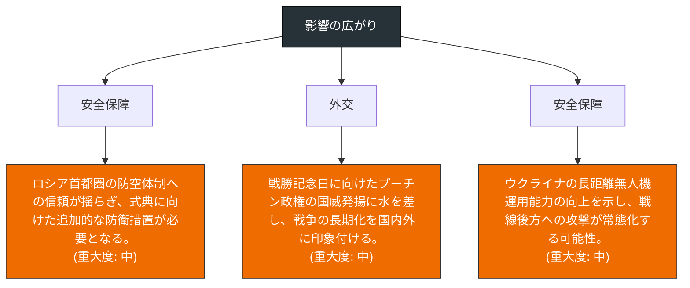

### 当事者の関係ネットワーク

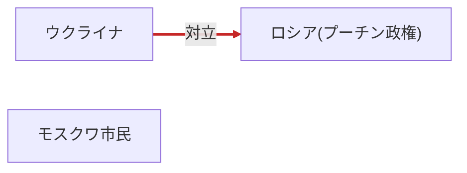

### 押さえるべき論点

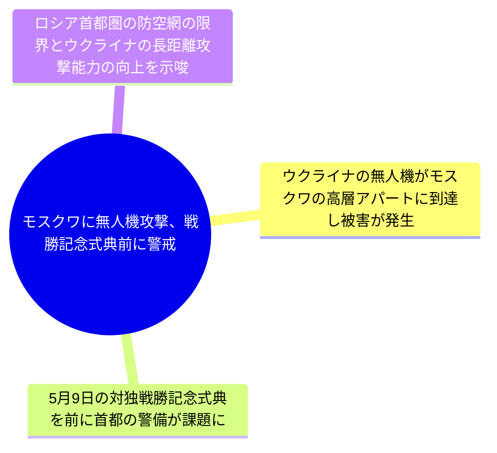


---

## 日豪首脳会談、経済安保で共同宣言へ `重要度: 中` `east_asia / global`
- **出典:** NHK 国際 ([原文](http://www3.nhk.or.jp/news/html/20260504/k10015114111000.html)) / **公開:** 2026-05-04 06:01

**要約**
オーストラリアを訪問中の高市総理大臣は4日、アルバニージー首相と首脳会談を行う。エネルギーや食料などのサプライチェーン強化に向けた連携を柱に、経済安全保障協力の指針となる共同宣言をまとめる見通し。日豪両国は安全保障・経済両面での結び付きを一段と深める方向で一致する見込みである。

**背景**
日豪は『特別な戦略的パートナー』と位置付け合い、近年は防衛協力に加え、重要鉱物・LNG・食料といった経済安全保障分野での連携を強化してきた。中国の経済的威圧やインド太平洋地域の戦略環境変化を背景に、サプライチェーンの強靱化が共通課題となっている。

**要点**
- 高市首相が訪豪し、アルバニージー首相と首脳会談を実施

- エネルギー・食料などサプライチェーン強化を中心に経済安保協力を協議

- 今後の協力の指針となる共同宣言の取りまとめが見込まれる


### 経緯タイムライン

```mermaid
timeline
  title 日豪首脳会談、経済安保で共同宣言へ — 経緯
  首脳会談前 : 高市首相がオーストラリアを訪問
  2026-05-04 : 高市首相とアルバニージー首相が首脳会談
  2026-05-04 : 経済安全保障協力に関する共同宣言を発出見通し
```

### 当事者マップ

```mermaid
flowchart LR
  T["日豪首脳会談、経済安保で共同宣言へ"]
  A0["日本政府(高市首相)\n(国家)"]
  A0 -- 推進 --> T
  style A0 fill:#2e7d32,color:#fff,stroke:#333
  A1["オーストラリア政府(アルバニージー首相)\n(国家)"]
  A1 -- 推進 --> T
  style A1 fill:#2e7d32,color:#fff,stroke:#333
  style T fill:#263238,color:#fff,stroke:#000
```

### 影響の広がり

```mermaid
flowchart TB
  R["影響の広がり"]
  D0["経済"]
  I0["資源・食料の安定確保で日本のエネルギー安全保障が強化される。\n(重大度: 中)"]
  R --> D0 --> I0
  style I0 fill:#ef6c00,color:#fff,stroke:#333
  D1["安全保障"]
  I1["インド太平洋における日豪の戦略的連携が一段と深化する。\n(重大度: 中)"]
  R --> D1 --> I1
  style I1 fill:#ef6c00,color:#fff,stroke:#333
  D2["外交"]
  I2["中国の経済的威圧に対抗する有志国連携の枠組み形成に寄与する。\n(重大度: 中)"]
  R --> D2 --> I2
  style I2 fill:#ef6c00,color:#fff,stroke:#333
  style R fill:#263238,color:#fff,stroke:#000
```

### 当事者の関係ネットワーク

```mermaid
graph LR
  N0["日本政府(高市首相)"]
  N1["オーストラリア政府(アルバニージー首相)"]
  N0 -->|同盟| N1
  linkStyle 0 stroke:#1565c0,stroke-width:3px;
```

### 押さえるべき論点

```mermaid
mindmap
  root((日豪首脳会談、経済安保で共同宣言へ))
    高市首相が訪豪し、アルバニージー首相と首脳会談を実施
    エネルギー・食料などサプライチェーン強化を中心に経済安保協力を協議
    今後の協力の指針となる共同宣言の取りまとめが見込まれる
```


---
