# 地政学ニュース図解レポート 2026-05-06 号

生成日時: 2026-05-06 07:54 / 記事数: 5

## 📌 本日の要点

- **経産相、サウジ・UAEと原油安定供給で一致** — 赤澤経済産業大臣がサウジアラビアとUAEを相次いで訪問し、両国の閣僚らと会談した。

## 経産相、サウジ・UAEと原油安定供給で一致 `重要度: 高` `middle_east / east_asia`
- **出典:** NHK 国際 ([原文](http://www3.nhk.or.jp/news/html/20260506/k10015115031000.html)) / **公開:** 2026-05-06 07:12

**要約**
赤澤経済産業大臣がサウジアラビアとUAEを相次いで訪問し、両国の閣僚らと会談した。ホルムズ海峡が事実上封鎖される中、原油の安定供給に向けて協力していくことで一致した。日本は原油の約9割を中東に依存しており、供給途絶リスクが現実化する中での緊急的な資源外交となった。

**背景**
ホルムズ海峡は世界の石油輸送量の約2割が通過する要衝で、日本の原油輸入の生命線。同海峡が事実上封鎖される事態となっており、イランを巡る緊張やフーシ派による紅海攻撃と相まって、日本のエネルギー安全保障に直接的な打撃となっている。

**要点**
- ホルムズ海峡の事実上封鎖により、日本のエネルギー安全保障が現実的脅威にさらされている

- 赤澤経産相のサウジ・UAE歴訪は、原油の約9割を中東に依存する日本の緊急資源外交

- 供給保証で一致したものの、海峡封鎖が解消されない限り迂回輸送・備蓄放出など実務的対応が不可欠

### 経緯タイムライン

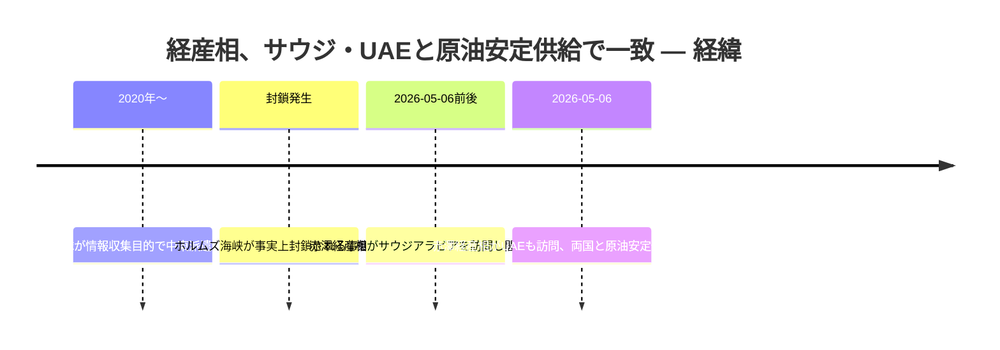
```mermaid
timeline
  title 経産相、サウジ・UAEと原油安定供給で一致 — 経緯
  2020年〜 : 自衛隊が情報収集目的で中東派遣を継続
  封鎖発生 : ホルムズ海峡が事実上封鎖される事態に発展
  2026-05-06前後 : 赤澤経産相がサウジアラビアを訪問し閣僚と会談
  2026-05-06 : 赤澤経産相がUAEも訪問、両国と原油安定供給で協力一致
```

### 当事者マップ

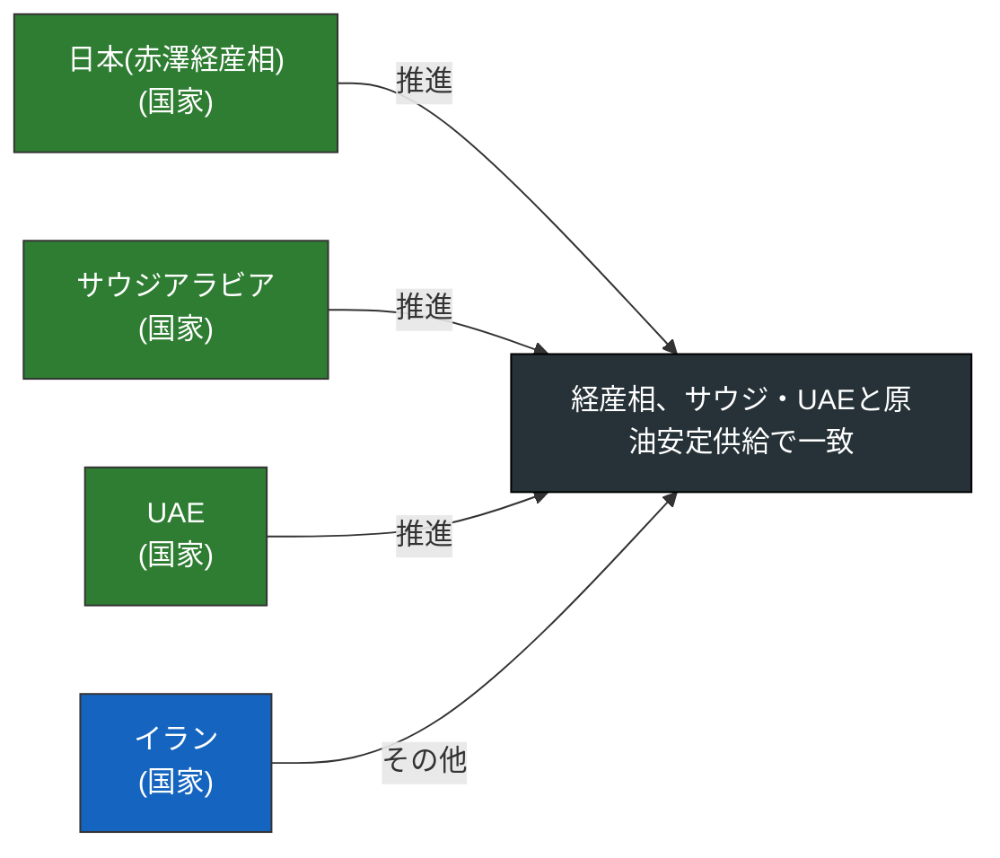
```mermaid
flowchart LR
  T["経産相、サウジ・UAEと原油安定供給で一致"]
  A0["日本(赤澤経産相)\n(国家)"]
  A0 -- 推進 --> T
  style A0 fill:#2e7d32,color:#fff,stroke:#333
  A1["サウジアラビア\n(国家)"]
  A1 -- 推進 --> T
  style A1 fill:#2e7d32,color:#fff,stroke:#333
  A2["UAE\n(国家)"]
  A2 -- 推進 --> T
  style A2 fill:#2e7d32,color:#fff,stroke:#333
  A3["イラン\n(国家)"]
  A3 -- その他 --> T
  style A3 fill:#1565c0,color:#fff,stroke:#333
  style T fill:#263238,color:#fff,stroke:#000
```

### 影響の広がり

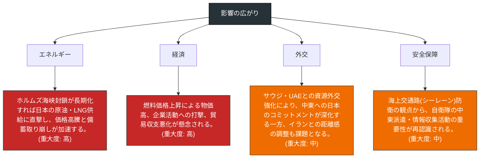
```mermaid
flowchart TB
  R["影響の広がり"]
  D0["エネルギー"]
  I0["ホルムズ海峡封鎖が長期化すれば日本の原油・LNG供給に直撃し、価格高騰と備蓄取り崩しが加速する。\n(重大度: 高)"]
  R --> D0 --> I0
  style I0 fill:#c62828,color:#fff,stroke:#333
  D1["経済"]
  I1["燃料価格上昇による物価高、企業活動への打撃、貿易収支悪化が懸念される。\n(重大度: 高)"]
  R --> D1 --> I1
  style I1 fill:#c62828,color:#fff,stroke:#333
  D2["外交"]
  I2["サウジ・UAEとの資源外交強化により、中東への日本のコミットメントが深化する一方、イランとの距離感の調整も課題となる。\n(重大度: 中)"]
  R --> D2 --> I2
  style I2 fill:#ef6c00,color:#fff,stroke:#333
  D3["安全保障"]
  I3["海上交通路(シーレーン)防衛の観点から、自衛隊の中東派遣・情報収集活動の重要性が再認識される。\n(重大度: 中)"]
  R --> D3 --> I3
  style I3 fill:#ef6c00,color:#fff,stroke:#333
  style R fill:#263238,color:#fff,stroke:#000
```

### 当事者の関係ネットワーク

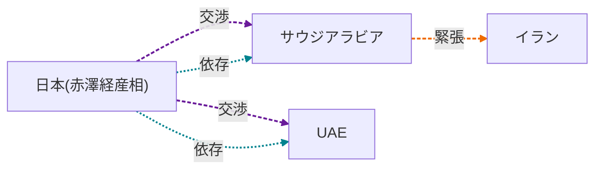
```mermaid
graph LR
  N0["日本(赤澤経産相)"]
  N1["サウジアラビア"]
  N2["UAE"]
  N3["イラン"]
  N0 -->|交渉| N1
  N0 -->|交渉| N2
  N0 -->|依存| N1
  N0 -->|依存| N2
  N1 -->|緊張| N3
  linkStyle 0 stroke:#6a1b9a,stroke-width:2px,stroke-dasharray:4 2;
  linkStyle 1 stroke:#6a1b9a,stroke-width:2px,stroke-dasharray:4 2;
  linkStyle 2 stroke:#00838f,stroke-width:2px,stroke-dasharray:2 2;
  linkStyle 3 stroke:#00838f,stroke-width:2px,stroke-dasharray:2 2;
  linkStyle 4 stroke:#ef6c00,stroke-width:2px,stroke-dasharray:4 2;
```

### 押さえるべき論点

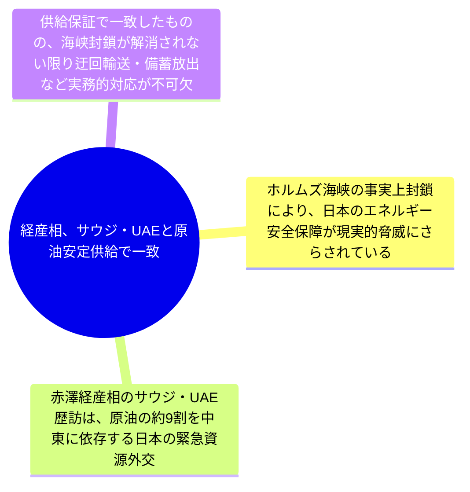
```mermaid
mindmap
  root((経産相、サウジ・UAEと原油安定供給で一致))
    ホルムズ海峡の事実上封鎖により、日本のエネルギー安全保障が現実的脅威にさらされている
    赤澤経産相のサウジ・UAE歴訪は、原油の約9割を中東に依存する日本の緊急資源外交
    供給保証で一致したものの、海峡封鎖が解消されない限り迂回輸送・備蓄放出など実務的対応が不可欠
```

---

## ウクライナとロシア、停戦不透明で攻撃応酬 `重要度: 中` `europe / global`
- **出典:** NHK 国際 ([原文](http://www3.nhk.or.jp/news/html/20260506/k10015115171000.html)) / **公開:** 2026-05-06 06:25

**要約**
ロシアとウクライナはいずれも停戦の方針を表明しているものの、実際には双方が相手側の製油所などエネルギー関連施設への攻撃を継続しています。エネルギーインフラへの打撃は冬季の市民生活と戦争遂行能力の双方に影響を与えるため、戦略的な狙いが指摘されます。停戦交渉の進展は依然として見通せず、戦闘は長期化する様相を呈しています。

**背景**
2022年2月のロシアによる全面侵攻以来、ウクライナとロシアの戦闘は4年以上続いている。近年は双方とも長距離ドローンやミサイルで相手国の製油所・電力施設などエネルギーインフラを標的にする攻撃を激化させてきた。

**要点**
- 両国は表向き停戦方針を示すが攻撃は続行している

- 製油所などエネルギーインフラが主要な標的となっている

- 停戦の実現可能性は依然として不透明で戦闘長期化の懸念

### 経緯タイムライン

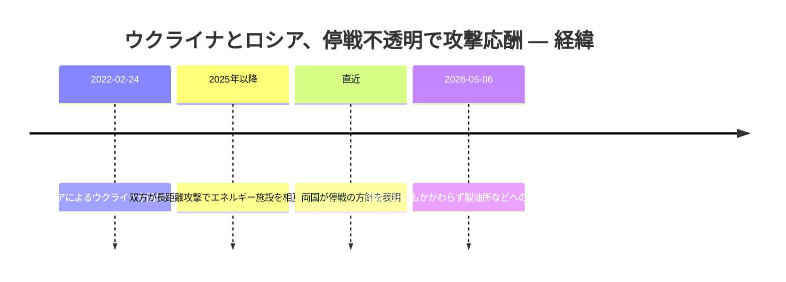
```mermaid
timeline
  title ウクライナとロシア、停戦不透明で攻撃応酬 — 経緯
  2022-02-24 : ロシアによるウクライナ全面侵攻開始
  2025年以降 : 双方が長距離攻撃でエネルギー施設を相互に標的化
  直近 : 両国が停戦の方針を表明
  2026-05-06 : 停戦方針にもかかわらず製油所などへの攻撃が継続
```

### 当事者マップ

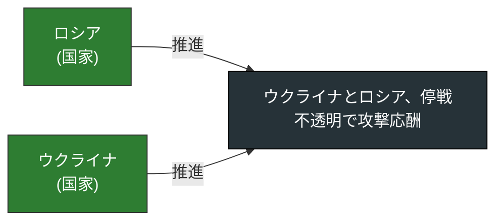
```mermaid
flowchart LR
  T["ウクライナとロシア、停戦不透明で攻撃応酬"]
  A0["ロシア\n(国家)"]
  A0 -- 推進 --> T
  style A0 fill:#2e7d32,color:#fff,stroke:#333
  A1["ウクライナ\n(国家)"]
  A1 -- 推進 --> T
  style A1 fill:#2e7d32,color:#fff,stroke:#333
  style T fill:#263238,color:#fff,stroke:#000
```

### 影響の広がり

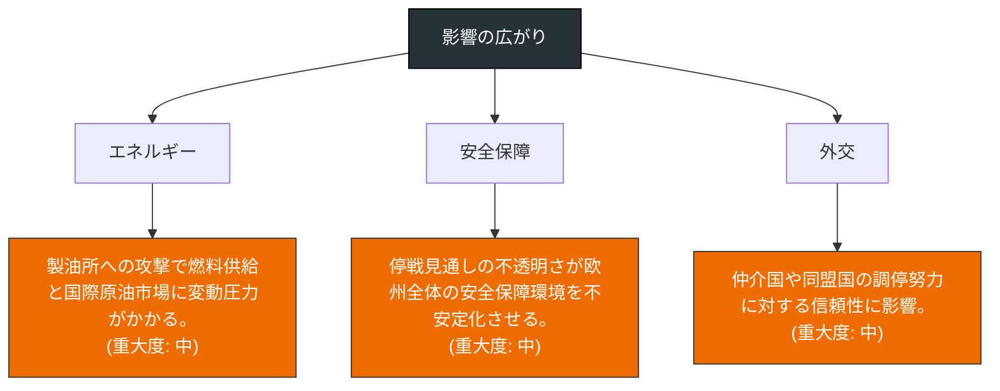
```mermaid
flowchart TB
  R["影響の広がり"]
  D0["エネルギー"]
  I0["製油所への攻撃で燃料供給と国際原油市場に変動圧力がかかる。\n(重大度: 中)"]
  R --> D0 --> I0
  style I0 fill:#ef6c00,color:#fff,stroke:#333
  D1["安全保障"]
  I1["停戦見通しの不透明さが欧州全体の安全保障環境を不安定化させる。\n(重大度: 中)"]
  R --> D1 --> I1
  style I1 fill:#ef6c00,color:#fff,stroke:#333
  D2["外交"]
  I2["仲介国や同盟国の調停努力に対する信頼性に影響。\n(重大度: 中)"]
  R --> D2 --> I2
  style I2 fill:#ef6c00,color:#fff,stroke:#333
  style R fill:#263238,color:#fff,stroke:#000
```

### 当事者の関係ネットワーク

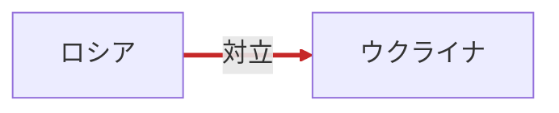
```mermaid
graph LR
  N0["ロシア"]
  N1["ウクライナ"]
  N0 -->|対立| N1
  linkStyle 0 stroke:#c62828,stroke-width:3px;
```

### 押さえるべき論点

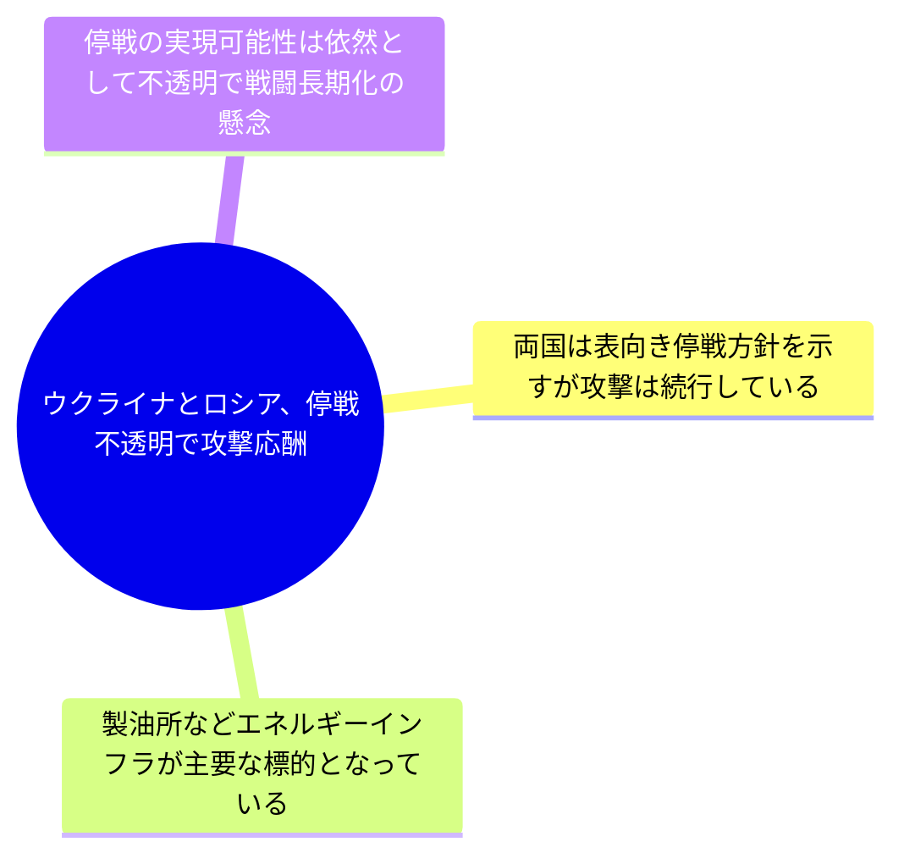
```mermaid
mindmap
  root((ウクライナとロシア、停戦不透明で攻撃応酬))
    両国は表向き停戦方針を示すが攻撃は続行している
    製油所などエネルギーインフラが主要な標的となっている
    停戦の実現可能性は依然として不透明で戦闘長期化の懸念
```

---

## 頼総統がアフリカ訪問終え中国けん制 `重要度: 中` `east_asia / africa`
- **出典:** NHK 国際 ([原文](http://www3.nhk.or.jp/news/html/20260505/k10015114941000.html)) / **公開:** 2026-05-05 16:05

**要約**
台湾の頼清徳総統は、アフリカで唯一の外交関係国であるエスワティニへの訪問を終え、5月5日に台湾へ帰還した。頼総統は「台湾の人々が世界に向かって進む決心と意志を示した」と談話を発表。先月は中国の圧力を理由に訪問を一時見合わせていた経緯があり、今回の訪問実現と帰国後の談話で中国をけん制した形となった。台湾の限られた外交空間を維持する意志を国際社会に示す狙いがある。

**背景**
台湾は中国の外交圧力により国交国を年々減らし、現在は十数カ国にとどまる。アフリカではエスワティニが唯一の外交関係国であり、頼総統の訪問は中国による圧力工作との攻防の象徴となっていた。

**要点**
- 台湾の頼清徳総統がアフリカ唯一の国交国エスワティニ訪問を完遂

- 先月は中国の圧力で訪問を一時延期しており、実現は中国へのけん制

- 台湾の限られた外交空間を巡る中台の攻防が継続

### 経緯タイムライン

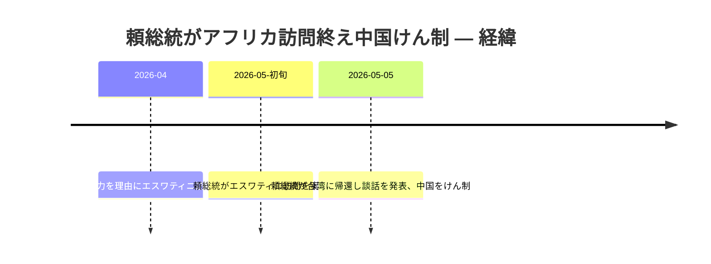
```mermaid
timeline
  title 頼総統がアフリカ訪問終え中国けん制 — 経緯
  2026-04 : 頼総統が中国の圧力を理由にエスワティニ訪問を一時見合わせ
  2026-05-初旬 : 頼総統がエスワティニ訪問を実施
  2026-05-05 : 頼総統が台湾に帰還し談話を発表、中国をけん制
```

### 当事者マップ

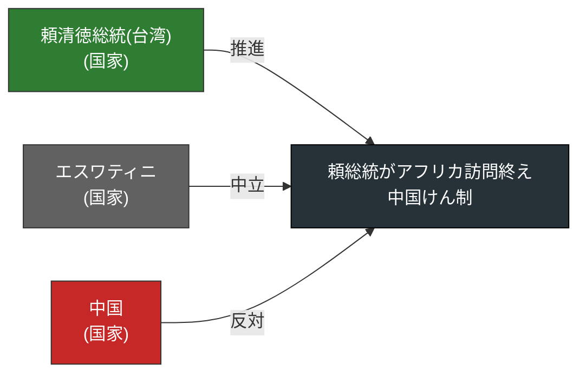
```mermaid
flowchart LR
  T["頼総統がアフリカ訪問終え中国けん制"]
  A0["頼清徳総統(台湾)\n(国家)"]
  A0 -- 推進 --> T
  style A0 fill:#2e7d32,color:#fff,stroke:#333
  A1["エスワティニ\n(国家)"]
  A1 -- 中立 --> T
  style A1 fill:#616161,color:#fff,stroke:#333
  A2["中国\n(国家)"]
  A2 -- 反対 --> T
  style A2 fill:#c62828,color:#fff,stroke:#333
  style T fill:#263238,color:#fff,stroke:#000
```

### 影響の広がり

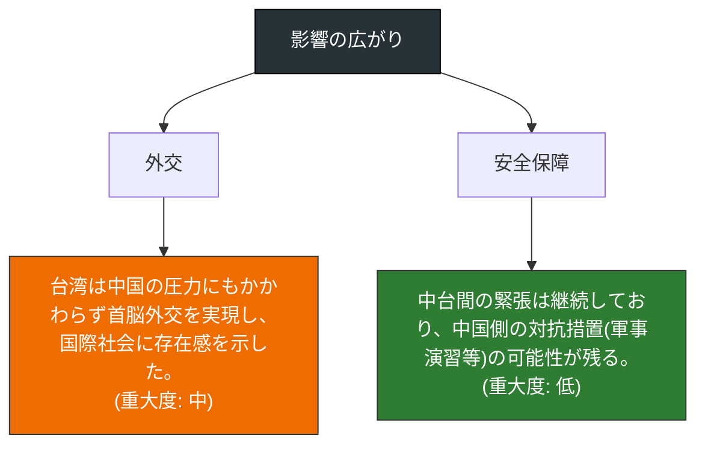
```mermaid
flowchart TB
  R["影響の広がり"]
  D0["外交"]
  I0["台湾は中国の圧力にもかかわらず首脳外交を実現し、国際社会に存在感を示した。\n(重大度: 中)"]
  R --> D0 --> I0
  style I0 fill:#ef6c00,color:#fff,stroke:#333
  D1["安全保障"]
  I1["中台間の緊張は継続しており、中国側の対抗措置(軍事演習等)の可能性が残る。\n(重大度: 低)"]
  R --> D1 --> I1
  style I1 fill:#2e7d32,color:#fff,stroke:#333
  style R fill:#263238,color:#fff,stroke:#000
```

### 当事者の関係ネットワーク

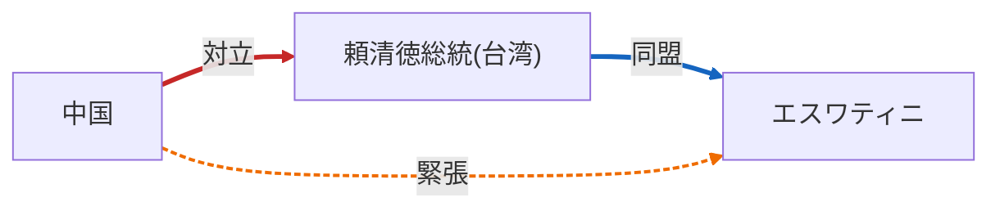
```mermaid
graph LR
  N0["頼清徳総統(台湾)"]
  N1["エスワティニ"]
  N2["中国"]
  N0 -->|同盟| N1
  N2 -->|対立| N0
  N2 -->|緊張| N1
  linkStyle 0 stroke:#1565c0,stroke-width:3px;
  linkStyle 1 stroke:#c62828,stroke-width:3px;
  linkStyle 2 stroke:#ef6c00,stroke-width:2px,stroke-dasharray:4 2;
```

### 押さえるべき論点

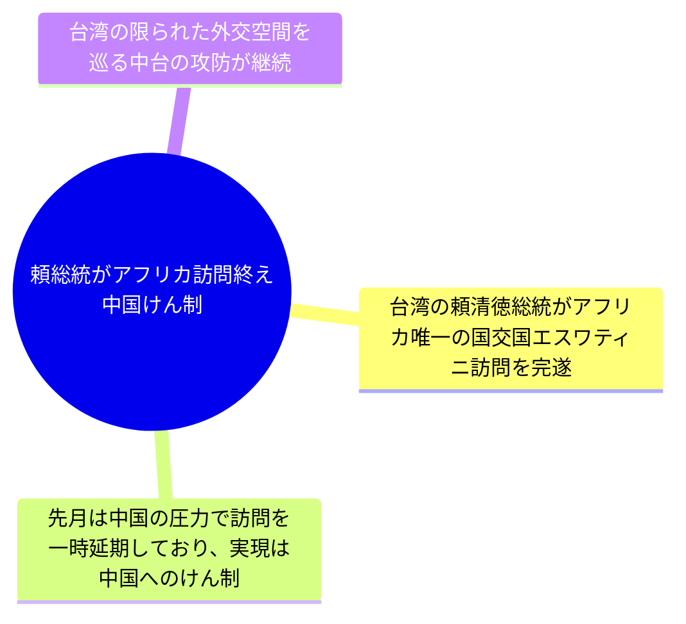
```mermaid
mindmap
  root((頼総統がアフリカ訪問終え中国けん制))
    台湾の頼清徳総統がアフリカ唯一の国交国エスワティニ訪問を完遂
    先月は中国の圧力で訪問を一時延期しており、実現は中国へのけん制
    台湾の限られた外交空間を巡る中台の攻防が継続
```

---

## サハリン2原油が愛媛到着、イラン作戦後初 `重要度: 中` `middle_east / east_asia / europe`
- **出典:** NHK 国際 ([原文](http://www3.nhk.or.jp/news/html/20260505/k10015114921000.html)) / **公開:** 2026-05-05 15:33

**要約**
ロシア極東のサハリン2プロジェクトで生産された原油が愛媛県の製油所に到着しました。イランへの軍事作戦開始以降、サハリン2産原油の対日輸送は今回が初めてです。中東情勢の悪化を受け、日本はエネルギー調達先の多様化を急いでいます。サハリン2は対露制裁下でも日本のLNG・原油調達源として例外的に維持されてきた経緯があります。

**背景**
日本は原油の約9割を中東に依存しており、イラン関連の軍事作戦で中東からの供給に不確実性が生じています。サハリン2はロシア・ウクライナ戦争後も日本がエネルギー安全保障上の理由で権益を維持してきたプロジェクトです。

**要点**
- イラン軍事作戦後、初のサハリン2産原油が愛媛に到着

- 中東依存リスクの顕在化で代替調達が加速

- 対露制裁下でもサハリン2は日本のエネルギー安保上の例外的位置づけ

### 経緯タイムライン

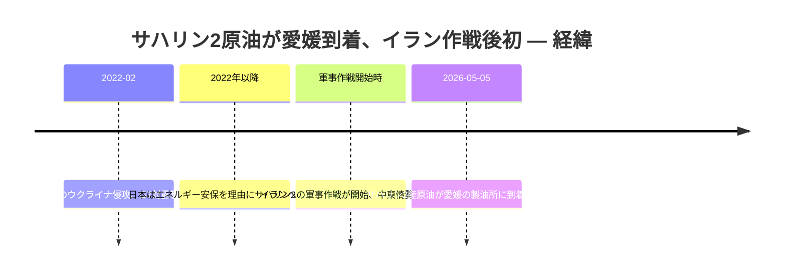
```mermaid
timeline
  title サハリン2原油が愛媛到着、イラン作戦後初 — 経緯
  2022-02 : ロシアのウクライナ侵攻、G7対露制裁開始
  2022年以降 : 日本はエネルギー安保を理由にサハリン2権益を維持
  軍事作戦開始時 : イランへの軍事作戦が開始、中東情勢が悪化
  2026-05-05 : サハリン2産原油が愛媛の製油所に到着(作戦後初)
```

### 当事者マップ

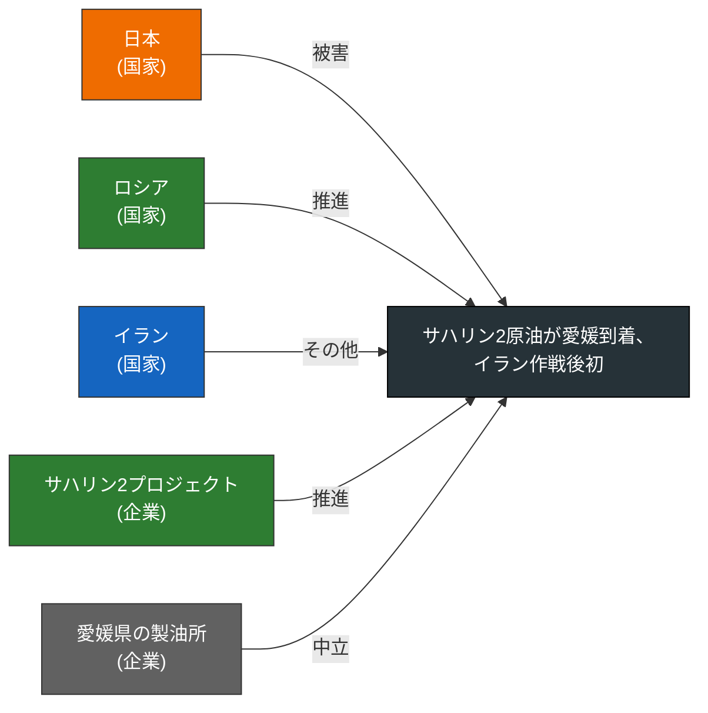
```mermaid
flowchart LR
  T["サハリン2原油が愛媛到着、イラン作戦後初"]
  A0["日本\n(国家)"]
  A0 -- 被害 --> T
  style A0 fill:#ef6c00,color:#fff,stroke:#333
  A1["ロシア\n(国家)"]
  A1 -- 推進 --> T
  style A1 fill:#2e7d32,color:#fff,stroke:#333
  A2["イラン\n(国家)"]
  A2 -- その他 --> T
  style A2 fill:#1565c0,color:#fff,stroke:#333
  A3["サハリン2プロジェクト\n(企業)"]
  A3 -- 推進 --> T
  style A3 fill:#2e7d32,color:#fff,stroke:#333
  A4["愛媛県の製油所\n(企業)"]
  A4 -- 中立 --> T
  style A4 fill:#616161,color:#fff,stroke:#333
  style T fill:#263238,color:#fff,stroke:#000
```

### 影響の広がり

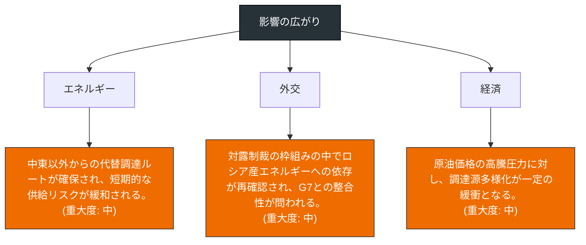
```mermaid
flowchart TB
  R["影響の広がり"]
  D0["エネルギー"]
  I0["中東以外からの代替調達ルートが確保され、短期的な供給リスクが緩和される。\n(重大度: 中)"]
  R --> D0 --> I0
  style I0 fill:#ef6c00,color:#fff,stroke:#333
  D1["外交"]
  I1["対露制裁の枠組みの中でロシア産エネルギーへの依存が再確認され、G7との整合性が問われる。\n(重大度: 中)"]
  R --> D1 --> I1
  style I1 fill:#ef6c00,color:#fff,stroke:#333
  D2["経済"]
  I2["原油価格の高騰圧力に対し、調達源多様化が一定の緩衝となる。\n(重大度: 中)"]
  R --> D2 --> I2
  style I2 fill:#ef6c00,color:#fff,stroke:#333
  style R fill:#263238,color:#fff,stroke:#000
```

### 当事者の関係ネットワーク

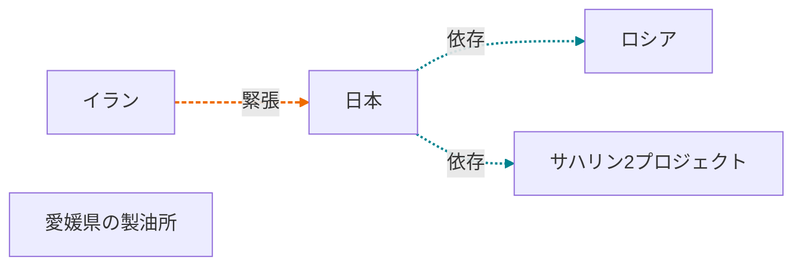
```mermaid
graph LR
  N0["日本"]
  N1["ロシア"]
  N2["イラン"]
  N3["サハリン2プロジェクト"]
  N4["愛媛県の製油所"]
  N0 -->|依存| N1
  N0 -->|依存| N3
  N2 -->|緊張| N0
  linkStyle 0 stroke:#00838f,stroke-width:2px,stroke-dasharray:2 2;
  linkStyle 1 stroke:#00838f,stroke-width:2px,stroke-dasharray:2 2;
  linkStyle 2 stroke:#ef6c00,stroke-width:2px,stroke-dasharray:4 2;
```

### 押さえるべき論点

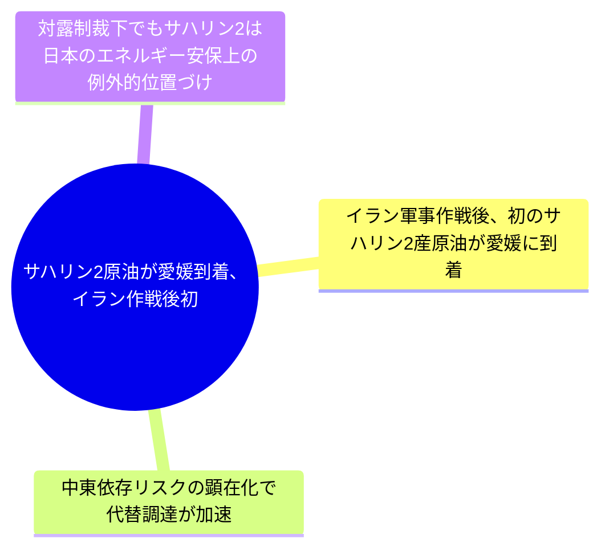
```mermaid
mindmap
  root((サハリン2原油が愛媛到着、イラン作戦後初))
    イラン軍事作戦後、初のサハリン2産原油が愛媛に到着
    中東依存リスクの顕在化で代替調達が加速
    対露制裁下でもサハリン2は日本のエネルギー安保上の例外的位置づけ
```

---

## 露ウ双方が異なる期間の停戦発表 `重要度: 中` `europe / global`
- **出典:** NHK 国際 ([原文](http://www3.nhk.or.jp/news/html/20260505/k10015114751000.html)) / **公開:** 2026-05-05 07:16

**要約**
ロシア国防省は5月8日からの2日間、第2次世界大戦の戦勝記念日にあわせてウクライナとの一時的な停戦に入ると一方的に発表した。これに対しウクライナ側は5月6日午前0時から停戦に入ると主張しており、両者の主張する停戦期間にずれが生じている。停戦が実際に成立するかは極めて不透明な状況にある。

**背景**
ロシアによるウクライナ侵攻は3年以上続いており、双方とも戦闘の長期化に直面している。ロシアでは5月9日の戦勝記念日が政治的に重要な節目とされ、軍事パレードなど大規模な式典が予定されている。

**要点**
- ロシアとウクライナがそれぞれ異なる期間の停戦を一方的に発表し、合意に基づくものではない

- ロシアは戦勝記念日(5月9日)を意識した5月8日からの2日間、ウクライナは5月6日からと主張

- 事前協議のない一方的発表のため、停戦が実際に成立するかは極めて不透明

### 経緯タイムライン

```mermaid
timeline
  title 露ウ双方が異なる期間の停戦発表 — 経緯
  2026-05-04 : ロシア国防省が5月8日から2日間の一時停戦を一方的に発表
  2026-05-05 : ウクライナ側が5月6日午前0時からの停戦を主張
  2026-05-06 : ウクライナ主張の停戦開始予定日
  2026-05-08 : ロシア主張の停戦開始予定日
  2026-05-09 : ロシアの戦勝記念日
```

### 当事者マップ

```mermaid
flowchart LR
  T["露ウ双方が異なる期間の停戦発表"]
  A0["ロシア\n(国家)"]
  A0 -- 推進 --> T
  style A0 fill:#2e7d32,color:#fff,stroke:#333
  A1["ウクライナ\n(国家)"]
  A1 -- その他 --> T
  style A1 fill:#1565c0,color:#fff,stroke:#333
  A2["ロシア国防省\n(国家機関)"]
  A2 -- 推進 --> T
  style A2 fill:#2e7d32,color:#fff,stroke:#333
  style T fill:#263238,color:#fff,stroke:#000
```

### 影響の広がり

```mermaid
flowchart TB
  R["影響の広がり"]
  D0["安全保障"]
  I0["停戦が成立しない場合、戦勝記念日前後に戦闘が激化する恐れがある。\n(重大度: 中)"]
  R --> D0 --> I0
  style I0 fill:#ef6c00,color:#fff,stroke:#333
  D1["外交"]
  I1["停戦の不一致は、和平交渉に向けた両国の信頼醸成を一層困難にする。\n(重大度: 中)"]
  R --> D1 --> I1
  style I1 fill:#ef6c00,color:#fff,stroke:#333
  D2["経済"]
  I2["戦闘継続による欧州エネルギー市場や穀物市場への影響が長期化する。\n(重大度: 低)"]
  R --> D2 --> I2
  style I2 fill:#2e7d32,color:#fff,stroke:#333
  style R fill:#263238,color:#fff,stroke:#000
```

### 当事者の関係ネットワーク

```mermaid
graph LR
  N0["ロシア"]
  N1["ウクライナ"]
  N2["ロシア国防省"]
  N0 -->|対立| N1
  N2 -->|支援| N0
  linkStyle 0 stroke:#c62828,stroke-width:3px;
  linkStyle 1 stroke:#2e7d32,stroke-width:2px;
```

### 押さえるべき論点

```mermaid
mindmap
  root((露ウ双方が異なる期間の停戦発表))
    ロシアとウクライナがそれぞれ異なる期間の停戦を一方的に発表し、合意に基づくものではない
    ロシアは戦勝記念日(5月9日)を意識した5月8日からの2日間、ウクライナは5月6日からと主張
    事前協議のない一方的発表のため、停戦が実際に成立するかは極めて不透明
```

---
