# 地政学ニュース図解レポート 2026-05-07 号

生成日時: 2026-05-07 07:49 / 記事数: 5

## 📌 本日の要点

- **ロシアのウクライナ侵攻 5月6日の動き** — ロシアによるウクライナへの軍事侵攻が継続している。

## ロシアのウクライナ侵攻 5月6日の動き `重要度: 高` `europe / global`
- **出典:** NHK 国際 ([原文](http://www3.nhk.or.jp/news/html/20260506/k10015101791000.html)) / **公開:** 2026-05-06 22:40

**要約**
ロシアによるウクライナへの軍事侵攻が継続している。ウクライナ各地でロシア軍とウクライナ軍の戦闘が続き、大勢の市民が国外への避難を余儀なくされている。NHKは5月6日（日本時間）の戦闘状況や関係各国の外交動向を随時更新で伝えている。

**背景**
2022年2月に始まったロシアによるウクライナ侵攻は長期化し、欧米諸国による対ロ制裁とウクライナへの軍事支援が続いている。停戦の見通しは依然として立たず、戦況と外交の両面で動きが続いている。

**要点**
- ロシアによるウクライナ侵攻は依然として継続している

- ウクライナ各地で戦闘が続き、多数の市民が国外避難を強いられている

- 関係各国の外交動向にも注視が必要

### 経緯タイムライン

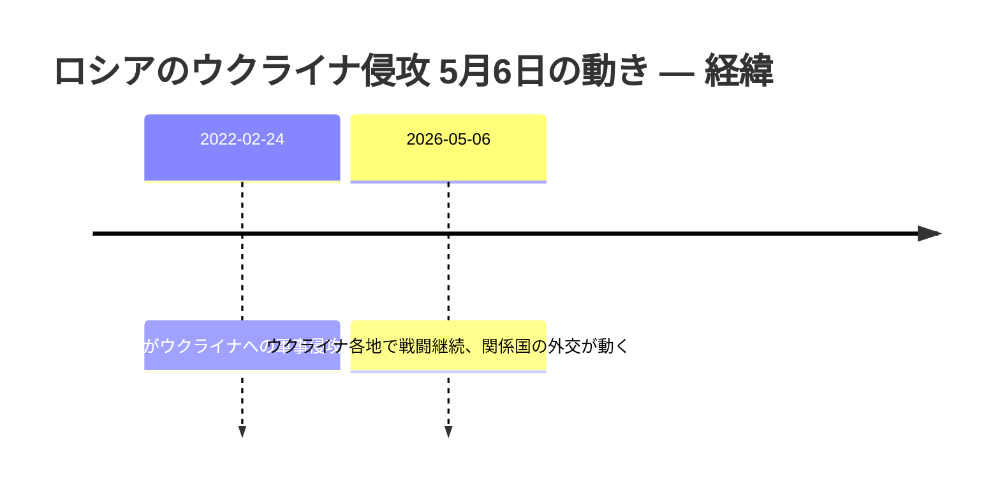
```mermaid
timeline
  title ロシアのウクライナ侵攻 5月6日の動き — 経緯
  2022-02-24 : ロシアがウクライナへの軍事侵攻を開始
  2026-05-06 : ウクライナ各地で戦闘継続、関係国の外交が動く
```

### 当事者マップ

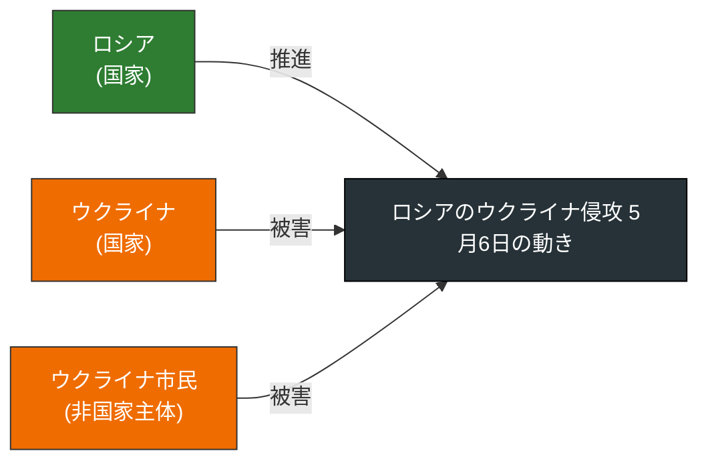
```mermaid
flowchart LR
  T["ロシアのウクライナ侵攻 5月6日の動き"]
  A0["ロシア\n(国家)"]
  A0 -- 推進 --> T
  style A0 fill:#2e7d32,color:#fff,stroke:#333
  A1["ウクライナ\n(国家)"]
  A1 -- 被害 --> T
  style A1 fill:#ef6c00,color:#fff,stroke:#333
  A2["ウクライナ市民\n(非国家主体)"]
  A2 -- 被害 --> T
  style A2 fill:#ef6c00,color:#fff,stroke:#333
  style T fill:#263238,color:#fff,stroke:#000
```

### 影響の広がり

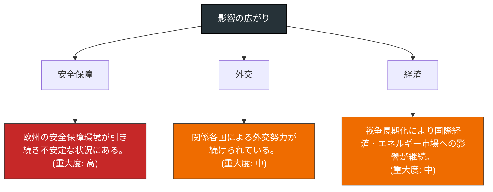
```mermaid
flowchart TB
  R["影響の広がり"]
  D0["安全保障"]
  I0["欧州の安全保障環境が引き続き不安定な状況にある。\n(重大度: 高)"]
  R --> D0 --> I0
  style I0 fill:#c62828,color:#fff,stroke:#333
  D1["外交"]
  I1["関係各国による外交努力が続けられている。\n(重大度: 中)"]
  R --> D1 --> I1
  style I1 fill:#ef6c00,color:#fff,stroke:#333
  D2["経済"]
  I2["戦争長期化により国際経済・エネルギー市場への影響が継続。\n(重大度: 中)"]
  R --> D2 --> I2
  style I2 fill:#ef6c00,color:#fff,stroke:#333
  style R fill:#263238,color:#fff,stroke:#000
```

### 当事者の関係ネットワーク

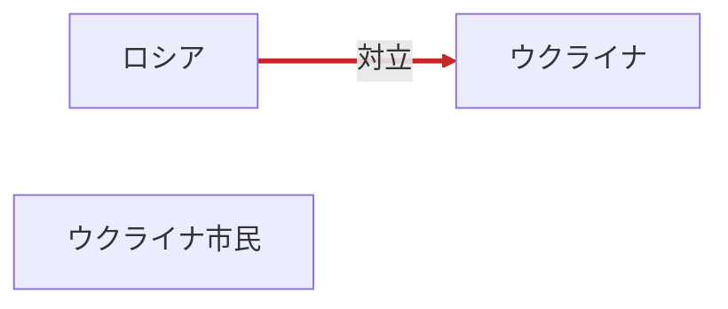
```mermaid
graph LR
  N0["ロシア"]
  N1["ウクライナ"]
  N2["ウクライナ市民"]
  N0 -->|対立| N1
  linkStyle 0 stroke:#c62828,stroke-width:3px;
```

### 押さえるべき論点

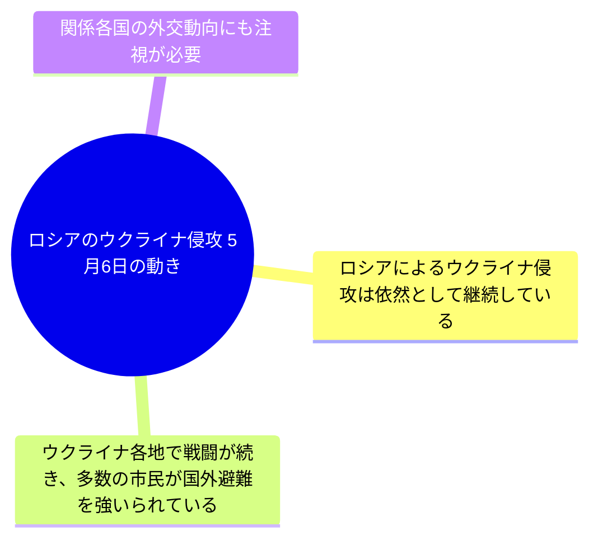
```mermaid
mindmap
  root((ロシアのウクライナ侵攻 5月6日の動き))
    ロシアによるウクライナ侵攻は依然として継続している
    ウクライナ各地で戦闘が続き、多数の市民が国外避難を強いられている
    関係各国の外交動向にも注視が必要
```

---

## 米ガソリン価格、1ガロン4.5ドル超に高騰 `重要度: 中` `middle_east / americas / global`
- **出典:** NHK 国際 ([原文](http://www3.nhk.or.jp/news/html/20260507/k10015115641000.html)) / **公開:** 2026-05-07 06:57

**要約**
アメリカのレギュラーガソリン平均販売価格が1ガロン当たり4ドル50セントを超えました。イラン情勢の緊迫化を背景に原油価格が高止まりしていることが主因です。これはロシアによるウクライナ侵攻直後の2022年7月以来の高値水準となります。燃料費上昇による個人消費への悪影響が懸念されています。

**背景**
中東ではイラン核問題やイスラエルとの軍事的緊張が継続しており、ホルムズ海峡や紅海の航行安全への懸念から原油市場が不安定化しています。米国はトランプ第2次政権下で対イラン「最大限の圧力」路線を再開しており、地政学リスクが原油先物価格を押し上げています。

**要点**
- 米ガソリン平均価格が1ガロン4.5ドルを突破、2022年7月以来の高水準

- イラン情勢に伴う原油価格の高止まりが主因

- 燃料費上昇による米個人消費への悪影響が懸念され、世界経済への波及リスクもある

### 経緯タイムライン

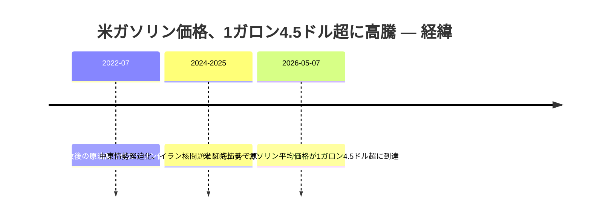
```mermaid
timeline
  title 米ガソリン価格、1ガロン4.5ドル超に高騰 — 経緯
  2022-07 : ウクライナ侵攻後の原油高で米ガソリン価格が高値圏に
  2024-2025 : 中東情勢緊迫化、イラン核問題と紅海情勢で原油市場が不安定化
  2026-05-07 : 米レギュラーガソリン平均価格が1ガロン4.5ドル超に到達
```

### 当事者マップ

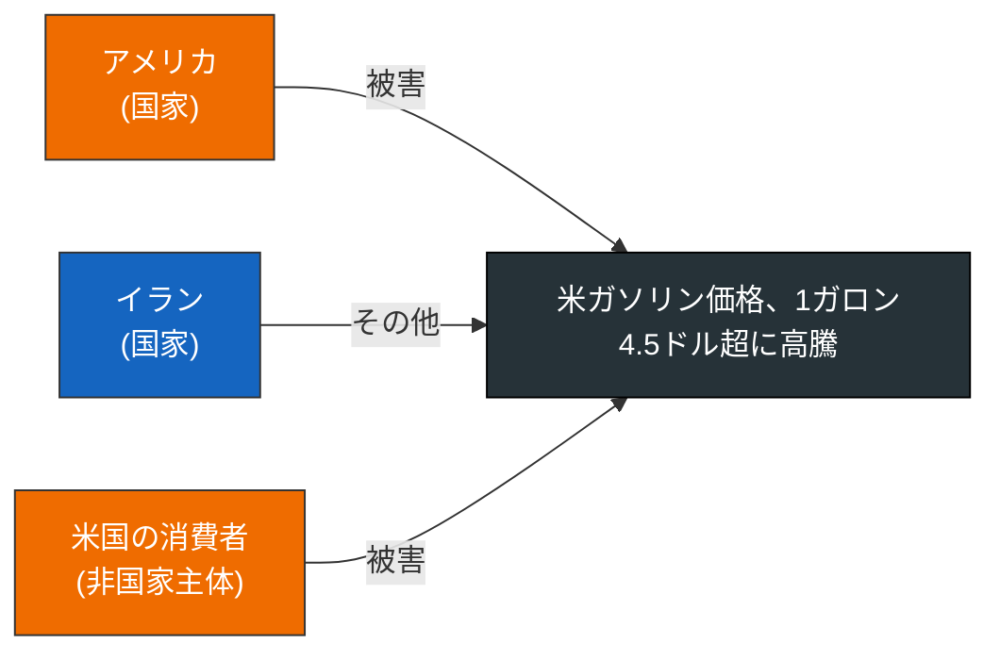
```mermaid
flowchart LR
  T["米ガソリン価格、1ガロン4.5ドル超に高騰"]
  A0["アメリカ\n(国家)"]
  A0 -- 被害 --> T
  style A0 fill:#ef6c00,color:#fff,stroke:#333
  A1["イラン\n(国家)"]
  A1 -- その他 --> T
  style A1 fill:#1565c0,color:#fff,stroke:#333
  A2["米国の消費者\n(非国家主体)"]
  A2 -- 被害 --> T
  style A2 fill:#ef6c00,color:#fff,stroke:#333
  style T fill:#263238,color:#fff,stroke:#000
```

### 影響の広がり

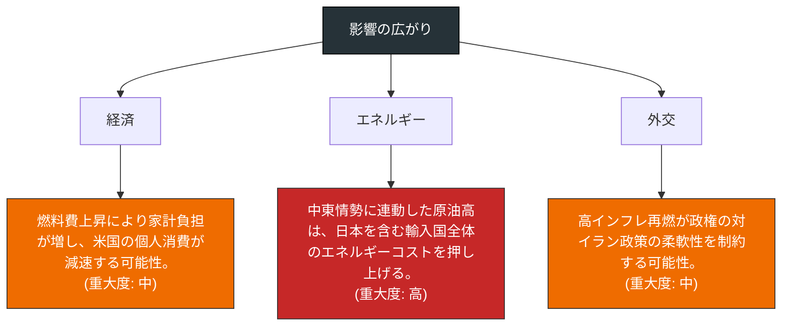
```mermaid
flowchart TB
  R["影響の広がり"]
  D0["経済"]
  I0["燃料費上昇により家計負担が増し、米国の個人消費が減速する可能性。\n(重大度: 中)"]
  R --> D0 --> I0
  style I0 fill:#ef6c00,color:#fff,stroke:#333
  D1["エネルギー"]
  I1["中東情勢に連動した原油高は、日本を含む輸入国全体のエネルギーコストを押し上げる。\n(重大度: 高)"]
  R --> D1 --> I1
  style I1 fill:#c62828,color:#fff,stroke:#333
  D2["外交"]
  I2["高インフレ再燃が政権の対イラン政策の柔軟性を制約する可能性。\n(重大度: 中)"]
  R --> D2 --> I2
  style I2 fill:#ef6c00,color:#fff,stroke:#333
  style R fill:#263238,color:#fff,stroke:#000
```

### 当事者の関係ネットワーク

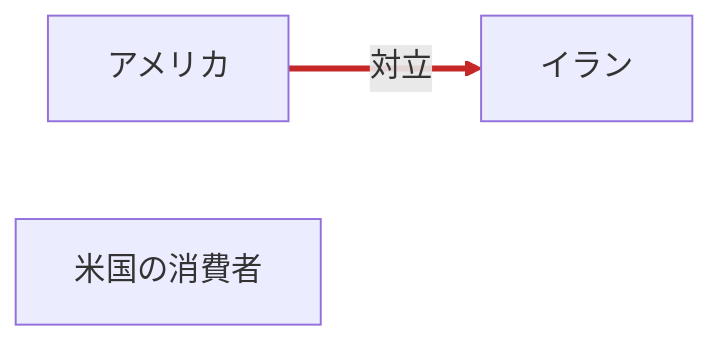
```mermaid
graph LR
  N0["アメリカ"]
  N1["イラン"]
  N2["米国の消費者"]
  N0 -->|対立| N1
  linkStyle 0 stroke:#c62828,stroke-width:3px;
```

### 押さえるべき論点

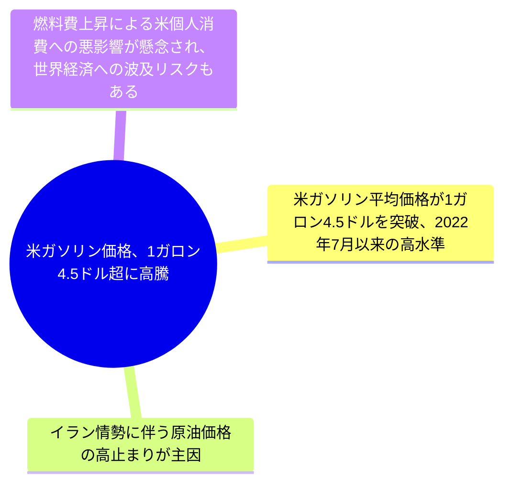
```mermaid
mindmap
  root((米ガソリン価格、1ガロン4.5ドル超に高騰))
    米ガソリン平均価格が1ガロン4.5ドルを突破、2022年7月以来の高水準
    イラン情勢に伴う原油価格の高止まりが主因
    燃料費上昇による米個人消費への悪影響が懸念され、世界経済への波及リスクもある
```

---

## ゼレンスキー氏、ロシアの停戦違反を非難 `重要度: 中` `europe / global`
- **出典:** NHK 国際 ([原文](http://www3.nhk.or.jp/news/html/20260507/k10015115521000.html)) / **公開:** 2026-05-07 06:21

**要約**
ウクライナのゼレンスキー大統領は、6日から呼びかけた停戦後もロシア軍が攻撃を続けたとして停戦違反だと非難した。ロシア側は別途8日からの一時的停戦を発表しているが、すでに散発的な戦闘が継続している。ゼレンスキー氏は今後の対応を決定するとしており、戦闘停止の実現は不透明な情勢となっている。

**背景**
ロシアによるウクライナ侵攻は長期化しており、双方が独自の停戦案や一時停戦を提案する局面が続いている。今回もウクライナ側とロシア側で停戦の枠組みや時期が一致せず、信頼醸成が進まない状況にある。

**要点**
- ウクライナが呼びかけた6日からの停戦中にロシア軍の攻撃があったとゼレンスキー氏が非難

- ロシア側は8日からの一時的停戦を別途発表しており、停戦枠組みが一致していない

- 戦闘の停止が実現するかは依然として不透明で、和平プロセスは難航

### 経緯タイムライン

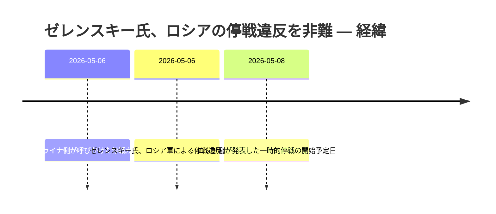
```mermaid
timeline
  title ゼレンスキー氏、ロシアの停戦違反を非難 — 経緯
  2026-05-06 : ウクライナ側が呼びかけた停戦が開始
  2026-05-06 : ゼレンスキー氏、ロシア軍による停戦違反の攻撃を非難
  2026-05-08 : ロシア側が発表した一時的停戦の開始予定日
```

### 当事者マップ

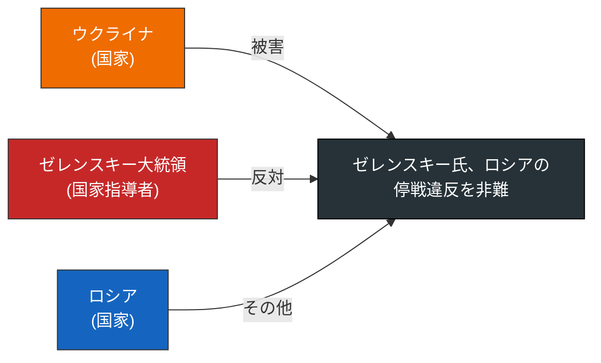
```mermaid
flowchart LR
  T["ゼレンスキー氏、ロシアの停戦違反を非難"]
  A0["ウクライナ\n(国家)"]
  A0 -- 被害 --> T
  style A0 fill:#ef6c00,color:#fff,stroke:#333
  A1["ゼレンスキー大統領\n(国家指導者)"]
  A1 -- 反対 --> T
  style A1 fill:#c62828,color:#fff,stroke:#333
  A2["ロシア\n(国家)"]
  A2 -- その他 --> T
  style A2 fill:#1565c0,color:#fff,stroke:#333
  style T fill:#263238,color:#fff,stroke:#000
```

### 影響の広がり

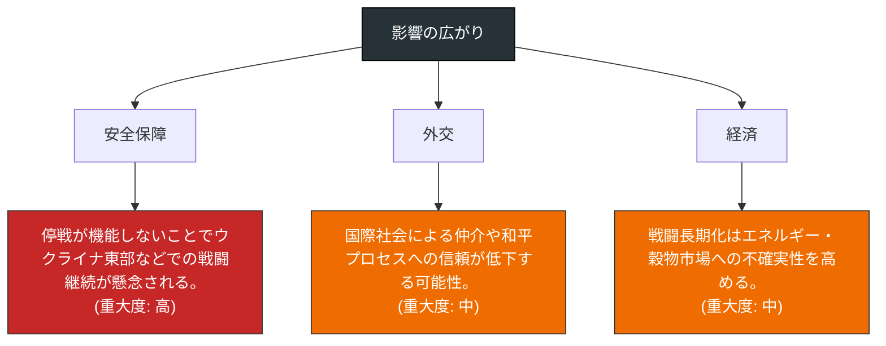
```mermaid
flowchart TB
  R["影響の広がり"]
  D0["安全保障"]
  I0["停戦が機能しないことでウクライナ東部などでの戦闘継続が懸念される。\n(重大度: 高)"]
  R --> D0 --> I0
  style I0 fill:#c62828,color:#fff,stroke:#333
  D1["外交"]
  I1["国際社会による仲介や和平プロセスへの信頼が低下する可能性。\n(重大度: 中)"]
  R --> D1 --> I1
  style I1 fill:#ef6c00,color:#fff,stroke:#333
  D2["経済"]
  I2["戦闘長期化はエネルギー・穀物市場への不確実性を高める。\n(重大度: 中)"]
  R --> D2 --> I2
  style I2 fill:#ef6c00,color:#fff,stroke:#333
  style R fill:#263238,color:#fff,stroke:#000
```

### 当事者の関係ネットワーク

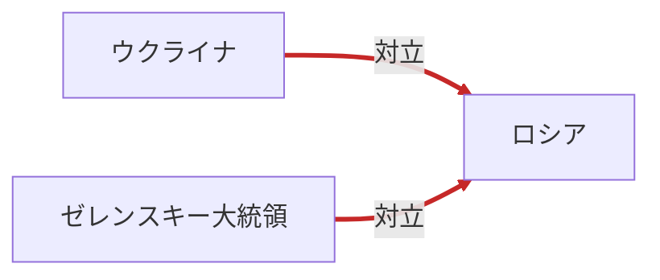
```mermaid
graph LR
  N0["ウクライナ"]
  N1["ゼレンスキー大統領"]
  N2["ロシア"]
  N0 -->|対立| N2
  N1 -->|対立| N2
  linkStyle 0 stroke:#c62828,stroke-width:3px;
  linkStyle 1 stroke:#c62828,stroke-width:3px;
```

### 押さえるべき論点

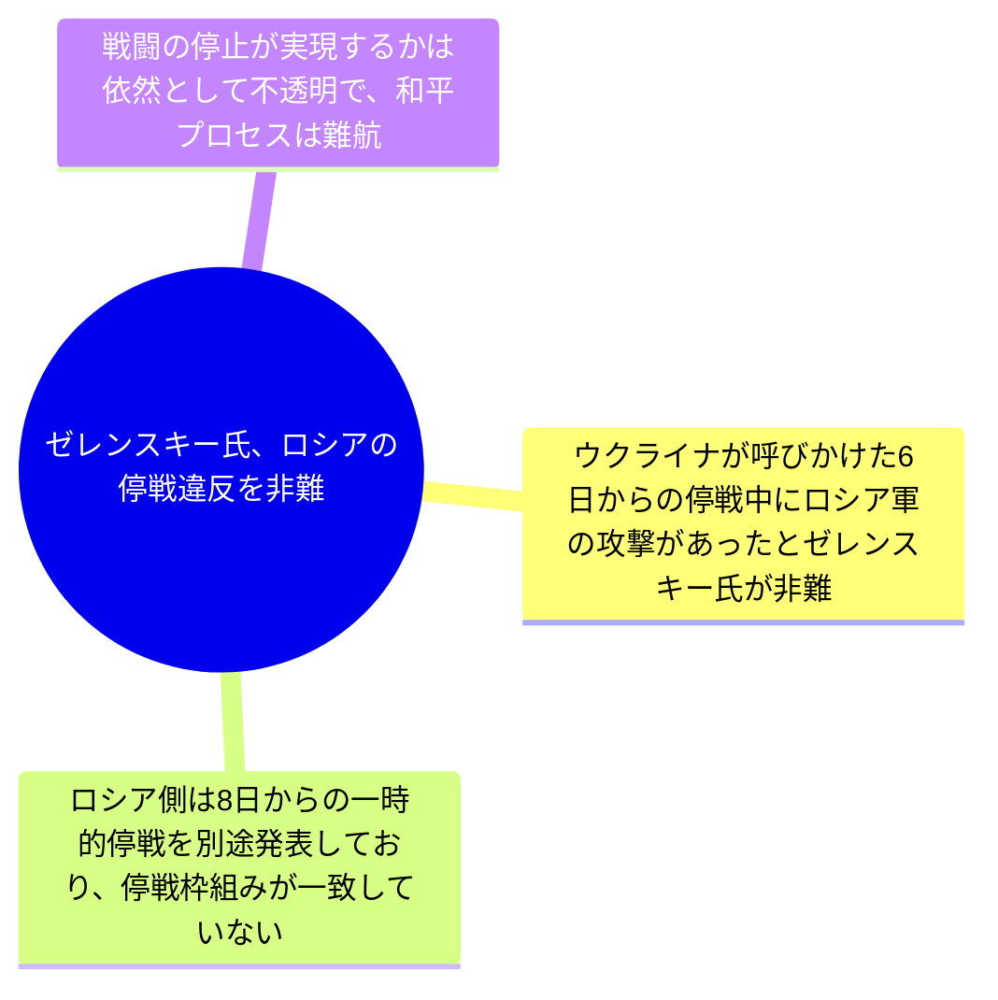
```mermaid
mindmap
  root((ゼレンスキー氏、ロシアの停戦違反を非難))
    ウクライナが呼びかけた6日からの停戦中にロシア軍の攻撃があったとゼレンスキー氏が非難
    ロシア側は8日からの一時的停戦を別途発表しており、停戦枠組みが一致していない
    戦闘の停止が実現するかは依然として不透明で、和平プロセスは難航
```

---

## トルコで防衛装備品展示会、日トルコが協力確認 `重要度: 中` `middle_east / defense_export`
- **出典:** NHK 国際 ([原文](http://www3.nhk.or.jp/news/html/20260507/k10015115501000.html)) / **公開:** 2026-05-07 05:00

**要約**
トルコで日本を含む各国の企業が参加する大規模な防衛装備品展示会が開催された。最新鋭の無人機などの先端技術が紹介されている。会場では日本とトルコの間で防衛協力を深めていくことを確認する文書も取り交わされた。トルコは無人機輸出大国として存在感を高めており、日本との協力強化は装備移転の新たな展開を示す動きとして注目される。

**背景**
日本は2014年に防衛装備移転三原則を策定し、2023年以降は運用指針改定で輸出範囲を拡大している。トルコはバイラクタルなど無人機で世界市場に進出し、防衛産業の主要国の一つとなっている。

**要点**
- トルコの大規模防衛装備展示会に日本企業も参加し、無人機など最新技術が紹介された

- 日本とトルコが防衛協力深化を確認する文書を取り交わし、両国関係の新段階を示した

- 防衛装備移転三原則の運用拡大を背景に、日本の防衛装備分野での国際連携が広がっている

### 経緯タイムライン

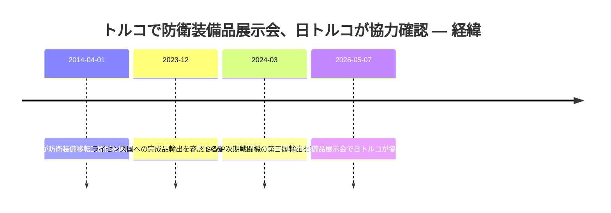
```mermaid
timeline
  title トルコで防衛装備品展示会、日トルコが協力確認 — 経緯
  2014-04-01 : 日本が防衛装備移転三原則を閣議決定
  2023-12 : ライセンス国への完成品輸出を容認する運用指針改定
  2024-03 : GCAP次期戦闘機の第三国輸出を容認
  2026-05-07 : トルコでの防衛装備品展示会で日トルコが協力確認文書を交換
```

### 当事者マップ

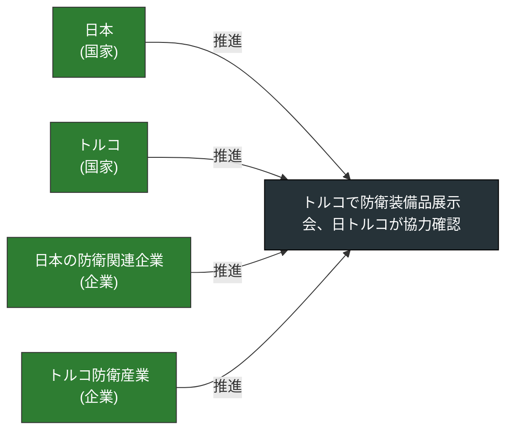
```mermaid
flowchart LR
  T["トルコで防衛装備品展示会、日トルコが協力確認"]
  A0["日本\n(国家)"]
  A0 -- 推進 --> T
  style A0 fill:#2e7d32,color:#fff,stroke:#333
  A1["トルコ\n(国家)"]
  A1 -- 推進 --> T
  style A1 fill:#2e7d32,color:#fff,stroke:#333
  A2["日本の防衛関連企業\n(企業)"]
  A2 -- 推進 --> T
  style A2 fill:#2e7d32,color:#fff,stroke:#333
  A3["トルコ防衛産業\n(企業)"]
  A3 -- 推進 --> T
  style A3 fill:#2e7d32,color:#fff,stroke:#333
  style T fill:#263238,color:#fff,stroke:#000
```

### 影響の広がり

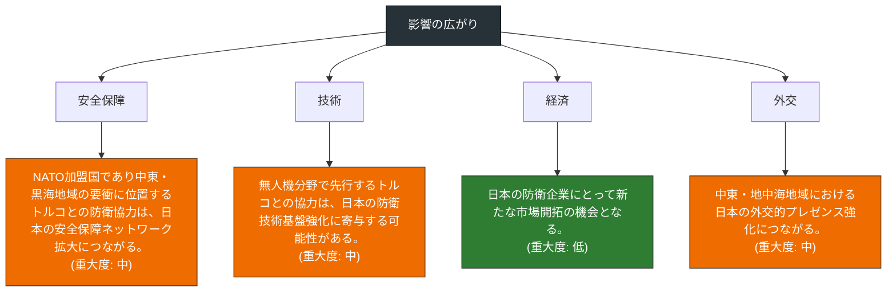
```mermaid
flowchart TB
  R["影響の広がり"]
  D0["安全保障"]
  I0["NATO加盟国であり中東・黒海地域の要衝に位置するトルコとの防衛協力は、日本の安全保障ネットワーク拡大につながる。\n(重大度: 中)"]
  R --> D0 --> I0
  style I0 fill:#ef6c00,color:#fff,stroke:#333
  D1["技術"]
  I1["無人機分野で先行するトルコとの協力は、日本の防衛技術基盤強化に寄与する可能性がある。\n(重大度: 中)"]
  R --> D1 --> I1
  style I1 fill:#ef6c00,color:#fff,stroke:#333
  D2["経済"]
  I2["日本の防衛企業にとって新たな市場開拓の機会となる。\n(重大度: 低)"]
  R --> D2 --> I2
  style I2 fill:#2e7d32,color:#fff,stroke:#333
  D3["外交"]
  I3["中東・地中海地域における日本の外交的プレゼンス強化につながる。\n(重大度: 中)"]
  R --> D3 --> I3
  style I3 fill:#ef6c00,color:#fff,stroke:#333
  style R fill:#263238,color:#fff,stroke:#000
```

### 当事者の関係ネットワーク

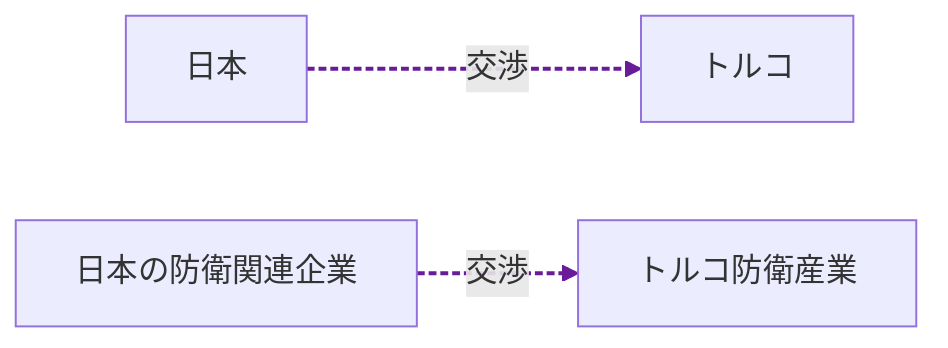
```mermaid
graph LR
  N0["日本"]
  N1["トルコ"]
  N2["日本の防衛関連企業"]
  N3["トルコ防衛産業"]
  N0 -->|交渉| N1
  N2 -->|交渉| N3
  linkStyle 0 stroke:#6a1b9a,stroke-width:2px,stroke-dasharray:4 2;
  linkStyle 1 stroke:#6a1b9a,stroke-width:2px,stroke-dasharray:4 2;
```

### 押さえるべき論点

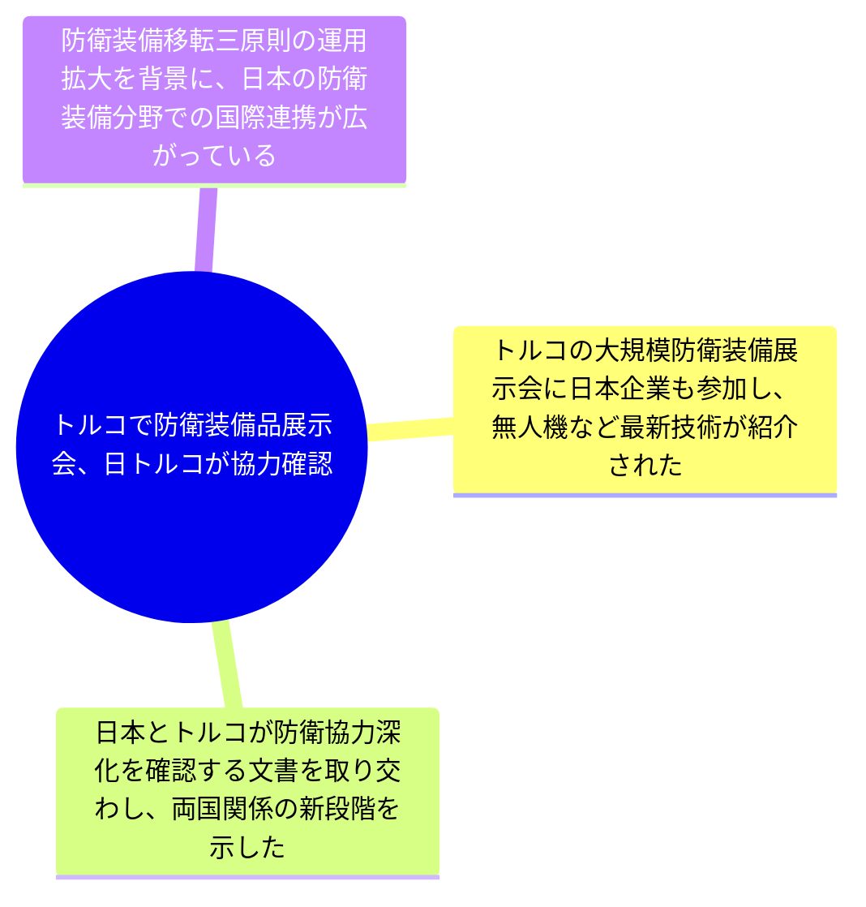
```mermaid
mindmap
  root((トルコで防衛装備品展示会、日トルコが協力確認))
    トルコの大規模防衛装備展示会に日本企業も参加し、無人機など最新技術が紹介された
    日本とトルコが防衛協力深化を確認する文書を取り交わし、両国関係の新段階を示した
    防衛装備移転三原則の運用拡大を背景に、日本の防衛装備分野での国際連携が広がっている
```

---

## ウクライナ、ロシアが停戦破ったと非難 `重要度: 中` `europe / global`
- **出典:** NHK 国際 ([原文](http://www3.nhk.or.jp/news/html/20260506/k10015115571000.html)) / **公開:** 2026-05-06 22:22

**要約**
ウクライナのシビハ外相は、6日から発効するとウクライナ側が主張していた停戦をロシアが破ったと非難した。ロシアは100機以上の無人機などで攻撃を実施したとされる。シビハ外相は各国に対し、ロシアへの制裁など圧力を強化するよう訴えた。停戦の枠組みをめぐる両国の認識の隔たりが改めて露呈した形となっている。

**背景**
ロシアによるウクライナ侵攻は長期化しており、和平交渉や停戦の試みが断続的に行われてきた。今回ウクライナ側が一方的に主張する停戦の発効と、ロシア側の認識・対応の食い違いが衝突を招いた。

**要点**
- ウクライナが主張した停戦初日にロシアが大規模な無人機攻撃を実施したとされる

- シビハ外相は国際社会にロシアへの制裁強化を訴えた

- 停戦の枠組みをめぐり両国の認識が大きく食い違い、和平の道筋は依然不透明

### 経緯タイムライン

```mermaid
timeline
  title ウクライナ、ロシアが停戦破ったと非難 — 経緯
  2022-02-24 : ロシアがウクライナへの全面侵攻を開始
  2026-05-06以前 : ウクライナが6日からの停戦入りを主張
  2026-05-06 : ロシアが100機以上の無人機などで攻撃したとウクライナが非難
  2026-05-06 : シビハ外相が各国に対ロ制裁強化を要請
```

### 当事者マップ

```mermaid
flowchart LR
  T["ウクライナ、ロシアが停戦破ったと非難"]
  A0["ウクライナ\n(国家)"]
  A0 -- 被害 --> T
  style A0 fill:#ef6c00,color:#fff,stroke:#333
  A1["シビハ外相\n(国家)"]
  A1 -- 推進 --> T
  style A1 fill:#2e7d32,color:#fff,stroke:#333
  A2["ロシア\n(国家)"]
  A2 -- その他 --> T
  style A2 fill:#1565c0,color:#fff,stroke:#333
  A3["国際社会\n(国家・国際機関)"]
  A3 -- 中立 --> T
  style A3 fill:#616161,color:#fff,stroke:#333
  style T fill:#263238,color:#fff,stroke:#000
```

### 影響の広がり

```mermaid
flowchart TB
  R["影響の広がり"]
  D0["安全保障"]
  I0["停戦合意の不在が長期化し、欧州の安全保障環境が一層不安定化する。\n(重大度: 高)"]
  R --> D0 --> I0
  style I0 fill:#c62828,color:#fff,stroke:#333
  D1["外交"]
  I1["和平交渉の信頼性が損なわれ、各国の対ロ外交スタンスが問われる。\n(重大度: 中)"]
  R --> D1 --> I1
  style I1 fill:#ef6c00,color:#fff,stroke:#333
  D2["経済"]
  I2["追加制裁が実施されれば、エネルギー・貿易市場への影響が再燃する可能性。\n(重大度: 中)"]
  R --> D2 --> I2
  style I2 fill:#ef6c00,color:#fff,stroke:#333
  style R fill:#263238,color:#fff,stroke:#000
```

### 当事者の関係ネットワーク

```mermaid
graph LR
  N0["ウクライナ"]
  N1["シビハ外相"]
  N2["ロシア"]
  N3["国際社会"]
  N0 -->|対立| N2
  N1 -->|交渉| N3
  N3 -->|緊張| N2
  linkStyle 0 stroke:#c62828,stroke-width:3px;
  linkStyle 1 stroke:#6a1b9a,stroke-width:2px,stroke-dasharray:4 2;
  linkStyle 2 stroke:#ef6c00,stroke-width:2px,stroke-dasharray:4 2;
```

### 押さえるべき論点

```mermaid
mindmap
  root((ウクライナ、ロシアが停戦破ったと非難))
    ウクライナが主張した停戦初日にロシアが大規模な無人機攻撃を実施したとされる
    シビハ外相は国際社会にロシアへの制裁強化を訴えた
    停戦の枠組みをめぐり両国の認識が大きく食い違い、和平の道筋は依然不透明
```

---
