# 地政学ニュース図解レポート 2026-05-08 号

生成日時: 2026-05-08 08:00 / 記事数: 5

## 📌 本日の要点

- **李強首相、台湾は「レッドライン」と米に警告** — 中国の李強首相は、トランプ米大統領の5月14日からの訪中を前に、訪中したアメリカ議員団と会談しました。

- **日韓次官級2プラス2 初開催で連携強化** — 日韓両政府は外務・防衛当局の次官級による協議「2プラス2」の初会合をソウルで開催した。

- **ロシアのウクライナ侵攻 5月7日の動き** — ロシアによるウクライナへの軍事侵攻が継続しており、ウクライナ各地で両軍の戦闘が続いている。

## 李強首相、台湾は「レッドライン」と米に警告 `重要度: 高` `east_asia / global`
- **出典:** NHK 国際 ([原文](http://www3.nhk.or.jp/news/html/20260508/k10015116391000.html)) / **公開:** 2026-05-08 05:58

**要約**
中国の李強首相は、トランプ米大統領の5月14日からの訪中を前に、訪中したアメリカ議員団と会談しました。李首相は米中の安定的な経済・貿易関係への期待を示す一方、台湾問題については「越えてはならないレッドラインだ」と強調しました。米中首脳会談を控え、中国側が台湾問題で譲歩しない姿勢を改めて示した形です。経済対話の進展と安全保障上の対立を切り分ける中国の戦略がうかがえます。

**背景**
米中は関税や先端技術をめぐり緊張が続く一方、経済関係の安定化に向けた首脳外交が模索されてきた。台湾では2024年に頼清徳政権が発足後も中国の軍事的圧力が継続しており、米台関係の動向に中国は神経をとがらせている。

**要点**
- 李強首相がトランプ訪中を控え、台湾問題を「越えてはならないレッドライン」と明言

- 中国は経済・貿易関係の安定には期待を示しつつ、安全保障では強硬姿勢を堅持

- 5月14日の米中首脳会談で台湾問題が最大の論点となる見通しで、日本の南西シフトにも影響

### 経緯タイムライン

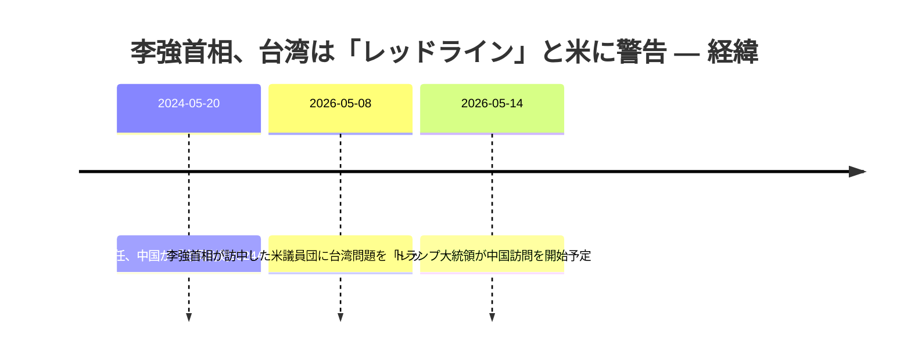
```mermaid
timeline
  title 李強首相、台湾は「レッドライン」と米に警告 — 経緯
  2024-05-20 : 頼清徳総統就任、中国が「合同利剣2024A」演習を実施
  2026-05-08 : 李強首相が訪中した米議員団に台湾問題を「レッドライン」と警告
  2026-05-14 : トランプ大統領が中国訪問を開始予定
```

### 当事者マップ

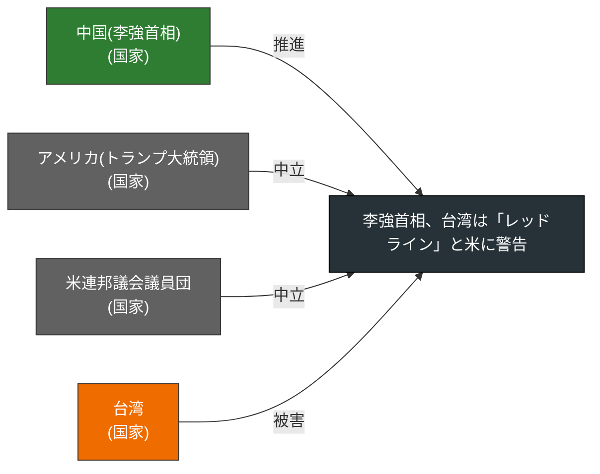
```mermaid
flowchart LR
  T["李強首相、台湾は「レッドライン」と米に警告"]
  A0["中国(李強首相)\n(国家)"]
  A0 -- 推進 --> T
  style A0 fill:#2e7d32,color:#fff,stroke:#333
  A1["アメリカ(トランプ大統領)\n(国家)"]
  A1 -- 中立 --> T
  style A1 fill:#616161,color:#fff,stroke:#333
  A2["米連邦議会議員団\n(国家)"]
  A2 -- 中立 --> T
  style A2 fill:#616161,color:#fff,stroke:#333
  A3["台湾\n(国家)"]
  A3 -- 被害 --> T
  style A3 fill:#ef6c00,color:#fff,stroke:#333
  style T fill:#263238,color:#fff,stroke:#000
```

### 影響の広がり

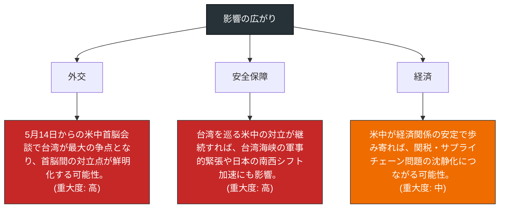
```mermaid
flowchart TB
  R["影響の広がり"]
  D0["外交"]
  I0["5月14日からの米中首脳会談で台湾が最大の争点となり、首脳間の対立点が鮮明化する可能性。\n(重大度: 高)"]
  R --> D0 --> I0
  style I0 fill:#c62828,color:#fff,stroke:#333
  D1["安全保障"]
  I1["台湾を巡る米中の対立が継続すれば、台湾海峡の軍事的緊張や日本の南西シフト加速にも影響。\n(重大度: 高)"]
  R --> D1 --> I1
  style I1 fill:#c62828,color:#fff,stroke:#333
  D2["経済"]
  I2["米中が経済関係の安定で歩み寄れば、関税・サプライチェーン問題の沈静化につながる可能性。\n(重大度: 中)"]
  R --> D2 --> I2
  style I2 fill:#ef6c00,color:#fff,stroke:#333
  style R fill:#263238,color:#fff,stroke:#000
```

### 当事者の関係ネットワーク

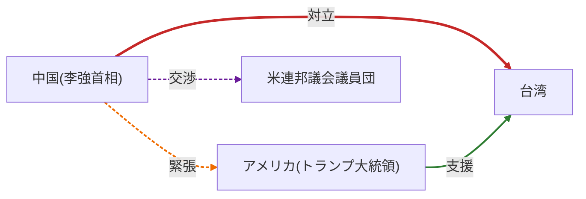
```mermaid
graph LR
  N0["中国(李強首相)"]
  N1["アメリカ(トランプ大統領)"]
  N2["米連邦議会議員団"]
  N3["台湾"]
  N0 -->|緊張| N1
  N0 -->|交渉| N2
  N0 -->|対立| N3
  N1 -->|支援| N3
  linkStyle 0 stroke:#ef6c00,stroke-width:2px,stroke-dasharray:4 2;
  linkStyle 1 stroke:#6a1b9a,stroke-width:2px,stroke-dasharray:4 2;
  linkStyle 2 stroke:#c62828,stroke-width:3px;
  linkStyle 3 stroke:#2e7d32,stroke-width:2px;
```

### 押さえるべき論点

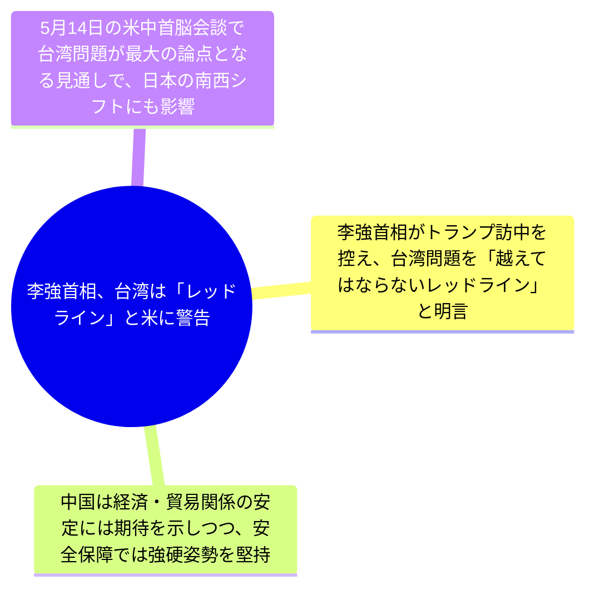
```mermaid
mindmap
  root((李強首相、台湾は「レッドライン」と米に警告))
    李強首相がトランプ訪中を控え、台湾問題を「越えてはならないレッドライン」と明言
    中国は経済・貿易関係の安定には期待を示しつつ、安全保障では強硬姿勢を堅持
    5月14日の米中首脳会談で台湾問題が最大の論点となる見通しで、日本の南西シフトにも影響
```

---

## 日韓次官級2プラス2 初開催で連携強化 `重要度: 高` `east_asia`
- **出典:** NHK 国際 ([原文](http://www3.nhk.or.jp/news/html/20260507/k10015116241000.html)) / **公開:** 2026-05-07 21:32

**要約**
日韓両政府は外務・防衛当局の次官級による協議「2プラス2」の初会合をソウルで開催した。東アジアの安全保障環境が厳しさを増す中、日韓および米国を含む3か国の戦略的連携を着実に強化することが重要との認識で一致した。これまで局長級にとどまっていた外務・防衛協議が次官級に格上げされ、日韓安保協力の制度化が一段進んだ形となる。

**背景**
日韓関係は2023年以降、首脳間のシャトル外交復活や安全保障協力の進展で改善基調にある。北朝鮮の核・ミサイル開発、中国の海洋進出を背景に、日米韓3か国の安保協力が首脳・閣僚レベルで強化されてきており、その実務レベルの基盤として次官級協議の制度化が進んだ。

**要点**
- 日韓の外務・防衛当局による次官級2プラス2が初開催され、安保対話が格上げされた

- 日韓両国とアメリカを含む3か国の戦略的連携の強化で一致

- 北朝鮮や中国を念頭に、東アジア安保環境の厳しさへの共通認識が背景にある

### 経緯タイムライン

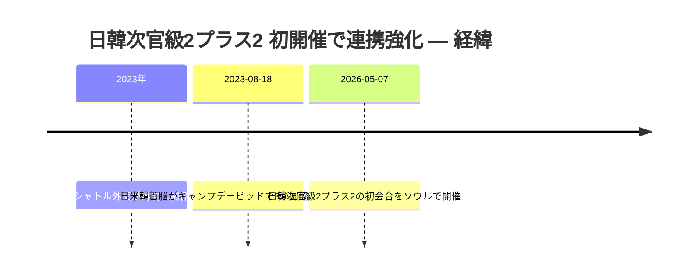
```mermaid
timeline
  title 日韓次官級2プラス2 初開催で連携強化 — 経緯
  2023年 : 日韓首脳のシャトル外交が再開し関係改善が進展
  2023-08-18 : 日米韓首脳がキャンプデービッドで3か国協力枠組みに合意
  2026-05-07 : 日韓次官級2プラス2の初会合をソウルで開催
```

### 当事者マップ

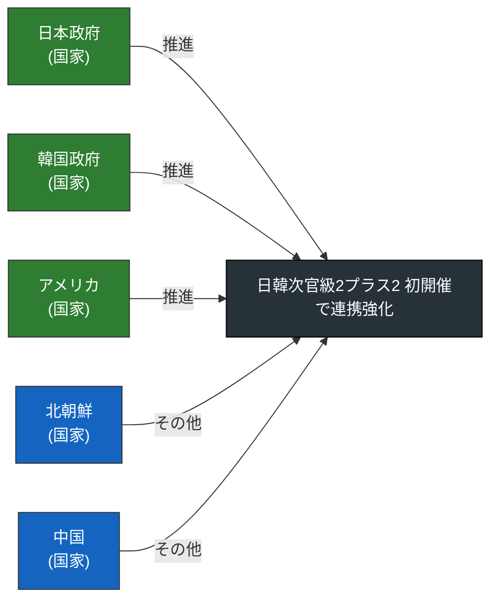
```mermaid
flowchart LR
  T["日韓次官級2プラス2 初開催で連携強化"]
  A0["日本政府\n(国家)"]
  A0 -- 推進 --> T
  style A0 fill:#2e7d32,color:#fff,stroke:#333
  A1["韓国政府\n(国家)"]
  A1 -- 推進 --> T
  style A1 fill:#2e7d32,color:#fff,stroke:#333
  A2["アメリカ\n(国家)"]
  A2 -- 推進 --> T
  style A2 fill:#2e7d32,color:#fff,stroke:#333
  A3["北朝鮮\n(国家)"]
  A3 -- その他 --> T
  style A3 fill:#1565c0,color:#fff,stroke:#333
  A4["中国\n(国家)"]
  A4 -- その他 --> T
  style A4 fill:#1565c0,color:#fff,stroke:#333
  style T fill:#263238,color:#fff,stroke:#000
```

### 影響の広がり

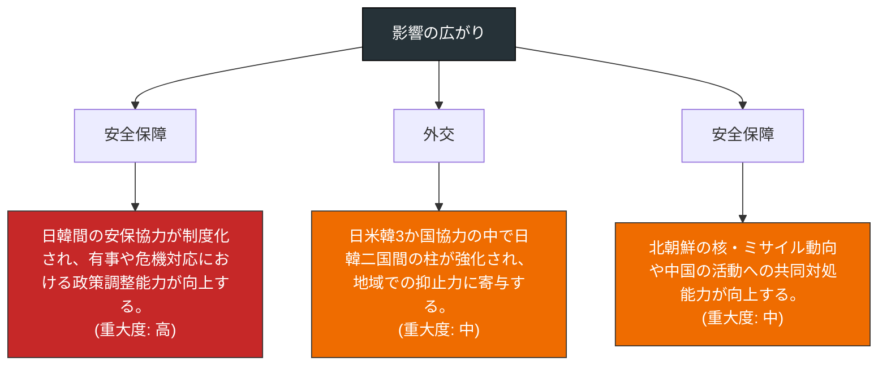
```mermaid
flowchart TB
  R["影響の広がり"]
  D0["安全保障"]
  I0["日韓間の安保協力が制度化され、有事や危機対応における政策調整能力が向上する。\n(重大度: 高)"]
  R --> D0 --> I0
  style I0 fill:#c62828,color:#fff,stroke:#333
  D1["外交"]
  I1["日米韓3か国協力の中で日韓二国間の柱が強化され、地域での抑止力に寄与する。\n(重大度: 中)"]
  R --> D1 --> I1
  style I1 fill:#ef6c00,color:#fff,stroke:#333
  D2["安全保障"]
  I2["北朝鮮の核・ミサイル動向や中国の活動への共同対処能力が向上する。\n(重大度: 中)"]
  R --> D2 --> I2
  style I2 fill:#ef6c00,color:#fff,stroke:#333
  style R fill:#263238,color:#fff,stroke:#000
```

### 当事者の関係ネットワーク

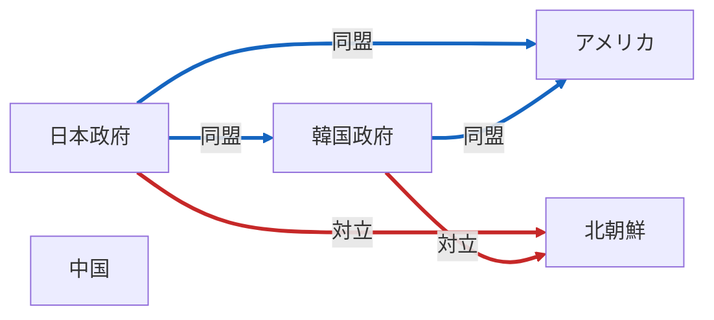
```mermaid
graph LR
  N0["日本政府"]
  N1["韓国政府"]
  N2["アメリカ"]
  N3["北朝鮮"]
  N4["中国"]
  N0 -->|同盟| N1
  N0 -->|同盟| N2
  N1 -->|同盟| N2
  N0 -->|対立| N3
  N1 -->|対立| N3
  linkStyle 0 stroke:#1565c0,stroke-width:3px;
  linkStyle 1 stroke:#1565c0,stroke-width:3px;
  linkStyle 2 stroke:#1565c0,stroke-width:3px;
  linkStyle 3 stroke:#c62828,stroke-width:3px;
  linkStyle 4 stroke:#c62828,stroke-width:3px;
```

### 押さえるべき論点

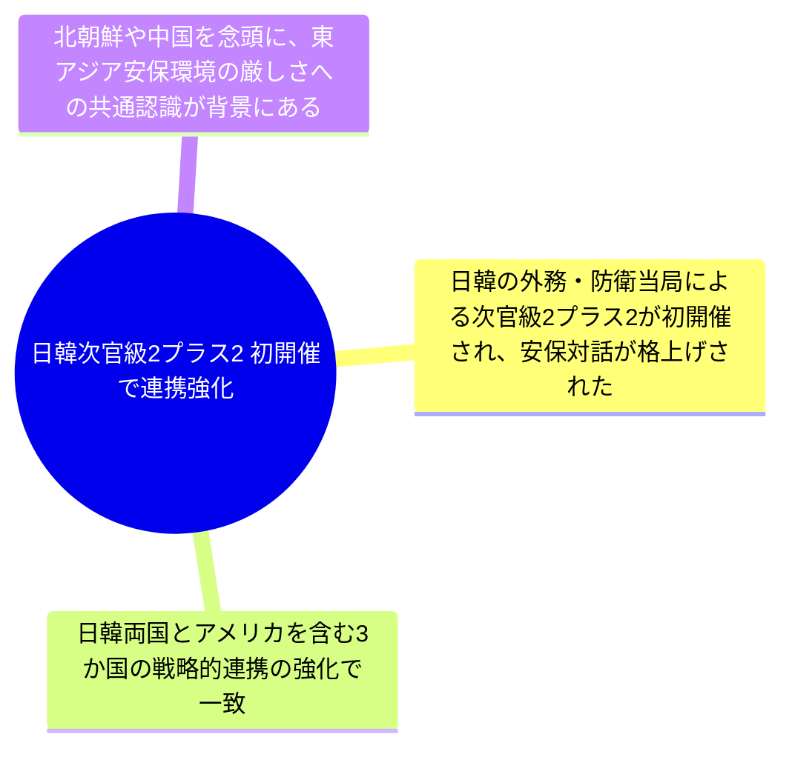
```mermaid
mindmap
  root((日韓次官級2プラス2 初開催で連携強化))
    日韓の外務・防衛当局による次官級2プラス2が初開催され、安保対話が格上げされた
    日韓両国とアメリカを含む3か国の戦略的連携の強化で一致
    北朝鮮や中国を念頭に、東アジア安保環境の厳しさへの共通認識が背景にある
```

---

## ロシアのウクライナ侵攻 5月7日の動き `重要度: 高` `europe / global`
- **出典:** NHK 国際 ([原文](http://www3.nhk.or.jp/news/html/20260507/k10015101801000.html)) / **公開:** 2026-05-07 20:59

**要約**
ロシアによるウクライナへの軍事侵攻が継続しており、ウクライナ各地で両軍の戦闘が続いている。多数の市民が国外への避難を余儀なくされている状況にある。NHKは5月7日（日本時間）の戦闘状況や関係各国の外交動向を随時更新で伝えている。日本・ウクライナとロシア・モスクワとの間には6時間の時差がある。

**背景**
ロシアは2022年2月にウクライナへの軍事侵攻を開始し、戦闘が長期化している。各国は経済制裁や軍事支援を通じてウクライナを支援する一方、停戦・和平に向けた外交努力も続けられている。

**要点**
- ロシアによるウクライナ侵攻は5月7日時点でも継続している

- ウクライナ各地で戦闘が続き、多数の市民が国外避難を余儀なくされている

- 戦闘状況だけでなく関係各国の外交動向も焦点となっている

### 経緯タイムライン

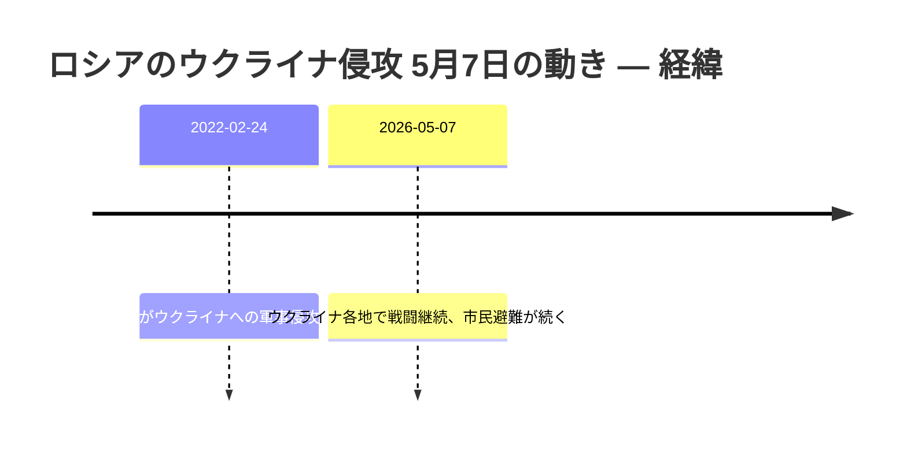
```mermaid
timeline
  title ロシアのウクライナ侵攻 5月7日の動き — 経緯
  2022-02-24 : ロシアがウクライナへの軍事侵攻を開始
  2026-05-07 : ウクライナ各地で戦闘継続、市民避難が続く
```

### 当事者マップ

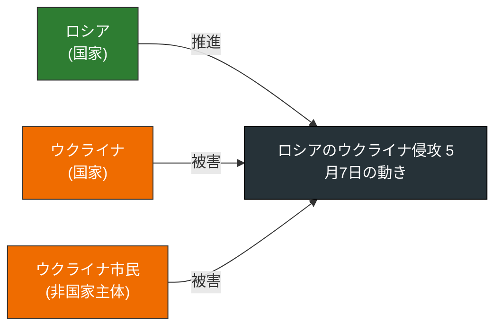
```mermaid
flowchart LR
  T["ロシアのウクライナ侵攻 5月7日の動き"]
  A0["ロシア\n(国家)"]
  A0 -- 推進 --> T
  style A0 fill:#2e7d32,color:#fff,stroke:#333
  A1["ウクライナ\n(国家)"]
  A1 -- 被害 --> T
  style A1 fill:#ef6c00,color:#fff,stroke:#333
  A2["ウクライナ市民\n(非国家主体)"]
  A2 -- 被害 --> T
  style A2 fill:#ef6c00,color:#fff,stroke:#333
  style T fill:#263238,color:#fff,stroke:#000
```

### 影響の広がり

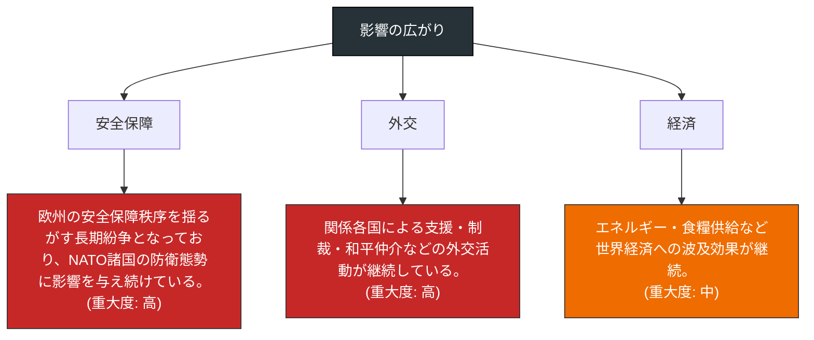
```mermaid
flowchart TB
  R["影響の広がり"]
  D0["安全保障"]
  I0["欧州の安全保障秩序を揺るがす長期紛争となっており、NATO諸国の防衛態勢に影響を与え続けている。\n(重大度: 高)"]
  R --> D0 --> I0
  style I0 fill:#c62828,color:#fff,stroke:#333
  D1["外交"]
  I1["関係各国による支援・制裁・和平仲介などの外交活動が継続している。\n(重大度: 高)"]
  R --> D1 --> I1
  style I1 fill:#c62828,color:#fff,stroke:#333
  D2["経済"]
  I2["エネルギー・食糧供給など世界経済への波及効果が継続。\n(重大度: 中)"]
  R --> D2 --> I2
  style I2 fill:#ef6c00,color:#fff,stroke:#333
  style R fill:#263238,color:#fff,stroke:#000
```

### 当事者の関係ネットワーク

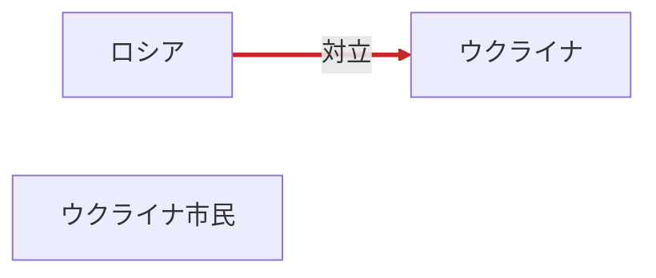
```mermaid
graph LR
  N0["ロシア"]
  N1["ウクライナ"]
  N2["ウクライナ市民"]
  N0 -->|対立| N1
  linkStyle 0 stroke:#c62828,stroke-width:3px;
```

### 押さえるべき論点

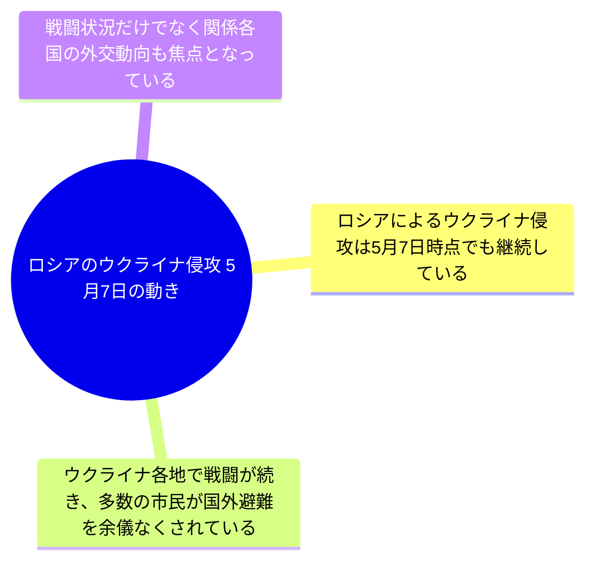
```mermaid
mindmap
  root((ロシアのウクライナ侵攻 5月7日の動き))
    ロシアによるウクライナ侵攻は5月7日時点でも継続している
    ウクライナ各地で戦闘が続き、多数の市民が国外避難を余儀なくされている
    戦闘状況だけでなく関係各国の外交動向も焦点となっている
```

---

## 中国、高市首相の台湾答弁撤回を再要求 `重要度: 高` `east_asia`
- **出典:** NHK 国際 ([原文](http://www3.nhk.or.jp/news/html/20260507/k10015116191000.html)) / **公開:** 2026-05-07 20:27

**要約**
高市総理大臣による国会での「台湾有事」をめぐる答弁から半年が経過した節目に、中国外務省の報道官が改めて発言の撤回を要求した。報道官は日中関係が「重大な困難」に直面しているとし、その根本原因は日本側の「誤った発言」にあると主張した。日本政府は答弁を撤回する姿勢を示しておらず、両国関係の冷却が長期化している。

**背景**
高市総理は約半年前、国会で台湾有事が「存立危機事態」に該当しうる旨の答弁を行い、中国は強く反発してきた。中国側は日本の歴代政権が維持してきた台湾問題への抑制的な姿勢からの逸脱と受け止め、外交ルートで繰り返し抗議している。

**要点**
- 中国は半年経過の節目を捉えて改めて答弁撤回を要求し、関係悪化の責任を日本側に帰している

- 日本政府は答弁撤回に応じる姿勢を示しておらず、対立は長期化の様相

- 台湾有事を『存立危機事態』とみなす議論は集団的自衛権発動と直結し、日中関係の構造的争点となっている

### 経緯タイムライン

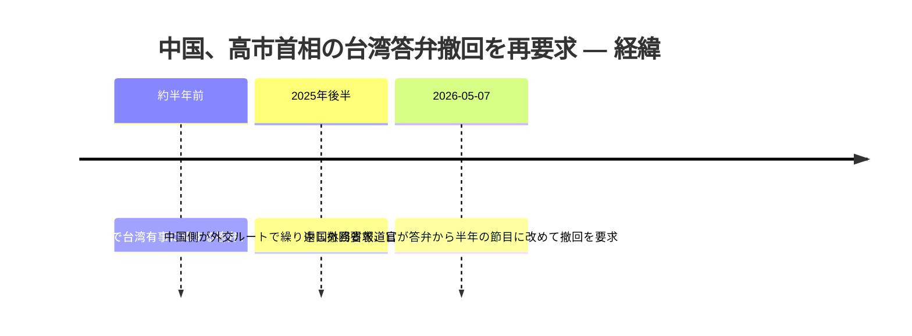
```mermaid
timeline
  title 中国、高市首相の台湾答弁撤回を再要求 — 経緯
  約半年前 : 高市総理が国会で台湾有事に関する答弁、中国が強く反発
  2025年後半 : 中国側が外交ルートで繰り返し撤回要求、日中関係が冷却化
  2026-05-07 : 中国外務省報道官が答弁から半年の節目に改めて撤回を要求
```

### 当事者マップ

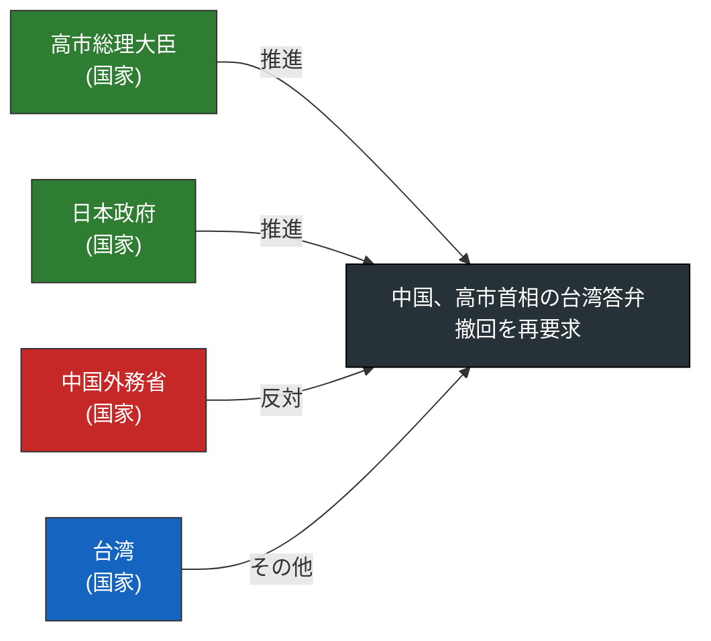
```mermaid
flowchart LR
  T["中国、高市首相の台湾答弁撤回を再要求"]
  A0["高市総理大臣\n(国家)"]
  A0 -- 推進 --> T
  style A0 fill:#2e7d32,color:#fff,stroke:#333
  A1["日本政府\n(国家)"]
  A1 -- 推進 --> T
  style A1 fill:#2e7d32,color:#fff,stroke:#333
  A2["中国外務省\n(国家)"]
  A2 -- 反対 --> T
  style A2 fill:#c62828,color:#fff,stroke:#333
  A3["台湾\n(国家)"]
  A3 -- その他 --> T
  style A3 fill:#1565c0,color:#fff,stroke:#333
  style T fill:#263238,color:#fff,stroke:#000
```

### 影響の広がり

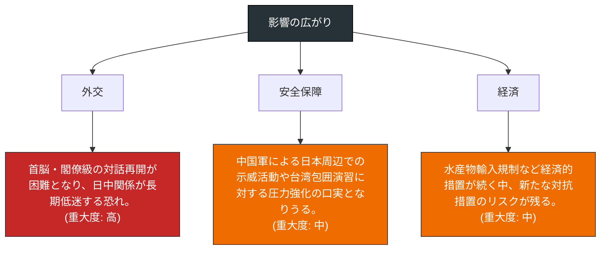
```mermaid
flowchart TB
  R["影響の広がり"]
  D0["外交"]
  I0["首脳・閣僚級の対話再開が困難となり、日中関係が長期低迷する恐れ。\n(重大度: 高)"]
  R --> D0 --> I0
  style I0 fill:#c62828,color:#fff,stroke:#333
  D1["安全保障"]
  I1["中国軍による日本周辺での示威活動や台湾包囲演習に対する圧力強化の口実となりうる。\n(重大度: 中)"]
  R --> D1 --> I1
  style I1 fill:#ef6c00,color:#fff,stroke:#333
  D2["経済"]
  I2["水産物輸入規制など経済的措置が続く中、新たな対抗措置のリスクが残る。\n(重大度: 中)"]
  R --> D2 --> I2
  style I2 fill:#ef6c00,color:#fff,stroke:#333
  style R fill:#263238,color:#fff,stroke:#000
```

### 当事者の関係ネットワーク

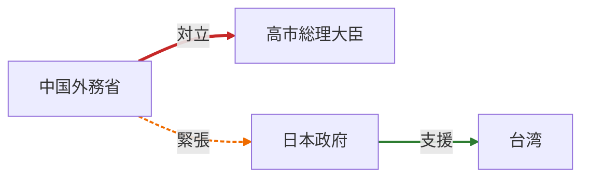
```mermaid
graph LR
  N0["高市総理大臣"]
  N1["日本政府"]
  N2["中国外務省"]
  N3["台湾"]
  N2 -->|対立| N0
  N2 -->|緊張| N1
  N1 -->|支援| N3
  linkStyle 0 stroke:#c62828,stroke-width:3px;
  linkStyle 1 stroke:#ef6c00,stroke-width:2px,stroke-dasharray:4 2;
  linkStyle 2 stroke:#2e7d32,stroke-width:2px;
```

### 押さえるべき論点

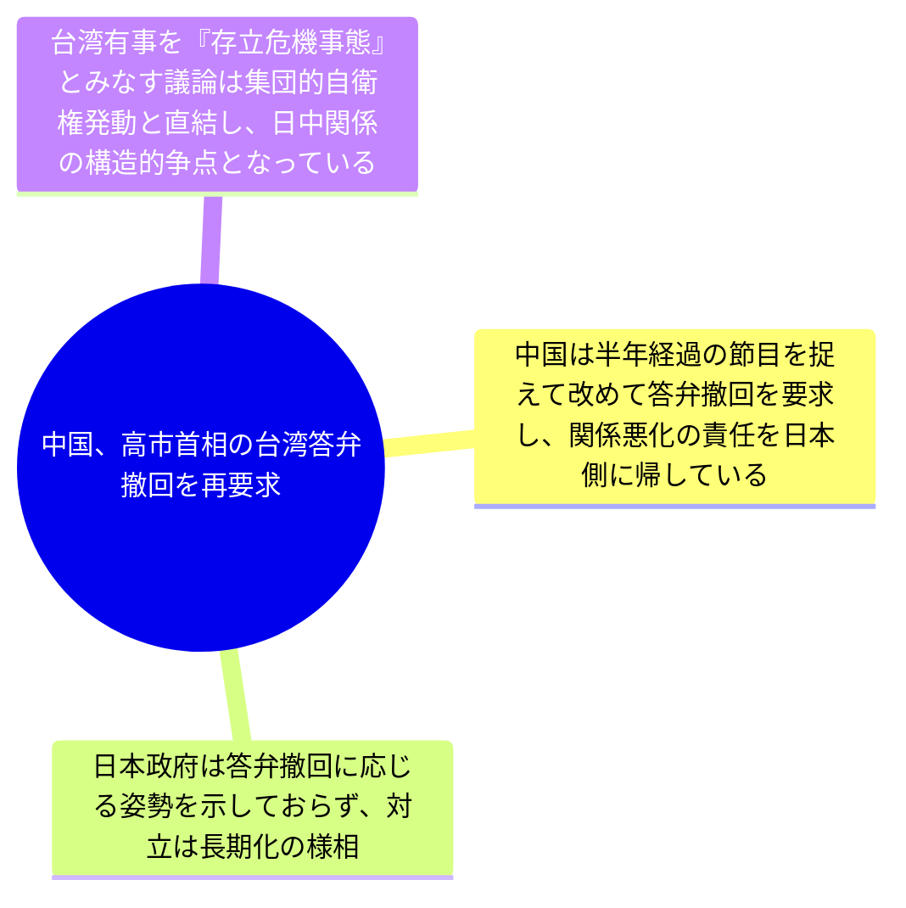
```mermaid
mindmap
  root((中国、高市首相の台湾答弁撤回を再要求))
    中国は半年経過の節目を捉えて改めて答弁撤回を要求し、関係悪化の責任を日本側に帰している
    日本政府は答弁撤回に応じる姿勢を示しておらず、対立は長期化の様相
    台湾有事を『存立危機事態』とみなす議論は集団的自衛権発動と直結し、日中関係の構造的争点となっている
```

---

## 露、戦勝記念日に一方的停戦主張と報復警告 `重要度: 中` `europe / global`
- **出典:** NHK 国際 ([原文](http://www3.nhk.or.jp/news/html/20260508/k10015116351000.html)) / **公開:** 2026-05-08 07:02

**要約**
ロシア国防省は第2次世界大戦の戦勝記念日にあわせ、5月8日から2日間ウクライナ側と停戦すると改めて主張した。同時に、式典が妨害された場合には大規模な攻撃で報復すると警告した。一方ウクライナ側はこの一方的な停戦提案を受け入れておらず、戦闘継続の懸念が高まっている。モスクワでの軍事パレードにはロシアの友好国首脳が招かれており、警備が強化されている。

**背景**
ロシアは毎年5月9日の対独戦勝記念日を国威発揚の重要な機会と位置づけており、モスクワ赤の広場で大規模な軍事パレードを実施する。ウクライナ侵攻が長期化する中、プーチン政権は今年の式典を体制誇示の場として重視している。

**要点**
- ロシアは戦勝記念日にあわせ5月8日からの2日間停戦を一方的に主張

- 式典が妨害されれば大規模な報復攻撃を行うと警告

- ウクライナ側との合意はなく、戦闘継続と緊張激化の懸念

### 経緯タイムライン

```mermaid
timeline
  title 露、戦勝記念日に一方的停戦主張と報復警告 — 経緯
  2026-05-08 : ロシアが2日間の一方的停戦と式典妨害への報復を警告
  2026-05-09 : モスクワ赤の広場で対独戦勝記念日の軍事パレード予定
```

### 当事者マップ

```mermaid
flowchart LR
  T["露、戦勝記念日に一方的停戦主張と報復警告"]
  A0["ロシア\n(国家)"]
  A0 -- 推進 --> T
  style A0 fill:#2e7d32,color:#fff,stroke:#333
  A1["ロシア国防省\n(国家)"]
  A1 -- 推進 --> T
  style A1 fill:#2e7d32,color:#fff,stroke:#333
  A2["ウクライナ\n(国家)"]
  A2 -- 反対 --> T
  style A2 fill:#c62828,color:#fff,stroke:#333
  style T fill:#263238,color:#fff,stroke:#000
```

### 影響の広がり

```mermaid
flowchart TB
  R["影響の広がり"]
  D0["安全保障"]
  I0["戦勝記念日前後の戦闘激化や報復攻撃の可能性があり、ウクライナ全土で軍事的リスクが高まる。\n(重大度: 中)"]
  R --> D0 --> I0
  style I0 fill:#ef6c00,color:#fff,stroke:#333
  D1["外交"]
  I1["停戦の主張が宣伝戦の一環とみられ、和平交渉の信頼性に影響する。\n(重大度: 中)"]
  R --> D1 --> I1
  style I1 fill:#ef6c00,color:#fff,stroke:#333
  style R fill:#263238,color:#fff,stroke:#000
```

### 当事者の関係ネットワーク

```mermaid
graph LR
  N0["ロシア"]
  N1["ロシア国防省"]
  N2["ウクライナ"]
  N0 -->|対立| N2
  linkStyle 0 stroke:#c62828,stroke-width:3px;
```

### 押さえるべき論点

```mermaid
mindmap
  root((露、戦勝記念日に一方的停戦主張と報復警告))
    ロシアは戦勝記念日にあわせ5月8日からの2日間停戦を一方的に主張
    式典が妨害されれば大規模な報復攻撃を行うと警告
    ウクライナ側との合意はなく、戦闘継続と緊張激化の懸念
```

---
