# 地政学ニュース図解レポート 2026-05-09 号

生成日時: 2026-05-09 07:54 / 記事数: 5

## 📌 本日の要点

- **トランプ氏14日訪中、習氏と会談へ** — アメリカのトランプ大統領が5月14日と15日に中国を訪問し、習近平国家主席と首脳会談を行う予定であることが明らかになった。

- **ウクライナ侵攻続く ロシア軍と戦闘継続** — ロシアによるウクライナへの軍事侵攻が続いており、各地でロシア軍とウクライナ軍の戦闘が継続している。

- **米、イラン機雷停止求める安保理決議案** — アメリカは、ホルムズ海峡における機雷敷設などの停止をイランに求める国連安全保障理事会の決議案をまとめ、採決にかける方針を明らかにした。

## トランプ氏14日訪中、習氏と会談へ `重要度: 高` `east_asia / middle_east / global`
- **出典:** NHK 国際 ([原文](http://www3.nhk.or.jp/news/html/20260509/k10015117031000.html)) / **公開:** 2026-05-09 01:57

**要約**
アメリカのトランプ大統領が5月14日と15日に中国を訪問し、習近平国家主席と首脳会談を行う予定であることが明らかになった。両首脳の対面会談は2025年10月以来およそ7か月ぶりとなる。経済・貿易関係や台湾問題に加え、イラン情勢についても協議される見通しとされる。米中の戦略的競争が続くなか、世界秩序に大きな影響を及ぼす会談となる。

**背景**
米中は関税・先端技術・台湾を巡り対立を深める一方、首脳間の対話チャネルを維持してきた。前回会談(2025年10月)以降、貿易摩擦や台湾海峡の緊張、中東情勢の不安定化が進んでおり、首脳レベルでの調整が求められている。

**要点**
- トランプ氏訪中は2025年10月以来の対面首脳会談で米中関係の節目

- 貿易・台湾・イランという経済と安全保障の主要争点を一括協議

- 日本にとっては台湾海峡の安定とエネルギー供給の両面で影響大

### 経緯タイムライン

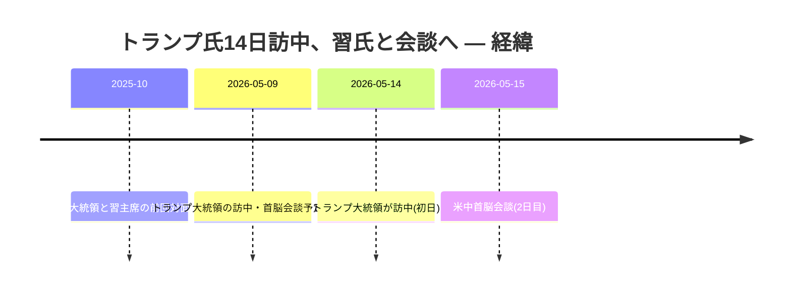
```mermaid
timeline
  title トランプ氏14日訪中、習氏と会談へ — 経緯
  2025-10 : トランプ大統領と習主席の前回対面首脳会談
  2026-05-09 : トランプ大統領の訪中・首脳会談予定が公表
  2026-05-14 : トランプ大統領が訪中(初日)
  2026-05-15 : 米中首脳会談(2日目)
```

### 当事者マップ

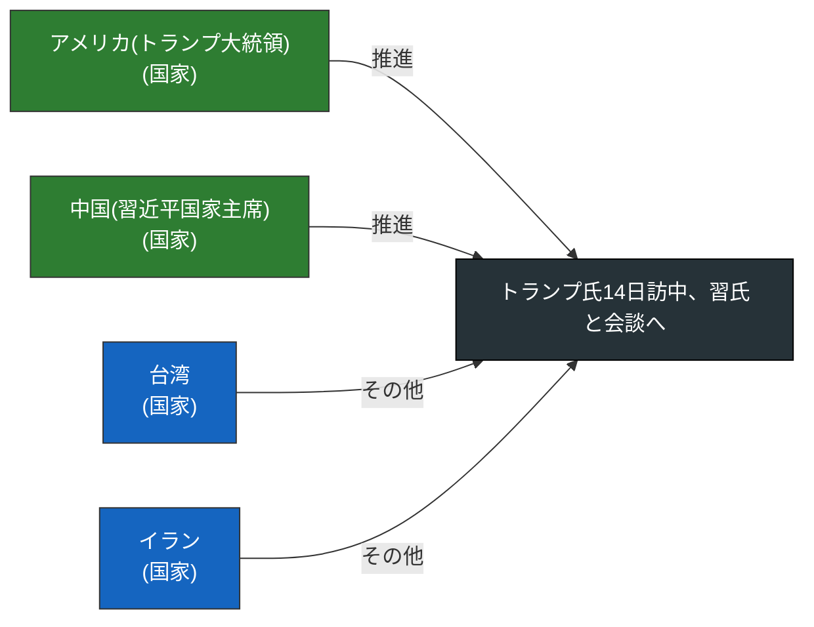
```mermaid
flowchart LR
  T["トランプ氏14日訪中、習氏と会談へ"]
  A0["アメリカ(トランプ大統領)\n(国家)"]
  A0 -- 推進 --> T
  style A0 fill:#2e7d32,color:#fff,stroke:#333
  A1["中国(習近平国家主席)\n(国家)"]
  A1 -- 推進 --> T
  style A1 fill:#2e7d32,color:#fff,stroke:#333
  A2["台湾\n(国家)"]
  A2 -- その他 --> T
  style A2 fill:#1565c0,color:#fff,stroke:#333
  A3["イラン\n(国家)"]
  A3 -- その他 --> T
  style A3 fill:#1565c0,color:#fff,stroke:#333
  style T fill:#263238,color:#fff,stroke:#000
```

### 影響の広がり

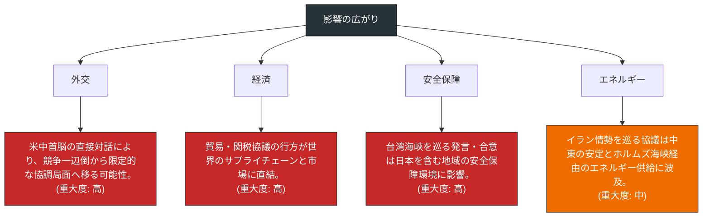
```mermaid
flowchart TB
  R["影響の広がり"]
  D0["外交"]
  I0["米中首脳の直接対話により、競争一辺倒から限定的な協調局面へ移る可能性。\n(重大度: 高)"]
  R --> D0 --> I0
  style I0 fill:#c62828,color:#fff,stroke:#333
  D1["経済"]
  I1["貿易・関税協議の行方が世界のサプライチェーンと市場に直結。\n(重大度: 高)"]
  R --> D1 --> I1
  style I1 fill:#c62828,color:#fff,stroke:#333
  D2["安全保障"]
  I2["台湾海峡を巡る発言・合意は日本を含む地域の安全保障環境に影響。\n(重大度: 高)"]
  R --> D2 --> I2
  style I2 fill:#c62828,color:#fff,stroke:#333
  D3["エネルギー"]
  I3["イラン情勢を巡る協議は中東の安定とホルムズ海峡経由のエネルギー供給に波及。\n(重大度: 中)"]
  R --> D3 --> I3
  style I3 fill:#ef6c00,color:#fff,stroke:#333
  style R fill:#263238,color:#fff,stroke:#000
```

### 当事者の関係ネットワーク

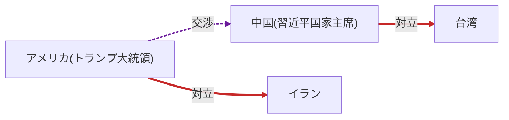
```mermaid
graph LR
  N0["アメリカ(トランプ大統領)"]
  N1["中国(習近平国家主席)"]
  N2["台湾"]
  N3["イラン"]
  N0 -->|交渉| N1
  N1 -->|対立| N2
  N0 -->|対立| N3
  linkStyle 0 stroke:#6a1b9a,stroke-width:2px,stroke-dasharray:4 2;
  linkStyle 1 stroke:#c62828,stroke-width:3px;
  linkStyle 2 stroke:#c62828,stroke-width:3px;
```

### 押さえるべき論点

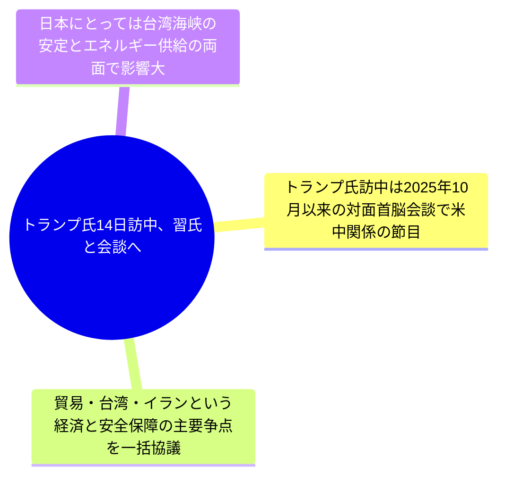
```mermaid
mindmap
  root((トランプ氏14日訪中、習氏と会談へ))
    トランプ氏訪中は2025年10月以来の対面首脳会談で米中関係の節目
    貿易・台湾・イランという経済と安全保障の主要争点を一括協議
    日本にとっては台湾海峡の安定とエネルギー供給の両面で影響大
```

---

## ウクライナ侵攻続く ロシア軍と戦闘継続 `重要度: 高` `europe / global`
- **出典:** NHK 国際 ([原文](http://www3.nhk.or.jp/news/html/20260508/k10015101811000.html)) / **公開:** 2026-05-08 18:25

**要約**
ロシアによるウクライナへの軍事侵攻が続いており、各地でロシア軍とウクライナ軍の戦闘が継続している。多くの市民が国外への避難を余儀なくされている。NHKは5月8日の戦況や関係各国の外交動向を随時伝えている。長期化する戦争はウクライナ国民への人道的影響を深刻化させている。

**背景**
2022年2月に始まったロシアのウクライナ侵攻は4年以上が経過し、戦闘が長期化している。欧米諸国はウクライナへの軍事・経済支援を続ける一方、ロシアへの制裁を強化している。

**要点**
- ロシアによるウクライナ侵攻は4年以上経過しても戦闘が継続

- ウクライナ各地で戦闘が行われ多数の市民が国外へ避難

- NHKが日本時間5月8日の戦況・外交動向を随時更新で報道

### 経緯タイムライン

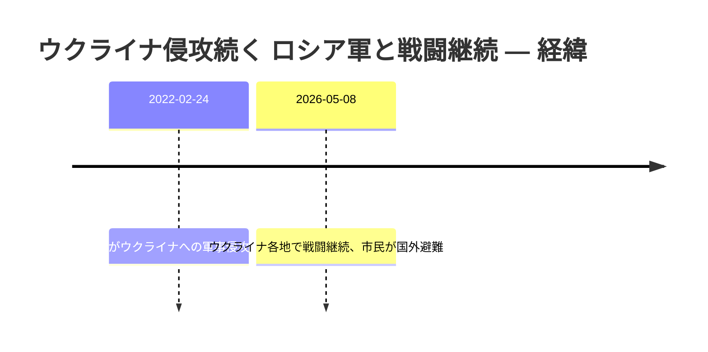
```mermaid
timeline
  title ウクライナ侵攻続く ロシア軍と戦闘継続 — 経緯
  2022-02-24 : ロシアがウクライナへの軍事侵攻を開始
  2026-05-08 : ウクライナ各地で戦闘継続、市民が国外避難
```

### 当事者マップ

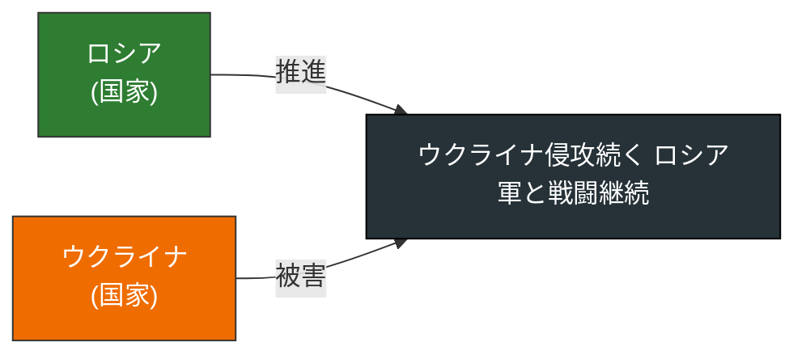
```mermaid
flowchart LR
  T["ウクライナ侵攻続く ロシア軍と戦闘継続"]
  A0["ロシア\n(国家)"]
  A0 -- 推進 --> T
  style A0 fill:#2e7d32,color:#fff,stroke:#333
  A1["ウクライナ\n(国家)"]
  A1 -- 被害 --> T
  style A1 fill:#ef6c00,color:#fff,stroke:#333
  style T fill:#263238,color:#fff,stroke:#000
```

### 影響の広がり

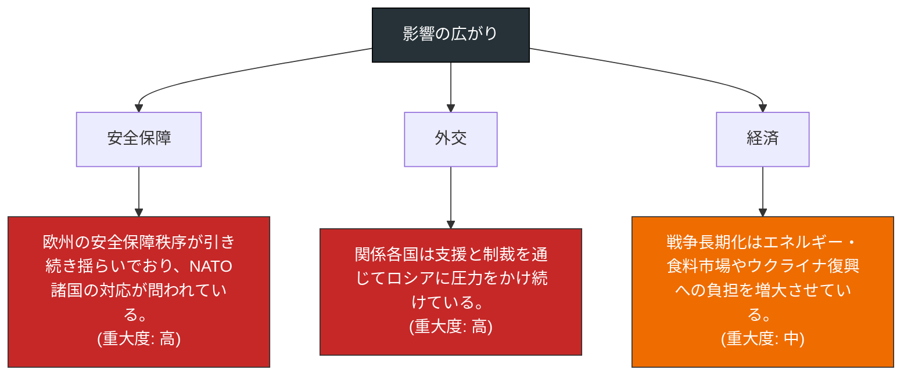
```mermaid
flowchart TB
  R["影響の広がり"]
  D0["安全保障"]
  I0["欧州の安全保障秩序が引き続き揺らいでおり、NATO諸国の対応が問われている。\n(重大度: 高)"]
  R --> D0 --> I0
  style I0 fill:#c62828,color:#fff,stroke:#333
  D1["外交"]
  I1["関係各国は支援と制裁を通じてロシアに圧力をかけ続けている。\n(重大度: 高)"]
  R --> D1 --> I1
  style I1 fill:#c62828,color:#fff,stroke:#333
  D2["経済"]
  I2["戦争長期化はエネルギー・食料市場やウクライナ復興への負担を増大させている。\n(重大度: 中)"]
  R --> D2 --> I2
  style I2 fill:#ef6c00,color:#fff,stroke:#333
  style R fill:#263238,color:#fff,stroke:#000
```

### 当事者の関係ネットワーク

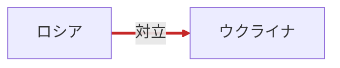
```mermaid
graph LR
  N0["ロシア"]
  N1["ウクライナ"]
  N0 -->|対立| N1
  linkStyle 0 stroke:#c62828,stroke-width:3px;
```

### 押さえるべき論点

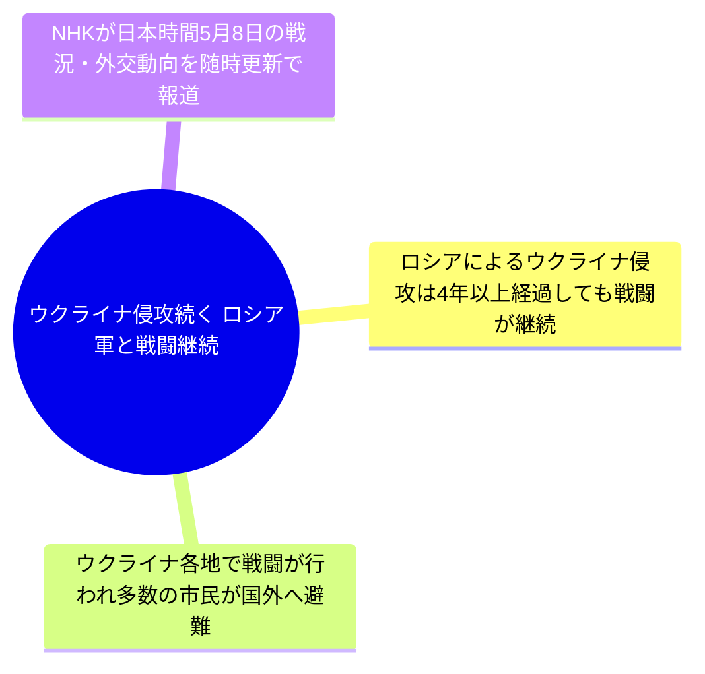
```mermaid
mindmap
  root((ウクライナ侵攻続く ロシア軍と戦闘継続))
    ロシアによるウクライナ侵攻は4年以上経過しても戦闘が継続
    ウクライナ各地で戦闘が行われ多数の市民が国外へ避難
    NHKが日本時間5月8日の戦況・外交動向を随時更新で報道
```

---

## 米、イラン機雷停止求める安保理決議案 `重要度: 高` `middle_east / global`
- **出典:** NHK 国際 ([原文](http://www3.nhk.or.jp/news/html/20260508/k10015116641000.html)) / **公開:** 2026-05-08 12:11

**要約**
アメリカは、ホルムズ海峡における機雷敷設などの停止をイランに求める国連安全保障理事会の決議案をまとめ、採決にかける方針を明らかにした。これに対しロシアは、米国とイスラエルの軍事行動という危機の根本原因を無視していると強く非難し、拒否権行使も辞さない構えを示した。安保理での米露対立が改めて鮮明となり、ホルムズ海峡を巡る緊張は外交面でも先鋭化している。日本にとってはエネルギー輸送の生命線である同海峡の安定が直接の関心事となる。

**背景**
ホルムズ海峡は世界の石油輸送量の約2割が通過する要衝で、イランによる機雷敷設や妨害行動への懸念が高まっている。米イスラエルとイランの軍事的緊張が継続するなか、米国は安保理を通じた圧力強化を図っているが、ロシア・中国はイラン寄りの立場を維持している。

**要点**
- 米国はホルムズ海峡での機雷敷設停止をイランに求める安保理決議案を採決にかける方針

- ロシアは米イスラエルの軍事行動を危機の原因とし、拒否権行使も辞さない姿勢

- ホルムズ海峡は世界の石油輸送の約2割が通過し、日本のエネルギー安全保障に直結する要衝

### 経緯タイムライン

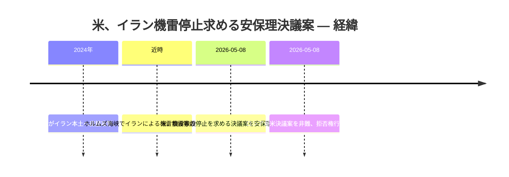
```mermaid
timeline
  title 米、イラン機雷停止求める安保理決議案 — 経緯
  2024年 : イスラエルがイラン本土へ直接攻撃、対立先鋭化
  近時 : ホルムズ海峡でイランによる機雷敷設等の懸念が高まる
  2026-05-08 : 米、機雷敷設停止を求める決議案を安保理に提出方針
  2026-05-08 : ロシアが米決議案を非難、拒否権行使も示唆
```

### 当事者マップ

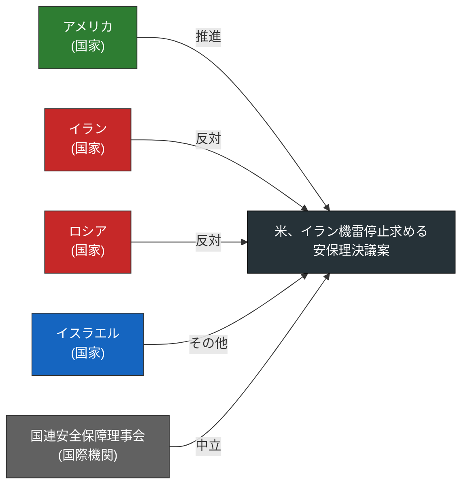
```mermaid
flowchart LR
  T["米、イラン機雷停止求める安保理決議案"]
  A0["アメリカ\n(国家)"]
  A0 -- 推進 --> T
  style A0 fill:#2e7d32,color:#fff,stroke:#333
  A1["イラン\n(国家)"]
  A1 -- 反対 --> T
  style A1 fill:#c62828,color:#fff,stroke:#333
  A2["ロシア\n(国家)"]
  A2 -- 反対 --> T
  style A2 fill:#c62828,color:#fff,stroke:#333
  A3["イスラエル\n(国家)"]
  A3 -- その他 --> T
  style A3 fill:#1565c0,color:#fff,stroke:#333
  A4["国連安全保障理事会\n(国際機関)"]
  A4 -- 中立 --> T
  style A4 fill:#616161,color:#fff,stroke:#333
  style T fill:#263238,color:#fff,stroke:#000
```

### 影響の広がり

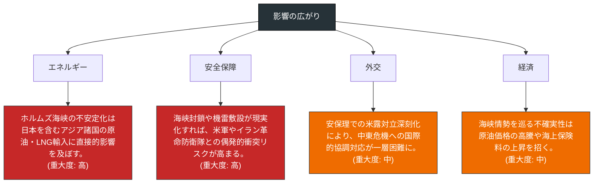
```mermaid
flowchart TB
  R["影響の広がり"]
  D0["エネルギー"]
  I0["ホルムズ海峡の不安定化は日本を含むアジア諸国の原油・LNG輸入に直接的影響を及ぼす。\n(重大度: 高)"]
  R --> D0 --> I0
  style I0 fill:#c62828,color:#fff,stroke:#333
  D1["安全保障"]
  I1["海峡封鎖や機雷敷設が現実化すれば、米軍やイラン革命防衛隊との偶発的衝突リスクが高まる。\n(重大度: 高)"]
  R --> D1 --> I1
  style I1 fill:#c62828,color:#fff,stroke:#333
  D2["外交"]
  I2["安保理での米露対立深刻化により、中東危機への国際的協調対応が一層困難に。\n(重大度: 中)"]
  R --> D2 --> I2
  style I2 fill:#ef6c00,color:#fff,stroke:#333
  D3["経済"]
  I3["海峡情勢を巡る不確実性は原油価格の高騰や海上保険料の上昇を招く。\n(重大度: 中)"]
  R --> D3 --> I3
  style I3 fill:#ef6c00,color:#fff,stroke:#333
  style R fill:#263238,color:#fff,stroke:#000
```

### 当事者の関係ネットワーク

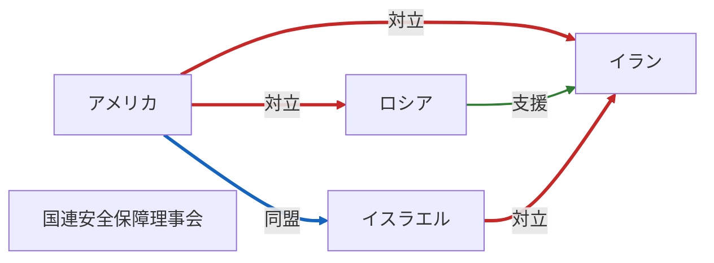
```mermaid
graph LR
  N0["アメリカ"]
  N1["イラン"]
  N2["ロシア"]
  N3["イスラエル"]
  N4["国連安全保障理事会"]
  N0 -->|対立| N1
  N0 -->|対立| N2
  N2 -->|支援| N1
  N3 -->|対立| N1
  N0 -->|同盟| N3
  linkStyle 0 stroke:#c62828,stroke-width:3px;
  linkStyle 1 stroke:#c62828,stroke-width:3px;
  linkStyle 2 stroke:#2e7d32,stroke-width:2px;
  linkStyle 3 stroke:#c62828,stroke-width:3px;
  linkStyle 4 stroke:#1565c0,stroke-width:3px;
```

### 押さえるべき論点

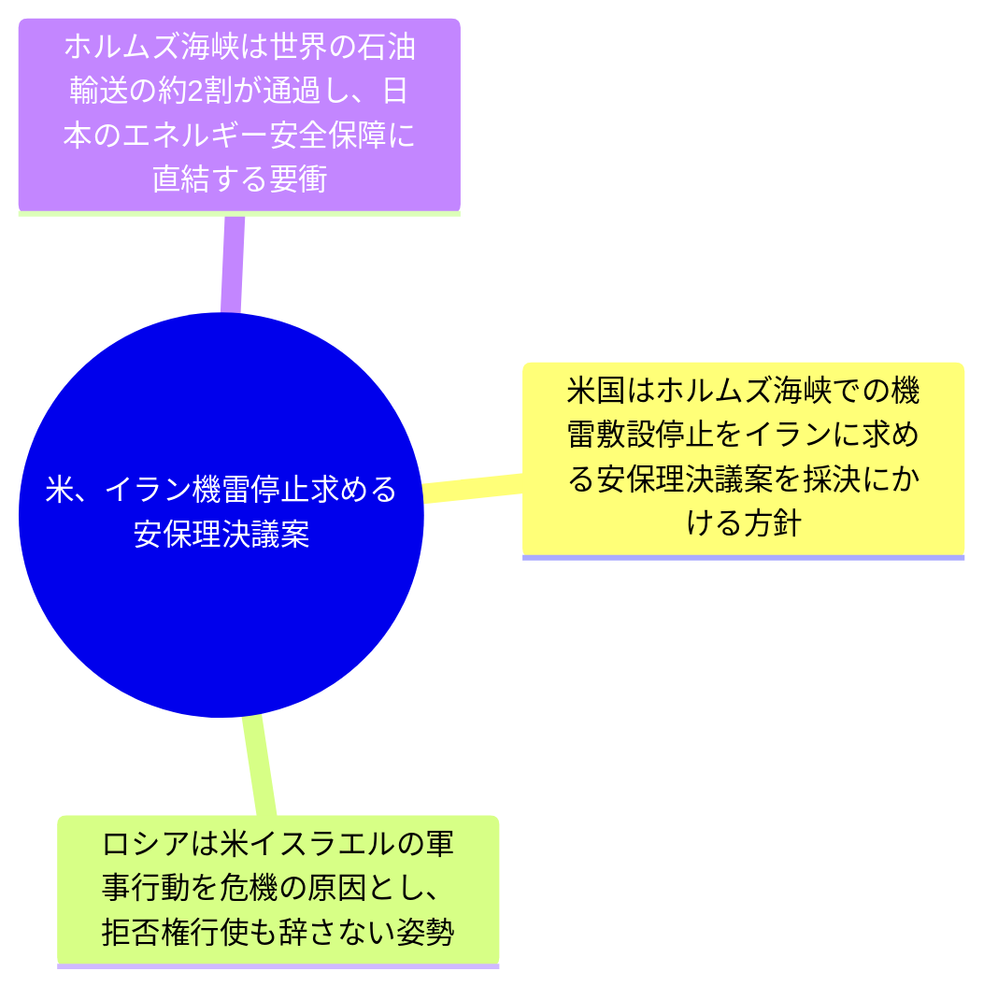
```mermaid
mindmap
  root((米、イラン機雷停止求める安保理決議案))
    米国はホルムズ海峡での機雷敷設停止をイランに求める安保理決議案を採決にかける方針
    ロシアは米イスラエルの軍事行動を危機の原因とし、拒否権行使も辞さない姿勢
    ホルムズ海峡は世界の石油輸送の約2割が通過し、日本のエネルギー安全保障に直結する要衝
```

---

## 米提案の露ウ3日間停戦合意 `重要度: 中` `europe / global`
- **出典:** NHK 国際 ([原文](http://www3.nhk.or.jp/news/html/20260509/k10015117301000.html)) / **公開:** 2026-05-09 06:31

**要約**
トランプ米大統領は8日、ロシアとウクライナが5月9日から11日までの3日間、戦闘を停止することで合意したとSNSで発表した。ロシアとウクライナの双方も米国の提案を受け入れる姿勢を示している。実際に停戦が履行されるかが焦点となる。短期間ではあるが、戦争開始以来初の本格的な戦闘停止となる可能性がある。

**背景**
ロシアによるウクライナ侵攻は2022年2月の開始以来、3年以上にわたり継続してきた。トランプ政権は復帰後、和平仲介に積極姿勢を見せており、今回の3日間停戦はその一環として位置づけられる。

**要点**
- 5月9日から11日までの3日間、ロシアとウクライナが停戦することでトランプ大統領が合意を発表

- ロシア・ウクライナ双方が米国の提案を受け入れる姿勢を示している

- 短期停戦が実際に履行されるか、また長期的な和平交渉につながるかが焦点

### 経緯タイムライン

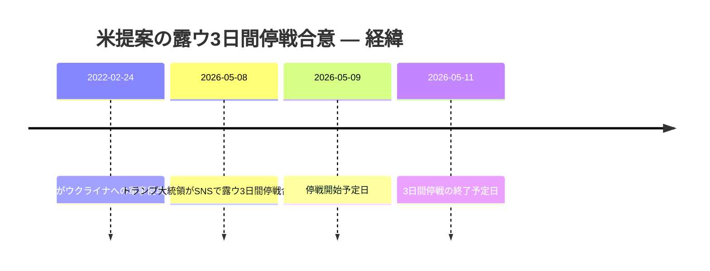
```mermaid
timeline
  title 米提案の露ウ3日間停戦合意 — 経緯
  2022-02-24 : ロシアがウクライナへの軍事侵攻を開始
  2026-05-08 : トランプ大統領がSNSで露ウ3日間停戦合意を発表
  2026-05-09 : 停戦開始予定日
  2026-05-11 : 3日間停戦の終了予定日
```

### 当事者マップ

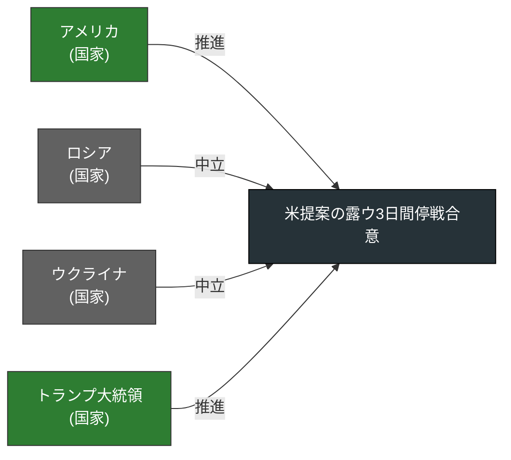
```mermaid
flowchart LR
  T["米提案の露ウ3日間停戦合意"]
  A0["アメリカ\n(国家)"]
  A0 -- 推進 --> T
  style A0 fill:#2e7d32,color:#fff,stroke:#333
  A1["ロシア\n(国家)"]
  A1 -- 中立 --> T
  style A1 fill:#616161,color:#fff,stroke:#333
  A2["ウクライナ\n(国家)"]
  A2 -- 中立 --> T
  style A2 fill:#616161,color:#fff,stroke:#333
  A3["トランプ大統領\n(国家)"]
  A3 -- 推進 --> T
  style A3 fill:#2e7d32,color:#fff,stroke:#333
  style T fill:#263238,color:#fff,stroke:#000
```

### 影響の広がり

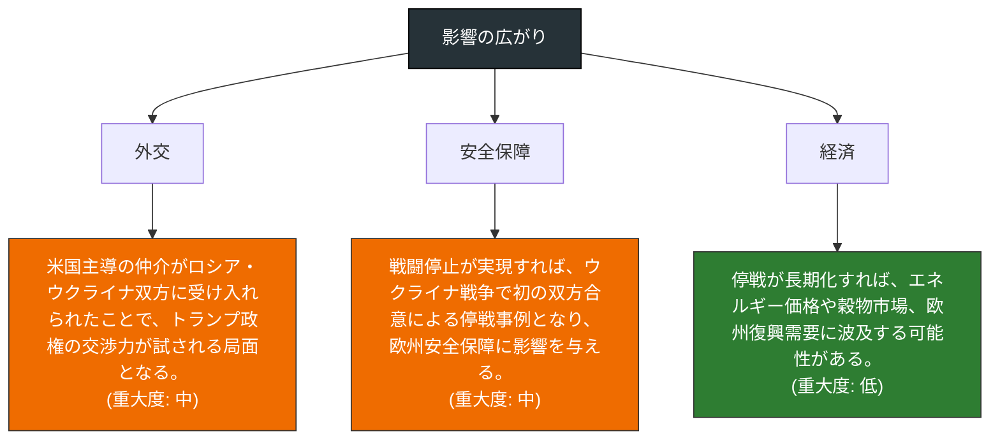
```mermaid
flowchart TB
  R["影響の広がり"]
  D0["外交"]
  I0["米国主導の仲介がロシア・ウクライナ双方に受け入れられたことで、トランプ政権の交渉力が試される局面となる。\n(重大度: 中)"]
  R --> D0 --> I0
  style I0 fill:#ef6c00,color:#fff,stroke:#333
  D1["安全保障"]
  I1["戦闘停止が実現すれば、ウクライナ戦争で初の双方合意による停戦事例となり、欧州安全保障に影響を与える。\n(重大度: 中)"]
  R --> D1 --> I1
  style I1 fill:#ef6c00,color:#fff,stroke:#333
  D2["経済"]
  I2["停戦が長期化すれば、エネルギー価格や穀物市場、欧州復興需要に波及する可能性がある。\n(重大度: 低)"]
  R --> D2 --> I2
  style I2 fill:#2e7d32,color:#fff,stroke:#333
  style R fill:#263238,color:#fff,stroke:#000
```

### 当事者の関係ネットワーク

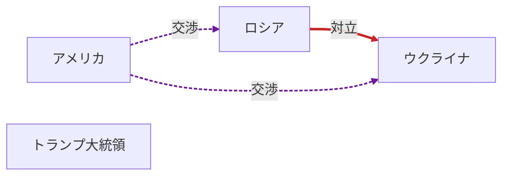
```mermaid
graph LR
  N0["アメリカ"]
  N1["ロシア"]
  N2["ウクライナ"]
  N3["トランプ大統領"]
  N1 -->|対立| N2
  N0 -->|交渉| N1
  N0 -->|交渉| N2
  linkStyle 0 stroke:#c62828,stroke-width:3px;
  linkStyle 1 stroke:#6a1b9a,stroke-width:2px,stroke-dasharray:4 2;
  linkStyle 2 stroke:#6a1b9a,stroke-width:2px,stroke-dasharray:4 2;
```

### 押さえるべき論点

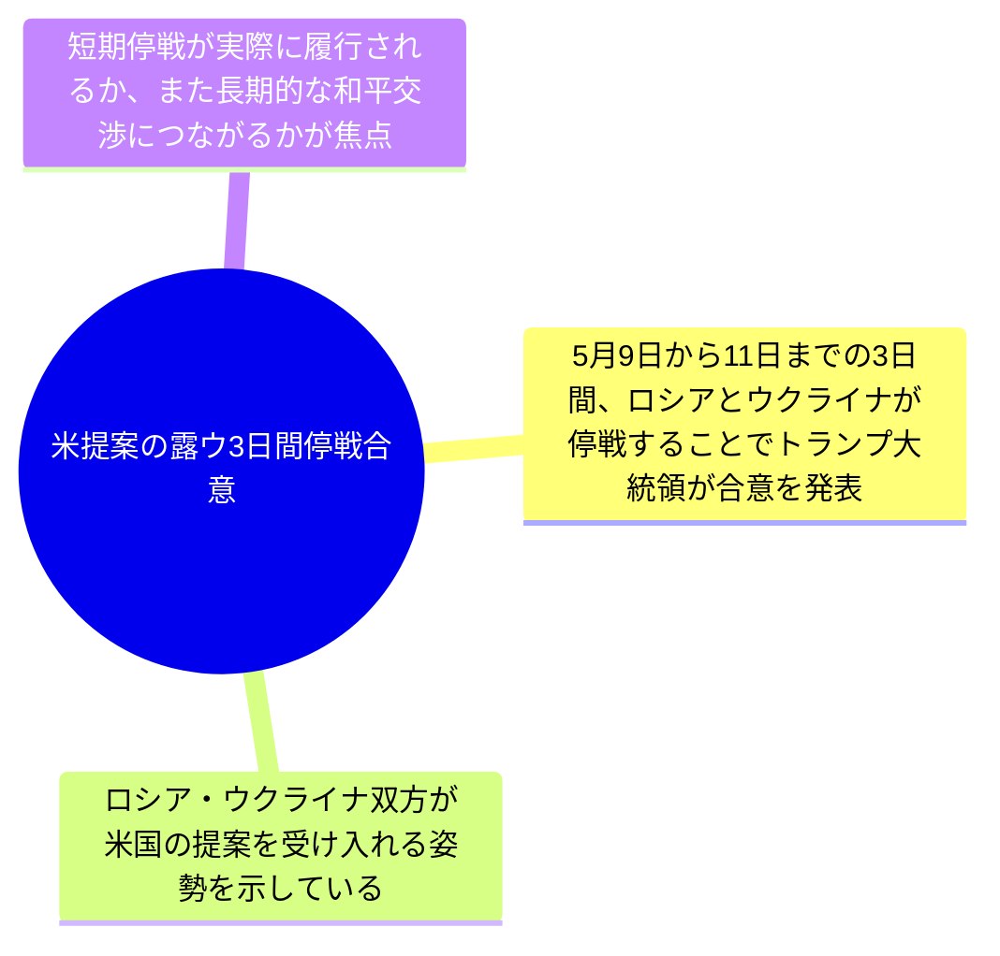
```mermaid
mindmap
  root((米提案の露ウ3日間停戦合意))
    5月9日から11日までの3日間、ロシアとウクライナが停戦することでトランプ大統領が合意を発表
    ロシア・ウクライナ双方が米国の提案を受け入れる姿勢を示している
    短期停戦が実際に履行されるか、また長期的な和平交渉につながるかが焦点
```

---

重要度「低」の記事(1本) — 見出しのみ

- **台湾で八田與一追悼式 頼総統参列** ([原文](http://www3.nhk.or.jp/news/html/20260508/k10015117211000.html)) — NHK 国際

