# 地政学ニュース図解レポート 2026-05-10 号

生成日時: 2026-05-10 07:40 / 記事数: 5

## 📌 本日の要点

- **ロシアのウクライナ侵攻 5月9日の動向** — ロシアによるウクライナへの軍事侵攻が継続している。

## ロシアのウクライナ侵攻 5月9日の動向 `重要度: 高` `europe / global`
- **出典:** NHK 国際 ([原文](http://www3.nhk.or.jp/news/html/20260509/k10015101821000.html)) / **公開:** 2026-05-10 02:12

**要約**
ロシアによるウクライナへの軍事侵攻が継続している。ウクライナ各地でロシア軍とウクライナ軍の戦闘が続き、多数の市民が国外へ避難している状況にある。NHKは戦闘状況や関係各国の外交動向を随時更新で伝えており、本記事は5月9日（日本時間）の動きをまとめたもの。日本・ウクライナとモスクワには6時間の時差がある。

**背景**
ロシアは2022年2月にウクライナへの全面侵攻を開始し、戦闘は長期化している。欧米諸国はウクライナへの軍事・経済支援を続ける一方、ロシアに対する制裁を強化してきた。

**要点**
- ロシアによるウクライナ侵攻は依然として継続している

- ウクライナ各地で戦闘が続き、多数の市民が国外避難を強いられている

- 戦況に加え関係各国の外交動向が情勢を左右する重要な要素となっている

### 経緯タイムライン

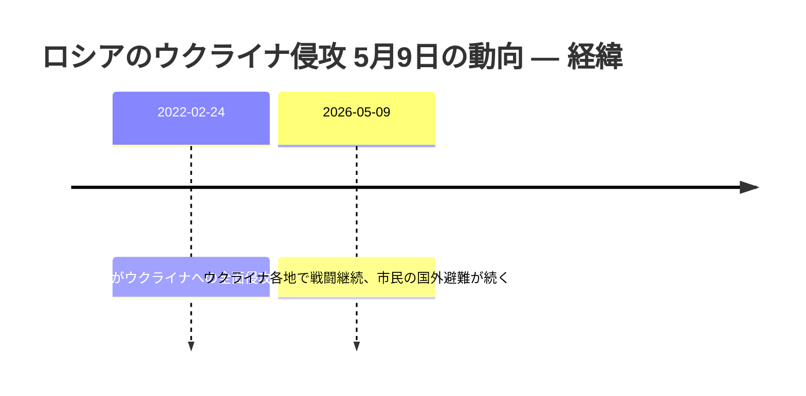
```mermaid
timeline
  title ロシアのウクライナ侵攻 5月9日の動向 — 経緯
  2022-02-24 : ロシアがウクライナへの全面侵攻を開始
  2026-05-09 : ウクライナ各地で戦闘継続、市民の国外避難が続く
```

### 当事者マップ

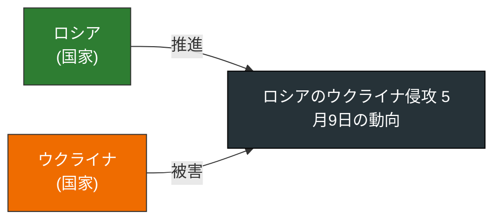
```mermaid
flowchart LR
  T["ロシアのウクライナ侵攻 5月9日の動向"]
  A0["ロシア\n(国家)"]
  A0 -- 推進 --> T
  style A0 fill:#2e7d32,color:#fff,stroke:#333
  A1["ウクライナ\n(国家)"]
  A1 -- 被害 --> T
  style A1 fill:#ef6c00,color:#fff,stroke:#333
  style T fill:#263238,color:#fff,stroke:#000
```

### 影響の広がり

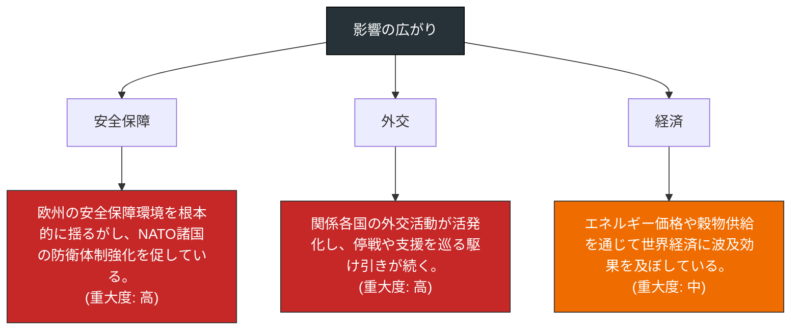
```mermaid
flowchart TB
  R["影響の広がり"]
  D0["安全保障"]
  I0["欧州の安全保障環境を根本的に揺るがし、NATO諸国の防衛体制強化を促している。\n(重大度: 高)"]
  R --> D0 --> I0
  style I0 fill:#c62828,color:#fff,stroke:#333
  D1["外交"]
  I1["関係各国の外交活動が活発化し、停戦や支援を巡る駆け引きが続く。\n(重大度: 高)"]
  R --> D1 --> I1
  style I1 fill:#c62828,color:#fff,stroke:#333
  D2["経済"]
  I2["エネルギー価格や穀物供給を通じて世界経済に波及効果を及ぼしている。\n(重大度: 中)"]
  R --> D2 --> I2
  style I2 fill:#ef6c00,color:#fff,stroke:#333
  style R fill:#263238,color:#fff,stroke:#000
```

### 当事者の関係ネットワーク

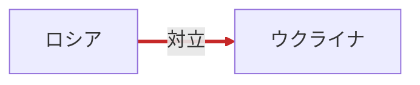
```mermaid
graph LR
  N0["ロシア"]
  N1["ウクライナ"]
  N0 -->|対立| N1
  linkStyle 0 stroke:#c62828,stroke-width:3px;
```

### 押さえるべき論点

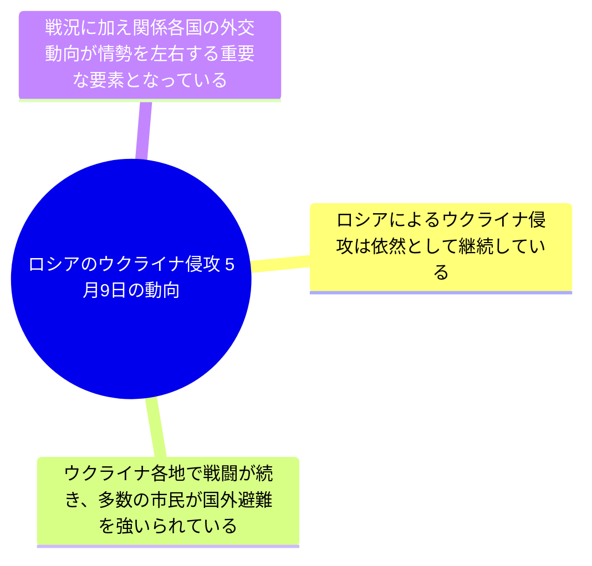
```mermaid
mindmap
  root((ロシアのウクライナ侵攻 5月9日の動向))
    ロシアによるウクライナ侵攻は依然として継続している
    ウクライナ各地で戦闘が続き、多数の市民が国外避難を強いられている
    戦況に加え関係各国の外交動向が情勢を左右する重要な要素となっている
```

---

## 米提案の3日間停戦 露ウ双方が違反主張 `重要度: 中` `europe / global`
- **出典:** NHK 国際 ([原文](http://www3.nhk.or.jp/news/html/20260510/k10015117671000.html)) / **公開:** 2026-05-10 05:52

**要約**
トランプ米大統領が提案した5月9日からの3日間の停戦について、ロシアとウクライナの双方が受け入れる方針を示した。しかし停戦開始後、両国は相手側が停戦を守っていないと相次いで発表した。米国が仲介する停戦の枠組みが実効性を持たせることの難しさが浮き彫りとなった。

**背景**
トランプ政権はウクライナ戦争の早期終結を外交目標に掲げ、ロシア・ウクライナ双方への働きかけを強めてきた。今回の3日間の限定的停戦は、本格的な和平交渉に向けた信頼醸成措置として提案された経緯がある。

**要点**
- トランプ大統領提案の3日間停戦を露ウ双方が受け入れたが、開始直後から互いに違反を主張

- 停戦監視・検証メカニズムの欠如が短期停戦すら難しくしている

- 米国主導の和平仲介の実効性に早くも疑問符がつき、戦闘長期化のリスクが高まる

### 経緯タイムライン

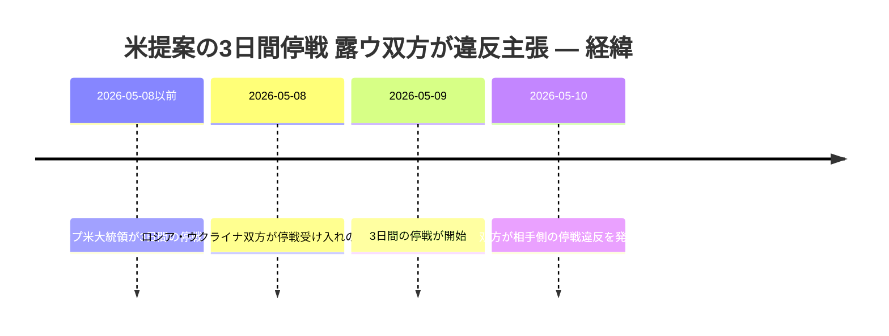
```mermaid
timeline
  title 米提案の3日間停戦 露ウ双方が違反主張 — 経緯
  2026-05-08以前 : トランプ米大統領が3日間の停戦を提案
  2026-05-08 : ロシア・ウクライナ双方が停戦受け入れの方針を表明
  2026-05-09 : 3日間の停戦が開始
  2026-05-10 : 双方が相手側の停戦違反を発表
```

### 当事者マップ

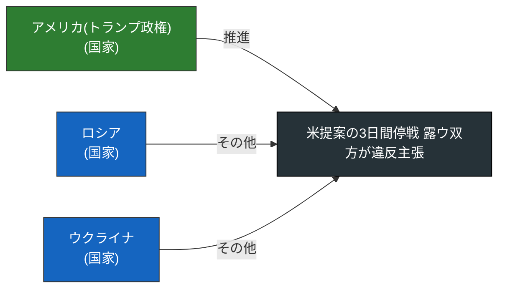
```mermaid
flowchart LR
  T["米提案の3日間停戦 露ウ双方が違反主張"]
  A0["アメリカ(トランプ政権)\n(国家)"]
  A0 -- 推進 --> T
  style A0 fill:#2e7d32,color:#fff,stroke:#333
  A1["ロシア\n(国家)"]
  A1 -- その他 --> T
  style A1 fill:#1565c0,color:#fff,stroke:#333
  A2["ウクライナ\n(国家)"]
  A2 -- その他 --> T
  style A2 fill:#1565c0,color:#fff,stroke:#333
  style T fill:#263238,color:#fff,stroke:#000
```

### 影響の広がり

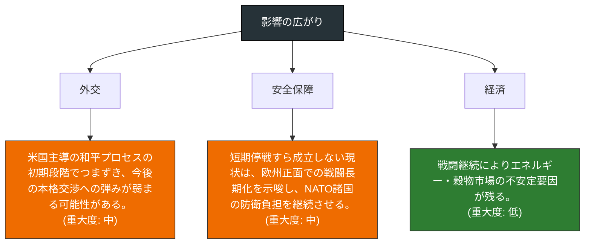
```mermaid
flowchart TB
  R["影響の広がり"]
  D0["外交"]
  I0["米国主導の和平プロセスの初期段階でつまずき、今後の本格交渉への弾みが弱まる可能性がある。\n(重大度: 中)"]
  R --> D0 --> I0
  style I0 fill:#ef6c00,color:#fff,stroke:#333
  D1["安全保障"]
  I1["短期停戦すら成立しない現状は、欧州正面での戦闘長期化を示唆し、NATO諸国の防衛負担を継続させる。\n(重大度: 中)"]
  R --> D1 --> I1
  style I1 fill:#ef6c00,color:#fff,stroke:#333
  D2["経済"]
  I2["戦闘継続によりエネルギー・穀物市場の不安定要因が残る。\n(重大度: 低)"]
  R --> D2 --> I2
  style I2 fill:#2e7d32,color:#fff,stroke:#333
  style R fill:#263238,color:#fff,stroke:#000
```

### 当事者の関係ネットワーク

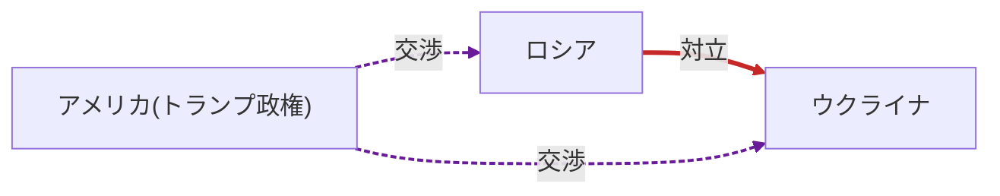
```mermaid
graph LR
  N0["アメリカ(トランプ政権)"]
  N1["ロシア"]
  N2["ウクライナ"]
  N1 -->|対立| N2
  N0 -->|交渉| N1
  N0 -->|交渉| N2
  linkStyle 0 stroke:#c62828,stroke-width:3px;
  linkStyle 1 stroke:#6a1b9a,stroke-width:2px,stroke-dasharray:4 2;
  linkStyle 2 stroke:#6a1b9a,stroke-width:2px,stroke-dasharray:4 2;
```

### 押さえるべき論点

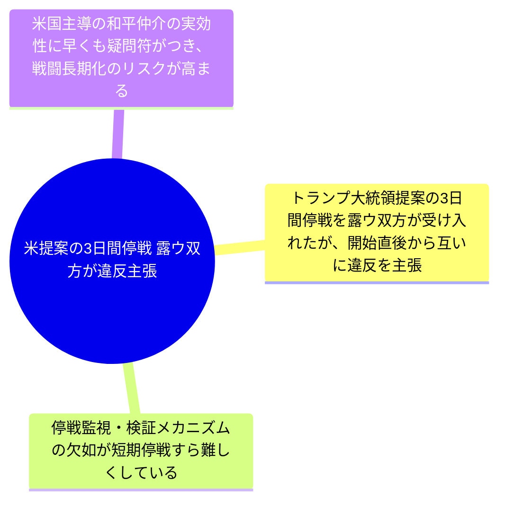
```mermaid
mindmap
  root((米提案の3日間停戦 露ウ双方が違反主張))
    トランプ大統領提案の3日間停戦を露ウ双方が受け入れたが、開始直後から互いに違反を主張
    停戦監視・検証メカニズムの欠如が短期停戦すら難しくしている
    米国主導の和平仲介の実効性に早くも疑問符がつき、戦闘長期化のリスクが高まる
```

---

## プーチン氏、戦勝記念日にNATO非難 `重要度: 中` `europe / global`
- **出典:** BBC World ([原文](https://www.bbc.com/news/articles/c626xjq0q0vo?at_medium=RSS&at_campaign=rss)) / **公開:** 2026-05-09 12:18

**要約**
ロシアのプーチン大統領は5月9日の対独戦勝記念日において、規模を縮小した形で軍事パレードを実施した。年次演説の中でプーチン氏はNATOを強く非難し、ウクライナでの「特別軍事作戦」を改めて正当化した。例年に比べパレードの規模が縮小されたことは、長期化するウクライナ戦争によるロシア軍の負担を示唆している。記念日は依然として国威発揚と戦争継続の正当化の場として利用されている。

**背景**
ロシアは毎年5月9日を第二次世界大戦の対独戦勝記念日として盛大に祝ってきたが、2022年のウクライナ全面侵攻以降、軍事的負担と治安上の懸念から規模縮小が続いている。プーチン政権はNATOの東方拡大を侵攻の正当化根拠として繰り返し主張している。

**要点**
- プーチン氏は戦勝記念日演説でNATOを非難し、ウクライナ侵攻を正当化

- パレードは規模縮小で実施され、長引く戦争による軍の消耗を示唆

- ロシアと西側の対立構図は固定化し、和平の見通しは依然不透明

### 経緯タイムライン

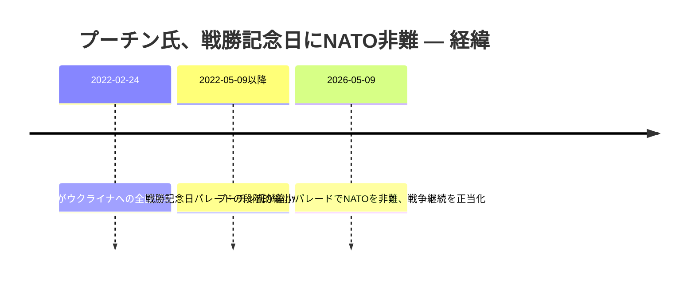
```mermaid
timeline
  title プーチン氏、戦勝記念日にNATO非難 — 経緯
  2022-02-24 : ロシアがウクライナへの全面侵攻を開始
  2022-05-09以降 : 戦勝記念日パレードの段階的縮小が続く
  2026-05-09 : プーチン氏が縮小パレードでNATOを非難、戦争継続を正当化
```

### 当事者マップ

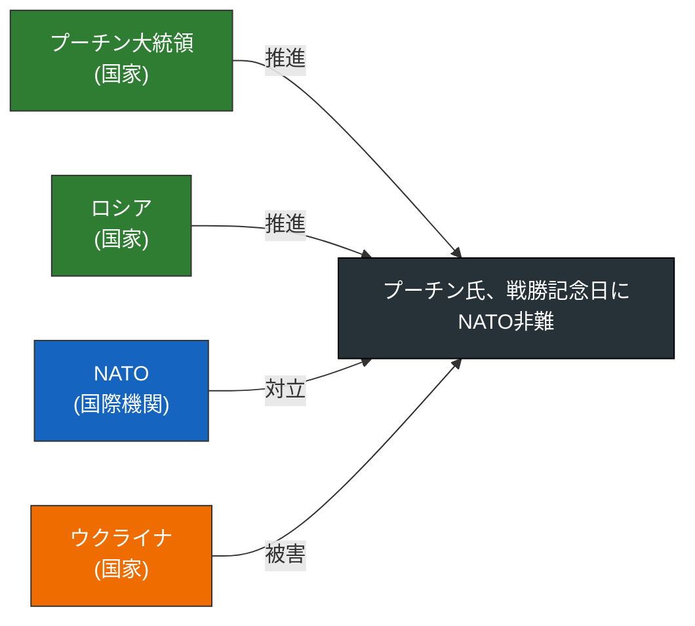
```mermaid
flowchart LR
  T["プーチン氏、戦勝記念日にNATO非難"]
  A0["プーチン大統領\n(国家)"]
  A0 -- 推進 --> T
  style A0 fill:#2e7d32,color:#fff,stroke:#333
  A1["ロシア\n(国家)"]
  A1 -- 推進 --> T
  style A1 fill:#2e7d32,color:#fff,stroke:#333
  A2["NATO\n(国際機関)"]
  A2 -- 対立 --> T
  style A2 fill:#1565c0,color:#fff,stroke:#333
  A3["ウクライナ\n(国家)"]
  A3 -- 被害 --> T
  style A3 fill:#ef6c00,color:#fff,stroke:#333
  style T fill:#263238,color:#fff,stroke:#000
```

### 影響の広がり

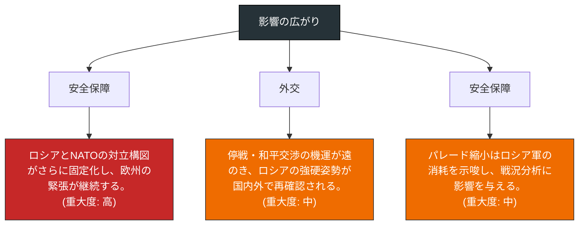
```mermaid
flowchart TB
  R["影響の広がり"]
  D0["安全保障"]
  I0["ロシアとNATOの対立構図がさらに固定化し、欧州の緊張が継続する。\n(重大度: 高)"]
  R --> D0 --> I0
  style I0 fill:#c62828,color:#fff,stroke:#333
  D1["外交"]
  I1["停戦・和平交渉の機運が遠のき、ロシアの強硬姿勢が国内外で再確認される。\n(重大度: 中)"]
  R --> D1 --> I1
  style I1 fill:#ef6c00,color:#fff,stroke:#333
  D2["安全保障"]
  I2["パレード縮小はロシア軍の消耗を示唆し、戦況分析に影響を与える。\n(重大度: 中)"]
  R --> D2 --> I2
  style I2 fill:#ef6c00,color:#fff,stroke:#333
  style R fill:#263238,color:#fff,stroke:#000
```

### 当事者の関係ネットワーク

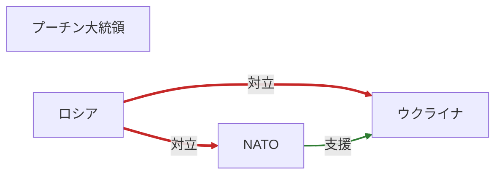
```mermaid
graph LR
  N0["プーチン大統領"]
  N1["ロシア"]
  N2["NATO"]
  N3["ウクライナ"]
  N1 -->|対立| N2
  N1 -->|対立| N3
  N2 -->|支援| N3
  linkStyle 0 stroke:#c62828,stroke-width:3px;
  linkStyle 1 stroke:#c62828,stroke-width:3px;
  linkStyle 2 stroke:#2e7d32,stroke-width:2px;
```

### 押さえるべき論点

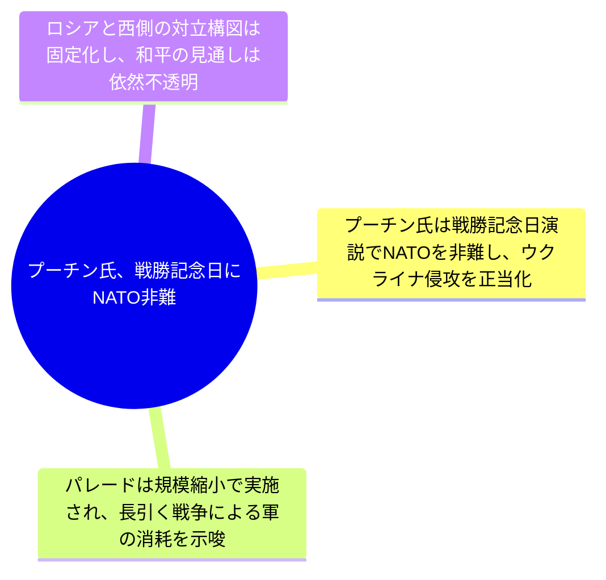
```mermaid
mindmap
  root((プーチン氏、戦勝記念日にNATO非難))
    プーチン氏は戦勝記念日演説でNATOを非難し、ウクライナ侵攻を正当化
    パレードは規模縮小で実施され、長引く戦争による軍の消耗を示唆
    ロシアと西側の対立構図は固定化し、和平の見通しは依然不透明
```

---

## 露戦勝記念式典 プーチン氏が勝利強調 `重要度: 中` `europe / global`
- **出典:** NHK 国際 ([原文](http://www3.nhk.or.jp/news/html/20260509/k10015117521000.html)) / **公開:** 2026-05-09 19:27

**要約**
ロシアの首都モスクワで第2次世界大戦の戦勝記念日の式典が、例年より規模を縮小して開催された。プーチン大統領はウクライナへの軍事侵攻について「勝利はわれわれのものだ」と強調した。これに先立ちトランプ米大統領は、ロシアとウクライナが5月9日から3日間停戦すると発表したが、実現するかは不透明な状況だ。

**背景**
ロシアは2022年2月にウクライナへの軍事侵攻を開始し、戦闘は4年以上続いている。2025年に発足したトランプ米政権は停戦仲介を進めているが、両国の立場の隔たりは大きく、これまで本格的な停戦は実現していない。

**要点**
- 戦勝記念日式典は例年より縮小開催され、長期化する戦争の影響がうかがえる

- プーチン氏は第2次大戦の勝利と現在の侵攻を結びつけ、戦争継続を正当化

- トランプ氏が発表した3日間停戦の実現性は不透明で、恒久停戦への道筋は見えない

### 経緯タイムライン

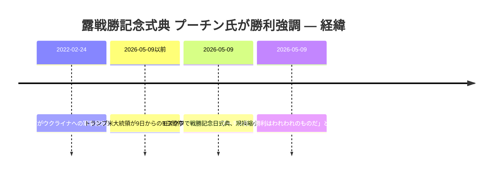
```mermaid
timeline
  title 露戦勝記念式典 プーチン氏が勝利強調 — 経緯
  2022-02-24 : ロシアがウクライナへの軍事侵攻を開始
  2026-05-09以前 : トランプ米大統領が9日からの3日間停戦を発表
  2026-05-09 : モスクワで戦勝記念日式典、規模縮小で開催
  2026-05-09 : プーチン氏「勝利はわれわれのものだ」と侵攻を正当化
```

### 当事者マップ

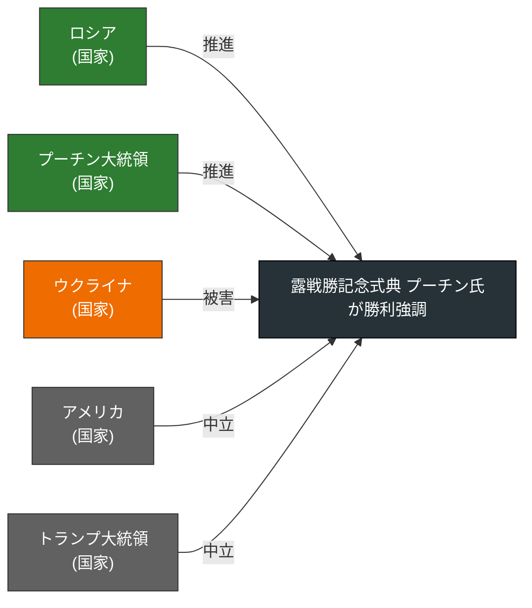
```mermaid
flowchart LR
  T["露戦勝記念式典 プーチン氏が勝利強調"]
  A0["ロシア\n(国家)"]
  A0 -- 推進 --> T
  style A0 fill:#2e7d32,color:#fff,stroke:#333
  A1["プーチン大統領\n(国家)"]
  A1 -- 推進 --> T
  style A1 fill:#2e7d32,color:#fff,stroke:#333
  A2["ウクライナ\n(国家)"]
  A2 -- 被害 --> T
  style A2 fill:#ef6c00,color:#fff,stroke:#333
  A3["アメリカ\n(国家)"]
  A3 -- 中立 --> T
  style A3 fill:#616161,color:#fff,stroke:#333
  A4["トランプ大統領\n(国家)"]
  A4 -- 中立 --> T
  style A4 fill:#616161,color:#fff,stroke:#333
  style T fill:#263238,color:#fff,stroke:#000
```

### 影響の広がり

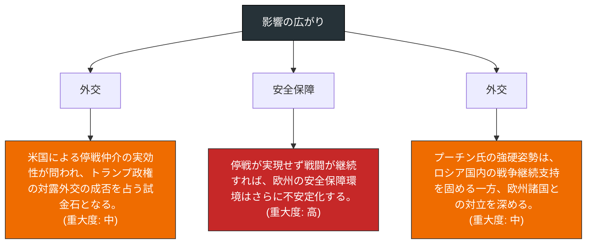
```mermaid
flowchart TB
  R["影響の広がり"]
  D0["外交"]
  I0["米国による停戦仲介の実効性が問われ、トランプ政権の対露外交の成否を占う試金石となる。\n(重大度: 中)"]
  R --> D0 --> I0
  style I0 fill:#ef6c00,color:#fff,stroke:#333
  D1["安全保障"]
  I1["停戦が実現せず戦闘が継続すれば、欧州の安全保障環境はさらに不安定化する。\n(重大度: 高)"]
  R --> D1 --> I1
  style I1 fill:#c62828,color:#fff,stroke:#333
  D2["外交"]
  I2["プーチン氏の強硬姿勢は、ロシア国内の戦争継続支持を固める一方、欧州諸国との対立を深める。\n(重大度: 中)"]
  R --> D2 --> I2
  style I2 fill:#ef6c00,color:#fff,stroke:#333
  style R fill:#263238,color:#fff,stroke:#000
```

### 当事者の関係ネットワーク

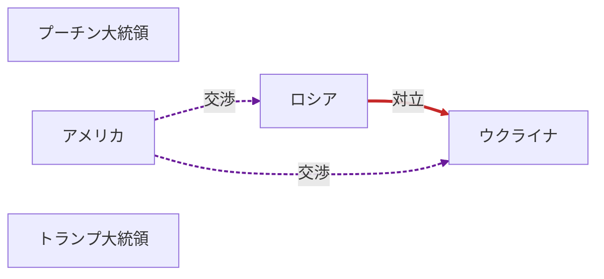
```mermaid
graph LR
  N0["ロシア"]
  N1["プーチン大統領"]
  N2["ウクライナ"]
  N3["アメリカ"]
  N4["トランプ大統領"]
  N0 -->|対立| N2
  N3 -->|交渉| N0
  N3 -->|交渉| N2
  linkStyle 0 stroke:#c62828,stroke-width:3px;
  linkStyle 1 stroke:#6a1b9a,stroke-width:2px,stroke-dasharray:4 2;
  linkStyle 2 stroke:#6a1b9a,stroke-width:2px,stroke-dasharray:4 2;
```

### 押さえるべき論点

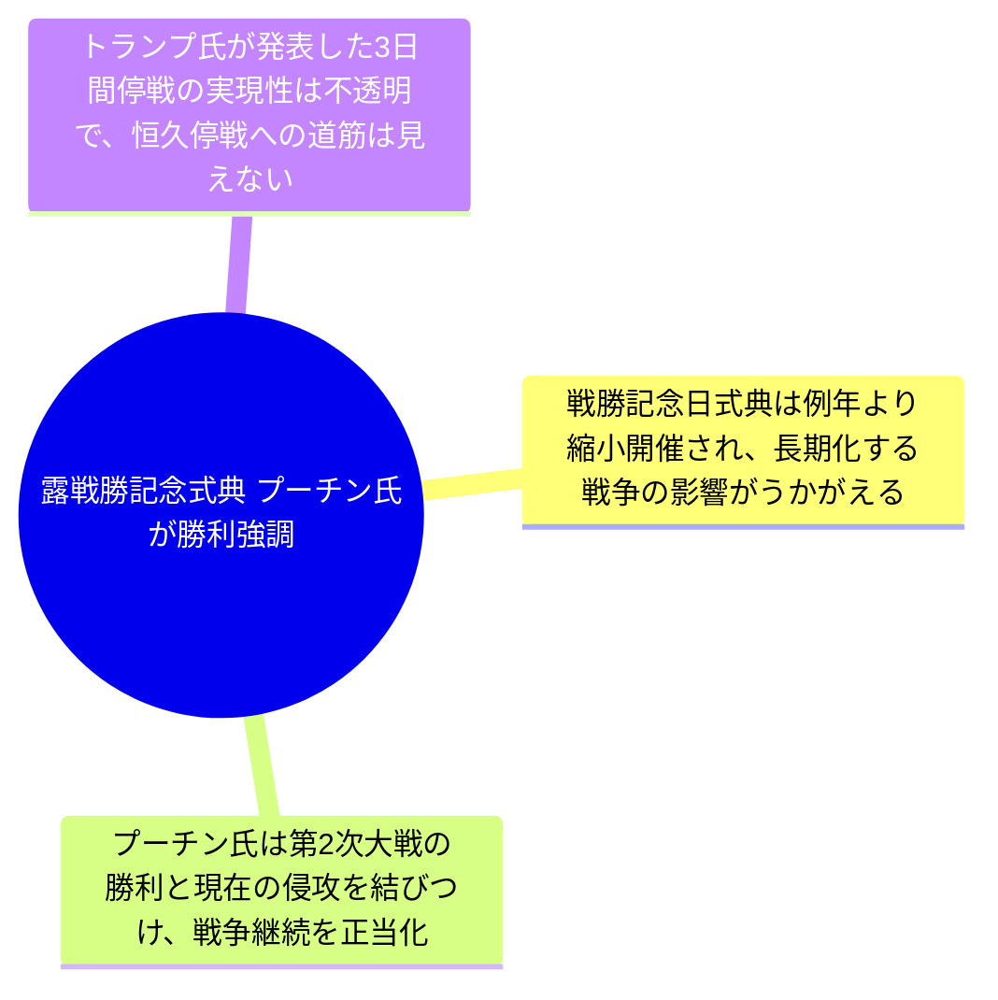
```mermaid
mindmap
  root((露戦勝記念式典 プーチン氏が勝利強調))
    戦勝記念日式典は例年より縮小開催され、長期化する戦争の影響がうかがえる
    プーチン氏は第2次大戦の勝利と現在の侵攻を結びつけ、戦争継続を正当化
    トランプ氏が発表した3日間停戦の実現性は不透明で、恒久停戦への道筋は見えない
```

---

## ブルガリアで親露派ラデフ氏が首相に `重要度: 中` `europe`
- **出典:** NHK 国際 ([原文](http://www3.nhk.or.jp/news/html/20260509/k10015117271000.html)) / **公開:** 2026-05-09 11:11

**要約**
EU加盟国であるブルガリアで、5月8日に親ロシア的姿勢で知られるラデフ前大統領が新首相に選出された。ウクライナ支援を含む対外政策の方向性が大きく変化する可能性があり、EU内の結束への影響が懸念されている。今後の政策運営が注目される。

**背景**
ブルガリアはEUおよびNATOの加盟国だが、歴史的・宗教的にロシアと近く、国内には根強い親露感情が残る。ラデフ氏は大統領在任時からウクライナへの軍事支援に慎重姿勢を示してきた。

**要点**
- EU・NATO加盟国ブルガリアで親露派ラデフ氏が首相に選出された

- ウクライナ支援の継続可否が最大の焦点となる

- EU内で親露派政権が増えれば、対露制裁・支援の結束が揺らぐ恐れがある

### 経緯タイムライン

```mermaid
timeline
  title ブルガリアで親露派ラデフ氏が首相に — 経緯
  2017-2027 : ラデフ氏が大統領として親露・ウクライナ支援慎重姿勢を表明
  2026-05-08 : ブルガリア議会がラデフ前大統領を新首相に選出
  2026-05-09 : NHK等が選出を報道、ウクライナ政策への影響に注目集まる
```

### 当事者マップ

```mermaid
flowchart LR
  T["ブルガリアで親露派ラデフ氏が首相に"]
  A0["ブルガリア(ラデフ新首相)\n(国家)"]
  A0 -- その他 --> T
  style A0 fill:#1565c0,color:#fff,stroke:#333
  A1["EU\n(国際機関)"]
  A1 -- 中立 --> T
  style A1 fill:#616161,color:#fff,stroke:#333
  A2["ウクライナ\n(国家)"]
  A2 -- 被害 --> T
  style A2 fill:#ef6c00,color:#fff,stroke:#333
  A3["ロシア\n(国家)"]
  A3 -- 推進 --> T
  style A3 fill:#2e7d32,color:#fff,stroke:#333
  A4["NATO\n(国際機関)"]
  A4 -- 中立 --> T
  style A4 fill:#616161,color:#fff,stroke:#333
  style T fill:#263238,color:#fff,stroke:#000
```

### 影響の広がり

```mermaid
flowchart TB
  R["影響の広がり"]
  D0["外交"]
  I0["EU・NATO内で親露派国家が増え、対露統一姿勢が揺らぐ可能性。\n(重大度: 中)"]
  R --> D0 --> I0
  style I0 fill:#ef6c00,color:#fff,stroke:#333
  D1["安全保障"]
  I1["黒海地域におけるNATOの抑止態勢に影響しうる。\n(重大度: 中)"]
  R --> D1 --> I1
  style I1 fill:#ef6c00,color:#fff,stroke:#333
  D2["経済"]
  I2["対露エネルギー依存の再強化や制裁緩和圧力につながる可能性。\n(重大度: 低)"]
  R --> D2 --> I2
  style I2 fill:#2e7d32,color:#fff,stroke:#333
  style R fill:#263238,color:#fff,stroke:#000
```

### 当事者の関係ネットワーク

```mermaid
graph LR
  N0["ブルガリア(ラデフ新首相)"]
  N1["EU"]
  N2["ウクライナ"]
  N3["ロシア"]
  N4["NATO"]
  N0 -->|支援| N3
  N0 -->|緊張| N1
  N0 -->|対立| N2
  N1 -->|対立| N3
  N4 -->|対立| N3
  linkStyle 0 stroke:#2e7d32,stroke-width:2px;
  linkStyle 1 stroke:#ef6c00,stroke-width:2px,stroke-dasharray:4 2;
  linkStyle 2 stroke:#c62828,stroke-width:3px;
  linkStyle 3 stroke:#c62828,stroke-width:3px;
  linkStyle 4 stroke:#c62828,stroke-width:3px;
```

### 押さえるべき論点

```mermaid
mindmap
  root((ブルガリアで親露派ラデフ氏が首相に))
    EU・NATO加盟国ブルガリアで親露派ラデフ氏が首相に選出された
    ウクライナ支援の継続可否が最大の焦点となる
    EU内で親露派政権が増えれば、対露制裁・支援の結束が揺らぐ恐れがある
```

---
