# 地政学ニュース図解レポート 2026-05-11 号

生成日時: 2026-05-11 07:43 / 記事数: 5

## 📌 本日の要点

- **米イラン交渉停滞、ホルムズ海峡で緊張継続** — アメリカとイランの戦闘終結交渉は進展が見られず、対立が長期化している。

- **ロシアのウクライナ侵攻5月10日の動き** — ロシアによるウクライナへの軍事侵攻が続き、ウクライナ各地で戦闘が継続している。

## 米イラン交渉停滞、ホルムズ海峡で緊張継続 `重要度: 高` `middle_east / global`
- **出典:** NHK 国際 ([原文](http://www3.nhk.or.jp/news/html/20260510/k10015117611000.html)) / **公開:** 2026-05-10 21:12

**要約**
アメリカとイランの戦闘終結交渉は進展が見られず、対立が長期化している。イラン軍報道官は、米国の対イラン制裁に追随する国はホルムズ海峡通過で困難に直面すると警告し、同海峡がイラン管理下にあることを強調した。一方、米中央軍はイランの港湾に対する封鎖措置が完全に実施されていると主張しており、双方の主張が真っ向から対立している。世界の石油輸送の約2割を担うホルムズ海峡の不安定化は、日本を含む各国のエネルギー安全保障に直結する。

**背景**
イランは長年、米国による制裁強化に対しホルムズ海峡封鎖をカードとしてちらつかせてきた。第2次トランプ政権下での「最大圧力」路線復活、イスラエル・イラン間の直接攻撃応酬を経て、米イラン間では戦闘終結を巡る交渉が続くが、停滞している。

**要点**
- 米イランの戦闘終結交渉は停滞し、ホルムズ海峡を巡る軍事的応酬が続いている

- イランは制裁追随国に対しホルムズ海峡通航での報復を示唆、海上自由航行が脅かされる

- ホルムズ海峡は世界石油輸送の約2割を占め、日本のエネルギー安全保障に直撃する案件

### 経緯タイムライン

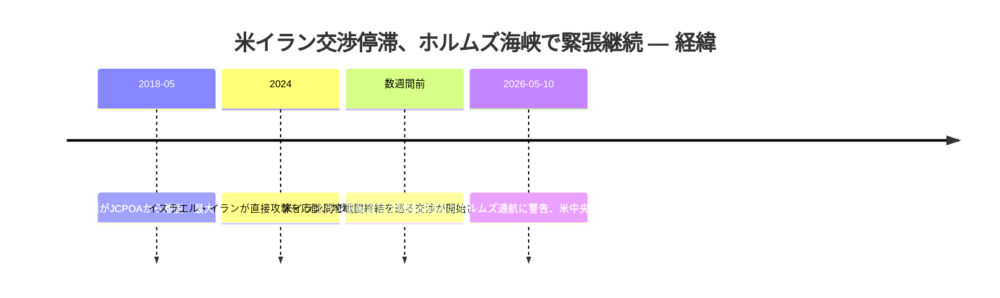
```mermaid
timeline
  title 米イラン交渉停滞、ホルムズ海峡で緊張継続 — 経緯
  2018-05 : 米トランプ政権がJCPOAから離脱、最大圧力政策を再開
  2024 : イスラエル・イランが直接攻撃を応酬、地域緊張が急上昇
  数週間前 : 米イラン間で戦闘終結を巡る交渉が開始されるも停滞
  2026-05-10 : イラン軍報道官が制裁追随国のホルムズ通航に警告、米中央軍はイラン港湾封鎖の継続を主張
```

### 当事者マップ

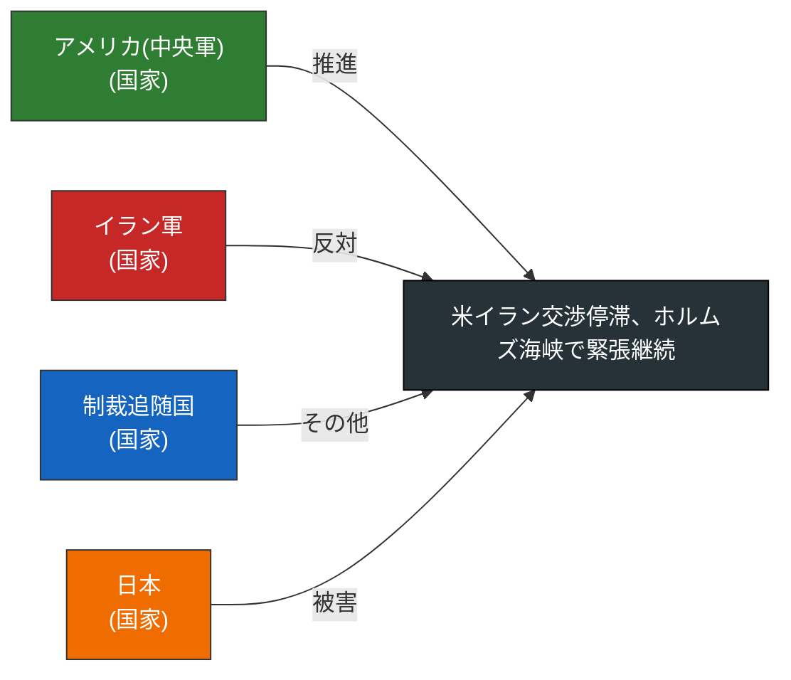
```mermaid
flowchart LR
  T["米イラン交渉停滞、ホルムズ海峡で緊張継続"]
  A0["アメリカ(中央軍)\n(国家)"]
  A0 -- 推進 --> T
  style A0 fill:#2e7d32,color:#fff,stroke:#333
  A1["イラン軍\n(国家)"]
  A1 -- 反対 --> T
  style A1 fill:#c62828,color:#fff,stroke:#333
  A2["制裁追随国\n(国家)"]
  A2 -- その他 --> T
  style A2 fill:#1565c0,color:#fff,stroke:#333
  A3["日本\n(国家)"]
  A3 -- 被害 --> T
  style A3 fill:#ef6c00,color:#fff,stroke:#333
  style T fill:#263238,color:#fff,stroke:#000
```

### 影響の広がり

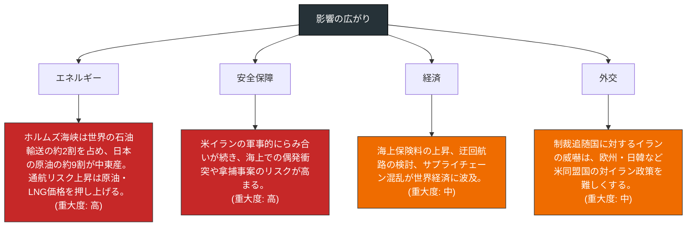
```mermaid
flowchart TB
  R["影響の広がり"]
  D0["エネルギー"]
  I0["ホルムズ海峡は世界の石油輸送の約2割を占め、日本の原油の約9割が中東産。通航リスク上昇は原油・LNG価格を押し上げる。\n(重大度: 高)"]
  R --> D0 --> I0
  style I0 fill:#c62828,color:#fff,stroke:#333
  D1["安全保障"]
  I1["米イランの軍事的にらみ合いが続き、海上での偶発衝突や拿捕事案のリスクが高まる。\n(重大度: 高)"]
  R --> D1 --> I1
  style I1 fill:#c62828,color:#fff,stroke:#333
  D2["経済"]
  I2["海上保険料の上昇、迂回航路の検討、サプライチェーン混乱が世界経済に波及。\n(重大度: 中)"]
  R --> D2 --> I2
  style I2 fill:#ef6c00,color:#fff,stroke:#333
  D3["外交"]
  I3["制裁追随国に対するイランの威嚇は、欧州・日韓など米同盟国の対イラン政策を難しくする。\n(重大度: 中)"]
  R --> D3 --> I3
  style I3 fill:#ef6c00,color:#fff,stroke:#333
  style R fill:#263238,color:#fff,stroke:#000
```

### 当事者の関係ネットワーク

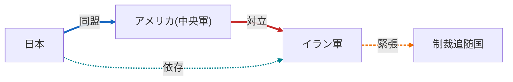
```mermaid
graph LR
  N0["アメリカ(中央軍)"]
  N1["イラン軍"]
  N2["制裁追随国"]
  N3["日本"]
  N0 -->|対立| N1
  N1 -->|緊張| N2
  N3 -->|同盟| N0
  N3 -->|依存| N1
  linkStyle 0 stroke:#c62828,stroke-width:3px;
  linkStyle 1 stroke:#ef6c00,stroke-width:2px,stroke-dasharray:4 2;
  linkStyle 2 stroke:#1565c0,stroke-width:3px;
  linkStyle 3 stroke:#00838f,stroke-width:2px,stroke-dasharray:2 2;
```

### 押さえるべき論点

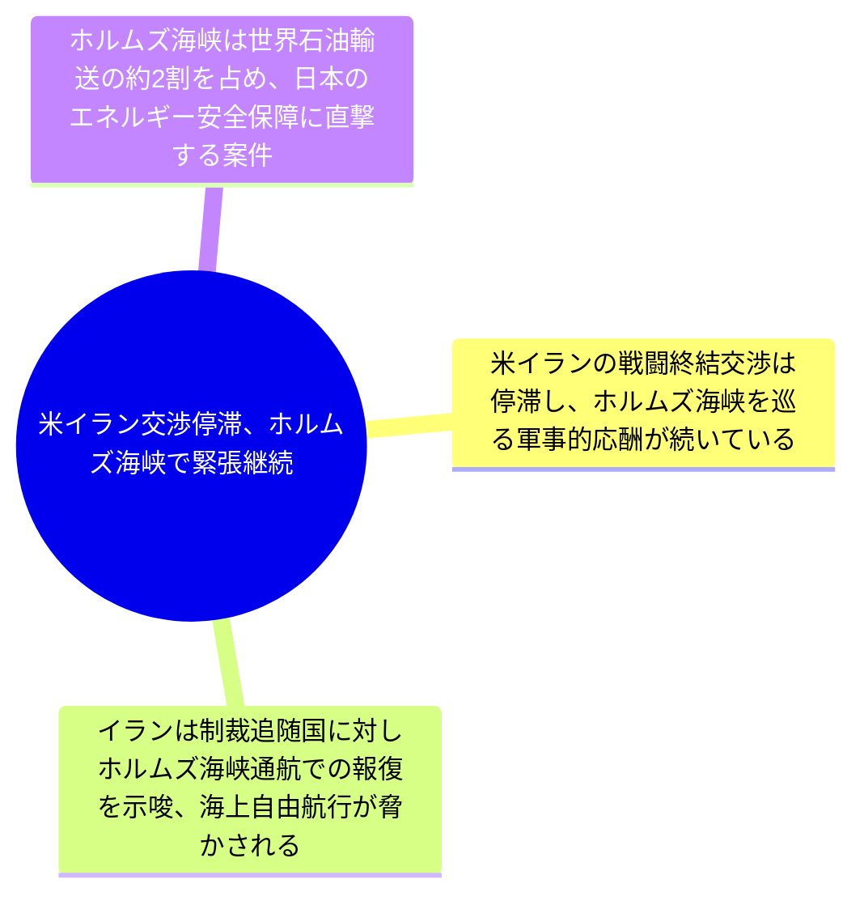
```mermaid
mindmap
  root((米イラン交渉停滞、ホルムズ海峡で緊張継続))
    米イランの戦闘終結交渉は停滞し、ホルムズ海峡を巡る軍事的応酬が続いている
    イランは制裁追随国に対しホルムズ海峡通航での報復を示唆、海上自由航行が脅かされる
    ホルムズ海峡は世界石油輸送の約2割を占め、日本のエネルギー安全保障に直撃する案件
```

---

## ロシアのウクライナ侵攻5月10日の動き `重要度: 高` `europe / global`
- **出典:** NHK 国際 ([原文](http://www3.nhk.or.jp/news/html/20260510/k10015107491000.html)) / **公開:** 2026-05-10 10:25

**要約**
ロシアによるウクライナへの軍事侵攻が続き、ウクライナ各地で戦闘が継続している。多数の市民が国外への避難を余儀なくされている。NHKは5月10日の戦闘状況や関係各国の外交動向を随時更新で伝えている。日本とウクライナ、モスクワとの時差は6時間。

**背景**
ロシアは2022年2月にウクライナへの軍事侵攻を開始し、戦闘は長期化している。各地で激しい戦闘が継続し、人道危機と国際的な外交対立が深刻化している。

**要点**
- ロシアによるウクライナ侵攻は5月10日時点でも継続中

- ウクライナ各地で戦闘が続き、多数の市民が国外避難

- 関係各国の外交動向も引き続き注目される情勢

### 経緯タイムライン

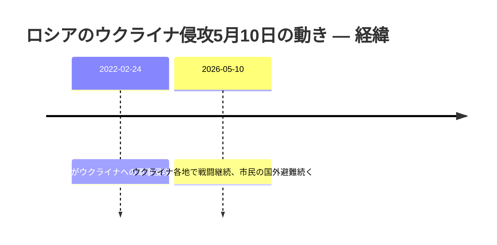
```mermaid
timeline
  title ロシアのウクライナ侵攻5月10日の動き — 経緯
  2022-02-24 : ロシアがウクライナへの軍事侵攻を開始
  2026-05-10 : ウクライナ各地で戦闘継続、市民の国外避難続く
```

### 当事者マップ

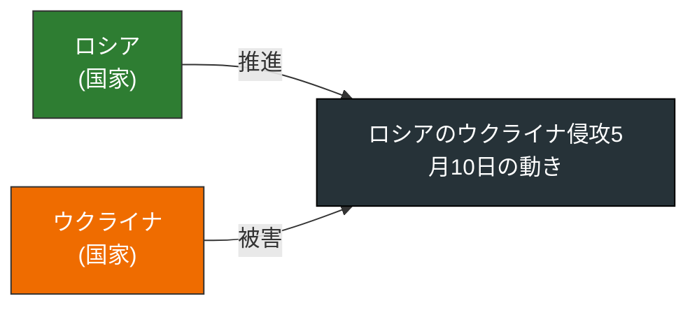
```mermaid
flowchart LR
  T["ロシアのウクライナ侵攻5月10日の動き"]
  A0["ロシア\n(国家)"]
  A0 -- 推進 --> T
  style A0 fill:#2e7d32,color:#fff,stroke:#333
  A1["ウクライナ\n(国家)"]
  A1 -- 被害 --> T
  style A1 fill:#ef6c00,color:#fff,stroke:#333
  style T fill:#263238,color:#fff,stroke:#000
```

### 影響の広がり

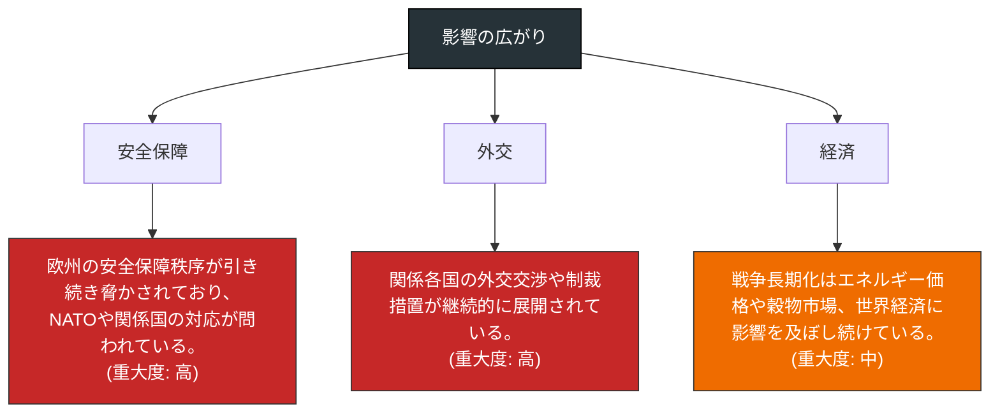
```mermaid
flowchart TB
  R["影響の広がり"]
  D0["安全保障"]
  I0["欧州の安全保障秩序が引き続き脅かされており、NATOや関係国の対応が問われている。\n(重大度: 高)"]
  R --> D0 --> I0
  style I0 fill:#c62828,color:#fff,stroke:#333
  D1["外交"]
  I1["関係各国の外交交渉や制裁措置が継続的に展開されている。\n(重大度: 高)"]
  R --> D1 --> I1
  style I1 fill:#c62828,color:#fff,stroke:#333
  D2["経済"]
  I2["戦争長期化はエネルギー価格や穀物市場、世界経済に影響を及ぼし続けている。\n(重大度: 中)"]
  R --> D2 --> I2
  style I2 fill:#ef6c00,color:#fff,stroke:#333
  style R fill:#263238,color:#fff,stroke:#000
```

### 当事者の関係ネットワーク

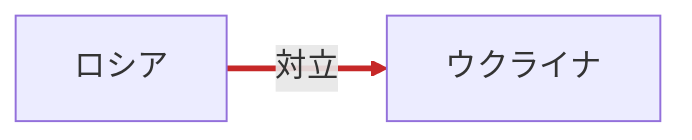
```mermaid
graph LR
  N0["ロシア"]
  N1["ウクライナ"]
  N0 -->|対立| N1
  linkStyle 0 stroke:#c62828,stroke-width:3px;
```

### 押さえるべき論点

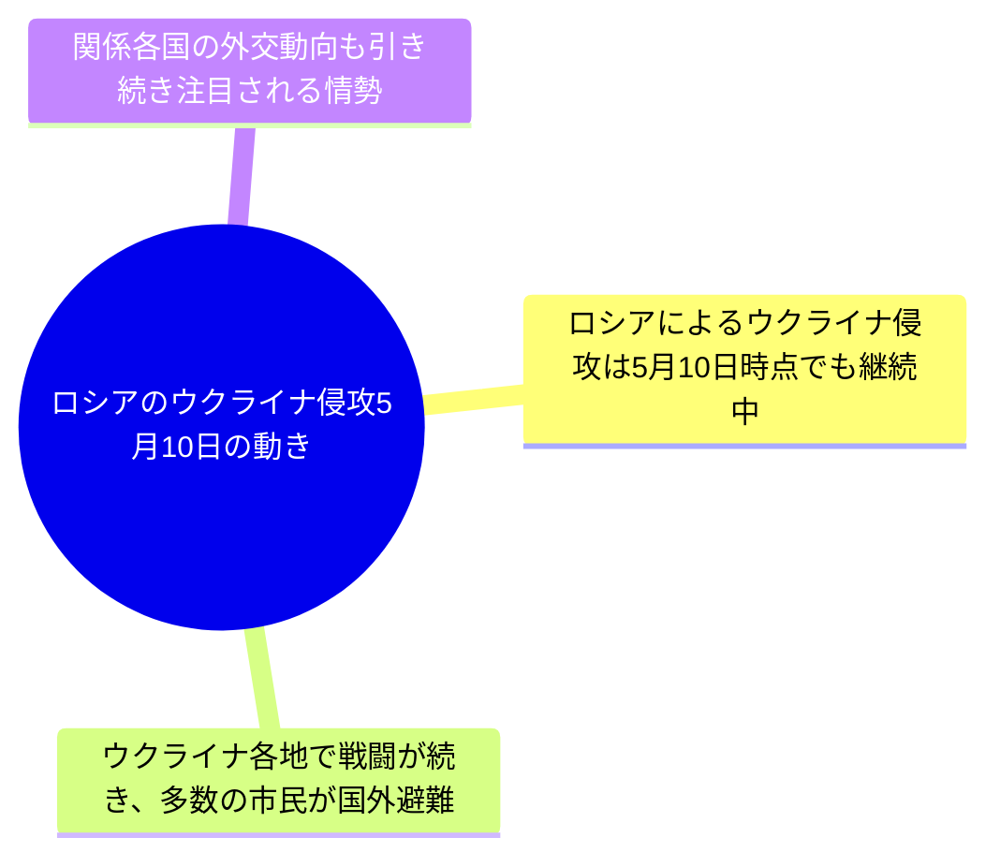
```mermaid
mindmap
  root((ロシアのウクライナ侵攻5月10日の動き))
    ロシアによるウクライナ侵攻は5月10日時点でも継続中
    ウクライナ各地で戦闘が続き、多数の市民が国外避難
    関係各国の外交動向も引き続き注目される情勢
```

---

## 露ウ3日間停戦も双方が攻撃と非難 `重要度: 中` `europe / global`
- **出典:** NHK 国際 ([原文](http://www3.nhk.or.jp/news/html/20260511/k10015118021000.html)) / **公開:** 2026-05-11 05:32

**要約**
ロシアとウクライナはアメリカの提案に応じて3日間の停戦を行うとしていました。しかし停戦期間中とされる10日にも、双方が相手から攻撃を受けたと主張し非難の応酬が続いています。米国主導の停戦合意の実効性に疑問符が付く形となっています。

**背景**
ロシアによるウクライナ侵攻が長期化する中、アメリカが仲介する形で短期間の停戦が試みられてきました。今回は3日間の限定的な停戦提案でしたが、双方の不信感は根強く、合意維持は困難な状況にあります。

**要点**
- 米国仲介の3日間停戦は事実上機能していない

- ロシア・ウクライナ双方が相手の停戦違反を主張し非難の応酬

- 短期停戦すら維持できず、本格和平への道のりは険しい

### 経緯タイムライン

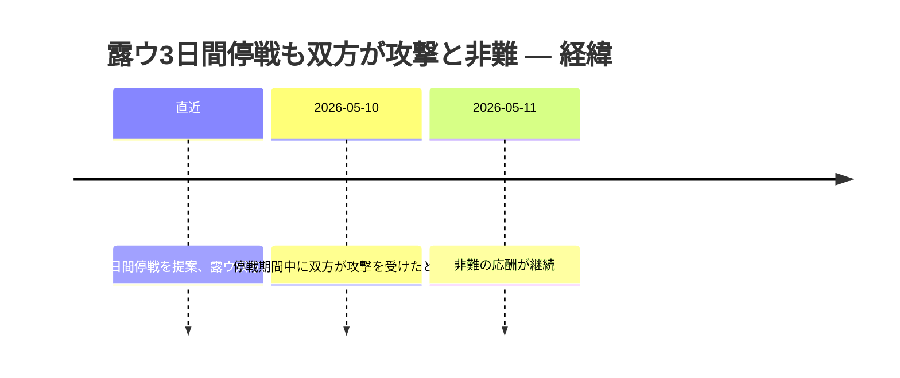
```mermaid
timeline
  title 露ウ3日間停戦も双方が攻撃と非難 — 経緯
  直近 : アメリカが3日間停戦を提案、露ウ双方が応じる姿勢
  2026-05-10 : 停戦期間中に双方が攻撃を受けたと主張
  2026-05-11 : 非難の応酬が継続
```

### 当事者マップ

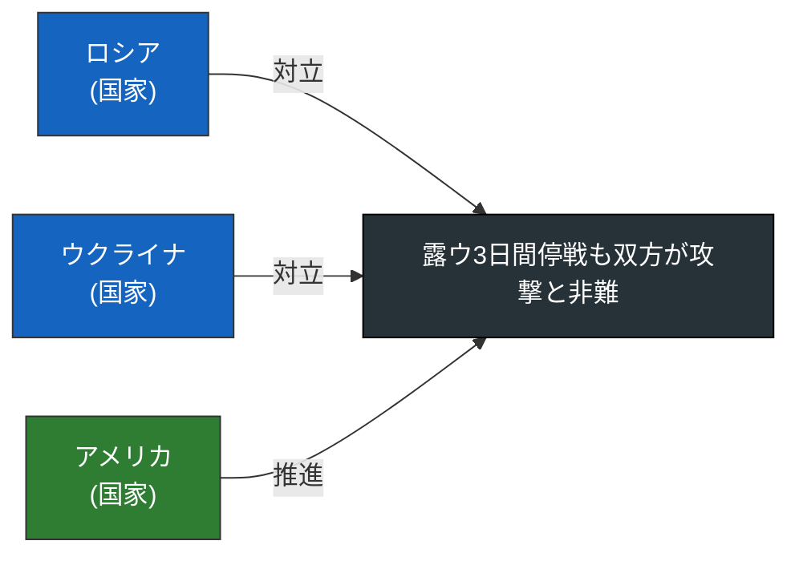
```mermaid
flowchart LR
  T["露ウ3日間停戦も双方が攻撃と非難"]
  A0["ロシア\n(国家)"]
  A0 -- 対立 --> T
  style A0 fill:#1565c0,color:#fff,stroke:#333
  A1["ウクライナ\n(国家)"]
  A1 -- 対立 --> T
  style A1 fill:#1565c0,color:#fff,stroke:#333
  A2["アメリカ\n(国家)"]
  A2 -- 推進 --> T
  style A2 fill:#2e7d32,color:#fff,stroke:#333
  style T fill:#263238,color:#fff,stroke:#000
```

### 影響の広がり

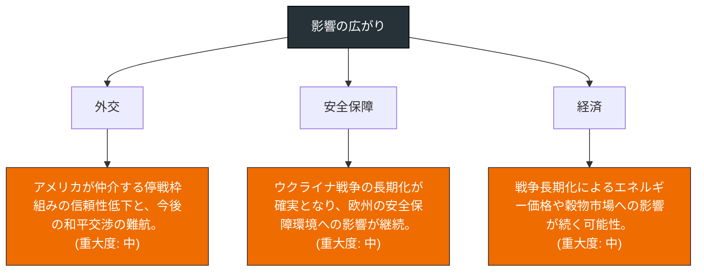
```mermaid
flowchart TB
  R["影響の広がり"]
  D0["外交"]
  I0["アメリカが仲介する停戦枠組みの信頼性低下と、今後の和平交渉の難航。\n(重大度: 中)"]
  R --> D0 --> I0
  style I0 fill:#ef6c00,color:#fff,stroke:#333
  D1["安全保障"]
  I1["ウクライナ戦争の長期化が確実となり、欧州の安全保障環境への影響が継続。\n(重大度: 中)"]
  R --> D1 --> I1
  style I1 fill:#ef6c00,color:#fff,stroke:#333
  D2["経済"]
  I2["戦争長期化によるエネルギー価格や穀物市場への影響が続く可能性。\n(重大度: 中)"]
  R --> D2 --> I2
  style I2 fill:#ef6c00,color:#fff,stroke:#333
  style R fill:#263238,color:#fff,stroke:#000
```

### 当事者の関係ネットワーク

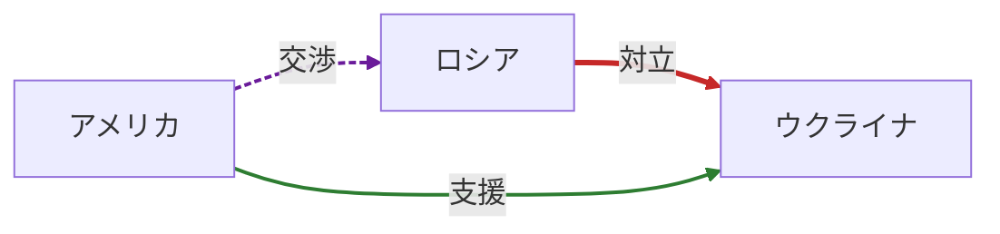
```mermaid
graph LR
  N0["ロシア"]
  N1["ウクライナ"]
  N2["アメリカ"]
  N0 -->|対立| N1
  N2 -->|交渉| N0
  N2 -->|支援| N1
  linkStyle 0 stroke:#c62828,stroke-width:3px;
  linkStyle 1 stroke:#6a1b9a,stroke-width:2px,stroke-dasharray:4 2;
  linkStyle 2 stroke:#2e7d32,stroke-width:2px;
```

### 押さえるべき論点

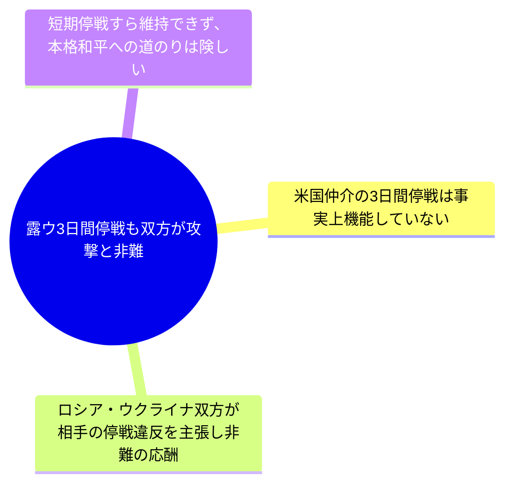
```mermaid
mindmap
  root((露ウ3日間停戦も双方が攻撃と非難))
    米国仲介の3日間停戦は事実上機能していない
    ロシア・ウクライナ双方が相手の停戦違反を主張し非難の応酬
    短期停戦すら維持できず、本格和平への道のりは険しい
```

---

## プーチン側近 日ロ対話再開へ文化交流訴え `重要度: 中` `europe / east_asia`
- **出典:** NHK 国際 ([原文](http://www3.nhk.or.jp/news/html/20260511/k10015117971000.html)) / **公開:** 2026-05-11 05:16

**要約**
ロシアのプーチン大統領の側近がNHKのインタビューに応じ、ウクライナ侵攻以降冷え込んだ日ロ関係について言及した。政治対話の再開に向けた地ならしとして、文化交流を継続することの重要性を強調した。これはロシア側から日本への関係改善の働きかけと位置づけられる。

**背景**
2022年のロシアによるウクライナ侵攻以降、日本はG7と歩調を合わせて対ロ制裁を実施し、日ロ関係は戦後最悪レベルに悪化した。北方領土交渉も停止し、政治対話はほぼ途絶えている状態が続いている。

**要点**
- プーチン側近がNHKインタビューで日ロ政治対話の再開に意欲を示した

- ロシア側は文化交流を関係改善の足がかりと位置づけている

- ウクライナ侵攻が続く中、日本がG7との結束を維持できるかが焦点

### 経緯タイムライン

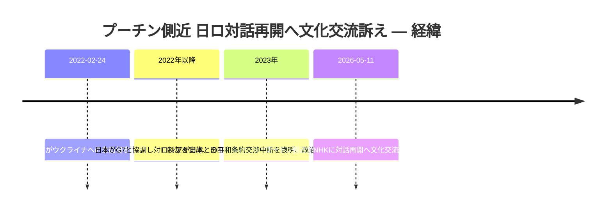
```mermaid
timeline
  title プーチン側近 日ロ対話再開へ文化交流訴え — 経緯
  2022-02-24 : ロシアがウクライナへの全面侵攻を開始
  2022年以降 : 日本がG7と協調し対ロ制裁を実施、日ロ関係が悪化
  2023年 : ロシアが日本との平和条約交渉中断を表明、政治対話が事実上停止
  2026-05-11 : プーチン側近がNHKに対話再開へ文化交流の継続を訴える
```

### 当事者マップ

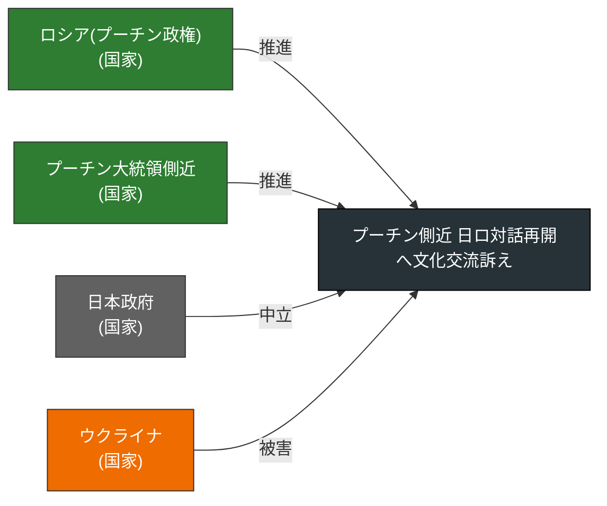
```mermaid
flowchart LR
  T["プーチン側近 日ロ対話再開へ文化交流訴え"]
  A0["ロシア(プーチン政権)\n(国家)"]
  A0 -- 推進 --> T
  style A0 fill:#2e7d32,color:#fff,stroke:#333
  A1["プーチン大統領側近\n(国家)"]
  A1 -- 推進 --> T
  style A1 fill:#2e7d32,color:#fff,stroke:#333
  A2["日本政府\n(国家)"]
  A2 -- 中立 --> T
  style A2 fill:#616161,color:#fff,stroke:#333
  A3["ウクライナ\n(国家)"]
  A3 -- 被害 --> T
  style A3 fill:#ef6c00,color:#fff,stroke:#333
  style T fill:#263238,color:#fff,stroke:#000
```

### 影響の広がり

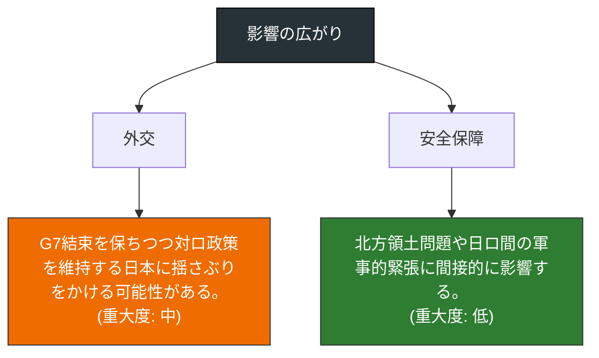
```mermaid
flowchart TB
  R["影響の広がり"]
  D0["外交"]
  I0["G7結束を保ちつつ対ロ政策を維持する日本に揺さぶりをかける可能性がある。\n(重大度: 中)"]
  R --> D0 --> I0
  style I0 fill:#ef6c00,color:#fff,stroke:#333
  D1["安全保障"]
  I1["北方領土問題や日ロ間の軍事的緊張に間接的に影響する。\n(重大度: 低)"]
  R --> D1 --> I1
  style I1 fill:#2e7d32,color:#fff,stroke:#333
  style R fill:#263238,color:#fff,stroke:#000
```

### 当事者の関係ネットワーク

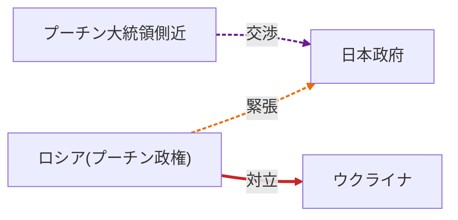
```mermaid
graph LR
  N0["ロシア(プーチン政権)"]
  N1["プーチン大統領側近"]
  N2["日本政府"]
  N3["ウクライナ"]
  N0 -->|緊張| N2
  N0 -->|対立| N3
  N1 -->|交渉| N2
  linkStyle 0 stroke:#ef6c00,stroke-width:2px,stroke-dasharray:4 2;
  linkStyle 1 stroke:#c62828,stroke-width:3px;
  linkStyle 2 stroke:#6a1b9a,stroke-width:2px,stroke-dasharray:4 2;
```

### 押さえるべき論点

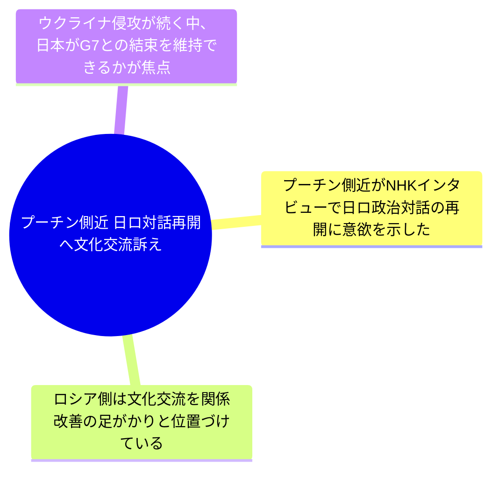
```mermaid
mindmap
  root((プーチン側近 日ロ対話再開へ文化交流訴え))
    プーチン側近がNHKインタビューで日ロ政治対話の再開に意欲を示した
    ロシア側は文化交流を関係改善の足がかりと位置づけている
    ウクライナ侵攻が続く中、日本がG7との結束を維持できるかが焦点
```

---

## プーチン氏、首脳会談は最終合意時のみと言明 `重要度: 中` `europe / global`
- **出典:** NHK 国際 ([原文](http://www3.nhk.or.jp/news/html/20260510/k10015117711000.html)) / **公開:** 2026-05-10 10:17

**要約**
ロシアのプーチン大統領は、ウクライナのゼレンスキー大統領との首脳会談について、平和条約の最終合意に達した場合に限り実施すると表明した。ロシアが提示する条件をウクライナが受け入れない限り、和平交渉は進展しないとの強硬姿勢を改めて示した形となる。これは事実上、現状での首脳会談開催を拒否する姿勢であり、和平プロセスの停滞を象徴している。

**背景**
ロシアによるウクライナ侵攻は長期化しており、断続的に和平交渉や仲介の動きが取り沙汰されてきた。しかしロシアは占領地の承認やウクライナの中立化など強硬な条件を維持しており、ウクライナ側との隔たりは依然大きい。

**要点**
- プーチン氏は首脳会談を平和条約の最終合意時のみに限定する姿勢を表明

- ロシアの条件をウクライナが受け入れない限り交渉進展は困難

- 和平プロセスの停滞が長期化し、欧州の安全保障に影響が続く

### 経緯タイムライン

```mermaid
timeline
  title プーチン氏、首脳会談は最終合意時のみと言明 — 経緯
  2022-02-24 : ロシアがウクライナへの軍事侵攻を開始
  数年間 : 断続的に和平仲介の動きが浮上するも進展せず
  2026-05-10 : プーチン氏、首脳会談は最終合意時のみと発言
```

### 当事者マップ

```mermaid
flowchart LR
  T["プーチン氏、首脳会談は最終合意時のみと言明"]
  A0["プーチン大統領(ロシア)\n(国家)"]
  A0 -- 推進 --> T
  style A0 fill:#2e7d32,color:#fff,stroke:#333
  A1["ゼレンスキー大統領(ウクライナ)\n(国家)"]
  A1 -- 反対 --> T
  style A1 fill:#c62828,color:#fff,stroke:#333
  style T fill:#263238,color:#fff,stroke:#000
```

### 影響の広がり

```mermaid
flowchart TB
  R["影響の広がり"]
  D0["外交"]
  I0["首脳会談実現の見通しが立たず、和平プロセスが停滞する。\n(重大度: 中)"]
  R --> D0 --> I0
  style I0 fill:#ef6c00,color:#fff,stroke:#333
  D1["安全保障"]
  I1["戦闘の長期化が続き、欧州の安全保障環境への圧力が継続する。\n(重大度: 中)"]
  R --> D1 --> I1
  style I1 fill:#ef6c00,color:#fff,stroke:#333
  D2["経済"]
  I2["戦争長期化によりエネルギー価格や対露制裁を巡る不確実性が続く。\n(重大度: 中)"]
  R --> D2 --> I2
  style I2 fill:#ef6c00,color:#fff,stroke:#333
  style R fill:#263238,color:#fff,stroke:#000
```

### 当事者の関係ネットワーク

```mermaid
graph LR
  N0["プーチン大統領(ロシア)"]
  N1["ゼレンスキー大統領(ウクライナ)"]
  N0 -->|対立| N1
  linkStyle 0 stroke:#c62828,stroke-width:3px;
```

### 押さえるべき論点

```mermaid
mindmap
  root((プーチン氏、首脳会談は最終合意時のみと言明))
    プーチン氏は首脳会談を平和条約の最終合意時のみに限定する姿勢を表明
    ロシアの条件をウクライナが受け入れない限り交渉進展は困難
    和平プロセスの停滞が長期化し、欧州の安全保障に影響が続く
```

---
