# 地政学ニュース図解レポート 2026-05-12 号

生成日時: 2026-05-12 07:52 / 記事数: 5

## 📌 本日の要点

- **日本郵船、ホルムズ海峡迂回ルート検討** — 海運大手の日本郵船が、中東向けの自動車輸送についてホルムズ海峡を通らない代替ルートの検討を進めていることを明らかにした。

- **米イラン協議が難航、双方が強硬姿勢** — 米イランの戦闘終結に向けた協議で、イラン側はアメリカの提案に回答し、すべての戦線での戦闘終結や対イラン制裁の解除などを要求した。

## 日本郵船、ホルムズ海峡迂回ルート検討 `重要度: 高` `middle_east / global`
- **出典:** NHK 国際 ([原文](http://www3.nhk.or.jp/news/html/20260511/k10015118641000.html)) / **公開:** 2026-05-11 21:23

**要約**
海運大手の日本郵船が、中東向けの自動車輸送についてホルムズ海峡を通らない代替ルートの検討を進めていることを明らかにした。背景には、ホルムズ海峡の事実上の封鎖が続いている現状がある。日本企業による具体的な輸送ルートの見直しが表面化した形で、サプライチェーンへの影響が懸念される。

**背景**
ホルムズ海峡は世界の石油輸送量の約2割が通過する戦略的要衝で、日本の原油の約9割もこの海峡経由で輸入されている。中東情勢の緊迫化により海峡が事実上封鎖される事態となり、海運各社は航行リスク回避のための対応を迫られている。

**要点**
- 日本郵船がホルムズ海峡を回避する自動車輸送ルートの検討に着手

- ホルムズ海峡は日本の原油輸入の約9割が通る生命線で、封鎖の影響は極めて大きい

- 民間海運の迂回対応は、中東情勢悪化の長期化を前提とした動きであり、エネルギー安全保障上の警戒が必要

### 経緯タイムライン

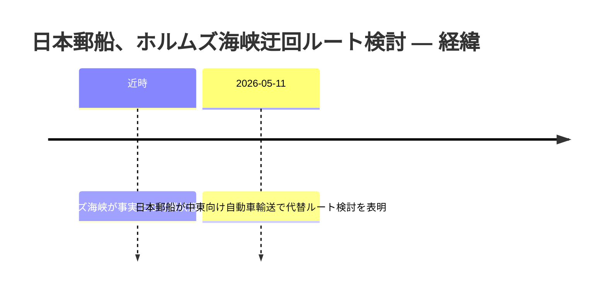
```mermaid
timeline
  title 日本郵船、ホルムズ海峡迂回ルート検討 — 経緯
  近時 : ホルムズ海峡が事実上の封鎖状態に陥る
  2026-05-11 : 日本郵船が中東向け自動車輸送で代替ルート検討を表明
```

### 当事者マップ

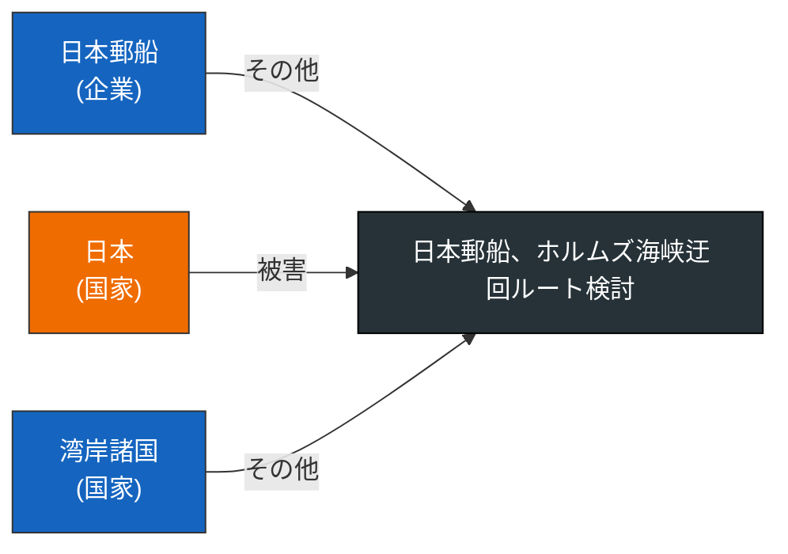
```mermaid
flowchart LR
  T["日本郵船、ホルムズ海峡迂回ルート検討"]
  A0["日本郵船\n(企業)"]
  A0 -- その他 --> T
  style A0 fill:#1565c0,color:#fff,stroke:#333
  A1["日本\n(国家)"]
  A1 -- 被害 --> T
  style A1 fill:#ef6c00,color:#fff,stroke:#333
  A2["湾岸諸国\n(国家)"]
  A2 -- その他 --> T
  style A2 fill:#1565c0,color:#fff,stroke:#333
  style T fill:#263238,color:#fff,stroke:#000
```

### 影響の広がり

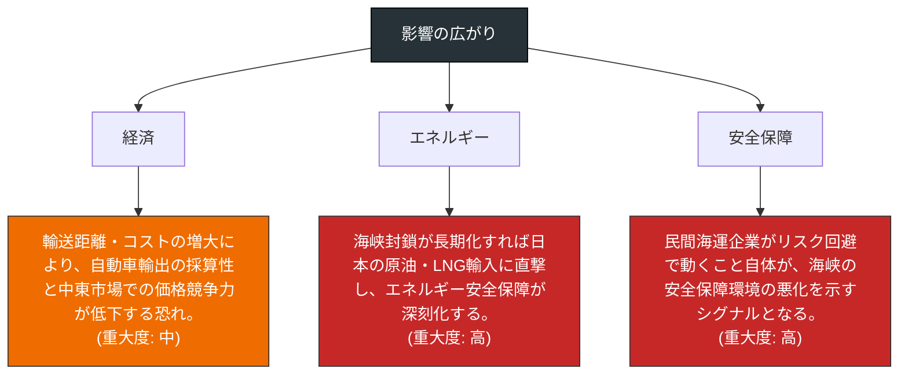
```mermaid
flowchart TB
  R["影響の広がり"]
  D0["経済"]
  I0["輸送距離・コストの増大により、自動車輸出の採算性と中東市場での価格競争力が低下する恐れ。\n(重大度: 中)"]
  R --> D0 --> I0
  style I0 fill:#ef6c00,color:#fff,stroke:#333
  D1["エネルギー"]
  I1["海峡封鎖が長期化すれば日本の原油・LNG輸入に直撃し、エネルギー安全保障が深刻化する。\n(重大度: 高)"]
  R --> D1 --> I1
  style I1 fill:#c62828,color:#fff,stroke:#333
  D2["安全保障"]
  I2["民間海運企業がリスク回避で動くこと自体が、海峡の安全保障環境の悪化を示すシグナルとなる。\n(重大度: 高)"]
  R --> D2 --> I2
  style I2 fill:#c62828,color:#fff,stroke:#333
  style R fill:#263238,color:#fff,stroke:#000
```

### 当事者の関係ネットワーク

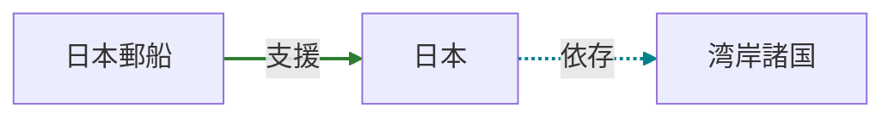
```mermaid
graph LR
  N0["日本郵船"]
  N1["日本"]
  N2["湾岸諸国"]
  N1 -->|依存| N2
  N0 -->|支援| N1
  linkStyle 0 stroke:#00838f,stroke-width:2px,stroke-dasharray:2 2;
  linkStyle 1 stroke:#2e7d32,stroke-width:2px;
```

### 押さえるべき論点

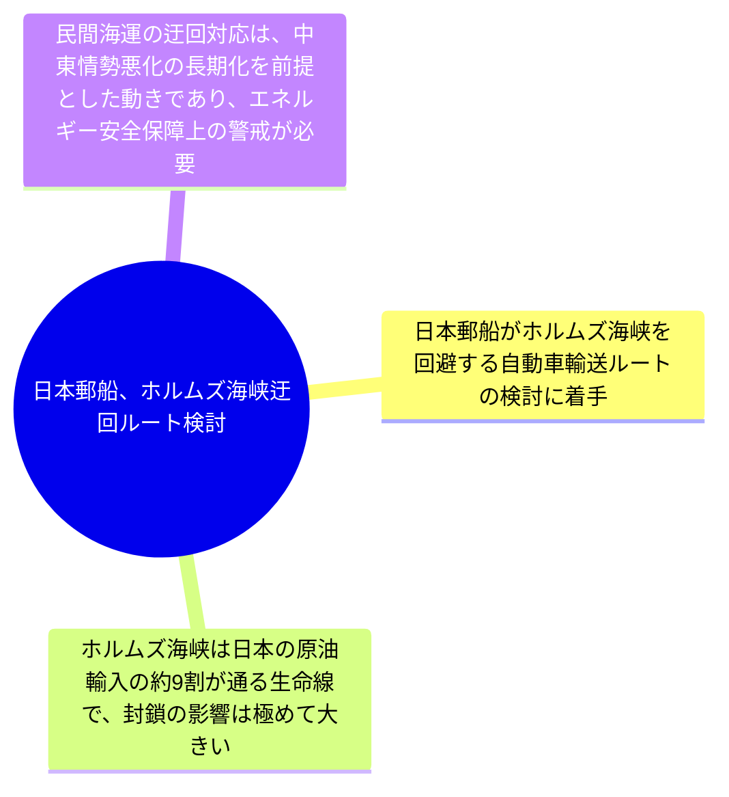
```mermaid
mindmap
  root((日本郵船、ホルムズ海峡迂回ルート検討))
    日本郵船がホルムズ海峡を回避する自動車輸送ルートの検討に着手
    ホルムズ海峡は日本の原油輸入の約9割が通る生命線で、封鎖の影響は極めて大きい
    民間海運の迂回対応は、中東情勢悪化の長期化を前提とした動きであり、エネルギー安全保障上の警戒が必要
```

---

## 米イラン協議が難航、双方が強硬姿勢 `重要度: 高` `middle_east / global`
- **出典:** NHK 国際 ([原文](http://www3.nhk.or.jp/news/html/20260510/k10015118051000.html)) / **公開:** 2026-05-11 19:30

**要約**
米イランの戦闘終結に向けた協議で、イラン側はアメリカの提案に回答し、すべての戦線での戦闘終結や対イラン制裁の解除などを要求した。これに対しトランプ大統領は「まったく受け入れられない」と拒否姿勢を示した。一方、イラン側は「要求は過剰ではない」と反論し、アメリカをけん制している。協議の行方は不透明で、中東情勢の緊張緩和の見通しは立っていない。

**背景**
2018年の米国によるJCPOA離脱以降、米イラン関係は悪化し、第2次トランプ政権は「最大限の圧力」路線を再開している。2023年10月以降のガザ紛争を契機にイラン支援の「抵抗の枢軸」とイスラエル・米国との衝突が拡大し、イラン本土への直接攻撃も発生するなど地域全体が不安定化している。

**要点**
- イランは戦闘終結と制裁解除を要求、トランプ氏は「受け入れ不能」と即時拒否

- 双方が強硬姿勢を崩さず、協議の行方は不透明で決裂リスクも

- 中東情勢の再悪化は日本のエネルギー安全保障に直接的影響を及ぼす可能性

### 経緯タイムライン

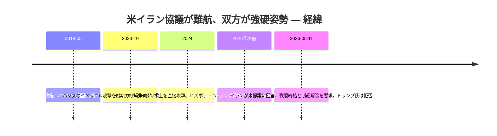
```mermaid
timeline
  title 米イラン協議が難航、双方が強硬姿勢 — 経緯
  2018-05 : トランプ第1次政権、JCPOAを離脱し対イラン制裁を復活
  2023-10 : ハマスのイスラエル攻撃を機にガザ紛争勃発、「抵抗の枢軸」が連動
  2024 : イスラエルがイラン本土を直接攻撃、ヒズボラ・ハマス幹部が相次ぎ殺害
  2026年以前 : 第2次トランプ政権が米イラン協議を提案
  2026-05-11 : イランが米提案に回答、戦闘終結と制裁解除を要求。トランプ氏は拒否
```

### 当事者マップ

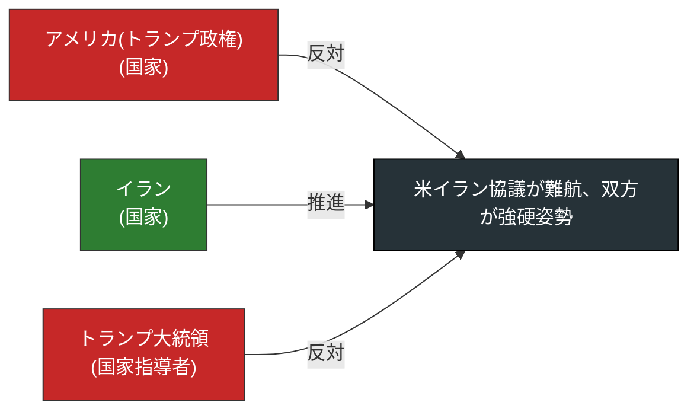
```mermaid
flowchart LR
  T["米イラン協議が難航、双方が強硬姿勢"]
  A0["アメリカ(トランプ政権)\n(国家)"]
  A0 -- 反対 --> T
  style A0 fill:#c62828,color:#fff,stroke:#333
  A1["イラン\n(国家)"]
  A1 -- 推進 --> T
  style A1 fill:#2e7d32,color:#fff,stroke:#333
  A2["トランプ大統領\n(国家指導者)"]
  A2 -- 反対 --> T
  style A2 fill:#c62828,color:#fff,stroke:#333
  style T fill:#263238,color:#fff,stroke:#000
```

### 影響の広がり

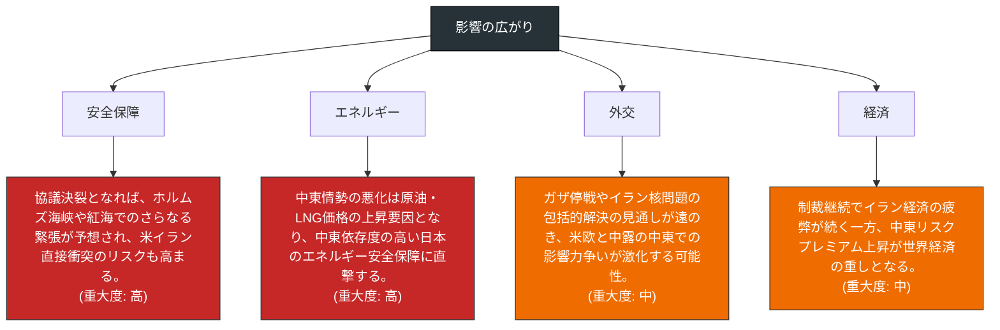
```mermaid
flowchart TB
  R["影響の広がり"]
  D0["安全保障"]
  I0["協議決裂となれば、ホルムズ海峡や紅海でのさらなる緊張が予想され、米イラン直接衝突のリスクも高まる。\n(重大度: 高)"]
  R --> D0 --> I0
  style I0 fill:#c62828,color:#fff,stroke:#333
  D1["エネルギー"]
  I1["中東情勢の悪化は原油・LNG価格の上昇要因となり、中東依存度の高い日本のエネルギー安全保障に直撃する。\n(重大度: 高)"]
  R --> D1 --> I1
  style I1 fill:#c62828,color:#fff,stroke:#333
  D2["外交"]
  I2["ガザ停戦やイラン核問題の包括的解決の見通しが遠のき、米欧と中露の中東での影響力争いが激化する可能性。\n(重大度: 中)"]
  R --> D2 --> I2
  style I2 fill:#ef6c00,color:#fff,stroke:#333
  D3["経済"]
  I3["制裁継続でイラン経済の疲弊が続く一方、中東リスクプレミアム上昇が世界経済の重しとなる。\n(重大度: 中)"]
  R --> D3 --> I3
  style I3 fill:#ef6c00,color:#fff,stroke:#333
  style R fill:#263238,color:#fff,stroke:#000
```

### 当事者の関係ネットワーク

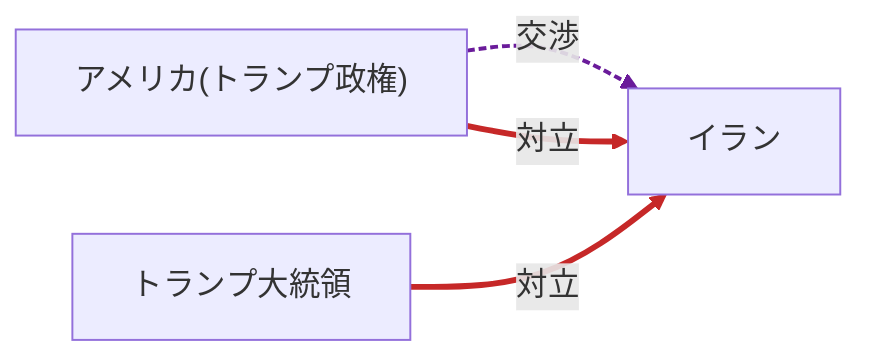
```mermaid
graph LR
  N0["アメリカ(トランプ政権)"]
  N1["イラン"]
  N2["トランプ大統領"]
  N0 -->|交渉| N1
  N0 -->|対立| N1
  N2 -->|対立| N1
  linkStyle 0 stroke:#6a1b9a,stroke-width:2px,stroke-dasharray:4 2;
  linkStyle 1 stroke:#c62828,stroke-width:3px;
  linkStyle 2 stroke:#c62828,stroke-width:3px;
```

### 押さえるべき論点

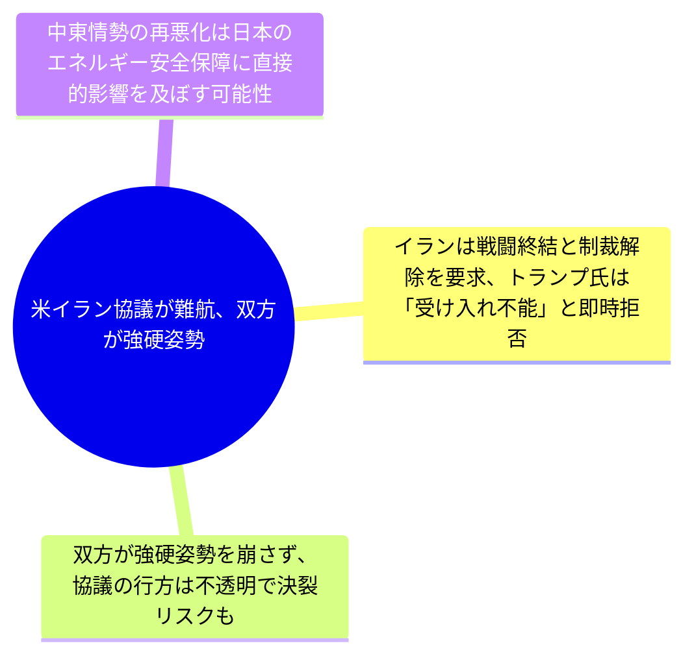
```mermaid
mindmap
  root((米イラン協議が難航、双方が強硬姿勢))
    イランは戦闘終結と制裁解除を要求、トランプ氏は「受け入れ不能」と即時拒否
    双方が強硬姿勢を崩さず、協議の行方は不透明で決裂リスクも
    中東情勢の再悪化は日本のエネルギー安全保障に直接的影響を及ぼす可能性
```

---

## ウクライナ連れ去り児童巡り国際会議 `重要度: 中` `europe / global`
- **出典:** NHK 国際 ([原文](http://www3.nhk.or.jp/news/html/20260512/k10015118981000.html)) / **公開:** 2026-05-12 06:40

**要約**
ロシアに連れ去られたウクライナの子どもたちの問題を議論する国際会議が、5月11日にベルギーで開催されました。各国の代表が集まり、子どもたちのウクライナへの帰還に向けた取り組みを強化していくことを確認しました。この問題は人道上の重大な懸念として国際的に注目されており、ロシアによる戦争犯罪の一つとしても取り上げられています。

**背景**
ロシアによるウクライナ侵攻以降、多数のウクライナの子どもたちがロシア側に連れ去られたとされ、国際刑事裁判所(ICC)はプーチン大統領に対し、この問題に関連して逮捕状を出しています。ウクライナと支援国は子どもたちの帰還を最重要課題の一つに位置付けています。

**要点**
- ベルギーで連れ去られたウクライナ児童に関する国際会議が開催された

- 各国は子どもたちの帰還に向けた取り組み強化を確認した

- ICCがすでにプーチン大統領に逮捕状を出すなど、戦争犯罪としての国際的な追及が続いている

### 経緯タイムライン

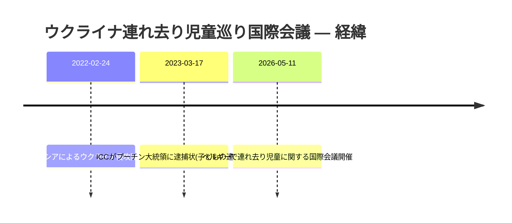
```mermaid
timeline
  title ウクライナ連れ去り児童巡り国際会議 — 経緯
  2022-02-24 : ロシアによるウクライナ侵攻開始
  2023-03-17 : ICCがプーチン大統領に逮捕状(子どもの連れ去り関連)
  2026-05-11 : ベルギーで連れ去り児童に関する国際会議開催
```

### 当事者マップ

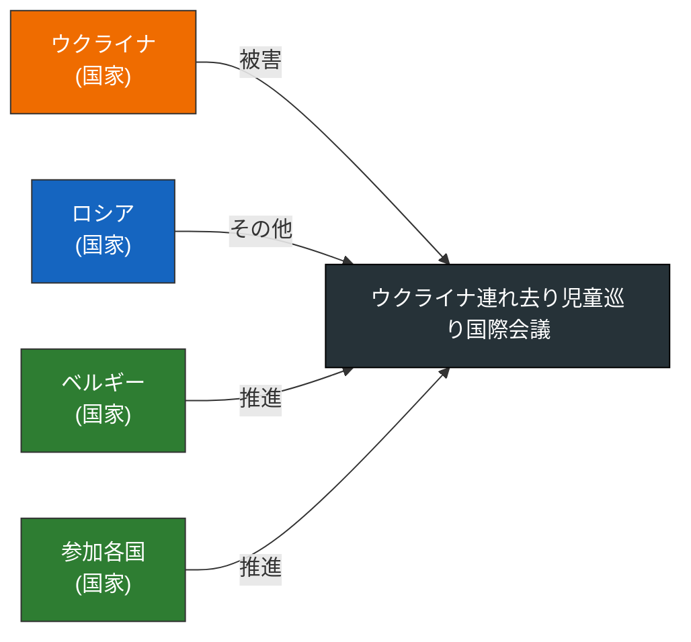
```mermaid
flowchart LR
  T["ウクライナ連れ去り児童巡り国際会議"]
  A0["ウクライナ\n(国家)"]
  A0 -- 被害 --> T
  style A0 fill:#ef6c00,color:#fff,stroke:#333
  A1["ロシア\n(国家)"]
  A1 -- その他 --> T
  style A1 fill:#1565c0,color:#fff,stroke:#333
  A2["ベルギー\n(国家)"]
  A2 -- 推進 --> T
  style A2 fill:#2e7d32,color:#fff,stroke:#333
  A3["参加各国\n(国家)"]
  A3 -- 推進 --> T
  style A3 fill:#2e7d32,color:#fff,stroke:#333
  style T fill:#263238,color:#fff,stroke:#000
```

### 影響の広がり

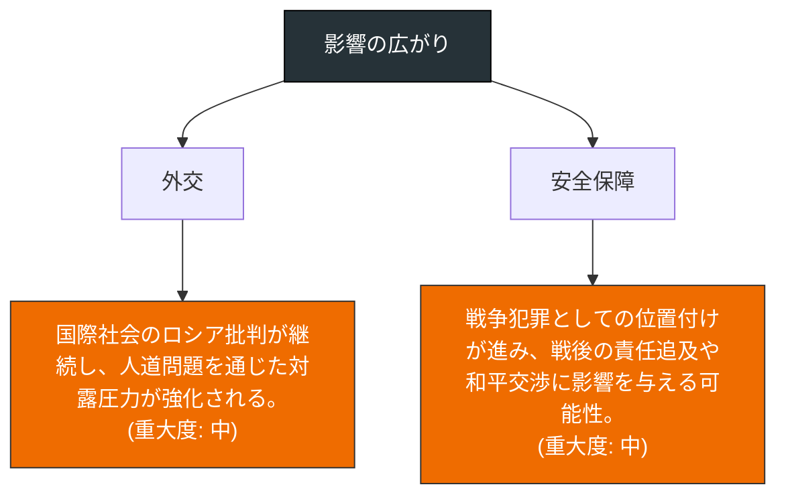
```mermaid
flowchart TB
  R["影響の広がり"]
  D0["外交"]
  I0["国際社会のロシア批判が継続し、人道問題を通じた対露圧力が強化される。\n(重大度: 中)"]
  R --> D0 --> I0
  style I0 fill:#ef6c00,color:#fff,stroke:#333
  D1["安全保障"]
  I1["戦争犯罪としての位置付けが進み、戦後の責任追及や和平交渉に影響を与える可能性。\n(重大度: 中)"]
  R --> D1 --> I1
  style I1 fill:#ef6c00,color:#fff,stroke:#333
  style R fill:#263238,color:#fff,stroke:#000
```

### 当事者の関係ネットワーク

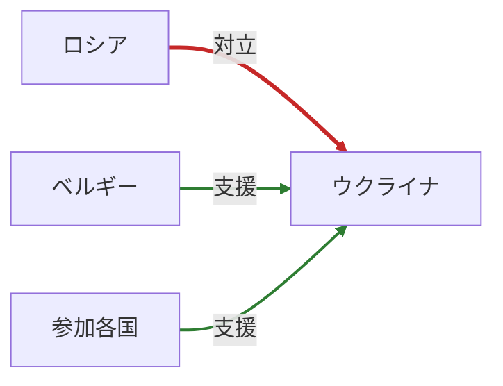
```mermaid
graph LR
  N0["ウクライナ"]
  N1["ロシア"]
  N2["ベルギー"]
  N3["参加各国"]
  N1 -->|対立| N0
  N2 -->|支援| N0
  N3 -->|支援| N0
  linkStyle 0 stroke:#c62828,stroke-width:3px;
  linkStyle 1 stroke:#2e7d32,stroke-width:2px;
  linkStyle 2 stroke:#2e7d32,stroke-width:2px;
```

### 押さえるべき論点

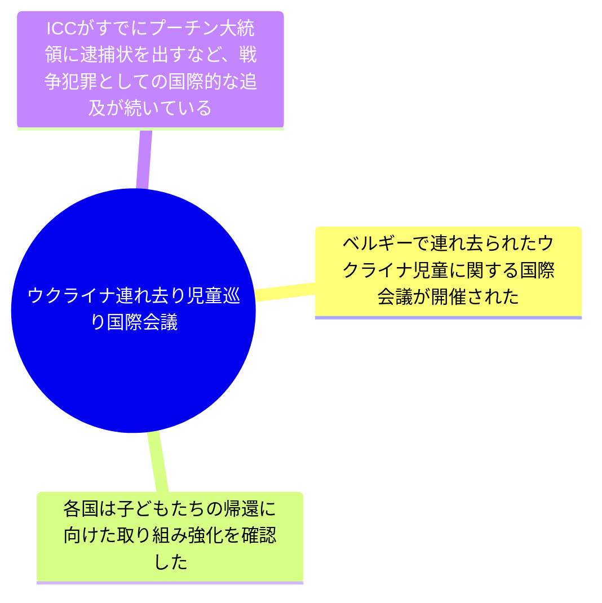
```mermaid
mindmap
  root((ウクライナ連れ去り児童巡り国際会議))
    ベルギーで連れ去られたウクライナ児童に関する国際会議が開催された
    各国は子どもたちの帰還に向けた取り組み強化を確認した
    ICCがすでにプーチン大統領に逮捕状を出すなど、戦争犯罪としての国際的な追及が続いている
```

---

## 台湾、WHO総会に10年連続不招待 `重要度: 中` `east_asia / global`
- **出典:** NHK 国際 ([原文](http://www3.nhk.or.jp/news/html/20260512/k10015118951000.html)) / **公開:** 2026-05-12 05:53

**要約**
台湾の衛生当局は、来週開催されるWHO世界保健機関の年次総会への招待状を受け取っていないと明らかにした。これに対し中国外務省は「台湾地区の参加に同意しないことを決めた」と表明した。台湾が招待されないのは10年連続となる見通しで、国際保健の場からの台湾排除が常態化している。

**背景**
台湾は2009年から2016年まで馬英九政権下でオブザーバーとしてWHO総会に参加していたが、独立志向の民進党・蔡英文政権発足後の2017年以降、中国の反対により招待が途絶えている。中国は「一つの中国」原則に基づき、台湾の国際機関参加を一貫して阻止している。

**要点**
- 台湾はWHO総会に10年連続で招待されない見通しで、中国の圧力による国際的孤立が固定化

- 中国外務省は「台湾地区の参加に同意しない」と明言、一つの中国原則を貫く姿勢

- 感染症情報の国際共有から台湾が外れることは、地域の公衆衛生面でもリスクとなる

- 頼清徳政権発足後、中国による台湾の国際空間圧縮はさらに強まっている

### 経緯タイムライン

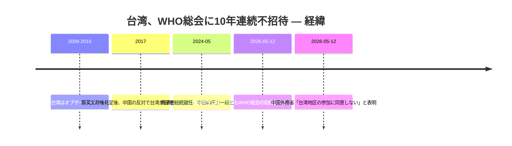
```mermaid
timeline
  title 台湾、WHO総会に10年連続不招待 — 経緯
  2009-2016 : 馬英九政権下で台湾はオブザーバーとしてWHO総会に参加
  2017 : 蔡英文政権発足後、中国の反対で台湾が招待されなくなる
  2024-05 : 頼清徳総統就任、中国の圧力一段と強化
  2026-05-12 : 台湾衛生当局、今年もWHO総会の招待状を受け取っていないと発表
  2026-05-12 : 中国外務省「台湾地区の参加に同意しない」と表明
```

### 当事者マップ

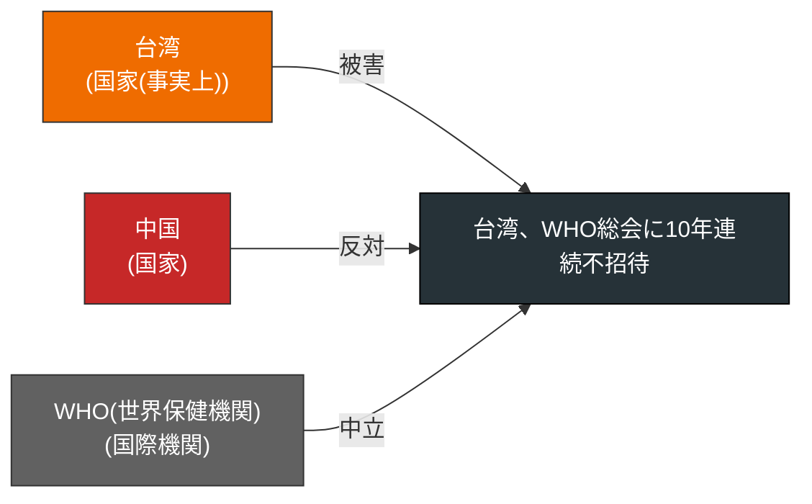
```mermaid
flowchart LR
  T["台湾、WHO総会に10年連続不招待"]
  A0["台湾\n(国家(事実上))"]
  A0 -- 被害 --> T
  style A0 fill:#ef6c00,color:#fff,stroke:#333
  A1["中国\n(国家)"]
  A1 -- 反対 --> T
  style A1 fill:#c62828,color:#fff,stroke:#333
  A2["WHO(世界保健機関)\n(国際機関)"]
  A2 -- 中立 --> T
  style A2 fill:#616161,color:#fff,stroke:#333
  style T fill:#263238,color:#fff,stroke:#000
```

### 影響の広がり

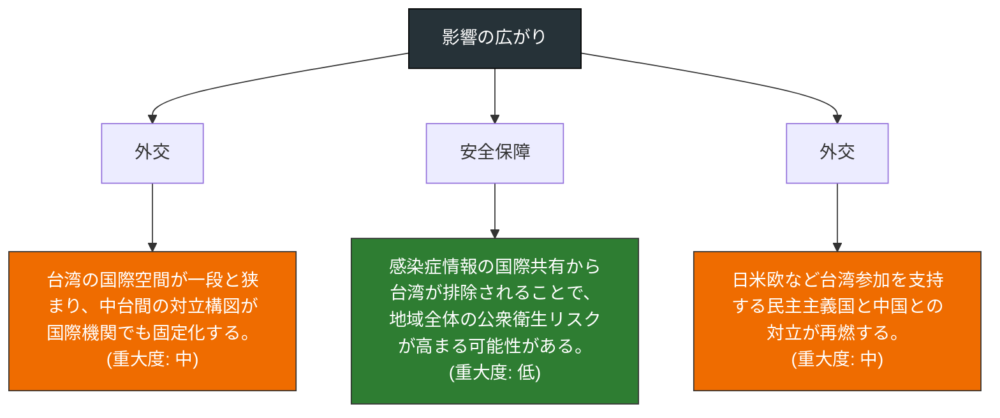
```mermaid
flowchart TB
  R["影響の広がり"]
  D0["外交"]
  I0["台湾の国際空間が一段と狭まり、中台間の対立構図が国際機関でも固定化する。\n(重大度: 中)"]
  R --> D0 --> I0
  style I0 fill:#ef6c00,color:#fff,stroke:#333
  D1["安全保障"]
  I1["感染症情報の国際共有から台湾が排除されることで、地域全体の公衆衛生リスクが高まる可能性がある。\n(重大度: 低)"]
  R --> D1 --> I1
  style I1 fill:#2e7d32,color:#fff,stroke:#333
  D2["外交"]
  I2["日米欧など台湾参加を支持する民主主義国と中国との対立が再燃する。\n(重大度: 中)"]
  R --> D2 --> I2
  style I2 fill:#ef6c00,color:#fff,stroke:#333
  style R fill:#263238,color:#fff,stroke:#000
```

### 当事者の関係ネットワーク

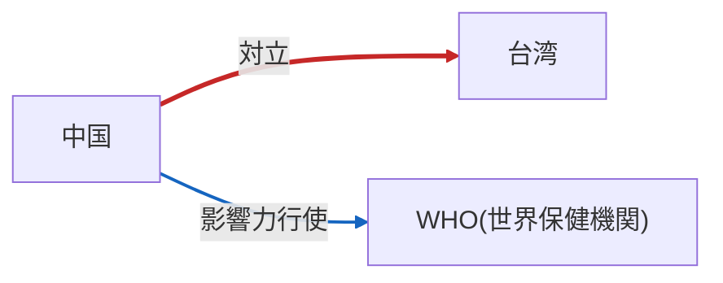
```mermaid
graph LR
  N0["台湾"]
  N1["中国"]
  N2["WHO(世界保健機関)"]
  N1 -->|対立| N0
  N1 -->|影響力行使| N2
  linkStyle 0 stroke:#c62828,stroke-width:3px;
  linkStyle 1 stroke:#1565c0,stroke-width:2px;
```

### 押さえるべき論点

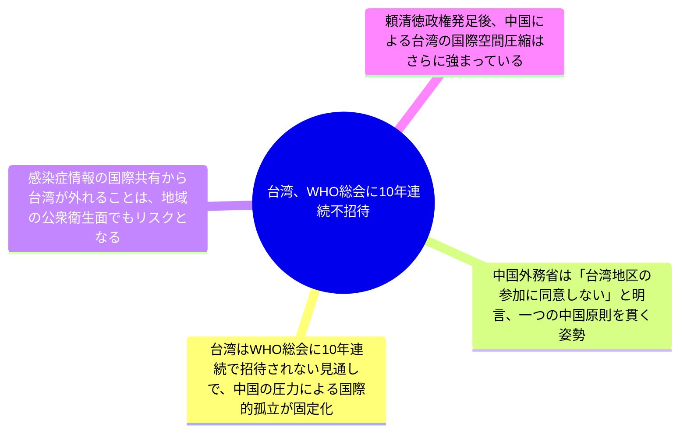
```mermaid
mindmap
  root((台湾、WHO総会に10年連続不招待))
    台湾はWHO総会に10年連続で招待されない見通しで、中国の圧力による国際的孤立が固定化
    中国外務省は「台湾地区の参加に同意しない」と明言、一つの中国原則を貫く姿勢
    感染症情報の国際共有から台湾が外れることは、地域の公衆衛生面でもリスクとなる
    頼清徳政権発足後、中国による台湾の国際空間圧縮はさらに強まっている
```

---

## アゼルバイジャン産原油、12日に日本到着 `重要度: 中` `middle_east / east_asia / global`
- **出典:** NHK 国際 ([原文](http://www3.nhk.or.jp/news/html/20260511/k10015118691000.html)) / **公開:** 2026-05-11 20:17

**要約**
経済産業省は11日、中東以外からの原油調達先として確保したアゼルバイジャン産原油が12日にも日本に到着する予定だと明らかにした。イラン情勢の悪化で中東からの安定供給が懸念される中、調達先の多角化を進める動き。日本は原油の約9割を中東に依存しており、ホルムズ海峡情勢の緊迫化はエネルギー安全保障に直結する。

**背景**
イラン核問題やイスラエルとの対立激化、紅海でのフーシ攻撃など中東情勢が不安定化しており、ホルムズ海峡を通る原油輸送への懸念が高まっている。日本は中東依存度が極めて高く、調達先の多角化が課題となってきた。

**要点**
- アゼルバイジャン産原油が12日にも日本に到着、中東以外からの調達先確保

- イラン情勢悪化を受けたエネルギー安全保障上の備え

- 原油約9割を中東に依存する日本にとって調達多角化は長年の課題

### 経緯タイムライン

```mermaid
timeline
  title アゼルバイジャン産原油、12日に日本到着 — 経緯
  2026年以前 : 中東情勢悪化で原油安定供給への懸念が拡大
  2026-05-11 : 経産省がアゼルバイジャン産原油の到着予定を発表
  2026-05-12 : アゼルバイジャン産原油が日本に到着予定
```

### 当事者マップ

```mermaid
flowchart LR
  T["アゼルバイジャン産原油、12日に日本到着"]
  A0["日本(経済産業省)\n(国家)"]
  A0 -- 推進 --> T
  style A0 fill:#2e7d32,color:#fff,stroke:#333
  A1["アゼルバイジャン\n(国家)"]
  A1 -- 推進 --> T
  style A1 fill:#2e7d32,color:#fff,stroke:#333
  A2["イラン\n(国家)"]
  A2 -- その他 --> T
  style A2 fill:#1565c0,color:#fff,stroke:#333
  style T fill:#263238,color:#fff,stroke:#000
```

### 影響の広がり

```mermaid
flowchart TB
  R["影響の広がり"]
  D0["エネルギー"]
  I0["中東以外からの調達実績は供給途絶リスクへの備えとなり、エネルギー安全保障を強化する。\n(重大度: 中)"]
  R --> D0 --> I0
  style I0 fill:#ef6c00,color:#fff,stroke:#333
  D1["経済"]
  I1["原油価格や輸送コストへの影響、調達ルート変更に伴うコスト増の可能性。\n(重大度: 低)"]
  R --> D1 --> I1
  style I1 fill:#2e7d32,color:#fff,stroke:#333
  D2["外交"]
  I2["カスピ海沿岸国アゼルバイジャンとのエネルギー協力強化につながる。\n(重大度: 低)"]
  R --> D2 --> I2
  style I2 fill:#2e7d32,color:#fff,stroke:#333
  style R fill:#263238,color:#fff,stroke:#000
```

### 当事者の関係ネットワーク

```mermaid
graph LR
  N0["日本(経済産業省)"]
  N1["アゼルバイジャン"]
  N2["イラン"]
  N0 -->|支援| N1
  N0 -->|依存| N2
  linkStyle 0 stroke:#2e7d32,stroke-width:2px;
  linkStyle 1 stroke:#00838f,stroke-width:2px,stroke-dasharray:2 2;
```

### 押さえるべき論点

```mermaid
mindmap
  root((アゼルバイジャン産原油、12日に日本到着))
    アゼルバイジャン産原油が12日にも日本に到着、中東以外からの調達先確保
    イラン情勢悪化を受けたエネルギー安全保障上の備え
    原油約9割を中東に依存する日本にとって調達多角化は長年の課題
```

---
